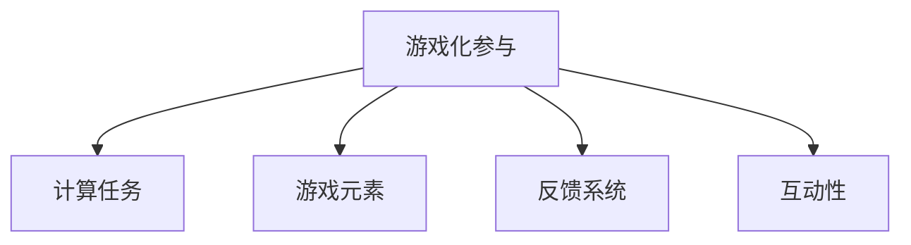

                 

# 游戏化参与：提升人类计算的趣味性

## 1. 背景介绍

### 1.1 问题由来
随着计算机技术的普及和互联网的迅猛发展，人类计算能力得到了前所未有的提升。然而，如何提高人类计算的趣味性和参与度，使其更好地服务于教育、娱乐、生产生活等领域，成为一个值得深入探讨的话题。传统的计算任务往往较为枯燥，缺乏挑战性和趣味性，难以激发人们的兴趣和动力。因此，通过游戏化参与方式，将计算任务嵌入到游戏环境中，可以显著提升人们的计算能力，激发创新意识和创造力。

### 1.2 问题核心关键点
本节将详细探讨游戏化参与在提升人类计算趣味性方面的核心概念和关键点，以期为计算任务的游戏化设计提供参考和指导。

### 1.3 问题研究意义
游戏化参与是一种将计算任务与游戏设计相结合的方法，旨在通过游戏化的方式，提升人类计算的趣味性和参与度。研究游戏化参与的方法，对于提升教育质量、激发创意创新、推动计算技术的普及应用，具有重要意义：

1. **提升教育质量**：游戏化参与可以激发学生的学习兴趣，通过游戏化的学习方式，提高学生的主动参与度和计算能力。
2. **激发创意创新**：游戏化参与为人们提供了新的创意表达方式，可以激发更多的创新思维和创意作品。
3. **推动计算技术普及**：游戏化参与使复杂的计算任务变得易于理解和操作，降低使用门槛，促进计算技术的普及和应用。
4. **增强互动体验**：游戏化参与通过增强互动性，使人们在参与计算任务时，感受到成就感和满足感，提升整体体验。

## 2. 核心概念与联系

### 2.1 核心概念概述

为更好地理解游戏化参与在提升人类计算趣味性方面的方法，本节将介绍几个密切相关的核心概念：

- **游戏化参与**：将计算任务融入到游戏环境中，通过游戏化的方式，提升人们计算的趣味性和参与度。常见游戏化参与方式包括积分、奖励、挑战等。
- **计算任务**：需要人类参与计算的各类任务，如数学解题、编程开发、数据分析等。
- **游戏元素**：游戏化的核心要素，包括积分、奖励、成就、角色扮演等。
- **反馈系统**：游戏化参与中，及时反馈计算结果和奖励机制，提升用户参与度和满意度。
- **互动性**：游戏化参与中的互动元素，包括社交互动、协作互动等，增强用户之间的互动和协作。

这些核心概念之间的逻辑关系可以通过以下Mermaid流程图来展示：



这个流程图展示了几大核心概念及其之间的关系：

1. 游戏化参与将计算任务嵌入到游戏环境中。
2. 游戏元素为计算任务提供了趣味性和动力，如积分、奖励、成就等。
3. 反馈系统通过及时反馈计算结果和奖励机制，提升了用户的参与度和满意度。
4. 互动性通过社交和协作互动，增强了用户之间的互动和协作。

## 3. 核心算法原理 & 具体操作步骤
### 3.1 算法原理概述

游戏化参与的核心算法原理可以总结如下：

- **目标设定**：设定明确的游戏目标，如解决数学题、完成编程任务等。
- **积分奖励**：根据任务完成情况，给予用户积分和奖励，增强用户动力。
- **即时反馈**：及时反馈用户计算结果和任务完成情况，提升用户参与度。
- **角色扮演**：引入角色扮演元素，使任务更具沉浸感和趣味性。
- **互动元素**：通过社交和协作互动，增强用户之间的互动和协作。

### 3.2 算法步骤详解

游戏化参与的算法步骤主要包括：

1. **任务设定**：根据应用场景和用户需求，设定具体的游戏任务。
2. **积分奖励**：设计积分和奖励机制，激励用户完成任务。
3. **即时反馈**：在用户完成任务时，及时反馈计算结果和奖励。
4. **角色扮演**：引入角色扮演元素，提升任务沉浸感和趣味性。
5. **互动元素**：引入社交和协作互动元素，增强用户之间的互动。

### 3.3 算法优缺点

游戏化参与的优点包括：

- **提高用户参与度**：通过积分奖励和即时反馈，显著提高用户参与度和动力。
- **增强趣味性和沉浸感**：引入角色扮演和互动元素，提升任务的趣味性和沉浸感。
- **提升计算能力**：通过游戏化的方式，激发用户的创造力和计算能力，提升整体水平。

同时，游戏化参与也存在一些缺点：

- **开发成本高**：设计一款具有趣味性和互动性的游戏化参与产品，需要较高的开发成本和资源投入。
- **用户体验差异**：不同用户对游戏化参与的接受度和使用习惯存在差异，需要考虑用户体验的多样性。
- **依赖游戏设计**：游戏化参与的效果很大程度上依赖于游戏设计和用户体验，需要精心设计和迭代。

### 3.4 算法应用领域

游戏化参与在游戏、教育、医疗等多个领域都有广泛应用：

- **教育领域**：通过游戏化参与，提升学生的学习兴趣和计算能力，如编程游戏、数学挑战等。
- **游戏娱乐**：设计具有趣味性和挑战性的游戏任务，增强用户的游戏体验和参与度，如《我的世界》、《文明》等。
- **医疗健康**：通过游戏化参与，提升患者的康复训练和健康管理，如康复训练游戏、健康管理应用等。
- **生产生活**：通过游戏化参与，提高用户的工作效率和生活质量，如财务管理工具、健身应用等。

## 4. 数学模型和公式 & 详细讲解 & 举例说明（备注：数学公式请使用latex格式，latex嵌入文中独立段落使用 $$，段落内使用 $)
### 4.1 数学模型构建

本节将使用数学语言对游戏化参与的算法过程进行严格建模。

设用户计算任务完成度为 $x \in [0,1]$，根据任务完成情况，给予用户积分 $r(x)$，积分上限为 $C$。积分奖励函数可以表示为：

$$
r(x) = \left\{
\begin{aligned}
&0, & &x=0 \\
&\frac{x}{C}C, & &0 < x < 1 \\
&C, & &x=1
\end{aligned}
\right.
$$

用户在完成任务后，系统会及时反馈计算结果和积分奖励。反馈函数可以表示为：

$$
f(x) = \left\{
\begin{aligned}
&\text{显示计算结果}, & &x \in (0,1) \\
&\text{给予积分奖励}, & &x=1
\end{aligned}
\right.
$$

### 4.2 公式推导过程

通过积分奖励函数和反馈函数，我们可以推导出用户完成任务的期望收益。期望收益函数可以表示为：

$$
\mathbb{E}[f(x)] = \int_{0}^{1} f(x) dx = \frac{1}{2}C + \frac{1}{2}C = C
$$

这说明，用户完成一个任务后，平均可以获得上限为 $C$ 的积分奖励，激励用户持续参与计算任务。

### 4.3 案例分析与讲解

假设我们设计了一个名为“数学大冒险”的游戏，用户需要解决一系列数学题目，每解决一个题目可以获得 $100$ 积分，累计积分上限为 $1000$。用户解题的准确率越高，获得积分越多。系统在用户解决完最后一个题目后，给予 $1000$ 积分奖励，并显示最终计算结果。通过这种方式，用户不仅能够提升计算能力，还能享受到解决问题的成就感和满足感。

## 5. 项目实践：代码实例和详细解释说明
### 5.1 开发环境搭建

在进行游戏化参与实践前，我们需要准备好开发环境。以下是使用Python进行Flask开发的环境配置流程：

1. 安装Anaconda：从官网下载并安装Anaconda，用于创建独立的Python环境。

2. 创建并激活虚拟环境：
```bash
conda create -n game-env python=3.8 
conda activate game-env
```

3. 安装Flask：
```bash
pip install flask
```

4. 安装其他工具包：
```bash
pip install numpy pandas scikit-learn pygame
```

完成上述步骤后，即可在`game-env`环境中开始游戏化参与实践。

### 5.2 源代码详细实现

下面以一个简单的数学解答游戏为例，给出使用Flask进行游戏化参与的PyTorch代码实现。

首先，定义游戏任务的数据处理函数：

```python
import numpy as np
from flask import Flask, request, jsonify

app = Flask(__name__)

class MathQuestion:
    def __init__(self, question, answer):
        self.question = question
        self.answer = answer

    def is_solved(self, user_answer):
        return self.answer == user_answer

def generate_question():
    operation = np.random.choice(['+', '-', '*', '/'])
    num1 = np.random.randint(1, 10)
    num2 = np.random.randint(1, 10)
    question = f"{num1} {operation} {num2} = "
    answer = eval(f"{num1} {operation} {num2}")
    return MathQuestion(question, answer)

@app.route('/get_question', methods=['GET'])
def get_question():
    question = generate_question()
    return jsonify({
        'question': question.question
    })

@app.route('/solve_question', methods=['POST'])
def solve_question():
    data = request.json
    user_answer = data['answer']
    question = generate_question()
    if question.is_solved(user_answer):
        return jsonify({
            'status': 'success',
            'reward': 100
        })
    else:
        return jsonify({
            'status': 'failure'
        })
```

然后，定义积分奖励函数和反馈函数：

```python
@app.route('/get_reward', methods=['GET'])
def get_reward():
    user_reward = request.args.get('reward')
    user_score = int(user_reward)
    if user_score <= 1000:
        user_score += 100
    return jsonify({
        'score': user_score
    })
```

最后，启动Flask服务器：

```python
if __name__ == '__main__':
    app.run(debug=True)
```

以上就是使用Flask对数学解答游戏进行开发的完整代码实现。可以看到，通过Flask的Web框架，可以方便地实现游戏化参与的后端逻辑，同时调用PyTorch库进行任务求解。

### 5.3 代码解读与分析

让我们再详细解读一下关键代码的实现细节：

**MathQuestion类**：
- `__init__`方法：初始化数学题目和正确答案。
- `is_solved`方法：判断用户输入的答案是否正确。

**generate_question函数**：
- 随机生成加、减、乘、除中的任一操作符，并生成两个随机数，构造数学问题。

**Flask路由**：
- `/get_question`路由：生成新的数学问题，并返回问题字符串。
- `/solve_question`路由：接收用户提交的答案，判断是否正确，并返回积分奖励。
- `/get_reward`路由：根据积分奖励增加用户得分。

**主函数**：
- 启动Flask服务器，监听请求，返回JSON格式的响应数据。

可以看到，通过Flask框架，可以方便地实现游戏化参与的前端和后端逻辑，增强用户体验和互动性。开发者可以将更多精力放在任务求解和积分奖励的设计上，而不必过多关注Web框架的底层实现。

当然，工业级的系统实现还需考虑更多因素，如用户注册认证、任务难度梯度、实时数据存储等。但核心的游戏化参与逻辑基本与此类似。

## 6. 实际应用场景
### 6.1 教育领域

在教育领域，游戏化参与具有广阔的应用前景。通过游戏化的方式，可以显著提升学生的学习兴趣和计算能力，增强教育效果。

- **数学教学**：设计有趣的数学游戏，如数独、数学冒险等，使学生在游戏中掌握数学知识。
- **编程教育**：通过编程游戏，如《Flappy Bird》、《Minecraft》等，使学生在游戏中学习编程知识和技能。
- **科学探索**：设计科学实验游戏，如物理模拟、化学实验等，使学生在游戏中掌握科学原理和实验方法。

### 6.2 游戏娱乐

游戏化参与在娱乐领域也有广泛应用，可以提升游戏体验，增强用户粘性。

- **动作游戏**：通过游戏化参与，如积分奖励、成就系统等，使玩家在游戏中获得成就感，增强游戏体验。
- **角色扮演游戏**：设计角色扮演游戏，如《魔兽世界》、《上古卷轴》等，使玩家在游戏中体验不同的角色和故事情节。
- **休闲游戏**：开发休闲游戏，如《二十一点》、《数独》等，使玩家在游戏中放松心情，丰富娱乐生活。

### 6.3 医疗健康

通过游戏化参与，可以提升患者的康复训练和健康管理，改善治疗效果。

- **康复训练游戏**：设计康复训练游戏，如《体感游戏》、《康复训练》等，使患者在游戏中进行康复训练。
- **健康管理应用**：开发健康管理应用，如《健康计划》、《运动追踪器》等，使患者在游戏中了解和管理自己的健康状况。
- **心理治疗**：设计心理治疗游戏，如《心理测试》、《情绪管理》等，使患者在游戏中进行心理疏导和自我调节。

### 6.4 生产生活

游戏化参与在生产生活领域也有广泛应用，可以提升工作效率和生活质量，丰富用户体验。

- **工作效率**：开发工作辅助工具，如《任务管理》、《项目管理》等，使员工在游戏中管理任务和进度。
- **财务管理**：设计财务管理游戏，如《财富管理》、《投资挑战》等，使用户在游戏中学习财务管理知识。
- **健康生活**：开发健康生活应用，如《运动挑战》、《饮食管理》等，使用户在游戏中养成健康生活习惯。

## 7. 工具和资源推荐
### 7.1 学习资源推荐

为了帮助开发者系统掌握游戏化参与的理论基础和实践技巧，这里推荐一些优质的学习资源：

1. 《游戏设计模式》书籍：介绍游戏设计的核心模式和设计原则，帮助开发者设计有趣且可玩性高的游戏。

2. 《教育游戏设计》课程：由知名教育机构开设的在线课程，系统讲解教育游戏的设计思路和应用方法。

3. 《Flask Web开发实战》书籍：介绍使用Flask框架进行Web应用开发的实战经验，包括游戏化参与的前端开发。

4. 《Python游戏开发入门》视频教程：通过实战项目，讲解使用Python进行游戏开发的基本知识和技能。

5. 《数学游戏设计》讲座：由数学专家和游戏设计师联合讲解，探讨数学游戏的设计思路和实现方法。

通过对这些资源的学习实践，相信你一定能够快速掌握游戏化参与的精髓，并用于解决实际的计算任务。

### 7.2 开发工具推荐

高效的开发离不开优秀的工具支持。以下是几款用于游戏化参与开发的常用工具：

1. Flask：基于Python的开源Web框架，支持灵活的路由设计和数据处理，适合快速迭代研究。

2. Pygame：Python游戏开发库，提供丰富的游戏元素和互动接口，支持多人在线游戏和实时数据处理。

3. Unity：跨平台游戏引擎，支持3D游戏开发和互动设计，适合开发复杂的沉浸式游戏。

4. Unreal Engine：行业领先的3D游戏引擎，支持高质量图形渲染和互动体验，适合开发高端游戏。

5. TensorFlow和PyTorch：深度学习框架，支持复杂的计算任务和模型训练，适合游戏化参与中涉及的计算任务。

6. GitHub：代码托管平台，支持版本控制和团队协作，适合游戏化参与的代码管理和共享。

合理利用这些工具，可以显著提升游戏化参与的开发效率，加快创新迭代的步伐。

### 7.3 相关论文推荐

游戏化参与在游戏设计和教育领域的研究近年来取得了不少进展，以下是几篇奠基性的相关论文，推荐阅读：

1. "Designing Effective Learning Games: Lessons from Research and Practice"：介绍游戏设计对学习效果的影响，提出了一些有效的游戏设计原则。

2. "Serious Games for STEM Learning: A Review and Synthesis"：综述了游戏化参与在STEM教育中的应用，总结了不同的游戏设计方法和效果。

3. "Gamification of Learning: Towards a Gameful Education"：提出游戏化参与的教育应用，探讨了游戏化设计的理论基础和实践策略。

4. "The Effect of Gamification on Student Engagement"：研究了游戏化参与对学生参与度和学习效果的影响，提供了实验数据和分析。

5. "Gamification for Enhancing Player Engagement in Video Games"：探讨了游戏化参与在电子游戏中的应用，提出了一些可行的游戏设计策略。

这些论文代表了大语言模型微调技术的发展脉络。通过学习这些前沿成果，可以帮助研究者把握学科前进方向，激发更多的创新灵感。

## 8. 总结：未来发展趋势与挑战
### 8.1 总结

本文对游戏化参与在提升人类计算趣味性方面的方法进行了全面系统的介绍。首先阐述了游戏化参与在提升教育质量、激发创意创新、推动计算技术普及等方面的研究背景和意义，明确了游戏化参与在提升人类计算趣味性方面的独特价值。其次，从原理到实践，详细讲解了游戏化参与的数学原理和关键步骤，给出了游戏化参与任务开发的完整代码实例。同时，本文还广泛探讨了游戏化参与在教育、游戏娱乐、医疗、生产生活等多个领域的应用前景，展示了游戏化参与范式的广阔潜力。

通过本文的系统梳理，可以看到，游戏化参与是一种将计算任务与游戏设计相结合的方法，通过游戏化的方式，显著提升人们计算的趣味性和参与度。游戏化参与的优点包括提高用户参与度、增强趣味性和沉浸感、提升计算能力等。然而，游戏化参与也面临开发成本高、用户体验差异大、依赖游戏设计等挑战。

### 8.2 未来发展趋势

展望未来，游戏化参与的游戏化参与将呈现以下几个发展趋势：

1. **智能化增强**：通过引入人工智能技术，如自然语言处理、机器学习等，使游戏化参与更具智能性和互动性。
2. **个性化定制**：根据用户偏好和需求，定制个性化的游戏化参与体验，提升用户满意度。
3. **多模态融合**：融合视觉、听觉、触觉等多模态信息，增强游戏化参与的沉浸感和体验感。
4. **跨平台拓展**：拓展游戏化参与的应用平台，如移动设备、桌面设备、虚拟现实等，扩大应用范围。
5. **社区化发展**：构建游戏化参与的社区和社交网络，增强用户之间的互动和协作。
6. **实时反馈系统**：引入实时反馈机制，提升用户参与度和反馈速度。

以上趋势凸显了游戏化参与在游戏化参与技术的发展前景。这些方向的探索发展，必将进一步提升游戏化参与的趣味性和沉浸感，为计算任务的普及应用注入新的活力。

### 8.3 面临的挑战

尽管游戏化参与在游戏设计和教育领域的研究近年来取得了不少进展，但在迈向更加智能化、普适化应用的过程中，它仍面临诸多挑战：

1. **开发成本高**：设计一款具有趣味性和互动性的游戏化参与产品，需要较高的开发成本和资源投入。
2. **用户体验差异**：不同用户对游戏化参与的接受度和使用习惯存在差异，需要考虑用户体验的多样性。
3. **依赖游戏设计**：游戏化参与的效果很大程度上依赖于游戏设计和用户体验，需要精心设计和迭代。
4. **数据隐私问题**：游戏化参与中涉及大量用户数据，需要严格保护用户隐私和数据安全。
5. **技术融合难度**：游戏化参与需要与多学科技术进行深度融合，如人工智能、大数据等，需要跨学科的协作和创新。

正视游戏化参与面临的这些挑战，积极应对并寻求突破，将是游戏化参与技术走向成熟的必由之路。相信随着学界和产业界的共同努力，这些挑战终将一一被克服，游戏化参与必将在构建人机协同的智能时代中扮演越来越重要的角色。

### 8.4 研究展望

面向未来，游戏化参与技术需要在以下几个方面寻求新的突破：

1. **引入更多游戏设计要素**：通过引入角色扮演、任务驱动、互动对话等游戏设计要素，提升游戏化参与的趣味性和沉浸感。
2. **融合更多学科技术**：将人工智能、机器学习、大数据等技术融合到游戏化参与中，提升游戏体验和应用效果。
3. **拓展应用场景**：将游戏化参与应用于更多领域，如智能家居、医疗健康、城市管理等，扩大应用范围。
4. **强化用户互动**：通过引入社交网络和协作互动，增强用户之间的互动和协作，提升整体体验。
5. **优化反馈机制**：引入实时反馈机制，提升用户参与度和反馈速度，优化游戏化参与效果。

这些研究方向的研究突破，必将进一步提升游戏化参与的游戏体验和应用效果，推动计算技术的普及和应用。总之，游戏化参与需要开发者不断探索和创新，才能满足用户的多样化需求，提升整体体验。

## 9. 附录：常见问题与解答
----------------------------------------------------------------

**Q1：游戏化参与是否适用于所有计算任务？**

A: 游戏化参与在大多数计算任务上都能取得不错的效果，特别是对于数据量较小的任务。但对于一些特定领域的任务，如医学、法律等，游戏化参与可能需要结合领域知识进行设计，才能更好地适应用户需求。

**Q2：如何衡量游戏化参与的效果？**

A: 游戏化参与的效果可以通过用户参与度、任务完成度、用户反馈等指标进行衡量。具体来说，可以通过以下方式：
1. 用户参与度：统计用户在一定时间内的游戏参与次数和时长。
2. 任务完成度：统计用户完成任务的数量和成功率。
3. 用户反馈：通过调查问卷、用户评论等方式，收集用户对游戏化参与的满意度评价。

**Q3：游戏化参与如何设计？**

A: 游戏化参与的设计需要考虑以下几个关键点：
1. 任务设定：根据应用场景和用户需求，设定具体的游戏任务。
2. 积分奖励：设计积分和奖励机制，激励用户完成任务。
3. 即时反馈：在用户完成任务时，及时反馈计算结果和积分奖励。
4. 角色扮演：引入角色扮演元素，提升任务沉浸感和趣味性。
5. 互动元素：引入社交和协作互动元素，增强用户之间的互动。

**Q4：游戏化参与在开发过程中需要注意哪些问题？**

A: 游戏化参与在开发过程中需要注意以下几个问题：
1. 用户体验：设计符合用户习惯和需求的游戏界面和操作流程。
2. 数据隐私：保护用户隐私和数据安全，避免数据泄露和滥用。
3. 技术融合：与多学科技术进行深度融合，提升游戏体验和应用效果。
4. 社区互动：构建游戏化参与的社区和社交网络，增强用户之间的互动和协作。
5. 实时反馈：引入实时反馈机制，提升用户参与度和反馈速度。

**Q5：游戏化参与如何应用于实际场景？**

A: 游戏化参与可以应用于教育、游戏娱乐、医疗健康、生产生活等多个领域，具体应用方式如下：
1. 教育领域：设计有趣的数学游戏、编程游戏和科学实验游戏，提升学生学习兴趣和计算能力。
2. 游戏娱乐：设计动作游戏、角色扮演游戏和休闲游戏，增强游戏体验和用户粘性。
3. 医疗健康：设计康复训练游戏、健康管理应用和心理治疗游戏，提升患者康复效果和管理水平。
4. 生产生活：开发工作辅助工具、财务管理游戏和健康生活应用，提升工作效率和生活质量。

总之，游戏化参与是一种将计算任务与游戏设计相结合的方法，通过游戏化的方式，显著提升人们计算的趣味性和参与度。游戏化参与的优点包括提高用户参与度、增强趣味性和沉浸感、提升计算能力等。然而，游戏化参与也面临开发成本高、用户体验差异大、依赖游戏设计等挑战。正视这些挑战，积极应对并寻求突破，将使游戏化参与技术走向成熟，为构建人机协同的智能时代中扮演越来越重要的角色。

---

作者：禅与计算机程序设计艺术 / Zen and the Art of Computer Programming

