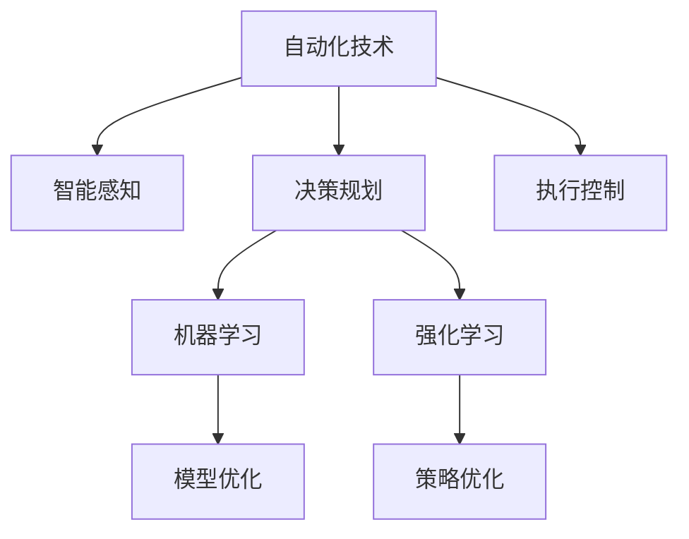

                 

## 1. 背景介绍

### 1.1 问题由来
随着全球科技的迅猛发展，自动化技术已经成为推动社会进步的重要引擎。在制造业、物流、农业等众多行业中，自动化技术的应用不仅提高了生产效率，还显著降低了人力成本。近年来，物理实体自动化的需求日益增长，出现了许多创新技术和方法。然而，由于物理实体的复杂性和多样性，实现真正意义上的自动化仍然面临诸多挑战。本文将全面介绍物理实体自动化的最新进展，深入探讨其中的核心概念和前沿技术。

### 1.2 问题核心关键点
物理实体自动化涉及对物理世界的智能操作，旨在通过自动化技术实现对物理实体的控制和优化。其核心关键点包括：

1. **自动化技术**：指利用计算机、机器人、传感器等技术，实现对物理实体的自动化控制。
2. **智能感知**：通过图像识别、语音识别、环境感知等技术，获取物理实体的状态信息。
3. **决策规划**：在获取实体状态信息的基础上，通过智能算法进行任务规划和路径优化。
4. **执行控制**：将决策结果转化为具体的控制命令，执行对物理实体的操作。
5. **学习优化**：通过机器学习、强化学习等技术，不断优化自动化系统的性能。

这些关键点共同构成了物理实体自动化的技术框架，使其能够在不同场景下发挥强大的作用。

## 2. 核心概念与联系

### 2.1 核心概念概述

为更好地理解物理实体自动化的最新趋势，本节将介绍几个密切相关的核心概念：

- **自动化技术**：指利用计算机、机器人、传感器等技术，实现对物理实体的自动化控制。常见的自动化技术包括工业机器人、自动驾驶、无人机等。
- **智能感知**：通过图像识别、语音识别、环境感知等技术，获取物理实体的状态信息。智能感知技术是实现物理实体自动化的基础。
- **决策规划**：在获取实体状态信息的基础上，通过智能算法进行任务规划和路径优化。常见的决策规划方法包括A*、RRT、DQN等。
- **执行控制**：将决策结果转化为具体的控制命令，执行对物理实体的操作。执行控制技术包括关节控制、力控制、视觉伺服等。
- **学习优化**：通过机器学习、强化学习等技术，不断优化自动化系统的性能。学习优化技术是提高自动化系统智能性的重要手段。

这些核心概念之间的逻辑关系可以通过以下Mermaid流程图来展示：



这个流程图展示了几大核心概念之间的关联：

1. 自动化技术为智能感知、决策规划和执行控制提供了物理平台。
2. 智能感知技术获取物理实体状态信息，为决策规划提供依据。
3. 决策规划技术在获取状态信息的基础上，生成具体的控制命令。
4. 执行控制技术将决策结果转化为物理操作，完成对实体的控制。
5. 学习优化技术通过模型和策略优化，提高自动化系统的智能性和适应性。

## 3. 核心算法原理 & 具体操作步骤

### 3.1 算法原理概述

物理实体自动化涉及对物理世界的智能操作，通常包括感知、决策、执行和优化等环节。其核心算法原理主要包括以下几个方面：

- **智能感知算法**：包括图像识别、语音识别、环境感知等技术，用于获取物理实体的状态信息。
- **决策规划算法**：包括路径规划、任务调度等技术，用于生成具体的控制命令。
- **执行控制算法**：包括关节控制、力控制、视觉伺服等技术，用于实现对物理实体的精确控制。
- **学习优化算法**：包括机器学习、强化学习等技术，用于不断优化自动化系统的性能。

这些算法共同构成了物理实体自动化的核心技术框架，使其能够在不同场景下发挥强大的作用。

### 3.2 算法步骤详解

物理实体自动化的操作步骤主要包括：

1. **数据采集**：通过传感器、摄像头、麦克风等设备，采集物理实体的状态信息。
2. **智能感知**：利用图像识别、语音识别、环境感知等技术，对采集到的数据进行分析和处理，获取物理实体的状态信息。
3. **决策规划**：根据实体的状态信息和任务需求，通过路径规划、任务调度等算法，生成具体的控制命令。
4. **执行控制**：将生成的控制命令转化为具体的物理操作，如关节控制、力控制、视觉伺服等。
5. **学习优化**：通过机器学习、强化学习等技术，不断优化自动化系统的性能，提高其适应性和智能性。

### 3.3 算法优缺点

物理实体自动化的核心算法具有以下优点：

1. **效率高**：自动化技术能够显著提高生产效率，降低人力成本。
2. **精确度高**：智能感知和执行控制技术能够实现对物理实体的精确控制。
3. **适应性强**：学习优化技术能够不断优化自动化系统的性能，提高其适应性。

同时，这些算法也存在以下局限性：

1. **复杂度高**：物理实体自动化涉及的环节众多，系统设计复杂。
2. **成本高**：自动化设备和高精度传感器的成本较高，增加了系统的初始投资。
3. **依赖环境**：自动化系统对环境的依赖较大，可能受到环境变化的影响。

尽管存在这些局限性，但物理实体自动化仍是大势所趋，将成为未来工业和技术发展的重要方向。

### 3.4 算法应用领域

物理实体自动化的核心算法在多个领域得到了广泛应用，主要包括：

1. **工业制造**：通过自动化设备，实现对生产线的自动化控制和优化，提高生产效率和产品质量。
2. **智能物流**：利用无人驾驶和机器人技术，实现仓储、分拣、配送等物流环节的自动化。
3. **农业机械化**：通过自动化设备和传感器，实现对农作物的自动化监控和操作，提高农业生产效率。
4. **医疗设备**：通过机器人技术，实现对手术、康复、护理等医疗环节的自动化。
5. **环保监测**：利用无人机和传感器，实现对环境的自动化监测和数据分析。

## 4. 数学模型和公式 & 详细讲解 & 举例说明

### 4.1 数学模型构建

物理实体自动化的核心算法通常涉及复杂的数学模型。以下是几个典型的数学模型：

1. **图像识别模型**：用于获取物理实体的状态信息。常见的模型包括卷积神经网络(CNN)、循环神经网络(RNN)等。
2. **路径规划模型**：用于生成具体的控制命令。常见的模型包括A*算法、D*算法等。
3. **力控制模型**：用于实现对物理实体的精确控制。常见的模型包括基于力反馈的控制器等。
4. **强化学习模型**：用于不断优化自动化系统的性能。常见的模型包括Q-learning、SARSA等。

### 4.2 公式推导过程

以A*路径规划算法为例，其核心公式如下：

$$
F(n) = G(n) + H(n)
$$

其中，$G(n)$表示从起点到节点$n$的实际代价，$H(n)$表示从节点$n$到终点的估计代价。该公式将路径规划问题转化为求解最小代价路径问题。

### 4.3 案例分析与讲解

以下通过一个具体的案例，分析A*路径规划算法在自动化系统中的应用：

假设有一辆自动驾驶车辆需要在城市道路中行驶，从起点A到终点B。为了实现路径规划，车辆首先需要获取当前位置和道路信息，通过图像识别和环境感知技术获取周围环境的状态信息。接着，根据道路信息，利用A*算法生成从起点A到终点B的最小代价路径。最后，车辆根据生成的路径，控制行驶速度和方向，完成路径导航。

## 5. 项目实践：代码实例和详细解释说明

### 5.1 开发环境搭建

在进行物理实体自动化的项目实践前，我们需要准备好开发环境。以下是使用Python进行项目开发的完整环境配置流程：

1. **安装Python**：从官网下载并安装Python，选择最新的稳定版本。
2. **安装虚拟环境**：使用虚拟环境工具创建独立的环境，避免依赖冲突。
3. **安装相关库**：安装必要的Python库，如NumPy、Pandas、OpenCV等，用于数据处理和图像识别。
4. **安装机器人框架**：安装机器人操作系统的Python API，如ROS、Gazebo等，用于机器人控制和仿真。

完成上述步骤后，即可在虚拟环境中开始项目开发。

### 5.2 源代码详细实现

以下是一个简单的图像识别和路径规划的Python代码实现，用于演示物理实体自动化的基本流程。

```python
import cv2
import numpy as np
import math
import matplotlib.pyplot as plt

# 图像识别部分
def detect_object(image):
    # 使用CNN模型进行图像识别
    # 返回识别到的对象类别和位置
    return object_class, object_position

# 路径规划部分
def calculate_path(start, goal, obstacles):
    # 使用A*算法计算路径
    # 返回路径上的节点坐标和代价
    return path_nodes, path_cost

# 主函数
def main():
    # 加载图像
    image = cv2.imread('path.jpg')
    # 识别对象
    object_class, object_position = detect_object(image)
    # 设置起点和终点
    start_point = (0, 0)
    goal_point = (200, 200)
    # 设置障碍物
    obstacles = [(50, 50), (150, 150)]
    # 计算路径
    path_nodes, path_cost = calculate_path(start_point, goal_point, obstacles)
    # 绘制路径
    draw_path(image, path_nodes)
    # 显示结果
    plt.imshow(image)
    plt.show()

# 绘制路径
def draw_path(image, path_nodes):
    for node in path_nodes:
        cv2.circle(image, node, 5, (0, 0, 255), -1)
    cv2.imshow('Path', image)
    cv2.waitKey(0)
    cv2.destroyAllWindows()

if __name__ == '__main__':
    main()
```

### 5.3 代码解读与分析

让我们再详细解读一下关键代码的实现细节：

**detect_object函数**：
- 使用预训练的CNN模型对输入图像进行对象识别，返回识别到的对象类别和位置。

**calculate_path函数**：
- 使用A*算法计算起点到终点的最小代价路径。
- 返回路径上的节点坐标和代价。

**main函数**：
- 加载图像，调用detect_object函数进行对象识别。
- 设置起点、终点和障碍物。
- 调用calculate_path函数计算路径，并使用draw_path函数绘制路径。
- 显示结果图像。

## 6. 实际应用场景

### 6.1 智能制造

物理实体自动化在智能制造中的应用非常广泛。通过自动化技术，可以实现对生产线的自动化控制和优化，提高生产效率和产品质量。例如，利用工业机器人进行自动化装配、搬运、焊接等操作，能够显著提高生产线的自动化水平。

### 6.2 智能物流

无人驾驶和机器人技术在智能物流中的应用也日益普及。利用无人驾驶车辆和机器人，可以实现仓储、分拣、配送等物流环节的自动化。例如，亚马逊的Kiva机器人、京东的无人驾驶车辆等，都在实际物流中得到了广泛应用。

### 6.3 农业机械化

通过自动化设备和传感器，可以实现对农作物的自动化监控和操作，提高农业生产效率。例如，利用无人机进行农田监测和施肥，利用自动化设备进行播种、收割等操作。

### 6.4 医疗设备

机器人技术在医疗设备中的应用也日益广泛。例如，手术机器人可以进行微创手术，康复机器人可以辅助患者进行康复训练，护理机器人可以协助老年人完成日常护理。

### 6.5 环保监测

利用无人机和传感器，可以实现对环境的自动化监测和数据分析。例如，无人机可以用于环境监测、灾情评估等，传感器可以用于水质、空气质量等监测。

## 7. 工具和资源推荐

### 7.1 学习资源推荐

为了帮助开发者系统掌握物理实体自动化的相关知识，这里推荐一些优质的学习资源：

1. **《机器人学》书籍**：由Kanade教授和Lavalle教授合著，全面介绍了机器人学的基础理论和应用实例。
2. **《深度学习》课程**：斯坦福大学开设的深度学习课程，涵盖了深度学习的基础知识和前沿技术。
3. **ROS官方文档**：ROS机器人操作系统的官方文档，提供了大量的机器人编程示例和教程。
4. **Gazebo官方文档**：Gazebo仿真平台的官方文档，提供了丰富的仿真场景和工具。

通过对这些资源的学习实践，相信你一定能够快速掌握物理实体自动化的核心技术，并用于解决实际的自动化问题。

### 7.2 开发工具推荐

高效的开发离不开优秀的工具支持。以下是几款用于物理实体自动化开发的常用工具：

1. **Python**：灵活的编程语言，支持丰富的科学计算库和机器学习库，适合进行自动化系统的开发。
2. **ROS**：开源的机器人操作系统，提供丰富的API和工具，支持多种机器人硬件和仿真平台。
3. **Gazebo**：用于机器人仿真的开源平台，支持多种传感器和动力学模型。
4. **OpenCV**：计算机视觉库，提供丰富的图像处理和识别功能。
5. **TensorFlow**：开源的机器学习框架，支持深度学习模型的训练和推理。

合理利用这些工具，可以显著提升物理实体自动化的开发效率，加快创新迭代的步伐。

### 7.3 相关论文推荐

物理实体自动化的发展离不开学界的持续研究。以下是几篇奠基性的相关论文，推荐阅读：

1. **《机器人视觉感知与识别》**：研究机器人如何通过视觉感知获取环境信息。
2. **《动态路径规划与决策》**：研究如何通过动态规划算法实现路径优化和决策。
3. **《机器人力控制与力反馈》**：研究机器人如何通过力反馈实现精确控制。
4. **《强化学习在机器人中的应用》**：研究强化学习如何优化机器人的行为策略。

这些论文代表了大规模语言模型微调技术的发展脉络。通过学习这些前沿成果，可以帮助研究者把握学科前进方向，激发更多的创新灵感。

## 8. 总结：未来发展趋势与挑战

### 8.1 总结

本文对物理实体自动化的最新进展进行了全面系统的介绍。首先阐述了物理实体自动化的背景和意义，明确了其在提升生产效率和降低人力成本方面的巨大潜力。其次，从原理到实践，详细讲解了物理实体自动化的核心算法和技术框架，给出了项目开发的完整代码实例。同时，本文还探讨了物理实体自动化的实际应用场景，展示了其在智能制造、智能物流、农业机械化、医疗设备等领域的广泛应用前景。最后，本文精选了物理实体自动化的相关学习资源、开发工具和前沿论文，力求为读者提供全方位的技术指引。

通过本文的系统梳理，可以看到，物理实体自动化已经成为一个热点领域，其核心技术正在不断进步，应用范围也在不断扩大。未来，伴随技术的进一步成熟，物理实体自动化必将在更多领域得到广泛应用，为社会的数字化转型和智能化升级提供强大的技术支持。

### 8.2 未来发展趋势

展望未来，物理实体自动化将呈现以下几个发展趋势：

1. **自动化技术智能化**：未来的自动化系统将更加智能，具备更强的决策能力和自适应能力。
2. **多模态信息融合**：未来的自动化系统将融合视觉、声音、触觉等多模态信息，实现更全面、精确的环境感知。
3. **远程控制与协作**：未来的自动化系统将具备远程控制和协作能力，实现跨区域、跨团队的操作。
4. **自主学习与优化**：未来的自动化系统将通过自主学习，不断优化自身的性能，适应更加复杂多变的环境。
5. **人机协作**：未来的自动化系统将与人类进行更加紧密的协作，实现“人机共生”的智能系统。

以上趋势凸显了物理实体自动化的广阔前景。这些方向的探索发展，必将进一步提升自动化系统的智能性和适应性，推动智能技术的广泛应用。

### 8.3 面临的挑战

尽管物理实体自动化已经取得了显著进展，但在迈向更加智能化、普适化应用的过程中，仍面临诸多挑战：

1. **复杂系统设计**：物理实体自动化涉及多个环节，系统设计复杂。
2. **成本问题**：自动化设备和高精度传感器的成本较高，增加了系统的初始投资。
3. **环境适应性**：自动化系统对环境的依赖较大，可能受到环境变化的影响。
4. **安全与可靠性**：自动化系统在复杂环境下可能会出现安全问题，可靠性难以保证。
5. **法律与伦理**：自动化系统在应用过程中可能涉及隐私、安全等问题，需要法律和伦理的规范。

这些挑战需要通过技术进步、成本优化、政策引导等多方面的努力，逐步解决。

### 8.4 研究展望

未来，物理实体自动化的研究需要在以下几个方面寻求新的突破：

1. **智能感知与学习优化**：开发更加智能的感知和优化算法，提高系统的适应性和自学习能力。
2. **多模态信息融合**：实现视觉、声音、触觉等多模态信息的融合，提高系统的环境感知能力。
3. **人机协作与协同**：开发人机协作算法，实现机器与人类之间的深度合作，提升系统的智能性。
4. **安全与可靠性**：开发安全性与可靠性强的自动化系统，确保其在复杂环境下的稳定性和安全性。
5. **法律与伦理**：在自动化系统的设计和使用过程中，需要考虑法律和伦理问题，确保其符合社会规范。

这些研究方向的探索，必将引领物理实体自动化技术迈向更高的台阶，为社会的数字化转型和智能化升级提供更加坚实的技术基础。

## 9. 附录：常见问题与解答

**Q1: 物理实体自动化涉及哪些核心技术？**

A: 物理实体自动化涉及的核心技术主要包括：

1. **智能感知技术**：包括图像识别、语音识别、环境感知等技术，用于获取物理实体的状态信息。
2. **决策规划技术**：包括路径规划、任务调度等技术，用于生成具体的控制命令。
3. **执行控制技术**：包括关节控制、力控制、视觉伺服等技术，用于实现对物理实体的精确控制。
4. **学习优化技术**：包括机器学习、强化学习等技术，用于不断优化自动化系统的性能。

**Q2: 物理实体自动化在实际应用中面临哪些挑战？**

A: 物理实体自动化在实际应用中面临的挑战主要包括：

1. **复杂系统设计**：物理实体自动化涉及多个环节，系统设计复杂。
2. **成本问题**：自动化设备和高精度传感器的成本较高，增加了系统的初始投资。
3. **环境适应性**：自动化系统对环境的依赖较大，可能受到环境变化的影响。
4. **安全与可靠性**：自动化系统在复杂环境下可能会出现安全问题，可靠性难以保证。
5. **法律与伦理**：自动化系统在应用过程中可能涉及隐私、安全等问题，需要法律和伦理的规范。

**Q3: 物理实体自动化的未来发展方向有哪些？**

A: 物理实体自动化的未来发展方向主要包括：

1. **自动化技术智能化**：未来的自动化系统将更加智能，具备更强的决策能力和自适应能力。
2. **多模态信息融合**：未来的自动化系统将融合视觉、声音、触觉等多模态信息，实现更全面、精确的环境感知。
3. **远程控制与协作**：未来的自动化系统将具备远程控制和协作能力，实现跨区域、跨团队的操作。
4. **自主学习与优化**：未来的自动化系统将通过自主学习，不断优化自身的性能，适应更加复杂多变的环境。
5. **人机协作**：未来的自动化系统将与人类进行更加紧密的协作，实现“人机共生”的智能系统。

**Q4: 物理实体自动化的学习资源和工具有哪些？**

A: 物理实体自动化的学习资源和工具主要包括：

1. **《机器人学》书籍**：由Kanade教授和Lavalle教授合著，全面介绍了机器人学的基础理论和应用实例。
2. **ROS官方文档**：ROS机器人操作系统的官方文档，提供了大量的机器人编程示例和教程。
3. **Gazebo官方文档**：Gazebo仿真平台的官方文档，提供了丰富的仿真场景和工具。
4. **Python**：灵活的编程语言，支持丰富的科学计算库和机器学习库，适合进行自动化系统的开发。
5. **OpenCV**：计算机视觉库，提供丰富的图像处理和识别功能。
6. **TensorFlow**：开源的机器学习框架，支持深度学习模型的训练和推理。

---

作者：禅与计算机程序设计艺术 / Zen and the Art of Computer Programming

