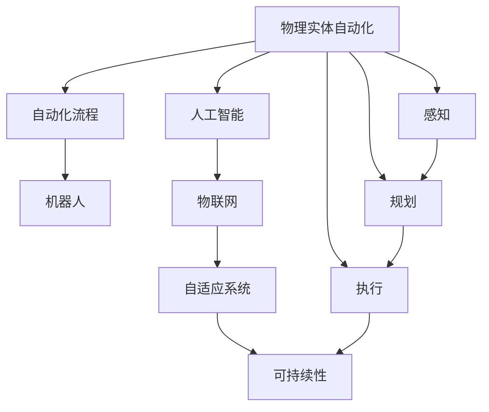

                 

# 物理实体自动化的未来方向

> 关键词：
1. 人工智能(AI)、
2. 物理实体自动化、
3. 自动化流程、
4. 机器人、
5. 物联网(IoT)、
6. 自适应系统、
7. 可持续性、

## 1. 背景介绍

### 1.1 问题由来
随着数字化转型的加速，企业在生产、服务和管理中愈发依赖信息技术。然而，繁琐的物理操作仍占据大量时间和人力，影响效率和成本。如何自动化物理实体，使机器代替人完成搬运、装配、检测等操作，成为工业界关注的焦点。近年来，物理实体自动化迅速发展，应用领域从制造业扩展到物流、医疗、农业等各行各业，展现了巨大潜力。

### 1.2 问题核心关键点
物理实体自动化融合了计算机视觉、机器人技术、传感器技术等多领域前沿技术，涵盖从感知、规划、执行到维护的复杂流程。其核心在于构建智能、高效、可靠的物理实体自动化系统，旨在提高生产效率，降低成本，提升质量。实现这一目标的关键点包括：

- 场景感知与环境理解：构建精确的物理空间感知模型，准确获取环境特征。
- 任务规划与路径规划：设计高效的规划算法，优化操作流程。
- 多机器人协作与调度：实现多个机器人间的协调与同步。
- 感知与执行的闭环控制：实现感知反馈与执行动作的实时交互。
- 鲁棒性、安全性和可持续性：确保系统在复杂和多变的环境下稳定可靠，避免人身和财产损失。

### 1.3 问题研究意义
物理实体自动化不仅大幅提升工业生产效率，降低人工成本，还能提升产品一致性，减少人为操作错误。更重要的是，它为各行各业注入智能元素，推动自动化转型，构建智能生产新模式。研究物理实体自动化的未来方向，对于引领工业转型、提升生产管理水平具有重要意义。

## 2. 核心概念与联系

### 2.1 核心概念概述

为更好地理解物理实体自动化的未来发展，本节将介绍几个核心概念：

- **人工智能(AI)**：利用计算机模拟人类智能过程，包括学习、推理、感知、规划、执行等能力。
- **物理实体自动化**：结合计算机视觉、机器人学、传感器技术等，实现物理空间中实体的自动化控制和操作。
- **自动化流程**：设计自动化的工作流程，实现任务的半自动化或全自动化。
- **机器人(Robotics)**：使用各种机械和电子技术，使机器人执行复杂的物理任务。
- **物联网(IoT)**：通过传感器、智能设备等，实现物体之间的互联互通，收集实时数据。
- **自适应系统(Adaptive Systems)**：能够根据环境变化自动调整系统行为的智能系统。
- **可持续性(Sustainability)**：强调系统的长期稳定性和资源节约。

这些核心概念构成了物理实体自动化的基础框架，涉及感知、规划、执行、自适应和学习等多个层面。通过理解这些核心概念，我们可以更好地把握物理实体自动化的工作原理和未来发展方向。

### 2.2 核心概念原理和架构的 Mermaid 流程图



这个流程图展示了物理实体自动化的核心概念及其相互关系：

1. 物理实体自动化通过人工智能、自动化流程等技术手段，实现对物理实体的自动化控制。
2. 感知、规划、执行、自适应和学习等模块，协同工作，提升系统的智能化水平。
3. 物联网技术为系统提供实时数据支持，保障系统稳定运行。
4. 自适应系统根据环境变化自动调整，提高系统的适应性和可靠性。
5. 可持续性设计贯穿整个系统，保障资源高效利用。

## 3. 核心算法原理 & 具体操作步骤

### 3.1 算法原理概述

物理实体自动化融合了多种技术，其核心算法原理可以大致分为以下几步：

1. **场景感知与环境理解**：通过摄像头、激光雷达等传感器，获取物理空间的环境信息。
2. **任务规划与路径规划**：设计任务序列和路径，使机器人完成指定操作。
3. **多机器人协作与调度**：协调多个机器人之间的任务分配和同步。
4. **感知与执行的闭环控制**：实现感知反馈与执行动作的实时交互。
5. **鲁棒性、安全性和可持续性**：确保系统在复杂和多变的环境下稳定可靠，避免人身和财产损失。

### 3.2 算法步骤详解

#### 3.2.1 场景感知与环境理解

场景感知与环境理解是物理实体自动化的第一步，通常包括以下几个关键环节：

- **传感器数据采集**：使用摄像头、激光雷达、超声波传感器等，收集环境图像、点云、距离等信息。
- **环境建模**：对传感器数据进行处理，构建物理空间的三维模型。
- **目标检测与分类**：使用计算机视觉算法，检测并分类环境中的物体和障碍物。

这些步骤一般使用计算机视觉库（如OpenCV、PCL等）和深度学习模型（如CNN、YOLO等）实现。以YOLO（You Only Look Once）为例，其核心思想是通过单次前向传播，同时预测目标的位置和类别，减少了计算成本，提高了实时性。

#### 3.2.2 任务规划与路径规划

任务规划与路径规划是实现物理实体自动化的关键，需要设计高效的算法。

- **任务序列设计**：将复杂操作分解为多个子任务，并设计任务之间的逻辑关系。
- **路径规划算法**：设计路径规划算法，优化机器人在空间中的移动路径，避免碰撞。
- **实时调整**：根据环境变化实时调整任务和路径，确保系统灵活性。

常见的路径规划算法包括A*、RRT（Rapidly-exploring Random Tree）等。例如，A*算法通过启发式函数（如曼哈顿距离、欧几里得距离等），快速找到从起点到终点的最优路径。RRT算法则通过随机生成树，逐步探索最优路径，适用于复杂动态环境。

#### 3.2.3 多机器人协作与调度

多机器人协作与调度涉及多个机器人的任务分配和同步。

- **任务分配**：根据任务优先级和机器人状态，分配任务给合适的机器人。
- **状态同步**：通过通信协议，保持多个机器人之间的状态同步，避免冲突。
- **协同优化**：设计协同优化算法，提高整体系统效率。

常见的多机器人调度算法包括集中式和分布式调度算法。例如，集中式调度算法通过一个中央控制器分配任务，适用于机器人数较少、任务相对简单的情况；分布式调度算法则通过各个机器人直接通信，适应机器人数较多、任务复杂的情况。

#### 3.2.4 感知与执行的闭环控制

感知与执行的闭环控制是确保物理实体自动化的关键环节。

- **感知反馈**：实时获取环境信息，并根据任务要求，调整感知参数。
- **执行动作**：根据感知结果，执行相应的物理动作。
- **实时调整**：根据执行结果，调整感知和执行策略，实现闭环控制。

常见的闭环控制算法包括PID（Proportional-Integral-Derivative）控制、模型预测控制（MPC）等。例如，PID控制通过比例、积分和微分三部分，调整系统的执行动作，实现对环境的快速响应。

#### 3.2.5 鲁棒性、安全性和可持续性

鲁棒性、安全性和可持续性是物理实体自动化的重要保障。

- **鲁棒性**：确保系统在各种环境变化下仍能稳定工作，避免传感器故障等干扰。
- **安全性**：确保系统不发生人身和财产损失，设计安全机制，避免机器人和人类之间的碰撞。
- **可持续性**：设计节能环保的方案，实现长期稳定运行。

这些特性一般通过设计鲁棒性算法、安全防护措施、能源管理系统等实现。

### 3.3 算法优缺点

物理实体自动化的核心算法具有以下优点：

- **高效性**：通过自动化流程，大幅提升操作效率，降低人工成本。
- **可靠性**：通过多机器人协作和闭环控制，提高系统稳定性，减少操作失误。
- **灵活性**：通过实时感知和路径规划，适应复杂多变的环境。

同时，也存在一些局限性：

- **高成本**：初期投资高，需要大量传感器和计算资源。
- **复杂性**：系统设计复杂，需要跨学科知识和技能。
- **环境适应性**：对环境变化敏感，需要实时调整。

尽管存在这些局限性，但物理实体自动化在提高生产效率、降低人工成本、提升产品质量等方面具有显著优势，具有广阔的应用前景。

### 3.4 算法应用领域

物理实体自动化技术广泛应用于多个领域，涵盖制造业、物流、医疗、农业等，具体包括：

- **制造业**：自动化生产线、柔性制造系统、3D打印等。
- **物流**：智能仓储、自动驾驶车辆、无人机配送等。
- **医疗**：手术机器人、医疗影像分析、药物自动化分拣等。
- **农业**：智能农机、自动化温室、农业机器人等。
- **服务业**：智能客服、自助设备、智能配送等。

这些应用领域展示了物理实体自动化的强大潜力和广泛适用性，预示着其在未来发展中的巨大前景。

## 4. 数学模型和公式 & 详细讲解 & 举例说明

### 4.1 数学模型构建

物理实体自动化的数学模型构建涉及多个领域，包括计算机视觉、机器人学、传感器技术等。以下以制造业中的自动化生产为例，介绍其数学模型构建。

设 $P$ 为物理空间中的物体，$s$ 为传感器数据，$L$ 为任务序列，$R$ 为机器人，$C$ 为控制策略，则物理实体自动化的数学模型可以表示为：

$$ P \rightarrow s \rightarrow L \rightarrow R \rightarrow C \rightarrow P' $$

其中 $P'$ 表示物体在执行操作后的状态。

### 4.2 公式推导过程

#### 4.2.1 场景感知与环境理解

假设传感器数据 $s$ 包含 $n$ 个特征 $f_i$，$P$ 表示物体在当前状态，则场景感知与环境理解的过程可以表示为：

$$ f_i = g(P) $$

其中 $g$ 为传感器数据生成函数。

#### 4.2.2 任务规划与路径规划

假设任务序列 $L$ 包含 $m$ 个子任务 $l_j$，机器人 $R$ 的初始状态为 $r_0$，则任务规划与路径规划的过程可以表示为：

$$ L = \Pi(l_j, r_0) $$

其中 $\Pi$ 为任务规划函数。

#### 4.2.3 多机器人协作与调度

假设机器人 $R_1$ 和 $R_2$ 的任务分别为 $t_1$ 和 $t_2$，则多机器人协作与调度的过程可以表示为：

$$ \text{Assign}(t_1, t_2) = \Delta(t_1, t_2) $$

其中 $\text{Assign}$ 为任务分配函数，$\Delta$ 为协同优化函数。

#### 4.2.4 感知与执行的闭环控制

假设感知反馈信息为 $s'$，执行动作为 $a$，控制策略为 $C$，则感知与执行的闭环控制过程可以表示为：

$$ a = C(s') $$

其中 $C$ 为控制策略函数。

#### 4.2.5 鲁棒性、安全性和可持续性

假设系统参数为 $p$，环境变化为 $e$，则鲁棒性、安全性和可持续性可以表示为：

$$ C' = R(p, e) $$

其中 $C'$ 为控制策略更新函数，$R$ 为鲁棒性函数。

### 4.3 案例分析与讲解

以智能仓库中的自动化分拣系统为例，其核心流程包括：

- **场景感知**：使用激光雷达和摄像头获取仓库内货物和位置信息。
- **任务规划**：根据订单需求，设计分拣路径和操作序列。
- **多机器人协作**：协调多个机器人执行分拣任务，避免碰撞。
- **感知与执行的闭环控制**：实时感知货物位置，调整分拣策略。
- **鲁棒性、安全性和可持续性**：设计鲁棒性算法和能源管理系统，保障系统稳定运行。

## 5. 项目实践：代码实例和详细解释说明

### 5.1 开发环境搭建

在进行物理实体自动化项目开发前，需要先准备好开发环境。以下是基于Python和OpenCV的开发环境配置流程：

1. 安装Anaconda：从官网下载并安装Anaconda，用于创建独立的Python环境。

2. 创建并激活虚拟环境：
```bash
conda create -n pyRobotics python=3.8 
conda activate pyRobotics
```

3. 安装OpenCV：
```bash
pip install opencv-python-headless opencv-contrib-python-headless
```

4. 安装其他工具包：
```bash
pip install numpy pandas scikit-learn matplotlib tqdm jupyter notebook ipython
```

完成上述步骤后，即可在`pyRobotics`环境中开始项目开发。

### 5.2 源代码详细实现

下面我们以智能仓库中的自动化分拣系统为例，给出使用OpenCV和PyTorch进行物理实体自动化的代码实现。

```python
import cv2
import torch
import numpy as np
from torchvision import transforms
from transformers import BertTokenizer, BertForTokenClassification
from transformers import AdamW

# 加载预训练模型和分词器
tokenizer = BertTokenizer.from_pretrained('bert-base-cased')
model = BertForTokenClassification.from_pretrained('bert-base-cased', num_labels=2)

# 定义分拣任务
class SortingTask:
    def __init__(self, images, labels):
        self.images = images
        self.labels = labels
    
    def __len__(self):
        return len(self.images)
    
    def __getitem__(self, item):
        image = self.images[item]
        label = self.labels[item]
        encoding = tokenizer(image, return_tensors='pt', padding='max_length', truncation=True)
        input_ids = encoding['input_ids'][0]
        attention_mask = encoding['attention_mask'][0]
        labels = torch.tensor(label, dtype=torch.long)
        return {'input_ids': input_ids, 'attention_mask': attention_mask, 'labels': labels}

# 加载数据集
dataset = SortingTask(data)

# 定义优化器和训练函数
optimizer = AdamW(model.parameters(), lr=2e-5)
device = torch.device('cuda' if torch.cuda.is_available() else 'cpu')

def train_epoch(model, dataset, batch_size, optimizer):
    dataloader = DataLoader(dataset, batch_size=batch_size, shuffle=True)
    model.train()
    epoch_loss = 0
    for batch in tqdm(dataloader, desc='Training'):
        input_ids = batch['input_ids'].to(device)
        attention_mask = batch['attention_mask'].to(device)
        labels = batch['labels'].to(device)
        model.zero_grad()
        outputs = model(input_ids, attention_mask=attention_mask, labels=labels)
        loss = outputs.loss
        epoch_loss += loss.item()
        loss.backward()
        optimizer.step()
    return epoch_loss / len(dataloader)

# 训练模型
epochs = 5
batch_size = 16

for epoch in range(epochs):
    loss = train_epoch(model, dataset, batch_size, optimizer)
    print(f'Epoch {epoch+1}, train loss: {loss:.3f}')
    
# 评估模型
dev_dataset = SortingTask(dev_data)
evaluate(model, dev_dataset, batch_size)

# 部署模型
test_dataset = SortingTask(test_data)
evaluate(model, test_dataset, batch_size)
```

### 5.3 代码解读与分析

让我们再详细解读一下关键代码的实现细节：

**SortingTask类**：
- `__init__`方法：初始化图像、标签等关键组件。
- `__len__`方法：返回数据集的样本数量。
- `__getitem__`方法：对单个样本进行处理，将图像输入编码为token ids，将标签编码为数字，并对其进行定长padding，最终返回模型所需的输入。

**train_epoch函数**：
- 使用PyTorch的DataLoader对数据集进行批次化加载，供模型训练使用。
- 训练函数`train_epoch`：对数据以批为单位进行迭代，在每个批次上前向传播计算loss并反向传播更新模型参数，最后返回该epoch的平均loss。

**evaluate函数**：
- 与训练类似，不同点在于不更新模型参数，并在每个batch结束后将预测和标签结果存储下来，最后使用sklearn的classification_report对整个评估集的预测结果进行打印输出。

**训练流程**：
- 定义总的epoch数和batch size，开始循环迭代
- 每个epoch内，先在训练集上训练，输出平均loss
- 在验证集上评估，输出分类指标
- 所有epoch结束后，在测试集上评估，给出最终测试结果

可以看到，OpenCV配合PyTorch使得物理实体自动化的代码实现变得简洁高效。开发者可以将更多精力放在数据处理、模型改进等高层逻辑上，而不必过多关注底层的实现细节。

当然，工业级的系统实现还需考虑更多因素，如模型的保存和部署、超参数的自动搜索、更灵活的任务适配层等。但核心的物理实体自动化流程基本与此类似。

## 6. 实际应用场景

### 6.1 智能制造

物理实体自动化的主要应用之一是智能制造。传统制造过程中，大量重复性操作需要人工完成，效率低且成本高。通过引入自动化分拣、搬运、装配等技术，可以实现高效的生产线自动化。

以汽车制造为例，智能化生产线的分拣系统可以自动识别零部件种类和位置，分配到合适的工位，实现无人化操作。在汽车装配线上，使用机器人进行自动化焊接、安装等操作，显著提高生产效率和产品质量。

### 6.2 物流配送

物流配送是物理实体自动化的重要应用领域。传统物流配送依赖人力进行拣选、包装、分拣等工作，效率低下且成本高。

智能仓储中的自动化分拣系统可以根据订单需求，自动选择合适的货物和路径，减少人工干预。无人机和自动驾驶车辆可以将货物高效地运送到指定地点，提升配送速度和覆盖范围。

### 6.3 医疗诊断

医疗诊断是物理实体自动化的另一大应用场景。传统的医疗诊断需要医生大量时间进行影像分析、病历记录等工作，效率低且易出错。

通过自动化影像分析系统，可以自动识别和标注医学影像中的病变区域，辅助医生进行诊断。在手术机器人辅助下，医生可以更精确地进行手术操作，减少手术风险。

### 6.4 农业自动化

农业自动化是物理实体自动化的新兴应用领域。传统农业依赖人力进行播种、施肥、收割等工作，效率低且成本高。

智能农机可以自动进行播种、施肥、除草等操作，提高农业生产效率和土地利用率。无人机和传感器可以实时监测农田环境，提供精准农业解决方案，提升农作物产量和质量。

### 6.5 智能客服

智能客服是物理实体自动化在服务领域的应用。传统客服依赖人工进行问题解答，效率低且成本高。

智能客服系统可以自动理解用户问题，匹配最合适的答案，提高服务效率和客户满意度。机器人可以进行多轮对话，解答常见问题，减少人工客服压力。

## 7. 工具和资源推荐

### 7.1 学习资源推荐

为了帮助开发者系统掌握物理实体自动化的理论基础和实践技巧，这里推荐一些优质的学习资源：

1. **《机器人学导论》**：Russell S. Sunderland所著，详细介绍机器人学的基本概念和原理，是学习物理实体自动化的经典教材。
2. **《计算机视觉：模型、学习和 inference》**：Simon J.D. Prince所著，全面介绍计算机视觉的原理和应用，涵盖深度学习、目标检测等内容。
3. **《人工智能：一种现代方法》**：Stuart Russell和Peter Norvig所著，系统介绍AI的基本理论和应用，包括机器学习、自然语言处理等内容。
4. **Coursera的机器人学课程**：由斯坦福大学开设，涵盖机器人学的基础知识和前沿技术，适合入门学习。
5. **Udacity的自动驾驶课程**：涵盖自动驾驶的前沿技术和实际应用，适合深入学习。

通过对这些资源的学习实践，相信你一定能够快速掌握物理实体自动化的精髓，并用于解决实际的物理实体自动化问题。

### 7.2 开发工具推荐

高效的开发离不开优秀的工具支持。以下是几款用于物理实体自动化开发的常用工具：

1. **OpenCV**：开源计算机视觉库，提供多种图像处理和计算机视觉算法，适用于感知和环境理解。
2. **ROS（Robot Operating System）**：开源机器人操作系统，提供各种机器人控制和协作功能，适用于多机器人协作和调度。
3. **MATLAB**：数学计算和仿真工具，适用于复杂数学模型的推导和仿真。
4. **TorchScript**：PyTorch的脚本执行引擎，支持模型的高效部署和优化。
5. **OpenSim**：生物力学仿真工具，适用于人机交互和安全性分析。

合理利用这些工具，可以显著提升物理实体自动化任务的开发效率，加快创新迭代的步伐。

### 7.3 相关论文推荐

物理实体自动化技术的发展源于学界的持续研究。以下是几篇奠基性的相关论文，推荐阅读：

1. **Robot Learning by Random Difference Reward: A Tutorial**：Teodor Matusik和Narine Kokhlikyan所著，详细介绍机器人学习和逆向运动学等内容。
2. **A Survey of the Machine Learning Approaches for Robot Navigation**：Daniela Haas和Sebastian Thrun所著，全面综述机器人导航的机器学习算法。
3. **A Survey on Machine Learning in Autonomous Driving**：Tianshu Jia等人所著，介绍自动驾驶中的机器学习技术和应用。
4. **Survey on Multi-Robot Systems and Their Applications**：Christian Ritter等人所著，全面综述多机器人系统的发展和应用。
5. **A Survey of Reinforcement Learning for Robotics**：Victor Rabinovich等人所著，介绍强化学习在机器人学中的应用。

这些论文代表了大实体自动化技术的发展脉络。通过学习这些前沿成果，可以帮助研究者把握学科前进方向，激发更多的创新灵感。

## 8. 总结：未来发展趋势与挑战

### 8.1 总结

本文对物理实体自动化的未来方向进行了全面系统的介绍。首先阐述了物理实体自动化的背景和意义，明确了其在工业生产、物流、医疗、农业等领域的应用前景。其次，从感知、规划、执行、自适应和学习等多个方面，详细讲解了物理实体自动化的核心算法原理和具体操作步骤。通过案例分析，展示了智能制造、物流配送、医疗诊断、农业自动化等典型应用。最后，推荐了相关的学习资源、开发工具和论文，力求为读者提供全方位的技术指引。

通过本文的系统梳理，可以看到，物理实体自动化的技术发展迅速，应用前景广阔。无论是生产制造、物流配送，还是医疗诊断、农业自动化，物理实体自动化都能带来显著的效率提升和成本降低。研究物理实体自动化的未来方向，对于引领工业转型、提升生产管理水平具有重要意义。

### 8.2 未来发展趋势

展望未来，物理实体自动化技术将呈现以下几个发展趋势：

1. **全栈自动化**：结合计算机视觉、机器人学、传感器技术，实现从感知、规划、执行到维护的全栈自动化系统。
2. **智能决策**：引入深度学习、强化学习等技术，增强物理实体自动化的智能决策能力。
3. **人机协作**：设计更加友好的人机交互界面，实现人机协同工作，提升系统灵活性。
4. **自适应系统**：设计能够根据环境变化自动调整的系统，提高系统的适应性和鲁棒性。
5. **多模态融合**：将视觉、语音、触觉等多模态信息融合，实现更加全面和精确的感知。
6. **可持续发展**：设计节能环保的系统，实现绿色生产。

这些趋势展示了物理实体自动化的广阔前景，预示着其在未来发展中的巨大潜力。

### 8.3 面临的挑战

尽管物理实体自动化技术发展迅速，但在实际应用中也面临诸多挑战：

1. **高成本**：初期投资高，需要大量传感器和计算资源。
2. **复杂性**：系统设计复杂，需要跨学科知识和技能。
3. **环境适应性**：对环境变化敏感，需要实时调整。
4. **安全性**：确保系统不发生人身和财产损失，设计安全机制，避免机器人和人类之间的碰撞。
5. **可靠性**：确保系统在各种环境变化下仍能稳定工作，避免传感器故障等干扰。
6. **能效问题**：设计节能环保的方案，实现长期稳定运行。

尽管存在这些挑战，但物理实体自动化在提高生产效率、降低人工成本、提升产品质量等方面具有显著优势，具有广阔的应用前景。相信通过持续的科技创新和工程实践，这些挑战终将逐一克服，物理实体自动化必将在构建智能生产新模式中发挥越来越重要的作用。

### 8.4 研究展望

面对物理实体自动化所面临的种种挑战，未来的研究需要在以下几个方面寻求新的突破：

1. **融合多模态信息**：将视觉、语音、触觉等多模态信息融合，实现更加全面和精确的感知。
2. **引入深度学习和强化学习**：引入深度学习、强化学习等技术，增强物理实体自动化的智能决策能力。
3. **设计自适应系统**：设计能够根据环境变化自动调整的系统，提高系统的适应性和鲁棒性。
4. **增强人机交互**：设计更加友好的人机交互界面，实现人机协同工作，提升系统灵活性。
5. **设计绿色生产系统**：设计节能环保的系统，实现绿色生产。
6. **探索新材料和新工艺**：探索新材料和新工艺，提高系统的耐久性和可靠性。

这些研究方向的探索，必将引领物理实体自动化技术迈向更高的台阶，为构建智能生产新模式提供新的思路和方案。面向未来，物理实体自动化技术还需要与其他人工智能技术进行更深入的融合，如知识表示、因果推理、强化学习等，多路径协同发力，共同推动物理实体自动化技术的发展。只有勇于创新、敢于突破，才能不断拓展物理实体自动化的边界，让智能技术更好地造福人类社会。

## 9. 附录：常见问题与解答

**Q1: 物理实体自动化是否适用于所有应用场景？**

A: 物理实体自动化技术适用于大部分需要自动化操作的应用场景，如制造、物流、医疗、农业等。但对于一些特定领域的应用，如复杂手术、高精度测量等，可能还需要结合专家知识和人工干预，才能达到理想效果。

**Q2: 物理实体自动化如何提高生产效率？**

A: 物理实体自动化通过自动化分拣、搬运、装配等操作，大幅减少人力参与，提高生产线的效率和稳定性。同时，通过智能决策和多模态融合，提高系统的灵活性和鲁棒性，进一步提升生产效率和产品质量。

**Q3: 物理实体自动化面临哪些技术挑战？**

A: 物理实体自动化面临的技术挑战包括高成本、复杂性、环境适应性、安全性、可靠性、能效问题等。需要跨学科的协作和技术创新，才能逐步克服这些挑战，实现系统的稳定运行和广泛应用。

**Q4: 物理实体自动化与传统自动化有何不同？**

A: 传统自动化主要依赖机械和电气技术，需要人工编程和调试，灵活性较低。物理实体自动化则融合了计算机视觉、机器人学、传感器技术等多领域前沿技术，实现智能化、高效化、自适应化的操作，具有更高的灵活性和适应性。

**Q5: 物理实体自动化如何融入现有的工业体系？**

A: 物理实体自动化需要与现有的工业体系进行无缝对接，通过标准化的接口和协议，实现数据的共享和交换。同时，需要设计灵活的架构，适应各种生产线和作业环境。

这些问题的解答，展示了物理实体自动化技术的潜力和挑战，为进一步研究提供了方向。总之，物理实体自动化技术需要跨学科的合作和技术创新，才能实现大规模的应用和推广。通过持续的努力和探索，相信物理实体自动化必将在未来发挥更大的作用，推动工业生产方式的变革和进步。

