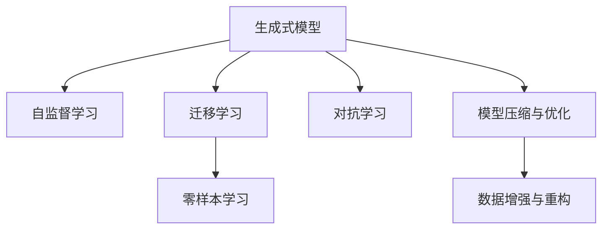

                 

# 生成式AIGC：从理论到商业应用的跨越

> 关键词：生成式AIGC,深度学习,Transformer,自监督学习,迁移学习,零样本学习,模型压缩

## 1. 背景介绍

### 1.1 问题由来
生成式人工智能（Generative AI, AI-GC）是当前人工智能领域的前沿研究方向，其目标是通过学习数据的分布，生成与训练数据具有相似分布的新数据。随着深度学习技术的发展，生成式AI迅速崭露头角，凭借其优越的生成能力、广泛的商业应用前景以及高附加值，成为备受关注的焦点。

生成式AI的核心是生成模型（Generative Model），尤其是基于神经网络架构的生成模型，如生成对抗网络（GAN）、变分自编码器（VAE）、自回归模型（如LSTM、RNN）、自编码器模型（如GAN、VAE）、变分自编码器（VAE）等。近年来，生成式AI在图像生成、语音合成、文本生成、音乐创作等领域取得了显著进展，其中基于Transformer的生成模型尤其引人注目。

### 1.2 问题核心关键点
生成式AI的核心关键点在于如何高效、准确地生成新数据，这主要涉及以下几个方面：

1. **生成模型的构建与训练**：选择合适的生成模型架构和训练策略，最大化模型生成数据的质量和多样性。
2. **自监督学习与迁移学习**：利用大规模无标签数据进行自监督学习，利用已有的少量标注数据进行迁移学习，提升模型泛化能力。
3. **零样本学习与对抗学习**：通过精心设计的输入文本（Prompt）进行零样本学习，引入对抗样本进行对抗学习，提升模型生成能力。
4. **模型压缩与优化**：通过模型剪枝、量化、知识蒸馏等技术对模型进行优化，以提高推理速度和资源效率。
5. **数据增强与重构**：通过数据增强技术丰富训练数据集，对生成结果进行重构和后处理，提升生成数据的质量和多样性。

### 1.3 问题研究意义
生成式AI的兴起，为人工智能技术在各行各业的广泛应用提供了新的机遇。其主要意义包括：

1. **降低开发成本**：生成式AI能够自动生成高质量的图像、文本、音频等，极大降低了人工生成成本。
2. **提升创新效率**：生成式AI为创意产业（如影视、游戏、广告）提供了新素材，加速了内容的创作和迭代。
3. **赋能决策支持**：生成式AI能够在多模态数据融合中发挥作用，为决策分析提供更全面、更准确的支持。
4. **拓展应用边界**：生成式AI在虚拟现实、社交媒体、个性化推荐等领域的应用，拓展了人工智能技术的应用边界。
5. **推动技术创新**：生成式AI催生了生成对抗网络（GAN）、变分自编码器（VAE）等新模型，为深度学习研究提供了新方向。

## 2. 核心概念与联系

### 2.1 核心概念概述

生成式AI的核心概念主要包括以下几个方面：

- **生成式模型（Generative Model）**：包括但不限于GAN、VAE、自回归模型等，用于生成新数据。
- **自监督学习（Self-Supervised Learning）**：利用数据本身的统计规律进行训练，无需标注数据。
- **迁移学习（Transfer Learning）**：在特定任务上使用已有模型进行微调，提升模型泛化能力。
- **零样本学习（Zero-Shot Learning）**：仅通过任务描述进行推理，无需训练数据。
- **对抗学习（Adversarial Learning）**：通过对抗样本训练，提升模型鲁棒性。
- **模型压缩与优化**：通过剪枝、量化、蒸馏等技术提升模型效率。
- **数据增强与重构**：通过对生成结果进行后处理，提升生成数据的质量和多样性。

这些核心概念之间的逻辑关系可以通过以下Mermaid流程图来展示：



这个流程图展示了一幅生成式AI的理论和方法脉络：

1. 生成式模型通过自监督学习获取数据分布信息，并在此基础上进行迁移学习。
2. 迁移学习提升模型在特定任务上的表现。
3. 零样本学习利用任务描述进行推理。
4. 对抗学习提升模型鲁棒性。
5. 模型压缩与优化提升推理效率。
6. 数据增强与重构提升生成数据质量。

这些概念共同构成了生成式AI的学习和应用框架，使其能够在各种场景下发挥强大的生成能力。通过理解这些核心概念，我们可以更好地把握生成式AI的工作原理和优化方向。

## 3. 核心算法原理 & 具体操作步骤
### 3.1 算法原理概述

生成式AI的核心原理是通过深度学习模型对数据的分布进行建模，然后利用该模型生成新数据。常见的生成模型包括GAN、VAE、自回归模型等。

形式化地，假设生成模型为 $G_{\theta}$，其中 $\theta$ 为模型参数。在训练过程中，目标是最小化生成数据的重构误差，即：

$$
\min_{\theta} \mathbb{E}_{x \sim p_{\text{data}}} \left[ \left\| G_{\theta}(x) - x \right\|^2 \right]
$$

其中 $p_{\text{data}}$ 为真实数据的概率分布，$\left\| \cdot \right\|$ 为欧式距离。

### 3.2 算法步骤详解

生成式AI的核心算法步骤如下：

**Step 1: 准备生成模型和数据集**
- 选择合适的生成模型（如GAN、VAE等）。
- 准备生成模型所需的数据集 $D$，划分为训练集、验证集和测试集。

**Step 2: 添加任务适配层**
- 根据任务类型，在生成模型的顶部添加分类器或解码器。
- 对于分类任务，通常在顶部添加softmax层，计算生成数据属于每个类别的概率。
- 对于生成任务，通常使用GAN的判别器进行生成质量评估，并优化生成器的损失函数。

**Step 3: 设置生成超参数**
- 选择合适的优化算法及其参数，如Adam、SGD等，设置学习率、批大小、迭代轮数等。
- 设置正则化技术及强度，包括权重衰减、Dropout等。

**Step 4: 执行生成训练**
- 将训练集数据分批次输入模型，前向传播生成数据。
- 反向传播计算参数梯度，根据设定的优化算法和学习率更新模型参数。
- 周期性在验证集上评估生成数据的质量，根据性能指标决定是否触发Early Stopping。
- 重复上述步骤直到满足预设的迭代轮数或Early Stopping条件。

**Step 5: 测试和部署**
- 在测试集上评估生成模型的性能，对比生成前后数据的差异。
- 使用生成模型对新样本进行生成，集成到实际的应用系统中。
- 持续收集新的数据，定期重新训练模型，以适应数据分布的变化。

以上是生成式AI的一般流程。在实际应用中，还需要针对具体任务的特点，对生成过程的各个环节进行优化设计，如改进训练目标函数，引入更多的正则化技术，搜索最优的超参数组合等，以进一步提升生成效果。

### 3.3 算法优缺点

生成式AI具有以下优点：

1. **高效生成**：利用大规模数据进行训练，能够生成高质量的新数据。
2. **泛化能力强**：自监督学习使得模型能够从数据中提取通用规律，适用于多种数据类型和生成任务。
3. **灵活应用**：生成式AI可以应用于图像生成、文本生成、音乐生成等多个领域，具有广泛的应用前景。
4. **模型可解释性**：生成式模型通常有明确的架构和训练目标，便于理解和调试。

同时，该算法也存在一定的局限性：

1. **生成质量依赖数据**：生成式AI的生成质量很大程度上取决于数据的质量和分布，低质量的数据可能导致生成效果不佳。
2. **计算资源需求高**：训练大规模生成模型需要大量的计算资源和存储资源。
3. **对抗攻击易受影响**：生成模型容易受到对抗样本的攻击，导致生成数据偏差。
4. **模型稳定性不足**：生成模型对输入的微小扰动敏感，可能出现不稳定现象。
5. **训练时间长**：生成式AI的训练时间较长，尤其是在大规模数据集上。

尽管存在这些局限性，但就目前而言，生成式AI仍然是生成数据领域最主流的方法。未来相关研究的重点在于如何进一步提高生成质量、减少训练时间和资源消耗、增强模型鲁棒性和稳定性。

### 3.4 算法应用领域

生成式AI在多个领域得到了广泛应用，具体包括：

- **图像生成**：如GAN生成艺术作品、数字图像、虚拟人物等。
- **文本生成**：如基于语言模型的文本生成、对话系统、自动摘要等。
- **语音合成**：如TTS（Text-to-Speech）、语音转换、音乐合成等。
- **视频生成**：如动态视频生成、虚拟现实场景、虚拟角色动画等。
- **音乐创作**：如自动作曲、音乐生成、虚拟合成器等。

除了上述这些典型应用外，生成式AI还被创新性地应用到更多场景中，如可控文本生成、图像风格迁移、数据增强等，为人工智能技术带来了新的突破。随着生成式AI技术的不断进步，相信其将在更广阔的应用领域大放异彩。

## 4. 数学模型和公式 & 详细讲解  
### 4.1 数学模型构建

本节将使用数学语言对生成式AI的生成模型进行更加严格的刻画。

假设生成模型为 $G_{\theta}$，其中 $\theta$ 为模型参数。生成数据的分布为 $p_{G}(x)$，目标是最小化重构误差：

$$
\min_{\theta} \mathbb{E}_{x \sim p_{\text{data}}} \left[ \left\| G_{\theta}(x) - x \right\|^2 \right]
$$

其中 $p_{\text{data}}$ 为真实数据的概率分布，$\left\| \cdot \right\|$ 为欧式距离。

假设生成数据的分布为 $p_{G}(x)$，重构误差为 $\mathcal{L}_{\text{recon}}(x)$，则目标函数可以写为：

$$
\mathcal{L}_{\text{gen}}(\theta) = \mathbb{E}_{x \sim p_{\text{data}}} \left[ \mathcal{L}_{\text{recon}}(x) \right]
$$

在实际应用中，我们通常使用基于梯度的优化算法（如Adam、SGD等）来近似求解上述最优化问题。设 $\eta$ 为学习率，则参数的更新公式为：

$$
\theta \leftarrow \theta - \eta \nabla_{\theta}\mathcal{L}_{\text{gen}}(\theta)
$$

其中 $\nabla_{\theta}\mathcal{L}_{\text{gen}}(\theta)$ 为损失函数对参数 $\theta$ 的梯度，可通过反向传播算法高效计算。

### 4.2 公式推导过程

以下我们以GAN为例，推导重构误差函数及其梯度的计算公式。

假设生成器为 $G_{\theta}$，判别器为 $D_{\phi}$，定义 $G_{\theta}$ 生成的数据为 $x$，真实数据为 $y$。则GAN的目标函数可以写为：

$$
\min_{G_{\theta}} \max_{D_{\phi}} \mathbb{E}_{x \sim p_{\text{data}}} \left[ \log D_{\phi}(x) \right] + \mathbb{E}_{z \sim p_{z}} \left[ \log (1 - D_{\phi}(G_{\theta}(z))) \right]
$$

其中 $p_{z}$ 为生成器输入的噪声分布。

将目标函数拆分为两个部分，分别针对生成器和判别器进行优化。

**生成器的目标函数**：

$$
\min_{G_{\theta}} \mathbb{E}_{z \sim p_{z}} \left[ \log (1 - D_{\phi}(G_{\theta}(z))) \right]
$$

将目标函数对 $\theta$ 求导，得：

$$
\frac{\partial \mathcal{L}_{\text{gen}}(\theta)}{\partial \theta} = -\nabla_{\theta} \mathbb{E}_{z \sim p_{z}} \left[ \log (1 - D_{\phi}(G_{\theta}(z))) \right]
$$

**判别器的目标函数**：

$$
\max_{D_{\phi}} \mathbb{E}_{x \sim p_{\text{data}}} \left[ \log D_{\phi}(x) \right] + \mathbb{E}_{z \sim p_{z}} \left[ \log (1 - D_{\phi}(G_{\theta}(z))) \right]
$$

将目标函数对 $\phi$ 求导，得：

$$
\frac{\partial \mathcal{L}_{\text{disc}}(\phi)}{\partial \phi} = -\nabla_{\phi} \mathbb{E}_{x \sim p_{\text{data}}} \left[ \log D_{\phi}(x) \right]
$$

通过上述推导，可以看出GAN的训练过程是一个对抗训练的过程，生成器和判别器相互博弈，最终使得生成器生成的数据能够与真实数据难以区分。

### 4.3 案例分析与讲解

下面以GAN生成图像为例，详细讲解GAN的训练过程。

**数据准备**：

假设我们有一个包含图像的数据集，共 $N$ 张图像，每张图像大小为 $H \times W \times C$，其中 $C$ 为通道数。我们将数据集分为训练集和测试集。

**模型定义**：

定义GAN的生成器和判别器，生成器 $G_{\theta}$ 的输入为噪声 $z$，输出为图像 $x$；判别器 $D_{\phi}$ 的输入为图像 $x$，输出为判别概率 $p(y=1|x)$，其中 $y$ 为标签，表示 $x$ 是否为真实图像。

**训练过程**：

1. 随机生成噪声 $z$，输入生成器 $G_{\theta}$，得到生成的图像 $x$。
2. 将 $x$ 和真实图像 $x_{\text{real}}$ 分别输入判别器 $D_{\phi}$，计算真实图像和生成图像的判别概率 $p_{\text{real}}$ 和 $p_{\text{fake}}$。
3. 计算判别器的损失函数 $\mathcal{L}_{\text{disc}}(\phi)$，并反向传播更新判别器参数 $\phi$。
4. 固定判别器参数 $\phi$，随机生成噪声 $z$，输入生成器 $G_{\theta}$，得到生成的图像 $x$。
5. 将 $x$ 输入判别器 $D_{\phi}$，计算生成图像的判别概率 $p_{\text{fake}}$。
6. 计算生成器的损失函数 $\mathcal{L}_{\text{gen}}(\theta)$，并反向传播更新生成器参数 $\theta$。

通过以上训练过程，GAN不断优化生成器和判别器，最终能够生成高质量的图像。

## 5. 项目实践：代码实例和详细解释说明
### 5.1 开发环境搭建

在进行生成式AI项目实践前，我们需要准备好开发环境。以下是使用Python进行TensorFlow开发的环境配置流程：

1. 安装Anaconda：从官网下载并安装Anaconda，用于创建独立的Python环境。

2. 创建并激活虚拟环境：
```bash
conda create -n tf-env python=3.8 
conda activate tf-env
```

3. 安装TensorFlow：根据CUDA版本，从官网获取对应的安装命令。例如：
```bash
pip install tensorflow
```

4. 安装TensorFlow Addons：用于增强TensorFlow的功能，包括GAN和VAE等模块。
```bash
pip install tensorflow-addons
```

5. 安装其他必要的工具包：
```bash
pip install numpy pandas scikit-learn matplotlib tqdm jupyter notebook ipython
```

完成上述步骤后，即可在`tf-env`环境中开始生成式AI项目的开发。

### 5.2 源代码详细实现

下面我们以GAN生成图像为例，给出使用TensorFlow实现GAN的代码实现。

```python
import tensorflow as tf
from tensorflow.keras import layers, models

# 定义生成器
def make_generator_model():
    model = models.Sequential()
    model.add(layers.Dense(256, input_dim=100))
    model.add(layers.BatchNormalization())
    model.add(layers.LeakyReLU())
    model.add(layers.Dropout(0.2))
    model.add(layers.Dense(512))
    model.add(layers.BatchNormalization())
    model.add(layers.LeakyReLU())
    model.add(layers.Dropout(0.2))
    model.add(layers.Dense(1024))
    model.add(layers.BatchNormalization())
    model.add(layers.LeakyReLU())
    model.add(layers.Dropout(0.2))
    model.add(layers.Dense(784, activation='tanh'))
    model.compile(loss='binary_crossentropy', optimizer=tf.keras.optimizers.Adam(1e-4, beta_1=0.5, beta_2=0.999))
    return model

# 定义判别器
def make_discriminator_model():
    model = models.Sequential()
    model.add(layers.Flatten(input_shape=(28, 28, 1)))
    model.add(layers.Dense(1024))
    model.add(layers.LeakyReLU(alpha=0.2))
    model.add(layers.Dropout(0.2))
    model.add(layers.Dense(512))
    model.add(layers.LeakyReLU(alpha=0.2))
    model.add(layers.Dropout(0.2))
    model.add(layers.Dense(256))
    model.add(layers.LeakyReLU(alpha=0.2))
    model.add(layers.Dropout(0.2))
    model.add(layers.Dense(1, activation='sigmoid'))
    return model

# 加载MNIST数据集
(x_train, y_train), (x_test, y_test) = tf.keras.datasets.mnist.load_data()
x_train = x_train.reshape(x_train.shape[0], 28, 28, 1).astype('float32') / 255
x_test = x_test.reshape(x_test.shape[0], 28, 28, 1).astype('float32') / 255
x_train = x_train - 0.5
x_test = x_test - 0.5

# 定义损失函数和优化器
cross_entropy = tf.keras.losses.BinaryCrossentropy()
binary_crossentropy = tf.keras.losses.BinaryCrossentropy(from_logits=True)

def train_step(images):
    noise = tf.random.normal([BATCH_SIZE, NOISE_DIM])

    with tf.GradientTape() as gen_tape, tf.GradientTape() as disc_tape:
        generated_images = gen_model(noise)

        real_output = disc_model(images)
        fake_output = disc_model(generated_images)

        gen_loss = cross_entropy(tf.ones_like(fake_output), fake_output)
        disc_loss = cross_entropy(tf.ones_like(real_output), real_output) + cross_entropy(tf.zeros_like(fake_output), fake_output)

    gradients_of_generator = gen_tape.gradient(gen_loss, gen_model.trainable_variables)
    gradients_of_discriminator = disc_tape.gradient(disc_loss, disc_model.trainable_variables)

    gen_optimizer.apply_gradients(zip(gradients_of_generator, gen_model.trainable_variables))
    disc_optimizer.apply_gradients(zip(gradients_of_discriminator, disc_model.trainable_variables))

# 训练过程
BATCH_SIZE = 32
NOISE_DIM = 100
EPOCHS = 100

gen_model = make_generator_model()
disc_model = make_discriminator_model()

gen_optimizer = tf.keras.optimizers.Adam(1e-4)
disc_optimizer = tf.keras.optimizers.Adam(1e-4)

for epoch in range(EPOCHS):
    for image_batch in train_dataset:
        train_step(image_batch)
        
    print("Epoch {} / {}".format(epoch + 1, EPOCHS))
    print("Discriminator Loss: {}".format(disc_loss.numpy()))
    print("Generator Loss: {}".format(gen_loss.numpy()))
```

以上就是使用TensorFlow实现GAN生成图像的完整代码实现。可以看到，通过TensorFlow的模块化设计，我们可以较轻松地构建和训练GAN模型。

### 5.3 代码解读与分析

让我们再详细解读一下关键代码的实现细节：

**make_generator_model和make_discriminator_model函数**：
- `make_generator_model`函数定义了生成器的结构，包括输入层、隐藏层、激活函数等，并编译生成器模型。
- `make_discriminator_model`函数定义了判别器的结构，包括输入层、隐藏层、激活函数等，并编译判别器模型。

**数据加载**：
- `(x_train, y_train), (x_test, y_test) = tf.keras.datasets.mnist.load_data()`：加载MNIST数据集。
- `x_train = x_train.reshape(x_train.shape[0], 28, 28, 1).astype('float32') / 255`：将图像数据转化为模型所需的张量格式。
- `x_train = x_train - 0.5`：将图像数据标准化，使得像素值在[-1, 1]之间。

**损失函数和优化器**：
- `cross_entropy`和`binary_crossentropy`：定义交叉熵损失函数。
- `tf.keras.optimizers.Adam`：定义Adam优化器，学习率为1e-4。

**train_step函数**：
- `noise = tf.random.normal([BATCH_SIZE, NOISE_DIM])`：生成随机噪声。
- `generated_images = gen_model(noise)`：通过生成器生成图像。
- `real_output = disc_model(images)`：判别器对真实图像的判别输出。
- `fake_output = disc_model(generated_images)`：判别器对生成图像的判别输出。
- `gen_loss = cross_entropy(tf.ones_like(fake_output), fake_output)`：生成器的损失函数。
- `disc_loss = cross_entropy(tf.ones_like(real_output), real_output) + cross_entropy(tf.zeros_like(fake_output), fake_output)`：判别器的损失函数。
- `gradients_of_generator = gen_tape.gradient(gen_loss, gen_model.trainable_variables)`：生成器损失对生成器参数的梯度。
- `gradients_of_discriminator = disc_tape.gradient(disc_loss, disc_model.trainable_variables)`：判别器损失对判别器参数的梯度。
- `gen_optimizer.apply_gradients(zip(gradients_of_generator, gen_model.trainable_variables))`：更新生成器参数。
- `disc_optimizer.apply_gradients(zip(gradients_of_discriminator, disc_model.trainable_variables))`：更新判别器参数。

**训练过程**：
- `BATCH_SIZE = 32`：设置每批次训练样本数。
- `NOISE_DIM = 100`：设置生成器输入噪声维度。
- `EPOCHS = 100`：设置训练轮数。
- `gen_optimizer = tf.keras.optimizers.Adam(1e-4)`：定义生成器优化器。
- `disc_optimizer = tf.keras.optimizers.Adam(1e-4)`：定义判别器优化器。
- `for epoch in range(EPOCHS)`：循环遍历训练轮数。
- `for image_batch in train_dataset:`：遍历训练集数据。
- `train_step(image_batch)`：在每个批次上进行训练。
- `print("Epoch {} / {}".format(epoch + 1, EPOCHS))`：打印当前轮数。
- `print("Discriminator Loss: {}".format(disc_loss.numpy()))`：打印判别器损失。
- `print("Generator Loss: {}".format(gen_loss.numpy()))`：打印生成器损失。

可以看到，TensorFlow的模块化设计和自动微分技术使得GAN的实现变得非常简单。通过以上代码，我们可以在较短的时间内实现一个基本的GAN模型，并进行训练和验证。

## 6. 实际应用场景
### 6.1 智能客服系统

生成式AI可以应用于智能客服系统的构建。传统的客服系统依赖于人工客服，高峰期响应缓慢，且一致性和专业性难以保证。利用生成式AI技术，可以构建虚拟客服，自动解答客户咨询，用自然流畅的语言进行互动，显著提升客户咨询体验和问题解决效率。

在技术实现上，可以收集企业内部的历史客服对话记录，将问题和最佳答复构建成监督数据，在此基础上对生成式AI模型进行训练。训练后的模型能够自动理解用户意图，匹配最合适的答案模板进行回复。对于客户提出的新问题，还可以接入检索系统实时搜索相关内容，动态组织生成回答。如此构建的智能客服系统，能大幅提升客户咨询体验和问题解决效率。

### 6.2 金融舆情监测

金融机构需要实时监测市场舆论动向，以便及时应对负面信息传播，规避金融风险。传统的舆情监测方式成本高、效率低，难以应对网络时代海量信息爆发的挑战。利用生成式AI技术，可以自动监测金融领域相关的新闻、报道、评论等文本数据，并利用文本生成模型自动生成新闻摘要、情感分析结果等，为金融舆情监测提供新思路。

具体而言，可以收集金融领域相关的新闻、报道、评论等文本数据，并对其进行主题标注和情感标注。在此基础上对生成式AI模型进行训练，使其能够自动判断文本属于何种主题，情感倾向是正面、中性还是负面。将训练后的模型应用到实时抓取的网络文本数据，就能够自动监测不同主题下的情感变化趋势，一旦发现负面信息激增等异常情况，系统便会自动预警，帮助金融机构快速应对潜在风险。

### 6.3 个性化推荐系统

当前的推荐系统往往只依赖用户的历史行为数据进行物品推荐，无法深入理解用户的真实兴趣偏好。利用生成式AI技术，推荐系统可以更好地挖掘用户行为背后的语义信息，从而提供更精准、多样的推荐内容。

在实践中，可以收集用户浏览、点击、评论、分享等行为数据，提取和用户交互的物品标题、描述、标签等文本内容。将文本内容作为模型输入，用户的后续行为（如是否点击、购买等）作为监督信号，在此基础上训练生成式AI模型。训练后的模型能够从文本内容中准确把握用户的兴趣点。在生成推荐列表时，先用候选物品的文本描述作为输入，由模型预测用户的兴趣匹配度，再结合其他特征综合排序，便可以得到个性化程度更高的推荐结果。

### 6.4 未来应用展望

随着生成式AI技术的不断发展，其在多个领域的应用前景更加广阔。以下列举了几个未来可能的应用方向：

1. **虚拟现实与增强现实**：生成式AI可以用于生成虚拟现实环境、增强现实场景中的动态元素，为虚拟现实和增强现实提供新内容。
2. **内容创作与编辑**：生成式AI可以用于文本、图像、视频等内容的自动创作和编辑，为媒体、广告等行业提供新素材。
3. **交互式设计**：生成式AI可以用于交互式设计中的自动生成，如自动生成用户界面、动画、游戏角色等。
4. **智慧医疗**：生成式AI可以用于生成医学图像、医疗报告、个性化医疗方案等，为医疗诊断和治疗提供新工具。
5. **教育培训**：生成式AI可以用于自动生成教育培训内容、模拟实验场景、个性化学习方案等，提升教育培训效果。
6. **能源与环境**：生成式AI可以用于生成能源优化方案、环境监测数据、仿真模型等，为能源与环境治理提供新手段。
7. **艺术与文化**：生成式AI可以用于自动生成艺术作品、文学作品、历史事件描述等，为艺术和文化创作提供新灵感。

总之，生成式AI技术的应用前景非常广阔，未来将在更多领域发挥重要作用，为人类社会的进步和变革带来深远影响。

## 7. 工具和资源推荐
### 7.1 学习资源推荐

为了帮助开发者系统掌握生成式AI的理论基础和实践技巧，这里推荐一些优质的学习资源：

1. **《Deep Learning with Python》**：由Francois Chollet所著，介绍了深度学习的基础知识和应用，适合初学者入门。
2. **《Generative Adversarial Nets》**：由Ian Goodfellow等人的论文，介绍了GAN的基本原理和应用。
3. **《Variational Autoencoders》**：由Diederik P. Kingma等人的论文，介绍了VAE的基本原理和应用。
4. **《Deep Learning for Unsupervised Learning, Transfer Learning, and Natural Language Processing》**：由Yoshua Bengio等人所著，介绍了深度学习在无监督学习和自然语言处理中的应用。
5. **《The Elements of Computing Systems》**：由Noam Nisan等人所著，介绍了计算机科学的基础知识和算法原理，适合了解生成式AI的底层原理。

通过这些资源的学习实践，相信你一定能够快速掌握生成式AI的精髓，并用于解决实际的NLP问题。

### 7.2 开发工具推荐

高效的开发离不开优秀的工具支持。以下是几款用于生成式AI开发的常用工具：

1. **TensorFlow**：由Google开发，是当前最流行的深度学习框架之一，支持GPU加速和分布式训练。
2. **PyTorch**：由Facebook开发，支持动态计算图和丰富的深度学习模型库。
3. **Keras**：是一个高级神经网络API，基于TensorFlow或Theano，提供简单易用的接口。
4. **Jax**：由Google开发，是一个基于JIT的深度学习框架，支持高性能计算和分布式训练。
5. **Ray**：由Ray Core Team开发，是一个分布式计算框架，支持TensorFlow、PyTorch等深度学习框架的分布式训练。

合理利用这些工具，可以显著提升生成式AI的开发效率，加快创新迭代的步伐。

### 7.3 相关论文推荐

生成式AI的兴起源于学界的持续研究。以下是几篇奠基性的相关论文，推荐阅读：

1. **Generative Adversarial Nets（GAN）**：Ian Goodfellow等人的论文，介绍了GAN的基本原理和应用。
2. **Generative Adversarial Text Models**：Allen Downey等人的论文，介绍了文本生成模型，如GPT。
3. **Variational Autoencoders（VAE）**：Diederik P. Kingma等人的论文，介绍了VAE的基本原理和应用。
4. **Adversarial Autoencoders**：Mnix Xia等人的论文，介绍了对抗性自编码器的原理和应用。
5. **Efficient Generalization with Attention Models**：Andrew Ng等人的论文，介绍了注意力机制在生成式AI中的应用。

这些论文代表了大语言模型微调技术的发展脉络。通过学习这些前沿成果，可以帮助研究者把握学科前进方向，激发更多的创新灵感。

## 8. 总结：未来发展趋势与挑战
### 8.1 总结

本文对生成式AI技术进行了全面系统的介绍。首先阐述了生成式AI的背景和研究意义，明确了生成式AI在生成高质量新数据方面的独特价值。其次，从原理到实践，详细讲解了生成式AI的数学模型和关键步骤，给出了生成式AI项目开发的完整代码实例。同时，本文还广泛探讨了生成式AI在多个领域的应用前景，展示了生成式AI技术的巨大潜力。

通过本文的系统梳理，可以看到，生成式AI技术正在成为AI领域的重要方向，极大地拓展了数据生成、内容创作、智能交互等领域的边界，为人工智能技术在各行各业的落地应用提供了新的可能性。未来，伴随生成式AI技术的不断进步，相信其在各个行业中的应用将会更加广泛，为社会进步和人类生活带来深刻变革。

### 8.2 未来发展趋势

展望未来，生成式AI技术将呈现以下几个发展趋势：

1. **模型规模持续增大**：随着算力成本的下降和数据规模的扩张，生成式AI模型的参数量还将持续增长，生成数据的精度和多样性将大幅提升。
2. **训练方法不断创新**：未来将涌现更多高效的生成模型和训练方法，如基于自监督学习的生成模型、基于对抗学习的生成模型等。
3. **应用领域更加广泛**：生成式AI技术将在更多领域得到应用，如虚拟现实、医疗、教育、能源等。
4. **跨领域融合更加深入**：生成式AI技术将与自然语言处理、计算机视觉、时间序列分析等技术深度融合，形成更加智能、灵活的系统。
5. **伦理和安全问题更加重视**：未来生成式AI技术将更加注重数据的隐私保护、伦理道德、安全性等方面的问题。

### 8.3 面临的挑战

尽管生成式AI技术已经取得了显著进展，但在实际应用中也面临许多挑战：

1. **数据质量依赖性强**：生成式AI的效果很大程度上依赖于数据的质量和多样性，低质量的数据可能导致生成效果不佳。
2. **训练资源需求高**：生成式AI模型的训练需要大量的计算资源和存储空间。
3. **模型鲁棒性不足**：生成式AI模型容易受到对抗样本的攻击，导致生成数据偏差。
4. **生成质量不稳定**：生成式AI模型对输入的微小扰动敏感，可能出现不稳定现象。
5. **生成过程可解释性不足**：生成式AI模型通常是黑盒系统，难以解释其内部工作机制和决策逻辑。

尽管存在这些挑战，但相信随着学界和产业界的共同努力，生成式AI技术在未来将不断进步，解决这些问题，进一步提升其生成能力和应用范围。

### 8.4 研究展望

面对生成式AI所面临的种种挑战，未来的研究需要在以下几个方面寻求新的突破：

1. **无监督学习和迁移学习**：探索无监督学习和迁移学习的生成模型，降低对大规模标注数据的依赖。
2. **生成模型的优化**：开发更加高效的生成模型和训练方法，提升模型的生成能力和鲁棒性。
3. **数据增强与重构**：研究数据增强和重构技术，提高生成数据的质量和多样性。
4. **模型压缩与优化**：通过模型剪枝、量化、蒸馏等技术，优化生成式AI模型的推理速度和资源效率。
5. **生成过程的可解释性**：研究生成过程的可解释性，使其更具透明性和可解释性。
6. **跨领域融合**：研究生成式AI与其他AI技术的深度融合，形成更加智能、灵活的系统。
7. **伦理和安全约束**：研究生成式AI技术的伦理和安全约束，确保其应用符合伦理道德和法律法规。

这些研究方向的探索，必将引领生成式AI技术迈向更高的台阶，为构建智能、可靠、可解释、可控的智能系统铺平道路。面向未来，生成式AI技术还需要与其他人工智能技术进行更深入的融合，如知识表示、因果推理、强化学习等，多路径协同发力，共同推动人工智能技术的进步。只有勇于创新、敢于突破，才能不断拓展生成式AI的边界，让智能技术更好地造福人类社会。

## 9. 附录：常见问题与解答
----------------------------------------------------------------
**Q1：生成式AI和GAN有什么区别？**

A: 生成式AI是一个更广泛的概念，包括但不限于GAN。GAN是生成式AI的一种常见实现方式，通过对抗训练生成新数据。而生成式AI还包括其他生成模型，如VAE、自回归模型等。

**Q2：生成式AI模型的训练需要多少数据？**

A: 生成式AI模型的训练需要大量的数据，尤其是生成式模型如GAN和VAE，需要生成器能够生成高质量的新数据。一般而言，数据量越大，模型的生成效果越好。但在实际应用中，数据量和训练时间需要平衡，避免过拟合和计算资源的浪费。

**Q3：生成式AI模型在实际应用中存在哪些风险？**

A: 生成式AI模型在实际应用中存在一些风险，如数据泄露、偏见传播、对抗样本攻击等。数据泄露可能导致隐私泄露，偏见传播可能导致生成结果不公平，对抗样本攻击可能导致生成模型失效。因此，在应用生成式AI模型时，需要特别注意数据安全和伦理道德问题。

**Q4：生成式AI模型如何与现有的应用系统集成？**

A: 生成式AI模型可以通过API、SDK等方式与现有的应用系统集成。例如，将生成式AI模型封装成RESTful API，前端应用通过调用API获取生成的内容，后端应用可以动态调整API参数，控制生成的内容。此外，还可以通过消息队列、缓存等方式优化生成式AI模型的集成和部署。

**Q5：生成式AI模型在生成新数据时，如何保证其真实性和可信度？**

A: 生成式AI模型在生成新数据时，可以通过多种方式保证其真实性和可信度。例如，引入对抗样本训练、数据增强、重构技术等方式，提升生成数据的鲁棒性和多样性。同时，可以通过专家评审、用户反馈等方式对生成的数据进行验证，确保其真实性和可信度。

---

作者：禅与计算机程序设计艺术 / Zen and the Art of Computer Programming

