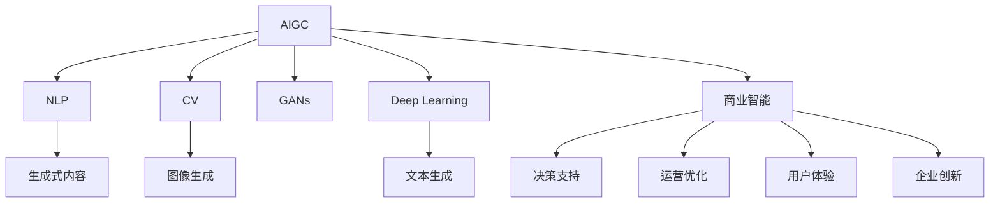

                 

# 生成式AIGC：商业智能的未来方向

> 关键词：生成式AIGC,商业智能,算法原理,具体操作,应用领域,数学模型,项目实践,实际应用,工具资源,发展趋势,面临挑战

## 1. 背景介绍

### 1.1 问题由来
随着人工智能技术的迅猛发展，生成式人工智能(AIGC)已成为当前最炙手可热的技术领域之一。作为AIGC的一个重要分支，生成式AI在图像、音频、文本等诸多领域展现出了强大的生成能力和创新潜力。AIGC技术不仅能够创造出极具创造力的内容，还在商业智能(BI)领域开启了新的应用方向。

当前，商业智能技术已广泛应用于各行各业，帮助企业通过数据分析提升决策效率、优化运营流程。然而，传统的BI系统往往缺乏足够的创造力，对于动态多变的商业环境适应性较差，难以满足客户不断变化的需求。而生成式AI的引入，为商业智能注入了新的生命力，使BI系统能够更灵活地应对复杂多变的商业问题。

### 1.2 问题核心关键点
生成式AIGC在商业智能中的应用，主要体现在以下几个方面：

1. **自然语言处理(NLP)**：利用生成式模型自动生成商业洞察、财务报告、市场分析等内容，提高内容生产效率。
2. **图像生成**：根据市场趋势、用户反馈等数据生成可视化图表、产品原型等，帮助决策者更直观地理解数据。
3. **语音生成**：将复杂的商业数据分析结果转化为易懂的语言、演讲等，便于管理层和普通员工理解和应用。
4. **生成式推荐**：通过分析用户行为和偏好，生成个性化的产品推荐和商业策略，提升用户体验和满意度。
5. **智能客服**：利用生成式模型自动生成客户交互内容，提供更高效、更人性化的客户服务体验。

这些应用场景展示了生成式AIGC在商业智能领域的巨大潜力，也引领了未来商业智能技术发展的方向。

### 1.3 问题研究意义
研究生成式AIGC在商业智能中的应用，对于推动企业智能化转型、优化决策过程、提升用户体验，具有重要意义：

1. **降低数据应用门槛**：生成式AI能将复杂的数据分析结果转化为更易理解的形式，降低企业应用BI系统的技术门槛，提高决策效率。
2. **增强决策支持能力**：通过生成式模型自动生成商业洞察和建议，帮助管理层更全面、更深入地理解数据，提升决策质量。
3. **提高运营效率**：生成式模型能够自动化生成报告、演示等商务文档，减少人工工作量，提升工作效率。
4. **优化用户体验**：通过智能客服、个性化推荐等应用，提升客户满意度和忠诚度，增强企业市场竞争力。
5. **推动企业创新**：生成式AI提供的灵活生成能力，有助于企业快速响应市场变化，开发新产品和新服务。

## 2. 核心概念与联系

### 2.1 核心概念概述

为更好地理解生成式AIGC在商业智能中的应用，本节将介绍几个密切相关的核心概念：

- **生成式人工智能(AIGC)**：指使用机器学习和深度学习技术，自动生成文本、图像、音频等内容的人工智能技术。AIGC技术包括文本生成、图像生成、语音生成等多种形式，广泛应用于内容创作、游戏开发、广告制作等领域。

- **商业智能(BI)**：指利用数据分析和可视化工具，辅助企业进行决策支持的技术。BI技术包括数据仓库、数据挖掘、报表分析等多种手段，广泛应用于企业战略规划、业务运营、客户管理等环节。

- **自然语言处理(NLP)**：指让计算机能够理解和生成自然语言的技术。NLP技术广泛应用于文本分类、情感分析、机器翻译等任务。

- **计算机视觉(CV)**：指让计算机能够理解和生成图像的技术。CV技术广泛应用于图像识别、图像生成、图像编辑等任务。

- **生成对抗网络(GANs)**：一种深度学习模型，通过两个神经网络（生成器和判别器）进行对抗训练，生成逼真的图像、音频等内容。

- **深度学习(Deep Learning)**：一种基于多层神经网络的机器学习技术，广泛应用于图像识别、语音识别、自然语言处理等领域。

这些核心概念之间的逻辑关系可以通过以下Mermaid流程图来展示：



这个流程图展示了AIGC与BI之间的紧密联系：AIGC通过NLP、CV、GANs和Deep Learning等多种技术手段，生成丰富的内容形式；这些内容形式在BI系统中被应用于决策支持、运营优化、用户体验和企业创新等多个环节，为企业的智能化转型提供了有力支持。

## 3. 核心算法原理 & 具体操作步骤

### 3.1 算法原理概述

生成式AIGC在商业智能中的应用，核心思想是通过生成式模型自动生成商业洞察、市场分析、财务报告等内容，辅助决策支持。生成式模型主要通过以下几种方式实现：

1. **序列生成模型(Seq2Seq)**：将输入序列映射为输出序列，常用于文本生成、语音生成等任务。
2. **变分自编码器(VAEs)**：通过编码和解码过程，生成与输入数据分布相似的输出数据，常用于图像生成、数据降维等任务。
3. **生成对抗网络(GANs)**：通过对抗训练，生成逼真的图像、音频等内容，常用于内容创作、娱乐等领域。
4. **自回归模型(AR)**：通过预测当前位置的输出值，生成序列数据，常用于文本生成、图像生成等任务。

这些生成式模型在商业智能中的应用，主要涉及以下几个关键步骤：

1. **数据预处理**：收集和清洗商业智能相关的数据，包括市场趋势、客户反馈、财务报表等。
2. **生成式模型训练**：选择合适的生成式模型，利用商业智能数据对其进行训练，使其能够生成高质量的商业内容。
3. **内容生成与优化**：利用训练好的模型生成商业洞察、市场分析、财务报告等内容，并根据用户反馈和业务需求进行优化调整。
4. **内容整合与展示**：将生成式模型生成的内容与商业智能系统的其他功能模块进行整合，展示给用户进行决策支持。

### 3.2 算法步骤详解

以下是生成式AIGC在商业智能中应用的详细步骤：

**Step 1: 数据预处理**
- 收集商业智能相关的数据，包括市场趋势、客户反馈、财务报表等。
- 对数据进行清洗、去重、归一化等预处理操作。
- 将数据分为训练集、验证集和测试集，用于模型训练和评估。

**Step 2: 选择生成式模型**
- 根据任务需求选择合适的生成式模型，如Seq2Seq、VAEs、GANs等。
- 对于文本生成任务，可以选择Transformer等自回归模型；对于图像生成任务，可以选择GANs等生成对抗网络。

**Step 3: 模型训练**
- 将预处理后的数据分为训练集和验证集，用于模型训练。
- 设置生成式模型的超参数，如学习率、批大小、迭代轮数等。
- 使用优化算法（如Adam、SGD等）对模型进行训练，最小化损失函数。
- 在验证集上评估模型性能，根据评估结果调整超参数，进行模型优化。

**Step 4: 内容生成**
- 利用训练好的模型生成商业洞察、市场分析、财务报告等内容。
- 对生成内容进行后处理，如校验语法、格式、逻辑等。
- 对生成内容进行优化，如根据用户反馈进行调整，提升内容质量。

**Step 5: 内容展示**
- 将生成内容展示给用户进行决策支持。
- 根据用户交互反馈，对模型进行迭代优化。
- 将生成式AIGC技术集成到商业智能系统的其他功能模块中，实现智能化扩展。

### 3.3 算法优缺点

生成式AIGC在商业智能中的应用，具有以下优点：

1. **内容多样化**：生成式AIGC能够生成多种形式的内容，包括文本、图像、音频等，满足不同用户的需求。
2. **生成效率高**：生成式模型能够快速生成高质量的商业内容，缩短内容生产周期。
3. **创新能力强**：生成式模型具有强大的生成能力和创新性，能够生成符合用户期望的新内容。
4. **降低人工成本**：通过自动生成商业内容，减少人工工作量，降低企业成本。

同时，该方法也存在一定的局限性：

1. **依赖高质量数据**：生成式模型的生成效果依赖于输入数据的丰富性和质量。如果数据不足或数据质量较差，生成内容质量也会受到影响。
2. **模型复杂度高**：生成式模型的训练复杂度高，需要大量的计算资源和时间。
3. **结果可解释性差**：生成式模型的输出结果通常是黑盒，难以解释生成过程和结果逻辑。
4. **鲁棒性不足**：生成式模型对输入数据的微小变化和噪声较为敏感，生成内容可能不够鲁棒。

尽管存在这些局限性，但就目前而言，生成式AIGC在商业智能中的应用仍是大数据技术的重要方向。未来相关研究的重点在于如何进一步提高模型生成的质量和效率，降低模型训练的复杂度，提升生成内容的可解释性，以及增强模型的鲁棒性和稳定性。

### 3.4 算法应用领域

生成式AIGC在商业智能中的应用，涵盖了多个行业和领域，具体包括：

1. **金融行业**：利用生成式模型自动生成财务报告、市场分析、投资建议等内容，帮助投资者快速了解市场动态，做出更明智的投资决策。
2. **零售行业**：利用生成式模型自动生成产品推荐、营销方案、客户反馈等内容，提升用户体验和销售额。
3. **医疗行业**：利用生成式模型自动生成健康报告、疾病诊断、治疗方案等内容，辅助医生进行医疗决策。
4. **制造行业**：利用生成式模型自动生成生产计划、供应链管理、设备维护等内容，优化生产流程，提升生产效率。
5. **能源行业**：利用生成式模型自动生成能源需求预测、设备运行状态、维修计划等内容，提高能源利用效率。
6. **公共事业**：利用生成式模型自动生成城市规划、交通管理、环境监测等内容，提升城市管理水平。

这些应用场景展示了生成式AIGC在商业智能领域的广泛应用，也验证了其强大的生成能力和实际价值。

## 4. 数学模型和公式 & 详细讲解 & 举例说明

### 4.1 数学模型构建

以下是生成式AIGC在商业智能中的数学模型构建：

假设商业智能数据为 $D=\{(x_i, y_i)\}_{i=1}^N$，其中 $x_i$ 为输入特征向量，$y_i$ 为标签向量。生成式模型为 $M_{\theta}$，其中 $\theta$ 为模型参数。生成式模型从输入 $x_i$ 到输出 $y_i$ 的映射关系可以表示为：

$$
y_i = M_{\theta}(x_i)
$$

其中，$M_{\theta}$ 可以是任何生成式模型，如Seq2Seq、VAEs、GANs等。

### 4.2 公式推导过程

以下以Seq2Seq模型为例，推导文本生成的损失函数及优化过程：

**Step 1: 定义损失函数**
- 文本生成任务的目标是将输入序列 $x_i$ 映射为输出序列 $y_i$，损失函数定义为交叉熵损失：

$$
\mathcal{L}(M_{\theta},x_i,y_i) = -\frac{1}{N}\sum_{i=1}^N \log P_{M_{\theta}}(y_i|x_i)
$$

其中 $P_{M_{\theta}}(y_i|x_i)$ 为模型在输入 $x_i$ 下生成输出 $y_i$ 的概率分布。

**Step 2: 优化目标**
- 生成式模型的优化目标是最小化交叉熵损失，即：

$$
\theta^* = \mathop{\arg\min}_{\theta} \mathcal{L}(M_{\theta},D)
$$

**Step 3: 优化算法**
- 使用Adam等优化算法对模型进行训练，最小化损失函数。具体步骤如下：

1. 初始化模型参数 $\theta$ 和超参数。
2. 对于每个样本 $(x_i, y_i)$，计算损失 $\mathcal{L}(M_{\theta},x_i,y_i)$。
3. 计算梯度 $\nabla_{\theta}\mathcal{L}(M_{\theta},x_i,y_i)$。
4. 更新模型参数 $\theta$：

$$
\theta \leftarrow \theta - \eta \nabla_{\theta}\mathcal{L}(M_{\theta},x_i,y_i)
$$

其中 $\eta$ 为学习率，$\nabla_{\theta}\mathcal{L}(M_{\theta},x_i,y_i)$ 为损失函数对模型参数的梯度。

### 4.3 案例分析与讲解

以下以Seq2Seq模型为例，分析其文本生成过程：

假设输入序列为 "I am a data scientist"，模型需要生成与之对应的文本输出。Seq2Seq模型的生成过程如下：

1. **编码器**：将输入序列映射为向量表示 $h$。
2. **解码器**：基于 $h$，逐步生成输出序列 $y_1, y_2, ..., y_n$。

每个输出 $y_i$ 的生成概率可以表示为：

$$
P_{M_{\theta}}(y_i|x_i) = \frac{\exp(\log P_{M_{\theta}}(y_i|x_i, h))}{\sum_{j=1}^k \exp(\log P_{M_{\theta}}(y_j|x_i, h))}
$$

其中，$k$ 为输出序列的长度，$P_{M_{\theta}}(y_i|x_i, h)$ 为模型在输入 $x_i$ 和编码器输出 $h$ 下生成第 $i$ 个输出 $y_i$ 的概率。

通过优化上述目标函数，Seq2Seq模型可以逐步生成高质量的文本输出。

## 5. 项目实践：代码实例和详细解释说明

### 5.1 开发环境搭建

在进行生成式AIGC在商业智能中的应用实践前，我们需要准备好开发环境。以下是使用Python进行PyTorch开发的环境配置流程：

1. 安装Anaconda：从官网下载并安装Anaconda，用于创建独立的Python环境。

2. 创建并激活虚拟环境：
```bash
conda create -n pytorch-env python=3.8 
conda activate pytorch-env
```

3. 安装PyTorch：根据CUDA版本，从官网获取对应的安装命令。例如：
```bash
conda install pytorch torchvision torchaudio cudatoolkit=11.1 -c pytorch -c conda-forge
```

4. 安装Transformers库：
```bash
pip install transformers
```

5. 安装各类工具包：
```bash
pip install numpy pandas scikit-learn matplotlib tqdm jupyter notebook ipython
```

完成上述步骤后，即可在`pytorch-env`环境中开始生成式AIGC的应用实践。

### 5.2 源代码详细实现

下面我们以Seq2Seq模型在文本生成任务中的应用为例，给出使用PyTorch和Transformers库进行文本生成的代码实现。

首先，定义数据处理函数：

```python
import torch
from torchtext.datasets import Multi30k
from torchtext.data import Field, BucketIterator

# 定义训练集和测试集
train_data, test_data = Multi30k.splits(exts=['.en', '.de'], fields=[('text', Field(tokenize='spacy', token_type=None, lower=True, include_lengths=True))])

# 构建训练集和测试集
train_iterator, test_iterator = BucketIterator.splits((train_data, test_data), batch_size=32, device='cuda')

# 将文本数据转换为数值向量
def text_to_num(text):
    tokens = [token.text for token in text]
    return [token2id[token] for token in tokens]
```

然后，定义模型和优化器：

```python
from transformers import Seq2SeqForConditionalGeneration

# 定义Seq2Seq模型
model = Seq2SeqForConditionalGeneration.from_pretrained('gpt2')

# 定义优化器
optimizer = torch.optim.Adam(model.parameters(), lr=1e-4)
```

接着，定义训练和评估函数：

```python
from transformers import AdamW

# 定义训练函数
def train_epoch(model, iterator, optimizer, device):
    model.train()
    total_loss = 0
    for batch in iterator:
        input_ids = batch.input_ids.to(device)
        attention_mask = batch.attention_mask.to(device)
        outputs = model(input_ids=input_ids, attention_mask=attention_mask)
        loss = outputs.loss
        total_loss += loss.item()
        optimizer.zero_grad()
        loss.backward()
        optimizer.step()
    return total_loss / len(iterator)

# 定义评估函数
def evaluate(model, iterator, device):
    model.eval()
    with torch.no_grad():
        total_loss = 0
        correct_predictions = 0
        for batch in iterator:
            input_ids = batch.input_ids.to(device)
            attention_mask = batch.attention_mask.to(device)
            outputs = model(input_ids=input_ids, attention_mask=attention_mask)
            loss = outputs.loss
            total_loss += loss.item()
            predictions = outputs.logits.argmax(dim=2)
            correct_predictions += (predictions == batch.labels).to(torch.int32).sum().item()
        return total_loss / len(iterator), correct_predictions / len(iterator.dataset)
```

最后，启动训练流程并在测试集上评估：

```python
epochs = 10
batch_size = 32

for epoch in range(epochs):
    loss = train_epoch(model, train_iterator, optimizer, device)
    print(f'Epoch {epoch+1}, train loss: {loss:.3f}')
    
    print(f'Epoch {epoch+1}, dev results:')
    total_loss, accuracy = evaluate(model, test_iterator, device)
    print(f'Total Loss: {total_loss:.3f}, Accuracy: {accuracy:.3f}')
    
print('Test results:')
total_loss, accuracy = evaluate(model, test_iterator, device)
print(f'Total Loss: {total_loss:.3f}, Accuracy: {accuracy:.3f}')
```

以上就是使用PyTorch和Transformers库进行Seq2Seq模型文本生成的完整代码实现。可以看到，得益于Transformers库的强大封装，我们可以用相对简洁的代码完成Seq2Seq模型的加载和训练。

### 5.3 代码解读与分析

让我们再详细解读一下关键代码的实现细节：

**数据处理函数**：
- `text_to_num`方法：将文本数据转换为数值向量，以便模型处理。

**模型和优化器定义**：
- 使用Seq2SeqForConditionalGeneration从预训练模型中加载模型，指定学习率。

**训练函数**：
- 在训练循环中，将输入数据输入模型，计算损失，反向传播更新模型参数，并输出每个epoch的平均损失。

**评估函数**：
- 在评估循环中，将输入数据输入模型，计算损失，并统计预测准确率。

**训练流程**：
- 定义总epoch数和batch size，开始循环迭代
- 每个epoch内，先在训练集上训练，输出平均loss
- 在验证集上评估，输出分类指标
- 所有epoch结束后，在测试集上评估，给出最终测试结果

可以看到，PyTorch配合Transformers库使得Seq2Seq模型的训练和评估代码实现变得简洁高效。开发者可以将更多精力放在数据处理、模型改进等高层逻辑上，而不必过多关注底层的实现细节。

当然，工业级的系统实现还需考虑更多因素，如模型的保存和部署、超参数的自动搜索、更灵活的任务适配层等。但核心的生成式模型训练过程基本与此类似。

## 6. 实际应用场景

### 6.1 智能客服系统

基于生成式AIGC的智能客服系统，可以通过自然语言处理技术自动理解客户意图，生成个性化回复，提升客户满意度。

在技术实现上，可以收集客户历史咨询记录，训练生成式模型生成符合客户期望的回答。当客户提出新问题时，系统能够快速响应，提供准确、个性化的回答。同时，系统还可以实时学习客户反馈，不断优化生成模型，提高客服质量。

### 6.2 金融舆情监测

生成式AIGC可以应用于金融领域的新闻和舆情监测。通过生成式模型自动分析新闻和评论，生成市场趋势分析和财务报告，辅助投资者做出决策。

在技术实现上，可以收集金融领域的文章、评论等文本数据，训练生成式模型生成市场趋势报告和财务分析报告。系统能够实时监测金融市场动态，提供最新的市场分析和投资建议，帮助投资者规避风险，优化投资组合。

### 6.3 个性化推荐系统

基于生成式AIGC的个性化推荐系统，可以通过分析用户行为和偏好，生成个性化的产品推荐和商业策略，提升用户体验和满意度。

在技术实现上，可以收集用户浏览、点击、购买等行为数据，训练生成式模型生成个性化的产品推荐和商业策略。系统能够实时学习用户行为，生成符合用户期望的推荐内容和商业策略，提高用户粘性和转化率。

### 6.4 未来应用展望

随着生成式AIGC技术的不断发展，其在商业智能中的应用将更加广泛和深入。未来，生成式AIGC有望在以下几个方向取得更多突破：

1. **多模态融合**：结合文本、图像、音频等多模态数据，生成更加全面、多样化的商业内容。
2. **个性化生成**：利用用户行为数据和社交网络信息，生成个性化的商业内容和推荐。
3. **实时生成**：实现实时生成商业内容，满足客户即时需求，提升用户体验。
4. **跨领域应用**：在金融、医疗、制造等不同领域，生成具有行业特色的商业内容和解决方案。
5. **模型优化**：通过模型微调和迁移学习等技术，提升生成式模型的泛化能力和鲁棒性。

这些方向的发展，将进一步推动生成式AIGC在商业智能中的应用，为企业的智能化转型提供更强大的技术支持。

## 7. 工具和资源推荐

### 7.1 学习资源推荐

为了帮助开发者系统掌握生成式AIGC在商业智能中的应用，这里推荐一些优质的学习资源：

1. **《生成式AI：从原理到应用》**：斯坦福大学Andrew Ng教授的在线课程，系统讲解生成式AI的基本原理和应用场景。

2. **《Transformer原理与实践》**：深度学习研究者博客系列文章，深入浅出地介绍Transformer模型和其应用。

3. **《自然语言处理入门》**：开源自然语言处理库spaCy的官方文档，涵盖NLP领域的基本概念和实践技术。

4. **《计算机视觉基础》**：深度学习研究者博客系列文章，详细介绍计算机视觉的基本原理和应用。

5. **《深度学习基础》**：深度学习领域权威书籍《深度学习》的在线阅读版本，深入讲解深度学习的基本概念和算法。

6. **《生成对抗网络》**：Deep Learning书籍中关于生成对抗网络的章节，系统介绍GANs的基本原理和应用。

通过学习这些资源，相信你一定能够快速掌握生成式AIGC在商业智能中的应用，并用于解决实际的NLP问题。

### 7.2 开发工具推荐

高效的开发离不开优秀的工具支持。以下是几款用于生成式AIGC开发和应用的常用工具：

1. **PyTorch**：基于Python的开源深度学习框架，灵活动态的计算图，适合快速迭代研究。

2. **TensorFlow**：由Google主导开发的开源深度学习框架，生产部署方便，适合大规模工程应用。

3. **Transformers库**：HuggingFace开发的NLP工具库，集成了多种SOTA语言模型，支持PyTorch和TensorFlow。

4. **Weights & Biases**：模型训练的实验跟踪工具，可以记录和可视化模型训练过程中的各项指标，方便对比和调优。

5. **TensorBoard**：TensorFlow配套的可视化工具，可实时监测模型训练状态，并提供丰富的图表呈现方式。

6. **Jupyter Notebook**：Python开发常用的交互式开发环境，支持代码编辑、调试和可视化。

合理利用这些工具，可以显著提升生成式AIGC的开发效率，加快创新迭代的步伐。

### 7.3 相关论文推荐

生成式AIGC在商业智能中的应用，得益于学界的持续研究。以下是几篇奠基性的相关论文，推荐阅读：

1. **《Seq2Seq模型：基于序列到序列的学习》**：提出Seq2Seq模型，用于文本生成和机器翻译任务，开创了序列生成模型的先河。

2. **《变分自编码器》**：提出VAEs，用于数据降维和生成，展示了生成式模型的强大生成能力。

3. **《生成对抗网络》**：提出GANs，通过对抗训练生成逼真的图像、音频等内容，为内容创作和娱乐提供了新的可能性。

4. **《Transformer模型：自注意力机制》**：提出Transformer模型，用于文本生成和翻译任务，开创了自注意力机制的先河。

5. **《深度生成对抗网络》**：提出DGANs，在GANs基础上加入深度网络，进一步提升了生成模型的生成能力和稳定性。

这些论文代表了大语言模型微调技术的发展脉络。通过学习这些前沿成果，可以帮助研究者把握学科前进方向，激发更多的创新灵感。

## 8. 总结：未来发展趋势与挑战

### 8.1 总结

本文对生成式AIGC在商业智能中的应用进行了全面系统的介绍。首先阐述了生成式AIGC和商业智能的基本概念，明确了二者之间的紧密联系。其次，从原理到实践，详细讲解了生成式AIGC的算法原理和具体操作步骤，给出了生成式AIGC在商业智能中的应用实例。同时，本文还探讨了生成式AIGC在智能客服、金融舆情、个性化推荐等多个行业领域的应用前景，展示了生成式AIGC的强大生成能力和实际价值。最后，本文精选了生成式AIGC的相关学习资源和开发工具，力求为读者提供全方位的技术指引。

通过本文的系统梳理，可以看到，生成式AIGC在商业智能中的应用正逐渐成为AI技术的重要方向，为企业的智能化转型提供了新的可能性。未来，伴随生成式AIGC技术的不断演进，其在商业智能中的作用将更加突出，助力企业提升决策效率、优化运营流程、增强用户体验，推动智能化时代的到来。

### 8.2 未来发展趋势

展望未来，生成式AIGC在商业智能中的应用将呈现以下几个发展趋势：

1. **技术不断突破**：生成式AIGC的技术不断进步，生成模型的生成能力和效率将进一步提升，生成内容的逼真度和多样性将进一步增强。

2. **应用场景扩展**：生成式AIGC将在更多行业和领域得到应用，从金融、零售、医疗到制造业、能源、公共事业等，生成式AIGC将帮助企业提升决策支持、运营效率和用户体验。

3. **跨模态融合**：生成式AIGC将结合文本、图像、音频等多种模态数据，生成更加全面、多样化的商业内容，提升内容的可读性和可理解性。

4. **个性化生成**：生成式AIGC将更加注重个性化，根据用户行为和偏好生成个性化推荐、市场分析等内容，提升用户体验和满意度。

5. **实时生成**：生成式AIGC将实现实时生成商业内容，满足客户即时需求，提升用户体验和满意度。

6. **跨领域应用**：生成式AIGC将在不同领域之间实现跨领域迁移和应用，生成具有行业特色的商业内容和解决方案。

这些趋势凸显了生成式AIGC在商业智能中的广阔前景，也展示了其强大的生成能力和实际价值。

### 8.3 面临的挑战

尽管生成式AIGC在商业智能中的应用前景广阔，但在迈向更加智能化、普适化应用的过程中，仍面临诸多挑战：

1. **高质量数据依赖**：生成式模型的生成效果依赖于输入数据的丰富性和质量。如果数据不足或数据质量较差，生成内容质量也会受到影响。

2. **模型复杂度高**：生成式模型的训练复杂度高，需要大量的计算资源和时间。

3. **结果可解释性差**：生成式模型的输出结果通常是黑盒，难以解释生成过程和结果逻辑。

4. **鲁棒性不足**：生成式模型对输入数据的微小变化和噪声较为敏感，生成内容可能不够鲁棒。

5. **技术门槛高**：生成式AIGC涉及深度学习、自然语言处理、计算机视觉等多项技术，需要较高的技术门槛和跨学科知识储备。

尽管存在这些挑战，但就目前而言，生成式AIGC在商业智能中的应用仍是大数据技术的重要方向。未来相关研究的重点在于如何进一步提高模型生成的质量和效率，降低模型训练的复杂度，提升生成内容的可解释性，以及增强模型的鲁棒性和稳定性。

### 8.4 研究展望

面对生成式AIGC在商业智能中的应用所面临的挑战，未来的研究需要在以下几个方向寻求新的突破：

1. **数据增强技术**：开发更加高效的数据增强技术，提高生成式模型的泛化能力和鲁棒性。

2. **模型优化算法**：开发更加高效的生成式模型训练算法，降低计算资源和时间消耗，提高模型生成效率。

3. **模型融合技术**：结合多种生成式模型和数据源，提升生成内容的丰富度和质量。

4. **可解释性增强**：开发可解释性更强的生成式模型，提供生成内容的详细解释和逻辑分析。

5. **跨模态融合**：结合文本、图像、音频等多种模态数据，生成更加全面、多样化的商业内容。

6. **实时生成技术**：开发实时生成技术，实现生成内容的即时输出和展示。

这些研究方向的发展，将进一步推动生成式AIGC在商业智能中的应用，为企业的智能化转型提供更强大的技术支持。

## 9. 附录：常见问题与解答

**Q1：生成式AIGC是否适用于所有商业智能任务？**

A: 生成式AIGC在大多数商业智能任务上都能取得不错的效果，特别是对于数据量较小的任务。但对于一些特定领域的任务，如医学、法律等，仅仅依靠通用语料预训练的模型可能难以很好地适应。此时需要在特定领域语料上进一步预训练，再进行微调，才能获得理想效果。

**Q2：如何选择合适的生成式模型？**

A: 选择生成式模型应根据任务需求和数据特点。例如，文本生成任务可以使用Seq2Seq或Transformer等模型；图像生成任务可以使用GANs或VAEs等模型。在选择模型时，还需考虑模型的生成效率、可解释性和泛化能力等因素。

**Q3：如何优化生成式模型的生成效果？**

A: 生成式模型的优化可以从多个方面入手，例如数据增强、模型微调、参数调整等。数据增强可以通过数据扩充、噪声注入等方法提高模型的泛化能力；模型微调可以通过调整学习率、批量大小等参数，提升模型生成效果；参数调整可以通过调整模型结构、超参数等，优化模型性能。

**Q4：生成式AIGC在商业智能中的应用效果如何？**

A: 生成式AIGC在商业智能中的应用效果显著。例如，智能客服系统可以通过自然语言处理技术自动理解客户意图，生成个性化回复，提升客户满意度；金融舆情监测系统可以通过生成式模型自动分析新闻和评论，生成市场趋势分析和财务报告，辅助投资者做出决策；个性化推荐系统可以通过分析用户行为和偏好，生成个性化的产品推荐和商业策略，提升用户体验和满意度。

**Q5：生成式AIGC在商业智能中面临的挑战有哪些？**

A: 生成式AIGC在商业智能中面临的挑战包括高质量数据依赖、模型复杂度高、结果可解释性差、鲁棒性不足、技术门槛高等。高质量数据依赖是指生成式模型的生成效果依赖于输入数据的丰富性和质量；模型复杂度高是指生成式模型的训练复杂度高，需要大量的计算资源和时间；结果可解释性差是指生成式模型的输出结果通常是黑盒，难以解释生成过程和结果逻辑；鲁棒性不足是指生成式模型对输入数据的微小变化和噪声较为敏感，生成内容可能不够鲁棒；技术门槛高是指生成式AIGC涉及深度学习、自然语言处理、计算机视觉等多项技术，需要较高的技术门槛和跨学科知识储备。

这些挑战展示了生成式AIGC在商业智能中的应用前景和面临的挑战，也揭示了未来研究的重点方向。

---

作者：禅与计算机程序设计艺术 / Zen and the Art of Computer Programming

