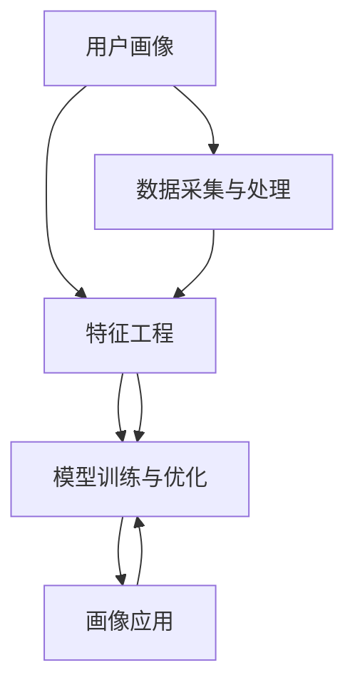

                 

# 用户画像技术：AI的应用

> 关键词：用户画像, AI应用, 数据驱动, 数据科学, 个性化营销, 推荐系统, 决策支持, 市场分析

## 1. 背景介绍

### 1.1 问题由来

在数字化时代的今天，用户数据成为了企业最宝贵的资产之一。如何有效地利用这些数据，洞察用户行为，提升用户体验，成为各行各业关注的焦点。在这个过程中，用户画像技术扮演了关键角色，通过构建细致、精确的用户画像，企业可以更好地理解用户需求，制定精准的市场策略。

用户画像技术基于数据驱动的理念，通过挖掘、整合用户行为数据、人口统计数据、社交数据等，形成对用户多维度、全面的描述。这些画像不仅能够帮助企业精准定位目标用户，还能够指导产品开发、市场推广、客户服务等各个环节，提升企业的运营效率和竞争力。

### 1.2 问题核心关键点

用户画像技术的核心在于如何将海量、异构的用户数据，通过机器学习和数据挖掘技术，转化为对用户特征的全面理解和预测。常见的用户画像包括基本属性画像、行为画像、情感画像等。其中，基本属性画像包括年龄、性别、职业、地理位置等；行为画像包括购买行为、浏览行为、互动行为等；情感画像则涉及用户的态度、情绪等。

用户画像的构建流程一般包括以下几个关键步骤：数据收集、数据清洗、特征工程、模型训练、画像优化和应用部署。这些步骤通过不同的技术和工具，形成了一条完整的用户画像构建链路。

用户画像技术在现代企业中的应用范围十分广泛，包括个性化营销、推荐系统、客户服务、市场分析等多个领域。在实际应用中，企业需要根据具体业务需求，选择合适的画像构建方法和工具，以获得最优的用户画像效果。

### 1.3 问题研究意义

用户画像技术的深入研究，对于提升企业的数据治理能力、优化用户体验、实现精准营销和决策支持具有重要意义：

1. **提升数据治理能力**：通过构建高质量的用户画像，企业能够更好地管理海量用户数据，确保数据的准确性和一致性。
2. **优化用户体验**：用户画像能够帮助企业深入了解用户需求，提供个性化的产品和服务，提升用户的满意度和忠诚度。
3. **实现精准营销**：基于用户画像，企业可以制定更为精准的市场推广策略，提升广告投放的转化率和效果。
4. **决策支持**：用户画像为企业的市场分析、产品开发、客户服务等环节提供了数据支撑，辅助企业做出更加科学的决策。
5. **市场分析**：用户画像能够帮助企业洞察市场趋势和用户行为变化，预测未来市场需求，制定灵活的市场策略。

## 2. 核心概念与联系

### 2.1 核心概念概述

用户画像技术涉及多个关键概念，它们相互联系，共同构成了用户画像的完整体系。以下是几个核心概念的概述：

- **用户画像**：通过数据挖掘和机器学习技术，构建对用户多维度、全面的描述。
- **数据采集与处理**：包括数据的收集、清洗、标注等过程，为画像构建提供基础数据支撑。
- **特征工程**：通过数据特征的提取、组合、选择等，优化数据质量，提升模型的预测能力。
- **模型训练与优化**：选择合适的机器学习模型，对特征进行训练，并通过超参数调整、模型融合等技术，优化模型性能。
- **画像应用**：将训练好的用户画像应用于市场分析、推荐系统、个性化营销等场景，实现业务价值。

这些核心概念之间的逻辑关系可以通过以下Mermaid流程图来展示：



这个流程图展示了大用户画像构建的核心概念及其之间的关系：

1. 用户画像的构建从数据采集与处理开始，为后续的特征工程和模型训练提供数据基础。
2. 特征工程通过提取和组合数据特征，优化数据质量，提升模型预测能力。
3. 模型训练与优化通过选择合适的机器学习模型，并对超参数进行调整和优化，最终形成高质量的用户画像。
4. 用户画像通过应用部署，被应用于市场分析、推荐系统、个性化营销等实际场景中，实现业务价值。

## 3. 核心算法原理 & 具体操作步骤
### 3.1 算法原理概述

用户画像技术的核心在于通过机器学习和数据挖掘技术，从海量用户数据中提取、组合、预测用户特征。常见的用户画像构建方法包括基于聚类、分类、关联规则等算法的无监督学习和基于回归、决策树、深度学习等算法的监督学习。

基于监督学习的方法通常包括以下几个步骤：

1. **数据预处理**：清洗、归一化、特征选择等步骤，为模型训练提供高质量的数据。
2. **特征提取**：通过主成分分析(PCA)、奇异值分解(SVD)、特征哈希等技术，提取数据中的有用信息。
3. **模型选择与训练**：根据具体业务需求，选择合适的机器学习模型，如决策树、随机森林、支持向量机(SVM)、神经网络等，对特征进行训练。
4. **模型评估与优化**：通过交叉验证、网格搜索等技术，评估模型性能，并进行超参数调整和模型融合。

### 3.2 算法步骤详解

以下是基于监督学习的用户画像构建步骤的详细讲解：

**Step 1: 数据预处理**
1. **数据清洗**：去除缺失、噪声、异常值等，确保数据的完整性和一致性。
2. **数据归一化**：对数值型数据进行归一化，避免不同特征之间的量级差异影响模型效果。
3. **特征选择**：通过相关性分析、信息增益等方法，选择对用户画像预测效果有贡献的特征。

**Step 2: 特征提取**
1. **主成分分析(PCA)**：通过降维技术，提取数据的最大方差成分，减少特征维度。
2. **奇异值分解(SVD)**：通过矩阵分解技术，提取数据的低秩近似，简化模型复杂度。
3. **特征哈希**：通过哈希技术，将高维特征映射到低维空间，提高模型效率。

**Step 3: 模型选择与训练**
1. **回归模型**：使用线性回归、岭回归、Lasso回归等，预测连续型用户特征，如年龄、消费水平等。
2. **分类模型**：使用逻辑回归、决策树、随机森林等，预测离散型用户特征，如性别、兴趣类型等。
3. **深度学习模型**：使用神经网络、卷积神经网络(CNN)、循环神经网络(RNN)等，通过多层非线性变换，预测复杂的用户特征。

**Step 4: 模型评估与优化**
1. **交叉验证**：通过K-fold交叉验证，评估模型在未见过的数据上的泛化能力。
2. **网格搜索**：通过超参数网格搜索，选择最优的模型参数组合。
3. **模型融合**：通过集成学习技术，如Bagging、Boosting等，提高模型的预测能力和鲁棒性。

### 3.3 算法优缺点

用户画像技术在提升企业数据治理能力、优化用户体验、实现精准营销和决策支持等方面具有显著优势，但也存在一些局限性：

**优点**：
1. **数据驱动**：通过数据挖掘和机器学习技术，构建精确的用户画像，为业务决策提供数据支撑。
2. **全面性**：用户画像能够从多维度、全面地描述用户特征，提供更加丰富的洞察。
3. **精准营销**：基于用户画像，企业可以制定更为精准的市场推广策略，提升广告投放效果。
4. **决策支持**：用户画像为市场分析、产品开发、客户服务等环节提供数据支撑，辅助企业做出科学决策。

**缺点**：
1. **数据隐私**：用户画像涉及大量个人隐私数据，需要遵守相关法律法规，保护用户隐私。
2. **数据质量**：用户画像的构建依赖高质量的数据，数据采集、清洗、标注等环节容易出现误差。
3. **计算资源**：用户画像的构建需要大量的计算资源，模型训练和特征工程等环节可能需要较高的计算成本。
4. **模型解释性**：用户画像模型通常是黑盒模型，难以解释其内部工作机制和决策逻辑。
5. **模型更新**：用户画像需要定期更新，以反映用户行为和市场变化，更新频率和成本需要合理平衡。

### 3.4 算法应用领域

用户画像技术在多个领域都有广泛应用，以下是几个典型场景：

**个性化推荐系统**：用户画像能够帮助推荐系统了解用户的兴趣和偏好，推荐符合用户需求的商品或内容。例如，电商平台的商品推荐、视频网站的个性化视频推荐等。

**客户服务**：用户画像能够帮助客户服务系统更好地理解客户需求，提供个性化的服务。例如，客服系统的自动回复、智能客服机器人等。

**市场分析**：用户画像能够帮助企业洞察市场趋势和用户行为变化，制定灵活的市场策略。例如，用户增长分析、市场细分、用户流失预测等。

**广告投放**：用户画像能够帮助广告系统进行精准的受众定位，提升广告投放的转化率和效果。例如，精准广告投放、定向广告推荐等。

**品牌营销**：用户画像能够帮助企业制定精准的品牌营销策略，提升品牌知名度和用户忠诚度。例如，基于用户画像的营销活动策划、品牌影响力分析等。

**社交媒体分析**：用户画像能够帮助企业分析用户在社交媒体上的行为和兴趣，制定针对性的社交媒体营销策略。例如，社交媒体用户细分、广告效果评估等。

## 4. 数学模型和公式 & 详细讲解
### 4.1 数学模型构建

用户画像的构建过程可以通过数学模型来描述。我们以用户行为画像的构建为例，介绍常见的数学模型。

假设用户行为数据为 $D=\{(x_i, y_i)\}_{i=1}^N$，其中 $x_i$ 为特征向量，$y_i$ 为用户行为标签。我们希望构建一个线性回归模型 $f(x;w)=\hat{y}$，其中 $w$ 为模型参数。我们的目标是最小化损失函数：

$$
\mathcal{L}(w) = \frac{1}{N} \sum_{i=1}^N (y_i - f(x_i;w))^2
$$

这是一个标准的线性回归问题，我们可以使用梯度下降等优化算法求解：

$$
w \leftarrow w - \eta \nabla_{w}\mathcal{L}(w)
$$

其中 $\eta$ 为学习率。

### 4.2 公式推导过程

以下是对上述线性回归模型进行详细推导：

**Step 1: 假设与目标函数**
假设用户行为数据为 $D=\{(x_i, y_i)\}_{i=1}^N$，其中 $x_i$ 为特征向量，$y_i$ 为用户行为标签。我们希望构建一个线性回归模型 $f(x;w)=\hat{y}$，其中 $w$ 为模型参数。我们的目标是最小化损失函数：

$$
\mathcal{L}(w) = \frac{1}{N} \sum_{i=1}^N (y_i - f(x_i;w))^2
$$

**Step 2: 目标函数的求解**
通过链式法则，可以得到目标函数对 $w$ 的梯度：

$$
\nabla_{w}\mathcal{L}(w) = \frac{2}{N} \sum_{i=1}^N (y_i - f(x_i;w))x_i
$$

通过梯度下降算法，不断迭代更新 $w$，直到损失函数最小化：

$$
w \leftarrow w - \eta \nabla_{w}\mathcal{L}(w)
$$

其中 $\eta$ 为学习率，通常取值较小，如0.01。

### 4.3 案例分析与讲解

我们以电商平台的个性化推荐系统为例，详细讲解用户画像的构建过程：

**Step 1: 数据预处理**
1. **数据清洗**：去除缺失、噪声、异常值等，确保数据的完整性和一致性。
2. **数据归一化**：对数值型数据进行归一化，避免不同特征之间的量级差异影响模型效果。
3. **特征选择**：通过相关性分析、信息增益等方法，选择对用户画像预测效果有贡献的特征，如用户浏览历史、购买记录、商品评价等。

**Step 2: 特征提取**
1. **主成分分析(PCA)**：通过降维技术，提取数据的最大方差成分，减少特征维度。
2. **奇异值分解(SVD)**：通过矩阵分解技术，提取数据的低秩近似，简化模型复杂度。
3. **特征哈希**：通过哈希技术，将高维特征映射到低维空间，提高模型效率。

**Step 3: 模型选择与训练**
1. **回归模型**：使用线性回归、岭回归、Lasso回归等，预测连续型用户特征，如年龄、消费水平等。
2. **分类模型**：使用逻辑回归、决策树、随机森林等，预测离散型用户特征，如性别、兴趣类型等。
3. **深度学习模型**：使用神经网络、卷积神经网络(CNN)、循环神经网络(RNN)等，通过多层非线性变换，预测复杂的用户特征。

**Step 4: 模型评估与优化**
1. **交叉验证**：通过K-fold交叉验证，评估模型在未见过的数据上的泛化能力。
2. **网格搜索**：通过超参数网格搜索，选择最优的模型参数组合。
3. **模型融合**：通过集成学习技术，如Bagging、Boosting等，提高模型的预测能力和鲁棒性。

## 5. 项目实践：代码实例和详细解释说明
### 5.1 开发环境搭建

在进行用户画像项目实践前，我们需要准备好开发环境。以下是使用Python进行Scikit-Learn开发的环境配置流程：

1. 安装Anaconda：从官网下载并安装Anaconda，用于创建独立的Python环境。

2. 创建并激活虚拟环境：
```bash
conda create -n user_profile_env python=3.8 
conda activate user_profile_env
```

3. 安装Scikit-Learn、Numpy等工具包：
```bash
conda install scikit-learn numpy pandas scikit-image matplotlib jupyter notebook ipython
```

4. 安装TensorFlow、Keras等深度学习工具包：
```bash
conda install tensorflow keras tensorflow_datasets tensorflow_hub
```

完成上述步骤后，即可在`user_profile_env`环境中开始用户画像项目实践。

### 5.2 源代码详细实现

以下是一个基于Scikit-Learn的线性回归模型的用户画像构建代码实现：

```python
import numpy as np
from sklearn.model_selection import train_test_split
from sklearn.linear_model import LinearRegression
from sklearn.metrics import mean_squared_error

# 准备数据
X = np.array([[0.5, 1.5, 2.5, 3.5, 4.5, 5.5],
              [0.6, 1.6, 2.6, 3.6, 4.6, 5.6],
              [0.7, 1.7, 2.7, 3.7, 4.7, 5.7],
              [0.8, 1.8, 2.8, 3.8, 4.8, 5.8],
              [0.9, 1.9, 2.9, 3.9, 4.9, 5.9],
              [1.0, 2.0, 3.0, 4.0, 5.0, 6.0]])

y = np.array([0.8, 1.5, 2.2, 2.9, 3.6, 4.3])

# 划分训练集和测试集
X_train, X_test, y_train, y_test = train_test_split(X, y, test_size=0.2, random_state=42)

# 训练模型
model = LinearRegression()
model.fit(X_train, y_train)

# 预测和评估
y_pred = model.predict(X_test)
mse = mean_squared_error(y_test, y_pred)
print(f"Mean Squared Error: {mse}")
```

### 5.3 代码解读与分析

让我们再详细解读一下关键代码的实现细节：

**数据准备**：
- 使用NumPy库创建训练样本和目标标签。

**模型训练**：
- 使用Scikit-Learn的`train_test_split`方法划分训练集和测试集。
- 创建线性回归模型对象，并使用`fit`方法对训练集进行模型训练。

**预测和评估**：
- 使用训练好的模型对测试集进行预测，并计算预测误差。

**输出**：
- 输出均方误差(MSE)，衡量模型预测的准确性。

以上代码实现了一个简单的线性回归模型，用于预测用户的行为特征。通过数据预处理、特征工程和模型训练等步骤，可以构建出更为复杂和精准的用户画像模型。

## 6. 实际应用场景
### 6.1 智能客服系统

智能客服系统是用户画像技术的重要应用场景之一。通过构建用户画像，智能客服系统可以更好地理解用户需求，提供个性化的服务。例如，智能客服机器人可以根据用户的历史行为数据，识别出用户的常见问题和需求，并自动生成回复，提升用户体验。

**实现方式**：
- 收集用户的历史对话记录、客服响应记录等数据。
- 对数据进行预处理，包括数据清洗、特征提取等。
- 使用用户画像技术，构建用户的兴趣、意图、情感等画像。
- 在智能客服系统中，利用用户画像进行需求匹配和推荐，生成自动回复。

**效果提升**：
- 提升用户满意度：通过个性化服务，用户获得更好的服务体验。
- 提高效率：智能客服系统可以24小时不间断服务，降低人力成本。
- 提升转化率：个性化服务可以提升用户的购买意愿，提高转化率。

### 6.2 个性化推荐系统

个性化推荐系统是用户画像技术的另一个重要应用场景。通过构建用户画像，推荐系统可以更好地了解用户需求，推荐符合用户兴趣的商品或内容。例如，电商平台可以根据用户的历史浏览记录和购买行为，推荐个性化的商品，提升用户的购物体验。

**实现方式**：
- 收集用户的历史浏览记录、购买记录、评价记录等数据。
- 对数据进行预处理，包括数据清洗、特征提取等。
- 使用用户画像技术，构建用户的兴趣、行为、偏好等画像。
- 在推荐系统中，利用用户画像进行需求匹配和推荐，生成个性化推荐。

**效果提升**：
- 提升用户满意度：个性化推荐可以提升用户的购物体验，增加满意度。
- 提升转化率：个性化推荐可以提高用户的购买意愿，增加转化率。
- 提升留存率：个性化推荐可以提高用户的粘性，增加留存率。

### 6.3 市场分析

市场分析是用户画像技术在企业决策支持中的应用场景之一。通过构建用户画像，企业可以更好地理解市场趋势和用户行为变化，制定灵活的市场策略。例如，企业可以通过用户画像分析市场细分，制定针对不同用户群体的营销策略。

**实现方式**：
- 收集用户的行为数据、人口统计数据、社交数据等。
- 对数据进行预处理，包括数据清洗、特征提取等。
- 使用用户画像技术，构建用户的兴趣、行为、偏好等画像。
- 在市场分析中，利用用户画像进行市场细分、趋势预测、用户流失预测等。

**效果提升**：
- 提升市场预测准确性：用户画像可以提升市场预测的准确性，减少市场风险。
- 提升决策支持能力：用户画像可以提供丰富的洞察，辅助企业做出科学决策。
- 提升竞争力：通过精准的市场策略，提升企业的市场竞争力。

## 7. 工具和资源推荐
### 7.1 学习资源推荐

为了帮助开发者系统掌握用户画像技术，这里推荐一些优质的学习资源：

1. 《用户画像：构建用户画像的理论与实践》书籍：系统介绍了用户画像的理论基础、技术实现和应用案例，适合深入学习。
2. Coursera《数据科学与机器学习》课程：由斯坦福大学开设，涵盖数据科学和机器学习的基础知识和实践技能，包括数据预处理、特征工程、模型训练等。
3. Kaggle：提供大量用户画像相关的竞赛和数据集，适合实践和比赛。
4. GitHub上的开源项目：如userprofile、userhash等，提供丰富的用户画像数据集和实现代码。
5. 《数据科学与机器学习实战》书籍：通过实际项目案例，介绍了数据科学和机器学习的实战技能，适合动手实践。

通过对这些资源的学习实践，相信你一定能够系统掌握用户画像技术的精髓，并用于解决实际的用户画像问题。

### 7.2 开发工具推荐

高效的开发离不开优秀的工具支持。以下是几款用于用户画像开发的常用工具：

1. Python：适合进行数据分析和机器学习任务，有丰富的第三方库和框架支持。
2. Scikit-Learn：基于Python的机器学习库，提供简单易用的API，适合初学者和开发者快速上手。
3. Pandas：基于Python的数据处理库，提供高效的数据清洗、数据转换等操作。
4. Matplotlib、Seaborn：基于Python的数据可视化库，提供丰富的图表类型和样式。
5. TensorFlow、PyTorch：基于Python的深度学习框架，提供强大的模型训练和推理能力。

合理利用这些工具，可以显著提升用户画像项目的开发效率，加快创新迭代的步伐。

### 7.3 相关论文推荐

用户画像技术的深入研究源于学界的持续研究。以下是几篇奠基性的相关论文，推荐阅读：

1. "Customer Profiling in Marketing: A Literature Review"（市场营销中的用户画像：综述）：总结了用户画像在市场营销中的应用，包括数据收集、特征工程、模型训练等技术。
2. "User Profiling for Recommender Systems"（推荐系统中的用户画像）：探讨了用户画像在推荐系统中的构建方法和应用效果，提供了详细的技术实现和实验结果。
3. "User Profiling in Personalization"（个性化中的用户画像）：分析了用户画像在个性化推荐系统中的应用，强调了特征工程和模型优化等关键技术。
4. "An Overview of User Profiling for Advertisement"（广告中的用户画像）：综述了用户画像在广告投放中的应用，包括数据采集、特征选择、模型训练等。

这些论文代表了用户画像技术的发展脉络。通过学习这些前沿成果，可以帮助研究者把握学科前进方向，激发更多的创新灵感。

## 8. 总结：未来发展趋势与挑战
### 8.1 总结

本文对用户画像技术的全面系统介绍，涵盖理论基础、技术实现和应用实践等方面。通过详细的讲解和实例演示，相信你一定能够系统掌握用户画像技术，并用于解决实际的用户画像问题。

用户画像技术通过数据驱动和机器学习技术，从海量用户数据中提取、组合、预测用户特征，为企业的业务决策和用户体验提供数据支撑。用户画像技术在个性化推荐、智能客服、市场分析等多个领域得到广泛应用，成为企业数据治理和运营优化的重要工具。

### 8.2 未来发展趋势

用户画像技术的未来发展趋势如下：

1. **数据融合与集成**：用户画像的构建需要更多元、更完整的数据融合与集成，从社交媒体、物联网等多个渠道获取数据，丰富用户画像的信息维度。
2. **实时更新与动态调整**：用户画像需要实时更新，以反映用户行为和市场变化，动态调整画像模型。
3. **跨领域应用**：用户画像技术将拓展到更多领域，如金融、医疗、物流等，形成跨领域、多场景的用户画像应用。
4. **自动化与智能化**：用户画像技术将逐步自动化，通过算法优化、模型自适应等方式，提升画像构建的效率和效果。
5. **隐私保护与合规**：用户画像的构建需要遵循隐私保护和数据安全法规，确保用户数据的安全和隐私。

### 8.3 面临的挑战

尽管用户画像技术已经取得了显著进展，但在实际应用中仍面临诸多挑战：

1. **数据获取与质量**：用户画像的构建依赖高质量的数据，数据获取和质量保证是关键挑战。
2. **数据隐私与安全**：用户画像涉及大量个人隐私数据，数据隐私和安全问题需要高度重视。
3. **模型复杂性与可解释性**：用户画像模型通常是黑盒模型，难以解释其内部工作机制和决策逻辑。
4. **实时性与资源消耗**：用户画像需要实时更新，这对计算资源和时间提出了高要求。
5. **数据融合与异构性**：不同数据源的数据格式和类型差异较大，需要进行有效的数据融合与异构性处理。

### 8.4 研究展望

未来用户画像技术的研究方向如下：

1. **隐私保护技术**：开发更加安全和隐私保护的数据采集与处理技术，确保用户数据的隐私和安全。
2. **自动化与智能化**：研究自动化用户画像构建技术，提升画像构建的效率和效果。
3. **跨领域应用**：拓展用户画像技术的应用场景，如金融、医疗、物流等，形成跨领域、多场景的用户画像应用。
4. **模型解释性与可解释性**：研究可解释性较强的用户画像模型，提升模型的透明度和可解释性。
5. **数据融合与异构性处理**：研究有效的数据融合与异构性处理技术，提升用户画像的信息维度和质量。

这些研究方向将引领用户画像技术迈向更高的台阶，为构建安全、可靠、可解释、可控的智能系统提供有力支撑。面向未来，用户画像技术还需要与其他人工智能技术进行更深入的融合，如知识表示、因果推理、强化学习等，共同推动人工智能技术的发展。

## 9. 附录：常见问题与解答

**Q1：用户画像技术是否适用于所有业务场景？**

A: 用户画像技术在大多数业务场景中都能取得不错的效果，尤其是对于需要个性化服务、推荐和决策支持的场景。但对于一些特定领域的业务场景，如医疗、金融等，仅依赖用户画像可能难以完全满足需求，需要结合其他技术手段，如专家知识库、规则引擎等。

**Q2：用户画像构建过程中，如何选择合适的特征？**

A: 选择合适的特征是用户画像构建的关键。通常，特征的选择需要结合业务需求和数据情况，进行以下几个步骤：
1. **领域知识**：结合领域知识，选择与业务目标相关的特征。
2. **相关性分析**：通过相关性分析，选择与目标标签高度相关的特征。
3. **信息增益**：使用信息增益等方法，选择对目标标签预测效果有贡献的特征。
4. **特征选择算法**：使用主成分分析(PCA)、Lasso回归、随机森林等特征选择算法，优化特征选择。

**Q3：用户画像在应用过程中，如何保护用户隐私？**

A: 用户画像在应用过程中，需要遵循隐私保护和数据安全法规，保护用户隐私。具体措施包括：
1. **数据匿名化**：对用户数据进行匿名化处理，去除或模糊化个人敏感信息。
2. **数据加密**：对敏感数据进行加密处理，防止数据泄露。
3. **访问控制**：设置严格的数据访问控制机制，确保数据仅被授权人员访问。
4. **数据最小化**：只收集和处理必要的数据，避免过度收集和存储。
5. **用户同意**：在数据采集和处理前，获取用户同意，明确告知用户数据用途和保护措施。

**Q4：用户画像在实际应用中，如何提升模型性能？**

A: 用户画像模型的性能提升需要多方面的优化：
1. **数据质量**：确保数据采集和处理的质量，避免噪声和异常值。
2. **特征工程**：通过特征提取、组合、选择等，优化数据特征，提升模型性能。
3. **模型选择**：选择适合业务需求的模型，如线性回归、决策树、神经网络等。
4. **超参数调整**：通过网格搜索、交叉验证等方法，调整模型超参数，提升模型效果。
5. **模型融合**：通过集成学习技术，如Bagging、Boosting等，提高模型的泛化能力和鲁棒性。

**Q5：用户画像在推荐系统中，如何实现个性化推荐？**

A: 用户画像在推荐系统中，可以通过以下几个步骤实现个性化推荐：
1. **数据采集**：收集用户的历史行为数据、兴趣数据等。
2. **特征提取**：对数据进行特征提取，如浏览历史、购买记录、评价记录等。
3. **用户画像构建**：使用用户画像技术，构建用户的兴趣、行为、偏好等画像。
4. **推荐算法选择**：选择合适的推荐算法，如协同过滤、基于内容的推荐、深度学习推荐等。
5. **个性化推荐生成**：利用用户画像和推荐算法，生成个性化推荐结果。

通过以上步骤，可以实现更加精准和个性化的推荐服务，提升用户的购物体验和满意度。

---

作者：禅与计算机程序设计艺术 / Zen and the Art of Computer Programming

