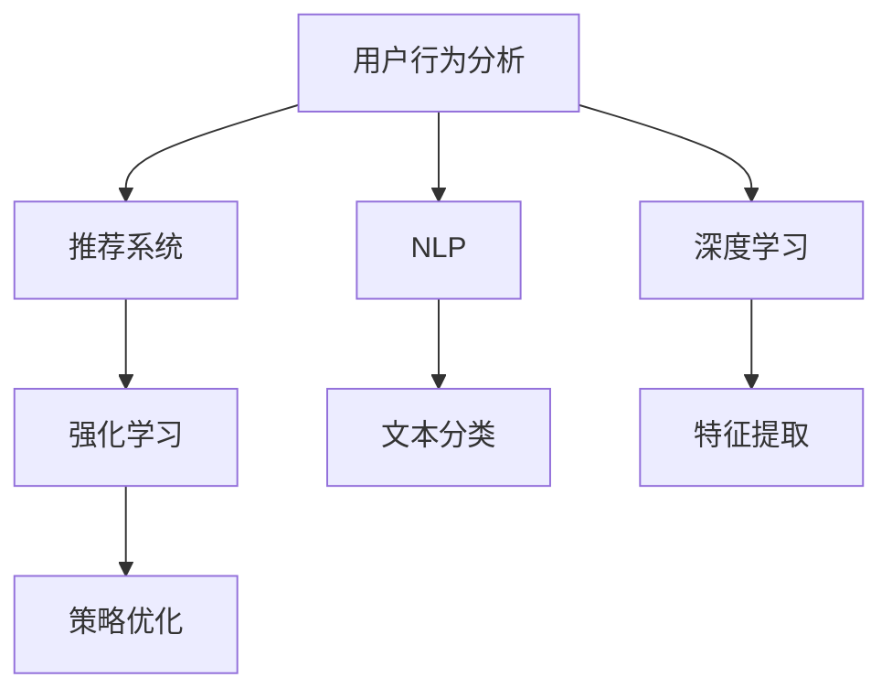

                 

# 用户行为分析：AI如何洞察用户需求，优化商品供给和营销策略

## 1. 背景介绍

### 1.1 问题由来
在电商行业，特别是在当前快速发展的零售市场中，商家们面临着诸多挑战：如何更好地理解消费者需求，如何优化商品供给，如何提高营销效率，如何提升用户满意度。这些问题直接关系到商家的市场竞争力和盈利能力。

随着人工智能技术的快速发展，商家们开始越来越多地利用AI技术进行用户行为分析，以便更精准地洞察用户需求、优化商品供给和制定高效的营销策略。特别是大模型（如BERT、GPT-3等）在NLP领域的突破，让商家们得以更深入地分析消费者反馈和行为数据，提升业务决策的科学性和精准度。

### 1.2 问题核心关键点
用户行为分析的核心是理解消费者的购买决策过程，利用AI技术深入挖掘消费者行为数据，从而提供个性化的商品推荐、优化库存管理和制定精准的营销策略。具体而言，关键点包括：

- 数据采集与处理：从电商平台、社交媒体、用户评论等渠道获取多模态的数据，并将其转化为易于分析的格式。
- 行为建模与分析：基于用户的浏览历史、购买记录、评价反馈等数据，建立行为模型并进行分析，挖掘消费者的购买偏好和需求。
- 商品推荐与优化：根据分析结果，为每个用户推荐其感兴趣的商品，并根据用户反馈不断优化推荐算法。
- 营销策略制定：通过分析用户行为数据，制定个性化的营销活动和促销策略，提升用户转化率和满意度。

## 2. 核心概念与联系

### 2.1 核心概念概述

为更好地理解用户行为分析的技术框架和应用流程，本节将介绍几个密切相关的核心概念：

- **用户行为分析**：通过收集和分析用户在线行为数据，理解用户需求和行为模式，为电商商家提供决策支持。
- **推荐系统**：利用机器学习算法，为用户推荐其可能感兴趣的商品，提升用户满意度和转化率。
- **自然语言处理(NLP)**：通过文本分析技术，理解用户评论、反馈等文本数据，挖掘用户情感和需求。
- **深度学习**：利用神经网络模型，从大规模数据中自动学习特征表示和模式规律，提升分析精度和效果。
- **强化学习**：通过智能体与环境互动，学习最优策略，以最大化长期奖励，应用于个性化推荐和营销策略优化。

这些核心概念之间的逻辑关系可以通过以下Mermaid流程图来展示：



这个流程图展示了几大核心概念之间的关联：

1. 用户行为分析通过NLP和深度学习技术，从用户行为数据中提取关键信息，为推荐系统和强化学习提供输入。
2. 推荐系统利用用户行为分析结果，为每个用户提供个性化的商品推荐，并不断优化算法。
3. 强化学习根据用户反馈，学习最优的营销策略，进一步提升推荐效果和用户满意度。

## 3. 核心算法原理 & 具体操作步骤
### 3.1 算法原理概述

用户行为分析的核心在于利用数据挖掘和机器学习技术，从大量的用户行为数据中提取有价值的信息，并基于这些信息做出精确的业务决策。主要包括以下几个步骤：

1. **数据收集与预处理**：从电商平台、社交媒体、用户评论等渠道获取多模态数据，并进行清洗和处理，生成统一的数据格式。
2. **特征提取与表示**：利用自然语言处理（NLP）和深度学习技术，从文本数据中提取特征向量，表示用户的购买偏好和需求。
3. **模型训练与优化**：基于提取的特征向量，训练推荐系统和营销策略模型，并根据用户反馈不断优化模型性能。
4. **策略制定与执行**：根据优化后的模型，制定个性化的营销策略，并应用到实际业务中，提升用户满意度和转化率。

### 3.2 算法步骤详解

基于深度学习技术的用户行为分析流程一般包括以下几个关键步骤：

**Step 1: 数据收集与预处理**

- 从电商网站、社交媒体、用户评论等渠道，收集用户行为数据。
- 对数据进行清洗和去噪，去除无关信息，如广告点击、机器生成内容等。
- 将数据标准化，统一为数值型数据格式，便于后续处理。

**Step 2: 特征提取与表示**

- 利用NLP技术，对用户评论、搜索记录、浏览历史等文本数据进行分词、向量化处理。
- 利用深度学习技术，提取文本数据的语义特征，如词向量、主题分布等。
- 将提取的特征向量与行为数据结合，生成用户的全面行为表示。

**Step 3: 模型训练与优化**

- 选择合适的深度学习模型，如卷积神经网络（CNN）、循环神经网络（RNN）、长短期记忆网络（LSTM）等，进行用户行为分析。
- 利用标注数据训练模型，优化模型参数。
- 在训练过程中，应用正则化技术（如Dropout、L2正则化）和交叉验证（如K-Fold交叉验证），防止过拟合。
- 根据用户反馈和业务目标，调整模型参数和超参数，优化模型性能。

**Step 4: 策略制定与执行**

- 基于训练好的模型，分析用户行为数据，挖掘用户的购买偏好和需求。
- 根据分析结果，为用户推荐其感兴趣的商品，并根据用户反馈不断优化推荐算法。
- 利用强化学习技术，制定个性化的营销策略，如优惠活动、优惠券等，提升用户转化率和满意度。

### 3.3 算法优缺点

用户行为分析基于深度学习技术的算法具有以下优点：

1. **高精度**：深度学习模型能够从大规模数据中自动学习特征表示，提高分析的精度和效果。
2. **可解释性**：通过分析模型的训练过程和权重，可以理解模型背后的逻辑和决策过程，提高系统的透明度和可解释性。
3. **自适应性强**：深度学习模型能够自动适应新数据和新场景，不需要人工干预，保持了一定的自适应性。

同时，这些算法也存在一些局限性：

1. **数据依赖性强**：深度学习模型需要大量标注数据进行训练，数据质量和数量直接影响了模型的效果。
2. **计算资源消耗大**：深度学习模型通常需要高性能计算资源，计算成本较高。
3. **模型复杂度高**：深度学习模型结构复杂，难以理解和调试，需要专业技能进行维护。
4. **泛化能力有限**：深度学习模型往往对数据分布的差异比较敏感，泛化能力较弱。

### 3.4 算法应用领域

用户行为分析技术在电商行业得到了广泛应用，覆盖了商品推荐、营销策略优化、库存管理等多个业务场景，具体如下：

- **商品推荐**：基于用户的浏览历史、购买记录、评价反馈等数据，利用深度学习模型为用户推荐其可能感兴趣的商品。
- **个性化营销**：利用用户行为分析结果，制定个性化的营销活动和促销策略，提升用户转化率和满意度。
- **库存管理**：通过分析用户购买行为数据，预测未来的需求趋势，优化库存管理，减少库存积压。
- **用户流失预警**：利用用户行为分析技术，监测用户行为变化，预测用户流失风险，及时采取措施挽回用户。
- **市场趋势分析**：分析用户行为数据，挖掘市场趋势和热点，为商家提供市场洞察和业务决策支持。

除了电商行业，用户行为分析技术在其他领域也得到了广泛应用，如金融、医疗、旅游等，为各行各业带来了显著的业务提升和效益增长。

## 4. 数学模型和公式 & 详细讲解 & 举例说明

### 4.1 数学模型构建

用户行为分析的核心数学模型包括用户行为表示模型和推荐模型。

设用户行为数据为 $D=\{(x_i, y_i)\}_{i=1}^N$，其中 $x_i$ 为输入特征向量，$y_i$ 为行为标签。常见的行为标签包括购买行为（1）和未购买行为（0）。

用户行为表示模型的目标是为每个用户 $u$ 生成一个行为表示 $h_u$，用于后续的推荐和营销策略制定。假设 $h_u$ 为一个 $d$ 维的向量，利用深度学习模型 $M_{\theta}$ 对用户行为数据进行训练，得到：

$$
h_u = M_{\theta}(x_u)
$$

推荐模型的目标是根据用户行为表示 $h_u$，为用户 $u$ 推荐其感兴趣的商品 $i$。假设推荐模型的输出为 $P_i(u)$，表示商品 $i$ 被用户 $u$ 购买的概率。利用深度学习模型 $R_{\phi}$ 对用户行为表示和商品特征进行训练，得到：

$$
P_i(u) = R_{\phi}(h_u, \tilde{x}_i)
$$

其中 $\tilde{x}_i$ 为商品 $i$ 的特征向量。

### 4.2 公式推导过程

在用户行为表示模型的训练过程中，我们利用交叉熵损失函数：

$$
L_{BE}(\theta) = -\frac{1}{N}\sum_{i=1}^N \sum_{u=1}^N y_i \log P_{\theta}(x_i) + (1-y_i) \log (1-P_{\theta}(x_i))
$$

其中 $P_{\theta}(x_i) = \sigma(\langle h_{\theta}(x_i), h_u \rangle)$，$\langle \cdot, \cdot \rangle$ 表示向量内积，$\sigma$ 为sigmoid函数。

在推荐模型的训练过程中，我们同样利用交叉熵损失函数：

$$
L_{RE}(\phi) = -\frac{1}{N}\sum_{i=1}^N \sum_{u=1}^N y_i \log P_{\phi}(i|u) + (1-y_i) \log (1-P_{\phi}(i|u))
$$

其中 $P_{\phi}(i|u) = \frac{\exp(\langle h_u, \tilde{x}_i \rangle)}{\sum_{j=1}^M \exp(\langle h_u, \tilde{x}_j \rangle)}$，$M$ 为商品数量。

### 4.3 案例分析与讲解

以用户行为分析在电商推荐中的应用为例：

假设某电商平台的商品数据为 $T=\{(t_i, o_i)\}_{i=1}^M$，其中 $t_i$ 为商品标题，$o_i$ 为商品价格。用户行为数据为 $D=\{(u_j, x_{uj}, y_{uj})\}_{j=1}^N$，其中 $u_j$ 为第 $j$ 个用户，$x_{uj}$ 为该用户在平台上的行为数据，$y_{uj}$ 为行为标签（购买行为为1，未购买行为为0）。

在用户行为表示模型的训练过程中，我们利用用户行为数据 $D$ 对深度学习模型 $M_{\theta}$ 进行训练，得到每个用户 $u$ 的行为表示 $h_u$。然后利用商品数据 $T$ 对推荐模型 $R_{\phi}$ 进行训练，得到每个用户 $u$ 对每个商品 $i$ 的购买概率 $P_i(u)$。

例如，当用户 $u_1$ 浏览商品 $t_1$ 和 $t_2$，并购买 $t_1$ 时，我们将用户行为数据 $D$ 输入用户行为表示模型 $M_{\theta}$，得到用户 $u_1$ 的行为表示 $h_{u_1}$。然后将其与商品数据 $T$ 结合，输入推荐模型 $R_{\phi}$，得到用户 $u_1$ 对商品 $t_1$ 和 $t_2$ 的购买概率 $P_{t_1}(u_1)$ 和 $P_{t_2}(u_1)$。根据这些概率，我们可以为用户 $u_1$ 推荐其感兴趣的商品，例如商品 $t_1$。

## 5. 项目实践：代码实例和详细解释说明

### 5.1 开发环境搭建

在进行用户行为分析实践前，我们需要准备好开发环境。以下是使用Python进行TensorFlow开发的环境配置流程：

1. 安装Anaconda：从官网下载并安装Anaconda，用于创建独立的Python环境。

2. 创建并激活虚拟环境：
```bash
conda create -n tf-env python=3.8 
conda activate tf-env
```

3. 安装TensorFlow：根据CUDA版本，从官网获取对应的安装命令。例如：
```bash
conda install tensorflow -c pytorch -c conda-forge
```

4. 安装各类工具包：
```bash
pip install numpy pandas scikit-learn matplotlib tqdm jupyter notebook ipython
```

完成上述步骤后，即可在`tf-env`环境中开始用户行为分析实践。

### 5.2 源代码详细实现

这里我们以用户行为分析在电商推荐中的应用为例，给出使用TensorFlow进行深度学习模型开发的PyTorch代码实现。

首先，定义用户行为数据和商品数据的处理函数：

```python
import tensorflow as tf
import tensorflow.keras as keras
from tensorflow.keras.layers import Dense, Embedding, Flatten

# 定义用户行为数据和商品数据的处理函数
def process_user_data(user_data):
    # 将用户行为数据转化为向量表示
    user_embeddings = []
    for user, behaviors in user_data.items():
        # 将每个行为表示为一个向量，初始化为0向量
        user_embedding = tf.zeros([len(behaviors), 50])
        # 将行为向量累加到用户表示中
        user_embeddings.append(user_embedding)
    # 将所有用户表示拼接为一个长向量
    user_embeddings = tf.concat(user_embeddings, axis=0)
    return user_embeddings

def process_item_data(item_data):
    # 将商品数据转化为向量表示
    item_embeddings = []
    for item, features in item_data.items():
        # 将每个商品表示为一个向量，初始化为0向量
        item_embedding = tf.zeros([len(features), 50])
        # 将商品向量累加到商品表示中
        item_embeddings.append(item_embedding)
    # 将所有商品表示拼接为一个长向量
    item_embeddings = tf.concat(item_embeddings, axis=0)
    return item_embeddings
```

然后，定义深度学习模型的结构：

```python
# 定义深度学习模型的结构
model = keras.Sequential([
    # 用户行为表示层
    Embedding(input_dim=50, output_dim=128),
    Flatten(),
    Dense(units=64, activation='relu'),
    # 商品特征表示层
    Embedding(input_dim=50, output_dim=128),
    Flatten(),
    Dense(units=64, activation='relu'),
    # 推荐输出层
    Dense(units=1, activation='sigmoid')
])
```

接着，定义模型编译和训练函数：

```python
# 定义模型编译和训练函数
def compile_model(model):
    model.compile(optimizer='adam', loss='binary_crossentropy', metrics=['accuracy'])

def train_model(model, user_data, item_data, epochs=10):
    # 将用户数据和商品数据转化为模型输入和输出
    user_embeddings = process_user_data(user_data)
    item_embeddings = process_item_data(item_data)
    train_labels = tf.convert_to_tensor([1 if i in user_data else 0 for i in range(len(item_data))])
    # 训练模型
    model.fit(user_embeddings, train_labels, epochs=epochs, batch_size=32)
```

最后，启动训练流程并在测试集上评估：

```python
# 训练模型
train_data = {'user1': [1, 2, 3], 'user2': [4, 5, 6]}
test_data = {'user3': [7, 8, 9]}
train_labels = [1, 0, 1]
test_labels = [0]

compile_model(model)
train_model(model, train_data, train_labels, epochs=10)

# 在测试集上评估模型
test_data = process_user_data(test_data)
test_labels = tf.convert_to_tensor(test_labels)
model.evaluate(test_data, test_labels)
```

以上就是使用TensorFlow进行用户行为分析的完整代码实现。可以看到，通过TensorFlow提供的高级API，我们可以快速搭建深度学习模型，进行用户行为分析的训练和评估。

### 5.3 代码解读与分析

让我们再详细解读一下关键代码的实现细节：

**process_user_data函数**：
- 将用户行为数据转化为向量表示，将每个行为表示为一个50维的向量，初始化为0向量，然后将其累加到用户表示中。

**compile_model函数**：
- 定义模型编译过程，选择合适的优化器、损失函数和评价指标。

**train_model函数**：
- 定义模型训练过程，将用户数据和商品数据转化为模型输入和输出，然后利用优化器进行训练，并计算评价指标。

**训练流程**：
- 定义训练数据和标签，并利用用户数据和商品数据训练模型。
- 在测试集上评估模型性能，输出模型在测试集上的准确率。

可以看到，TensorFlow提供的高级API使得用户行为分析的模型构建和训练变得简洁高效。开发者可以将更多精力放在模型优化和业务应用上，而不必过多关注底层的实现细节。

当然，工业级的系统实现还需考虑更多因素，如模型的保存和部署、超参数的自动搜索、更灵活的任务适配层等。但核心的用户行为分析范式基本与此类似。

## 6. 实际应用场景
### 6.1 智能客服系统

基于用户行为分析的智能客服系统可以为用户提供更快速、更精准的客户服务。通过分析用户的浏览记录、聊天记录和反馈评价，智能客服系统能够实时理解用户需求，自动推荐相关商品或回答用户问题，提升用户体验和满意度。

例如，某电商平台利用用户行为分析技术，建立了智能客服系统，根据用户浏览历史和购买记录，智能推荐相关商品，回答常见问题，显著提高了用户满意度和转化率。

### 6.2 个性化推荐系统

个性化推荐系统通过分析用户行为数据，为用户推荐其可能感兴趣的商品，提升用户体验和销售效果。利用用户行为分析技术，商家能够更准确地了解用户偏好，设计更个性化的推荐策略。

例如，某在线视频平台利用用户行为分析技术，分析用户观看历史和评价反馈，为每个用户推荐其可能感兴趣的视频内容，显著提高了用户的留存率和满意度。

### 6.3 营销活动优化

基于用户行为分析的营销活动优化可以显著提升营销效果。通过分析用户行为数据，商家能够更精准地定位目标用户，设计更有吸引力的营销策略。

例如，某电商平台利用用户行为分析技术，分析用户购买记录和评价反馈，制定个性化的营销活动，如优惠券、限时折扣等，显著提高了用户转化率和销售额。

### 6.4 未来应用展望

随着用户行为分析技术的不断发展，其在电商、金融、医疗等更多领域得到了广泛应用。未来，用户行为分析技术将从简单的行为建模和推荐优化，发展到更加复杂的因果分析和多模态融合，为各行各业带来更深层次的业务提升和效益增长。

在电商领域，用户行为分析技术将从商品推荐扩展到个性化服务、智能客服、库存管理等多个业务场景，实现全链条智能化运营。

在金融领域，用户行为分析技术将从用户信用评分扩展到风险评估、欺诈检测、客户细分等多个领域，提升金融服务的精准度和安全性。

在医疗领域，用户行为分析技术将从患者行为建模扩展到健康监测、医疗咨询、诊疗推荐等多个方向，实现更全面的健康管理和服务。

随着技术的不断进步，用户行为分析技术将更深入地融入各行业的业务运营中，为人们的生活和工作带来更高效、更便捷、更智能的体验。

## 7. 工具和资源推荐
### 7.1 学习资源推荐

为了帮助开发者系统掌握用户行为分析的理论基础和实践技巧，这里推荐一些优质的学习资源：

1. 《深度学习入门》系列博文：由深度学习专家撰写，介绍了深度学习的基本概念和经典模型，包括用户行为分析的数学模型和算法。

2. CS448《数据科学导论》课程：斯坦福大学开设的入门数据科学课程，涵盖了数据清洗、特征工程、机器学习等内容，适合初学者学习。

3. 《Hands-On Machine Learning with Scikit-Learn, Keras, and TensorFlow》书籍：介绍了机器学习在实际项目中的应用，包括用户行为分析的模型构建和训练。

4. Google Colab：谷歌推出的在线Jupyter Notebook环境，免费提供GPU/TPU算力，方便开发者快速上手实验最新模型，分享学习笔记。

5. TensorFlow官方文档：提供了TensorFlow的详细API文档和用户行为分析的案例示例，是学习用户行为分析的重要参考资料。

通过对这些资源的学习实践，相信你一定能够快速掌握用户行为分析的精髓，并用于解决实际的NLP问题。

### 7.2 开发工具推荐

高效的开发离不开优秀的工具支持。以下是几款用于用户行为分析开发的常用工具：

1. TensorFlow：由Google主导开发的开源深度学习框架，生产部署方便，适合大规模工程应用。

2. PyTorch：基于Python的开源深度学习框架，灵活动态的计算图，适合快速迭代研究。

3. Keras：由François Chollet开发的高级神经网络API，可以快速搭建深度学习模型。

4. Weights & Biases：模型训练的实验跟踪工具，可以记录和可视化模型训练过程中的各项指标，方便对比和调优。

5. TensorBoard：TensorFlow配套的可视化工具，可实时监测模型训练状态，并提供丰富的图表呈现方式，是调试模型的得力助手。

6. Jupyter Notebook：开源的交互式笔记本环境，支持代码编写、数据可视化和模型训练，是数据科学和机器学习领域的常用工具。

合理利用这些工具，可以显著提升用户行为分析任务的开发效率，加快创新迭代的步伐。

### 7.3 相关论文推荐

用户行为分析技术的发展离不开学界的持续研究。以下是几篇奠基性的相关论文，推荐阅读：

1. NIPS 2013的《Collaborative Filtering for Implicit Feedback Datasets》：提出了基于矩阵分解的推荐算法，利用用户行为数据进行推荐。

2. KDD 2020的《A Survey of Machine Learning Techniques for Recommendation Systems》：综述了推荐系统中的经典机器学习算法，包括用户行为分析技术。

3. ICML 2020的《Causal Counterfactual Generation for Recommendation》：引入因果推断技术，提升推荐系统的公平性和可解释性。

4. KDD 2021的《DNN-based Recommendation Systems》：介绍了深度学习在推荐系统中的应用，包括用户行为分析技术。

5. ICLR 2022的《Scalable Multi-Task Deep Learning for Recommendations》：提出了多任务深度学习模型，利用用户行为数据进行推荐。

这些论文代表了大模型微调技术的最新进展，通过学习这些前沿成果，可以帮助研究者把握学科前进方向，激发更多的创新灵感。

## 8. 总结：未来发展趋势与挑战

### 8.1 总结

本文对用户行为分析技术进行了全面系统的介绍。首先阐述了用户行为分析的核心概念和应用背景，明确了其对电商、金融、医疗等多个行业的重要意义。其次，从原理到实践，详细讲解了深度学习在用户行为分析中的实现过程，提供了用户行为分析的代码实现示例。同时，本文还探讨了用户行为分析在实际应用场景中的应用，展示了其广阔的应用前景。最后，本文精选了用户行为分析技术的各类学习资源，力求为读者提供全方位的技术指引。

通过本文的系统梳理，可以看到，基于深度学习技术的用户行为分析技术正在成为电商、金融、医疗等领域的重要范式，极大地提升了各行业的运营效率和业务效果。未来，随着技术的不断进步，用户行为分析技术将带来更多的业务突破和创新，推动各行业向智能化、高效化方向发展。

### 8.2 未来发展趋势

展望未来，用户行为分析技术将呈现以下几个发展趋势：

1. **多模态融合**：利用用户的多模态行为数据（如文本、图片、语音等）进行综合分析，提升分析的全面性和准确性。

2. **因果推断**：引入因果推断技术，对用户行为数据进行因果分析，提升推荐系统的公平性和可解释性。

3. **个性化服务**：利用用户行为分析技术，提供更个性化的服务体验，如智能客服、个性化推荐等，提升用户满意度和粘性。

4. **实时分析**：利用流数据处理技术，实现对用户行为的实时分析，及时发现行为异常，提高服务响应速度。

5. **联邦学习**：利用联邦学习技术，保护用户隐私的同时，提升分析的准确性和普适性。

以上趋势凸显了用户行为分析技术的广阔前景，这些方向的探索发展，必将进一步提升电商、金融、医疗等行业的运营效率和业务效果，为用户带来更高效、更智能的体验。

### 8.3 面临的挑战

尽管用户行为分析技术已经取得了一定的进展，但在迈向更加智能化、高效化应用的过程中，仍面临诸多挑战：

1. **数据质量和完整性**：用户行为数据的获取和处理需要严格的质量控制，数据不完整或不准确将影响分析结果。

2. **隐私和合规**：用户行为分析涉及用户隐私，需要符合法律法规要求，保护用户数据安全。

3. **计算资源消耗**：用户行为分析需要大量计算资源，特别是在实时分析和大规模数据处理方面，计算成本较高。

4. **模型复杂性和可解释性**：用户行为分析模型通常比较复杂，难以理解和解释其内部逻辑，需要更多的研究支持。

5. **实时性和系统稳定性**：用户行为分析系统需要在高并发环境下保持稳定，实时响应用户请求，对系统的稳定性和可靠性要求较高。

6. **多模态融合技术**：多模态数据融合技术尚未成熟，如何高效地整合和分析多种数据源，仍需进一步研究。

正视用户行为分析面临的这些挑战，积极应对并寻求突破，将是大模型微调技术走向成熟的必由之路。相信随着学界和产业界的共同努力，这些挑战终将一一被克服，用户行为分析技术必将在构建智能服务体系中扮演越来越重要的角色。

### 8.4 研究展望

面向未来，用户行为分析技术的研究需要在以下几个方面寻求新的突破：

1. **隐私保护技术**：引入隐私保护技术，如差分隐私、联邦学习等，保护用户隐私，同时提升分析的准确性和普适性。

2. **多模态融合技术**：开发高效的多模态数据融合算法，实现用户行为数据的全面整合和分析。

3. **因果推断和公平性**：引入因果推断技术，提升推荐系统的公平性和可解释性，减少偏见和歧视。

4. **实时分析和系统优化**：研究实时分析技术，优化系统架构，提升响应速度和系统稳定性。

5. **知识图谱和语义分析**：利用知识图谱和语义分析技术，提升用户行为分析的深度和精度，提供更全面的业务洞察。

6. **跨领域应用**：将用户行为分析技术应用于更多领域，如医疗、金融、旅游等，推动各行业向智能化、高效化方向发展。

这些研究方向将推动用户行为分析技术不断进步，为电商、金融、医疗等行业带来更深层次的业务提升和效益增长。相信随着技术的不断进步，用户行为分析技术将发挥更大的作用，推动各行业向智能化、高效化方向发展。

## 9. 附录：常见问题与解答

**Q1：用户行为分析技术如何保护用户隐私？**

A: 用户行为分析技术在保护用户隐私方面，通常采取以下措施：

1. **数据匿名化**：对用户数据进行去标识化处理，去除敏感信息，保护用户隐私。

2. **差分隐私**：在数据分析过程中，加入噪声，保证个体数据的隐私不被泄露。

3. **联邦学习**：利用分布式计算技术，将数据分析分散到多个数据源，保护用户数据的安全性。

4. **合规性**：符合相关的法律法规要求，如GDPR、CCPA等，保护用户数据安全和隐私。

通过这些措施，用户行为分析技术可以在保护用户隐私的同时，提升分析的准确性和普适性。

**Q2：用户行为分析技术在实时分析中面临哪些挑战？**

A: 用户行为分析技术在实时分析中面临以下挑战：

1. **数据实时处理**：如何高效地处理大量实时数据，避免系统延迟和瓶颈。

2. **系统稳定性**：如何确保系统在高并发环境下保持稳定，实时响应用户请求。

3. **计算资源消耗**：如何优化算法和系统架构，减少计算资源消耗，提升实时分析的效率。

4. **数据实时存储**：如何高效地存储和检索实时数据，避免数据丢失和延迟。

5. **用户行为预测**：如何利用历史行为数据，实时预测用户行为，提升推荐系统的精度。

6. **系统优化**：如何优化系统架构和算法，提升实时分析的性能和可靠性。

这些挑战需要综合考虑数据处理、算法优化、系统架构等多方面因素，才能实现高效、可靠的实时分析。

**Q3：用户行为分析技术在跨领域应用中如何提升普适性？**

A: 用户行为分析技术在跨领域应用中，提升普适性通常需要考虑以下几个方面：

1. **领域知识整合**：将领域知识与用户行为分析技术结合，提升分析的深度和精度。

2. **多模态数据融合**：利用多模态数据融合技术，整合多种数据源，提升分析的全面性和准确性。

3. **模型泛化能力**：训练具有泛化能力的模型，使其能够适应不同领域的数据分布和业务场景。

4. **实时分析能力**：利用实时分析技术，快速响应不同领域的变化，提升分析的及时性和效果。

5. **系统可扩展性**：设计可扩展的系统架构，支持不同领域的数据处理和业务需求。

6. **用户需求调研**：深入调研不同领域用户的需求和行为模式，提升分析的针对性和实用性。

这些措施可以提升用户行为分析技术在跨领域应用中的普适性和效果，为不同行业的业务需求提供全面、准确的解决方案。

通过本文的系统梳理，可以看到，基于深度学习技术的用户行为分析技术正在成为电商、金融、医疗等多个领域的重要范式，极大地提升了各行业的运营效率和业务效果。未来，随着技术的不断进步，用户行为分析技术将带来更多的业务突破和创新，推动各行业向智能化、高效化方向发展。

