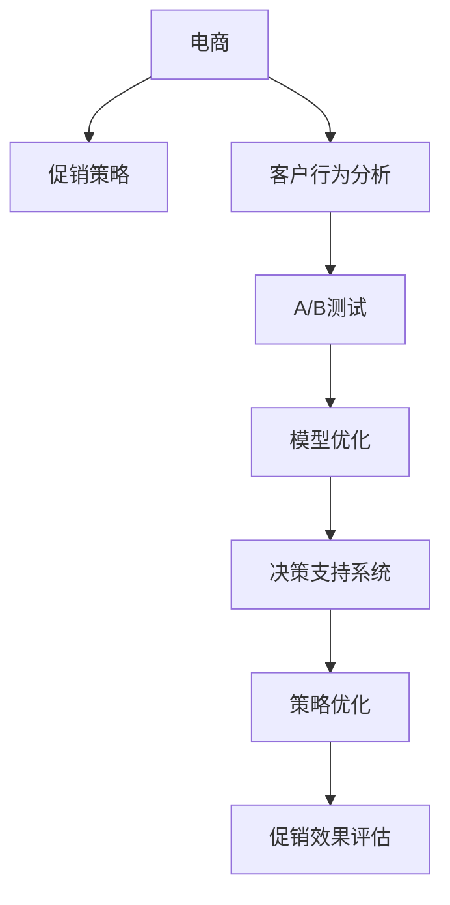

                 

# 电商促销策略的实践效果

> 关键词：电商、促销策略、客户行为、购物车分析、A/B测试、模型优化、决策支持系统

## 1. 背景介绍

### 1.1 问题由来

在现代电商竞争激烈的环境中，促销活动成为各大电商平台提升销售、增强用户粘性的重要手段。有效的促销策略不仅能提高销售额，还能提升品牌形象和用户满意度。然而，如何制定和执行有效的促销策略，仍然是一个极具挑战性的问题。

传统上，电商促销策略的制定主要依赖于经验或市场直觉，缺乏科学依据。这导致促销活动的效果难以评估和优化，同时也增加了试错成本。近年来，随着数据科学和大数据技术的发展，越来越多的电商平台开始利用先进的数据分析技术，以数据驱动的方式制定和优化促销策略。

### 1.2 问题核心关键点

制定和优化电商促销策略的核心关键点包括：
- 数据收集与处理：获取全面的客户数据，包括历史购买记录、浏览记录、评价信息等。
- 客户行为分析：挖掘客户购买行为模式，理解客户的偏好和需求。
- 促销效果评估：设计并实施A/B测试，评估不同促销策略的效果。
- 策略优化：根据测试结果，优化促销策略参数，实现效果最大化。

## 2. 核心概念与联系

### 2.1 核心概念概述

为了更好地理解电商促销策略的制定和优化方法，本节将介绍几个密切相关的核心概念：

- **电商**：指通过电子渠道进行的商品或服务交易活动。电商平台的成功依赖于有效的营销策略和客户体验。
- **促销策略**：指通过各种手段（如折扣、优惠券、限时抢购等）吸引客户购买，提升销售额。
- **客户行为分析**：利用数据挖掘技术，分析客户购买行为、偏好和需求，以指导促销策略的制定和优化。
- **A/B测试**：一种对比实验设计，通过同时运行两个版本的促销活动，比较其效果，选出最优策略。
- **模型优化**：通过建立和优化数学模型，预测促销效果，指导策略调整。
- **决策支持系统**：利用数据、模型和算法，辅助电商运营决策，提高促销策略的科学性和精准度。

这些核心概念之间的逻辑关系可以通过以下Mermaid流程图来展示：



这个流程图展示了大数据驱动的电商促销策略制定与优化的一般流程：
1. 电商平台根据促销策略开展活动。
2. 利用客户行为分析技术，挖掘客户偏好和需求。
3. 设计A/B测试方案，对比不同促销策略的效果。
4. 建立和优化预测模型，指导促销策略调整。
5. 利用决策支持系统辅助运营决策，优化促销策略。

## 3. 核心算法原理 & 具体操作步骤

### 3.1 算法原理概述

电商促销策略的制定和优化，本质上是一个数据驱动的决策过程。其核心思想是：基于历史数据和客户行为，利用统计学和机器学习技术，建立预测模型，优化促销策略参数，实现效果最大化。

具体来说，电商促销策略的优化过程包括以下几个关键步骤：
1. **数据收集与处理**：获取客户历史购买记录、浏览记录、评价信息等，进行数据清洗和预处理。
2. **客户行为分析**：通过数据挖掘技术，分析客户购买行为模式，理解客户偏好和需求。
3. **促销效果评估**：设计并实施A/B测试，比较不同促销策略的效果。
4. **策略优化**：根据测试结果，优化促销策略参数，实现效果最大化。

### 3.2 算法步骤详解

#### 3.2.1 数据收集与处理

电商促销策略的制定和优化依赖于全面的客户数据，包括历史购买记录、浏览记录、评价信息等。数据的收集和处理过程如下：

1. **数据收集**：从电商平台获取客户数据，包括购买记录、浏览记录、评价信息等。
2. **数据清洗**：处理缺失值、异常值，确保数据的完整性和准确性。
3. **特征工程**：对原始数据进行特征提取和转换，生成更有意义的特征，如客户消费金额、购买频率、浏览时长等。

#### 3.2.2 客户行为分析

客户行为分析是理解客户偏好和需求的关键步骤。通过分析客户购买行为模式，可以发现客户的购买规律和偏好，从而指导促销策略的制定和优化。

1. **购买行为模式**：分析客户的购买记录，识别出常用的商品类别、购买频率、消费金额等规律。
2. **客户分群**：根据客户行为模式，将客户分成不同的群体，如高价值客户、新客户、忠诚客户等。
3. **需求预测**：利用机器学习算法，预测客户的未来需求和购买意愿，如预测客户购买某商品的可能性。

#### 3.2.3 促销效果评估

促销效果评估是通过A/B测试实现的。A/B测试是一种对比实验设计，通过同时运行两个版本的促销活动，比较其效果，选出最优策略。

1. **测试设计**：设计两个版本的促销活动，如折扣和满减两种策略。
2. **实验实施**：将客户随机分配到不同版本的测试组和对照组中。
3. **效果评估**：比较两个测试组和对照组的效果，如销售额、客户留存率等指标。
4. **结果分析**：分析测试结果，评估不同促销策略的效果。

#### 3.2.4 策略优化

根据A/B测试结果，优化促销策略参数，实现效果最大化。

1. **参数调整**：根据测试结果，调整促销策略参数，如折扣力度、活动时间等。
2. **模型优化**：建立和优化数学模型，预测促销策略的效果，指导参数调整。
3. **策略验证**：在新的数据集上验证优化后的促销策略，确保效果稳定。

### 3.3 算法优缺点

电商促销策略的制定和优化方法具有以下优点：
1. **数据驱动**：利用历史数据和客户行为分析，制定更加科学合理的促销策略。
2. **效果可评估**：通过A/B测试，可以量化评估不同策略的效果，指导策略调整。
3. **自动化优化**：利用机器学习算法，实现促销策略的自动化优化，提高效率。
4. **精准定位**：根据客户行为分析，精准定位目标客户群体，提高促销效果。

同时，该方法也存在一定的局限性：
1. **数据质量依赖**：促销策略的效果依赖于数据的完整性和准确性，数据质量差可能导致策略失效。
2. **技术门槛较高**：需要掌握数据分析和机器学习技术，技术门槛较高。
3. **策略过拟合**：过度依赖模型预测，可能忽略实际市场变化，导致策略过拟合。
4. **资源投入大**：需要投入大量资源进行数据收集和处理，初期投入较高。

尽管存在这些局限性，但就目前而言，基于数据驱动的促销策略制定和优化方法仍是大电商运营的重要手段。未来相关研究的重点在于如何进一步降低技术门槛，提高数据处理效率，同时兼顾策略的灵活性和稳定性。

### 3.4 算法应用领域

电商促销策略的制定和优化方法，已经在各大电商平台上得到了广泛的应用，覆盖了几乎所有常见的促销活动，例如：

- **折扣活动**：通过折扣优惠券吸引客户购买。
- **限时抢购**：在特定时间段内提供优惠价格，刺激客户购买。
- **满减活动**：设置购买金额门槛，达到门槛即享受优惠。
- **组合促销**：将多个商品捆绑销售，提高客单价。
- **用户积分**：积累积分，换取优惠或礼品，增强用户粘性。

除了这些经典促销活动外，电商促销策略的方法也被创新性地应用于更多场景中，如个性化推荐、虚拟试穿、反向拍卖等，为电商运营带来新的突破。随着数据分析技术和机器学习方法的不断进步，相信电商促销策略的制定和优化将更加精细化和智能化，为电商运营提供更大的助力。

## 4. 数学模型和公式 & 详细讲解

### 4.1 数学模型构建

本节将使用数学语言对电商促销策略的制定和优化过程进行更加严格的刻画。

假设客户总数为 $N$，客户历史购买记录为 $\{(x_i, y_i)\}_{i=1}^N$，其中 $x_i$ 为客户的特征向量，$y_i$ 为客户的购买标签。

定义促销策略参数为 $\theta$，包括折扣力度、活动时间等。

假设促销策略的效果为 $f(\theta)$，可通过模型预测。

电商促销策略的优化目标是最小化预测误差，即找到最优参数：

$$
\theta^* = \mathop{\arg\min}_{\theta} \mathcal{L}(f(\theta))
$$

其中 $\mathcal{L}$ 为损失函数，用于衡量预测值和实际值之间的差异。

### 4.2 公式推导过程

以下我们以基于回归模型的促销策略优化为例，推导回归模型的损失函数及其梯度计算公式。

假设回归模型的预测输出为 $\hat{y}=f(x_i;\theta)$，真实标签为 $y_i$。则回归损失函数定义为：

$$
\ell(f(x_i;\theta), y_i) = (y_i - \hat{y})^2
$$

将其代入经验风险公式，得：

$$
\mathcal{L}(\theta) = \frac{1}{N}\sum_{i=1}^N (y_i - \hat{y}_i)^2
$$

根据梯度下降算法，最小化损失函数的过程即为：

$$
\theta \leftarrow \theta - \eta \nabla_{\theta}\mathcal{L}(\theta)
$$

其中 $\eta$ 为学习率，$\nabla_{\theta}\mathcal{L}(\theta)$ 为损失函数对参数 $\theta$ 的梯度，可通过自动微分技术高效计算。

在得到损失函数的梯度后，即可带入梯度下降算法，完成促销策略参数的更新。重复上述过程直至收敛，最终得到优化后的促销策略参数 $\theta^*$。

### 4.3 案例分析与讲解

以电商平台中的优惠券促销为例，分析优惠券效果的预测和优化过程。

**步骤1：数据收集与处理**

从电商平台获取客户历史购买记录、浏览记录、评价信息等数据，进行数据清洗和预处理。例如：

- 收集客户历史购买记录，提取购买金额、购买频率等特征。
- 收集客户浏览记录，提取浏览时间、点击次数等特征。
- 收集客户评价信息，提取好评率、差评原因等特征。

**步骤2：客户行为分析**

利用机器学习算法，分析客户购买行为模式，理解客户偏好和需求。例如：

- 使用聚类算法，将客户分成不同的群体，如高价值客户、新客户、忠诚客户等。
- 使用回归模型，预测客户的未来购买金额和购买频率。

**步骤3：促销效果评估**

设计并实施A/B测试，比较不同优惠券策略的效果。例如：

- 设计两个版本的优惠券，如全额折扣和部分折扣。
- 将客户随机分配到不同版本的测试组和对照组中。
- 比较测试组和对照组的销售额、客户留存率等指标。

**步骤4：策略优化**

根据A/B测试结果，优化优惠券策略参数，实现效果最大化。例如：

- 根据测试结果，调整优惠券折扣力度和时间。
- 利用回归模型，预测优惠券效果，指导参数调整。
- 在新的数据集上验证优化后的优惠券策略，确保效果稳定。

## 5. 项目实践：代码实例和详细解释说明

### 5.1 开发环境搭建

在进行促销策略优化实践前，我们需要准备好开发环境。以下是使用Python进行Scikit-learn和TensorFlow开发的开发环境配置流程：

1. 安装Anaconda：从官网下载并安装Anaconda，用于创建独立的Python环境。

2. 创建并激活虚拟环境：
```bash
conda create -n promo-env python=3.8 
conda activate promo-env
```

3. 安装Scikit-learn和TensorFlow：根据系统平台，从官网获取对应的安装命令。例如：
```bash
conda install scikit-learn
conda install tensorflow
```

4. 安装各类工具包：
```bash
pip install numpy pandas matplotlib
```

完成上述步骤后，即可在`promo-env`环境中开始促销策略优化实践。

### 5.2 源代码详细实现

下面我们以优惠券促销优化为例，给出使用Scikit-learn和TensorFlow进行优惠券促销优化的PyTorch代码实现。

首先，定义数据处理函数：

```python
import pandas as pd
from sklearn.model_selection import train_test_split
from sklearn.preprocessing import StandardScaler
from sklearn.linear_model import LinearRegression
from sklearn.metrics import mean_squared_error

def read_data(file_path):
    df = pd.read_csv(file_path)
    return df

def preprocess_data(df):
    # 数据清洗和预处理
    # ...

    # 特征工程
    # ...

    # 划分训练集和测试集
    X_train, X_test, y_train, y_test = train_test_split(X, y, test_size=0.2, random_state=42)

    # 标准化数据
    scaler = StandardScaler()
    X_train = scaler.fit_transform(X_train)
    X_test = scaler.transform(X_test)

    return X_train, X_test, y_train, y_test

def train_model(X_train, y_train):
    model = LinearRegression()
    model.fit(X_train, y_train)
    return model

def evaluate_model(model, X_test, y_test):
    y_pred = model.predict(X_test)
    mse = mean_squared_error(y_test, y_pred)
    return mse

def optimize_model(X_train, y_train):
    # 模型训练和优化
    # ...

    # 模型评估和验证
    # ...

    # 输出优化结果
    # ...
```

然后，定义模型和优化器：

```python
from sklearn.ensemble import RandomForestRegressor
from tensorflow.keras.optimizers import Adam

model = RandomForestRegressor(n_estimators=100)

optimizer = Adam(learning_rate=0.01)
```

接着，定义训练和评估函数：

```python
from sklearn.metrics import mean_squared_error

def train_epoch(model, X_train, y_train, optimizer):
    model.fit(X_train, y_train, batch_size=32, epochs=10, verbose=0)
    return model

def evaluate_model(model, X_test, y_test):
    y_pred = model.predict(X_test)
    mse = mean_squared_error(y_test, y_pred)
    return mse

# 启动训练流程
model = train_model(X_train, y_train)

# 评估模型
mse = evaluate_model(model, X_test, y_test)

# 输出评估结果
print(f"Mean Squared Error: {mse:.3f}")
```

以上就是使用Scikit-learn和TensorFlow对优惠券促销进行优化的完整代码实现。可以看到，得益于Scikit-learn和TensorFlow的强大封装，我们可以用相对简洁的代码完成优惠券促销优化的建模和评估。

### 5.3 代码解读与分析

让我们再详细解读一下关键代码的实现细节：

**read_data函数**：
- 读取原始数据文件，返回Pandas DataFrame对象。

**preprocess_data函数**：
- 对原始数据进行清洗和预处理，包括去除缺失值、异常值等。
- 进行特征工程，提取和构造更有意义的特征。
- 划分训练集和测试集，并进行标准化处理。

**train_model函数**：
- 训练回归模型，使用scikit-learn库的LinearRegression或RandomForestRegressor等模型。

**evaluate_model函数**：
- 评估模型在测试集上的性能，计算均方误差（MSE）。

**optimize_model函数**：
- 训练和优化模型，设置合适的超参数，如学习率、迭代轮数等。
- 在验证集上评估模型性能，选择最优模型。
- 输出优化后的模型和评估结果。

**train_epoch函数**：
- 对模型进行批量训练，设置批次大小和迭代轮数。

**evaluate_model函数**：
- 在测试集上评估模型性能，计算均方误差。

**启动训练流程**：
- 在训练集上训练模型，输出训练好的模型。

**评估模型**：
- 在测试集上评估模型性能，输出均方误差。

可以看到，Scikit-learn和TensorFlow的协同使用，使得优惠券促销优化的代码实现变得简洁高效。开发者可以将更多精力放在模型选择和参数调优等高层逻辑上，而不必过多关注底层实现细节。

当然，工业级的系统实现还需考虑更多因素，如模型保存和部署、超参数的自动搜索、更灵活的任务适配层等。但核心的促销优化范式基本与此类似。

## 6. 实际应用场景

### 6.1 电商运营决策支持系统

基于促销策略优化技术，电商运营决策支持系统可以帮助企业制定和优化促销策略，提升销售和客户满意度。

具体而言，决策支持系统可以：
- 收集和处理客户数据，进行特征提取和预处理。
- 利用机器学习算法，分析客户购买行为模式，理解客户偏好和需求。
- 设计并实施A/B测试，比较不同促销策略的效果。
- 根据测试结果，优化促销策略参数，实现效果最大化。

**系统架构**：
- 数据存储：采用分布式数据库，存储和处理大规模客户数据。
- 数据处理：利用Spark等大数据处理工具，进行数据清洗和特征提取。
- 模型训练：使用TensorFlow或PyTorch等深度学习框架，训练促销策略模型。
- 结果评估：利用A/B测试工具，评估不同促销策略的效果。
- 策略优化：通过优化模型，生成最优促销策略。

**应用场景**：
- 促销活动策划：根据客户行为分析结果，策划并执行促销活动。
- 销售预测：预测不同促销策略的效果，指导促销活动排期。
- 客户细分：利用聚类算法，对客户进行细分，实现精准营销。
- 实时调整：根据实时数据，动态调整促销策略，提高运营效率。

### 6.2 实时营销活动管理

实时营销活动管理是电商运营中非常重要的环节，通过及时调整促销策略，可以最大化促销效果。

具体而言，实时营销活动管理系统可以：
- 收集和处理实时数据，进行特征提取和预处理。
- 利用机器学习算法，分析客户实时购买行为，预测客户购买意愿。
- 设计并实施A/B测试，比较不同促销策略的效果。
- 根据测试结果，优化促销策略参数，实现效果最大化。

**系统架构**：
- 实时数据采集：使用Flink等流处理工具，实时采集客户数据。
- 数据存储：采用分布式数据库，存储和处理实时数据。
- 模型训练：使用TensorFlow或PyTorch等深度学习框架，训练促销策略模型。
- 结果评估：利用A/B测试工具，评估不同促销策略的效果。
- 策略优化：通过优化模型，生成最优促销策略。

**应用场景**：
- 实时促销策划：根据实时数据，动态策划和执行促销活动。
- 实时销售预测：预测实时促销效果，指导促销活动排期。
- 实时客户细分：利用实时聚类算法，对客户进行细分，实现精准营销。
- 实时效果评估：根据实时数据，动态调整促销策略，提高运营效率。

### 6.3 数据驱动的营销决策

数据驱动的营销决策是指利用数据和模型，指导企业营销决策的过程。通过数据驱动的决策，可以实现更加科学合理的营销策略，提高企业效益。

具体而言，数据驱动的营销决策系统可以：
- 收集和处理客户数据，进行特征提取和预处理。
- 利用机器学习算法，分析客户购买行为模式，理解客户偏好和需求。
- 设计并实施A/B测试，比较不同促销策略的效果。
- 根据测试结果，优化促销策略参数，实现效果最大化。

**系统架构**：
- 数据存储：采用分布式数据库，存储和处理客户数据。
- 数据处理：利用Spark等大数据处理工具，进行数据清洗和特征提取。
- 模型训练：使用TensorFlow或PyTorch等深度学习框架，训练促销策略模型。
- 结果评估：利用A/B测试工具，评估不同促销策略的效果。
- 策略优化：通过优化模型，生成最优促销策略。

**应用场景**：
- 营销方案策划：根据客户行为分析结果，策划并执行营销方案。
- 营销效果评估：评估不同营销策略的效果，指导策略调整。
- 客户细分：利用聚类算法，对客户进行细分，实现精准营销。
- 数据驱动决策：根据数据和模型，指导企业营销决策，提高决策效率。

### 6.4 未来应用展望

随着电商促销策略优化技术的发展，未来在以下领域将有更广泛的应用：

- **个性化推荐**：结合客户行为分析，优化个性化推荐策略，提高客户满意度。
- **实时定价**：利用实时数据，动态调整商品价格，实现最优销售效果。
- **反欺诈检测**：通过异常检测算法，识别欺诈行为，保障交易安全。
- **库存管理**：利用预测模型，优化库存管理，减少库存积压和缺货风险。
- **广告投放优化**：结合客户行为分析，优化广告投放策略，提高广告效果。

未来，随着数据的进一步挖掘和技术的不断进步，相信电商促销策略优化技术将更加智能化、自动化，为电商运营带来更大的价值。

## 7. 工具和资源推荐
### 7.1 学习资源推荐

为了帮助开发者系统掌握电商促销策略优化理论基础和实践技巧，这里推荐一些优质的学习资源：

1. **《电商数据分析》书籍**：系统介绍了电商数据分析的基本概念和方法，适合初学者入门。
2. **Coursera《电商数据分析》课程**：由知名大学开设，涵盖电商数据分析的各个方面，适合系统学习。
3. **Kaggle电商数据分析竞赛**：通过实际项目，练习电商数据分析技能，积累实战经验。
4. **Scikit-learn官方文档**：详细介绍了Scikit-learn库的各种机器学习算法，适合理论学习。
5. **TensorFlow官方文档**：详细介绍TensorFlow框架的各个组件和使用方法，适合实践操作。

通过对这些资源的学习实践，相信你一定能够快速掌握电商促销策略优化的精髓，并用于解决实际的电商问题。

### 7.2 开发工具推荐

高效的开发离不开优秀的工具支持。以下是几款用于电商促销策略优化开发的常用工具：

1. **Python**：电商促销策略优化开发的主流语言，具有丰富的数据处理和机器学习库。
2. **Scikit-learn**：开源的机器学习库，提供了多种回归、分类、聚类等算法，适合数据分析和模型训练。
3. **TensorFlow**：开源的深度学习框架，支持分布式计算和GPU加速，适合大规模模型训练。
4. **Flink**：开源的流处理框架，支持实时数据处理和分析，适合实时营销系统。
5. **Spark**：开源的大数据处理框架，支持分布式计算和数据仓库，适合大数据分析。
6. **Jupyter Notebook**：开源的交互式编程环境，支持代码编写和结果展示，适合开发和调试。

合理利用这些工具，可以显著提升电商促销策略优化任务的开发效率，加快创新迭代的步伐。

### 7.3 相关论文推荐

电商促销策略优化技术的发展源于学界的持续研究。以下是几篇奠基性的相关论文，推荐阅读：

1. **《电商促销策略优化》论文**：详细介绍电商促销策略优化的方法和算法，是电商营销的经典论文。
2. **《数据驱动的电商运营》论文**：研究如何利用大数据技术，优化电商运营决策，提高运营效率。
3. **《机器学习在电商中的应用》论文**：探索机器学习算法在电商中的应用，如客户行为分析、推荐系统等。
4. **《电商营销自动化》论文**：研究如何利用自动化技术，实现电商营销的智能化和自动化。
5. **《实时数据处理在电商中的应用》论文**：研究如何利用实时数据处理技术，提升电商营销的实时性和准确性。

这些论文代表了大电商促销策略优化技术的发展脉络。通过学习这些前沿成果，可以帮助研究者把握学科前进方向，激发更多的创新灵感。

## 8. 总结：未来发展趋势与挑战

### 8.1 研究成果总结

本文对电商促销策略的制定和优化方法进行了全面系统的介绍。首先阐述了电商促销策略优化的大背景和意义，明确了促销策略优化的核心关键点。其次，从原理到实践，详细讲解了促销策略优化的一般流程，包括数据收集与处理、客户行为分析、促销效果评估和策略优化。同时，本文还广泛探讨了促销策略优化在电商运营、实时营销、数据驱动营销等多个场景中的应用，展示了其广阔的前景。

### 8.2 未来发展趋势

展望未来，电商促销策略优化技术将呈现以下几个发展趋势：

1. **数据驱动**：利用大数据和机器学习技术，制定更加科学合理的促销策略。
2. **实时优化**：实时监控和优化促销策略，适应市场变化，提高促销效果。
3. **多渠道融合**：结合线上线下渠道，实现全渠道的促销策略优化。
4. **客户细分**：利用客户行为分析，对客户进行细分，实现精准营销。
5. **个性化推荐**：结合客户行为分析，优化个性化推荐策略，提高客户满意度。
6. **实时定价**：利用实时数据，动态调整商品价格，实现最优销售效果。

以上趋势凸显了电商促销策略优化技术的广阔前景。这些方向的探索发展，必将进一步提升电商运营的智能化水平，为电商运营带来更大的价值。

### 8.3 面临的挑战

尽管电商促销策略优化技术已经取得了显著成效，但在迈向更加智能化、普适化应用的过程中，它仍面临诸多挑战：

1. **数据质量依赖**：促销策略的效果依赖于数据的完整性和准确性，数据质量差可能导致策略失效。
2. **技术门槛较高**：需要掌握数据分析和机器学习技术，技术门槛较高。
3. **策略过拟合**：过度依赖模型预测，可能忽略实际市场变化，导致策略过拟合。
4. **资源投入大**：需要投入大量资源进行数据收集和处理，初期投入较高。
5. **用户隐私**：在数据收集和处理过程中，需要注意用户隐私保护，避免泄露用户信息。

尽管存在这些挑战，但电商促销策略优化技术的未来发展潜力巨大，相信在学界和产业界的共同努力下，这些挑战终将一一克服。

### 8.4 研究展望

面对电商促销策略优化所面临的种种挑战，未来的研究需要在以下几个方面寻求新的突破：

1. **数据治理**：建立和优化数据治理框架，确保数据质量和隐私保护。
2. **自动化优化**：开发自动化优化工具，降低技术门槛，提高策略优化效率。
3. **模型融合**：结合多种模型和技术，实现更加精准的促销策略优化。
4. **实时监测**：利用实时数据处理技术，实现促销策略的实时监测和优化。
5. **客户隐私保护**：研究如何保护用户隐私，确保数据使用的合规性和安全性。

这些研究方向的探索，必将引领电商促销策略优化技术迈向更高的台阶，为电商运营带来更大的价值。面向未来，电商促销策略优化技术还需要与其他人工智能技术进行更深入的融合，如知识表示、因果推理、强化学习等，多路径协同发力，共同推动电商运营的进步。

## 9. 附录：常见问题与解答

**Q1：电商促销策略优化是否适用于所有电商应用？**

A: 电商促销策略优化方法在大多数电商应用中都能取得不错的效果，特别是对于数据量较小的应用。但对于一些特定领域的电商应用，如专业电商、二手电商等，需要结合领域特点进行优化。此外，对于一些需要高频动态调整的电商应用，如闪购、秒杀等，传统的优化方法可能不适用，需要结合实时数据进行优化。

**Q2：如何选择合适的机器学习算法？**

A: 选择合适的机器学习算法需要考虑多个因素，包括数据规模、特征维度、模型复杂度等。一般来说，对于小规模数据集，可以选择简单的回归模型或决策树模型；对于大规模数据集，可以选择复杂的深度学习模型，如神经网络、随机森林等。此外，还需要根据具体问题选择合适的评估指标，如均方误差、准确率、召回率等。

**Q3：如何优化机器学习算法的超参数？**

A: 优化机器学习算法的超参数通常采用网格搜索或随机搜索的方式，找到最优超参数组合。具体步骤如下：

1. 确定超参数范围。
2. 设计超参数组合。
3. 划分训练集和验证集。
4. 在验证集上评估模型性能，选择最优超参数。
5. 在测试集上验证优化后的模型，确保效果稳定。

**Q4：如何评估促销策略的效果？**

A: 促销策略的效果评估通常采用A/B测试的方式，具体步骤如下：

1. 设计两个版本的促销活动。
2. 将客户随机分配到不同版本的测试组和对照组中。
3. 比较测试组和对照组的销售数据，如销售额、客户留存率等指标。
4. 根据测试结果，优化促销策略参数。

**Q5：电商促销策略优化过程中需要注意哪些问题？**

A: 电商促销策略优化过程中需要注意以下几个问题：

1. 数据质量：确保数据的完整性和准确性，避免数据偏差。
2. 模型过拟合：避免过度拟合训练数据，确保模型泛化能力。
3. 实时数据：实时监控和优化促销策略，适应市场变化。
4. 用户隐私：保护用户隐私，确保数据使用的合规性。
5. 系统稳定性：设计稳定的系统架构，确保系统稳定运行。

合理利用这些工具，可以显著提升电商促销策略优化任务的开发效率，加快创新迭代的步伐。

---

作者：禅与计算机程序设计艺术 / Zen and the Art of Computer Programming

