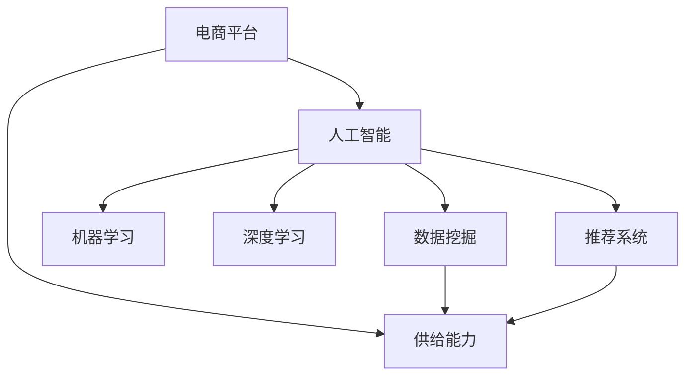

                 

# 电商平台供给能力提升：人工智能技术的应用

> 关键词：电商平台,供给能力,人工智能,机器学习,深度学习,数据挖掘,推荐系统

## 1. 背景介绍

在数字化转型的浪潮中，电商平台已成为商业模式的重要组成部分。然而，随着竞争的加剧，如何提升供给能力、优化用户体验、增加用户粘性，成为电商平台面临的共同挑战。在这一过程中，人工智能技术无疑扮演了关键角色。本文将系统介绍人工智能技术在电商平台供给能力提升中的应用，涵盖机器学习、深度学习、数据挖掘和推荐系统等关键技术，力求为电商平台提供全方位的技术指引。

### 1.1 问题由来
电商平台凭借其便捷的购物体验和丰富的商品选择，吸引了越来越多的消费者。然而，如何平衡库存管理、物流配送和用户需求，始终是平台运营的一大难题。高库存会占用大量资金，影响资金周转效率；低库存则可能无法满足用户需求，影响用户体验和销售额。此外，平台的运营管理还需要考虑到价格优化、个性化推荐、用户留存率提升等多个环节。因此，如何通过技术手段，提升电商平台供给能力，实现业务优化，是本文探讨的主要问题。

### 1.2 问题核心关键点
本文将聚焦于以下几个关键问题：
1. **库存管理**：通过预测用户需求，优化库存水平，提升库存周转率。
2. **价格优化**：利用动态定价模型，最大化收益并满足用户需求。
3. **个性化推荐**：根据用户行为和偏好，提供定制化的商品推荐，提升用户体验。
4. **需求预测**：通过分析历史数据，预测用户需求和市场趋势，指导供给决策。
5. **用户留存**：利用用户行为分析，设计有效的用户留存策略，提升用户粘性。

## 2. 核心概念与联系

### 2.1 核心概念概述

为更好地理解人工智能技术在电商平台供给能力提升中的应用，本节将介绍几个密切相关的核心概念：

- **电商平台**：以在线销售商品为主要业务的互联网平台，通常具备用户注册、商品展示、订单处理、物流配送等功能。
- **供给能力**：指电商平台在满足用户需求方面的能力，包括商品种类、库存水平、配送速度等。
- **人工智能**：通过算法和模型，使计算机具备类似人类的智能能力，包括感知、理解、推理、学习、决策等。
- **机器学习**：利用数据和算法，让计算机具备自我学习的能力，自动优化和改进模型。
- **深度学习**：基于人工神经网络，通过多层次的非线性变换，学习复杂的数据表示。
- **数据挖掘**：从大规模数据中提取有用的信息，为决策提供支持。
- **推荐系统**：通过分析用户行为，提供个性化的商品或内容推荐。

这些核心概念之间的逻辑关系可以通过以下Mermaid流程图来展示：



这个流程图展示了几大核心概念之间的联系：

1. 电商平台通过人工智能技术提升供给能力。
2. 人工智能技术包含机器学习、深度学习和数据挖掘等子技术，为其提供算法支持。
3. 推荐系统作为人工智能的一个分支，直接应用于供给能力的提升，如商品推荐和个性化定价。

## 3. 核心算法原理 & 具体操作步骤
### 3.1 算法原理概述

人工智能技术在电商平台供给能力提升中的应用，本质上是利用数据和模型，自动化地优化电商平台的管理决策。其核心思想是：通过机器学习算法，分析历史数据和用户行为，预测未来的需求和趋势，从而指导供给和价格策略的调整。

形式化地，假设电商平台的商品需求为 $D$，库存为 $S$，价格为 $P$，物流配送时间为 $T$。平台的目标是通过智能决策，最大化收益，即：

$$
\max_{D,S,P,T} \text{Revenue} - \text{Cost}
$$

其中 $\text{Revenue}$ 为销售收入，$\text{Cost}$ 为库存、物流和营销成本之和。

优化目标需要在库存充足、物流及时、用户满意等多维度上进行平衡。为此，可以利用机器学习模型预测需求、优化库存、动态定价等，提升供给能力。

### 3.2 算法步骤详解

人工智能在电商平台供给能力提升中的应用，一般包括以下几个关键步骤：

**Step 1: 数据收集与预处理**
- 收集电商平台的历史交易数据、用户行为数据、商品信息等。
- 对数据进行清洗、去重、归一化等预处理，保证数据质量。
- 划分数据集为训练集、验证集和测试集，以评估模型性能。

**Step 2: 模型选择与训练**
- 根据具体需求，选择适合的机器学习或深度学习模型，如线性回归、决策树、随机森林、神经网络等。
- 在训练集上训练模型，调整超参数，优化模型性能。
- 使用交叉验证等方法，防止模型过拟合。

**Step 3: 模型评估与部署**
- 在验证集上评估模型性能，根据评价指标（如准确率、召回率、F1值等）调整模型。
- 将训练好的模型部署到实际的生产环境中，参与电商平台的业务决策。
- 持续收集新数据，定期重新训练模型，以适应业务变化。

**Step 4: 动态调整与优化**
- 根据实时交易数据和用户反馈，动态调整模型参数，优化决策结果。
- 引入实时数据流，如实时点击流、库存状态、用户评价等，进行实时预测和决策。
- 结合强化学习等技术，实现自适应调整，提升动态决策能力。

### 3.3 算法优缺点

人工智能在电商平台供给能力提升中的应用，具有以下优点：
1. 高效自动化：通过算法自动分析数据，优化决策，减少人工干预，提高效率。
2. 精准预测：利用历史数据和用户行为，准确预测需求和趋势，指导库存和价格调整。
3. 动态优化：实时监控交易和库存状态，动态调整模型参数，保持最优决策。
4. 提升用户体验：通过个性化推荐和动态定价，满足用户需求，提升用户满意度。

同时，也存在一些局限性：
1. 数据依赖：模型效果依赖于数据质量，数据的完整性和准确性对模型表现至关重要。
2. 模型复杂度：深度学习等复杂模型可能需要大量的计算资源和训练时间。
3. 解释性不足：一些模型，如深度学习模型，其决策过程较难解释，缺乏透明度。
4. 部署成本：模型部署需要相应的硬件和软件支持，成本较高。

尽管存在这些局限性，但就目前而言，人工智能技术在电商平台供给能力提升中已经展现出巨大的潜力，成为业务优化不可或缺的技术手段。

### 3.4 算法应用领域

人工智能技术在电商平台供给能力提升中的应用，已经在多个领域得到了广泛应用：

- **库存管理**：利用机器学习模型，预测用户需求，优化库存水平，减少库存积压。
- **价格优化**：通过深度学习模型，分析市场需求和竞争情况，动态调整商品价格，提升收益。
- **个性化推荐**：结合用户行为和商品特征，使用推荐系统，提供个性化的商品推荐，提升用户体验。
- **需求预测**：通过时间序列分析等方法，预测用户需求和市场趋势，指导供给决策。
- **用户留存**：利用用户行为分析，设计有效的用户留存策略，提升用户粘性。

除了上述这些经典应用外，人工智能技术还被创新性地应用于更多场景中，如智能客服、供应链优化、内容推荐等，为电商平台带来了新的业务增长点。

## 4. 数学模型和公式 & 详细讲解 & 举例说明

### 4.1 数学模型构建

本节将使用数学语言对电商平台供给能力提升的人工智能应用进行更加严格的刻画。

假设电商平台的历史交易数据为 $\{(x_i, y_i)\}_{i=1}^N$，其中 $x_i$ 为输入特征（如用户行为、商品特征、时间等），$y_i$ 为输出标签（如是否购买、价格等）。平台的目标是预测用户是否购买某商品，并给出商品价格。

定义模型 $M_{\theta}(x)$，其中 $\theta$ 为模型参数。则电商平台供给能力提升的目标可以表示为：

$$
\max_{\theta} \sum_{i=1}^N \log M_{\theta}(x_i)
$$

其中 $M_{\theta}(x)$ 为预测模型，$\log$ 为负对数似然损失函数。

### 4.2 公式推导过程

以推荐系统为例，推导协同过滤模型的公式。

假设电商平台已收集到用户对商品的历史评分数据 $R_{ui}$，其中 $u$ 为用户ID，$i$ 为商品ID，$R_{ui} \in [1,5]$ 表示用户对商品的评分。目标是通过这些评分数据，预测用户对新商品的评分，从而进行个性化推荐。

协同过滤模型假设用户对商品的评分由用户和商品的特征决定，可以表示为：

$$
R_{ui} \approx \alpha_u + \beta_i + \epsilon_{ui}
$$

其中 $\alpha_u$ 为用户特征向量，$\beta_i$ 为商品特征向量，$\epsilon_{ui}$ 为噪声。

模型参数优化目标为：

$$
\min_{\alpha_u, \beta_i} \sum_{u=1}^M \sum_{i=1}^N \frac{1}{2} \| R_{ui} - (\alpha_u^T \alpha_i + \beta_i^T \beta_u) \|^2
$$

通过求解该优化问题，得到用户和商品的特征表示，用于后续的评分预测。

### 4.3 案例分析与讲解

下面以智能客服系统为例，具体分析人工智能技术在电商平台中的应用。

假设电商平台利用智能客服系统处理用户的查询和投诉。系统通过自然语言处理技术，将用户输入的文本转化为意图标签和实体标签，然后根据意图和实体信息，匹配到相应的回复模板，生成回复。

具体流程如下：
1. 利用BERT等预训练模型，对用户输入的文本进行语义理解，输出意图标签和实体标签。
2. 将意图和实体信息映射到预定义的回复模板，生成回复。
3. 利用强化学习技术，根据用户反馈不断调整回复模板和生成策略，提高回复质量。

通过这一流程，电商平台能够高效处理大量的用户查询，提升用户体验，同时收集用户反馈，不断优化智能客服系统，提高系统的智能化水平。

## 5. 项目实践：代码实例和详细解释说明

### 5.1 开发环境搭建

在进行人工智能技术在电商平台供给能力提升的实践前，我们需要准备好开发环境。以下是使用Python进行TensorFlow开发的环境配置流程：

1. 安装Anaconda：从官网下载并安装Anaconda，用于创建独立的Python环境。

2. 创建并激活虚拟环境：
```bash
conda create -n tf-env python=3.8 
conda activate tf-env
```

3. 安装TensorFlow：根据CUDA版本，从官网获取对应的安装命令。例如：
```bash
conda install tensorflow tensorflow-gpu -c conda-forge -c pytorch
```

4. 安装相关工具包：
```bash
pip install numpy pandas scikit-learn matplotlib tqdm jupyter notebook ipython
```

完成上述步骤后，即可在`tf-env`环境中开始实践。

### 5.2 源代码详细实现

下面我们以库存管理为例，给出使用TensorFlow对协同过滤模型的PyTorch代码实现。

首先，定义协同过滤模型的训练函数：

```python
import tensorflow as tf
from tensorflow.keras.layers import Embedding, Dot, Dense
from tensorflow.keras.models import Model

def collaborative_filtering_model(train_data, test_data, num_users, num_items):
    # 用户特征嵌入层
    user_embedding = Embedding(num_users, 10, input_length=1, mask_zero=True, name='user_embedding')
    # 商品特征嵌入层
    item_embedding = Embedding(num_items, 10, input_length=1, mask_zero=True, name='item_embedding')
    # 用户和商品特征的相乘层
    dot_product = Dot(axes=(2,2), normalize=True, name='dot_product')([user_embedding(train_data[:,0]), item_embedding(train_data[:,1])])
    # 输出层
    output = Dense(1, activation='sigmoid', name='output')(dot_product)
    model = Model(inputs=[user_embedding.input, item_embedding.input], outputs=output)
    model.compile(optimizer=tf.keras.optimizers.Adam(), loss='binary_crossentropy')
    return model
```

然后，定义数据加载和预处理函数：

```python
def load_data(file_path, num_users, num_items):
    data = pd.read_csv(file_path)
    # 提取用户ID和商品ID
    train_data = data['user_id'].values.reshape(-1, 1)
    train_data = np.where(train_data != 0, train_data, 0)
    test_data = data['item_id'].values.reshape(-1, 1)
    test_data = np.where(test_data != 0, test_data, 0)
    return train_data, test_data

# 预处理数据
def preprocess_data(train_data, test_data, num_users, num_items):
    # 填充缺失值
    train_data = tf.keras.preprocessing.sequence.pad_sequences(train_data, maxlen=1, padding='post', truncating='post', value=0)
    test_data = tf.keras.preprocessing.sequence.pad_sequences(test_data, maxlen=1, padding='post', truncating='post', value=0)
    # 将用户ID和商品ID转化为独热编码
    train_data = tf.keras.utils.to_categorical(train_data, num=(num_users+1))
    test_data = tf.keras.utils.to_categorical(test_data, num=(num_items+1))
    return train_data, test_data
```

最后，启动模型训练流程：

```python
# 数据加载
train_data, test_data = load_data('train.csv', num_users=100, num_items=1000)

# 数据预处理
train_data, test_data = preprocess_data(train_data, test_data, num_users=100, num_items=1000)

# 模型训练
model = collaborative_filtering_model(train_data, test_data, num_users=100, num_items=1000)
model.fit([train_data, train_data], train_data, epochs=10, batch_size=32, validation_data=([test_data, test_data], test_data))
```

以上就是使用TensorFlow对协同过滤模型进行库存管理实践的完整代码实现。可以看到，TensorFlow提供了强大的工具库和API，使得模型构建和训练变得简洁高效。

### 5.3 代码解读与分析

让我们再详细解读一下关键代码的实现细节：

**协同过滤模型函数**：
- 使用Embedding层实现用户和商品特征的嵌入，输出维度为10。
- 使用Dot层计算用户和商品特征的相乘，得到预测结果。
- 使用Dense层输出二分类结果，激活函数为sigmoid。
- 将用户ID和商品ID作为模型输入，输出层为二分类结果。

**数据加载函数**：
- 读取CSV文件，提取用户ID和商品ID。
- 将用户ID和商品ID转化为独热编码，方便模型处理。
- 对缺失值进行填充，确保数据完整性。
- 使用pad_sequences方法，将用户ID和商品ID转化为序列，填充缺失值，确保序列长度一致。

**数据预处理函数**：
- 使用to_categorical方法，将用户ID和商品ID转化为独热编码，方便模型处理。
- 对数据进行填充，确保数据完整性。
- 使用pad_sequences方法，将用户ID和商品ID转化为序列，填充缺失值，确保序列长度一致。

通过上述步骤，我们可以看到，TensorFlow提供了丰富的工具库和API，使得数据预处理、模型构建和训练变得简洁高效。在实际应用中，开发者可以根据具体任务，灵活使用TensorFlow的工具库和API，进行快速迭代和优化。

## 6. 实际应用场景

### 6.1 智能客服系统

智能客服系统通过自然语言处理技术，处理用户的查询和投诉，提升用户体验。平台可以收集用户的历史对话数据，利用机器学习技术，训练预测模型，预测用户意图和实体，生成合适的回复模板，实现智能客服。

在具体实现上，平台可以使用预训练模型如BERT，对用户输入的文本进行语义理解，输出意图标签和实体标签。然后根据意图和实体信息，匹配到相应的回复模板，生成回复。同时，平台可以使用强化学习技术，根据用户反馈不断调整回复模板和生成策略，提高回复质量。

通过这一流程，电商平台能够高效处理大量的用户查询，提升用户体验，同时收集用户反馈，不断优化智能客服系统，提高系统的智能化水平。

### 6.2 个性化推荐系统

个性化推荐系统通过分析用户行为和商品特征，提供个性化的商品推荐，提升用户体验。平台可以收集用户的历史点击数据和购买数据，利用协同过滤模型或深度学习模型，预测用户对新商品的评分，生成个性化推荐列表。

在具体实现上，平台可以使用协同过滤模型或深度学习模型，对用户和商品的特征进行表示。然后，利用训练好的模型，预测用户对新商品的评分，生成个性化推荐列表。同时，平台可以使用A/B测试等方法，不断优化推荐策略，提升推荐效果。

通过这一流程，电商平台能够为用户提供更加个性化的商品推荐，提升用户体验，同时提高商品销售转化率。

### 6.3 需求预测系统

需求预测系统通过分析历史销售数据，预测未来的销售需求，指导库存管理。平台可以收集历史销售数据和市场数据，利用时间序列分析或深度学习模型，预测未来的需求变化。

在具体实现上，平台可以使用时间序列分析模型，如ARIMA、LSTM等，对历史销售数据进行建模。然后，利用训练好的模型，预测未来的需求变化，指导库存管理。同时，平台可以使用滚动窗口等方法，不断更新模型，提高预测精度。

通过这一流程，电商平台能够准确预测未来的销售需求，优化库存管理，减少库存积压，提高资金周转效率。

### 6.4 未来应用展望

随着人工智能技术的不断发展，未来电商平台在供给能力提升方面将面临更多的机遇和挑战。

1. **多模态融合**：将文本、图像、音频等多模态数据融合，提升供给能力预测的准确性。
2. **实时数据处理**：利用实时数据流，如点击流、库存状态、用户评价等，进行实时预测和决策，提高供给能力的灵活性。
3. **跨域协同**：将不同地域、不同平台的供给能力进行协同，实现资源优化和共享。
4. **人机协同**：结合人工智能和人工干预，实现智能与经验结合的协同决策，提升供给能力的管理效率。
5. **个性化定制**：根据用户的个性化需求，提供定制化的商品和服务，提升用户体验和满意度。

通过这些前沿技术的应用，电商平台将能够在供给能力提升方面实现更高的水平，更好地满足用户需求，提升用户粘性和忠诚度。

## 7. 工具和资源推荐

### 7.1 学习资源推荐

为了帮助开发者系统掌握人工智能技术在电商平台供给能力提升中的应用，这里推荐一些优质的学习资源：

1. **《深度学习》课程**：斯坦福大学开设的深度学习课程，系统讲解深度学习的基本原理和应用。
2. **《机器学习实战》书籍**：Kaggle官网推荐，通过实战项目，深入理解机器学习算法的应用。
3. **《TensorFlow教程》书籍**：官方文档和代码示例，系统学习TensorFlow的使用。
4. **《推荐系统实践》书籍**：系统讲解协同过滤、矩阵分解等推荐系统算法，并提供代码实现。
5. **Kaggle平台**：提供大量的数据集和竞赛，实战练习推荐系统、库存管理等应用。

通过对这些资源的学习实践，相信你一定能够快速掌握人工智能技术在电商平台中的应用，并用于解决实际的业务问题。

### 7.2 开发工具推荐

高效的开发离不开优秀的工具支持。以下是几款用于人工智能技术在电商平台供给能力提升开发的常用工具：

1. **TensorFlow**：基于Python的开源深度学习框架，提供丰富的工具库和API，支持深度学习模型的开发和训练。
2. **PyTorch**：基于Python的开源深度学习框架，提供动态计算图，支持快速迭代和优化。
3. **scikit-learn**：Python的机器学习库，提供丰富的经典算法和工具。
4. **Keras**：基于TensorFlow的高级API，提供简单易用的接口，快速搭建深度学习模型。
5. **Jupyter Notebook**：交互式编程环境，支持实时展示和调试代码，方便模型开发和测试。

合理利用这些工具，可以显著提升人工智能技术在电商平台供给能力提升的开发效率，加快创新迭代的步伐。

### 7.3 相关论文推荐

人工智能技术在电商平台供给能力提升的研究，源于学界的持续研究。以下是几篇奠基性的相关论文，推荐阅读：

1. **《推荐系统的协同过滤算法》**：Slate杂志2011年推荐系统领域最重要的论文之一，介绍了协同过滤算法的基本原理和应用。
2. **《深度学习在电商平台中的应用》**：京东、阿里等电商巨头发表的研究论文，探讨深度学习在库存管理、个性化推荐等应用。
3. **《强化学习在电商平台中的应用》**：Amazon、eBay等公司发表的研究论文，探讨强化学习在智能客服、库存管理等应用。
4. **《电商平台的个性化推荐系统》**：京东、天猫等电商平台发表的研究论文，探讨个性化推荐系统的构建和优化。
5. **《电商平台的需求预测系统》**：京东、亚马逊等电商巨头发表的研究论文，探讨时间序列分析、深度学习在需求预测中的应用。

这些论文代表了大语言模型微调技术的发展脉络。通过学习这些前沿成果，可以帮助研究者把握学科前进方向，激发更多的创新灵感。

## 8. 总结：未来发展趋势与挑战

### 8.1 总结

本文对人工智能技术在电商平台供给能力提升中的应用进行了全面系统的介绍。首先，阐述了电商平台的供给能力提升的必要性和现有挑战，明确了人工智能技术的应用价值和关键点。其次，从原理到实践，详细讲解了机器学习、深度学习、数据挖掘和推荐系统等关键技术，给出了库存管理、个性化推荐、需求预测等实际应用场景的代码实例和详细解释说明。同时，本文还广泛探讨了未来技术的发展趋势和面临的挑战，力求为电商平台提供全方位的技术指引。

通过本文的系统梳理，可以看到，人工智能技术在电商平台供给能力提升中已经展现出巨大的潜力，成为业务优化不可或缺的技术手段。未来，伴随人工智能技术的不断发展，电商平台将能够在供给能力提升方面实现更高的水平，更好地满足用户需求，提升用户粘性和忠诚度。

### 8.2 未来发展趋势

展望未来，人工智能技术在电商平台供给能力提升中的应用将呈现以下几个发展趋势：

1. **多模态融合**：将文本、图像、音频等多模态数据融合，提升供给能力预测的准确性。
2. **实时数据处理**：利用实时数据流，如点击流、库存状态、用户评价等，进行实时预测和决策，提高供给能力的灵活性。
3. **跨域协同**：将不同地域、不同平台的供给能力进行协同，实现资源优化和共享。
4. **人机协同**：结合人工智能和人工干预，实现智能与经验结合的协同决策，提升供给能力的管理效率。
5. **个性化定制**：根据用户的个性化需求，提供定制化的商品和服务，提升用户体验和满意度。

以上趋势凸显了人工智能技术在电商平台供给能力提升中的广阔前景。这些方向的探索发展，必将进一步提升电商平台在供给能力方面的管理水平，为平台带来更高的运营效率和盈利能力。

### 8.3 面临的挑战

尽管人工智能技术在电商平台供给能力提升中已经取得了显著成效，但在迈向更加智能化、普适化应用的过程中，仍面临诸多挑战：

1. **数据依赖**：模型效果依赖于数据质量，数据的完整性和准确性对模型表现至关重要。
2. **模型复杂度**：深度学习等复杂模型可能需要大量的计算资源和训练时间。
3. **解释性不足**：一些模型，如深度学习模型，其决策过程较难解释，缺乏透明度。
4. **部署成本**：模型部署需要相应的硬件和软件支持，成本较高。
5. **隐私保护**：电商平台需要收集大量用户数据，如何在保护用户隐私的前提下，实现精准的供给能力预测，是一个重要问题。

尽管存在这些挑战，但伴随人工智能技术的不断发展和优化，相信这些挑战终将一一被克服，人工智能技术将为电商平台带来更大的价值。

### 8.4 研究展望

面对人工智能技术在电商平台供给能力提升中面临的诸多挑战，未来的研究需要在以下几个方面寻求新的突破：

1. **多模态数据的融合**：将文本、图像、音频等多模态数据进行深度融合，提升供给能力预测的准确性。
2. **实时数据处理**：利用实时数据流，如点击流、库存状态、用户评价等，进行实时预测和决策，提高供给能力的灵活性。
3. **跨域协同**：将不同地域、不同平台的供给能力进行协同，实现资源优化和共享。
4. **人机协同**：结合人工智能和人工干预，实现智能与经验结合的协同决策，提升供给能力的管理效率。
5. **个性化定制**：根据用户的个性化需求，提供定制化的商品和服务，提升用户体验和满意度。
6. **隐私保护**：在保护用户隐私的前提下，实现精准的供给能力预测，提升平台的用户粘性。

这些研究方向的前沿探索，必将引领人工智能技术在电商平台供给能力提升中的应用迈向更高的台阶，为平台带来更高的运营效率和盈利能力。

## 9. 附录：常见问题与解答

**Q1：电商平台如何利用人工智能技术提升供给能力？**

A: 电商平台利用人工智能技术提升供给能力，主要通过以下几方面：
1. **库存管理**：利用机器学习模型，预测用户需求，优化库存水平，提升库存周转率。
2. **价格优化**：通过深度学习模型，分析市场需求和竞争情况，动态调整商品价格，提升收益。
3. **个性化推荐**：结合用户行为和商品特征，使用推荐系统，提供个性化的商品推荐，提升用户体验。
4. **需求预测**：通过时间序列分析等方法，预测用户需求和市场趋势，指导供给决策。
5. **用户留存**：利用用户行为分析，设计有效的用户留存策略，提升用户粘性。

这些技术手段能够帮助电商平台更好地平衡库存、物流和用户需求，提升运营效率，实现更高的盈利目标。

**Q2：库存管理的机器学习模型有哪些？**

A: 库存管理的机器学习模型主要包括以下几种：
1. **线性回归模型**：用于预测用户需求，优化库存水平。
2. **随机森林模型**：用于分析用户行为，预测用户需求和库存变化。
3. **协同过滤模型**：用于分析用户和商品的关系，预测用户需求和库存变化。
4. **深度学习模型**：如RNN、LSTM等，用于分析时间序列数据，预测库存变化。
5. **集成学习模型**：如Adaboost、Bagging等，用于提升预测精度和鲁棒性。

这些模型可以根据具体业务需求进行选择和组合，提升库存管理的准确性和灵活性。

**Q3：如何评估推荐系统的性能？**

A: 推荐系统的性能评估主要通过以下几个指标：
1. **准确率（Accuracy）**：推荐系统预测的正面结果与实际结果匹配的比例。
2. **召回率（Recall）**：实际正样本中被推荐系统预测为正样本的比例。
3. **F1值（F1 Score）**：准确率和召回率的调和平均数，综合评估推荐系统的性能。
4. **A/B测试**：通过对比不同策略的推荐效果，评估推荐系统的改进效果。
5. **点击率（Click-Through Rate, CTR）**：用户点击推荐结果的比例，衡量推荐系统的实用性。

通过这些指标，可以全面评估推荐系统的性能，指导模型的优化和改进。

**Q4：如何设计个性化的推荐系统？**

A: 个性化推荐系统的设计主要包括以下几个步骤：
1. **特征工程**：收集和选择用户行为、商品特征等数据，构建特征向量。
2. **模型选择**：选择适合的推荐算法，如协同过滤、基于内容的推荐等。
3. **模型训练**：在训练集上训练推荐模型，调整超参数，优化模型性能。
4. **推荐策略设计**：设计推荐策略，如基于时间、位置、社交关系等的推荐。
5. **实时推荐**：结合实时数据流，进行动态推荐，提升推荐效果。

通过这些步骤，可以构建高效、准确的个性化推荐系统，提升用户体验和平台收益。

**Q5：需求预测的时间序列分析方法有哪些？**

A: 需求预测的时间序列分析方法主要包括以下几种：
1. **ARIMA模型**：自回归积分滑动平均模型，适用于平稳时间序列的预测。
2. **LSTM模型**：长短期记忆网络，适用于非平稳时间序列的预测。
3. **Holt-Winters模型**：加法或乘法模型，适用于趋势和季节性明显的时序预测。
4. **Prophet模型**：Facebook提出的时序预测模型，适用于非线性、非平稳的时间序列预测。
5. **GBDT模型**：梯度提升树模型，适用于高维时间序列的预测。

这些方法可以根据具体业务需求进行选择和组合，提升需求预测的准确性和可靠性。

---

作者：禅与计算机程序设计艺术 / Zen and the Art of Computer Programming

