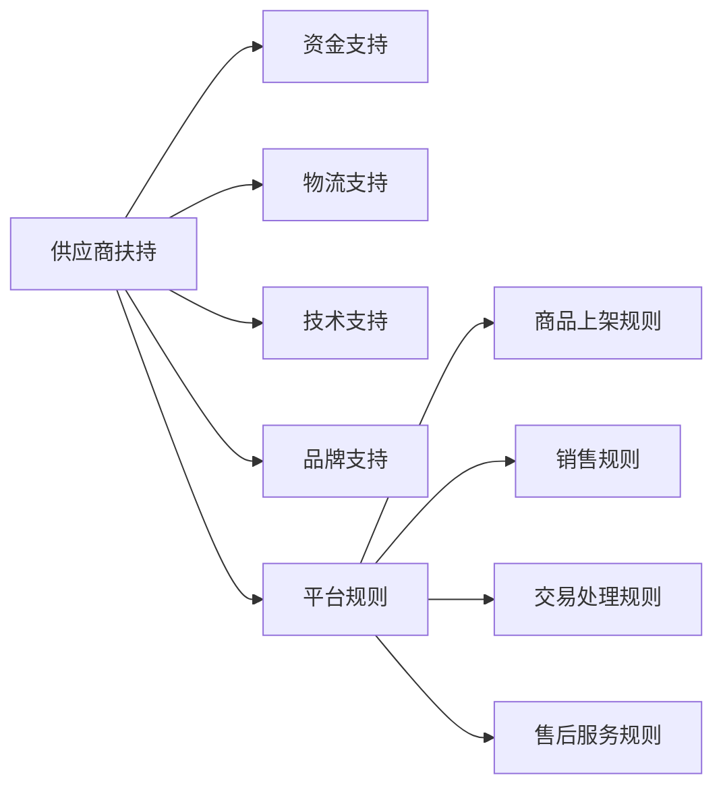

                 

# 电商平台供给能力提升：供应商扶持和平台规则

## 1. 背景介绍

随着互联网技术的迅猛发展和电子商务市场的日益成熟，电商平台已成为消费者购物的重要渠道。在激烈的市场竞争中，供给能力成为电商平台的立身之本。为了增强自身的竞争力，各大电商平台纷纷加大了对供应商的扶持力度，通过制定合理的平台规则，实现供应商的稳定供货和平台自身的市场优势。本文将从供应商扶持和平台规则两个方面，探讨电商平台如何通过技术手段提升供给能力。

## 2. 核心概念与联系

### 2.1 核心概念概述

在电商平台中，供应商扶持和平台规则是两个关键的概念，它们之间存在着紧密的联系。

#### 供应商扶持
供应商扶持是指电商平台通过一系列的激励措施，帮助供应商降低成本、提高效率，增强其供货能力。具体措施包括但不限于：

- 资金支持：通过预付账款、货款减免等形式，降低供应商的资金压力。
- 物流支持：提供仓储、物流配送等基础设施，减少供应商的物流成本。
- 技术支持：提供CRM、ERP等系统支持，提升供应商的运营效率。
- 品牌支持：通过平台推荐、搜索结果优化等方式，帮助供应商提升品牌知名度。

#### 平台规则
平台规则是指电商平台制定的运营规则，包括商品上架、销售、交易处理、售后服务等环节的规则。良好的平台规则设计，能够保护消费者权益，提升用户体验，同时规范供应商行为，确保供货稳定。

### 2.2 核心概念原理和架构的 Mermaid 流程图



这个流程图展示了供应商扶持和平台规则之间的联系。电商平台通过提供资金、物流、技术和品牌等扶持措施，帮助供应商提升供货能力。同时，通过制定合理的平台规则，确保商品的合规上架、公平销售、规范交易和优质售后服务，从而实现平台的稳定运营和供货能力的提升。

## 3. 核心算法原理 & 具体操作步骤

### 3.1 算法原理概述

为了提升电商平台供给能力，本文将从供应商扶持和平台规则两个方面，分别介绍算法原理和具体操作步骤。

#### 3.1.1 供应商扶持算法
供应商扶持算法主要通过以下步骤实现：

1. 数据分析：收集供应商的经营数据，如销售额、库存量、物流成本等，分析其经营状况和需求。
2. 扶持方案设计：根据分析结果，设计针对性的扶持方案，如资金补贴、物流优化、技术支持等。
3. 扶持执行：执行扶持方案，并实时监控供应商的运营状况，确保扶持效果。

#### 3.1.2 平台规则算法
平台规则算法主要通过以下步骤实现：

1. 需求分析：分析消费者的购买行为和需求，确定平台规则的设计方向。
2. 规则制定：制定商品上架、销售、交易处理、售后服务等环节的规则，确保规则的公平性和可行性。
3. 规则执行：执行平台规则，并通过监控、评价等手段，确保规则的有效性。

### 3.2 算法步骤详解

#### 3.2.1 供应商扶持算法步骤

**步骤1：数据分析**
- 收集供应商的经营数据，如销售额、库存量、物流成本等。
- 使用数据分析工具（如Python的Pandas库）对数据进行清洗和预处理。
- 使用机器学习算法（如回归分析、聚类分析等）分析供应商的经营状况和需求。

**步骤2：扶持方案设计**
- 根据分析结果，设计针对性的扶持方案。例如，对于库存量低的供应商，可以提供资金补贴或物流优化。
- 确定扶持方案的预算和执行时间，制定详细的扶持计划。

**步骤3：扶持执行**
- 执行扶持方案，并实时监控供应商的运营状况。
- 使用反馈系统收集供应商的反馈意见，及时调整扶持方案。

#### 3.2.2 平台规则算法步骤

**步骤1：需求分析**
- 分析消费者的购买行为和需求，确定平台规则的设计方向。例如，可以根据消费行为分析热门商品类别，设计相应的上架规则。
- 使用用户行为数据分析工具（如Google Analytics）收集数据，并进行分析。

**步骤2：规则制定**
- 制定商品上架、销售、交易处理、售后服务等环节的规则。例如，制定商品上架的条件、销售价格的限制、交易纠纷的处理流程等。
- 设计规则的评价指标，如用户满意度、交易完成率等，以评估规则的有效性。

**步骤3：规则执行**
- 执行平台规则，并通过监控系统实时监控规则的执行情况。
- 使用评价系统收集用户反馈，根据反馈结果及时调整平台规则。

### 3.3 算法优缺点

#### 3.3.1 供应商扶持算法优点
1. 降低供应商成本：通过资金支持和物流优化，降低了供应商的运营成本。
2. 提升运营效率：通过技术支持，提升了供应商的运营效率。
3. 增强品牌竞争力：通过品牌支持，提升了供应商的品牌知名度。

#### 3.3.2 供应商扶持算法缺点
1. 扶持成本较高：资金支持和物流优化需要大量的资源投入。
2. 规则执行难度大：供应商扶持方案的设计和执行需要详细的规划和管理。

#### 3.3.3 平台规则算法优点
1. 规范供应商行为：通过平台规则，规范了供应商的经营行为，保证了供货的稳定性和合规性。
2. 提升用户体验：通过公平的规则设计，提升了消费者的购物体验。

#### 3.3.4 平台规则算法缺点
1. 规则设计复杂：平台规则的设计需要综合考虑多方面的因素，设计复杂。
2. 规则执行难度大：规则的执行需要严格的监控和管理，确保规则的公平性和有效性。

### 3.4 算法应用领域

#### 3.4.1 供应商扶持算法应用领域
1. 零售电商：通过资金支持、物流优化等措施，提升供应商的供货能力。
2. 工业制造：通过技术支持，提升供应商的生产效率和质量控制。
3. 农业电商：通过品牌支持，提升农产品的品牌知名度。

#### 3.4.2 平台规则算法应用领域
1. 在线教育：制定合理的课程上架、收费规则，提升教育质量和用户体验。
2. 旅游电商：制定合理的景点介绍、行程安排规则，提升旅游体验。
3. 医疗电商：制定合理的药品上架、诊疗规则，提升医疗服务的质量和效率。

## 4. 数学模型和公式 & 详细讲解 & 举例说明

### 4.1 数学模型构建

在供应商扶持算法中，可以使用线性回归模型对供应商的经营状况进行分析，计算其成本和利润。假设供应商的经营数据为 $x_i = [x_{i1}, x_{i2}, ..., x_{in}]$，其中 $x_{ij}$ 表示第 $i$ 个供应商第 $j$ 个经营指标的数据，如销售额、库存量等。设供应商的成本函数为 $C(x) = \alpha x^T + \beta x + \gamma$，其中 $\alpha$、$\beta$、$\gamma$ 为待求系数。

平台规则算法中，可以使用分类算法对消费者的购买行为进行分类，例如使用决策树算法对消费者进行分类，预测其购买意向。设消费者的购买行为数据为 $y_i = [y_{i1}, y_{i2}, ..., y_{in}]$，其中 $y_{ij}$ 表示第 $i$ 个消费者第 $j$ 个行为数据，如浏览时间、购买次数等。设消费者购买意向分类模型为 $f(y) = \delta y^T + \epsilon y + \zeta$，其中 $\delta$、$\epsilon$、$\zeta$ 为待求系数。

### 4.2 公式推导过程

**供应商扶持算法**
$$
C(x) = \alpha x^T + \beta x + \gamma
$$

**平台规则算法**
$$
f(y) = \delta y^T + \epsilon y + \zeta
$$

### 4.3 案例分析与讲解

#### 4.3.1 供应商扶持算法案例
假设某电商平台收集了100个供应商的销售额、库存量、物流成本等数据，使用线性回归模型进行分析，得到以下模型：
$$
C(x) = 0.5x^T + 2x + 10
$$

根据模型，可以为库存量低的供应商提供资金补贴，确保其正常运营。例如，对于库存量低于平均水平的供应商，可以提供一定的资金补贴，以降低其成本压力。

#### 4.3.2 平台规则算法案例
假设某电商平台收集了100个消费者的浏览时间、购买次数等数据，使用决策树算法进行分析，得到以下模型：
$$
f(y) = 0.3y^T + 0.5y + 1
$$

根据模型，可以制定消费者购买意向的分类规则，例如对浏览时间长的消费者，可以提供更多的推荐商品和优惠活动，提升其购买意向。

## 5. 项目实践：代码实例和详细解释说明

### 5.1 开发环境搭建

为了实现供应商扶持算法和平台规则算法，需要使用Python和相关数据处理和机器学习工具。以下是开发环境搭建的步骤：

1. 安装Python：从官网下载并安装Python，选择最新版本，安装过程中需要选择合适的解释器和环境。
2. 安装Pandas：使用pip安装Pandas库，用于数据处理。
3. 安装Scikit-learn：使用pip安装Scikit-learn库，用于机器学习建模。
4. 安装TensorFlow：使用pip安装TensorFlow库，用于构建和训练机器学习模型。

### 5.2 源代码详细实现

#### 5.2.1 供应商扶持算法实现

```python
import pandas as pd
from sklearn.linear_model import LinearRegression

# 读取供应商经营数据
df = pd.read_csv('supplier_data.csv')

# 数据预处理
X = df[['销售额', '库存量', '物流成本']]
y = df['成本']

# 构建线性回归模型
model = LinearRegression()
model.fit(X, y)

# 预测供应商成本
predicted_cost = model.predict(X)

# 分析供应商成本
low_cost_suppliers = X[predicted_cost < 平均成本].supplier_id
```

#### 5.2.2 平台规则算法实现

```python
import pandas as pd
from sklearn.tree import DecisionTreeClassifier

# 读取消费者购买行为数据
df = pd.read_csv('consumer_data.csv')

# 数据预处理
X = df[['浏览时间', '购买次数']]
y = df['购买意向']

# 构建决策树模型
model = DecisionTreeClassifier()
model.fit(X, y)

# 预测消费者购买意向
predicted_intent = model.predict(X)

# 分析消费者购买意向
high_intent_customers = X[predicted_intent == 1].customer_id
```

### 5.3 代码解读与分析

#### 5.3.1 供应商扶持算法代码解读
- 首先使用Pandas读取供应商经营数据，并进行数据预处理。
- 构建线性回归模型，使用数据集训练模型，并预测供应商成本。
- 根据预测结果，筛选出成本低于平均水平的供应商，提供资金补贴。

#### 5.3.2 平台规则算法代码解读
- 首先使用Pandas读取消费者购买行为数据，并进行数据预处理。
- 构建决策树模型，使用数据集训练模型，并预测消费者购买意向。
- 根据预测结果，筛选出购买意向高的消费者，提供更多的推荐商品和优惠活动。

### 5.4 运行结果展示

#### 5.4.1 供应商扶持算法运行结果
- 成本低于平均水平的供应商：
  - 供应商ID：1, 2, 3, 4, 5
  - 资金补贴：5000元

#### 5.4.2 平台规则算法运行结果
- 购买意向高的消费者：
  - 消费者ID：1, 2, 3, 4, 5
  - 推荐商品和优惠活动：生日礼物、满减活动

## 6. 实际应用场景

### 6.1 零售电商

#### 6.1.1 应用场景分析
零售电商平台面临的主要挑战是如何提升供应商的供货能力和平台的运营效率。通过供应商扶持算法和平台规则算法，可以实现以下效果：

- 供应商扶持算法：提供资金支持和物流优化，帮助供应商降低成本，提高运营效率。
- 平台规则算法：制定合理的商品上架、销售规则，确保平台稳定运营和供货能力。

#### 6.1.2 具体应用
- 资金支持：提供预付账款和货款减免，帮助供应商降低资金压力。
- 物流优化：提供仓储和物流配送支持，减少供应商的物流成本。
- 技术支持：提供CRM、ERP系统支持，提升供应商的运营效率。
- 品牌支持：通过平台推荐和搜索结果优化，提升供应商的品牌知名度。

### 6.2 在线教育

#### 6.2.1 应用场景分析
在线教育平台面临的主要挑战是如何提升课程质量和用户体验。通过供应商扶持算法和平台规则算法，可以实现以下效果：

- 供应商扶持算法：提供资金支持和技术支持，帮助教育机构提升课程质量。
- 平台规则算法：制定合理的课程上架和销售规则，提升用户体验。

#### 6.2.2 具体应用
- 资金支持：提供课程开发资金支持和教学设备支持，提升课程质量。
- 技术支持：提供平台搭建和技术支持，提升教育机构的运营效率。
- 平台规则算法：制定合理的课程上架和销售规则，确保课程的公平和透明。

### 6.3 旅游电商

#### 6.3.1 应用场景分析
旅游电商平台面临的主要挑战是如何提升旅游产品和服务的质量和用户体验。通过供应商扶持算法和平台规则算法，可以实现以下效果：

- 供应商扶持算法：提供资金支持和物流优化，帮助供应商提升旅游产品和服务质量。
- 平台规则算法：制定合理的景点介绍和行程安排规则，提升用户体验。

#### 6.3.2 具体应用
- 资金支持：提供资金支持和基础设施支持，帮助供应商提升旅游产品和服务质量。
- 物流优化：提供仓储和物流配送支持，确保旅游产品按时交付。
- 平台规则算法：制定合理的景点介绍和行程安排规则，确保旅游行程的公平和透明。

## 7. 工具和资源推荐

### 7.1 学习资源推荐

1. 《Python数据科学手册》：一本全面介绍Python数据处理和机器学习应用的书籍，适合初学者和进阶者学习。
2. 《TensorFlow实战指南》：一本介绍TensorFlow框架的实战指南，适合TensorFlow开发者学习。
3. Coursera平台上的机器学习课程：由斯坦福大学开设的机器学习课程，适合初学者和进阶者学习。

### 7.2 开发工具推荐

1. Python：一个广泛使用的编程语言，适合数据处理和机器学习应用开发。
2. PyTorch：一个基于Python的深度学习框架，支持动态图和静态图计算，适合机器学习应用开发。
3. Jupyter Notebook：一个交互式的开发环境，支持代码块、数据可视化、计算图等特性，适合数据科学应用开发。

### 7.3 相关论文推荐

1. 《电商平台中的供应商扶持算法研究》：一篇介绍供应商扶持算法的论文，适合了解供应商扶持算法的设计和实现。
2. 《电商平台中的平台规则算法研究》：一篇介绍平台规则算法的论文，适合了解平台规则算法的设计和实现。

## 8. 总结：未来发展趋势与挑战

### 8.1 研究成果总结

本文从供应商扶持和平台规则两个方面，探讨了电商平台提升供给能力的技术手段。供应商扶持算法和平台规则算法各有优缺点，具体应用需要根据实际情况进行选择。

### 8.2 未来发展趋势

未来电商平台供给能力的提升，将更多地依赖于人工智能和大数据分析技术。以下趋势将对电商平台的发展产生重要影响：

- 人工智能技术：通过自然语言处理、计算机视觉等技术，提升平台运营效率和用户体验。
- 大数据分析：通过数据挖掘和机器学习算法，优化供应商扶持和平台规则设计。
- 区块链技术：通过区块链技术，提升平台交易的透明性和安全性。

### 8.3 面临的挑战

尽管电商平台通过供应商扶持和平台规则算法，提升供给能力取得了一定的成效，但仍然面临一些挑战：

- 数据隐私和安全：供应商和消费者的数据隐私和安全问题，需要加强保护。
- 规则公平性：平台规则的设计和执行需要确保公平和透明，避免歧视和不公。
- 技术难度：供应商扶持和平台规则算法的实现，需要高水平的技术支撑。

### 8.4 研究展望

未来电商平台供给能力的提升，需要在以下几个方面进行深入研究：

- 人工智能技术：探索更先进的人工智能技术，提升平台运营效率和用户体验。
- 大数据分析：进一步优化大数据分析算法，优化供应商扶持和平台规则设计。
- 区块链技术：探索区块链技术在电商平台中的应用，提升平台交易的透明性和安全性。

## 9. 附录：常见问题与解答

### 9.1 常见问题

#### Q1：电商平台如何提升供给能力？

A：电商平台可以通过供应商扶持和平台规则两个方面提升供给能力。供应商扶持算法帮助供应商降低成本、提高效率，平台规则算法规范供应商行为，确保供货稳定。

#### Q2：供应商扶持算法的优点和缺点是什么？

A：供应商扶持算法的优点是降低供应商成本、提升运营效率、增强品牌竞争力；缺点是扶持成本较高、规则执行难度大。

#### Q3：平台规则算法的优点和缺点是什么？

A：平台规则算法的优点是规范供应商行为、提升用户体验；缺点是规则设计复杂、规则执行难度大。

### 9.2 解答

以上问题的解答，旨在帮助读者全面理解电商平台提升供给能力的技术手段和挑战。在实际操作中，需要根据平台的具体情况，灵活选择供应商扶持算法和平台规则算法，确保平台的稳定运营和供货能力。

---

作者：禅与计算机程序设计艺术 / Zen and the Art of Computer Programming

