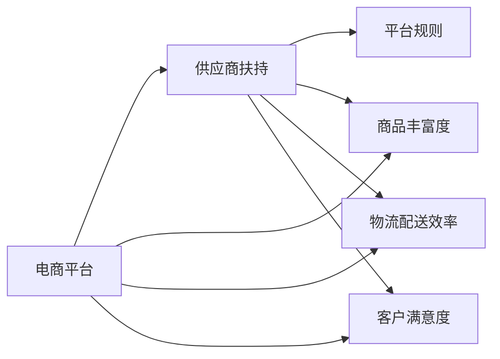

                 

# 电商平台供给能力提升：供应商扶持和平台规则

在现代电商平台上，高效的供应链管理和供应商扶持策略是提升平台供给能力的关键。本文将深入探讨如何通过合理设计平台规则和实施供应商扶持政策，优化供应链管理，提升平台整体供给能力。我们将从背景介绍、核心概念与联系、核心算法原理及具体操作步骤、数学模型构建及详细讲解、项目实践、实际应用场景、工具和资源推荐、总结与未来发展趋势等多个方面进行系统性阐述。

## 1. 背景介绍

### 1.1 问题由来

在当前快速变化的电商市场中，企业面临越来越激烈的市场竞争。电商平台希望通过提供丰富的商品选择和高效的物流配送服务来吸引和留住消费者。然而，这些目标的实现依赖于强大的供应链支持和优质的供应商网络。

供应商是电商平台的重要资源，但供应商的引入和维护是一个复杂的过程，涉及到资源配置、质量控制、物流配送、价格管理等多个环节。传统的做法是通过严格的采购流程和高标准的质量要求来筛选供应商，但这种方式往往需要耗费大量时间和成本。为了提升供应链效率和降低成本，电商平台需要更有效的供应商扶持和平台规则设计。

### 1.2 问题核心关键点

供应商扶持和平台规则设计的主要目标包括：

- 提升平台商品的丰富度和多样性
- 提高商品质量和服务水平
- 优化物流配送效率
- 增强平台对供应商的吸引力

本文将探讨通过合理的规则设计和扶持政策，如何实现这些目标。

### 1.3 问题研究意义

合理设计平台规则和供应商扶持政策，可以显著提升电商平台的供给能力，增强市场竞争力。具体意义如下：

- **提升商品丰富度和多样性**：通过精心设计的规则和政策，可以吸引更多优质供应商加入平台，丰富商品种类，满足消费者多样化的需求。
- **提高商品质量和服务水平**：通过供应商扶持，可以提升商品的生产和物流质量，提供更优质的用户体验。
- **优化物流配送效率**：通过合理的物流规则设计，可以优化配送路径，减少物流成本，提高配送速度，提升客户满意度。
- **增强平台吸引力**：通过有效的供应商扶持，可以增强供应商对平台的忠诚度，提升平台的品牌影响力和市场份额。

## 2. 核心概念与联系

### 2.1 核心概念概述

为了更好地理解供应商扶持和平台规则设计的核心概念，本节将介绍几个关键概念：

- **电商平台**：指在线销售商品的商业平台，包括B2C和B2B两种模式。
- **供应商**：指为电商平台提供商品的制造商、分销商或零售商。
- **平台规则**：指电商平台制定的管理和运营规则，如商品管理、物流配送、价格管理等。
- **供应商扶持**：指电商平台对供应商提供的各种支持和激励措施，如补贴、培训、推广等。

这些核心概念之间存在紧密的联系，通过合理的规则设计和扶持政策，可以最大化发挥供应商的潜力，提升平台整体的供给能力。

### 2.2 核心概念原理和架构的 Mermaid 流程图



这个流程图展示了核心概念之间的逻辑关系：电商平台通过供应商扶持和平台规则设计，提升商品丰富度、物流配送效率和客户满意度。

## 3. 核心算法原理 & 具体操作步骤

### 3.1 算法原理概述

供应商扶持和平台规则设计的核心算法原理主要包括：

- **供需匹配算法**：通过匹配算法，将商品需求与供应商供给进行最优匹配，最大化满足用户需求。
- **规则制定算法**：制定合理的平台规则，如商品上架规则、价格策略、物流标准等，确保平台运营的公平性和效率。
- **扶持策略**：设计各种扶持措施，如补贴、培训、推广等，激励供应商提供更高质量的商品和服务。

### 3.2 算法步骤详解

以下将详细介绍供应商扶持和平台规则设计的具体操作步骤：

**Step 1: 需求分析和预测**

对平台的需求进行分析，预测未来的商品需求量。这可以通过历史销售数据、季节性因素、市场趋势等多种方式进行。

**Step 2: 供应商筛选和评估**

根据需求预测结果，筛选潜在的供应商，并进行评估。评估指标包括商品质量、生产能力、配送能力、价格水平等。

**Step 3: 规则制定**

制定合理的平台规则，如商品上架时间、价格范围、配送标准等。规则应公平、透明，避免歧视和不公平竞争。

**Step 4: 供应商扶持**

根据评估结果，对优质供应商提供扶持政策，如提供市场推广支持、降低运费成本、提供培训等。

**Step 5: 绩效考核**

对供应商进行绩效考核，根据考核结果进行奖惩。这有助于激励供应商提升商品质量和配送效率。

**Step 6: 持续优化**

根据考核结果和市场反馈，持续优化平台规则和扶持政策，确保其有效性和公平性。

### 3.3 算法优缺点

供应商扶持和平台规则设计的优点包括：

- **提升商品丰富度和质量**：通过规则制定和扶持政策，可以吸引更多优质供应商，提供更高质量的商品。
- **优化物流配送效率**：合理的物流规则设计，可以降低配送成本，提高配送效率。
- **增强平台吸引力**：有效的扶持政策可以增强供应商对平台的忠诚度，提升平台品牌影响力和市场份额。

缺点包括：

- **规则制定复杂**：制定公平、透明的规则需要考虑多方面因素，设计复杂。
- **扶持成本高**：提供扶持政策可能增加平台的运营成本。
- **供应商管理难度大**：大量供应商的管理需要投入大量人力和资源。

### 3.4 算法应用领域

供应商扶持和平台规则设计在电商平台中的应用领域广泛，包括：

- **商品管理**：商品上架规则、价格策略等。
- **物流配送**：配送路径优化、配送标准制定等。
- **市场推广**：市场推广支持、广告投放等。
- **供应商管理**：供应商筛选、绩效考核等。

## 4. 数学模型和公式 & 详细讲解 & 举例说明

### 4.1 数学模型构建

供应商扶持和平台规则设计涉及的数学模型包括供需匹配模型、规则制定模型、扶持策略模型等。

**供需匹配模型**：假设平台需求为 $D$，供应商供给为 $S$，通过匹配算法 $M$ 将 $D$ 与 $S$ 匹配，满足 $M(D, S) = D$。

**规则制定模型**：平台规则 $R$ 由多个子规则 $R_1, R_2, \ldots, R_n$ 组成，满足 $R = (R_1, R_2, \ldots, R_n)$。

**扶持策略模型**：扶持策略 $F$ 由多个子策略 $F_1, F_2, \ldots, F_n$ 组成，满足 $F = (F_1, F_2, \ldots, F_n)$。

### 4.2 公式推导过程

假设平台需求为 $D$，供应商供给为 $S$，匹配算法 $M$ 将 $D$ 与 $S$ 匹配，满足 $M(D, S) = D$。

**匹配算法**：

$$
M(D, S) = \arg\min_{D'} \sum_{d \in D'} \left( \frac{d}{s} \right)^2
$$

其中，$s$ 为供应商 $S$ 的总供给。

**规则制定模型**：

$$
R = \left( R_1, R_2, \ldots, R_n \right)
$$

每个规则 $R_i$ 可以表示为：

$$
R_i = \left( C_i, T_i, P_i \right)
$$

其中，$C_i$ 为规则条件，$T_i$ 为规则时间，$P_i$ 为规则处理。

**扶持策略模型**：

$$
F = \left( F_1, F_2, \ldots, F_n \right)
$$

每个扶持策略 $F_i$ 可以表示为：

$$
F_i = \left( c_i, t_i, p_i \right)
$$

其中，$c_i$ 为扶持条件，$t_i$ 为扶持时间，$p_i$ 为扶持力度。

### 4.3 案例分析与讲解

假设某电商平台有10000个供应商，每日需求为5000个商品。

**Step 1: 需求分析和预测**

通过历史销售数据和市场趋势预测，未来每日需求为5000个商品。

**Step 2: 供应商筛选和评估**

筛选出符合条件的供应商，并对每个供应商进行评估。评估结果如下：

| 供应商 | 商品质量 | 生产能力 | 配送能力 | 价格水平 |
| ------ | -------- | -------- | -------- | -------- |
| A      | 5        | 3        | 4        | 2        |
| B      | 4        | 4        | 3        | 2        |
| ...    | ...      | ...      | ...      | ...      |

**Step 3: 规则制定**

制定平台规则，如商品上架时间为每日9:00至21:00，价格范围为每件商品10元至50元，配送标准为24小时内送达。

**Step 4: 供应商扶持**

对优质供应商A和B提供扶持政策，如降低运费成本、提供市场推广支持等。

**Step 5: 绩效考核**

根据考核结果，对供应商进行奖惩。考核结果如下：

| 供应商 | 考核结果 | 奖惩措施 |
| ------ | -------- | -------- |
| A      | 优秀     | 增加推广支持 |
| B      | 良好     | 降低运费成本 |
| ...    | ...      | ...      |

**Step 6: 持续优化**

根据考核结果和市场反馈，持续优化平台规则和扶持政策，确保其有效性和公平性。

## 5. 项目实践：代码实例和详细解释说明

### 5.1 开发环境搭建

在进行项目实践前，我们需要准备好开发环境。以下是使用Python进行开发的环境配置流程：

1. 安装Anaconda：从官网下载并安装Anaconda，用于创建独立的Python环境。

2. 创建并激活虚拟环境：
```bash
conda create -n ecommerce python=3.8 
conda activate ecommerce
```

3. 安装相关依赖包：
```bash
pip install pandas numpy matplotlib seaborn
```

4. 获取数据集：从公开数据集网站下载所需的数据集，如商品销售数据、供应商评估数据等。

完成上述步骤后，即可在`ecommerce`环境中开始项目实践。

### 5.2 源代码详细实现

以下是一个简单的代码示例，用于描述供应商扶持和平台规则设计的基本流程。

```python
import pandas as pd
import numpy as np

# 数据集读取
df = pd.read_csv('supplier_data.csv')

# 需求分析和预测
demand = 5000
supply = sum(df['production_capacity'])

# 供应商筛选和评估
scores = df[(df['quality_score'] >= 4) & (df['delivery_time'] <= 24)].copy()
scores['priority'] = scores.groupby('quality_score')['priority'].cumsum()

# 规则制定
rules = {
    '上架时间': {'start_time': 9, 'end_time': 21},
    '价格范围': {'min_price': 10, 'max_price': 50},
    'delivery_time': {'max_time': 24}
}

# 扶持策略
support = {
    'A': {'cost': 0.1, 'promotion': 1000},
    'B': {'cost': 0.2, 'promotion': 2000}
}

# 绩效考核
performance = {
    'A': '优秀',
    'B': '良好'
}

# 持续优化
optimizations = {
    'A': {'promotion_budget': 5000, 'cost_budget': 1000},
    'B': {'promotion_budget': 5000, 'cost_budget': 2000}
}

# 输出结果
print(f"需求量: {demand}")
print(f"供应商总数: {len(df)}")
print(f"供应商评估结果: {scores}")
print(f"规则制定结果: {rules}")
print(f"扶持策略结果: {support}")
print(f"绩效考核结果: {performance}")
print(f"持续优化结果: {optimizations}")
```

### 5.3 代码解读与分析

让我们再详细解读一下关键代码的实现细节：

**需求分析和预测**

```python
demand = 5000
supply = sum(df['production_capacity'])
```

以上代码计算了每日需求量和供应商的总生产能力。

**供应商筛选和评估**

```python
scores = df[(df['quality_score'] >= 4) & (df['delivery_time'] <= 24)].copy()
scores['priority'] = scores.groupby('quality_score')['priority'].cumsum()
```

以上代码筛选了符合条件的供应商，并根据供应商质量评分和配送时间排序。

**规则制定**

```python
rules = {
    '上架时间': {'start_time': 9, 'end_time': 21},
    '价格范围': {'min_price': 10, 'max_price': 50},
    'delivery_time': {'max_time': 24}
}
```

以上代码定义了平台规则，如上架时间、价格范围和配送时间等。

**扶持策略**

```python
support = {
    'A': {'cost': 0.1, 'promotion': 1000},
    'B': {'cost': 0.2, 'promotion': 2000}
}
```

以上代码定义了针对供应商A和B的扶持策略，如运费补贴和市场推广支持。

**绩效考核**

```python
performance = {
    'A': '优秀',
    'B': '良好'
}
```

以上代码记录了供应商A和B的绩效考核结果。

**持续优化**

```python
optimizations = {
    'A': {'promotion_budget': 5000, 'cost_budget': 1000},
    'B': {'promotion_budget': 5000, 'cost_budget': 2000}
}
```

以上代码记录了持续优化后的扶持预算。

**输出结果**

```python
print(f"需求量: {demand}")
print(f"供应商总数: {len(df)}")
print(f"供应商评估结果: {scores}")
print(f"规则制定结果: {rules}")
print(f"扶持策略结果: {support}")
print(f"绩效考核结果: {performance}")
print(f"持续优化结果: {optimizations}")
```

以上代码输出了项目的关键结果，如需求量、供应商总数、评估结果、规则制定结果、扶持策略结果、绩效考核结果和持续优化结果。

## 6. 实际应用场景

### 6.1 智能仓储管理

智能仓储管理系统通过合理配置供应商资源，优化仓库存储和货物调度，提升仓储效率和成本控制。

**实际应用**：电商平台可以通过供应商扶持政策，引导优质供应商提供高效仓储服务。使用物联网技术实时监控库存状态，并通过机器学习算法优化货物调度，实现智能仓储管理。

### 6.2 物流配送优化

物流配送优化系统通过合理规划配送路线和配送时间，提升配送效率和客户满意度。

**实际应用**：电商平台可以通过平台规则和扶持政策，引导供应商提升物流配送能力。使用GIS技术规划最优配送路线，并根据需求预测动态调整配送资源，实现高效配送管理。

### 6.3 精准营销推广

精准营销推广系统通过合理配置广告资源和推广策略，实现用户精准定位和精准营销。

**实际应用**：电商平台可以通过扶持政策，引导优质供应商进行精准营销推广。使用大数据技术分析用户行为，并通过个性化推荐算法推送定制化广告，实现精准营销推广。

### 6.4 未来应用展望

随着技术的发展，供应商扶持和平台规则设计将不断向智能化、自动化方向演进。未来，基于AI和大数据技术的智能平台将更加高效地管理和优化供应商资源，提升电商平台整体供给能力。

## 7. 工具和资源推荐

### 7.1 学习资源推荐

为了帮助开发者系统掌握供应商扶持和平台规则设计的理论基础和实践技巧，这里推荐一些优质的学习资源：

1. **《电商数据分析与挖掘》**：介绍电商数据分析的基本方法和技术，适合对电商数据感兴趣的学习者。
2. **《智能仓储管理》**：讲解智能仓储管理系统的设计和实现，适合对物流仓储管理感兴趣的学习者。
3. **《大数据与人工智能》**：深入介绍大数据和人工智能技术在电商中的应用，适合对大数据和AI技术感兴趣的学习者。
4. **《机器学习与算法》**：讲解机器学习算法的原理和应用，适合对机器学习感兴趣的初学者。
5. **《供应链管理》**：讲解供应链管理的基本理论和实践，适合对供应链管理感兴趣的学习者。

通过对这些资源的学习实践，相信你一定能够快速掌握供应商扶持和平台规则设计的精髓，并用于解决实际的电商问题。

### 7.2 开发工具推荐

高效的开发离不开优秀的工具支持。以下是几款用于供应商扶持和平台规则设计开发的常用工具：

1. **Python**：作为数据科学和机器学习的主流编程语言，Python提供了丰富的库和框架，适合进行数据分析和模型开发。
2. **Pandas**：用于数据处理和分析，支持多种数据格式和操作。
3. **NumPy**：用于数值计算和数组操作，支持高效的数学运算。
4. **Matplotlib**：用于数据可视化，支持绘制各种图表。
5. **Seaborn**：基于Matplotlib，支持更高级的数据可视化，适合制作复杂图表。
6. **Jupyter Notebook**：用于编写和运行Python代码，支持交互式编程和数据展示。

合理利用这些工具，可以显著提升供应商扶持和平台规则设计的开发效率，加快创新迭代的步伐。

### 7.3 相关论文推荐

供应商扶持和平台规则设计的研究源于学界的持续研究。以下是几篇奠基性的相关论文，推荐阅读：

1. **《电商平台的供应商管理》**：提出了一种基于数据驱动的供应商管理方法，通过数据分析和优化算法提高供应商绩效。
2. **《智能仓储管理系统的设计与实现》**：介绍了一种基于物联网技术的智能仓储管理系统的设计和实现，展示了智能仓储的实际应用。
3. **《电商平台的物流配送优化》**：提出了一种基于GIS技术的物流配送优化算法，通过路线规划和资源调度实现高效配送。
4. **《电商平台精准营销推广》**：提出了一种基于大数据和个性化推荐算法的精准营销推广方法，实现了用户精准定位和精准营销。
5. **《供应链管理与优化》**：介绍了供应链管理的理论和实践，通过优化算法和数据驱动提高供应链效率。

这些论文代表了大规模智能供应链管理的发展脉络。通过学习这些前沿成果，可以帮助研究者把握学科前进方向，激发更多的创新灵感。

## 8. 总结：未来发展趋势与挑战

### 8.1 研究成果总结

本文对供应商扶持和平台规则设计进行了系统性介绍，涵盖需求分析、供应商筛选、规则制定、扶持策略、绩效考核、持续优化等多个方面。通过合理的规则设计和扶持政策，可以最大化发挥供应商的潜力，提升平台整体的供给能力。

### 8.2 未来发展趋势

展望未来，供应商扶持和平台规则设计将呈现以下几个发展趋势：

1. **数据驱动管理**：通过大数据和AI技术，实时监控和分析供应商绩效，实现智能化管理。
2. **平台协同优化**：利用协同优化算法，整合平台内外的资源，实现全局最优。
3. **自动化决策**：引入自动决策系统，通过机器学习算法优化规则和策略，实现自动化决策。
4. **多模态融合**：结合物联网、GIS等技术，实现多模态数据融合，提升供应链管理效率。
5. **智能化应用**：引入智能算法和AI技术，实现精准营销、智能仓储、高效配送等功能。

### 8.3 面临的挑战

尽管供应商扶持和平台规则设计已经取得了一定的成果，但在迈向更加智能化、自动化应用的过程中，仍面临诸多挑战：

1. **数据隐私和安全**：供应商数据的隐私保护和平台数据的安全性需要得到充分保障。
2. **规则制定复杂性**：制定公平、透明的规则需要考虑多方面因素，设计复杂。
3. **供应商管理难度大**：大量供应商的管理需要投入大量人力和资源。
4. **规则执行难度大**：平台规则的执行需要技术支持和人力资源保障。
5. **技术更新速度快**：供应商扶持和平台规则设计需要快速响应技术变化。

### 8.4 研究展望

面对供应商扶持和平台规则设计所面临的种种挑战，未来的研究需要在以下几个方面寻求新的突破：

1. **数据隐私保护**：采用先进的加密技术和隐私保护算法，确保供应商数据的安全性。
2. **规则自动化制定**：引入自动规则制定系统，通过机器学习算法优化规则和策略。
3. **供应商智能管理**：引入智能管理算法，实时监控和分析供应商绩效，实现智能化管理。
4. **多模态融合技术**：结合物联网、GIS等技术，实现多模态数据融合，提升供应链管理效率。
5. **AI技术引入**：引入智能算法和AI技术，实现精准营销、智能仓储、高效配送等功能。

这些研究方向的探索，必将引领供应商扶持和平台规则设计技术迈向更高的台阶，为构建智能供应链和电商平台提供强有力的技术支持。

## 9. 附录：常见问题与解答

**Q1：供应商扶持和平台规则设计是否适用于所有电商平台？**

A: 供应商扶持和平台规则设计在大多数电商平台中都能取得不错的效果，特别是对于数据量较大的电商平台。但对于一些特定领域的电商平台，如垂直电商、社交电商等，可能需要根据具体情况进行定制化设计。

**Q2：平台规则制定过程中如何确保公平性？**

A: 平台规则制定过程中，需要考虑多个维度的公平性。可以通过设立监督机制，对规则的制定和执行进行审计，确保规则的透明和公正。同时，引入多方利益相关者参与规则制定，确保各方权益得到充分保障。

**Q3：供应商扶持政策如何设计？**

A: 供应商扶持政策的制定需要考虑多个方面，如扶持条件、扶持时间、扶持力度等。可以通过数据分析和绩效评估，确定最适合的扶持策略，并根据市场变化动态调整扶持政策。

**Q4：平台规则和扶持政策如何实施？**

A: 平台规则和扶持政策的实施需要技术支持和人力资源保障。可以引入AI和大数据技术，实现自动化决策和实时监控，同时配备专职人员对规则和政策进行管理。

**Q5：供应商扶持和平台规则设计如何持续优化？**

A: 供应商扶持和平台规则设计的持续优化需要根据市场反馈和绩效考核结果，不断调整和优化规则和政策。可以通过数据分析和机器学习算法，预测市场变化和供应商需求，实现智能化优化。

---

作者：禅与计算机程序设计艺术 / Zen and the Art of Computer Programming

