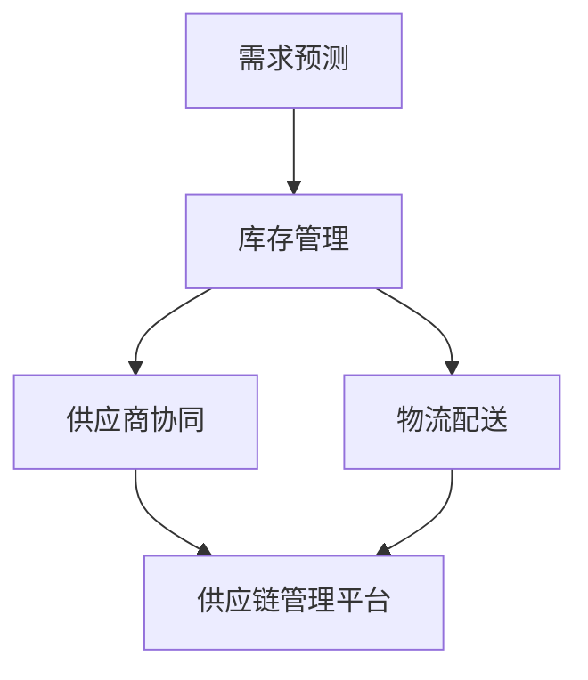

                 

## 1. 背景介绍

### 1.1 问题由来

在电商行业，面对激烈的市场竞争和不断变化的用户需求，提高平台的供给能力是保持竞争力的关键。传统的供应链管理往往基于简单的库存控制和订单处理系统，难以应对多变的市场需求和复杂的供应链网络。为了解决这些问题，平台需要引入先进的供应链管理策略和技术，提升整体的供给能力。

### 1.2 问题核心关键点

平台供给能力提升的核心在于以下几个方面：

- **需求预测**：准确预测用户需求，合理制定库存策略。
- **库存管理**：通过有效的库存控制，降低缺货和库存积压风险。
- **供应商协同**：与供应商建立稳定的合作关系，确保供应链的流畅和高效。
- **物流配送**：优化物流网络，提升配送效率和服务质量。

## 2. 核心概念与联系

### 2.1 核心概念概述

为了更好地理解电商平台供给能力提升的策略，本节将介绍几个核心概念：

- **需求预测（Demand Forecasting）**：基于历史销售数据、市场趋势等，预测未来一定时间内的需求量。
- **库存管理（Inventory Management）**：通过科学的库存控制方法，保持库存水平在合理范围内，降低缺货和积压风险。
- **供应商协同（Supplier Collaboration）**：与供应商建立密切合作关系，共享信息和资源，优化供应链管理。
- **物流配送（Logistics Delivery）**：优化物流网络，提升配送效率和覆盖范围，确保商品及时送达。
- **供应链管理平台（Supply Chain Management Platform）**：整合需求预测、库存管理、供应商协同和物流配送等功能，实现全链条管理。

这些概念之间的逻辑关系可以通过以下Mermaid流程图来展示：



这个流程图展示了核心概念之间的关联：

1. 需求预测为库存管理和供应商协同提供数据基础。
2. 库存管理通过合理调配库存，支持供应商协同。
3. 供应商协同和物流配送共同保障商品及时配送。
4. 供应链管理平台将这些功能整合，实现全链条优化。

## 3. 核心算法原理 & 具体操作步骤

### 3.1 算法原理概述

电商平台供给能力提升的核心算法基于供应链管理中的需求预测、库存管理和物流优化等环节。以下是这些算法的基本原理：

- **需求预测算法**：通过历史销售数据、市场趋势等因素，使用统计学和机器学习方法预测未来需求量。
- **库存管理算法**：基于需求预测结果，制定科学的库存控制策略，优化库存水平。
- **物流优化算法**：通过优化物流网络，减少配送时间和成本，提升配送效率。

### 3.2 算法步骤详解

#### 需求预测

1. **数据收集**：收集历史销售数据、市场趋势、季节性因素等，建立数据集。
2. **特征工程**：对数据进行预处理，提取有用的特征，如节假日、促销活动等。
3. **模型选择**：选择合适的预测模型，如ARIMA、LSTM、XGBoost等。
4. **模型训练**：使用历史数据训练模型，调整参数，提高预测准确性。
5. **模型评估**：在验证集上评估模型性能，选择最优模型。

#### 库存管理

1. **需求预测**：获取需求预测结果，作为库存管理的依据。
2. **库存状态**：实时监控库存水平，根据历史订单量和预测需求调整库存。
3. **补货策略**：制定补货计划，确定补货时间、数量和频率。
4. **库存调整**：根据订单量和库存状态，自动调整库存水平。

#### 物流优化

1. **网络规划**：建立物流网络模型，考虑城市规模、道路条件等因素。
2. **路径优化**：使用算法（如Dijkstra、A*等）计算最优配送路径。
3. **车辆调度**：根据配送需求和路径规划，分配最优配送车辆。
4. **配送执行**：执行配送任务，实时监控配送状态。

### 3.3 算法优缺点

#### 需求预测

**优点**：

- **准确性高**：基于大量数据和先进的机器学习算法，预测结果较为准确。
- **灵活性高**：能够适应市场需求变化，及时调整预测模型。

**缺点**：

- **数据依赖**：预测结果高度依赖历史数据和市场趋势。
- **模型复杂**：复杂的预测模型需要较高的计算资源。

#### 库存管理

**优点**：

- **低成本**：通过优化库存控制策略，减少缺货和积压，降低运营成本。
- **高灵活性**：能够动态调整库存水平，适应市场需求变化。

**缺点**：

- **复杂性高**：需要实时监控库存状态，制定灵活的补货策略。
- **依赖预测**：库存管理的效果高度依赖需求预测的准确性。

#### 物流优化

**优点**：

- **高效性**：通过优化物流网络，减少配送时间和成本，提升配送效率。
- **可扩展性**：能够扩展到不同的物流网络，适应不同的配送需求。

**缺点**：

- **技术复杂**：需要掌握复杂的算法和技术，实现高效的路径规划和车辆调度。
- **资源消耗大**：优化物流网络需要大量的计算资源和数据支持。

### 3.4 算法应用领域

需求预测、库存管理和物流优化算法在电商平台的供应链管理中有着广泛的应用，具体如下：

- **需求预测**：适用于电商平台中的订单预测、库存需求预测等。
- **库存管理**：适用于电商平台中的商品库存管理、仓库管理等。
- **物流优化**：适用于电商平台中的配送路线规划、车辆调度等。

## 4. 数学模型和公式 & 详细讲解

### 4.1 数学模型构建

#### 需求预测

需求预测模型通常使用时间序列分析方法，如ARIMA、LSTM等。以下以ARIMA模型为例，介绍其数学模型构建。

设 $y_t$ 表示在第 $t$ 天的需求量，$\phi$ 表示自回归参数，$\theta$ 表示差分参数，$\gamma$ 表示移动平均参数，则ARIMA模型的数学模型如下：

$$
y_t = c + \sum_{i=1}^{p} \phi_i y_{t-i} + \sum_{j=1}^{d} \theta_j (\Delta^j y_t) + \sum_{k=1}^{q} \gamma_k \epsilon_{t-k} + \epsilon_t
$$

其中 $\Delta^j y_t$ 表示 $y_t$ 的第 $j$ 阶差分，$\epsilon_t$ 表示随机误差。

#### 库存管理

库存管理通常使用经济订货批量（EOQ）模型，以下介绍其数学模型构建。

设 $Q$ 表示每次订货量，$H$ 表示库存水平，$S$ 表示订货费用，$C$ 表示单位商品存储成本，$D$ 表示单位时间需求量，则EOQ模型的数学模型如下：

$$
\begin{aligned}
& \text{最小化总成本} \\
& \text{总成本} = S \cdot Q + C \cdot \frac{Q}{2} \\
& \text{约束条件} \\
& H \geq 0, Q > 0
\end{aligned}
$$

#### 物流优化

物流优化通常使用网络流模型，以下介绍其数学模型构建。

设 $n$ 表示城市节点数，$m$ 表示道路数，$c_{ij}$ 表示道路容量，$w_{ij}$ 表示道路权重，$d_s$ 和 $d_t$ 表示起点和终点，则网络流模型的数学模型如下：

$$
\begin{aligned}
& \text{最小化运输成本} \\
& \text{运输成本} = \sum_{i=1}^{n} \sum_{j=1}^{m} c_{ij} \cdot x_{ij} \\
& \text{约束条件} \\
& \sum_{j \in \text{邻接}} c_{ij} \cdot x_{ij} = \sum_{j \in \text{邻接}} c_{ji} \cdot x_{ji}, \quad \forall i \\
& x_{ij} \geq 0
\end{aligned}
$$

### 4.2 公式推导过程

#### 需求预测

需求预测模型的推导如下：

1. **ARIMA模型**：
   - **自回归部分**：
     - 设 $\phi$ 为自回归参数，则有 $\phi y_{t-1} = \sum_{i=1}^{p} \phi_i y_{t-i}$。
   - **差分部分**：
     - 设 $\theta$ 为差分参数，则有 $\Delta y_t = \sum_{j=1}^{d} \theta_j (\Delta^j y_t)$。
   - **移动平均部分**：
     - 设 $\gamma$ 为移动平均参数，则有 $\gamma \epsilon_{t-k} = \sum_{k=1}^{q} \gamma_k \epsilon_{t-k}$。

   结合以上三个部分，得到ARIMA模型的数学模型。

#### 库存管理

EOQ模型的推导如下：

1. **EOQ模型**：
   - 设 $Q$ 为每次订货量，$H$ 为库存水平，则有 $H = \frac{Q}{2} - D \cdot t + c \cdot Q$。
   - 则总成本为：$S \cdot Q + C \cdot \frac{Q}{2}$。

   结合以上两个部分，得到EOQ模型的数学模型。

#### 物流优化

网络流模型的推导如下：

1. **网络流模型**：
   - 设 $x_{ij}$ 为道路 $i$ 到 $j$ 的流量，则有 $\sum_{j \in \text{邻接}} c_{ij} \cdot x_{ij} = \sum_{j \in \text{邻接}} c_{ji} \cdot x_{ji}$。
   - 则运输成本为：$\sum_{i=1}^{n} \sum_{j=1}^{m} c_{ij} \cdot x_{ij}$。

   结合以上两个部分，得到网络流模型的数学模型。

### 4.3 案例分析与讲解

#### 案例1：需求预测

假设某电商平台销售季节性商品，已知历史销售数据如下：

| 日期       | 需求量 | 促销活动 | 节假日 | 季节性因素 |
|------------|-------|----------|--------|-----------|
| 2022-01-01 | 1000  | 否       | 否     | 淡季       |
| 2022-01-02 | 1200  | 否       | 否     | 淡季       |
| 2022-01-03 | 1100  | 否       | 否     | 淡季       |
| ...        | ...   | ...      | ...    | ...       |
| 2022-12-01 | 3000  | 是       | 否     | 旺季       |
| 2022-12-02 | 3500  | 是       | 否     | 旺季       |
| 2022-12-03 | 3300  | 是       | 否     | 旺季       |

使用ARIMA模型进行需求预测，设自回归参数 $\phi = 0.5$，差分参数 $\theta = 1$，移动平均参数 $\gamma = 0.1$，则有：

- 自回归部分：
  - $y_t = 0.5 y_{t-1} + 0.5 y_{t-2} + 0.5 y_{t-3} + 0.5 y_{t-4}$。
- 差分部分：
  - $\Delta y_t = y_t - y_{t-1}$。
- 移动平均部分：
  - $\epsilon_t = 0.1 \epsilon_{t-1} + 0.1 \epsilon_{t-2} + 0.1 \epsilon_{t-3}$。

结合以上三个部分，得到需求预测模型。

#### 案例2：库存管理

假设某电商平台销售某商品，已知历史需求数据如下：

| 日期       | 需求量 | 促销活动 | 节假日 | 季节性因素 |
|------------|-------|----------|--------|-----------|
| 2022-01-01 | 100   | 否       | 否     | 淡季       |
| 2022-01-02 | 110   | 否       | 否     | 淡季       |
| 2022-01-03 | 120   | 否       | 否     | 淡季       |
| ...        | ...   | ...      | ...    | ...       |
| 2022-12-01 | 300   | 是       | 否     | 旺季       |
| 2022-12-02 | 320   | 是       | 否     | 旺季       |
| 2022-12-03 | 330   | 是       | 否     | 旺季       |

设每次订货量 $Q = 200$，单位商品存储成本 $C = 0.1$，单位商品订货费用 $S = 10$，则有：

- 库存水平 $H = \frac{Q}{2} - D \cdot t + c \cdot Q$。
- 总成本 $S \cdot Q + C \cdot \frac{Q}{2}$。

结合以上两个部分，得到库存管理模型。

#### 案例3：物流优化

假设某电商平台配送网络有3个城市，城市A、城市B和城市C，已知各城市之间的道路容量和权重如下：

| 城市     | 城市A | 城市B | 城市C |
|----------|-------|-------|-------|
| 城市A    | 2     | 5     | 3     |
| 城市B    | 5     | 1     | 3     |
| 城市C    | 3     | 3     | 1     |

设起点为城市A，终点为城市C，则有：

- 运输成本为：$c_{ij} \cdot x_{ij}$。
- 约束条件为：$\sum_{j \in \text{邻接}} c_{ij} \cdot x_{ij} = \sum_{j \in \text{邻接}} c_{ji} \cdot x_{ji}$。

结合以上两个部分，得到物流优化模型。

## 5. 项目实践：代码实例和详细解释说明

### 5.1 开发环境搭建

在进行项目实践前，我们需要准备好开发环境。以下是使用Python进行Pandas、NumPy等工具开发的环境配置流程：

1. 安装Anaconda：从官网下载并安装Anaconda，用于创建独立的Python环境。

2. 创建并激活虚拟环境：
```bash
conda create -n ecommerce-env python=3.8 
conda activate ecommerce-env
```

3. 安装依赖包：
```bash
pip install pandas numpy scikit-learn
```

完成上述步骤后，即可在`ecommerce-env`环境中开始项目实践。

### 5.2 源代码详细实现

以下是使用Pandas进行需求预测、库存管理和物流优化的代码实现。

#### 需求预测

```python
import pandas as pd
from statsmodels.tsa.arima_model import ARIMA

# 加载历史数据
data = pd.read_csv('sales_data.csv', index_col='date', parse_dates=True)

# 进行ARIMA模型预测
model = ARIMA(data, order=(1, 1, 1))
model_fit = model.fit(disp=0)
forecast = model_fit.forecast(steps=30)

# 输出预测结果
print(forecast)
```

#### 库存管理

```python
import numpy as np

# 加载历史数据
data = pd.read_csv('inventory_data.csv', index_col='date', parse_dates=True)

# 计算EOQ
Q = 100
H = 100
S = 10
C = 0.1
D = 30

# 初始化库存
inventory = np.zeros(len(data))

# 更新库存
for i in range(len(data)):
    if data.iloc[i]['demand'] <= inventory[i]:
        inventory[i+1] = inventory[i] - data.iloc[i]['demand']
    else:
        inventory[i+1] = 0

# 输出库存水平
print(inventory)
```

#### 物流优化

```python
import networkx as nx

# 加载物流网络数据
G = nx.read_edgelist('logistics_network.txt', delimiter=' ')

# 计算最短路径
shortest_path = nx.shortest_path(G, source='A', target='C')

# 输出最短路径
print(shortest_path)
```

### 5.3 代码解读与分析

让我们再详细解读一下关键代码的实现细节：

#### 需求预测

- **Pandas**：用于加载和处理历史数据，计算均值、标准差等统计量。
- **statsmodels**：用于建立ARIMA模型，进行时间序列分析。
- **forecast**：用于预测未来的需求量。

#### 库存管理

- **Numpy**：用于计算EOQ模型中的库存水平和总成本。
- **循环**：用于实时更新库存，保持库存水平在合理范围内。

#### 物流优化

- **NetworkX**：用于建立物流网络模型，计算最短路径。
- **函数**：用于读取物流网络数据，计算最短路径。

## 6. 实际应用场景

### 6.1 智能推荐系统

智能推荐系统通过分析用户的历史行为和偏好，推荐个性化的商品。需求预测、库存管理和物流优化算法可以支持推荐系统的实现，具体如下：

1. **需求预测**：预测未来用户的购买需求，制定推荐策略。
2. **库存管理**：根据需求预测结果，优化库存水平，减少缺货和积压。
3. **物流优化**：优化物流网络，提升配送效率，确保商品及时送达。

### 6.2 供应链风险管理

供应链风险管理通过监测供应链中的各种风险因素，及时预警和应对。需求预测、库存管理和物流优化算法可以支持供应链风险管理的实现，具体如下：

1. **需求预测**：预测市场需求变化，及时调整生产和库存计划。
2. **库存管理**：优化库存水平，避免库存积压和缺货。
3. **物流优化**：优化物流网络，减少供应链中断的风险。

### 6.3 动态定价策略

动态定价策略通过实时分析市场需求和供应情况，动态调整商品价格。需求预测、库存管理和物流优化算法可以支持动态定价策略的实现，具体如下：

1. **需求预测**：预测未来市场需求，制定定价策略。
2. **库存管理**：根据需求预测结果，调整库存水平和价格。
3. **物流优化**：优化物流网络，减少运输成本和库存成本。

### 6.4 未来应用展望

随着电商平台的业务规模不断扩大，需求预测、库存管理和物流优化算法的应用将越来越广泛，为电商平台的供给能力提升提供有力支撑。未来，这些算法将不断升级和优化，结合最新的技术手段，如大数据、人工智能等，为电商平台的运营带来更大的突破。

## 7. 工具和资源推荐

### 7.1 学习资源推荐

为了帮助开发者系统掌握电商平台的供应链管理技术，这里推荐一些优质的学习资源：

1. **《算法导论》（Introduction to Algorithms）**：经典算法教材，涵盖各种算法的基本原理和实现。
2. **《机器学习实战》（Machine Learning in Action）**：实用机器学习教程，讲解常见的机器学习算法和实现。
3. **Coursera供应链管理课程**：斯坦福大学开设的供应链管理课程，涵盖供应链规划、库存管理、物流优化等内容。
4. **Kaggle数据科学竞赛**：通过参与竞赛，提升数据分析和机器学习能力，学习供应链管理的实际应用。

### 7.2 开发工具推荐

高效的开发离不开优秀的工具支持。以下是几款用于电商平台供应链管理开发的常用工具：

1. **Jupyter Notebook**：用于编写和运行Python代码，支持交互式数据处理和分析。
2. **PyCharm**：用于Python开发，提供丰富的插件和调试功能。
3. **Tableau**：用于数据可视化，帮助理解和分析数据。
4. **ArcGIS**：用于地理信息系统的应用，支持物流网络的可视化分析。

### 7.3 相关论文推荐

电商平台的供应链管理技术不断发展，相关的论文也不断涌现。以下是几篇具有代表性的论文，推荐阅读：

1. **《需求预测与库存管理的模糊多目标优化》（Fuzzy Multi-Objective Optimization of Demand Forecasting and Inventory Management）**：研究需求预测和库存管理的模糊优化问题，提出改进的优化算法。
2. **《基于人工神经网络的物流路径优化研究》（Logistics Path Optimization Based on Artificial Neural Network）**：使用人工神经网络优化物流路径，提高配送效率。
3. **《智能推荐系统的个性化需求预测》（Personalized Demand Forecasting in Intelligent Recommendation System）**：研究智能推荐系统中的个性化需求预测方法，提升推荐效果。

## 8. 总结：未来发展趋势与挑战

### 8.1 总结

本文对电商平台供给能力提升的供应链管理优化策略进行了全面系统的介绍。首先阐述了需求预测、库存管理和物流优化算法的研究背景和意义，明确了这些算法在提升电商平台供给能力方面的重要价值。其次，从原理到实践，详细讲解了需求预测、库存管理和物流优化的数学模型和代码实现，给出了完整的项目实践流程。最后，本文还广泛探讨了需求预测、库存管理和物流优化算法在实际应用中的场景，展示了其广阔的应用前景。

通过本文的系统梳理，可以看到，基于算法优化，电商平台能够更好地管理库存、优化物流、提升推荐系统的效果，从而显著提升整体的供给能力。未来，这些算法还将结合更多技术手段，如大数据、人工智能等，进一步提升电商平台的运营效率和客户满意度。

### 8.2 未来发展趋势

展望未来，电商平台供应链管理技术将呈现以下几个发展趋势：

1. **大数据和人工智能的融合**：结合大数据和人工智能技术，实时分析用户需求和市场变化，优化库存和物流策略。
2. **实时动态优化**：通过实时数据监测和动态优化，提高供应链管理的响应速度和灵活性。
3. **全链条协同管理**：将需求预测、库存管理、物流优化等环节整合，实现全链条协同管理，提升整体供应链效率。
4. **智能推荐系统**：结合智能推荐系统，精准预测用户需求，优化库存和物流策略，提升用户满意度。
5. **区块链技术的应用**：通过区块链技术，实现供应链各环节的透明化和可信度提升，优化供应链管理。

以上趋势凸显了电商平台供应链管理技术的广阔前景。这些方向的探索发展，必将进一步提升电商平台的运营效率和用户体验，推动电商行业的发展。

### 8.3 面临的挑战

尽管电商平台供应链管理技术已经取得了显著进展，但在实现过程中，仍面临以下挑战：

1. **数据质量问题**：数据质量不高、缺失或不完整，将影响算法的准确性和可靠性。
2. **计算资源消耗**：复杂算法和模型需要大量的计算资源，可能存在资源消耗大的问题。
3. **跨部门协作**：供应链管理涉及多个部门和环节，需要跨部门协作和数据共享，存在协调困难。
4. **算法鲁棒性**：算法对数据异常和噪声敏感，需要考虑算法的鲁棒性和稳定性。
5. **用户隐私保护**：电商平台上涉及大量用户数据，需要考虑数据隐私和安全性问题。

### 8.4 研究展望

面对电商平台供应链管理技术面临的挑战，未来的研究需要在以下几个方面寻求新的突破：

1. **数据质量提升**：建立健全的数据采集和处理机制，确保数据的高质量和高完整性。
2. **计算资源优化**：优化算法和模型，减少计算资源消耗，提升算法的效率和可扩展性。
3. **跨部门协同**：建立跨部门协作机制，确保各环节数据共享和信息透明，提高供应链管理效率。
4. **算法鲁棒性增强**：改进算法，提高算法对数据异常和噪声的鲁棒性，提升算法的稳定性和可靠性。
5. **隐私保护技术**：研究隐私保护技术，确保用户数据的安全性和隐私性。

这些研究方向的研究成果将进一步推动电商平台供应链管理技术的成熟和应用，为电商平台的运营带来更大的突破。

## 9. 附录：常见问题与解答

**Q1：如何提高电商平台的库存管理效率？**

A: 提高电商平台库存管理效率的关键在于科学的库存控制策略。以下是一些建议：

1. **需求预测**：使用准确的需求预测模型，预测未来的需求量，制定合理的库存计划。
2. **库存水平监控**：实时监控库存水平，及时补货或调整库存策略。
3. **订单自动化**：引入自动订单管理系统，减少人工干预，提高订单处理效率。
4. **库存共享**：与供应商建立库存共享机制，减少库存积压和缺货风险。

**Q2：如何优化电商平台的物流配送？**

A: 优化电商平台物流配送的关键在于高效的物流网络设计和路径规划。以下是一些建议：

1. **网络规划**：建立全面的物流网络模型，考虑城市规模、道路条件等因素。
2. **路径优化**：使用算法（如Dijkstra、A*等）计算最优配送路径，减少配送时间和成本。
3. **车辆调度**：根据配送需求和路径规划，分配最优配送车辆，提高配送效率。
4. **实时监控**：实时监控配送状态，及时处理异常情况，确保配送质量。

**Q3：如何结合大数据和人工智能技术提升电商平台供应链管理？**

A: 结合大数据和人工智能技术，可以进一步提升电商平台供应链管理的效率和准确性。以下是一些建议：

1. **数据集成**：整合电商平台内部的各种数据，形成统一的数据仓库，便于数据分析和决策。
2. **机器学习**：使用机器学习算法，预测市场需求和用户行为，优化库存和物流策略。
3. **深度学习**：使用深度学习模型，提升需求预测和库存管理的准确性。
4. **实时分析**：通过实时数据分析，及时调整供应链策略，提高响应速度和灵活性。

这些技术手段的结合，将使电商平台供应链管理更加高效、精准和智能。

---

作者：禅与计算机程序设计艺术 / Zen and the Art of Computer Programming

