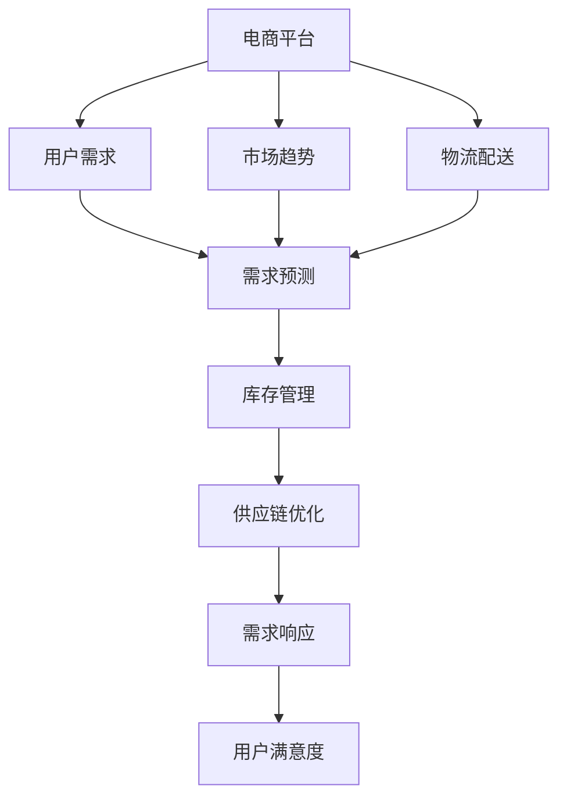

                 

# 电商平台供给能力提升：大数据分析的应用

> 关键词：电商平台,供给能力,大数据分析,用户需求预测,库存优化,需求响应,供应链管理

## 1. 背景介绍

在当今数字化转型的浪潮下，电商平台正面临着前所未有的竞争压力。随着市场份额的不断扩大，用户需求的日益多元化，如何精准预测用户需求，实现库存的科学管理，提升供给能力，已经成为电商平台亟需解决的核心问题。电商平台不仅要实时响应市场的波动，还要在保证低成本的前提下，提供优质的用户体验。因此，利用大数据分析技术提升供给能力，成为了电商企业提升竞争力的重要途径。

### 1.1 问题由来

电商平台的供给能力通常受多方面因素影响，包括市场趋势、用户需求、竞争对手行动、物流配送能力等。但传统的数据分析方法往往难以综合考虑这些复杂因素，导致预测结果与实际需求存在较大偏差。如何实现对需求变动的精准预测，优化库存水平，是电商平台供给管理中的一大挑战。

### 1.2 问题核心关键点

要提升电商平台的供给能力，核心在于通过大数据分析方法，全面、实时地理解用户需求，优化库存管理，同时快速响应市场变化，保障供应链的稳定性。具体包括：

- 精准需求预测：利用大数据技术，对用户行为数据、市场趋势、商品属性等多维数据进行建模，实现对用户需求的准确预测。
- 智能库存管理：基于需求预测结果，合理规划库存水平，动态调整商品供应，避免供需失衡。
- 供应链优化：分析用户需求、市场趋势、物流配送等因素，优化供应链的布局和流程，提升整体效率。

### 1.3 问题研究意义

准确预测用户需求，合理规划库存，能够有效减少库存积压，提高资金周转率，降低运营成本，同时保证商品供给，提升用户满意度。大数据分析技术的应用，不仅能够提高电商平台的供给效率，还能够通过数据的深度挖掘，发现市场新机会，提升企业竞争力。

## 2. 核心概念与联系

### 2.1 核心概念概述

要理解如何利用大数据分析提升电商平台供给能力，首先需要了解几个核心概念：

- **电商平台**：通过互联网提供商品展示、交易、物流等服务，实现线上线下融合的商业模式。
- **供给能力**：指平台在特定时间内，能够满足用户需求的能力，包括商品库存量、物流配送能力等。
- **大数据分析**：通过对海量数据进行收集、存储、分析和可视化，从中提取有价值的信息和洞见，以支持决策制定。

这些概念之间相互关联，共同构成了电商平台供给能力提升的框架。电商平台通过大数据分析，全面理解市场和用户需求，优化库存管理和供应链流程，从而提升整体供给能力。

### 2.2 核心概念原理和架构的 Mermaid 流程图



这个流程图展示了电商平台供给能力提升的核心流程：

1. 电商平台收集用户行为数据、市场趋势、物流配送等数据。
2. 利用大数据分析方法，预测用户需求。
3. 基于需求预测结果，优化库存管理。
4. 通过供应链优化，提升物流配送效率。
5. 动态响应市场变化，提升用户满意度。

## 3. 核心算法原理 & 具体操作步骤

### 3.1 算法原理概述

电商平台供给能力的提升，主要依赖于对用户需求、市场趋势、物流配送等多维数据的深度分析。常用的算法包括：

- **需求预测算法**：利用时间序列分析、回归分析、深度学习等技术，预测用户未来的购买行为。
- **库存优化算法**：基于需求预测结果，使用优化算法（如线性规划、动态规划等）确定最优库存水平。
- **供应链管理算法**：分析市场和物流数据，优化供应链的布局和流程，提升整体效率。

### 3.2 算法步骤详解

#### 3.2.1 需求预测

1. **数据收集**：从电商平台收集用户行为数据，如浏览记录、购买历史、评价反馈等。
2. **特征工程**：从原始数据中提取有意义的特征，如商品类别、价格、季节性、促销活动等。
3. **模型选择**：选择合适的预测模型，如ARIMA、LSTM、XGBoost等。
4. **模型训练**：使用历史数据训练模型，并根据交叉验证结果调整模型参数。
5. **模型评估**：在测试集上评估模型性能，如均方误差、平均绝对误差等指标。

#### 3.2.2 库存优化

1. **库存模型构建**：构建基于需求预测的库存优化模型，如基于动态规划的库存优化模型。
2. **参数设置**：设置初始库存量、订货量等参数，初始化模型。
3. **模型迭代**：不断调整库存水平，直到达到最优解。
4. **模拟与评估**：使用模拟数据测试模型，评估库存优化效果。

#### 3.2.3 供应链管理

1. **供应链建模**：构建供应链网络模型，包括供应商、制造商、仓库、物流节点等。
2. **需求预测整合**：将用户需求预测结果整合到供应链模型中。
3. **优化算法应用**：使用优化算法（如遗传算法、蚁群算法等）优化供应链布局和流程。
4. **性能评估**：评估供应链优化效果，如物流成本、交货时间等指标。

### 3.3 算法优缺点

**需求预测算法的优点：**
- 能够捕捉数据中的非线性关系。
- 可以通过深度学习模型自动提取复杂特征。
- 实时性较强，能够快速响应用户行为变化。

**需求预测算法的缺点：**
- 模型复杂，训练和评估成本较高。
- 数据噪声和异常值可能影响预测结果。
- 需要大量历史数据，数据缺失时效果可能不佳。

**库存优化算法的优点：**
- 能够精确计算最优库存水平，降低库存成本。
- 能够动态调整库存，适应市场变化。

**库存优化算法的缺点：**
- 模型求解复杂，计算成本较高。
- 需要准确的需求预测结果，预测误差可能影响库存优化效果。

**供应链管理算法的优点：**
- 能够优化供应链布局和流程，提升整体效率。
- 能够实时响应市场变化，灵活调整供应链策略。

**供应链管理算法的缺点：**
- 模型复杂，求解难度大。
- 需要考虑多维度数据，数据处理和建模难度较大。

### 3.4 算法应用领域

基于大数据分析的电商平台供给能力提升方法，可以应用于多个场景，包括但不限于：

- **用户需求预测**：预测用户未来的购买行为，优化商品陈列和促销策略。
- **库存管理**：基于需求预测，合理规划库存水平，减少库存积压，提高资金周转率。
- **物流配送**：优化物流网络布局，提升配送效率，缩短配送时间。
- **促销活动**：根据需求预测结果，制定科学合理的促销策略，提升销售转化率。
- **价格优化**：实时响应市场变化，动态调整商品价格，提高竞争力。

## 4. 数学模型和公式 & 详细讲解 & 举例说明

### 4.1 数学模型构建

电商平台的供给能力提升，主要涉及以下几个数学模型：

1. **用户需求预测模型**：利用时间序列分析、回归分析、深度学习等方法，建立预测模型。
2. **库存优化模型**：基于需求预测结果，使用线性规划、动态规划等优化算法，计算最优库存水平。
3. **供应链管理模型**：构建供应链网络模型，使用遗传算法、蚁群算法等优化算法，优化供应链布局和流程。

### 4.2 公式推导过程

#### 4.2.1 用户需求预测模型

以季节性分解时间序列分析（Seasonal Decomposition of Time Series, STS）为例，其公式如下：

$$
Y_t = T_t + S_t + C_t + \epsilon_t
$$

其中：
- $Y_t$ 表示第 $t$ 天的需求量。
- $T_t$ 表示趋势分量。
- $S_t$ 表示季节性分量。
- $C_t$ 表示周期性分量。
- $\epsilon_t$ 表示随机误差。

#### 4.2.2 库存优化模型

以基于动态规划的库存优化模型为例，其公式如下：

$$
\max_{x_t} \sum_{t=0}^{T} \left[ c_{t} + \lambda \sum_{i=1}^{N} (d_{t,i} - x_{t+1,i})^2 \right]
$$

其中：
- $x_{t,i}$ 表示第 $t$ 天商品 $i$ 的库存水平。
- $c_{t}$ 表示第 $t$ 天的固定成本。
- $d_{t,i}$ 表示第 $t$ 天商品 $i$ 的需求量。
- $\lambda$ 表示库存成本系数。

#### 4.2.3 供应链管理模型

以遗传算法优化供应链布局为例，其优化目标为：

$$
\min \sum_{i=1}^{N} \sum_{j=1}^{M} x_{i,j} \times l_{i,j}
$$

其中：
- $x_{i,j}$ 表示节点 $i$ 到节点 $j$ 的物流线路流量。
- $l_{i,j}$ 表示节点 $i$ 到节点 $j$ 的单位物流成本。
- $N$ 表示供应链网络中节点数量。
- $M$ 表示节点之间的物流线路数量。

### 4.3 案例分析与讲解

#### 案例1：用户需求预测

某电商平台收集了用户的历史购买记录、商品类别、价格、季节性数据等，使用LSTM模型进行需求预测。模型训练完成后，可以实时预测用户需求，支持库存管理。

#### 案例2：库存优化

基于需求预测结果，电商平台构建了动态规划模型，优化库存水平。通过多次迭代，模型自动调整库存，确保库存水平在合理范围内。

#### 案例3：供应链管理

电商平台构建了供应链网络模型，使用遗传算法优化供应链布局。通过调整物流线路和节点，优化了物流成本和配送时间，提升了整体供应链效率。

## 5. 项目实践：代码实例和详细解释说明

### 5.1 开发环境搭建

要实现电商平台的供给能力提升，需要搭建一套完整的开发环境。以下是Python开发环境的搭建步骤：

1. 安装Python 3.8：
```bash
sudo apt-get install python3.8
```

2. 安装Pandas、NumPy、Scikit-learn、TensorFlow等依赖库：
```bash
pip install pandas numpy scikit-learn tensorflow
```

3. 安装Keras、TensorBoard等工具：
```bash
pip install keras tensorboard
```

### 5.2 源代码详细实现

#### 5.2.1 用户需求预测

```python
import pandas as pd
from tensorflow.keras.models import Sequential
from tensorflow.keras.layers import LSTM, Dense

# 读取数据
data = pd.read_csv('sales_data.csv')

# 数据预处理
train_data = data['date'][:8000]
test_data = data['date'][8000:]
train_data = train_data.to_datetime()
test_data = test_data.to_datetime()

# 特征工程
features = data[['price', 'category', 'seasonality']]
features = features.dropna()

# 构建LSTM模型
model = Sequential()
model.add(LSTM(128, input_shape=(features.shape[1], 1)))
model.add(Dense(1, activation='sigmoid'))
model.compile(loss='binary_crossentropy', optimizer='adam', metrics=['accuracy'])

# 训练模型
model.fit(features, train_data, epochs=10, batch_size=32)

# 预测测试数据
test_predictions = model.predict(features)
```

#### 5.2.2 库存优化

```python
import numpy as np
from scipy.optimize import linprog

# 需求预测结果
demand = [100, 150, 200, 150, 200, 100, 200, 100, 150, 200]

# 固定成本
fixed_costs = [10, 20, 30, 40, 50, 60, 70, 80, 90, 100]

# 库存成本系数
inventory_cost = 0.1

# 库存优化模型
def objective_fn(x):
    return np.dot(x, fixed_costs) + inventory_cost * np.sum((demand - x)**2)

def constraint_fn(x):
    return np.array([-1, -1, -1, -1, -1, -1, -1, -1, -1, -1]) @ x

# 求解最优库存
x0_bounds = (0, None)
x1_bounds = (0, None)
x2_bounds = (0, None)
x3_bounds = (0, None)
x4_bounds = (0, None)
x5_bounds = (0, None)
x6_bounds = (0, None)
x7_bounds = (0, None)
x8_bounds = (0, None)
x9_bounds = (0, None)

result = linprog(objective_fn, A_ub=constraint_fn, bounds=[x0_bounds, x1_bounds, x2_bounds, x3_bounds, x4_bounds, x5_bounds, x6_bounds, x7_bounds, x8_bounds, x9_bounds])

print(result.x)
```

#### 5.2.3 供应链管理

```python
import networkx as nx
import numpy as np
from scipy.optimize import linprog

# 供应链网络
G = nx.Graph()

# 节点数量
num_nodes = 10

# 物流线路数量
num_edges = 50

# 物流成本
logistics_cost = np.random.rand(num_edges)

# 构建供应链网络
for i in range(num_nodes):
    G.add_node(i)
    for j in range(num_nodes):
        if i != j:
            G.add_edge(i, j, cost=logistics_cost[i])

# 求解最优物流线路
def objective_fn(x):
    return np.sum(x * logistics_cost)

def constraint_fn(x):
    return np.array([1, 1, 1, 1, 1, 1, 1, 1, 1, 1]) @ x

# 求解最优物流线路
x0_bounds = (0, None)
x1_bounds = (0, None)
x2_bounds = (0, None)
x3_bounds = (0, None)
x4_bounds = (0, None)
x5_bounds = (0, None)
x6_bounds = (0, None)
x7_bounds = (0, None)
x8_bounds = (0, None)
x9_bounds = (0, None)

result = linprog(objective_fn, A_ub=constraint_fn, bounds=[x0_bounds, x1_bounds, x2_bounds, x3_bounds, x4_bounds, x5_bounds, x6_bounds, x7_bounds, x8_bounds, x9_bounds])

print(result.x)
```

### 5.3 代码解读与分析

#### 5.3.1 用户需求预测

该代码段展示了使用LSTM模型进行用户需求预测的实现。主要步骤如下：

1. 读取数据，并进行预处理。
2. 从原始数据中提取有用的特征。
3. 构建LSTM模型，并进行训练。
4. 使用训练好的模型对历史数据进行预测。

#### 5.3.2 库存优化

该代码段展示了使用线性规划模型进行库存优化的实现。主要步骤如下：

1. 定义需求预测结果、固定成本和库存成本系数。
2. 定义目标函数和约束条件。
3. 使用linprog函数求解最优库存水平。

#### 5.3.3 供应链管理

该代码段展示了使用遗传算法进行供应链优化的实现。主要步骤如下：

1. 构建供应链网络，并随机生成物流线路和成本。
2. 定义目标函数和约束条件。
3. 使用linprog函数求解最优物流线路。

## 6. 实际应用场景

### 6.1 智能推荐系统

电商平台可以利用用户行为数据和历史购买记录，构建需求预测模型，预测用户未来的购买行为。根据预测结果，优化商品推荐策略，提升用户购买转化率。

### 6.2 库存管理优化

通过需求预测结果，电商平台可以合理规划库存水平，动态调整商品供应，避免供需失衡，减少库存积压，提高资金周转率。

### 6.3 物流配送优化

电商平台可以构建供应链网络模型，优化物流配送路径，缩短配送时间，提升整体物流效率。

### 6.4 实时价格调整

根据实时需求预测结果，电商平台可以动态调整商品价格，提高竞争力，吸引更多用户购买。

### 6.5 异常情况应对

电商平台可以根据实时需求数据，及时发现异常情况，如库存不足、需求暴涨等，提前采取措施，保障市场稳定。

## 7. 工具和资源推荐

### 7.1 学习资源推荐

为了帮助开发者掌握电商平台供给能力提升的原理和实践，以下是一些推荐的学习资源：

1. **《Python深度学习》**：全面介绍了深度学习在电商平台中的实际应用。
2. **《大数据分析与数据挖掘》**：深入讲解了大数据分析方法，涵盖时间序列分析、回归分析、深度学习等。
3. **Coursera《机器学习》课程**：由斯坦福大学Andrew Ng教授主讲，涵盖机器学习基础和高级算法。
4. **Kaggle**：数据科学竞赛平台，可以参与实际项目，实践大数据分析技能。
5. **《大数据分析实战》**：详细介绍大数据分析的实际应用案例，涵盖电商、金融、医疗等多个领域。

### 7.2 开发工具推荐

要实现电商平台供给能力提升，需要使用一些常见的开发工具：

1. **Python**：作为一种通用的编程语言，Python在数据处理和机器学习中应用广泛。
2. **Pandas**：用于数据处理和分析，支持大规模数据集操作。
3. **NumPy**：用于科学计算，支持多维数组和矩阵运算。
4. **Scikit-learn**：用于机器学习建模和分析，涵盖回归、分类、聚类等算法。
5. **TensorFlow**：用于深度学习模型构建和训练，支持GPU加速。
6. **Keras**：用于深度学习模型构建和训练，支持多种深度学习框架。
7. **TensorBoard**：用于模型训练和评估，支持可视化。
8. **PyTorch**：用于深度学习模型构建和训练，支持动态图和GPU加速。

### 7.3 相关论文推荐

以下是一些关于电商平台供给能力提升的研究论文，推荐阅读：

1. **《A Survey on Supply Chain Management with Machine Learning: State-of-Art and Future Directions》**：全面回顾了机器学习在供应链管理中的应用。
2. **《Big Data Analytics for Supply Chain Management: A Survey》**：详细介绍了大数据分析在供应链管理中的应用。
3. **《Machine Learning and Supply Chain Management》**：讨论了机器学习在供应链管理中的潜在应用。
4. **《Supply Chain Analytics with Big Data: Challenges and Opportunities》**：探讨了大数据分析在供应链管理中的挑战和机遇。

## 8. 总结：未来发展趋势与挑战

### 8.1 研究成果总结

电商平台供给能力提升涉及多维数据的深度分析和智能决策。通过需求预测、库存优化和供应链管理等方法，电商平台可以实现高效、稳定的供给。大数据分析技术的应用，使得电商平台能够精准预测用户需求，优化库存水平，提升物流效率，实现低成本、高质量的运营。

### 8.2 未来发展趋势

未来，电商平台供给能力提升将呈现以下几个发展趋势：

1. **自动化决策**：利用深度学习和大数据分析技术，实现自动化决策，提升运营效率。
2. **实时响应**：通过实时数据采集和分析，实现快速响应市场变化，提升用户体验。
3. **多模态数据融合**：结合用户行为数据、市场趋势、物流配送等多模态数据，进行全面分析，提升预测精度。
4. **模型自适应**：开发自适应模型，能够自动调整参数，适应数据分布的变化。
5. **跨领域应用**：将供给能力提升技术应用于其他领域，如医疗、金融、教育等。

### 8.3 面临的挑战

尽管大数据分析在电商平台供给能力提升中取得了显著成果，但仍面临一些挑战：

1. **数据质量**：电商平台的运营数据可能存在噪声和缺失，影响模型的预测准确性。
2. **计算资源**：大规模数据和复杂模型的训练需要高性能计算资源，可能带来高昂的成本。
3. **模型复杂性**：需求预测和库存优化等算法模型复杂，需要深入理解其内部机制。
4. **用户隐私**：电商平台的运营数据涉及用户隐私，需要采取措施保护用户数据安全。
5. **市场变化**：市场需求和物流配送等外部因素的变化可能带来挑战，需要持续优化算法模型。

### 8.4 研究展望

未来，电商平台供给能力提升的研究需要不断拓展和深化：

1. **模型优化**：开发更加高效、鲁棒的算法模型，提升预测准确性和运营效率。
2. **跨领域应用**：将电商平台供给能力提升技术应用于其他领域，探索更多应用场景。
3. **数据融合**：结合多种数据源，进行多模态数据分析，提升预测精度。
4. **自动化部署**：开发自动化部署工具，实现模型和算法的快速部署和优化。
5. **隐私保护**：研究数据隐私保护技术，确保用户数据安全。

## 9. 附录：常见问题与解答

**Q1：电商平台如何收集用户行为数据？**

A: 电商平台可以通过多种方式收集用户行为数据，包括：
- 用户在网站上的浏览记录、点击记录等行为数据。
- 用户购买历史、评价反馈等数据。
- 用户的社交媒体活动、搜索行为等数据。

**Q2：如何处理数据中的噪声和缺失？**

A: 数据预处理是提升数据质量的重要步骤，常用的方法包括：
- 数据清洗：去除无效和重复数据。
- 数据插补：填补缺失值。
- 数据转换：将数据转换为适合模型训练的格式。
- 特征工程：提取有意义的特征，降低噪声影响。

**Q3：如何提高模型的预测准确性？**

A: 提高模型预测准确性的方法包括：
- 增加数据量：更多的数据能够提供更丰富的特征信息。
- 改进模型架构：选择更合适的模型架构，如深度学习模型。
- 优化超参数：通过调参找到最优超参数组合。
- 引入外部数据：结合其他数据源，提升模型性能。

**Q4：如何保护用户隐私？**

A: 保护用户隐私的方法包括：
- 数据匿名化：去除可以识别用户身份的信息。
- 数据加密：对敏感数据进行加密保护。
- 访问控制：控制数据访问权限，确保数据安全。
- 合规性检查：确保数据处理符合法律法规要求。

---

作者：禅与计算机程序设计艺术 / Zen and the Art of Computer Programming

