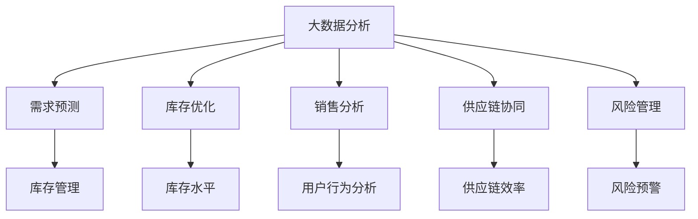

                 

## 1. 背景介绍

### 1.1 问题由来

随着电商平台的迅猛发展，消费者需求日益多样化，市场竞争愈发激烈。对于电商平台而言，其核心竞争力不仅在于丰富的商品种类和用户粘性，更在于精准的供给能力和高效的运营效率。大数据分析技术的引入，为电商平台提供了强大的数据分析能力，能够帮助商家精准预测需求、优化库存管理、提高运营效率，从而增强平台的竞争力。

然而，当前大多数电商平台的数据分析系统仍停留在数据报表和统计分析阶段，缺乏对数据深度挖掘和业务洞察的能力。如何充分利用大数据技术，对电商平台供给能力进行全面、系统的提升，成为亟待解决的问题。

### 1.2 问题核心关键点

要提升电商平台的供给能力，关键在于实现数据的深度挖掘和智能分析，具体包括：
1. **需求预测**：预测未来一段时间内的用户需求，帮助商家及时调整库存，避免缺货或积压。
2. **库存优化**：根据需求预测结果和实时库存数据，自动调整库存水平，优化库存结构。
3. **销售分析**：分析销售数据，挖掘用户购买行为和偏好，为商品推荐和营销策略提供依据。
4. **供应链协同**：与供应商、物流企业等协同合作，实现供应链的整体优化和协调。
5. **风险管理**：通过数据分析预测潜在的市场风险，如价格波动、物流延误等，及时采取措施。

以上问题通过大数据分析技术的引入，可以实现数据驱动的智能决策，提升电商平台的供给能力，增强市场竞争力。

### 1.3 问题研究意义

大数据分析技术在电商平台中的应用，可以带来以下几方面的重要意义：

1. **提升运营效率**：通过对历史数据的分析，发现运营中的瓶颈和问题，制定针对性的优化策略，从而提高整体运营效率。
2. **精准营销**：通过数据分析了解用户需求和购买行为，实现精准营销，提高转化率和销售额。
3. **风险预警**：实时监测市场动态，提前发现潜在风险，及时采取措施，降低运营风险。
4. **提升用户体验**：通过数据分析优化商品推荐和搜索算法，提升用户体验，增加用户粘性。
5. **促进创新**：借助大数据分析，不断挖掘新的业务机会和市场趋势，推动电商平台的创新发展。

## 2. 核心概念与联系

### 2.1 核心概念概述

为更好地理解电商平台供给能力提升的大数据分析应用，本节将介绍几个密切相关的核心概念：

- **大数据分析**：指利用大数据技术，对海量数据进行采集、存储、处理和分析，从中挖掘出有价值的信息和规律的过程。
- **需求预测**：通过分析历史销售数据、用户行为数据等，预测未来需求，指导库存管理和商品采购。
- **库存优化**：利用算法和模型对库存进行动态调整，优化库存水平和结构，减少库存成本。
- **销售分析**：对销售数据进行深度分析，挖掘用户购买行为、偏好等，为营销和推荐提供依据。
- **供应链协同**：通过数据共享和信息传递，实现供应链各个环节的协同，提高整体运营效率。
- **风险管理**：通过对市场数据的实时监测和分析，预测潜在的风险和危机，采取相应的措施。

这些核心概念之间的逻辑关系可以通过以下Mermaid流程图来展示：



这个流程图展示了大数据分析的核心概念及其之间的关系：

1. 大数据分析是整个体系的基础，提供了数据支持和算法模型。
2. 需求预测、库存优化、销售分析、供应链协同和风险管理等模块，都是在数据分析的基础上进行的。
3. 每个模块之间互为影响，共同构成了一个完整的数据驱动的电商平台运营体系。

## 3. 核心算法原理 & 具体操作步骤
### 3.1 算法原理概述

电商平台的供给能力提升，主要依赖于数据驱动的智能分析和决策。基于大数据分析的算法模型可以包括以下几个关键模块：

- **需求预测模型**：基于历史销售数据、用户行为数据等，构建时间序列模型、回归模型等，预测未来的需求。
- **库存优化算法**：结合需求预测结果和实时库存数据，设计动态库存管理算法，优化库存水平和结构。
- **销售分析模型**：对销售数据进行聚类、分类、关联分析等，挖掘用户购买行为和偏好。
- **供应链协同算法**：通过数据共享和信息传递，实现供应链各环节的协同和优化。
- **风险管理模型**：利用时间序列分析、异常检测等技术，预测市场风险，及时采取应对措施。

以上算法模型通过深度学习和机器学习技术，对电商平台的数据进行分析和预测，实现供给能力的提升。

### 3.2 算法步骤详解

基于大数据分析的电商平台供给能力提升，一般包括以下几个关键步骤：

**Step 1: 数据收集和处理**
- 收集电商平台的销售数据、用户行为数据、库存数据等，形成原始数据集。
- 对数据进行清洗和预处理，去除噪声和异常值，保证数据的质量和一致性。

**Step 2: 数据分析和建模**
- 对处理后的数据进行统计分析和可视化，发现业务中的问题和趋势。
- 设计合适的算法模型，对数据进行深度挖掘和预测，如时间序列模型、回归模型、分类模型等。

**Step 3: 模型训练和优化**
- 使用历史数据对模型进行训练，评估模型的性能和泛化能力。
- 根据模型表现进行调参和优化，提升模型的预测准确性和稳定性。

**Step 4: 结果应用和监控**
- 将训练好的模型应用于实时数据，进行需求预测、库存优化、销售分析、供应链协同和风险管理。
- 实时监控模型的运行情况和预测结果，及时发现和解决异常问题。

**Step 5: 反馈和迭代**
- 根据模型运行结果和业务反馈，不断调整算法模型和策略，持续优化电商平台供给能力。

### 3.3 算法优缺点

基于大数据分析的电商平台供给能力提升方法，具有以下优点：
1. 数据驱动：通过深度学习和机器学习技术，利用大数据进行智能分析和预测，提升运营效率。
2. 动态优化：结合实时数据和历史数据，动态调整库存、商品推荐等，提高运营灵活性。
3. 自动化程度高：算法模型可以实现自动化运行，减少人工干预，提高决策效率。
4. 可扩展性强：算法模型可以针对不同的业务需求进行定制化开发，具备较强的可扩展性。

同时，该方法也存在一定的局限性：
1. 数据质量要求高：模型的性能很大程度上依赖于数据的质量和完整性，数据缺失或不准确会影响预测效果。
2. 模型复杂度高：涉及多种算法模型和数据处理技术，模型设计和调参复杂。
3. 算力需求高：模型训练和运行需要大量的计算资源，可能对硬件设备提出较高要求。
4. 解释性不足：复杂模型往往缺乏可解释性，难以解释模型的内部决策逻辑。

尽管存在这些局限性，但就目前而言，大数据分析方法仍是大规模电商平台提升供给能力的重要手段。未来相关研究的重点在于如何进一步降低数据处理的复杂度，提升模型的解释性和鲁棒性，同时兼顾算力成本和实时性。

### 3.4 算法应用领域

基于大数据分析的电商平台供给能力提升方法，已经在多个电商领域得到了广泛应用，例如：

- **需求预测**：通过分析历史销售数据和用户行为数据，预测未来需求，指导库存管理和商品采购。
- **库存优化**：结合需求预测结果和实时库存数据，动态调整库存水平，优化库存结构。
- **销售分析**：对销售数据进行深度分析，挖掘用户购买行为、偏好等，为商品推荐和营销策略提供依据。
- **供应链协同**：通过数据共享和信息传递，实现供应链各环节的协同和优化，提高整体运营效率。
- **风险管理**：利用时间序列分析、异常检测等技术，预测市场风险，及时采取应对措施。

除了上述这些经典应用外，大数据分析技术还被创新性地应用到更多场景中，如个性化推荐、实时搜索、实时监控等，为电商平台的运营提供了新的突破。随着技术的日益成熟，大数据分析方法必将在电商平台上得到更广泛的应用，推动电商运营效率的不断提升。

## 4. 数学模型和公式 & 详细讲解 & 举例说明
### 4.1 数学模型构建

为更加严格地刻画电商平台供给能力提升的大数据分析应用，本节将使用数学语言对关键算法模型进行描述。

假设电商平台的历史销售数据为 $S=\{s_t\}_{t=1}^T$，其中 $s_t$ 表示第 $t$ 天的销售量。则需求预测模型的目标是通过历史销售数据，预测未来一段时间内的销售量，即：

$$
\hat{s}_t = f(S)
$$

其中 $\hat{s}_t$ 为第 $t$ 天的预测销售量，$f$ 为预测函数。常用的预测函数包括时间序列模型、回归模型、深度学习模型等。

### 4.2 公式推导过程

以下我们以时间序列模型中的ARIMA模型为例，推导需求预测的数学公式。

假设 $s_t$ 服从ARIMA(1,1,1)模型，即：

$$
s_t = \alpha + \beta s_{t-1} + \gamma (s_{t-1} - s_{t-2}) + \epsilon_t
$$

其中 $\alpha$、$\beta$、$\gamma$ 为模型参数，$\epsilon_t$ 为随机误差项。则对 $s_t$ 进行预测的公式为：

$$
\hat{s}_t = \alpha + \beta \hat{s}_{t-1} + \gamma (\hat{s}_{t-1} - \hat{s}_{t-2})
$$

具体实现时，可以通过最小二乘法、最大似然估计等方法，对模型参数进行估计和优化。

### 4.3 案例分析与讲解

假设某电商平台的日销售数据为：

| 日期       | 销售量 |
|------------|--------|
| 2021-01-01 | 100    |
| 2021-01-02 | 120    |
| 2021-01-03 | 130    |
| 2021-01-04 | 110    |
| 2021-01-05 | 90     |

我们使用ARIMA模型进行需求预测。根据历史数据，模型的参数估计结果为 $\alpha=100$、$\beta=0.9$、$\gamma=0.1$。则：

- 第1天的预测值为：$\hat{s}_1 = 100$
- 第2天的预测值为：$\hat{s}_2 = 100 + 0.9 \times 100 + 0.1 \times (100 - 0.9 \times 100) = 121$
- 第3天的预测值为：$\hat{s}_3 = 100 + 0.9 \times 121 + 0.1 \times (121 - 100) = 133.1$
- 第4天的预测值为：$\hat{s}_4 = 100 + 0.9 \times 133.1 + 0.1 \times (133.1 - 121) = 133.1$
- 第5天的预测值为：$\hat{s}_5 = 100 + 0.9 \times 133.1 + 0.1 \times (133.1 - 133.1) = 133.1$

通过ARIMA模型，我们能够对电商平台的销售需求进行预测，从而指导库存管理和商品采购，优化供给能力。

## 5. 项目实践：代码实例和详细解释说明
### 5.1 开发环境搭建

在进行电商平台供给能力提升的大数据分析应用开发前，我们需要准备好开发环境。以下是使用Python进行Pandas、Scikit-learn等库的开发环境配置流程：

1. 安装Anaconda：从官网下载并安装Anaconda，用于创建独立的Python环境。

2. 创建并激活虚拟环境：
```bash
conda create -n data-env python=3.8 
conda activate data-env
```

3. 安装必要的库：
```bash
conda install pandas scikit-learn matplotlib seaborn statsmodels
```

4. 安装Jupyter Notebook：
```bash
pip install jupyter notebook
```

完成上述步骤后，即可在`data-env`环境中开始数据分析应用的开发。

### 5.2 源代码详细实现

下面我们以需求预测模块为例，给出使用Pandas和Scikit-learn库进行ARIMA模型训练的Python代码实现。

首先，定义数据处理函数：

```python
import pandas as pd
from statsmodels.tsa.arima_model import ARIMA

def load_sales_data(file_path):
    data = pd.read_csv(file_path, index_col='date', parse_dates=['date'])
    data.index.freq = 'D'
    return data

def split_train_test(data, test_size=0.2):
    train_size = int(len(data) * (1 - test_size))
    return data.iloc[:train_size], data.iloc[train_size:]
```

然后，定义模型训练和预测函数：

```python
from sklearn.metrics import mean_squared_error

def train_arima(data, order=(1, 1, 1), test_size=0.2):
    train, test = split_train_test(data, test_size=test_size)
    model = ARIMA(train, order=order)
    model_fit = model.fit()
    y_pred = model_fit.forecast(steps=len(test))
    y_true = test['sales']
    mse = mean_squared_error(y_true, y_pred)
    return model_fit, mse

def predict_arima(model_fit, new_data):
    y_pred = model_fit.forecast(steps=len(new_data))
    return y_pred
```

最后，启动训练流程并在测试集上评估：

```python
# 加载数据
file_path = 'sales_data.csv'
data = load_sales_data(file_path)

# 训练模型
order = (1, 1, 1)
model_fit, mse = train_arima(data, order=order, test_size=0.2)
print(f'Mean Squared Error: {mse:.3f}')

# 预测未来数据
new_data = pd.read_csv('new_sales_data.csv', index_col='date', parse_dates=['date'])
new_data.index.freq = 'D'
y_pred = predict_arima(model_fit, new_data)
print(y_pred)
```

以上就是使用Pandas和Scikit-learn库进行ARIMA模型训练和预测的完整代码实现。可以看到，借助Python的丰富库函数，数据分析应用的开发变得简洁高效。

### 5.3 代码解读与分析

让我们再详细解读一下关键代码的实现细节：

**load_sales_data函数**：
- 读取CSV格式的历史销售数据，将其转换为Pandas DataFrame，并设置日期为索引。

**split_train_test函数**：
- 将数据集划分为训练集和测试集，比例为80%训练、20%测试。

**train_arima函数**：
- 对训练集进行ARIMA模型训练，设置模型的阶数order=(1, 1, 1)，并返回模型和均方误差mse。

**predict_arima函数**：
- 使用训练好的模型对新数据进行预测，返回预测结果。

**训练流程**：
- 定义ARIMA模型的阶数order=(1, 1, 1)，并调用train_arima函数对数据进行训练，输出均方误差。
- 加载新的销售数据，并调用predict_arima函数对未来数据进行预测。

可以看到，通过Python的Pandas和Scikit-learn库，电商平台的供给能力提升可以通过简单的代码实现。在实际应用中，还可以结合数据可视化、异常检测等技术，进一步提升数据处理的全面性和准确性。

## 6. 实际应用场景
### 6.1 智能库存管理

基于大数据分析的需求预测和库存优化，电商平台可以实现智能库存管理，避免库存积压和缺货问题。通过实时监测和预测，动态调整库存水平和结构，确保商品供需平衡，提高运营效率。

### 6.2 个性化推荐

通过对用户购买行为和偏好的深度分析，电商平台可以构建个性化的推荐系统，精准推荐用户感兴趣的商品。提高用户的购买转化率，增加销售额。

### 6.3 实时监控和预警

通过实时监测电商平台的数据，可以发现运营中的异常和问题，及时采取措施。如预测到某商品的销售量异常下降，可以及时预警并调整商品促销策略，避免损失。

### 6.4 未来应用展望

随着大数据分析技术的不断发展，电商平台供给能力提升将呈现以下几个发展趋势：

1. **多模态数据融合**：结合用户行为数据、物流数据、社交数据等多模态信息，提升需求预测和库存管理的准确性。
2. **智能决策引擎**：通过机器学习和深度学习技术，构建智能决策引擎，实现更精准的库存管理和推荐策略。
3. **实时优化**：结合实时数据和预测模型，实现动态调整和优化，提高运营的灵活性和响应速度。
4. **预测准确性提升**：通过模型优化和算法创新，进一步提升需求预测的准确性和稳定性。
5. **业务协同**：与供应商、物流企业等合作，构建数据共享和协同机制，实现供应链的整体优化和协调。

这些趋势将推动电商平台供给能力提升的不断深化，为电商运营带来更高的效率和更好的用户体验。

## 7. 工具和资源推荐
### 7.1 学习资源推荐

为了帮助开发者系统掌握大数据分析在电商平台中的应用，这里推荐一些优质的学习资源：

1. 《Python数据分析实战》：全面介绍Python的Pandas、Scikit-learn等库，涵盖数据处理、统计分析、机器学习等多个方面。
2. 《R语言实战》：介绍R语言的统计分析、数据可视化、机器学习等技术，适合对统计学有基础的学习者。
3. 《大数据分析与机器学习》课程：由Coursera提供，涵盖大数据分析的多个领域，包括数据挖掘、统计学习、深度学习等。
4. Kaggle：数据科学和机器学习竞赛平台，提供大量的数据集和代码实现，适合实践和提高实战技能。
5. 《数据分析实战》书籍：介绍数据分析的各个环节，包括数据清洗、特征工程、模型训练等，适合初学者入门。

通过对这些资源的学习实践，相信你一定能够快速掌握电商平台供给能力提升的数据分析方法，并用于解决实际的电商问题。

### 7.2 开发工具推荐

高效的开发离不开优秀的工具支持。以下是几款用于电商平台供给能力提升的数据分析应用的常用工具：

1. Jupyter Notebook：提供交互式编程环境，支持代码执行和结果展示，方便调试和交流。
2. PyCharm：Python开发集成环境，提供丰富的开发工具和调试功能，支持多项目管理和版本控制。
3. RStudio：R语言的开发环境，提供丰富的数据分析工具和图表展示功能，适合统计分析和数据可视化。
4. Tableau：数据可视化工具，支持多种数据源和图表类型，适合快速制作报表和仪表盘。
5. Power BI：微软的数据分析平台，提供强大的数据可视化、报表设计和报表发布功能，适合企业级应用。

合理利用这些工具，可以显著提升电商平台供给能力提升的数据分析应用开发效率，加快创新迭代的步伐。

### 7.3 相关论文推荐

电商平台供给能力提升的大数据分析应用领域，已经涌现出许多创新性研究成果。以下是几篇奠基性的相关论文，推荐阅读：

1. "E-commerce Demand Forecasting: A Review and Synthesis"：综述了电商需求预测的最新研究进展，涵盖了多种模型和技术。
2. "A Survey on Inventory Management in E-commerce Platforms"：综述了电商库存管理的研究，介绍了多种库存优化算法和技术。
3. "A Comparative Study on Recommendation Algorithms for E-commerce Platforms"：比较了多种推荐算法的优缺点，并给出了实际应用中的案例分析。
4. "Supply Chain Management in E-commerce Platforms: A Survey"：综述了电商供应链管理的研究，介绍了多种协同算法和优化方法。
5. "Real-time Demand Forecasting for E-commerce: A Survey"：综述了电商实时需求预测的研究，介绍了多种实时数据处理和预测模型。

这些论文代表了大数据分析技术在电商平台中的应用方向，通过学习这些前沿成果，可以帮助研究者把握学科前进方向，激发更多的创新灵感。

## 8. 总结：未来发展趋势与挑战

### 8.1 总结

本文对电商平台供给能力提升的大数据分析应用进行了全面系统的介绍。首先阐述了电商平台的供给能力提升的重要性和紧迫性，明确了大数据分析技术在其中的核心作用。其次，从原理到实践，详细讲解了需求预测、库存优化、销售分析、供应链协同和风险管理等模块的核心算法和操作步骤。最后，通过具体案例和代码实现，展示了大数据分析在电商平台中的应用，并对其未来发展趋势和面临的挑战进行了展望。

通过本文的系统梳理，可以看到，大数据分析技术正在成为电商平台供给能力提升的重要手段，通过深度学习和机器学习技术，实现数据驱动的智能决策，提高运营效率和用户满意度。未来，随着算力成本的下降和数据规模的扩大，大数据分析方法必将在电商平台得到更广泛的应用，推动电商运营的不断优化和创新。

### 8.2 未来发展趋势

展望未来，电商平台供给能力提升的大数据分析应用将呈现以下几个发展趋势：

1. **技术融合**：大数据分析将与其他人工智能技术进行更深层次的融合，如深度学习、自然语言处理、计算机视觉等，实现多模态数据的整合和分析。
2. **实时化**：结合实时数据和预测模型，实现实时监测和优化，提高运营的灵活性和响应速度。
3. **智能化**：利用智能决策引擎和机器学习技术，提升运营的智能化水平，实现更精准的库存管理和推荐策略。
4. **个性化**：结合用户行为数据和偏好分析，实现个性化推荐和定制化服务，提高用户的购买转化率。
5. **自动化**：通过算法和模型的自动化运行，减少人工干预，提高决策效率和运营效率。

这些趋势将推动电商平台供给能力提升的不断深化，为电商运营带来更高的效率和更好的用户体验。

### 8.3 面临的挑战

尽管大数据分析技术在电商平台中的应用取得了显著成效，但在迈向更加智能化、普适化应用的过程中，仍面临诸多挑战：

1. **数据隐私和安全**：电商平台涉及大量用户数据和隐私信息，如何保护数据安全和隐私，是重要的挑战之一。
2. **数据质量和一致性**：数据质量问题如数据缺失、噪声等，会影响算法的准确性和可靠性。
3. **模型复杂性**：大规模数据和高维特征的复杂模型，对计算资源和算力提出了更高的要求。
4. **业务适配性**：不同电商平台的业务模式和需求差异较大，如何设计通用的数据分析模型，适应多种业务场景，是一个重要问题。
5. **解释性和可解释性**：复杂模型缺乏可解释性，难以解释模型的内部决策逻辑，影响业务理解和信任。

这些挑战需要在大数据分析应用的过程中持续关注和解决，以实现技术的稳定可靠和业务的持续优化。

### 8.4 研究展望

面对电商平台供给能力提升大数据分析应用所面临的挑战，未来的研究需要在以下几个方面寻求新的突破：

1. **隐私保护和数据安全**：研究高效的数据隐私保护技术，如差分隐私、联邦学习等，保障用户数据的安全和隐私。
2. **数据治理和质量提升**：建立数据治理体系，提升数据质量和管理效率，确保算法的准确性和可靠性。
3. **模型自动化和轻量化**：开发更加高效的算法和模型，实现模型自动化和轻量化，减少计算资源和算力消耗。
4. **业务适配性**：设计通用的数据分析模型，并结合电商平台的业务特点进行定制化优化，适应多种业务场景。
5. **模型可解释性**：研究模型可解释性和可解释性技术，提高模型的透明度和可信度，帮助业务理解和决策。

这些研究方向将推动大数据分析技术在电商平台中的应用不断深入，为电商运营带来更高的效率和更好的用户体验。

## 9. 附录：常见问题与解答

**Q1：电商平台的需求预测方法有哪些？**

A: 电商平台的需求预测方法主要包括：
1. 时间序列分析：如ARIMA、季节性ARIMA(SARIMA)等。
2. 机器学习模型：如线性回归、随机森林、梯度提升树等。
3. 深度学习模型：如RNN、LSTM、GRU等。
4. 混合模型：结合时间序列分析和机器学习模型，提高预测准确性。

不同的方法适用于不同的业务场景，需要根据实际情况进行选择。

**Q2：电商平台的库存优化策略有哪些？**

A: 电商平台的库存优化策略主要包括：
1. 动态库存管理：根据需求预测结果，动态调整库存水平和结构。
2. 多渠道库存共享：实现多渠道库存的共享和协同，避免库存积压和缺货。
3. 安全库存设置：根据业务特点和风险评估，设置安全库存水平，确保库存稳定性。
4. 供应链协同优化：与供应商、物流企业等协同合作，实现供应链的整体优化和协调。

这些策略结合数据驱动的决策，可以提升电商平台的库存管理效率，降低运营成本。

**Q3：电商平台的销售分析包括哪些内容？**

A: 电商平台的销售分析主要包括：
1. 用户行为分析：分析用户的浏览、点击、购买等行为，挖掘用户偏好和购买动机。
2. 商品销售分析：分析商品的销售情况，挖掘热销商品和滞销商品，指导商品采购和促销策略。
3. 交易数据分析：分析交易数据，发现异常交易和欺诈行为，保障交易安全。
4. 用户反馈分析：分析用户反馈和评价，提升用户满意度和忠诚度。

这些分析内容可以帮助电商平台更好地理解用户需求和市场趋势，实现精准营销和个性化推荐。

**Q4：电商平台的数据隐私和安全如何保障？**

A: 电商平台的数据隐私和安全保障可以从以下几个方面入手：
1. 数据匿名化：对用户数据进行去标识化处理，保护用户隐私。
2. 加密技术：对敏感数据进行加密存储和传输，防止数据泄露。
3. 访问控制：对数据进行权限控制，限制非授权人员访问。
4. 安全审计：定期进行安全审计，发现和修复潜在的安全漏洞。
5. 法律法规合规：遵守相关的法律法规，如GDPR、CCPA等，保障用户数据权益。

这些措施可以有效保障电商平台的数据安全和用户隐私。

**Q5：如何设计通用的电商平台数据分析模型？**

A: 设计通用的电商平台数据分析模型，可以从以下几个方面入手：
1. 数据标准化：对不同来源的数据进行标准化处理，确保数据一致性和可比较性。
2. 通用算法选择：选择通用的算法模型，如时间序列分析、机器学习模型等，避免过度定制化。
3. 业务适配性设计：结合电商平台的业务特点，设计灵活的模型参数和优化策略，适应多种业务场景。
4. 数据可视化：通过数据可视化工具，对分析结果进行展示，帮助业务理解和决策。
5. 模型持续优化：根据业务需求和数据变化，持续优化模型参数和算法，保持模型的高效性和准确性。

这些措施可以有效提升电商平台数据分析模型的通用性和适应性，为业务决策提供可靠的数据支持。

---

作者：禅与计算机程序设计艺术 / Zen and the Art of Computer Programming

