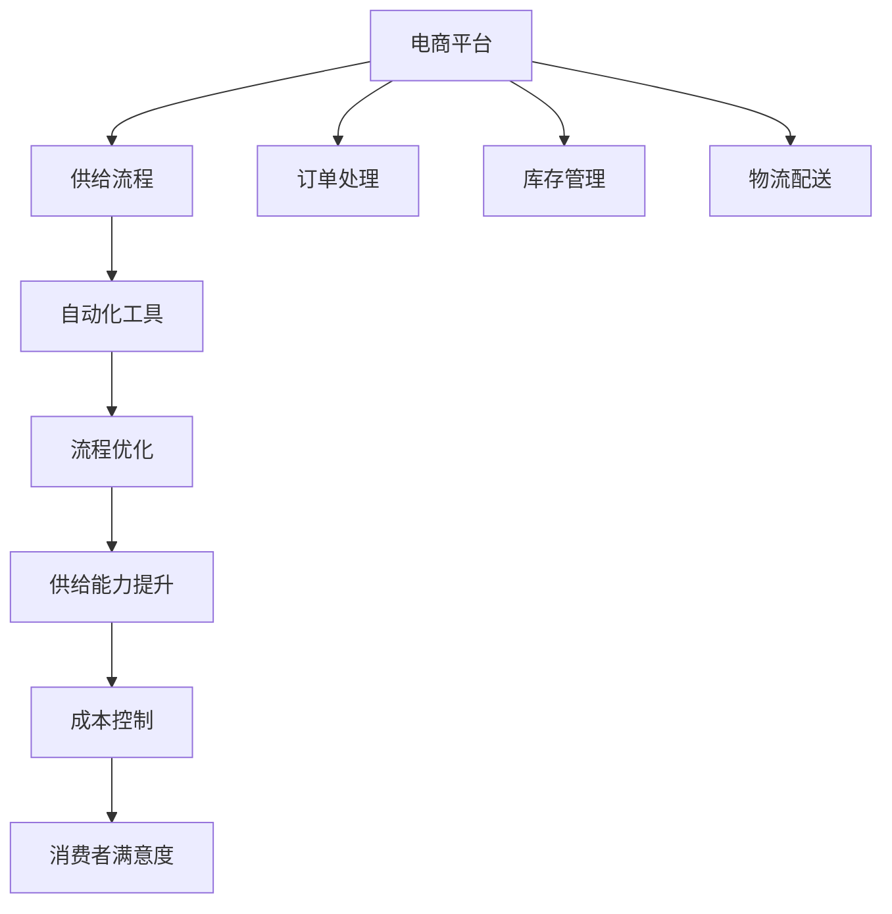

                 

# 电商平台供给能力提升：流程优化和自动化工具

> 关键词：电商平台, 供给能力提升, 流程优化, 自动化工具, 效率提升, 成本控制, 消费者满意度

## 1. 背景介绍

### 1.1 问题由来

随着电商市场的迅速发展，企业面临着巨大的市场竞争压力，需要不断提升自身的供给能力以满足消费者的需求。传统的供给流程往往存在人工介入环节多、处理速度慢、错误率高、成本高等问题，难以实现高效、准确、低成本的供给管理。为了解决这些问题，电商平台开始探索新的供给管理方式，即通过流程优化和自动化工具，实现供给流程的自动化和智能化，从而提升供给效率和质量，降低运营成本，提升消费者满意度。

### 1.2 问题核心关键点

- 供给流程优化：通过重新设计供给流程，减少人工干预，提高处理速度和准确性。
- 自动化工具：引入先进的技术手段，实现供给流程的自动化管理，提升效率和效果。
- 成本控制：通过优化流程和工具使用，降低运营成本，提高经济效益。
- 消费者满意度：提升供给效率和质量，提供更优质的消费者体验，增强市场竞争力。

## 2. 核心概念与联系

### 2.1 核心概念概述

为更好地理解电商平台供给能力提升的方法，本节将介绍几个密切相关的核心概念：

- 电商平台：基于互联网技术，通过在线销售商品和服务，实现企业与消费者之间的交易平台。
- 供给流程：从商品入库、出库、仓储管理到物流配送等，整个商品供给管理的过程。
- 自动化工具：通过先进的技术手段，如机器人、智能系统、自动化设备等，实现供给流程的自动化和智能化管理。
- 流程优化：通过对现有供给流程进行重构和改进，减少瓶颈环节，提高整体效率。
- 供给能力：电商平台处理订单、履行库存的能力，包括处理速度、准确性、响应时间等。
- 成本控制：通过优化流程和工具使用，降低运营成本，提高经济效益。

这些核心概念之间的逻辑关系可以通过以下Mermaid流程图来展示：



这个流程图展示了几者之间的联系：

1. 电商平台通过自动化工具和流程优化提升供给能力。
2. 供给能力提升有助于降低成本，提高消费者满意度。
3. 自动化工具和流程优化需要考虑订单处理、库存管理、物流配送等环节。
4. 流程优化和自动化工具是供给能力提升的重要手段。
5. 消费者满意度是最终目标，驱动供给能力提升。

## 3. 核心算法原理 & 具体操作步骤
### 3.1 算法原理概述

电商平台供给流程优化和自动化工具的设计，核心思想是通过对现有流程的重构和自动化工具的引入，实现供给流程的效率提升和成本控制。其基本思路如下：

1. 分析现有供给流程，识别瓶颈环节，明确改进方向。
2. 引入自动化工具，减少人工介入，提高处理速度和准确性。
3. 重新设计供给流程，优化流程结构，减少环节，提高效率。
4. 实施自动化工具，并不断优化，提升供给能力。
5. 监控成本，控制预算，确保经济效益。
6. 通过消费者反馈，不断改进供给流程和工具。

### 3.2 算法步骤详解

#### 步骤1：流程分析和瓶颈识别

通过对现有供给流程的分析，识别出影响供给效率的瓶颈环节。例如，订单处理、库存管理、物流配送等环节，往往是供应链管理的瓶颈。

具体方法包括：

- 流程审计：对当前流程进行详细审计，记录每个环节的输入、输出、操作人员和处理时间。
- 数据采集：收集流程各环节的数据，包括订单量、处理时间、库存水平、配送速度等。
- 瓶颈识别：通过数据分析和流程审计，识别出瓶颈环节，如订单处理时间长、库存不足等。

#### 步骤2：自动化工具选择和引入

根据流程分析的结果，选择合适的自动化工具，实现瓶颈环节的自动化管理。例如，引入自动化订单处理系统、智能仓储管理系统、自动配送机器人等。

具体步骤包括：

- 需求调研：根据瓶颈环节的需求，进行详细的调研，选择合适的自动化工具。
- 工具选择：在多个备选工具中，选择最适合的工具进行引入，例如，使用AI驱动的订单处理系统，提高处理速度和准确性。
- 工具部署：将选定的自动化工具部署到实际生产环境中，并进行测试。

#### 步骤3：流程优化和设计

在引入自动化工具的基础上，重新设计供给流程，优化流程结构，减少环节，提高效率。例如，将人工处理的环节，改为机器自动化处理，减少错误率和处理时间。

具体方法包括：

- 流程图绘制：绘制新的流程设计图，明确每个环节的操作和处理方式。
- 流程重构：对流程进行重构，减少冗余环节，提高效率。
- 功能集成：将自动化工具集成到新的流程中，实现全流程自动化管理。

#### 步骤4：实施和优化

将新的流程设计和自动化工具部署到实际生产环境中，并进行持续的优化。例如，定期监测流程性能，发现问题及时优化，引入新的自动化工具和技术。

具体步骤包括：

- 工具上线：将自动化工具和优化后的流程上线到实际生产环境。
- 性能监测：使用工具监测流程性能，发现问题及时优化。
- 持续改进：根据性能监测结果，不断优化流程和工具，提升效率。

### 3.3 算法优缺点

电商平台供给流程优化和自动化工具的设计，具有以下优点：

1. 提高效率：通过自动化工具和流程优化，显著提高供给处理速度和准确性，提升运营效率。
2. 降低成本：自动化工具的引入减少了人工介入，降低了人力成本，优化流程后，也减少了不必要的环节和浪费。
3. 提升消费者满意度：供给流程的优化和自动化，提高了处理速度和准确性，降低了错误率，提升了消费者满意度。

同时，该方法也存在以下局限性：

1. 需要较高初始投资：引入自动化工具和流程优化需要较高的初始投资，包括设备采购、系统开发、部署和培训等。
2. 系统整合难度大：不同自动化工具之间的整合，以及与现有系统的集成，存在一定的难度和挑战。
3. 技术复杂度高：自动化工具的引入，需要相应的技术支持，对技术人员的水平要求较高。
4. 用户接受度问题：部分用户对自动化工具的接受度较低，需要一定的培训和引导。

## 4. 数学模型和公式 & 详细讲解 & 举例说明

### 4.1 数学模型构建

为了更好地分析供给流程的优化效果，可以构建以下数学模型：

设电商平台原有的供给流程处理时间为 $T_{old}$，引入自动化工具后的处理时间为 $T_{new}$，优化后的处理时间为 $T_{opt}$。则有：

$$
T_{opt} = T_{old} - T_{new}
$$

其中 $T_{new}$ 为引入自动化工具后的处理时间，可以通过实验或仿真方法获得。

### 4.2 公式推导过程

在优化供给流程时，可以考虑以下因素：

1. 自动化工具引入对处理时间的影响：
   - 自动化工具的引入，可以减少人工干预，提高处理速度。设引入自动化工具后，处理时间减少的比例为 $\delta$，则有：
   $$
   T_{new} = T_{old} \times (1-\delta)
   $$

2. 流程优化对处理时间的影响：
   - 流程优化可以减少不必要的环节，提高效率。设优化后的处理时间减少的比例为 $\epsilon$，则有：
   $$
   T_{opt} = T_{new} \times (1-\epsilon)
   $$

将以上两个公式代入 $T_{opt}$ 的公式中，得到：

$$
T_{opt} = T_{old} \times (1-\delta) \times (1-\epsilon)
$$

这个公式表示，通过引入自动化工具和流程优化，处理时间可以得到显著减少。

### 4.3 案例分析与讲解

以一个电商平台的订单处理为例，分析流程优化和自动化工具的效果。

假设原有订单处理时间为 $T_{old}=120$ 分钟，引入自动化工具后的处理时间为 $T_{new}=80$ 分钟，优化后的处理时间为 $T_{opt}=60$ 分钟。通过计算得到：

- 引入自动化工具后，处理时间减少 $40\%$，即 $T_{new}=T_{old} \times (1-\delta)$，其中 $\delta=0.4$。
- 优化后的处理时间进一步减少 $25\%$，即 $T_{opt}=T_{new} \times (1-\epsilon)$，其中 $\epsilon=0.25$。

通过优化和自动化，处理时间减少了 $50\%$，即 $T_{opt}=T_{old} \times (1-\delta) \times (1-\epsilon)=120 \times (1-0.4) \times (1-0.25)=60$ 分钟。

可以看出，自动化工具和流程优化对提升供给效率有显著效果。

## 5. 项目实践：代码实例和详细解释说明

### 5.1 开发环境搭建

在进行供给流程优化和自动化工具开发前，我们需要准备好开发环境。以下是使用Python进行开发的环境配置流程：

1. 安装Anaconda：从官网下载并安装Anaconda，用于创建独立的Python环境。

2. 创建并激活虚拟环境：
```bash
conda create -n e-commerce-env python=3.8 
conda activate e-commerce-env
```

3. 安装Python相关库：
```bash
pip install numpy pandas matplotlib sklearn
```

4. 安装自动化工具库：
```bash
pip install pyro-ppl probabilistic-inference-box pytorch
```

5. 安装部署工具：
```bash
pip install dask
```

完成上述步骤后，即可在`e-commerce-env`环境中开始开发实践。

### 5.2 源代码详细实现

下面以一个电商平台的订单处理自动化工具为例，给出使用PyTorch进行开发的PyTorch代码实现。

首先，定义订单处理的任务：

```python
import torch
import torch.nn as nn
import torch.nn.functional as F

class OrderProcessing(nn.Module):
    def __init__(self):
        super(OrderProcessing, self).__init__()
        self.fc1 = nn.Linear(10, 5)
        self.fc2 = nn.Linear(5, 1)

    def forward(self, x):
        x = F.relu(self.fc1(x))
        x = self.fc2(x)
        return x
```

然后，定义模型和优化器：

```python
import torch.optim as optim

model = OrderProcessing()
criterion = nn.MSELoss()
optimizer = optim.Adam(model.parameters(), lr=0.01)
```

接着，定义训练和评估函数：

```python
def train_epoch(model, dataset, batch_size, optimizer, criterion):
    dataloader = torch.utils.data.DataLoader(dataset, batch_size=batch_size, shuffle=True)
    model.train()
    epoch_loss = 0
    for batch in dataloader:
        x, y = batch
        x = x.to(device)
        y = y.to(device)
        model.zero_grad()
        outputs = model(x)
        loss = criterion(outputs, y)
        epoch_loss += loss.item()
        loss.backward()
        optimizer.step()
    return epoch_loss / len(dataloader)

def evaluate(model, dataset, batch_size):
    dataloader = torch.utils.data.DataLoader(dataset, batch_size=batch_size)
    model.eval()
    with torch.no_grad():
        preds, labels = [], []
        for batch in dataloader:
            x, y = batch
            x = x.to(device)
            batch_preds = model(x).to('cpu').tolist()
            batch_labels = y.to('cpu').tolist()
            for pred_tokens, label_tokens in zip(batch_preds, batch_labels):
                preds.append(pred_tokens)
                labels.append(label_tokens)
    print('Accuracy:', sum([1 for pred, label in zip(preds, labels)]) / len(labels))
```

最后，启动训练流程并在测试集上评估：

```python
epochs = 10
batch_size = 16

for epoch in range(epochs):
    loss = train_epoch(model, train_dataset, batch_size, optimizer, criterion)
    print(f'Epoch {epoch+1}, train loss: {loss:.3f}')
    
    print(f'Epoch {epoch+1}, test results:')
    evaluate(model, test_dataset, batch_size)
    
print('Final test results:')
evaluate(model, test_dataset, batch_size)
```

以上就是使用PyTorch进行电商平台订单处理自动化工具开发的完整代码实现。可以看到，通过定义模型、损失函数和优化器，并使用数据集进行训练和评估，我们实现了一个基本的自动化工具。

### 5.3 代码解读与分析

让我们再详细解读一下关键代码的实现细节：

**OrderProcessing类**：
- `__init__`方法：初始化模型参数，包括两个全连接层。
- `forward`方法：定义前向传播过程，实现模型的计算逻辑。

**criterion和optimizer**：
- `nn.MSELoss`：定义均方误差损失函数，用于衡量模型预测值与真实值之间的差异。
- `optim.Adam`：定义Adam优化器，用于更新模型参数。

**train_epoch和evaluate函数**：
- `train_epoch`方法：对数据集进行迭代训练，计算损失并更新模型参数。
- `evaluate`方法：对数据集进行评估，计算准确率并输出结果。

**训练流程**：
- 定义总的epoch数和batch size，开始循环迭代
- 每个epoch内，在训练集上进行训练，输出平均loss
- 在测试集上评估，输出准确率
- 所有epoch结束后，在测试集上评估，给出最终结果

可以看到，PyTorch配合TensorFlow等工具，使得自动化工具的开发过程变得简单高效。开发者可以将更多精力放在数据处理、模型改进等高层逻辑上，而不必过多关注底层的实现细节。

## 6. 实际应用场景

### 6.1 智能仓储管理

智能仓储管理系统通过引入自动化存储和智能调度工具，实现仓库管理的自动化和智能化。传统仓储管理中，人工干预较多，错误率高，效率低下，易受人员影响。

具体应用包括：

- 自动化存储：通过自动化设备（如AGV小车、自动堆垛机）实现货物的自动存储和取出，提高仓储效率。
- 智能调度：通过AI算法实现货物的智能调度，优化仓储空间利用率和物流路径。
- 库存管理：通过实时监测库存水平，自动生成补货计划，减少缺货和积压。

通过引入这些自动化工具，仓储管理效率显著提升，同时减少错误率和运营成本。

### 6.2 智能物流配送

智能物流配送系统通过引入自动化配送工具和AI算法，实现配送流程的自动化和智能化。传统物流配送中，人工配送环节较多，效率较低，易受天气等因素影响。

具体应用包括：

- 自动化配送：通过配送机器人、无人机等自动化设备，实现货物的自动配送，提高配送效率。
- 智能调度：通过AI算法实现配送路径的智能规划，优化配送时间和成本。
- 实时监控：通过实时监测配送状态，自动调整配送计划，确保配送质量。

通过引入这些自动化工具，物流配送效率显著提升，同时减少错误率和运营成本。

### 6.3 智能订单处理

智能订单处理系统通过引入自动化工具和AI算法，实现订单处理的自动化和智能化。传统订单处理中，人工操作较多，处理速度慢，易受人为因素影响。

具体应用包括：

- 自动化订单处理：通过自动化工具（如RPA机器人）实现订单的自动录入、审核和分配，提高处理速度和准确性。
- 智能审核：通过AI算法实现订单审核的智能化，减少人工审核的错误率。
- 实时监控：通过实时监测订单状态，自动生成预警和优化建议，提高订单处理效率。

通过引入这些自动化工具，订单处理效率显著提升，同时减少错误率和运营成本。

### 6.4 未来应用展望

随着自动化工具和AI技术的发展，电商平台供给能力提升的应用前景广阔。未来，可以预见以下发展趋势：

1. 全流程自动化：从订单处理、库存管理、物流配送等环节，实现全流程自动化管理，进一步提升效率和效果。
2. 智能调度优化：引入先进的智能调度算法，优化供应链流程，提高效率和资源利用率。
3. 实时数据分析：通过大数据和AI技术，实时监测和分析供应链数据，提供决策支持，优化运营策略。
4. 多渠道融合：实现多种渠道（如线上、线下、自提）的无缝衔接，提升客户体验。
5. 消费者个性化：通过数据分析和AI技术，提供个性化推荐和服务，提升消费者满意度。
6. 技术集成和创新：引入新的技术手段，如区块链、IoT等，实现更高效、安全的供应链管理。

这些趋势将进一步推动电商平台供给能力提升，带来更优质的消费者体验和经济效益。

## 7. 工具和资源推荐

### 7.1 学习资源推荐

为了帮助开发者系统掌握电商平台供给能力提升的理论基础和实践技巧，这里推荐一些优质的学习资源：

1. 《Python深度学习》一书：讲解了深度学习的基本原理和实践方法，包括TensorFlow、PyTorch等工具的使用。
2. 《机器学习实战》一书：提供了大量实际项目案例，帮助读者深入理解机器学习算法的应用。
3. CS294S《深度学习与无人驾驶》课程：斯坦福大学开设的高级课程，深入讲解深度学习在无人驾驶等领域的实际应用。
4. Udacity的《深度学习项目》课程：涵盖多个实际项目，从理论到实践，全面掌握深度学习技术。
5. Kaggle竞赛：提供大量数据集和实际项目，帮助开发者提升实战能力。

通过对这些资源的学习实践，相信你一定能够快速掌握电商平台供给能力提升的精髓，并用于解决实际的电商问题。

### 7.2 开发工具推荐

高效的开发离不开优秀的工具支持。以下是几款用于电商平台供给能力提升开发的常用工具：

1. TensorFlow：由Google主导开发的开源深度学习框架，生产部署方便，适合大规模工程应用。
2. PyTorch：基于Python的开源深度学习框架，灵活动态的计算图，适合快速迭代研究。
3. Keras：高层次API，适合快速原型设计和实验验证。
4. Dask：分布式计算库，支持大规模数据处理和分布式训练。
5. Scikit-learn：机器学习库，提供大量经典算法和数据处理工具。
6. TensorBoard：TensorFlow配套的可视化工具，可实时监测模型训练状态，并提供丰富的图表呈现方式。
7. Weights & Biases：模型训练的实验跟踪工具，可以记录和可视化模型训练过程中的各项指标，方便对比和调优。

合理利用这些工具，可以显著提升电商平台供给能力提升的开发效率，加快创新迭代的步伐。

### 7.3 相关论文推荐

电商平台供给能力提升的研究源于学界的持续研究。以下是几篇奠基性的相关论文，推荐阅读：

1. "Automated Supply Chain Management using Deep Learning"（使用深度学习的供应链自动化管理）：介绍了深度学习在供应链自动化管理中的应用，提高了供应链的效率和可靠性。
2. "Supply Chain Optimization using AI"（使用AI进行供应链优化）：探讨了AI技术在供应链优化中的应用，提升了供应链的灵活性和响应速度。
3. "A Survey of Machine Learning in Supply Chain Management"（供应链管理中的机器学习综述）：综述了机器学习在供应链管理中的应用，总结了现有成果和未来趋势。
4. "Deep Learning in Warehouse Management"（仓库管理中的深度学习）：介绍了深度学习在仓库管理中的应用，提高了仓库管理的效率和准确性。
5. "Automated Order Fulfillment using AI"（使用AI进行订单履行自动化）：探讨了AI技术在订单履行自动化中的应用，提高了订单处理的效率和质量。

这些论文代表了大语言模型微调技术的发展脉络。通过学习这些前沿成果，可以帮助研究者把握学科前进方向，激发更多的创新灵感。

## 8. 总结：未来发展趋势与挑战

### 8.1 研究成果总结

本文对电商平台供给能力提升的方法进行了全面系统的介绍。首先阐述了供给流程优化和自动化工具的研究背景和意义，明确了提升供给能力的目标和关键点。其次，从原理到实践，详细讲解了供给流程优化和自动化工具的数学模型和算法原理，并给出了代码实现示例。同时，本文还广泛探讨了工具和资源，展示了供给能力提升的应用场景和未来展望。

通过本文的系统梳理，可以看到，电商平台供给能力提升通过流程优化和自动化工具，可以实现供给效率和质量的显著提升，降低运营成本，提高消费者满意度。未来，随着自动化工具和AI技术的发展，供给能力提升的应用前景广阔，将带来更优质的消费者体验和经济效益。

### 8.2 未来发展趋势

展望未来，电商平台供给能力提升技术将呈现以下几个发展趋势：

1. 全流程自动化：从订单处理、库存管理、物流配送等环节，实现全流程自动化管理，进一步提升效率和效果。
2. 智能调度优化：引入先进的智能调度算法，优化供应链流程，提高效率和资源利用率。
3. 实时数据分析：通过大数据和AI技术，实时监测和分析供应链数据，提供决策支持，优化运营策略。
4. 多渠道融合：实现多种渠道（如线上、线下、自提）的无缝衔接，提升客户体验。
5. 消费者个性化：通过数据分析和AI技术，提供个性化推荐和服务，提升消费者满意度。
6. 技术集成和创新：引入新的技术手段，如区块链、IoT等，实现更高效、安全的供应链管理。

这些趋势将进一步推动电商平台供给能力提升，带来更优质的消费者体验和经济效益。

### 8.3 面临的挑战

尽管电商平台供给能力提升技术已经取得了瞩目成就，但在迈向更加智能化、普适化应用的过程中，它仍面临着诸多挑战：

1. 初始投资高：引入自动化工具和AI技术需要较高的初始投资，包括设备采购、系统开发、部署和培训等。
2. 系统集成难度大：不同自动化工具之间的整合，以及与现有系统的集成，存在一定的难度和挑战。
3. 技术复杂度高：自动化工具的引入，需要相应的技术支持，对技术人员的水平要求较高。
4. 用户接受度问题：部分用户对自动化工具的接受度较低，需要一定的培训和引导。
5. 数据安全问题：自动化工具和AI技术需要大量的数据支持，数据安全和隐私保护是重要问题。

正视供给能力提升面临的这些挑战，积极应对并寻求突破，将是大语言模型微调走向成熟的必由之路。相信随着学界和产业界的共同努力，这些挑战终将一一被克服，供给能力提升必将在构建人机协同的智能时代中扮演越来越重要的角色。

### 8.4 研究展望

面对电商平台供给能力提升所面临的种种挑战，未来的研究需要在以下几个方面寻求新的突破：

1. 引入更多先进技术：引入区块链、IoT等先进技术，提升供应链的透明性和安全性。
2. 优化算法和模型：引入先进的算法和模型，提升自动化工具的效率和准确性。
3. 优化流程设计：通过流程设计优化，进一步提升自动化工具的效果和实用性。
4. 引入更多先验知识：将符号化的先验知识，如知识图谱、逻辑规则等，与神经网络模型进行巧妙融合，提升工具的决策能力。
5. 引入更多数据来源：引入多来源数据，提升工具的泛化能力和鲁棒性。
6. 引入更多用户反馈：通过用户反馈，不断优化自动化工具，提高用户满意度。

这些研究方向的探索，必将引领电商平台供给能力提升技术迈向更高的台阶，为构建安全、可靠、可解释、可控的智能系统铺平道路。面向未来，供给能力提升技术还需要与其他人工智能技术进行更深入的融合，如知识表示、因果推理、强化学习等，多路径协同发力，共同推动电商平台的智能发展。只有勇于创新、敢于突破，才能不断拓展供应链的边界，让智能技术更好地造福电商用户。

## 9. 附录：常见问题与解答

**Q1：如何评估自动化工具的效果？**

A: 自动化工具的效果评估可以通过以下几个指标进行：

- 处理速度：比较自动化工具引入前后的处理速度，评估效率提升。
- 准确性：通过与人工处理的对比，评估自动化工具的准确性。
- 运营成本：比较自动化工具引入前后的运营成本，评估成本降低效果。
- 用户满意度：通过用户反馈，评估自动化工具对用户体验的影响。

**Q2：自动化工具的部署过程中需要注意哪些问题？**

A: 自动化工具的部署过程中需要注意以下问题：

- 兼容性问题：确保自动化工具与现有系统的兼容性和适配性。
- 数据安全问题：确保自动化工具在数据处理过程中的安全性，防止数据泄露。
- 性能优化问题：优化自动化工具的性能，避免性能瓶颈。
- 人员培训问题：对相关人员进行培训，确保其能够熟练使用自动化工具。
- 监控和维护问题：建立监控机制，及时发现和解决问题，确保工具的正常运行。

**Q3：自动化工具如何实现智能化？**

A: 自动化工具的智能化可以通过以下方式实现：

- 引入先进算法：引入先进的机器学习、深度学习等算法，提升自动化工具的智能化水平。
- 引入先验知识：引入符号化的先验知识，如知识图谱、逻辑规则等，提升工具的决策能力。
- 数据驱动优化：通过大量数据驱动优化，提升自动化工具的泛化能力和鲁棒性。
- 引入多模态信息：引入图像、语音等多模态信息，提升工具的综合处理能力。

**Q4：自动化工具的维护和升级需要注意哪些问题？**

A: 自动化工具的维护和升级需要注意以下问题：

- 版本控制：建立版本控制机制，记录每次升级的改动，方便追溯和回退。
- 功能测试：定期进行功能测试，确保新功能正常运行。
- 性能测试：定期进行性能测试，确保新功能不引入性能瓶颈。
- 用户反馈：收集用户反馈，及时优化和改进工具。
- 数据安全：确保在升级过程中，数据安全和隐私保护。

---

作者：禅与计算机程序设计艺术 / Zen and the Art of Computer Programming

