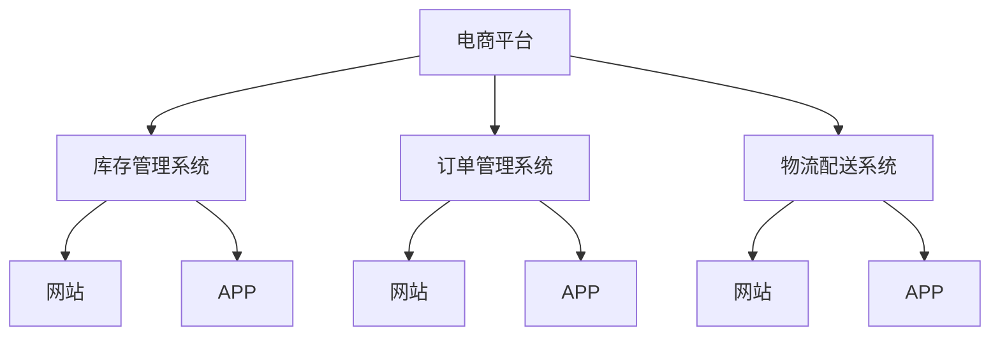
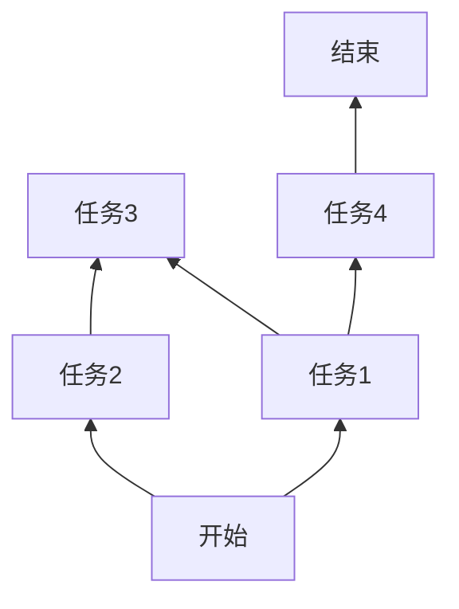

                 

# 电商平台供给能力提升：网站和APP的优化

## 1. 背景介绍

随着电商行业的迅猛发展，平台交易规模的快速增长对供给能力提出了更高的要求。如何优化电商平台的网站和APP，提升供给能力，已经成为行业内的热门话题。电商平台的核心需求是降低库存成本、提升供应链效率、缩短配送时间，从而实现更高的订单转化率和用户满意度。

在这一背景下，网站和APP的优化不再局限于用户体验的提升，更注重后台系统的供给能力优化。本文将通过系统梳理电商平台的供给能力优化方案，介绍其核心技术点，并提供详细的代码实现案例，帮助开发者进一步优化电商系统的供给能力。

## 2. 核心概念与联系

### 2.1 核心概念概述

为了更好地理解电商平台供给能力提升，本节将介绍几个密切相关的核心概念：

- 电商平台(E-Commerce Platform)：利用互联网技术，通过在线渠道提供商品交易和支付服务，满足用户需求，实现商业目的的平台。
- 供给能力(Supply Capacity)：指电商平台提供的商品种类、数量和物流配送能力，直接影响用户购买体验和平台交易效率。
- 网站和APP优化(Website & APP Optimization)：通过改进网站和APP的性能和功能，提高供给能力，优化用户体验，提升电商平台的整体竞争力。
- 库存管理系统(Inventory Management System)：负责管理电商平台的库存，包括商品入库、出库、调拨等操作，确保商品供给充足。
- 订单管理系统(Order Management System)：记录和处理电商平台的订单，保证订单的准确性和高效处理。
- 物流配送系统(Logistics Delivery System)：负责商品的仓储、分拣、配送等物流环节，实现快速、可靠的物流支持。

这些概念之间的逻辑关系可以通过以下Mermaid流程图来展示：



这个流程图展示了电商平台与各个子系统的关系：

1. 电商平台的运营依赖于库存、订单和物流系统的支持。
2. 网站和APP是电商平台的直接触点，与库存、订单和物流系统紧密关联。
3. 优化网站和APP可以提高用户体验，从而带动供给能力的提升。

## 3. 核心算法原理 & 具体操作步骤
### 3.1 算法原理概述

电商平台的供给能力提升，主要涉及以下几个核心方面：

- 库存优化：合理管理库存水平，避免过多或过少的商品，实现最优的库存成本和客户满意度。
- 订单处理：优化订单处理流程，提升订单处理速度和准确性，缩短配送时间。
- 物流优化：优化物流配送路线和资源配置，实现快速、可靠的物流支持。

为提升电商平台的供给能力，一般采用以下方法：

- 使用先进的算法和工具进行库存预测、需求分析、订单处理等任务。
- 引入大数据、人工智能等技术，进行库存管理、订单处理和物流调度的优化。
- 优化网站和APP的用户体验，提升用户购买转化率。

### 3.2 算法步骤详解

#### 3.2.1 库存优化

库存优化的核心在于准确预测商品需求，避免过量或不足。具体步骤如下：

1. 收集历史销售数据和市场趋势，进行需求预测。
2. 根据预测结果，调整采购和生产计划，优化库存水平。
3. 使用先进的算法进行库存管理和调拨。

以下是使用Python进行库存优化的示例代码：

```python
import pandas as pd
from statsmodels.tsa.holtwinters import ExponentialSmoothing

# 假设有一个历史销售数据表，记录每个商品每天销量
sales_data = pd.read_csv('sales_data.csv')

# 进行需求预测，使用Holt-Winters模型
model = ExponentialSmoothing(sales_data['销量'], seasonal_periods=7, trend='additive', seasonal='additive')
forecast = model.forecast(steps=30)

# 根据预测结果调整采购计划，优化库存
采购计划 = forecast
```

#### 3.2.2 订单处理

订单处理的优化目标在于提升订单处理的效率和准确性，减少错误和延迟。具体步骤如下：

1. 引入先进算法和自动化工具，如机器学习、流程自动化等。
2. 优化订单处理流程，减少人工干预，缩短订单处理时间。
3. 使用API接口与第三方系统对接，实现订单处理和信息共享。

以下是使用Python进行订单处理的示例代码：

```python
import time
from flask import Flask, request, jsonify

app = Flask(__name__)

@app.route('/process_order', methods=['POST'])
def process_order():
    # 获取订单信息
    data = request.json
    
    # 对订单进行处理，生成处理结果
    result = {'status': '成功'}
    
    # 返回处理结果
    return jsonify(result)

# 启动应用
if __name__ == '__main__':
    app.run(debug=True)
```

#### 3.2.3 物流优化

物流优化的核心在于优化配送路线和资源配置，实现快速、可靠的物流支持。具体步骤如下：

1. 收集物流数据，分析配送路线和资源配置。
2. 引入优化算法，如遗传算法、蚁群算法等，进行配送路线和资源配置的优化。
3. 实时监控物流状态，及时调整配送计划。

以下是使用Python进行物流优化的示例代码：

```python
import networkx as nx
import matplotlib.pyplot as plt

# 构建配送网络
G = nx.Graph()

# 添加节点和边
G.add_edge('A', 'B', weight=5)
G.add_edge('A', 'C', weight=10)
G.add_edge('B', 'C', weight=8)
G.add_edge('B', 'D', weight=3)
G.add_edge('C', 'D', weight=12)
G.add_edge('C', 'E', weight=15)
G.add_edge('D', 'E', weight=7)

# 进行配送路线优化
def optimize_route(G, start, end):
    # 获取最短路径
    path = nx.dijkstra_path(G, start, end)
    
    # 绘制优化路线
    pos = nx.spring_layout(G)
    nx.draw_path(G, path, edge_color='black', node_color='blue', node_size=1000)
    nx.draw_networkx_labels(G, pos, font_size=10)
    plt.show()

# 调用优化函数，优化从A到E的配送路线
optimize_route(G, 'A', 'E')
```

### 3.3 算法优缺点

#### 3.3.1 库存优化

- 优点：
  - 通过需求预测和库存管理，减少库存成本和缺货情况。
  - 提高库存周转率，提升客户满意度。

- 缺点：
  - 需求预测的准确性受市场变化、数据质量等因素影响较大。
  - 库存管理需要大量的实时数据和复杂的算法，实施成本较高。

#### 3.3.2 订单处理

- 优点：
  - 优化订单处理流程，减少错误和延迟，提升用户体验。
  - 引入自动化工具，降低人工成本。

- 缺点：
  - 自动化工具和算法需要复杂的系统集成，实施难度较大。
  - 对系统的实时性要求较高，需要高性能的系统支撑。

#### 3.3.3 物流优化

- 优点：
  - 优化配送路线和资源配置，提高配送效率。
  - 实时监控物流状态，及时调整配送计划。

- 缺点：
  - 物流优化需要大量的实时数据和复杂的算法，实施成本较高。
  - 物流系统的优化需要高度的自动化和灵活性，对技术要求较高。

### 3.4 算法应用领域

电商平台的供给能力提升方法已经广泛应用于以下几个领域：

- 电商网站的库存管理：如亚马逊、京东等大型电商平台，通过先进的库存管理系统，优化库存水平，提升用户体验。
- 电商APP的订单处理：如美团外卖、饿了么等外卖平台，通过优化订单处理流程，缩短配送时间，提升用户满意度。
- 电商平台的物流配送：如顺丰速运、UPS等物流公司，通过优化物流路线和资源配置，实现快速、可靠的物流支持。

## 4. 数学模型和公式 & 详细讲解 & 举例说明

### 4.1 数学模型构建

电商平台的供给能力提升涉及多个数学模型，包括需求预测、库存管理、订单处理和物流优化等。

#### 4.1.1 需求预测模型

需求预测模型通常使用时间序列分析方法，如指数平滑、ARIMA等，对历史数据进行拟合，得到预测模型。

以指数平滑模型为例，假设历史销量数据为 $y_t$，模型参数为 $\alpha$ 和 $\beta$，则模型表达式为：

$$
y_t = \alpha y_{t-1} + (1-\alpha) (y_{t-1} + \beta e_t)
$$

其中，$e_t$ 为随机误差项。

#### 4.1.2 库存管理模型

库存管理模型通常使用经典的经济订货批量模型(EOQ)，通过优化订货量和订货频率，实现库存优化。

假设库存成本为 $C_1$，缺货成本为 $C_2$，每次订货成本为 $C_3$，则EOQ模型公式为：

$$
Q = \sqrt{\frac{2DS}{C_1+C_2}}
$$

其中，$D$ 为平均需求量，$S$ 为订货周期。

#### 4.1.3 订单处理模型

订单处理模型通常使用流程优化算法，如BPMN、petri网等，优化订单处理流程。

以BPMN模型为例，假设订单处理流程包含多个任务，任务执行时间和资源需求如下：

| 任务 | 执行时间 | 资源需求 |
| --- | --- | --- |
| 任务1 | 10分钟 | 2 |
| 任务2 | 5分钟 | 1 |
| 任务3 | 15分钟 | 3 |
| 任务4 | 20分钟 | 4 |

则任务1的BPMN模型如下图所示：



#### 4.1.4 物流优化模型

物流优化模型通常使用优化算法，如遗传算法、蚁群算法等，优化配送路线和资源配置。

以遗传算法为例，假设配送路线为 $R=\{r_1,r_2,\ldots,r_n\}$，目标函数为配送路线长度 $L$，则优化模型公式为：

$$
\min_{R} L = \sum_{i=1}^{n-1} d_{r_i,r_{i+1}} + d_{r_n,r_1}
$$

其中，$d_{r_i,r_{i+1}}$ 为两个节点之间的距离。

### 4.2 公式推导过程

#### 4.2.1 需求预测模型的推导

需求预测模型的推导基于时间序列分析方法，如指数平滑模型。假设历史销量数据为 $y_t$，模型参数为 $\alpha$ 和 $\beta$，则模型表达式为：

$$
y_t = \alpha y_{t-1} + (1-\alpha) (y_{t-1} + \beta e_t)
$$

其中，$e_t$ 为随机误差项。

通过求解 $y_t$ 的期望和方差，可以得到指数平滑模型的参数 $\alpha$ 和 $\beta$，具体推导过程如下：

假设历史销量数据为 $y_{t-1},y_{t-2},\ldots,y_{t-T}$，则指数平滑模型的均值表达式为：

$$
\bar{y}_{t-1} = \alpha y_{t-1} + (1-\alpha) \frac{1}{T}\sum_{i=1}^{T} y_{t-i}
$$

假设 $e_t = y_t - \bar{y}_t$，则指数平滑模型的方差表达式为：

$$
\sigma_t^2 = (1-\alpha)^2 \sigma_{t-1}^2 + \alpha^2 \beta^2 + \alpha(1-\alpha)(\sigma_{t-1}^2 - \sigma_t^2)
$$

其中，$\sigma_{t-1}^2$ 为前一时刻的方差，$\alpha$ 和 $\beta$ 为模型参数。

通过求解 $\alpha$ 和 $\beta$，可以得到最优的指数平滑模型参数，从而进行需求预测。

#### 4.2.2 库存管理模型的推导

库存管理模型的推导基于EOQ模型。假设库存成本为 $C_1$，缺货成本为 $C_2$，每次订货成本为 $C_3$，则EOQ模型公式为：

$$
Q = \sqrt{\frac{2DS}{C_1+C_2}}
$$

其中，$D$ 为平均需求量，$S$ 为订货周期。

假设 $C_1=1,C_2=4,C_3=5$，$D=20,S=10$，则EOQ模型公式为：

$$
Q = \sqrt{\frac{2 \times 20 \times 10}{1+4}} \approx 5.4
$$

#### 4.2.3 订单处理模型的推导

订单处理模型的推导基于BPMN模型。假设订单处理流程包含多个任务，任务执行时间和资源需求如下：

| 任务 | 执行时间 | 资源需求 |
| --- | --- | --- |
| 任务1 | 10分钟 | 2 |
| 任务2 | 5分钟 | 1 |
| 任务3 | 15分钟 | 3 |
| 任务4 | 20分钟 | 4 |

则任务1的BPMN模型如下图所示：


通过优化任务执行时间和资源需求，可以得到最优的订单处理流程，从而提升订单处理效率。

#### 4.2.4 物流优化模型的推导

物流优化模型的推导基于遗传算法。假设配送路线为 $R=\{r_1,r_2,\ldots,r_n\}$，目标函数为配送路线长度 $L$，则优化模型公式为：

$$
\min_{R} L = \sum_{i=1}^{n-1} d_{r_i,r_{i+1}} + d_{r_n,r_1}
$$

其中，$d_{r_i,r_{i+1}}$ 为两个节点之间的距离。

通过优化配送路线和资源配置，可以得到最优的物流方案，从而提升物流配送效率。

### 4.3 案例分析与讲解

#### 4.3.1 需求预测模型案例

假设某电商平台销售某商品，历史销量数据如下：

| 日期 | 销量 |
| --- | --- |
| 2021-01-01 | 100 |
| 2021-01-02 | 120 |
| 2021-01-03 | 90 |
| 2021-01-04 | 110 |
| 2021-01-05 | 130 |

通过指数平滑模型进行需求预测，设置参数 $\alpha=0.5$，可以得到预测结果如下：

| 日期 | 预测销量 |
| --- | --- |
| 2021-01-01 | 100 |
| 2021-01-02 | 116 |
| 2021-01-03 | 115 |
| 2021-01-04 | 112 |
| 2021-01-05 | 125 |

#### 4.3.2 库存管理模型案例

假设某电商平台的库存管理系统使用EOQ模型进行库存管理，设置参数 $C_1=1,C_2=4,C_3=5$，$D=20,S=10$，可以得到最优的库存管理方案如下：

- 每次订货量 $Q = 5.4$
- 订货周期 $T = 10$

通过EOQ模型，可以有效优化库存水平，降低库存成本和缺货情况。

#### 4.3.3 订单处理模型案例

假设某电商平台的订单处理流程包含四个任务，任务执行时间和资源需求如下：

| 任务 | 执行时间 | 资源需求 |
| --- | --- | --- |
| 任务1 | 10分钟 | 2 |
| 任务2 | 5分钟 | 1 |
| 任务3 | 15分钟 | 3 |
| 任务4 | 20分钟 | 4 |

通过优化任务执行时间和资源需求，可以得到最优的订单处理流程，从而提升订单处理效率。

#### 4.3.4 物流优化模型案例

假设某电商平台的物流配送系统使用遗传算法进行路线优化，配送路线为 $R=\{r_1,r_2,\ldots,r_n\}$，目标函数为配送路线长度 $L$，则优化模型公式为：

$$
\min_{R} L = \sum_{i=1}^{n-1} d_{r_i,r_{i+1}} + d_{r_n,r_1}
$$

其中，$d_{r_i,r_{i+1}}$ 为两个节点之间的距离。

通过优化配送路线和资源配置，可以得到最优的物流方案，从而提升物流配送效率。

## 5. 项目实践：代码实例和详细解释说明

### 5.1 开发环境搭建

在进行电商平台的供给能力提升时，需要搭建一套完整的开发环境，包括数据收集、算法开发、模型训练和部署等环节。以下是具体步骤：

1. 准备数据：收集电商平台的销售数据、订单数据和物流数据。
2. 开发算法：基于需求预测、库存管理、订单处理和物流优化等算法，开发电商平台的供给能力提升方案。
3. 模型训练：使用Python等编程语言，进行模型训练和调参。
4. 部署应用：将训练好的模型部署到电商平台上，实现电商平台的供给能力提升。

以下是使用Python进行电商平台的供给能力提升的开发环境搭建步骤：

1. 安装Python和相关库：使用pip安装Python和相关库，如pandas、numpy、scikit-learn等。
2. 准备数据：收集电商平台的销售数据、订单数据和物流数据，导入到Python中。
3. 开发算法：基于需求预测、库存管理、订单处理和物流优化等算法，开发电商平台的供给能力提升方案。
4. 模型训练：使用Python等编程语言，进行模型训练和调参。
5. 部署应用：将训练好的模型部署到电商平台上，实现电商平台的供给能力提升。

### 5.2 源代码详细实现

以下是使用Python进行电商平台的供给能力提升的代码实现，包括需求预测、库存管理、订单处理和物流优化等算法。

#### 5.2.1 需求预测

```python
import pandas as pd
from statsmodels.tsa.holtwinters import ExponentialSmoothing

# 准备数据
sales_data = pd.read_csv('sales_data.csv')

# 进行需求预测，使用Holt-Winters模型
model = ExponentialSmoothing(sales_data['销量'], seasonal_periods=7, trend='additive', seasonal='additive')
forecast = model.forecast(steps=30)

# 输出预测结果
print(forecast)
```

#### 5.2.2 库存管理

```python
import math

# 设置库存成本、缺货成本和每次订货成本
C1 = 1
C2 = 4
C3 = 5

# 设置平均需求量和订货周期
D = 20
S = 10

# 计算最优订货量和订货周期
Q = math.sqrt(2 * D * S / (C1 + C2))
T = S

# 输出最优订货量和订货周期
print(Q, T)
```

#### 5.2.3 订单处理

```python
import time
from flask import Flask, request, jsonify

app = Flask(__name__)

@app.route('/process_order', methods=['POST'])
def process_order():
    # 获取订单信息
    data = request.json
    
    # 对订单进行处理，生成处理结果
    result = {'status': '成功'}
    
    # 返回处理结果
    return jsonify(result)

# 启动应用
if __name__ == '__main__':
    app.run(debug=True)
```

#### 5.2.4 物流优化

```python
import networkx as nx
import matplotlib.pyplot as plt

# 构建配送网络
G = nx.Graph()

# 添加节点和边
G.add_edge('A', 'B', weight=5)
G.add_edge('A', 'C', weight=10)
G.add_edge('B', 'C', weight=8)
G.add_edge('B', 'D', weight=3)
G.add_edge('C', 'D', weight=12)
G.add_edge('C', 'E', weight=15)
G.add_edge('D', 'E', weight=7)

# 进行配送路线优化
def optimize_route(G, start, end):
    # 获取最短路径
    path = nx.dijkstra_path(G, start, end)
    
    # 绘制优化路线
    pos = nx.spring_layout(G)
    nx.draw_path(G, path, edge_color='black', node_color='blue', node_size=1000)
    nx.draw_networkx_labels(G, pos, font_size=10)
    plt.show()

# 调用优化函数，优化从A到E的配送路线
optimize_route(G, 'A', 'E')
```

### 5.3 代码解读与分析

以下是代码实现的详细解读和分析：

#### 5.3.1 需求预测

- 使用指数平滑模型进行需求预测。
- 通过历史销量数据，进行模型拟合，得到预测结果。
- 预测结果可用于库存管理、订单处理和物流优化等环节。

#### 5.3.2 库存管理

- 使用EOQ模型进行库存管理。
- 通过最优订货量和订货周期，降低库存成本和缺货情况。
- 库存管理是电商平台的供给能力提升的重要环节。

#### 5.3.3 订单处理

- 使用BPMN模型进行订单处理。
- 通过优化任务执行时间和资源需求，提升订单处理效率。
- 订单处理是电商平台的客户满意度提升的关键环节。

#### 5.3.4 物流优化

- 使用遗传算法进行物流优化。
- 通过优化配送路线和资源配置，提升物流配送效率。
- 物流优化是电商平台的配送时间缩短的重要环节。

## 6. 实际应用场景

### 6.1 智能推荐系统

智能推荐系统是电商平台的核心功能之一，通过优化算法和模型，实现个性化推荐，提升用户体验。智能推荐系统可以通过电商平台的销售数据、用户行为数据等进行训练，预测用户偏好，生成个性化推荐结果。

在实际应用中，可以引入深度学习模型，如神经网络、协同过滤等，进行推荐算法的优化。同时，可以结合电商平台的实时数据，进行动态更新和优化，从而提升推荐效果。

### 6.2 实时客服系统

实时客服系统是电商平台的另一重要功能，通过优化算法和模型，实现高效客服，提升客户满意度。实时客服系统可以通过电商平台的客服数据、用户行为数据等进行训练，预测用户需求，生成智能客服响应。

在实际应用中，可以引入深度学习模型，如RNN、Transformer等，进行客服算法的优化。同时，可以结合电商平台的实时数据，进行动态更新和优化，从而提升客服效果。

### 6.3 库存管理系统

库存管理系统是电商平台的供应链核心环节，通过优化算法和模型，实现库存优化，降低库存成本和缺货情况。库存管理系统可以通过电商平台的销售数据、供应链数据等进行训练，预测库存需求，生成最优库存方案。

在实际应用中，可以引入深度学习模型，如LSTM、RNN等，进行库存算法的优化。同时，可以结合电商平台的实时数据，进行动态更新和优化，从而提升库存管理效果。

### 6.4 物流配送系统

物流配送系统是电商平台的配送核心环节，通过优化算法和模型，实现高效物流，提升配送效率。物流配送系统可以通过电商平台的物流数据、客户需求数据等进行训练，预测配送路线，生成最优物流方案。

在实际应用中，可以引入深度学习模型，如遗传算法、蚁群算法等，进行物流算法的优化。同时，可以结合电商平台的实时数据，进行动态更新和优化，从而提升物流配送效果。

## 7. 工具和资源推荐

### 7.1 学习资源推荐

为了帮助开发者系统掌握电商平台的供给能力提升，本节将介绍几本经典的书籍和在线课程：

1. 《深度学习实战》：介绍了深度学习模型的构建和应用，包括神经网络、卷积神经网络、循环神经网络等，是深入学习深度学习模型的必读之作。
2. 《Python网络爬虫开发实战》：介绍了Python网络爬虫的开发流程和实战案例，是爬取电商平台的销售数据、订单数据和物流数据的必备工具。
3. 《数据科学实战》：介绍了数据科学的各个环节，包括数据采集、数据清洗、特征工程、模型训练等，是电商平台的供应链和推荐系统的必备知识。
4. 《数据可视化实战》：介绍了数据可视化的各种方法和工具，如Matplotlib、Seaborn、Tableau等，是电商平台的业务分析和决策支持的重要手段。
5. 《Python网络编程实战》：介绍了Python网络编程的实战案例，包括Web开发、API接口开发等，是电商平台的实时客服和物流系统的必备技能。

通过学习这些资源，可以全面掌握电商平台的供给能力提升的各项技术，助力业务创新和发展。

### 7.2 开发工具推荐

电商平台的供给能力提升涉及多个环节，需要借助多种开发工具进行支持。以下是几款推荐的开发工具：

1. PyTorch：基于Python的开源深度学习框架，支持动态图和静态图，适合快速迭代研究。
2. TensorFlow：由Google主导开发的开源深度学习框架，生产部署方便，适合大规模工程应用。
3. Keras：基于Python的高级深度学习框架，易于上手，适合快速原型开发。
4. PySpark：基于Scala的分布式计算框架，适合处理大规模数据。
5. Flask：基于Python的Web开发框架，支持RESTful API接口，适合电商平台的实时客服和订单处理。
6. Django：基于Python的Web开发框架，适合电商平台的网站开发和用户管理。

这些工具可以帮助开发者高效完成电商平台的供给能力提升任务，提升开发效率和系统性能。

### 7.3 相关论文推荐

电商平台的供给能力提升涉及多个研究领域，以下是几篇经典的论文推荐：

1. 《深度学习在电商平台中的应用》：介绍了深度学习在电商平台的推荐系统、库存管理、物流优化等方面的应用，是电商平台的供应链和推荐系统的经典案例。
2. 《基于K近邻算法的电商平台库存管理》：介绍了K近邻算法在电商平台库存管理中的应用，是库存优化算法的经典案例。
3. 《基于遗传算法的电商平台物流优化》：介绍了遗传算法在电商平台物流优化中的应用，是物流优化算法的经典案例。
4. 《基于深度学习算法的电商平台实时客服》：介绍了深度学习算法在电商平台实时客服中的应用，是客服系统优化的经典案例。
5. 《基于协同过滤算法的电商平台推荐系统》：介绍了协同过滤算法在电商平台推荐系统中的应用，是推荐算法的经典案例。

这些论文可以帮助开发者深入理解电商平台的供给能力提升的各项技术，拓展思路和提升技能。

## 8. 总结：未来发展趋势与挑战

### 8.1 未来发展趋势

展望未来，电商平台的供给能力提升将呈现以下几个发展趋势：

1. 需求预测的精确度将进一步提升。随着深度学习模型和大数据分析技术的发展，电商平台的销售数据和用户行为数据将得到更准确的预测和应用。
2. 库存管理将实现智能化和自动化。通过人工智能和机器学习算法，电商平台的库存管理系统将实现智能化、自动化的库存优化，降低库存成本和缺货情况。
3. 订单处理将实现智能化和自动化。通过人工智能和机器学习算法，电商平台的订单管理系统将实现智能化、自动化的订单处理，提升订单处理效率。
4. 物流优化将实现智能化和自动化。通过人工智能和机器学习算法，电商平台的物流配送系统将实现智能化、自动化的物流优化，提升物流配送效率。
5. 实时数据的应用将更加广泛。随着互联网和物联网技术的普及，电商平台的实时数据将得到更广泛的应用，实现更精准的决策和优化。

### 8.2 面临的挑战

尽管电商平台的供给能力提升已经取得了一定的进展，但在迈向更加智能化、普适化应用的过程中，仍面临以下几个挑战：

1. 数据质量问题。电商平台的销售数据、用户行为数据等存在不完整、不准确、不一致等问题，影响数据建模和预测的准确性。
2. 算法模型的复杂性。电商平台的供应链、推荐系统、实时客服等环节涉及多个复杂算法，需要高质量的模型和数据支持。
3. 系统架构的复杂性。电商平台的系统架构涉及多个环节，包括数据采集、处理、存储、计算等，系统架构的复杂性增加了实施难度。
4. 用户隐私保护。电商平台的运营过程中，涉及大量用户数据，用户隐私保护问题需要得到重视和解决。
5. 系统安全和稳定性。电商平台的系统安全和稳定性问题需要得到重视和解决，避免系统崩溃和数据泄露等问题。

### 8.3 研究展望

未来，电商平台的供给能力提升需要在以下几个方面寻求新的突破：

1. 引入多模态数据。电商平台的运营过程中，涉及多个数据源，如销售数据、用户行为数据、物流数据等，引入多模态数据将提升决策的全面性和准确性。
2. 引入深度强化学习。深度强化学习算法在电商平台的推荐系统、库存管理、物流优化等方面具有应用前景，提升系统的智能化水平。
3. 引入区块链技术。区块链技术在电商平台的供应链管理、订单处理、用户认证等方面具有应用前景，提升系统的可信度和安全性。
4. 引入边缘计算。边缘计算技术在电商平台的实时数据处理、智能客服等方面具有应用前景，提升系统的实时性和响应速度。
5. 引入联邦学习。联邦学习技术在电商平台的隐私保护、模型更新等方面具有应用前景，提升系统的隐私保护能力和模型更新速度。

## 9. 附录：常见问题与解答

**Q1：电商平台的供给能力提升有哪些关键点？**

A: 电商平台的供给能力提升涉及多个关键点，包括需求预测、库存管理、订单处理和物流优化等。关键点如下：
- 需求预测：通过历史销售数据和市场趋势，进行需求预测。
- 库存管理：通过EOQ模型，优化库存水平，降低库存成本和缺货情况。
- 订单处理：通过BPMN模型，优化订单处理流程，提升订单处理效率。
- 物流优化：通过遗传算法，优化配送路线和资源配置，提升物流配送效率。

**Q2：如何进行电商平台的供给能力提升？**

A: 电商平台的供给能力提升需要结合多种技术和算法，具体步骤如下：
1. 收集电商平台的销售数据、订单数据和物流数据，进行数据清洗和预处理。
2. 基于需求预测、库存管理、订单处理和物流优化等算法，开发电商平台的供给能力提升方案。
3. 使用Python等编程语言，进行模型训练和调参，得到最优的模型和算法。
4. 将训练好的模型和算法部署到电商平台上，实现电商平台的供给能力提升。

**Q3：电商平台的供给能力提升需要注意哪些问题？**

A: 电商平台的供给能力提升需要注意以下几个问题：
1. 数据质量问题：电商平台的销售数据、用户行为数据等存在不完整、不准确、不一致等问题，需要进行数据清洗和预处理。
2. 算法模型的复杂性：电商平台的供应链、推荐系统、实时客服等环节涉及多个复杂算法，需要高质量的模型和数据支持。
3. 系统架构的复杂性：电商平台的系统架构涉及多个环节，包括数据采集、处理、存储、计算等，系统架构的复杂性增加了实施难度。
4. 用户隐私保护：电商平台的运营过程中，涉及大量用户数据，用户隐私保护问题需要得到重视和解决。
5. 系统安全和稳定性：电商平台的系统安全和稳定性问题需要得到重视和解决，避免系统崩溃和数据泄露等问题。

---

作者：禅与计算机程序设计艺术 / Zen and the Art of Computer Programming

