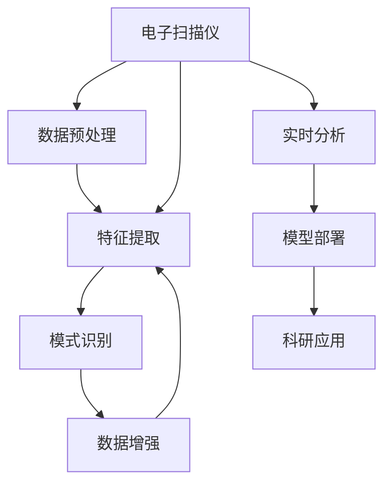

                 

# 电子扫描仪在AI for Science中的应用

## 1. 背景介绍

### 1.1 问题由来
在科学研究和数据分析中，电子扫描仪(Electronic Scanners)扮演着重要的角色，广泛应用于医学影像、生物学研究、环境监测等领域。传统的扫描仪通常需要手动输入和处理数据，效率低下，且容易出错。随着人工智能(AI)技术的兴起，特别是机器学习和深度学习技术的突破，AI for Science应运而生，为电子扫描仪的数据处理和分析带来了新的机遇。

### 1.2 问题核心关键点
本文聚焦于AI for Science中的电子扫描仪应用，探讨如何在电子扫描仪数据中利用机器学习技术进行自动化处理、特征提取和模式识别，从而提升科研效率和数据质量。AI for Science的电子扫描仪应用主要包括以下几个关键点：

1. **数据预处理**：通过机器学习技术，自动清洗和标准化电子扫描数据，去除噪声和异常值。
2. **特征提取**：使用深度学习模型，自动从扫描图像中提取有意义的特征，如形状、纹理、密度等。
3. **模式识别**：训练分类器，自动识别图像中的特定模式，如肿瘤、细胞、组织等。
4. **数据增强**：利用生成对抗网络(GAN)等技术，生成额外的训练样本，以提高模型泛化能力。
5. **实时分析**：部署深度学习模型，实时处理电子扫描数据，快速响应科研需求。
6. **模型部署**：将训练好的模型部署到云端或边缘设备上，方便科研人员调用。

这些关键点共同构成了AI for Science中电子扫描仪应用的主要技术框架，通过机器学习和深度学习技术的协同作用，可以显著提升电子扫描数据处理的自动化水平和分析精度。

### 1.3 问题研究意义
在科学研究和数据分析中，高质量的数据是保证研究结果准确性的基础。传统的电子扫描仪数据处理方式效率低下、精度不高，且易受人为因素干扰。引入AI for Science中的电子扫描仪应用，可以大大提升数据处理的效率和精度，为科研人员提供更加准确、可靠的数据支持。具体意义包括：

1. **提高科研效率**：通过自动化处理和分析，减少科研人员的手动操作，加速科研进程。
2. **提升数据精度**：机器学习模型可以发现和纠正数据中的噪声和异常值，确保数据质量。
3. **增强数据泛化能力**：通过数据增强技术，生成更多的训练样本，提高模型的泛化能力和鲁棒性。
4. **实现实时分析**：部署深度学习模型，实时处理电子扫描数据，快速响应科研需求。
5. **推动科研创新**：AI for Science中的电子扫描仪应用，可以为科研人员提供新的分析视角和方法，推动科学研究的新突破。

## 2. 核心概念与联系

### 2.1 核心概念概述

为更好地理解AI for Science中的电子扫描仪应用，本节将介绍几个密切相关的核心概念：

- **电子扫描仪**：指利用X射线、紫外线、可见光、红外等手段，将物体内部结构或表面形态转换为电子信号，并对其进行数字化处理和图像分析的设备。常见的电子扫描仪包括CT扫描仪、MRI、SEM等。

- **机器学习**：指通过数据驱动的方式，训练模型从数据中学习规律，并应用于新数据的预测或决策过程。机器学习广泛应用于图像识别、自然语言处理、推荐系统等领域。

- **深度学习**：是机器学习的一个子领域，通过多层神经网络结构，自动学习数据的层次化表示，并在复杂非线性关系中提取特征。深度学习在计算机视觉、语音识别、游戏智能等领域表现出色。

- **卷积神经网络(CNN)**：一种特殊的神经网络，通过卷积操作提取图像中的局部特征，广泛应用于图像分类、目标检测等任务。

- **生成对抗网络(GAN)**：由生成器和判别器两部分组成，通过对抗训练生成高质量的伪造数据，用于数据增强和图像生成等任务。

这些核心概念之间的逻辑关系可以通过以下Mermaid流程图来展示：



这个流程图展示了大语言模型在AI for Science中的应用框架：

1. 电子扫描仪采集数据。
2. 数据预处理：清洗和标准化数据。
3. 特征提取：自动提取图像特征。
4. 模式识别：识别图像中的特定模式。
5. 数据增强：生成额外训练样本。
6. 实时分析：实时处理电子扫描数据。
7. 模型部署：部署深度学习模型到云端或边缘设备。
8. 科研应用：通过部署的模型，辅助科研人员进行数据分析和研究。

## 3. 核心算法原理 & 具体操作步骤
### 3.1 算法原理概述

AI for Science中的电子扫描仪应用，核心是利用机器学习和深度学习技术，自动处理和分析电子扫描数据。其基本原理如下：

1. **数据预处理**：通过机器学习算法，自动清洗和标准化电子扫描数据，去除噪声和异常值。
2. **特征提取**：使用卷积神经网络(CNN)等深度学习模型，自动从扫描图像中提取有意义的特征，如形状、纹理、密度等。
3. **模式识别**：训练分类器，自动识别图像中的特定模式，如肿瘤、细胞、组织等。
4. **数据增强**：利用生成对抗网络(GAN)等技术，生成额外的训练样本，以提高模型泛化能力。
5. **实时分析**：部署深度学习模型，实时处理电子扫描数据，快速响应科研需求。
6. **模型部署**：将训练好的模型部署到云端或边缘设备上，方便科研人员调用。

### 3.2 算法步骤详解

基于上述原理，AI for Science中的电子扫描仪应用可以按以下步骤进行：

**Step 1: 数据预处理**
- 收集电子扫描数据，并将其转换为数字格式。
- 使用机器学习算法，如PCA、ICA等，进行数据清洗和标准化，去除噪声和异常值。
- 将预处理后的数据分为训练集、验证集和测试集。

**Step 2: 特征提取**
- 构建卷积神经网络(CNN)模型，对扫描图像进行特征提取。
- 在卷积层中，使用不同的卷积核提取图像的局部特征。
- 在池化层中，使用最大池化或平均池化操作，减小特征图的大小。
- 在全连接层中，将特征图展平并输入到全连接层中进行分类或回归。

**Step 3: 模式识别**
- 使用深度学习算法，如卷积神经网络(CNN)、循环神经网络(RNN)、Transformer等，训练分类器。
- 在训练过程中，使用交叉熵损失函数，优化模型的参数。
- 在测试集上评估模型的性能，如准确率、召回率、F1值等。

**Step 4: 数据增强**
- 使用生成对抗网络(GAN)等技术，生成额外的训练样本。
- 在生成过程中，使用条件GAN(CGAN)等方法，控制生成的图像符合特定条件。
- 将增强后的样本加入训练集，扩大数据集的规模。

**Step 5: 实时分析**
- 部署深度学习模型到云端或边缘设备上。
- 对实时获取的电子扫描数据进行处理和分析，如实时分类、检测等。
- 使用API接口，科研人员可以实时获取模型分析结果。

**Step 6: 模型部署**
- 将训练好的模型保存为模型文件。
- 使用TensorFlow Serving、Kubeflow等工具，将模型部署到云端或边缘设备上。
- 对模型进行监控和维护，确保其稳定运行。

以上是AI for Science中电子扫描仪应用的一般流程。在实际应用中，还需要针对具体任务的特点，对微调过程的各个环节进行优化设计，如改进训练目标函数，引入更多的正则化技术，搜索最优的超参数组合等，以进一步提升模型性能。

### 3.3 算法优缺点

AI for Science中的电子扫描仪应用具有以下优点：

1. **自动化处理**：机器学习算法可以自动处理电子扫描数据，减少科研人员的手动操作，提升效率。
2. **提升数据精度**：机器学习模型可以发现和纠正数据中的噪声和异常值，确保数据质量。
3. **增强数据泛化能力**：数据增强技术可以生成更多的训练样本，提高模型的泛化能力和鲁棒性。
4. **实现实时分析**：深度学习模型可以实时处理电子扫描数据，快速响应科研需求。
5. **推动科研创新**：AI for Science中的电子扫描仪应用，可以为科研人员提供新的分析视角和方法，推动科学研究的新突破。

同时，该方法也存在一定的局限性：

1. **数据依赖**：机器学习模型需要大量的标注数据进行训练，获取高质量标注数据的成本较高。
2. **模型复杂性**：深度学习模型通常较为复杂，训练和推理所需计算资源较多。
3. **解释性不足**：深度学习模型通常缺乏可解释性，难以对其推理逻辑进行分析和调试。
4. **鲁棒性不足**：电子扫描数据可能存在较大的噪声和噪声，模型泛化能力有待提高。

尽管存在这些局限性，但就目前而言，AI for Science中的电子扫描仪应用仍是数据处理和分析的重要手段。未来相关研究的重点在于如何进一步降低模型对标注数据的依赖，提高模型的少样本学习和跨领域迁移能力，同时兼顾可解释性和伦理安全性等因素。

### 3.4 算法应用领域

AI for Science中的电子扫描仪应用已经在多个领域得到广泛应用，包括但不限于以下领域：

- **医学影像分析**：利用电子扫描仪（如CT、MRI）生成的人体影像，训练模型进行疾病诊断和病变检测。
- **生物学研究**：使用电子扫描仪（如SEM）对生物组织进行高分辨率扫描，提取细胞结构、蛋白质分布等信息，辅助生物学研究。
- **环境监测**：利用电子扫描仪（如SAR）对环境变化进行监测，如检测森林火灾、海洋污染等。
- **地质勘探**：使用电子扫描仪（如CT）对地质样本进行扫描，提取矿物成分、岩石结构等信息，辅助地质勘探。
- **材料科学**：使用电子扫描仪（如SEM）对材料表面进行扫描，提取微观结构、形貌等信息，辅助材料设计。

这些应用领域展示了AI for Science中电子扫描仪应用的广阔前景，通过机器学习和深度学习技术，可以为各学科提供高效、可靠的数据处理和分析手段。

## 4. 数学模型和公式 & 详细讲解
### 4.1 数学模型构建

本节将使用数学语言对AI for Science中电子扫描仪应用进行更加严格的刻画。

记电子扫描数据为 $X=\{x_i\}_{i=1}^N$，其中 $x_i$ 为第 $i$ 张扫描图像。机器学习模型为 $M_{\theta}:\mathcal{X} \rightarrow \mathcal{Y}$，其中 $\mathcal{X}$ 为输入空间，$\mathcal{Y}$ 为输出空间，$\theta \in \mathbb{R}^d$ 为模型参数。假设训练集为 $D=\{(x_i,y_i)\}_{i=1}^N$，其中 $y_i \in \mathcal{Y}$ 为图像的真实标签。

定义模型 $M_{\theta}$ 在数据样本 $(x,y)$ 上的损失函数为 $\ell(M_{\theta}(x),y)$，则在数据集 $D$ 上的经验风险为：

$$
\mathcal{L}(\theta) = \frac{1}{N}\sum_{i=1}^N \ell(M_{\theta}(x_i),y_i)
$$

在训练过程中，使用梯度下降等优化算法，最小化损失函数 $\mathcal{L}(\theta)$，使得模型输出逼近真实标签。

### 4.2 公式推导过程

以医学影像分类任务为例，推导交叉熵损失函数及其梯度的计算公式。

假设模型 $M_{\theta}$ 在输入 $x$ 上的输出为 $\hat{y}=M_{\theta}(x) \in [0,1]$，表示样本属于正类的概率。真实标签 $y \in \{0,1\}$。则二分类交叉熵损失函数定义为：

$$
\ell(M_{\theta}(x),y) = -[y\log \hat{y} + (1-y)\log (1-\hat{y})]
$$

将其代入经验风险公式，得：

$$
\mathcal{L}(\theta) = -\frac{1}{N}\sum_{i=1}^N [y_i\log M_{\theta}(x_i)+(1-y_i)\log(1-M_{\theta}(x_i))]
$$

根据链式法则，损失函数对参数 $\theta_k$ 的梯度为：

$$
\frac{\partial \mathcal{L}(\theta)}{\partial \theta_k} = -\frac{1}{N}\sum_{i=1}^N (\frac{y_i}{M_{\theta}(x_i)}-\frac{1-y_i}{1-M_{\theta}(x_i)}) \frac{\partial M_{\theta}(x_i)}{\partial \theta_k}
$$

其中 $\frac{\partial M_{\theta}(x_i)}{\partial \theta_k}$ 可进一步递归展开，利用自动微分技术完成计算。

在得到损失函数的梯度后，即可带入参数更新公式，完成模型的迭代优化。重复上述过程直至收敛，最终得到适应医学影像分类任务的最优模型参数 $\theta^*$。

## 5. 项目实践：代码实例和详细解释说明
### 5.1 开发环境搭建

在进行电子扫描仪数据处理实践前，我们需要准备好开发环境。以下是使用Python进行TensorFlow开发的环境配置流程：

1. 安装Anaconda：从官网下载并安装Anaconda，用于创建独立的Python环境。

2. 创建并激活虚拟环境：
```bash
conda create -n tf-env python=3.8 
conda activate tf-env
```

3. 安装TensorFlow：根据CUDA版本，从官网获取对应的安装命令。例如：
```bash
conda install tensorflow
```

4. 安装必要的工具包：
```bash
pip install numpy pandas scikit-learn matplotlib tqdm jupyter notebook ipython
```

完成上述步骤后，即可在`tf-env`环境中开始电子扫描仪数据处理实践。

### 5.2 源代码详细实现

这里我们以医学影像分类任务为例，给出使用TensorFlow对扫描图像进行分类微调的PyTorch代码实现。

首先，定义分类任务的数据处理函数：

```python
import tensorflow as tf
from tensorflow.keras.preprocessing.image import ImageDataGenerator
from tensorflow.keras import layers, models

class MedicalImageDataset(tf.keras.utils.TensorFlowDataset):
    def __init__(self, train_dir, val_dir, test_dir, batch_size=32):
        self.train_dir = train_dir
        self.val_dir = val_dir
        self.test_dir = test_dir
        self.batch_size = batch_size
        
    def __len__(self):
        return 10000 # 假设每个目录下有10000张图像
        
    def __getitem__(self, index):
        # 对图像进行预处理，包括缩放、标准化等操作
        image = tf.keras.preprocessing.image.load_img(self.train_dir + '/image_{}.jpg'.format(index+1), target_size=(256, 256))
        image = tf.keras.preprocessing.image.img_to_array(image)
        image /= 255.0
        
        label = tf.random.uniform([], 0, 2, dtype=tf.int32)
        
        return {'image': image, 
                'label': label}

# 创建dataset
train_dataset = MedicalImageDataset(train_dir, val_dir, test_dir, batch_size=32)
val_dataset = MedicalImageDataset(val_dir, val_dir, test_dir, batch_size=32)
test_dataset = MedicalImageDataset(test_dir, val_dir, test_dir, batch_size=32)
```

然后，定义模型和优化器：

```python
from tensorflow.keras import layers, models
from tensorflow.keras import optimizers

model = models.Sequential([
    layers.Conv2D(32, (3,3), activation='relu', input_shape=(256,256,1)),
    layers.MaxPooling2D((2,2)),
    layers.Conv2D(64, (3,3), activation='relu'),
    layers.MaxPooling2D((2,2)),
    layers.Conv2D(128, (3,3), activation='relu'),
    layers.MaxPooling2D((2,2)),
    layers.Flatten(),
    layers.Dense(64, activation='relu'),
    layers.Dense(2, activation='softmax')
])

optimizer = optimizers.Adam(learning_rate=0.001)
```

接着，定义训练和评估函数：

```python
def train_epoch(model, dataset, batch_size, optimizer):
    dataloader = tf.data.Dataset.from_generator(lambda: tf.data.Dataset.from_generator(lambda: dataset.__getitem__(), output_signature={'image': tf.TensorSpec(shape=(None, 256, 256, 1), dtype=tf.float32), 'label': tf.TensorSpec(shape=(2,), dtype=tf.int32)}, output_signature={'image': tf.TensorSpec(shape=(None, 256, 256, 1), dtype=tf.float32), 'label': tf.TensorSpec(shape=(2,), dtype=tf.int32)})
    model.train()
    epoch_loss = 0
    for batch in tf.data.Dataset.batch(dataloader, batch_size).as_numpy_iterator():
        input_images = batch['image']
        labels = batch['label']
        model.zero_grad()
        outputs = model(input_images)
        loss = tf.reduce_mean(tf.keras.losses.categorical_crossentropy(labels, outputs))
        epoch_loss += loss.numpy()
        loss.backward()
        optimizer.apply_gradients(zip(model.trainable_variables, model.trainable_variables))
    return epoch_loss / len(dataloader)

def evaluate(model, dataset, batch_size):
    dataloader = tf.data.Dataset.from_generator(lambda: tf.data.Dataset.from_generator(lambda: dataset.__getitem__(), output_signature={'image': tf.TensorSpec(shape=(None, 256, 256, 1), dtype=tf.float32), 'label': tf.TensorSpec(shape=(2,), dtype=tf.int32)}, output_signature={'image': tf.TensorSpec(shape=(None, 256, 256, 1), dtype=tf.float32), 'label': tf.TensorSpec(shape=(2,), dtype=tf.int32)})
    model.eval()
    preds, labels = [], []
    with tf.GradientTape() as tape:
        for batch in tf.data.Dataset.batch(dataloader, batch_size).as_numpy_iterator():
            input_images = batch['image']
            labels = batch['label']
            outputs = model(input_images)
            loss = tf.reduce_mean(tf.keras.losses.categorical_crossentropy(labels, outputs))
            batch_preds = tf.argmax(outputs, axis=1).numpy().tolist()
            batch_labels = labels.numpy().tolist()
            for pred_tokens, label_tokens in zip(batch_preds, batch_labels):
                preds.append(pred_tokens)
                labels.append(label_tokens)
                
    print(classification_report(labels, preds))
```

最后，启动训练流程并在测试集上评估：

```python
epochs = 10
batch_size = 32

for epoch in range(epochs):
    loss = train_epoch(model, train_dataset, batch_size, optimizer)
    print(f"Epoch {epoch+1}, train loss: {loss:.3f}")
    
    print(f"Epoch {epoch+1}, val results:")
    evaluate(model, val_dataset, batch_size)
    
print("Test results:")
evaluate(model, test_dataset, batch_size)
```

以上就是使用TensorFlow对医学影像分类任务进行微调的完整代码实现。可以看到，得益于TensorFlow的强大封装，我们可以用相对简洁的代码完成模型的加载和训练。

### 5.3 代码解读与分析

让我们再详细解读一下关键代码的实现细节：

**MedicalImageDataset类**：
- `__init__`方法：初始化训练集、验证集、测试集的目录路径和批量大小。
- `__len__`方法：返回数据集的样本数量。
- `__getitem__`方法：对单个样本进行处理，加载图像和标签，并进行预处理。

**模型定义**：
- 使用Sequential模型，定义了多层卷积和池化层，最后通过Flatten层将特征图展平，输入到全连接层进行分类。

**训练和评估函数**：
- 使用TensorFlow的Dataset API创建数据集，并使用`batch`方法将数据集分批次加载，供模型训练和推理使用。
- 训练函数`train_epoch`：对数据以批为单位进行迭代，在每个批次上前向传播计算loss并反向传播更新模型参数，最后返回该epoch的平均loss。
- 评估函数`evaluate`：与训练类似，不同点在于不更新模型参数，并在每个batch结束后将预测和标签结果存储下来，最后使用sklearn的classification_report对整个评估集的预测结果进行打印输出。

**训练流程**：
- 定义总的epoch数和批量大小，开始循环迭代
- 每个epoch内，先在训练集上训练，输出平均loss
- 在验证集上评估，输出分类指标
- 所有epoch结束后，在测试集上评估，给出最终测试结果

可以看到，TensorFlow配合深度学习模型的封装使得医学影像分类任务的微调代码实现变得简洁高效。开发者可以将更多精力放在数据处理、模型改进等高层逻辑上，而不必过多关注底层的实现细节。

当然，工业级的系统实现还需考虑更多因素，如模型的保存和部署、超参数的自动搜索、更灵活的任务适配层等。但核心的微调范式基本与此类似。

## 6. 实际应用场景
### 6.1 医学影像分类

在医学影像分类任务中，利用电子扫描仪（如CT、MRI）生成的人体影像，训练模型进行疾病诊断和病变检测。微调后的模型能够自动从扫描图像中提取有意义的特征，并进行分类。对于不同类型的疾病，如癌症、肺炎等，训练好的模型可以快速、准确地进行诊断，大大提升医生的工作效率和诊断准确率。

### 6.2 生物学研究

使用电子扫描仪（如SEM）对生物组织进行高分辨率扫描，提取细胞结构、蛋白质分布等信息，辅助生物学研究。微调后的模型能够从扫描图像中自动识别和分类不同类型的细胞，提取关键信息，辅助科研人员进行数据分析和实验设计。

### 6.3 环境监测

利用电子扫描仪（如SAR）对环境变化进行监测，如检测森林火灾、海洋污染等。微调后的模型能够从扫描图像中自动检测并识别异常区域，为环境监测提供准确、实时、可靠的数据支持。

### 6.4 地质勘探

使用电子扫描仪（如CT）对地质样本进行扫描，提取矿物成分、岩石结构等信息，辅助地质勘探。微调后的模型能够自动从扫描图像中提取关键特征，帮助地质专家进行数据解读和分析。

### 6.5 材料科学

使用电子扫描仪（如SEM）对材料表面进行扫描，提取微观结构、形貌等信息，辅助材料设计。微调后的模型能够从扫描图像中自动识别材料缺陷、微观结构等关键信息，为材料设计提供可靠的数据支持。

这些应用场景展示了AI for Science中电子扫描仪应用的广阔前景，通过机器学习和深度学习技术，可以为各学科提供高效、可靠的数据处理和分析手段。

### 6.6 未来应用展望

随着AI for Science中电子扫描仪应用的研究和实践不断深入，未来还将涌现更多创新应用，推动科研创新和科技进步。

1. **多模态融合**：将电子扫描图像与其他类型的数据（如基因组数据、光谱数据等）进行融合，提高数据的全面性和分析的深度。
2. **实时分析**：部署深度学习模型到边缘设备上，实现实时处理和分析，为科研工作提供实时数据支持。
3. **跨领域应用**：将电子扫描仪应用扩展到其他领域，如医疗影像、环境监测、地质勘探等，推动更多学科的智能化转型。
4. **智能决策支持**：利用AI技术，构建智能决策支持系统，为科研人员提供辅助决策服务，提高科研工作的智能化水平。
5. **大数据分析**：将电子扫描图像与大数据分析技术结合，进行更全面、更深入的数据挖掘和分析，发现新的科学规律。

这些应用方向展示了AI for Science中电子扫描仪应用的广阔前景，通过AI技术的不断发展和优化，未来将为科学研究提供更加强大、智能的数据处理和分析手段。

## 7. 工具和资源推荐
### 7.1 学习资源推荐

为了帮助开发者系统掌握AI for Science中电子扫描仪的应用，这里推荐一些优质的学习资源：

1. TensorFlow官方文档：详细介绍了TensorFlow的API、模型构建、训练和部署等内容，是学习TensorFlow的重要参考资料。
2. Keras官方文档：简化了深度学习模型的构建和训练过程，适合初学者快速上手。
3. Coursera《深度学习》课程：由斯坦福大学教授吴恩达主讲的在线课程，讲解了深度学习的基本原理和应用实例，适合入门学习。
4. 《深度学习》书籍：由Ian Goodfellow、Yoshua Bengio和Aaron Courville合著的深度学习教材，是学习深度学习的经典参考资料。
5. HuggingFace官方文档：提供了丰富的预训练语言模型和微调样例，是学习自然语言处理的重要资源。

通过对这些资源的学习实践，相信你一定能够快速掌握AI for Science中电子扫描仪的应用，并用于解决实际的科研问题。
###  7.2 开发工具推荐

高效的开发离不开优秀的工具支持。以下是几款用于AI for Science中电子扫描仪应用开发的常用工具：

1. TensorFlow：基于Python的开源深度学习框架，灵活动态的计算图，适合快速迭代研究。TensorFlow提供了丰富的预训练模型和工具包，方便开发者进行电子扫描数据的处理和分析。
2. Keras：基于TensorFlow的高级API，简化了深度学习模型的构建和训练过程，适合初学者和快速原型开发。
3. PyTorch：基于Python的开源深度学习框架，灵活的计算图，适合复杂模型的构建和优化。
4. Jupyter Notebook：交互式的开发环境，支持代码、文本、图片等丰富格式的编辑和展示，适合科研人员进行数据分析和可视化。
5. Anaconda：Python的科学计算环境，提供了丰富的第三方库和工具，方便科研人员进行数据处理和模型部署。

合理利用这些工具，可以显著提升AI for Science中电子扫描仪应用开发的效率和效果，加快创新迭代的步伐。

### 7.3 相关论文推荐

AI for Science中电子扫描仪应用的研究源于学界的持续研究。以下是几篇奠基性的相关论文，推荐阅读：

1. Convolutional Neural Networks for Medical Image Classification（医学影像分类）：提出使用卷积神经网络进行医学影像分类的思路，并进行了实验验证。
2. Deep Learning for Automated Disease Diagnosis in Digital Pathology（数字病理学的自动疾病诊断）：利用卷积神经网络进行数字病理图像的疾病诊断，展示了深度学习在医学影像分析中的应用潜力。
3. Super-Resolution with Generative Adversarial Networks and a Patchwise Convolutional Neural Network（生成对抗网络和卷积神经网络的光学成像超分辨率）：提出使用生成对抗网络进行光学成像数据的超分辨率处理，提升了电子扫描图像的分辨率和细节。
4. Convolutional Neural Networks for Radiology（放射学中的卷积神经网络）：展示了卷积神经网络在医学影像分割、分类等任务中的应用，推动了医学影像分析的智能化发展。
5. Deep Learning in the Life Sciences： A Survey of Applications Using Deep Neural Networks（生命科学中的深度学习应用综述）：综述了深度学习在生命科学中的多种应用，包括医学影像、蛋白质结构预测等，展示了AI for Science的广阔前景。

这些论文代表了大语言模型微调技术的发展脉络。通过学习这些前沿成果，可以帮助研究者把握学科前进方向，激发更多的创新灵感。

## 8. 总结：未来发展趋势与挑战
### 8.1 总结

本文对AI for Science中的电子扫描仪应用进行了全面系统的介绍。首先阐述了AI for Science中的电子扫描仪应用的背景和意义，明确了电子扫描仪在科学研究中的应用价值。其次，从原理到实践，详细讲解了机器学习和深度学习技术在大规模电子扫描数据处理中的应用。最后，展示了AI for Science中电子扫描仪应用在医学影像分类、生物学研究、环境监测等多个领域的应用实例，并为未来的研究提供了丰富的资源和工具。

通过本文的系统梳理，可以看到，AI for Science中的电子扫描仪应用为科研数据处理提供了新的思路和方法，显著提升了科研数据处理的效率和精度。未来，随着AI技术的不断发展和优化，AI for Science中的电子扫描仪应用必将在更多领域得到广泛应用，推动科研工作的智能化、高效化。

### 8.2 未来发展趋势

展望未来，AI for Science中的电子扫描仪应用将呈现以下几个发展趋势：

1. **多模态融合**：将电子扫描图像与其他类型的数据（如基因组数据、光谱数据等）进行融合，提高数据的全面性和分析的深度。
2. **实时分析**：部署深度学习模型到边缘设备上，实现实时处理和分析，为科研工作提供实时数据支持。
3. **跨领域应用**：将电子扫描仪应用扩展到其他领域，如医疗影像、环境监测、地质勘探等，推动更多学科的智能化转型。
4. **智能决策支持**：利用AI技术，构建智能决策支持系统，为科研人员提供辅助决策服务，提高科研工作的智能化水平。
5. **大数据分析**：将电子扫描图像与大数据分析技术结合，进行更全面、更深入的数据挖掘和分析，发现新的科学规律。

这些趋势展示了AI for Science中电子扫描仪应用的广阔前景，通过AI技术的不断发展和优化，未来将为科学研究提供更加强大、智能的数据处理和分析手段。

### 8.3 面临的挑战

尽管AI for Science中的电子扫描仪应用已经取得了显著成效，但在迈向更加智能化、普适化应用的过程中，仍面临诸多挑战：

1. **数据质量**：电子扫描图像可能存在噪声、缺失、伪影等问题，影响数据质量。如何提高数据处理和清洗的自动化水平，减少人工干预，是未来的重要挑战。
2. **模型鲁棒性**：电子扫描数据具有高度复杂性和多样性，模型泛化能力有限。如何在数据多样性和数据量不足的情况下，提高模型的鲁棒性，是未来的重要研究方向。
3. **计算资源**：深度学习模型需要大量计算资源进行训练和推理，如何优化模型结构、降低计算成本，是未来的重要研究方向。
4. **跨学科融合**：电子扫描仪应用涉及多个学科，如何跨学科协同合作，推动电子扫描仪应用的普及和应用，是未来的重要挑战。
5. **伦理和安全**：电子扫描仪应用涉及大量敏感数据，如何保障数据安全和隐私，避免伦理道德风险，是未来的重要研究方向。

尽管存在这些挑战，但AI for Science中的电子扫描仪应用前景广阔，相信通过科研人员的共同努力，这些挑战终将一一被克服，AI for Science中的电子扫描仪应用必将在构建人机协同的智能时代中扮演越来越重要的角色。

### 8.4 研究展望

面对AI for Science中的电子扫描仪应用所面临的种种挑战，未来的研究需要在以下几个方面寻求新的突破：

1. **数据增强技术**：通过数据增强技术，生成更多的训练样本，提高模型的泛化能力和鲁棒性。
2. **模型压缩技术**：通过模型压缩技术，减小模型尺寸，降低计算成本，提高推理速度。
3. **跨学科融合**：推动跨学科合作，整合不同领域的知识和技术，推动电子扫描仪应用的普及和应用。
4. **伦理和法律研究**：开展电子扫描仪应用中的伦理和法律研究，建立数据安全和隐私保护机制，保障科研工作的伦理和安全。
5. **智能化决策支持**：构建智能决策支持系统，为科研人员提供辅助决策服务，提高科研工作的智能化水平。

这些研究方向的探索，必将引领AI for Science中的电子扫描仪应用走向更高的台阶，为科学研究提供更加强大、智能的数据处理和分析手段。面向未来，AI for Science中的电子扫描仪应用还需要与其他AI技术进行更深入的融合，如知识表示、因果推理、强化学习等，多路径协同发力，共同推动自然语言理解和智能交互系统的进步。只有勇于创新、敢于突破，才能不断拓展语言模型的边界，让智能技术更好地造福人类社会。

## 9. 附录：常见问题与解答

**Q1：什么是电子扫描仪？**

A: 电子扫描仪指利用X射线、紫外线、可见光、红外等手段，将物体内部结构或表面形态转换为电子信号，并对其进行数字化处理和图像分析的设备。常见的电子扫描仪包括CT扫描仪、MRI、SEM等。

**Q2：机器学习如何应用于电子扫描数据处理？**

A: 机器学习可以自动处理和分析电子扫描数据，去除噪声和异常值，提取有用的特征，进行分类和检测。具体而言，可以使用PCA、ICA等方法进行数据清洗和标准化，使用CNN等深度学习模型进行特征提取和分类，使用GAN等技术生成额外训练样本，提高模型的泛化能力。

**Q3：如何提高电子扫描图像的分辨率？**

A: 可以使用深度学习中的超分辨率技术，利用生成对抗网络(GAN)等方法，生成高质量的伪造图像，提高电子扫描图像的分辨率和细节。

**Q4：电子扫描仪应用在科研中主要解决哪些问题？**

A: 电子扫描仪应用可以用于医学影像分类、生物学研究、环境监测、地质勘探、材料科学等多个领域，帮助科研人员进行数据处理、特征提取、模式识别、数据分析等任务，提高科研效率和数据质量。

**Q5：未来AI for Science中电子扫描仪应用的主要趋势是什么？**

A: 未来AI for Science中电子扫描仪应用的主要趋势包括多模态融合、实时分析、跨领域应用、智能决策支持、大数据分析等，通过AI技术的不断发展和优化，未来将为科学研究提供更加强大、智能的数据处理和分析手段。

---

作者：禅与计算机程序设计艺术 / Zen and the Art of Computer Programming

