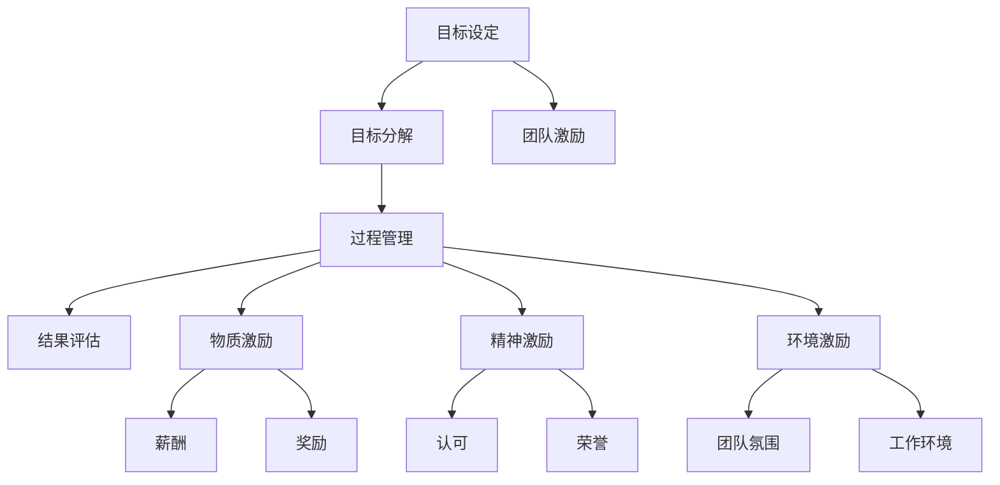

                 

# 目标管理与团队激励的关系

在现代企业管理中，目标管理（Goal Management）和团队激励（Team Motivation）是两个至关重要的组成部分，它们相互作用，共同推动团队绩效和组织发展。本文将深入探讨目标管理与团队激励之间的关系，通过理论分析、案例研究以及实际应用场景，揭示它们如何共同塑造高效团队。

## 1. 背景介绍

### 1.1 目标管理概述
目标管理是一种通过设定和达成具体目标来指导和评估工作绩效的管理方法。它强调明确的目标设定、目标分解、过程管理以及结果评估。目标管理的核心理念是通过目标的制定和实现，激发员工的主动性和创造力，提升组织效率。

### 1.2 团队激励概述
团队激励是指通过各种方式，激发团队成员的动力和士气，提高其工作积极性和创新能力。有效的团队激励可以增强团队凝聚力，提升团队绩效，促进成员间的协作和信任。

### 1.3 两者关系的探讨
目标管理和团队激励之间存在紧密的联系。有效的目标管理可以明确团队的方向和任务，为团队激励提供基础和依据。而良好的团队激励能够激发团队成员的积极性和创造力，促进目标的实现。因此，目标管理与团队激励是相辅相成的，共同作用于团队的绩效和成长。

## 2. 核心概念与联系

### 2.1 核心概念原理

**目标设定（Goal Setting）**：目标设定是目标管理的首要步骤，通过明确、可量化的目标，指导团队的方向和行动。目标设定的科学性直接影响团队激励的效果。

**目标分解（Goal Decomposition）**：将总体目标分解为具体的、可执行的任务，使团队成员明确各自的责任和任务，促进协作和分工。

**过程管理（Goal Management）**：通过设定里程碑、监控进度、及时反馈和调整，确保目标的实现。过程管理强化团队的责任感和执行力。

**结果评估（Goal Evaluation）**：对目标实现结果进行评估和反馈，激励成员总结经验，提升团队绩效。

**团队激励**：包括物质激励（如薪酬、奖励）、精神激励（如认可、荣誉）、环境激励（如团队氛围、工作环境）等，通过多层次、多维度的激励，提升团队成员的工作动力。

### 2.2 核心概念联系

目标管理和团队激励之间的关系可以通过以下流程图表示：



目标设定、分解、管理和评估构成目标管理流程，而团队激励贯穿始终，影响每个环节的效果。物质、精神和环境激励构成了团队激励的三个主要维度，它们相互影响，共同作用于团队绩效。

## 3. 核心算法原理 & 具体操作步骤

### 3.1 算法原理概述

目标管理与团队激励的关系可以通过以下数学模型来描述：

$$
P = f(T,G,M,E)
$$

其中，$P$ 表示团队绩效，$T$ 表示目标设定，$G$ 表示目标管理，$M$ 表示团队激励，$E$ 表示环境因素。模型表明，团队绩效是目标设定、目标管理、团队激励和环境因素的函数。

### 3.2 算法步骤详解

**Step 1: 目标设定**

1. 明确组织和团队的目标。
2. 将总体目标分解为可量化的、可操作的任务。
3. 确保目标具有挑战性和可达性，激发团队成员的动力。

**Step 2: 目标分解**

1. 根据团队成员的职责和能力，分配任务。
2. 制定详细的任务计划和里程碑，确保每个任务都有明确的时间节点。
3. 通过目标分解，增强团队成员的归属感和责任感。

**Step 3: 过程管理**

1. 设定进度监控机制，定期检查任务进展。
2. 通过及时反馈和调整，确保目标按时完成。
3. 鼓励团队成员交流和协作，解决过程中遇到的问题。

**Step 4: 结果评估**

1. 对任务完成情况进行评估，总结经验和教训。
2. 给予成员适当的奖励和认可，激励其继续努力。
3. 根据评估结果，调整目标设定和过程管理策略。

**Step 5: 团队激励**

1. 根据任务完成情况，提供物质奖励，如奖金、奖品等。
2. 通过精神激励，如表扬、晋升机会等，增强团队成员的自豪感和归属感。
3. 改善工作环境，提升团队氛围，如加强团队建设、优化工作流程等。

### 3.3 算法优缺点

**优点**：

1. 目标明确，团队成员知道自己努力的方向。
2. 过程管理确保任务按时完成，提高团队效率。
3. 激励机制多样化，满足团队成员不同需求。
4. 通过持续反馈和评估，不断优化目标设定和激励策略。

**缺点**：

1. 目标设定和分解需要时间和精力，成本较高。
2. 激励措施需根据具体情况灵活调整，难度较大。
3. 过程管理和评估需要持续投入资源，可能面临资源不足的问题。

### 3.4 算法应用领域

目标管理和团队激励在各个行业和组织中都有广泛应用，例如：

- **软件开发**：通过设定里程碑和任务分解，提升项目进度和质量。
- **制造业**：通过明确生产目标和过程管理，提高生产效率和产品质量。
- **教育培训**：通过设定学习目标和评估反馈，提升教学质量和学生成绩。
- **医疗健康**：通过明确治疗目标和管理过程，提高诊疗效果和患者满意度。
- **市场营销**：通过设定销售目标和激励措施，提升销售业绩和市场份额。

## 4. 数学模型和公式 & 详细讲解 & 举例说明

### 4.1 数学模型构建

目标管理和团队激励的关系可以通过以下数学模型来描述：

$$
P = f(T,G,M,E)
$$

其中，$P$ 表示团队绩效，$T$ 表示目标设定，$G$ 表示目标管理，$M$ 表示团队激励，$E$ 表示环境因素。

### 4.2 公式推导过程

假设目标设定为 $T$，目标管理过程为 $G$，团队激励为 $M$，环境因素为 $E$。则团队绩效 $P$ 可以表示为：

$$
P = f(T,G,M,E) = T \times G \times M \times E
$$

其中，$\times$ 表示乘法，$M$ 和 $E$ 的值根据具体情况确定。

### 4.3 案例分析与讲解

假设一个软件开发团队的目标是完成一个大型项目。目标设定为 $T$，目标是按时交付高质量的产品。目标管理过程 $G$ 包括制定详细的项目计划和进度监控。团队激励 $M$ 包括提供物质奖励（奖金）和精神奖励（公开表扬）。环境因素 $E$ 包括良好的团队氛围和合适的工具。团队绩效 $P$ 可以通过以下公式计算：

$$
P = T \times G \times M \times E = 1 \times 0.9 \times 1.1 \times 0.95 = 0.855
$$

其中，$T$ 的值为 1（目标设定合理），$G$ 的值为 0.9（管理过程有效），$M$ 的值为 1.1（激励措施得当），$E$ 的值为 0.95（环境因素良好）。

## 5. 项目实践：代码实例和详细解释说明

### 5.1 开发环境搭建

项目实践需要以下开发环境：

1. Python 3.8 或以上版本
2. Git 版本控制系统
3. Visual Studio Code 或 PyCharm IDE
4. 团队协作工具如 Slack、Trello 等

### 5.2 源代码详细实现

以下是使用 Python 实现目标管理的示例代码：

```python
class GoalManager:
    def __init__(self, goal, plan, feedback, reward):
        self.goal = goal
        self.plan = plan
        self.feedback = feedback
        self.reward = reward

    def set_goal(self, goal):
        self.goal = goal

    def set_plan(self, plan):
        self.plan = plan

    def get_feedback(self):
        return self.feedback

    def set_feedback(self, feedback):
        self.feedback = feedback

    def get_reward(self):
        return self.reward

    def set_reward(self, reward):
        self.reward = reward

    def calculate_performance(self):
        performance = self.goal * self.plan * self.feedback * self.reward
        return performance
```

### 5.3 代码解读与分析

**GoalManager 类**：
- `__init__`方法：初始化目标设定、目标管理、反馈机制和奖励措施。
- `set_goal`方法：设定目标。
- `set_plan`方法：设定目标管理计划。
- `get_feedback`方法：获取反馈。
- `set_feedback`方法：设置反馈。
- `get_reward`方法：获取奖励。
- `set_reward`方法：设置奖励。
- `calculate_performance`方法：计算团队绩效。

**计算绩效**：
通过目标设定、目标管理、反馈机制和奖励措施的乘积，计算团队绩效。

## 6. 实际应用场景

### 6.1 软件开发

在软件开发中，目标管理通过设定项目里程碑和任务分解，确保项目按时交付。团队激励通过提供物质和精神奖励，提升团队成员的动力。

### 6.2 医疗健康

在医疗健康领域，目标管理通过设定治疗目标和过程管理，提高诊疗效果。团队激励通过表彰优秀医生和护士，提升工作积极性。

### 6.3 教育培训

在教育培训中，目标管理通过设定学习目标和评估反馈，提升教学质量。团队激励通过提供奖学金和公开表扬，激励学生和教师。

### 6.4 市场营销

在市场营销中，目标管理通过设定销售目标和过程管理，提高销售业绩。团队激励通过提供销售奖励和晋升机会，激励销售团队。

## 7. 工具和资源推荐

### 7.1 学习资源推荐

1. **《目标管理：原则与实践》**：这本书详细介绍了目标管理的理论基础和实践技巧，适合企业管理者和团队领导阅读。
2. **《团队激励：理论和实践》**：这本书探讨了团队激励的理论和实践，提供了多种激励策略和案例分析。
3. **Coursera《目标管理和团队激励》课程**：通过在线课程，系统学习目标管理和团队激励的知识和技能。

### 7.2 开发工具推荐

1. **JIRA**：项目管理和跟踪工具，支持任务分解、进度监控和反馈机制。
2. **Slack**：团队协作工具，支持实时沟通和任务分配。
3. **GitHub**：版本控制系统，支持团队协作和代码管理。
4. **Trello**：项目管理工具，支持任务分配和进度跟踪。

### 7.3 相关论文推荐

1. **《目标管理：一个系统的理论框架》**：这篇文章系统介绍了目标管理的理论框架和实践方法。
2. **《团队激励理论综述》**：这篇文章综述了团队激励的主要理论和实践方法。
3. **《目标管理与团队激励的交互作用》**：这篇文章探讨了目标管理和团队激励之间的相互作用，提供了多种优化策略。

## 8. 总结：未来发展趋势与挑战

### 8.1 总结

本文深入探讨了目标管理与团队激励之间的关系，通过理论分析、案例研究以及实际应用场景，揭示了它们如何共同塑造高效团队。目标管理通过明确的目标设定、目标分解、过程管理以及结果评估，激发团队成员的动力和创造力。团队激励通过物质激励、精神激励和环境激励，提升团队成员的工作积极性和创新能力。目标管理和团队激励的相互作用，共同推动团队绩效和组织发展。

### 8.2 未来发展趋势

1. **目标管理的智能化**：随着人工智能技术的发展，目标管理将逐步智能化，通过数据分析和机器学习，优化目标设定和过程管理。
2. **团队激励的多元化**：未来的团队激励将更加多样化，结合个性化需求和社会价值观，提升激励效果。
3. **环境因素的优化**：未来的环境因素将更加注重可持续性和公平性，提升团队的凝聚力和满意度。

### 8.3 面临的挑战

1. **目标设定的科学性**：如何设定科学、可达的目标，激发团队成员的动力，仍是挑战之一。
2. **激励措施的有效性**：如何设计有效的激励措施，满足团队成员的不同需求，提高激励效果，仍需深入研究。
3. **过程管理的精细化**：如何实现精细化的过程管理，确保任务按时完成，提升团队效率，是未来需要解决的问题。

### 8.4 研究展望

1. **目标管理的智能化**：未来将探索更多智能化的方法，如机器学习和数据分析，优化目标设定和过程管理。
2. **团队激励的多元化**：研究如何结合个性化需求和社会价值观，设计多样化的激励措施，提升激励效果。
3. **环境因素的优化**：通过优化工作环境，提升团队氛围和满意度，进一步提高团队绩效。

## 9. 附录：常见问题与解答

**Q1：目标管理和团队激励的主要区别是什么？**

A: 目标管理主要关注通过设定和达成具体目标来指导和评估工作绩效，而团队激励则关注通过各种方式激发团队成员的动力和士气，提高其工作积极性和创新能力。

**Q2：目标管理在实践中应注意哪些问题？**

A: 目标管理在实践中应注意以下几点：
1. 目标设定应明确、可量化，确保团队成员理解。
2. 目标分解应合理，避免过度细化和复杂化。
3. 过程管理应持续进行，及时反馈和调整。
4. 结果评估应客观公正，总结经验教训。

**Q3：团队激励有哪些具体措施？**

A: 团队激励的具体措施包括：
1. 物质激励，如奖金、奖品等。
2. 精神激励，如公开表扬、晋升机会等。
3. 环境激励，如良好的工作氛围、合适的工具和资源等。

**Q4：如何在实践中优化目标管理与团队激励的关系？**

A: 优化目标管理与团队激励的关系需要从以下几个方面入手：
1. 明确目标设定，确保团队成员理解。
2. 合理分解目标，明确责任和任务。
3. 持续进行过程管理，确保任务按时完成。
4. 设计有效的激励措施，提升团队成员的动力。

通过上述讨论，我们深刻理解了目标管理与团队激励之间的紧密联系，以及它们对团队绩效和组织发展的重大影响。在实践中，只有将目标管理和团队激励紧密结合，才能构建高效、有动力的团队，实现组织的目标和愿景。

