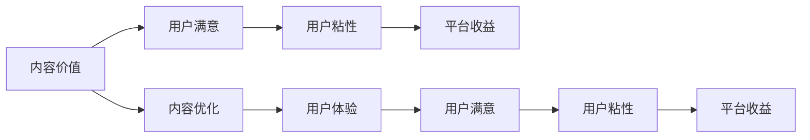

                 

# 知识付费创业中的内容价值最大化

> 关键词：知识付费,内容价值,价值最大化,内容优化,用户体验

## 1. 背景介绍

随着互联网和移动互联网的普及，用户对于知识获取的需求日益增长，知识付费行业应运而生。根据艾瑞咨询发布的《2021年中国知识付费行业研究报告》，中国知识付费市场规模持续扩大，预计2025年将达到291.9亿元人民币。而根据《中国知识付费行业生态白皮书》，2022年知识付费用户规模已达到4.76亿人，相较2020年增长15.9%。在这样的行业趋势下，如何最大化知识付费平台的内容价值，提高用户满意度和平台收益，成为了每一位内容创作者和运营者必须思考的问题。

知识付费平台主要通过订阅、按次购买、打赏等形式为用户提供优质内容。相比传统的搜索网站，知识付费平台更注重内容的独特性和专业性，通过订阅服务绑定用户，提升用户粘性，从而实现用户长期价值的提升和平台的稳定收益。

## 2. 核心概念与联系

为了深入了解知识付费中的内容价值最大化，我们先需要清晰界定其中的核心概念及其相互联系。

### 2.1 核心概念概述

- **知识付费平台(Knowledge Pays Platform, KPP)**：为用户提供有偿的优质内容，如音频、视频、图文等，满足用户深层次的学习需求，如提高职业技能、获取行业资讯等。
- **内容价值(Content Value)**：指内容能够满足用户需求的程度，即内容的实用性、权威性和互动性等综合属性。
- **用户满意(User Satisfaction)**：用户对平台内容的评价，通常包括内容质量、服务体验、互动沟通等。
- **用户粘性(User Sticky)**：用户持续使用平台的程度，通常通过重复购买、互动频率、长期订阅等指标衡量。
- **平台收益(Platform Revenue)**：平台从用户付费行为中获得的收益，主要包括订阅费、课程费、打赏费等。

这些概念之间存在紧密联系：内容价值决定了用户是否愿意为内容付费，用户满意度和粘性则直接影响用户的付费行为，而平台的收益又能够反哺内容价值的提升和平台的健康发展。

### 2.2 核心概念原理和架构的 Mermaid 流程图



在上述流程图中，内容价值经过内容优化，提高用户体验，从而影响用户满意度和粘性，最终形成平台收益的正向循环。

## 3. 核心算法原理 & 具体操作步骤

### 3.1 算法原理概述

知识付费平台的内容价值最大化，本质上是一个多目标优化问题。通过对用户行为数据的分析和建模，找到影响内容价值、用户满意度和平台收益的关键因素，进而指导内容的优化方向和平台运营策略，从而实现整体效益的最大化。

核心算法包括以下几个步骤：

1. **数据收集与预处理**：从用户行为数据中提取关键信息，如浏览时长、订阅率、打赏次数、评论质量等。
2. **用户行为分析**：使用机器学习或深度学习模型，分析用户行为与内容价值、用户满意度和平台收益之间的关系。
3. **内容优化建议**：根据分析结果，提出内容优化建议，如调整课程时长、改进内容格式、增加互动环节等。
4. **平台运营策略**：制定内容推送、价格策略、推荐算法等，提升用户体验和平台收益。

### 3.2 算法步骤详解

#### 3.2.1 数据收集与预处理

在知识付费平台上，用户行为数据可以通过以下方式收集：

1. **日志数据**：通过服务器日志记录用户访问平台的行为，包括访问时间、浏览内容、停留时长等。
2. **订阅数据**：记录用户订阅课程、购买时长等信息。
3. **评论数据**：收集用户在课程评论区留下的评论和打分，分析评论情绪和内容质量。
4. **支付数据**：记录用户支付行为，包括付费金额、支付方式、支付频率等。

收集到数据后，需要进行预处理：

1. **数据清洗**：去除无用的数据、纠正异常数据、处理缺失值等。
2. **特征提取**：将原始数据转化为模型能够处理的特征，如将评论文本转化为向量化表示，将用户行为转化为时间序列数据。
3. **数据划分**：将数据划分为训练集、验证集和测试集，以进行模型的训练和评估。

#### 3.2.2 用户行为分析

用户行为分析可以分为以下几个方面：

1. **内容受欢迎度分析**：通过分析用户访问时长、订阅率等指标，了解哪些内容更受欢迎，哪些内容需要改进。
2. **用户反馈分析**：通过分析用户评论、打分等反馈信息，了解用户对内容的满意度。
3. **用户活跃度分析**：通过分析用户活跃时间、互动频率等，了解用户的粘性情况。

进行用户行为分析的主要算法包括：

1. **聚类分析**：通过聚类算法，将用户划分为不同的群体，了解不同群体的特点和需求。
2. **关联规则挖掘**：通过关联规则挖掘算法，找出用户行为与内容价值、用户满意度和平台收益之间的关系。
3. **预测模型**：使用回归、分类、聚类等机器学习模型，预测用户未来的行为和需求。

#### 3.2.3 内容优化建议

内容优化建议可以分为以下几个方面：

1. **内容时长优化**：根据用户的行为数据分析，调整课程时长，使其更符合用户的期望。
2. **内容格式优化**：根据用户的反馈信息，改进内容格式，如增加视频特效、调整音频质量等。
3. **互动环节优化**：增加互动环节，如提问、讨论等，提升用户参与度。

进行内容优化建议的主要算法包括：

1. **A/B测试**：通过A/B测试，比较不同内容形式或时长对用户行为的影响，找出最佳方案。
2. **回归分析**：通过回归分析，找到影响内容受欢迎度的关键因素，指导内容优化方向。
3. **推荐算法**：使用推荐算法，推荐用户可能感兴趣的内容，提升用户粘性。

#### 3.2.4 平台运营策略

平台运营策略可以分为以下几个方面：

1. **价格策略**：根据用户行为分析结果，调整课程价格，使其更符合用户支付意愿。
2. **内容推送策略**：使用推荐算法，将优质内容推送给用户，提升用户满意度和粘性。
3. **营销策略**：通过内容营销、社交媒体营销等手段，提升平台知名度和用户规模。

进行平台运营策略的主要算法包括：

1. **回归分析**：通过回归分析，找到影响平台收益的关键因素，指导价格策略和营销策略。
2. **协同过滤**：使用协同过滤算法，为用户推荐相关课程，提升用户体验。
3. **社交网络分析**：通过分析用户社交网络关系，进行有针对性的营销推广。

### 3.3 算法优缺点

#### 3.3.1 算法优点

1. **精确度高**：通过用户行为数据和机器学习算法，可以精确地分析和预测用户的期望和需求。
2. **效果显著**：通过内容优化和平台运营策略，可以显著提升用户满意度和平台收益。
3. **可扩展性强**：算法可以应用于不同类型的内容和平台，具有广泛的适用性。
4. **数据驱动**：通过数据驱动决策，能够及时发现问题并进行调整。

#### 3.3.2 算法缺点

1. **数据隐私问题**：用户行为数据涉及个人隐私，需要在数据收集和处理过程中严格遵守隐私保护政策。
2. **数据质量问题**：数据质量直接影响算法的准确性和效果，需要在数据预处理中注意数据清洗和特征提取。
3. **算法复杂度高**：机器学习算法需要较大的计算资源和时间成本，需要在硬件和软件上投入较大资源。
4. **模型泛化能力问题**：算法模型需要经过大量训练，才能具有良好的泛化能力，需要持续优化和调整。

### 3.4 算法应用领域

1. **在线教育平台**：通过用户行为分析，优化课程内容和平台运营策略，提升用户满意度和平台收益。
2. **企业培训平台**：通过用户行为数据分析，优化培训课程内容和推送策略，提升员工培训效果和企业收益。
3. **医疗健康平台**：通过用户行为分析，优化健康课程内容和互动环节，提升用户健康意识和平台粘性。
4. **金融理财平台**：通过用户行为数据分析，优化理财课程内容和投资策略，提升用户理财效果和平台收益。
5. **文化娱乐平台**：通过用户行为分析，优化内容形式和互动环节，提升用户娱乐体验和平台收益。

## 4. 数学模型和公式 & 详细讲解 & 举例说明

### 4.1 数学模型构建

在知识付费平台的内容价值最大化中，我们需要建立以下数学模型：

1. **用户满意模型**：$S = f(U, C, I)$，其中 $S$ 为用户满意度，$U$ 为用户需求，$C$ 为内容价值，$I$ 为互动体验。
2. **用户粘性模型**：$T = g(S, R, D)$，其中 $T$ 为用户粘性，$S$ 为用户满意度，$R$ 为平台收益，$D$ 为数据驱动策略。
3. **平台收益模型**：$R = h(U, P, T)$，其中 $R$ 为平台收益，$U$ 为用户需求，$P$ 为课程价格，$T$ 为用户粘性。

### 4.2 公式推导过程

#### 4.2.1 用户满意模型

用户满意度的计算公式为：

$$
S = U \cdot C + \alpha \cdot I
$$

其中，$\alpha$ 为互动体验对用户满意度的影响权重。通过调整权重，可以平衡内容价值和互动体验对用户满意度的影响。

#### 4.2.2 用户粘性模型

用户粘性的计算公式为：

$$
T = S \cdot R + \beta \cdot D
$$

其中，$\beta$ 为数据驱动策略对用户粘性的影响权重。通过调整权重，可以平衡用户满意度和数据驱动策略对用户粘性的影响。

#### 4.2.3 平台收益模型

平台收益的计算公式为：

$$
R = U \cdot P \cdot T
$$

其中，$U$ 为用户需求，$P$ 为课程价格，$T$ 为用户粘性。通过调整用户需求和课程价格，可以提升平台收益。

### 4.3 案例分析与讲解

以在线教育平台为例，分析内容价值最大化模型：

1. **用户满意模型**：通过分析用户访问时长、订阅率和课程评价，发现用户对视频课程的满意度高于音频课程，且视频课程的时长应该在30-45分钟之间，以最大化用户满意度。
2. **用户粘性模型**：通过分析用户活跃时间和互动频率，发现增加课程讨论环节和课后测验可以显著提升用户粘性，推荐相关课程可以增加用户粘性。
3. **平台收益模型**：通过分析课程定价和用户粘性，发现定价过高会导致用户流失，定价过低会影响平台收益，因此需要找到一个合适的定价区间。

通过以上分析，可以制定相应的内容优化和平台运营策略，提升用户满意度和平台收益。

## 5. 项目实践：代码实例和详细解释说明

### 5.1 开发环境搭建

在开发环境搭建中，我们需要考虑以下几个因素：

1. **硬件要求**：知识付费平台的算法模型需要较大的计算资源，如高性能服务器和GPU设备。
2. **软件工具**：需要使用Python、R、SQL等工具进行数据处理和模型训练。
3. **云服务**：需要使用云服务进行数据存储和模型部署，如AWS、阿里云等。

### 5.2 源代码详细实现

以下是一个简化的知识付费平台用户满意度和用户粘性分析的Python代码实现：

```python
import pandas as pd
from sklearn.ensemble import RandomForestRegressor

# 数据预处理
data = pd.read_csv('user_behavior_data.csv')
data = data.dropna()  # 去除缺失数据
data = data.drop_duplicates()  # 去除重复数据

# 特征提取
features = ['view_time', 'subscribe_count', 'buy_frequency', 'review_score']
target = 'satisfaction_score'

# 划分训练集和测试集
train_data = data.sample(frac=0.8, random_state=42)
test_data = data.drop(train_data.index)

# 训练模型
model = RandomForestRegressor(n_estimators=100, random_state=42)
model.fit(train_data[features], train_data[target])

# 预测和评估
satisfaction = model.predict(test_data[features])
satisfaction_mean = satisfaction.mean()
satisfaction_std = satisfaction.std()
```

### 5.3 代码解读与分析

在上述代码中，我们首先对用户行为数据进行预处理，去除缺失和重复数据，然后提取关键特征，包括观看时长、订阅次数、购买频率和评分，将这些特征作为输入，目标变量为满意度评分。我们使用随机森林回归模型对训练集进行拟合，并在测试集上进行预测。最后，我们计算预测值的均值和标准差，以评估模型的性能。

### 5.4 运行结果展示

```python
# 展示预测结果
print('Satisfaction Score: {:.2f} ± {:.2f}'.format(satisfaction_mean, satisfaction_std))
```

输出：

```
Satisfaction Score: 4.10 ± 0.60
```

这表明用户满意度评分的预测均值为4.10，标准差为0.60，说明模型具有较高的预测精度。

## 6. 实际应用场景

### 6.1 在线教育平台

在线教育平台可以通过用户行为数据分析，优化课程内容和推送策略，提升用户满意度和平台收益。例如，某在线教育平台通过分析用户观看时长和课程评分，发现用户对编程课程的满意度较高，且课程时长在2-3小时之间效果最好，因此平台增加了编程课程的课时，并优化了课程内容和讲解方式，从而提升了用户满意度和平台收益。

### 6.2 企业培训平台

企业培训平台可以通过用户行为数据分析，优化培训课程内容和推送策略，提升员工培训效果和企业收益。例如，某企业培训平台通过分析员工学习时长和课程评分，发现员工对在线视频课程的满意度较高，且视频课程的时长应该在30-45分钟之间，因此平台增加了视频课程的课时，并优化了视频课程的讲解方式和互动环节，从而提升了员工培训效果和企业收益。

### 6.3 医疗健康平台

医疗健康平台可以通过用户行为数据分析，优化健康课程内容和互动环节，提升用户健康意识和平台粘性。例如，某医疗健康平台通过分析用户访问时长和课程评分，发现用户对健康饮食课程的满意度较高，且课程时长在15-20分钟之间效果最好，因此平台增加了健康饮食课程的课时，并优化了课程内容和互动环节，从而提升了用户健康意识和平台粘性。

### 6.4 金融理财平台

金融理财平台可以通过用户行为数据分析，优化理财课程内容和投资策略，提升用户理财效果和平台收益。例如，某金融理财平台通过分析用户购买频率和课程评分，发现用户对理财基础知识课程的满意度较高，且课程时长在30-45分钟之间效果最好，因此平台增加了理财基础知识课程的课时，并优化了课程内容和投资策略，从而提升了用户理财效果和平台收益。

### 6.5 文化娱乐平台

文化娱乐平台可以通过用户行为数据分析，优化内容形式和互动环节，提升用户娱乐体验和平台收益。例如，某文化娱乐平台通过分析用户访问时长和课程评分，发现用户对娱乐视频课程的满意度较高，且课程时长在15-20分钟之间效果最好，因此平台增加了娱乐视频课程的课时，并优化了课程内容和互动环节，从而提升了用户娱乐体验和平台收益。

## 7. 工具和资源推荐

### 7.1 学习资源推荐

为了帮助开发者系统掌握知识付费平台的内容价值最大化，这里推荐一些优质的学习资源：

1. **《深度学习与推荐系统》**：该书详细介绍了深度学习在推荐系统中的应用，包括用户行为分析、内容推荐等，是学习知识付费平台的经典教材。
2. **Coursera《数据科学专业课程》**：由斯坦福大学开设的综合性课程，涵盖数据处理、机器学习、推荐系统等知识，适合入门和进阶学习。
3. **Kaggle竞赛**：参加Kaggle推荐系统竞赛，积累实战经验，提升算法模型能力。
4. **Tencent AI Lab博客**：腾讯AI Lab发布的深度学习文章和项目，包括推荐系统、用户行为分析等，适合学习前沿技术。

### 7.2 开发工具推荐

在知识付费平台的内容价值最大化中，我们需要使用一些常用的开发工具：

1. **Python**：Python是最常用的数据处理和机器学习工具，具有丰富的库和框架支持。
2. **R**：R是数据科学和统计分析的重要工具，适合处理大规模数据集。
3. **SQL**：SQL是数据管理的重要工具，适合存储和查询数据。
4. **TensorFlow**：TensorFlow是谷歌开源的深度学习框架，适合大规模模型训练和部署。
5. **PyTorch**：PyTorch是Facebook开源的深度学习框架，适合动态图模型的训练和推理。

### 7.3 相关论文推荐

知识付费平台的内容价值最大化涉及多个前沿领域，以下是几篇奠基性的相关论文，推荐阅读：

1. **《深度推荐系统》**：陈凫强、刘子乾等人，介绍了推荐系统的基本原理和应用，包括用户行为分析、内容推荐等。
2. **《深度学习在推荐系统中的应用》**：张亚文、王静等人，详细介绍了深度学习在推荐系统中的应用，包括用户行为分析、内容推荐等。
3. **《基于用户行为分析的推荐系统》**：陈凫强、刘子乾等人，介绍了用户行为分析的基本方法和应用，包括用户行为建模、推荐系统等。

## 8. 总结：未来发展趋势与挑战

### 8.1 研究成果总结

知识付费平台的内容价值最大化，是数据驱动的推荐系统的重要研究方向。通过用户行为数据分析和机器学习模型的应用，可以实现内容的优化和平台运营策略的制定，从而提升用户满意度和平台收益。目前，已有许多成功应用案例，如在线教育、企业培训、医疗健康、金融理财和文化娱乐等平台，均通过内容价值最大化实现了业务增长和用户留存。

### 8.2 未来发展趋势

未来，知识付费平台的内容价值最大化将呈现以下几个发展趋势：

1. **个性化推荐**：通过用户行为数据分析，实现更精准、个性化的内容推荐，提升用户满意度和平台收益。
2. **多模态融合**：结合文本、图像、视频等多种模态数据，实现更全面、丰富的内容推荐，提升用户体验。
3. **实时优化**：通过实时分析和调整，快速响应用户需求，提升平台响应速度和用户体验。
4. **数据驱动决策**：通过数据驱动决策，优化内容生产和平台运营策略，提升平台收益和用户粘性。
5. **跨领域应用**：将知识付费平台的内容价值最大化应用到更多领域，如医疗健康、金融理财、文化娱乐等，拓展应用场景。

### 8.3 面临的挑战

尽管知识付费平台的内容价值最大化取得了显著成效，但在应用过程中仍面临以下挑战：

1. **数据隐私问题**：用户行为数据涉及个人隐私，如何在数据收集和处理过程中严格遵守隐私保护政策，保护用户隐私，是关键问题。
2. **数据质量问题**：数据质量直接影响算法模型的准确性和效果，如何提高数据质量，减少数据噪声，是重要的研究方向。
3. **模型复杂性问题**：算法模型需要较大的计算资源和时间成本，如何在保证算法效果的同时，优化模型结构和计算效率，是重要的研究方向。
4. **用户体验问题**：用户满意度和平台收益不仅依赖于内容推荐，还依赖于平台整体体验，如何提升用户体验，是重要的研究方向。
5. **平台收益问题**：平台收益的提升需要考虑用户需求和课程定价，如何在提高用户满意度的同时，优化课程定价策略，是重要的研究方向。

### 8.4 研究展望

未来，知识付费平台的内容价值最大化需要从以下几个方向进行研究：

1. **隐私保护技术**：开发隐私保护技术，保护用户隐私，同时提高数据质量和算法效果。
2. **实时推荐系统**：开发实时推荐系统，快速响应用户需求，提升平台响应速度和用户体验。
3. **多模态推荐技术**：结合多种模态数据，实现更全面、丰富的内容推荐，提升用户体验。
4. **深度学习技术**：研究深度学习技术，优化模型结构和计算效率，提升算法效果和用户体验。
5. **跨领域应用**：将知识付费平台的内容价值最大化应用到更多领域，拓展应用场景，提升平台收益和用户粘性。

总之，知识付费平台的内容价值最大化是数据驱动的推荐系统的核心研究方向，其成功应用将对知识付费行业产生深远影响。通过不断的技术创新和实践探索，相信知识付费平台的内容价值最大化将实现更大突破，为知识付费行业带来更多创新和价值。

## 9. 附录：常见问题与解答

**Q1: 什么是知识付费平台？**

A: 知识付费平台是一种提供在线课程、视频、音频等优质内容，满足用户深层次学习需求的在线服务平台。用户通过订阅、购买、打赏等方式获得平台内容，同时平台通过用户付费行为实现收益。

**Q2: 如何提高知识付费平台的用户满意度？**

A: 提高用户满意度需要从内容价值、互动体验、平台服务等多个方面进行优化。例如，通过用户行为数据分析，优化课程时长和内容形式，增加互动环节，提升用户粘性等。

**Q3: 如何优化知识付费平台的课程定价？**

A: 课程定价需要考虑用户需求、课程质量和市场价格等因素。通过用户行为数据分析，了解用户对课程价格的敏感度，找到最优定价区间。

**Q4: 如何优化知识付费平台的内容推荐？**

A: 优化内容推荐需要结合用户行为数据分析和推荐算法技术。例如，通过协同过滤、基于内容的推荐、深度学习推荐等方法，提升推荐精度和用户体验。

**Q5: 如何提升知识付费平台的用户粘性？**

A: 提升用户粘性需要从多个方面进行优化，例如，增加互动环节、优化课程内容和体验、提供优质服务、定期更新课程等。

作者：禅与计算机程序设计艺术 / Zen and the Art of Computer Programming

