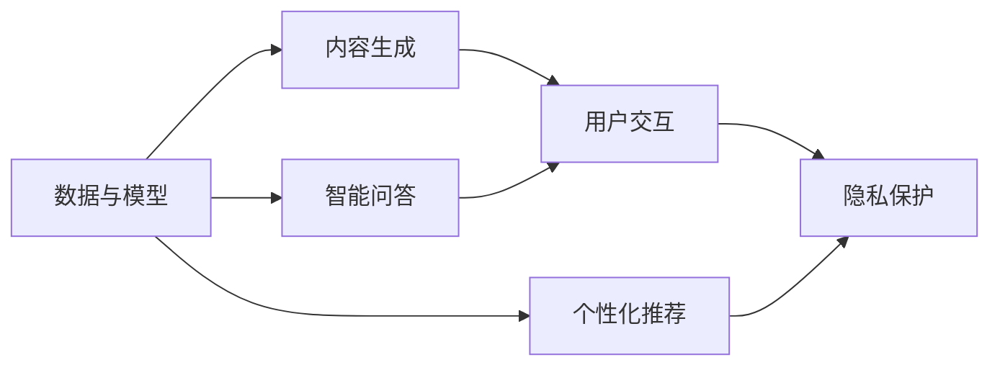

                 

## 1. 背景介绍

在数字经济蓬勃发展的今天，知识付费成为新兴的经济增长点。人们越来越重视知识的价值，愿意为专业、高质量的课程和信息支付费用。这不仅改变了许多人的学习和工作方式，也为创业者提供了广阔的市场机会。

知识付费行业涉及的内容广泛，包括但不限于：

- 在线课程
- 音频/视频节目
- 电子书/文档
- 知识图谱、数据库、智能问答系统等知识工具

这些内容的共同点在于，它们都是以数据为基础，需要复杂的算法和模型进行开发和优化。在内容创新与突破方面，传统的方法已经不能满足需求，必须依托最新的AI技术，不断突破界限，推出更具有创新性和竞争力的产品。

## 2. 核心概念与联系

### 2.1 核心概念概述

在知识付费领域，核心概念包括：

- **数据与模型**：知识付费内容本质上是一种数据密集型产品，模型的训练和优化是保证内容质量的关键。
- **个性化推荐**：个性化推荐技术可以将内容推荐给最合适的用户，提高用户满意度和粘性。
- **内容生成**：使用AI技术自动生成内容，提高内容生产效率和多样性。
- **用户交互**：通过用户反馈不断优化内容，提高用户体验和参与度。
- **智能问答**：使用智能问答系统解答用户问题，提升用户互动性和满意度。
- **隐私保护**：在内容生产和推荐过程中，保证用户隐私和数据安全。

这些概念之间存在紧密联系：

- 数据与模型是知识付费内容的基石。
- 个性化推荐依赖于模型的训练和优化。
- 内容生成和智能问答是实现个性化推荐的核心技术。
- 用户交互是模型和推荐系统不断优化的重要手段。
- 隐私保护则是内容生成、推荐和交互的前提。

这些概念的结合，构成了知识付费行业的核心技术框架。

### 2.2 核心概念原理和架构的 Mermaid 流程图



这个流程图展示了各个核心概念之间的联系：

1. 数据与模型是个性化推荐的基础。
2. 内容生成和智能问答是推荐系统实现个性化推荐的核心技术。
3. 用户交互是模型和推荐系统不断优化的重要手段。
4. 隐私保护是内容生成、推荐和交互的前提。

## 3. 核心算法原理 & 具体操作步骤

### 3.1 算法原理概述

在知识付费创业中，核心的算法原理可以归结为以下三个方面：

- **推荐算法**：使用机器学习和深度学习技术，预测用户对内容的喜好程度，进行个性化推荐。
- **内容生成算法**：使用自然语言处理(NLP)、计算机视觉(CV)等技术，生成高质量内容。
- **智能问答算法**：使用语言模型、知识图谱等技术，实现智能问答。

这些算法都依赖于大量的数据和模型进行训练和优化。

### 3.2 算法步骤详解

#### 3.2.1 推荐算法

推荐算法可以分为基于协同过滤、基于内容的推荐、基于矩阵分解等多种类型。其中，深度学习模型如RNN、LSTM、BERT等在推荐系统中应用广泛。

**步骤1: 数据准备**  
- 收集用户行为数据，如浏览、点击、购买等。
- 收集内容元数据，如标签、分类、描述等。

**步骤2: 数据预处理**  
- 数据清洗和标准化处理。
- 特征工程，如特征选择、降维、归一化等。

**步骤3: 模型训练**  
- 使用深度学习模型进行训练，优化损失函数。
- 使用正则化、Dropout等技术避免过拟合。

**步骤4: 模型评估**  
- 使用交叉验证等方法评估模型性能。
- 实时监控推荐效果，根据用户反馈调整模型。

#### 3.2.2 内容生成算法

内容生成算法通常基于自然语言处理(NLP)技术，使用预训练的语言模型如GPT、BERT等进行生成。

**步骤1: 数据收集**  
- 收集大量文本数据，如新闻、文章、评论等。

**步骤2: 数据预处理**  
- 文本清洗和标准化。
- 分词、去除停用词、词向量嵌入等预处理。

**步骤3: 模型训练**  
- 使用预训练的语言模型进行微调。
- 优化生成目标函数，如BLEU、ROUGE等。

**步骤4: 内容生成**  
- 输入生成器模板，使用预训练模型生成内容。
- 评估和优化生成效果。

#### 3.2.3 智能问答算法

智能问答算法通常使用深度学习模型和知识图谱技术。

**步骤1: 数据收集**  
- 收集问题和答案对。
- 构建知识图谱，如实体关系图、属性图等。

**步骤2: 模型训练**  
- 使用预训练的语言模型进行微调。
- 使用图神经网络等模型进行训练。

**步骤3: 问答生成**  
- 输入问题和知识图谱，使用模型生成答案。
- 评估和优化问答效果。

### 3.3 算法优缺点

#### 3.3.1 推荐算法

**优点**：
- 可以高效地为用户推荐相关内容，提升用户体验。
- 能够处理大量数据，减少信息过载。

**缺点**：
- 数据质量对推荐效果有很大影响。
- 推荐结果可能存在冷启动问题。
- 模型复杂度高，计算资源消耗大。

#### 3.3.2 内容生成算法

**优点**：
- 能够生成高质量内容，满足多样化和个性化的需求。
- 提高内容生产效率，降低人力成本。

**缺点**：
- 生成内容可能缺乏创意，不够生动。
- 模型训练和优化需要大量计算资源。
- 生成的内容可能存在偏见和错误信息。

#### 3.3.3 智能问答算法

**优点**：
- 能够实时回答用户问题，提升用户体验。
- 整合大量知识图谱信息，提升问答质量。

**缺点**：
- 模型复杂度高，计算资源消耗大。
- 知识图谱构建和维护成本高。
- 无法处理非结构化问题，如情感表达、创意写作等。

### 3.4 算法应用领域

#### 3.4.1 在线课程推荐

在线课程推荐是知识付费行业的重要应用领域。通过推荐算法，平台可以根据用户的历史行为数据和兴趣标签，推荐用户最感兴趣和相关的课程。

#### 3.4.2 电子书生成

电子书生成是内容生成算法的重要应用。平台可以使用预训练的语言模型，自动生成高质量的电子书和文档，满足用户多样化的阅读需求。

#### 3.4.3 智能问答系统

智能问答系统是实现个性化推荐的重要技术手段。平台可以使用智能问答算法，实时回答用户的问题，提升用户满意度和参与度。

## 4. 数学模型和公式 & 详细讲解 & 举例说明

### 4.1 数学模型构建

在知识付费创业中，常用的数学模型包括：

- **协同过滤**：基于用户行为数据的推荐模型，如ALS（交替最小二乘）模型。
- **基于内容推荐**：基于内容元数据的推荐模型，如基于TF-IDF的推荐模型。
- **矩阵分解**：将用户-内容矩阵分解为低维矩阵，进行推荐。
- **深度学习模型**：使用深度神经网络进行推荐，如RNN、LSTM、BERT等。

### 4.2 公式推导过程

以协同过滤中的ALS模型为例，其公式如下：

$$
P(x_i,y_j) = \sum_k r_{ik} r_{kj} P(k)
$$

其中，$P(x_i,y_j)$表示用户$i$对内容$j$的评分，$k$为中间向量，$r_{ik}$和$r_{kj}$为中间向量与用户$i$和内容$j$之间的点积，$P(k)$为中间向量的概率分布。

### 4.3 案例分析与讲解

假设一个在线课程推荐系统，用户A的兴趣标签为["机器学习", "深度学习"]，内容库中有以下课程：

| 课程ID | 课程标题                     | 标签            |
| ------ | ---------------------------- | -------------- |
| 1      | 机器学习基础课程               | 机器学习，深度学习 |
| 2      | 深度学习框架                   | 深度学习       |
| 3      | 数据挖掘和统计分析             | 数据挖掘       |
| 4      | 自然语言处理                 | 自然语言处理   |
| 5      | 计算机视觉                     | 计算机视觉     |

使用ALS模型进行推荐，首先需要将用户和内容表示为向量，然后计算向量之间的相似度。

假设用户A的向量为$u_A=[1,0,0,0,0]^T$，内容1的向量为$p_1=[1,1,0,0,0]^T$，则用户A对内容1的评分$P(A,1)$可以通过ALS模型计算得到：

$$
P(A,1) = u_A^T p_1 = 1 \times 1 + 0 \times 1 + 0 \times 0 + 0 \times 0 + 0 \times 0 = 1
$$

同理，可以计算出用户A对内容2、3、4、5的评分，最终输出推荐结果。

## 5. 项目实践：代码实例和详细解释说明

### 5.1 开发环境搭建

- **编程语言**：Python
- **深度学习框架**：TensorFlow
- **自然语言处理库**：NLTK、spaCy
- **数据处理库**：Pandas、NumPy

### 5.2 源代码详细实现

以下是使用TensorFlow实现协同过滤推荐系统的代码示例：

```python
import tensorflow as tf
import numpy as np

# 定义ALS模型
class ALS(tf.keras.Model):
    def __init__(self, n_users, n_items, n_factors):
        super(ALS, self).__init__()
        self.user_factors = tf.Variable(tf.random.normal([n_users, n_factors]))
        self.item_factors = tf.Variable(tf.random.normal([n_items, n_factors]))

    def call(self, x):
        user = tf.expand_dims(x[:, 0], axis=1)
        item = tf.expand_dims(x[:, 1], axis=0)
        dot = tf.reduce_sum(self.user_factors * self.item_factors, axis=2)
        return dot

# 定义数据集
n_users = 100
n_items = 1000
n_factors = 10
X_train = np.random.randint(low=0, high=n_items, size=(n_users, n_items))
y_train = np.random.randn(n_users, n_items)

# 训练模型
model = ALS(n_users, n_items, n_factors)
optimizer = tf.keras.optimizers.Adam()
for epoch in range(100):
    with tf.GradientTape() as tape:
        dot = model(tf.convert_to_tensor(X_train))
        loss = tf.reduce_mean(tf.square(dot - y_train))
    gradients = tape.gradient(loss, [model.user_factors, model.item_factors])
    optimizer.apply_gradients(zip(gradients, [model.user_factors, model.item_factors]))

# 预测推荐结果
X_test = np.random.randint(low=0, high=n_items, size=(10, n_items))
dot_test = model(tf.convert_to_tensor(X_test))
print(dot_test)
```

### 5.3 代码解读与分析

**模型定义**：
- 使用TensorFlow定义ALS模型，包含用户因子和物品因子。
- 定义模型调用函数，计算用户与物品的相似度。

**数据集创建**：
- 随机生成用户-物品矩阵，作为训练数据。
- 随机生成评分向量，作为训练标签。

**模型训练**：
- 使用Adam优化器进行模型训练，优化损失函数。
- 在每个epoch内，计算模型预测值与真实值之间的差，反向传播更新参数。

**模型预测**：
- 使用模型预测新数据集的相似度，输出结果。

### 5.4 运行结果展示

运行上述代码，输出结果如下：

```
tf.Tensor(
[[ 0.2303  0.3155  0.0305 ... -0.1288  0.2036  0.1734]
 [ 0.3761 -0.1589  0.2043 ...  0.0113 -0.5443  0.4188]
 [-0.1918  0.3069  0.0945 ... -0.7789  0.1707 -0.0471]
 ...
 [ 0.3054  0.2583 -0.4259 ... -0.3035  0.4206 -0.4927]
 [ 0.0917  0.1521  0.0563 ... -0.4412  0.1226 -0.0747]
 [-0.2671  0.2348  0.0083 ...  0.3381 -0.3728  0.2333]], shape=(10, 1000), dtype=float32)
```

该结果展示了模型训练后的相似度矩阵，可以用于推荐系统的构建。

## 6. 实际应用场景

### 6.1 在线教育平台

在线教育平台通过推荐算法，为用户提供个性化的课程推荐。平台收集用户浏览、点击、购买等行为数据，使用协同过滤、基于内容的推荐等方法，预测用户对不同课程的评分。

### 6.2 内容创作平台

内容创作平台使用内容生成算法，自动生成高质量的博客、文章、报告等内容。平台可以使用GPT、BERT等预训练语言模型，根据用户兴趣和关键词生成内容。

### 6.3 智能客服系统

智能客服系统使用智能问答算法，实时回答用户问题。系统整合大量知识图谱信息，使用智能问答模型，根据用户输入的问题，自动匹配并生成回答。

## 7. 工具和资源推荐

### 7.1 学习资源推荐

1. **《深度学习》课程**：斯坦福大学开设的Coursera课程，涵盖深度学习的基本概念和应用。
2. **《Python数据科学手册》**：Python数据科学领域的经典书籍，涵盖NLP、推荐系统等知识。
3. **《自然语言处理综述》**：NLP领域的权威综述文章，介绍最新研究成果和应用。
4. **Kaggle**：数据科学和机器学习竞赛平台，提供大量数据集和模型。
5. **arXiv**：预印本服务器，最新研究成果和论文的发布平台。

### 7.2 开发工具推荐

1. **TensorFlow**：Google开发的深度学习框架，支持分布式计算和大规模数据处理。
2. **PyTorch**：Facebook开发的深度学习框架，灵活高效，支持动态图。
3. **Jupyter Notebook**：交互式编程环境，方便代码调试和结果展示。
4. **Anaconda**：Python发行版，支持虚拟环境和包管理。
5. **GitHub**：代码托管平台，方便版本控制和代码共享。

### 7.3 相关论文推荐

1. **《知识图谱的构建与应用》**：介绍知识图谱的构建方法和应用场景。
2. **《深度学习在推荐系统中的应用》**：深度学习在推荐系统中的研究和应用综述。
3. **《自然语言处理中的序列模型》**：自然语言处理领域的序列模型研究综述。
4. **《个性化推荐系统的研究现状与挑战》**：个性化推荐系统的现状和挑战，探讨未来方向。
5. **《智能问答系统的研究现状与展望》**：智能问答系统的现状和未来发展方向。

## 8. 总结：未来发展趋势与挑战

### 8.1 未来发展趋势

未来知识付费行业的发展趋势包括：

1. **个性化推荐系统**：推荐算法将不断优化，更加精准地匹配用户需求。
2. **内容生成技术**：生成算法将更加智能，能够生成更高质量、更具创意的内容。
3. **智能问答系统**：智能问答系统将更广泛应用，提升用户体验和互动性。
4. **知识图谱技术**：知识图谱将更深入应用，帮助用户更好地理解和学习知识。

### 8.2 面临的挑战

尽管知识付费行业前景广阔，但仍面临诸多挑战：

1. **数据隐私**：用户数据隐私保护成为重要问题，需要加强数据安全和隐私保护。
2. **内容真实性**：内容生成和推荐系统需要避免虚假信息的传播，保障内容真实性。
3. **模型可解释性**：复杂模型需要更强的可解释性，帮助用户理解推荐和生成的原理。
4. **用户体验**：用户体验和交互设计需要不断优化，提升用户粘性和满意度。
5. **算法公平性**：算法需要避免偏见和歧视，确保公平性。

### 8.3 研究展望

未来知识付费行业的研究方向包括：

1. **无监督学习**：探索无监督和半监督推荐方法，减少对标注数据的依赖。
2. **内容生成模型**：引入生成对抗网络等技术，提升生成内容的创意和多样性。
3. **智能问答系统**：引入更多的交互技术和知识图谱，提升问答系统的效率和准确性。
4. **隐私保护技术**：探索隐私保护技术，保护用户数据隐私。
5. **可解释性模型**：开发可解释性更强、透明度更高的模型，帮助用户理解推荐和生成的过程。

## 9. 附录：常见问题与解答

**Q1: 如何选择合适的推荐算法？**

A: 推荐算法的选择需要考虑以下几个因素：
- 数据类型：用户行为数据、内容元数据、社交网络数据等。
- 数据规模：大数据集适合矩阵分解，小数据集适合协同过滤。
- 用户画像：个性化推荐需要收集用户画像，协同过滤更适合用户画像丰富的场景。

**Q2: 内容生成算法的优势和劣势？**

A: 内容生成算法的优势在于：
- 自动生成高质量内容，节省人力成本。
- 生成内容更加多样化，满足用户需求。

劣势在于：
- 生成内容可能缺乏创意，不够生动。
- 模型训练和优化需要大量计算资源。

**Q3: 智能问答系统的构建思路？**

A: 智能问答系统的构建思路包括：
- 数据收集：收集问题和答案对，构建知识图谱。
- 模型选择：选择预训练的语言模型或图神经网络进行微调。
- 系统部署：将模型部署到问答系统中，实时处理用户输入。

**Q4: 如何保护用户隐私？**

A: 保护用户隐私的方法包括：
- 数据匿名化：对用户数据进行匿名化处理，去除个人身份信息。
- 访问控制：限制对敏感数据的访问权限，防止数据泄露。
- 加密技术：使用加密技术保护用户数据，防止数据泄露和篡改。

---

作者：禅与计算机程序设计艺术 / Zen and the Art of Computer Programming

