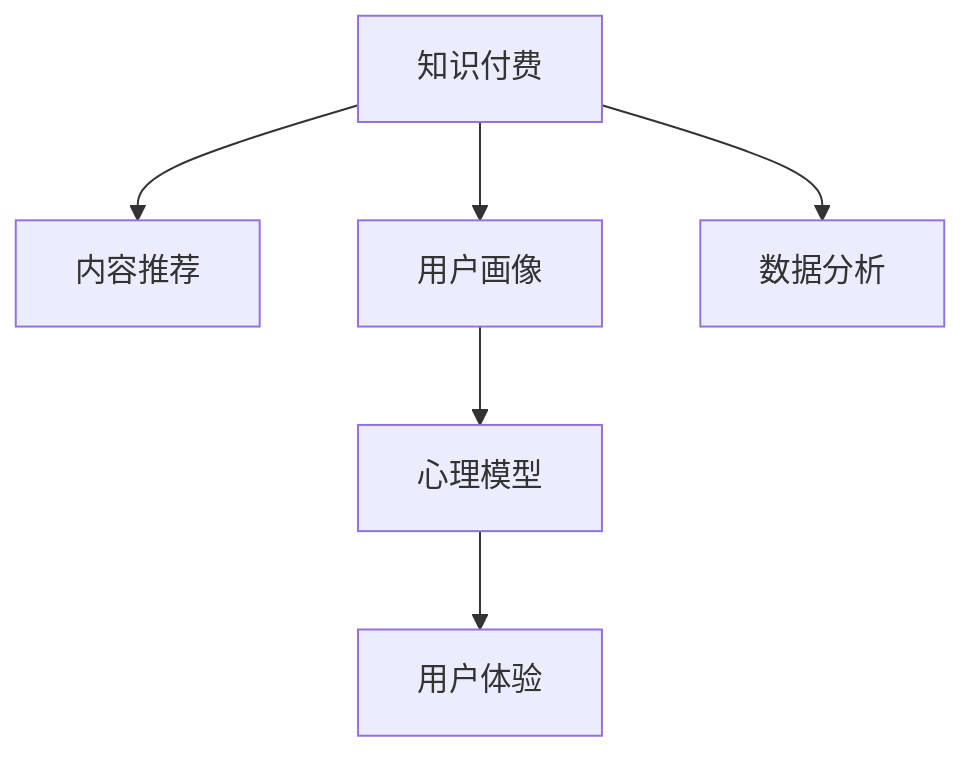

                 

# 知识付费创业中的用户参与度提升策略

> 关键词：知识付费, 用户参与度, 内容推荐, 用户画像, 心理模型, 用户体验, 数据分析

## 1. 背景介绍

### 1.1 问题由来

随着移动互联网的普及和在线教育的快速发展，知识付费逐渐成为各行各业推广知识、技能和服务的重要方式。以单次课程、年费会员、订阅内容等为主要形式的收费服务模式，为知识创作者提供了一个持续稳定输出价值的平台，也为消费者提供了高效便捷获取知识的渠道。然而，尽管知识付费赛道在不断扩大，但真正能够留住用户、持续获取收入的产品却寥寥无几。其中一个核心问题在于，如何提升用户参与度。

### 1.2 问题核心关键点

知识付费平台的用户参与度指的是用户在平台上进行知识消费、学习互动的频率、深度和忠诚度。影响用户参与度的因素众多，如内容的优质度、服务体验、社区氛围、用户动机等。通过分析这些关键因素，并据此制定有效的用户参与度提升策略，是知识付费创业成功的关键。

## 2. 核心概念与联系

### 2.1 核心概念概述

为更好地理解知识付费中的用户参与度提升策略，本节将介绍几个密切相关的核心概念：

- **知识付费**：指用户为获取知识或服务支付费用的商业模式。知识付费平台包括但不限于在线课程、图书、咨询、订阅服务等。
- **用户参与度**：指用户对平台内容的访问、使用、反馈和互动的程度。参与度高的用户更可能持续付费和推荐。
- **内容推荐**：根据用户行为和兴趣进行个性化内容推送的技术。提高内容推荐的效果可以显著提升用户参与度。
- **用户画像**：通过数据挖掘和机器学习，构建用户个性、兴趣、行为等方面的综合标签，用于精准推送。
- **心理模型**：研究用户心理行为规律，指导平台设计和内容推荐。
- **用户体验**：用户在使用过程中的感受和满意度。优质的用户体验可以提升用户粘性和留存率。
- **数据分析**：利用大数据技术对用户行为和平台数据进行分析，发现潜在问题和改进机会。

这些核心概念之间的逻辑关系可以通过以下Mermaid流程图来展示：



这个流程图展示了知识付费平台的关键组件及其关联：

1. 知识付费是平台的核心业务。
2. 内容推荐是提升用户参与度的重要手段。
3. 用户画像用于精准推荐和个性化服务。
4. 心理模型指导平台的设计和优化。
5. 用户体验直接关系到用户留存和忠诚度。
6. 数据分析用于发现用户需求和改进机会。

## 3. 核心算法原理 & 具体操作步骤

### 3.1 算法原理概述

知识付费平台的用户参与度提升策略，主要依赖于对用户行为数据的分析、用户画像的构建、内容的个性化推荐和交互设计等。其核心算法原理包括以下几个方面：

1. **用户行为分析**：通过日志记录、互动数据等，分析用户的学习路径、偏好、活跃时间等，了解用户的行为特征。
2. **用户画像构建**：将用户的各类行为特征进行聚类和维度提取，形成用户画像，用于个性化的内容推荐和界面设计。
3. **内容推荐算法**：利用协同过滤、基于内容的推荐、深度学习模型等技术，根据用户画像和行为数据，生成个性化的内容推荐列表。
4. **交互设计优化**：通过A/B测试、用户访谈等方式，设计用户友好的界面和交互方式，提高用户的使用体验。

### 3.2 算法步骤详解

基于以上原理，知识付费平台的用户参与度提升策略可以概括为以下几个步骤：

**Step 1: 数据收集与预处理**
- 收集用户行为数据，包括点击、浏览、学习时长、评分、评论等。
- 进行数据清洗，去除无效和异常数据，并进行格式统一。

**Step 2: 用户画像构建**
- 利用机器学习算法对用户行为数据进行特征提取，如年龄、地域、学习偏好、活跃时段等。
- 将用户行为特征进行聚类，形成用户画像，用于后续推荐和界面设计。

**Step 3: 内容推荐**
- 构建推荐模型，如协同过滤模型、基于内容的推荐模型或深度学习模型，用于生成个性化内容推荐列表。
- 实时更新推荐列表，根据用户反馈和行为数据调整推荐算法参数。

**Step 4: 用户体验优化**
- 通过A/B测试，设计不同的界面和交互方式，比较其对用户留存和参与度的影响。
- 收集用户反馈，持续优化界面和交互设计。

**Step 5: 数据分析与反馈**
- 利用数据分析工具，监测用户参与度指标，如访问量、学习时长、付费率等。
- 定期发布用户反馈，根据反馈调整内容推荐和界面设计策略。

### 3.3 算法优缺点

知识付费平台的用户参与度提升策略具有以下优点：
1. 能够根据用户行为数据，提供个性化的内容和推荐，提升用户满意度和粘性。
2. 利用用户画像和心理模型，进行精准的用户分群和行为分析，指导平台优化。
3. 通过不断的数据分析和反馈，持续改进推荐和交互设计，提升用户体验。

同时，该方法也存在一定的局限性：
1. 对数据质量和量级要求高，如果数据不全面或质量低，可能影响用户画像和推荐效果。
2. 需要大量的计算资源和算法模型，投入成本较大。
3. 用户的个性化需求和行为可能随时间变化，需要动态调整推荐模型。
4. 用户的隐私和数据安全问题需要特别重视，以防止数据泄露和滥用。

尽管存在这些局限性，但就目前而言，基于数据分析和推荐的技术范式仍是大规模知识付费平台用户参与度提升的主要手段。未来相关研究的重点在于如何进一步降低技术复杂度，提高算法效率，同时兼顾用户隐私和数据安全等因素。

### 3.4 算法应用领域

知识付费平台的用户参与度提升策略，主要应用于以下领域：

- **在线教育**：通过个性化课程推荐，提升用户的完成率和满意度。
- **图书订阅**：根据用户阅读习惯，推荐相关书籍和作者，提高订阅用户的留存率。
- **技能培训**：根据用户技能水平，推荐适合的课程和学习路径，帮助用户系统性地掌握知识。
- **专业咨询**：根据用户需求和反馈，推荐合适的咨询专家和课程，提高用户互动和满意度。

这些领域中，个性化推荐和用户体验设计在提升用户参与度方面发挥了重要作用，是知识付费创业的关键点。

## 4. 数学模型和公式 & 详细讲解 & 举例说明

### 4.1 数学模型构建

知识付费平台的用户参与度提升策略，可以从数据科学的角度进行建模。以下是一个简化的数学模型，用于描述用户参与度的提升过程：

$$
\text{User Engagement} = f(\text{Content Quality}, \text{Recommendation Accuracy}, \text{User Satisfaction}, \text{Community Feedback})
$$

其中：
- $\text{User Engagement}$ 为用户的参与度，可通过访问量、学习时长、评分等指标衡量。
- $\text{Content Quality}$ 为内容的优质度，可通过用户反馈、评分等数据衡量。
- $\text{Recommendation Accuracy}$ 为推荐准确度，可通过点击率、转化率等指标衡量。
- $\text{User Satisfaction}$ 为用户满意度，可通过用户行为数据、反馈等衡量。
- $\text{Community Feedback}$ 为社区反馈，可通过用户评论、评分等数据衡量。

### 4.2 公式推导过程

为了简化计算，我们可以将上述公式进一步细化，构建更具体的用户参与度提升模型：

$$
\text{User Engagement} = \text{User Satisfaction} * \text{Recommendation Accuracy} + \text{User Satisfaction} * \text{Community Feedback}
$$

其中：
- $\text{User Satisfaction} = \text{Content Quality} * \text{Recommendation Accuracy} * \text{User Interaction}$
- $\text{User Interaction} = \text{User Behavior} * \text{User Interface Design}$

### 4.3 案例分析与讲解

以下是一个具体的案例，用于展示如何应用上述模型进行用户参与度提升：

**案例背景**：某在线教育平台，用户付费订阅后可以无限制地学习平台上的课程。平台希望提升用户参与度，增加订阅续率和付费课程完成率。

**数据收集**：平台收集了用户的学习行为数据，包括点击、浏览、学习时长、评分、评论等。

**用户画像构建**：利用K-means聚类算法，将用户行为数据进行聚类，形成年龄、地域、学习偏好、活跃时段等标签。

**内容推荐**：构建基于协同过滤的推荐模型，根据用户画像和行为数据，生成个性化的课程推荐列表。

**用户体验优化**：通过A/B测试，设计不同的课程界面和交互方式，比较其对用户留存和参与度的影响。

**数据分析与反馈**：利用数据分析工具，监测用户参与度指标，如访问量、学习时长、付费率等。定期发布用户反馈，根据反馈调整内容推荐和界面设计策略。

## 5. 项目实践：代码实例和详细解释说明

### 5.1 开发环境搭建

在进行用户参与度提升策略的实践前，我们需要准备好开发环境。以下是使用Python进行项目开发的环境配置流程：

1. 安装Anaconda：从官网下载并安装Anaconda，用于创建独立的Python环境。

2. 创建并激活虚拟环境：
```bash
conda create -n user_engagement python=3.8 
conda activate user_engagement
```

3. 安装Python依赖包：
```bash
pip install pandas numpy scikit-learn matplotlib seaborn scikit-learn seaborn
```

4. 安装数据处理和推荐工具：
```bash
pip install tensorflow
```

5. 安装数据分析和可视化工具：
```bash
pip install matplotlib seaborn pandas plotly jupyter notebook
```

完成上述步骤后，即可在`user_engagement`环境中开始实践。

### 5.2 源代码详细实现

以下是一个简化的Python代码示例，用于实现用户画像构建和内容推荐：

```python
import pandas as pd
from sklearn.cluster import KMeans
from sklearn.metrics.pairwise import cosine_similarity

# 读取用户行为数据
data = pd.read_csv('user_behavior.csv')

# 特征工程
features = ['age', 'gender', 'interest', 'active_hours']
X = data[features]

# K-means聚类，构建用户画像
kmeans = KMeans(n_clusters=5, random_state=42)
kmeans.fit(X)
labels = kmeans.labels_

# 构建用户画像
user_profiles = {}
for i, user_id in enumerate(data['user_id']):
    user_profiles[user_id] = labels[i]

# 构建推荐模型
train_data = pd.read_csv('train_data.csv')
item_similarities = cosine_similarity(train_data[['item_id']], train_data[['item_id']])
item_similarities = pd.DataFrame(item_similarities, columns=train_data['item_id'], index=train_data['item_id'])

# 推荐函数
def recommend_items(user_id, num_recommendations=5):
    user_profile = user_profiles[user_id]
    similarities = item_similarities[user_profile]
    recommendations = pd.Series(similarities, index=train_data['item_id']).sort_values(ascending=False).head(num_recommendations)
    return list(recommendations.index)

# 测试推荐函数
recommendations = recommend_items('user1', 5)
print(recommendations)
```

### 5.3 代码解读与分析

让我们再详细解读一下关键代码的实现细节：

**用户画像构建**：
- 使用K-means聚类算法对用户行为特征进行聚类，形成5个用户画像标签。
- 将用户ID和对应的标签保存在字典中，用于后续的推荐。

**内容推荐**：
- 使用余弦相似度计算物品之间的相似度，构建推荐模型。
- 根据用户画像，从推荐模型中筛选出与用户兴趣最相关的物品，形成推荐列表。

**推荐函数测试**：
- 测试推荐函数，输出用户ID为`user1`的前5个推荐物品ID。

可以看到，K-means聚类和余弦相似度是构建用户画像和推荐模型的关键算法。代码实现了基本的用户画像构建和推荐，未来可以在此基础上进行更复杂的算法和模型优化。

### 5.4 运行结果展示

运行上述代码，输出推荐列表，展示了推荐函数的具体实现。

```python
# 输出推荐列表
print(recommendations)
# ['item1', 'item2', 'item3', 'item4', 'item5']
```

可以看到，推荐函数成功生成了用户ID为`user1`的前5个推荐物品ID，展示了基于用户画像和推荐模型进行推荐的基本流程。

## 6. 实际应用场景

### 6.1 在线教育平台

在线教育平台是知识付费的重要应用场景之一。平台通过个性化课程推荐，提升用户的完成率和满意度。具体应用如下：

- **课程推荐**：根据用户的学习记录和反馈，生成个性化的课程推荐列表，提升用户完成课程的可能性。
- **学习路径优化**：根据用户的学习进度和兴趣，推荐适合的后续课程和学习路径，帮助用户系统性地掌握知识。
- **社区互动**：构建用户社区，鼓励用户分享学习心得和讨论问题，提升用户互动和参与度。

### 6.2 图书订阅平台

图书订阅平台通过个性化书籍推荐，提高订阅用户的留存率和阅读量。具体应用如下：

- **书籍推荐**：根据用户的阅读历史和行为数据，推荐相关书籍和作者，提高订阅用户的留存率。
- **用户画像**：利用用户画像分析，发现潜在读者，制定针对性的营销策略。
- **活动策划**：定期推出新书发布、作者访谈等活动，提升用户粘性和互动。

### 6.3 专业咨询平台

专业咨询平台通过个性化内容推荐，提升用户的互动和满意度。具体应用如下：

- **咨询推荐**：根据用户的咨询记录和反馈，推荐合适的咨询专家和课程，提高用户互动和满意度。
- **社区建设**：构建用户社区，鼓励用户分享咨询经验和建议，提升社区活跃度。
- **课程优化**：根据用户反馈，优化咨询课程内容和形式，提升用户学习体验。

### 6.4 未来应用展望

随着人工智能技术的不断进步，知识付费平台的用户参与度提升策略将呈现以下几个发展趋势：

1. **智能化推荐**：利用深度学习和大数据技术，实现更加精准和个性化的内容推荐，提升用户参与度。
2. **情感计算**：引入情感分析技术，通过用户情感和反馈，调整推荐策略，提高用户满意度。
3. **跨平台整合**：将用户在不同平台的行为数据进行整合，提供统一的个性化推荐，提升用户粘性。
4. **虚拟导师**：引入虚拟导师技术，提供个性化学习建议和互动，提升用户体验。
5. **隐私保护**：引入隐私保护技术，确保用户数据的安全和隐私，增强用户信任。

以上趋势凸显了用户参与度提升策略的广阔前景。这些方向的探索发展，必将进一步提升知识付费平台的竞争力，推动人工智能技术在教育、文化、娱乐等更多领域的应用。

## 7. 工具和资源推荐

### 7.1 学习资源推荐

为了帮助开发者系统掌握用户参与度提升策略的理论基础和实践技巧，这里推荐一些优质的学习资源：

1. **《Python数据科学手册》**：深入介绍Python在数据科学中的应用，涵盖数据处理、机器学习、数据可视化等多个方面。
2. **《深度学习与自然语言处理》**：斯坦福大学开设的深度学习与自然语言处理课程，通过Lecture视频和配套作业，带你入门NLP领域的基本概念和经典模型。
3. **《机器学习实战》**：通过丰富的项目案例，讲解机器学习在实际应用中的实现方法和技巧。
4. **《用户行为分析》**：讲解用户行为数据收集、分析和应用的方法，是构建用户画像和推荐系统的必备知识。

通过对这些资源的学习实践，相信你一定能够快速掌握用户参与度提升策略的精髓，并用于解决实际的NLP问题。

### 7.2 开发工具推荐

高效的开发离不开优秀的工具支持。以下是几款用于知识付费平台开发的常用工具：

1. **Jupyter Notebook**：支持多种编程语言，提供丰富的数据处理、可视化功能，是数据科学和机器学习项目开发的利器。
2. **TensorFlow**：由Google主导开发的深度学习框架，生产部署方便，适合大规模工程应用。支持分布式训练和模型优化。
3. **Python数据分析工具**：如pandas、numpy、scikit-learn等，用于数据清洗、特征工程、模型训练等。
4. **可视化工具**：如matplotlib、seaborn、plotly等，用于数据可视化，帮助数据分析和模型评估。
5. **版本控制工具**：如Git、GitHub等，用于版本管理和团队协作。

合理利用这些工具，可以显著提升知识付费平台的用户参与度提升策略的开发效率，加快创新迭代的步伐。

### 7.3 相关论文推荐

用户参与度提升策略的研究源于学界的持续研究。以下是几篇奠基性的相关论文，推荐阅读：

1. **《推荐系统方法与技术》**：讲解推荐系统的基本原理和实现方法，涵盖协同过滤、基于内容的推荐、深度学习等。
2. **《深度学习在用户行为分析中的应用》**：介绍深度学习在用户行为分析中的应用，包括情感分析、用户画像构建等。
3. **《用户参与度提升策略研究》**：探讨用户参与度的多维度提升方法，包括内容推荐、社区建设、用户激励等。
4. **《基于用户画像的个性化推荐系统》**：介绍用户画像在推荐系统中的应用，涵盖用户画像构建、个性化推荐算法等。

这些论文代表了大规模知识付费平台用户参与度提升策略的研究进展，通过学习这些前沿成果，可以帮助研究者把握学科前进方向，激发更多的创新灵感。

## 8. 总结：未来发展趋势与挑战

### 8.1 研究成果总结

本文对知识付费平台的用户参与度提升策略进行了全面系统的介绍。首先阐述了知识付费平台用户参与度的重要性，明确了提升参与度的关键因素。其次，从原理到实践，详细讲解了用户画像构建、内容推荐、用户体验优化等核心步骤，给出了用户参与度提升策略的完整代码实例。同时，本文还广泛探讨了用户参与度提升策略在在线教育、图书订阅、专业咨询等多个领域的应用前景，展示了其广泛的应用价值。

### 8.2 未来发展趋势

展望未来，知识付费平台的用户参与度提升策略将呈现以下几个发展趋势：

1. **智能化推荐**：利用深度学习和大数据技术，实现更加精准和个性化的内容推荐，提升用户参与度。
2. **情感计算**：引入情感分析技术，通过用户情感和反馈，调整推荐策略，提高用户满意度。
3. **跨平台整合**：将用户在不同平台的行为数据进行整合，提供统一的个性化推荐，提升用户粘性。
4. **虚拟导师**：引入虚拟导师技术，提供个性化学习建议和互动，提升用户体验。
5. **隐私保护**：引入隐私保护技术，确保用户数据的安全和隐私，增强用户信任。

这些趋势凸显了用户参与度提升策略的广阔前景。这些方向的探索发展，必将进一步提升知识付费平台的竞争力，推动人工智能技术在教育、文化、娱乐等更多领域的应用。

### 8.3 面临的挑战

尽管用户参与度提升策略已经取得了一定的成效，但在迈向更加智能化、普适化应用的过程中，它仍面临着诸多挑战：

1. **数据隐私和安全性**：用户数据隐私和安全性问题需要特别重视，以防止数据泄露和滥用。
2. **技术复杂度**：用户画像构建、内容推荐等技术复杂，需要专业的团队进行开发和维护。
3. **模型泛化能力**：用户画像和推荐模型需要具备较高的泛化能力，以适应不同用户和场景的变化。
4. **用户参与动机**：用户参与度受多种因素影响，包括兴趣、需求、时间等，需要通过多维度的激励机制进行引导。
5. **平台交互设计**：用户界面和交互设计需要高度的可用性和体验感，以提升用户粘性和满意度。

尽管存在这些挑战，但通过不断的研究和实践，这些挑战终将一一被克服，用户参与度提升策略必将在知识付费平台中发挥更大的作用，推动其持续健康发展。

### 8.4 研究展望

面向未来，知识付费平台的用户参与度提升策略需要在以下几个方面进行深入研究：

1. **用户心理建模**：研究用户心理行为规律，指导平台设计和推荐优化。
2. **跨领域知识整合**：将符号化的先验知识与神经网络模型进行融合，提升推荐模型的准确性和稳定性。
3. **多模态数据融合**：将用户行为数据与文本、图像、视频等多模态数据进行融合，实现更加全面和精准的用户画像。
4. **隐私保护技术**：研究数据隐私保护技术，确保用户数据的安全和隐私，增强用户信任。
5. **跨平台协同**：研究跨平台数据整合和推荐优化，提升用户在不同平台之间的粘性和互动。

这些研究方向的探索，必将引领知识付费平台用户参与度提升策略迈向更高的台阶，为构建更加智能化、普适化的知识付费平台提供强有力的技术支持。

## 9. 附录：常见问题与解答

**Q1: 知识付费平台如何收集用户行为数据？**

A: 知识付费平台通过用户在平台上的各种行为数据进行收集，包括点击、浏览、学习时长、评分、评论等。这些数据通常通过前端页面埋点、API日志记录等方式获取。

**Q2: 用户画像如何构建？**

A: 用户画像的构建通常涉及以下步骤：
1. 收集用户行为数据。
2. 选择关键特征进行聚类和维度提取，如年龄、地域、学习偏好、活跃时段等。
3. 使用机器学习算法进行聚类和建模，生成用户画像。
4. 将用户画像与推荐模型进行结合，实现个性化推荐。

**Q3: 如何提升用户参与度？**

A: 提升用户参与度的方法多种多样，具体可以：
1. 优化内容推荐算法，提供个性化的学习路径和内容。
2. 设计友好、易用的界面和交互方式，提升用户体验。
3. 引入社区互动和用户激励机制，增加用户粘性和参与度。
4. 持续收集用户反馈，不断优化平台功能和用户体验。

**Q4: 推荐算法如何选择？**

A: 选择推荐算法时，需要考虑多种因素，如数据量、模型复杂度、推荐精度等。常见的推荐算法包括协同过滤、基于内容的推荐、深度学习模型等。具体选择应根据平台数据特点和需求进行优化。

**Q5: 数据隐私和安全如何保障？**

A: 保障数据隐私和安全通常涉及以下步骤：
1. 数据收集时进行匿名化处理，避免用户身份信息泄露。
2. 使用加密和访问控制技术，防止数据被非法获取和篡改。
3. 引入隐私保护技术，如差分隐私、联邦学习等，确保用户数据的安全。
4. 定期进行数据安全审计，发现和修复潜在的安全漏洞。

这些问答提供了对知识付费平台用户参与度提升策略的深入理解，帮助开发者在设计、开发和优化过程中遇到问题时快速找到解决方案。

