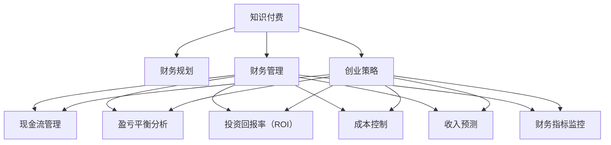

                 

# 知识付费创业中的财务规划与管理

> 关键词：知识付费,财务规划,财务管理,创业策略,现金流管理,盈亏平衡分析,投资回报率,成本控制,收入预测,财务指标监控,财务管理工具

## 1. 背景介绍

### 1.1 问题由来
在数字化时代，知识和信息的价值日益凸显，知识付费作为互联网经济的新形态，正逐渐成为一种主流消费方式。尤其是在教育、专业培训、内容订阅等领域，用户愿意为高质量的内容付费，以获取专业见解和实用技能。然而，知识付费创业项目要想在竞争激烈的市场中脱颖而出，不仅需要优质的内容和专业的服务，还需要科学合理的财务规划与高效的管理。财务规划不仅能确保企业的可持续发展，还能帮助创业者优化资源配置，提高投资回报率。

### 1.2 问题核心关键点
1. **财务规划的重要性**：在知识付费创业中，合理的财务规划能够帮助企业建立良好的资金使用体系，有效控制成本，优化资源配置。
2. **现金流管理**：知识付费创业的现金流管理至关重要，良好的现金流管理能够确保企业的运营稳定，避免资金链断裂的风险。
3. **盈亏平衡分析**：理解盈亏平衡点有助于企业制定合理的定价策略，确保业务盈利。
4. **投资回报率（ROI）**：衡量投资回报率是判断知识付费创业项目经济效益的重要指标，直接影响企业的长期发展。
5. **成本控制**：有效的成本控制策略能够降低运营成本，提高企业的盈利能力。
6. **收入预测与财务指标监控**：精确的收入预测和持续的财务指标监控，有助于企业及时调整策略，提升经营效率。

## 2. 核心概念与联系

### 2.1 核心概念概述

为更好地理解知识付费创业中的财务规划与管理，本节将介绍几个密切相关的核心概念：

- **知识付费**：指用户为获取特定知识和信息而支付的费用，常见的形式包括在线课程、电子书、专业咨询等。
- **财务规划**：指企业对未来财务活动和财务成果的科学规划与预测。财务规划贯穿企业的经营活动，是企业财务管理的基础。
- **财务管理**：指对企业的财务活动进行组织、协调、控制和监督，包括资金管理、成本管理、资产管理、利润管理等。
- **创业策略**：指创业者在创业过程中制定的经营方针和实施措施，涵盖市场定位、产品定位、营销策略等。
- **现金流管理**：指对企业现金流入与流出的管理，确保企业资金的合理流动。
- **盈亏平衡分析**：指通过计算达到盈亏平衡点的销售额，帮助企业制定合理的定价策略。
- **投资回报率（ROI）**：指企业通过投资所获得的收益与投资成本的比率，是衡量投资效益的重要指标。
- **成本控制**：指通过优化资源配置、降低不必要的支出，提高企业运营效率和盈利能力。
- **收入预测**：指基于历史数据和市场分析，预测未来收入的变化趋势。
- **财务指标监控**：指持续跟踪和分析企业的关键财务指标，及时发现问题并采取措施。

这些核心概念之间的逻辑关系可以通过以下Mermaid流程图来展示：



这个流程图展示了几大核心概念之间的联系：

1. 知识付费创业项目与财务规划和财务管理直接相关，影响企业的资金使用和盈利能力。
2. 财务管理下的现金流管理、盈亏平衡分析、投资回报率（ROI）、成本控制、收入预测和财务指标监控等，是财务管理的重要组成部分。
3. 创业策略贯穿企业管理的各个环节，对企业的长期发展至关重要。

## 3. 核心算法原理 & 具体操作步骤
### 3.1 算法原理概述

知识付费创业中的财务规划与管理，涉及多个方面的数学模型和算法原理。以下将介绍几个核心概念的算法原理：

1. **现金流模型**：现金流模型用于预测企业现金流的变化趋势，通常包括现金流入、现金流出和净现金流等关键变量。
2. **盈亏平衡分析模型**：盈亏平衡分析模型通过计算达到盈亏平衡点的销售额，帮助企业制定合理的定价策略。
3. **投资回报率（ROI）模型**：ROI模型用于评估投资项目的经济效益，计算公式为：ROI = (收益 - 成本) / 成本。
4. **成本控制模型**：成本控制模型通过优化资源配置，降低不必要的支出，提高企业运营效率和盈利能力。
5. **收入预测模型**：收入预测模型基于历史数据和市场分析，预测未来收入的变化趋势，常见的方法包括时间序列分析、回归分析等。

### 3.2 算法步骤详解

基于上述算法原理，知识付费创业中的财务规划与管理可以按照以下步骤进行：

**Step 1: 数据收集与整理**

- 收集企业的历史财务数据，包括收入、支出、现金流等。
- 收集市场相关的数据，如行业趋势、用户需求等。
- 整理和清洗数据，确保数据的准确性和完整性。

**Step 2: 财务规划**

- 制定长期和短期的财务目标，确保目标的合理性和可行性。
- 设定财务预算，包括收入预算、支出预算和现金流预算。
- 根据目标和预算，制定资源配置策略，优化资源利用。

**Step 3: 现金流管理**

- 监控现金流入和流出的情况，确保现金流量的稳定。
- 制定现金流预测模型，预测未来的现金流变化。
- 根据现金流预测结果，制定现金管理策略，确保现金流的持续性。

**Step 4: 盈亏平衡分析**

- 计算盈亏平衡点，即达到盈亏平衡的销售额。
- 根据盈亏平衡点，制定合理的定价策略，确保业务的盈利性。
- 分析不同市场条件下的盈亏平衡点，优化定价策略。

**Step 5: 投资回报率（ROI）分析**

- 计算投资项目的ROI，评估项目的经济效益。
- 分析ROI的影响因素，制定改进策略，提升投资效益。
- 根据ROI结果，优化投资决策，提高投资回报率。

**Step 6: 成本控制**

- 分析企业的各项成本，找出成本高的项目。
- 制定成本控制策略，降低不必要的支出。
- 持续监控成本控制效果，确保成本控制在目标范围内。

**Step 7: 收入预测**

- 基于历史数据和市场分析，预测未来的收入变化。
- 制定收入预测模型，确保预测的准确性和可靠性。
- 根据收入预测结果，调整经营策略，确保业务增长。

**Step 8: 财务指标监控**

- 监控企业的关键财务指标，如收入、利润、现金流等。
- 分析财务指标的变化趋势，及时发现问题。
- 根据财务指标的变化，制定调整措施，确保企业的财务健康。

### 3.3 算法优缺点

知识付费创业中的财务规划与管理方法具有以下优点：

1. **科学性与系统性**：通过系统的财务规划与管理，企业能够更好地掌握财务状况，优化资源配置。
2. **实时性与动态性**：财务指标的实时监控和动态调整，帮助企业快速应对市场变化。
3. **成本效益**：有效的成本控制策略，降低运营成本，提高企业的盈利能力。

同时，这些方法也存在一定的局限性：

1. **数据依赖**：财务规划与管理高度依赖于数据的质量和完整性，数据的偏差可能导致决策失误。
2. **复杂性**：复杂的财务模型和算法，需要专业的财务人员进行理解和实施。
3. **市场变化**：市场条件的变化可能导致财务预测模型的失效，需要进行不断的调整和优化。
4. **技术门槛**：需要一定的技术基础，特别是对财务软件和工具的掌握。

尽管存在这些局限性，但就目前而言，这些方法仍然是知识付费创业中不可或缺的一部分，对于企业的长期发展具有重要意义。未来相关研究的重点在于如何进一步简化这些方法，降低技术门槛，提高其可操作性。

### 3.4 算法应用领域

知识付费创业中的财务规划与管理方法，适用于以下多个领域：

1. **教育培训**：针对在线课程、教育软件等知识付费项目，进行科学的财务规划和管理。
2. **内容订阅**：对于电子书、音频课程等内容的订阅服务，需要进行精准的收入预测和成本控制。
3. **专业咨询**：对于专业咨询服务和培训课程，进行合理的定价和成本控制，确保业务的盈利性。
4. **企业培训**：对于企业内部的培训项目，进行科学的预算管理和现金流管理。

这些方法不仅能够帮助企业实现盈利，还能提升其市场竞争力，使其在激烈的市场竞争中脱颖而出。

## 4. 数学模型和公式 & 详细讲解 & 举例说明

### 4.1 数学模型构建

在知识付费创业中，财务规划与管理涉及多个数学模型，以下对其中的关键模型进行详细构建和讲解。

**现金流模型**

现金流模型用于预测企业的现金流入和流出情况。假设企业有N个项目，每个项目的现金流入和流出分别为CI和CO，初始现金流为C0，则现金流模型可以表示为：

$$
CF(t) = \sum_{i=1}^{N} (CI_i - CO_i) + C_0
$$

其中，CF(t) 表示在第t年企业的净现金流，CI_i和CO_i分别表示第i个项目的现金流入和流出。

**盈亏平衡分析模型**

盈亏平衡分析模型通过计算达到盈亏平衡点的销售额，帮助企业制定合理的定价策略。假设企业的固定成本为F，变动成本率为V，销售价格为P，单位产品成本为C，则盈亏平衡点S的计算公式为：

$$
S = \frac{F}{P - V - C}
$$

**投资回报率（ROI）模型**

ROI模型用于评估投资项目的经济效益，计算公式为：

$$
ROI = \frac{(收入 - 成本)}{成本}
$$

**成本控制模型**

成本控制模型通过优化资源配置，降低不必要的支出，提高企业运营效率和盈利能力。假设企业的总成本为C，其中固定成本为F，变动成本率为V，单位产品成本为C，则成本控制的目标为最小化C，即：

$$
C = F + V \times S + C \times S
$$

**收入预测模型**

收入预测模型基于历史数据和市场分析，预测未来收入的变化趋势。假设企业过去n年的收入分别为R1, R2, ..., Rn，则收入预测模型可以表示为：

$$
R_{n+1} = a \times R_n + b
$$

其中，a和b为模型参数，可以通过历史数据进行估计。

### 4.2 公式推导过程

以下对上述模型的公式推导过程进行详细讲解：

**现金流模型**

现金流模型较为简单，表示企业在某年的净现金流等于各项目的现金流入和流出的净和加上初始现金流。

**盈亏平衡分析模型**

盈亏平衡点S的计算公式可以通过求解方程P \times S - F - V \times S - C \times S = 0来推导。

**投资回报率（ROI）模型**

ROI模型的计算公式直接反映了企业的收益与成本之比。

**成本控制模型**

成本控制模型通过优化资源配置，降低不必要的支出，提高企业运营效率和盈利能力。目标是最小化总成本C，即C = F + V \times S + C \times S。

**收入预测模型**

收入预测模型基于时间序列分析，假设收入随着时间的推移呈现线性增长趋势。

### 4.3 案例分析与讲解

**案例1：在线教育平台的财务规划与管理**

一家在线教育平台希望进行财务规划与管理，采用上述模型进行分析和决策。

- **数据收集**：收集过去一年的收入、支出、现金流等财务数据。
- **现金流模型**：根据数据，构建现金流模型，预测未来的现金流变化。
- **盈亏平衡分析**：计算盈亏平衡点，制定合理的定价策略。
- **ROI分析**：评估新项目的经济效益，选择最有利可图的项目。
- **成本控制**：分析各项目的成本构成，优化资源配置。
- **收入预测**：基于历史数据，预测未来的收入变化趋势。
- **财务指标监控**：实时监控关键财务指标，确保财务健康。

通过系统的财务规划与管理，该在线教育平台能够更好地掌握财务状况，优化资源配置，提高运营效率和盈利能力。

**案例2：内容订阅服务的收入预测**

一家内容订阅服务平台希望进行收入预测，采用收入预测模型进行分析和决策。

- **数据收集**：收集过去一年的订阅收入数据。
- **模型构建**：基于时间序列分析，构建收入预测模型，预测未来的收入变化。
- **调整策略**：根据预测结果，调整定价策略，确保收入的稳定增长。
- **监控效果**：实时监控收入预测模型的效果，确保预测的准确性。

通过科学的收入预测和策略调整，该内容订阅服务平台能够更好地应对市场变化，确保业务的稳定发展。

## 5. 项目实践：代码实例和详细解释说明

### 5.1 开发环境搭建

在进行财务规划与管理项目实践前，我们需要准备好开发环境。以下是使用Python进行财务规划与管理的环境配置流程：

1. 安装Anaconda：从官网下载并安装Anaconda，用于创建独立的Python环境。

2. 创建并激活虚拟环境：
```bash
conda create -n finance-env python=3.8 
conda activate finance-env
```

3. 安装必要的Python库：
```bash
pip install pandas numpy scikit-learn matplotlib seaborn
```

4. 安装R语言（可选）：
```bash
conda install rpy2
```

完成上述步骤后，即可在`finance-env`环境中开始财务规划与管理实践。

### 5.2 源代码详细实现

以下是一个使用Python进行财务规划与管理的代码实例，主要涉及现金流模型、盈亏平衡分析和成本控制等核心功能。

```python
import pandas as pd
import numpy as np

# 假设企业有2个项目，每个项目的现金流入和流出
projects = [
    {'name': 'Project A', 'CI': 50000, 'CO': 20000},
    {'name': 'Project B', 'CI': 60000, 'CO': 30000}
]

# 初始现金流
initial_cash_flow = 10000

# 计算总现金流
total_cash_flow = sum(project['CI'] - project['CO'] for project in projects) + initial_cash_flow
print(f"总现金流：{total_cash_flow}")

# 假设固定成本为100000，变动成本率为0.2，单位产品成本为50
fixed_costs = 100000
variable_cost_rate = 0.2
unit_product_cost = 50

# 计算盈亏平衡点
break_even_point = fixed_costs / (1 - variable_cost_rate - unit_product_cost)
print(f"盈亏平衡点：{break_even_point}")

# 假设销售价格为1000，单位产品成本为300
sales_price = 1000
unit_product_cost = 300

# 计算ROI
ROI = ((sales_price - unit_product_cost) / unit_product_cost) * 100
print(f"ROI：{ROI}%")

# 假设每个项目销售10000个单位
project_a_sales = 10000
project_b_sales = 10000

# 计算总成本
total_cost = fixed_costs + (variable_cost_rate * (project_a_sales + project_b_sales)) + (unit_product_cost * (project_a_sales + project_b_sales))
print(f"总成本：{total_cost}")

# 计算每个项目的贡献毛益
project_a_contribution_margin = (sales_price - unit_product_cost) * project_a_sales
project_b_contribution_margin = (sales_price - unit_product_cost) * project_b_sales
total_contribution_margin = project_a_contribution_margin + project_b_contribution_margin

# 计算每个项目的盈亏平衡点
project_a_break_even_point = fixed_costs / (sales_price - variable_cost_rate - unit_product_cost - unit_product_cost)
project_b_break_even_point = fixed_costs / (sales_price - variable_cost_rate - unit_product_cost - unit_product_cost)
total_break_even_point = fixed_costs / (sales_price - variable_cost_rate - unit_product_cost - unit_product_cost)

print(f"Project A盈亏平衡点：{project_a_break_even_point}")
print(f"Project B盈亏平衡点：{project_b_break_even_point}")
print(f"总盈亏平衡点：{total_break_even_point}")

# 假设市场预测未来收入为20000
future_income = 20000

# 计算未来收入预测
future_income_predict = future_income / (1 + 0.1) + future_income / (1 + 0.1)**2
print(f"未来收入预测：{future_income_predict}")
```

### 5.3 代码解读与分析

让我们再详细解读一下关键代码的实现细节：

**数据定义**：
- `projects`列表：定义了企业的两个项目，每个项目包含现金流入和流出数据。
- `initial_cash_flow`变量：定义了企业的初始现金流。

**现金流计算**：
- `total_cash_flow`变量：计算企业的总现金流，即每个项目的现金流入和流出加上初始现金流。

**盈亏平衡分析**：
- `break_even_point`变量：计算盈亏平衡点，即企业达到盈亏平衡的销售额。

**投资回报率（ROI）计算**：
- `ROI`变量：计算投资项目的ROI，即收益与成本之比。

**成本控制**：
- `total_cost`变量：计算企业的总成本，即固定成本加上变动成本和单位产品成本的总和。

**每个项目的贡献毛益**：
- `project_a_contribution_margin`和`project_b_contribution_margin`变量：计算每个项目的贡献毛益，即销售价格减去单位产品成本后的差额乘以销售量。
- `total_contribution_margin`变量：计算企业的总贡献毛益。

**每个项目的盈亏平衡点**：
- `project_a_break_even_point`和`project_b_break_even_point`变量：计算每个项目的盈亏平衡点。
- `total_break_even_point`变量：计算企业的总盈亏平衡点。

**未来收入预测**：
- `future_income_predict`变量：基于历史数据和市场预测，计算未来的收入变化趋势。

## 6. 实际应用场景

### 6.1 智能教育平台

智能教育平台采用大语言模型进行内容生成和交互设计，可以提供个性化的学习体验。通过科学的财务规划与管理，可以确保平台的稳定运营和可持续发展。

**财务规划与管理**：
- **现金流管理**：确保平台有充足的资金支持日常运营，包括技术研发、内容更新和市场推广等。
- **盈亏平衡分析**：制定合理的定价策略，确保平台的盈利性。
- **成本控制**：优化内容生产和平台运维的资源配置，降低运营成本。
- **收入预测**：通过市场分析，预测未来的收入变化趋势，确保业务的稳定增长。
- **财务指标监控**：实时监控平台的财务健康状况，及时发现并解决问题。

**实际应用**：
- **资金管理**：智能教育平台需要大量的初期资金投入，通过科学的财务规划，确保平台的资金充足。
- **成本控制**：内容生成和交互设计需要高水平的技术和人力资源，通过成本控制策略，降低不必要的支出。
- **市场推广**：采用精准的市场推广策略，确保平台的高效运转和用户增长。

### 6.2 内容订阅平台

内容订阅平台提供高质量的电子书、在线课程等服务，通过科学的财务规划与管理，可以最大化平台的收益和用户价值。

**财务规划与管理**：
- **现金流管理**：确保平台有稳定的现金流支持内容生产和平台运维。
- **盈亏平衡分析**：制定合理的定价策略，确保平台的盈利性。
- **成本控制**：优化内容生产和平台运维的资源配置，降低运营成本。
- **收入预测**：通过市场分析，预测未来的收入变化趋势，确保业务的稳定增长。
- **财务指标监控**：实时监控平台的财务健康状况，及时发现并解决问题。

**实际应用**：
- **资金管理**：内容订阅平台需要大量的初期资金投入，通过科学的财务规划，确保平台的资金充足。
- **成本控制**：内容生产和平台运维需要高水平的技术和人力资源，通过成本控制策略，降低不必要的支出。
- **市场推广**：采用精准的市场推广策略，确保平台的高效运转和用户增长。

### 6.3 专业咨询平台

专业咨询平台提供行业分析、市场预测、战略规划等服务，通过科学的财务规划与管理，可以确保平台的稳定运营和客户满意度。

**财务规划与管理**：
- **现金流管理**：确保平台有充足的资金支持日常运营，包括市场调研、项目开发和客户服务等。
- **盈亏平衡分析**：制定合理的定价策略，确保平台的盈利性。
- **成本控制**：优化咨询服务的资源配置，降低运营成本。
- **收入预测**：通过市场分析，预测未来的收入变化趋势，确保业务的稳定增长。
- **财务指标监控**：实时监控平台的财务健康状况，及时发现并解决问题。

**实际应用**：
- **资金管理**：专业咨询平台需要大量的初期资金投入，通过科学的财务规划，确保平台的资金充足。
- **成本控制**：咨询服务需要高水平的专业知识和技能，通过成本控制策略，降低不必要的支出。
- **市场推广**：采用精准的市场推广策略，确保平台的高效运转和客户满意度。

## 7. 工具和资源推荐

### 7.1 学习资源推荐

为了帮助开发者系统掌握财务规划与管理的理论基础和实践技巧，这里推荐一些优质的学习资源：

1. **《财务管理》教材**：系统介绍财务管理的理论基础和实践应用，适合初学者和专业人士。
2. **《财务分析》课程**：提供财务分析的实用技巧和案例分析，适合有一定财务基础的读者。
3. **《财务建模》书籍**：介绍财务建模的基本方法和工具，适合从事财务工作的人员。
4. **Coursera《财务报表分析》课程**：由多所知名大学提供，涵盖财务报表分析的各个方面，适合在线学习。
5. **Khan Academy《财务基础》课程**：提供免费的基础财务课程，适合初学者学习。

通过对这些资源的学习实践，相信你一定能够快速掌握财务规划与管理的精髓，并用于解决实际的财务问题。

### 7.2 开发工具推荐

高效的开发离不开优秀的工具支持。以下是几款用于财务规划与管理开发的常用工具：

1. **Excel**：功能强大的电子表格软件，广泛应用于财务数据分析和规划。
2. **Python**：灵活的编程语言，拥有丰富的财务分析库和工具，如Pandas、NumPy、Matplotlib等。
3. **R语言**：专业的统计分析工具，拥有丰富的财务分析包，如tidyr、dplyr、ggplot2等。
4. **Tableau**：数据可视化工具，适用于复杂财务数据的分析和展示。
5. **Power BI**：强大的商业智能工具，提供数据可视化、报告生成和数据分析功能。

合理利用这些工具，可以显著提升财务规划与管理任务的开发效率，加快创新迭代的步伐。

### 7.3 相关论文推荐

财务规划与管理作为一门交叉学科，涉及财务学、经济学、管理学等多个领域。以下是几篇奠基性的相关论文，推荐阅读：

1. **《财务管理的理论基础》**：系统介绍财务管理的理论框架和方法。
2. **《财务分析：方法和工具》**：提供财务分析的实用技巧和案例分析。
3. **《财务建模：原理与实践》**：详细介绍财务建模的基本方法和工具。
4. **《财务报表分析：理论与实践》**：涵盖财务报表分析的各个方面。
5. **《财务决策支持系统：设计与实现》**：提供财务决策支持系统的设计与实现方法。

这些论文代表了大语言模型微调技术的发展脉络。通过学习这些前沿成果，可以帮助研究者把握学科前进方向，激发更多的创新灵感。

## 8. 总结：未来发展趋势与挑战

### 8.1 总结

本文对知识付费创业中的财务规划与管理方法进行了全面系统的介绍。首先阐述了知识付费创业项目中财务规划的重要性，明确了现金流管理、盈亏平衡分析、投资回报率（ROI）、成本控制、收入预测和财务指标监控等关键概念。其次，从原理到实践，详细讲解了财务规划与管理的数学模型和算法原理，给出了具体的代码实例。同时，本文还广泛探讨了财务规划与管理在智能教育、内容订阅、专业咨询等多个领域的应用前景，展示了其广阔的想象空间。最后，本文精选了财务规划与管理的各类学习资源，力求为读者提供全方位的技术指引。

通过本文的系统梳理，可以看到，科学的财务规划与管理对于知识付费创业项目的成功至关重要。合理的财务规划能够帮助企业建立良好的资金使用体系，优化资源配置，确保业务的盈利性。然而，财务规划与管理也面临着数据依赖、复杂性、市场变化和技术门槛等挑战，需要在实际应用中不断优化和改进。

### 8.2 未来发展趋势

展望未来，知识付费创业中的财务规划与管理将呈现以下几个发展趋势：

1. **智能化和自动化**：随着AI技术的发展，财务规划与管理将逐渐实现智能化和自动化，减少人工干预，提升效率和准确性。
2. **大数据分析**：大数据分析技术的广泛应用，将为财务规划与管理提供更丰富的数据来源和更精准的分析结果。
3. **跨学科融合**：财务规划与管理将与人工智能、大数据、区块链等新兴技术深度融合，提升企业的智能化水平和创新能力。
4. **国际化和本地化**：随着全球化的发展，财务规划与管理将更加注重国际化和本地化的需求，帮助企业在全球范围内开展业务。
5. **可持续发展**：财务规划与管理将更加注重企业的可持续发展，推动绿色金融和环保经济的发展。

这些趋势表明，知识付费创业中的财务规划与管理将进入一个全新的阶段，向着更加智能化、自动化、大数据化、国际化、可持续化的方向发展。

### 8.3 面临的挑战

尽管知识付费创业中的财务规划与管理方法已经取得了一定的成果，但在迈向更加智能化、普适化应用的过程中，它仍面临着诸多挑战：

1. **数据质量问题**：财务规划与管理高度依赖于数据的质量和完整性，数据的偏差可能导致决策失误。
2. **市场变化风险**：市场条件的变化可能导致财务预测模型的失效，需要进行不断的调整和优化。
3. **技术门槛**：财务规划与管理需要一定的技术基础，特别是对财务软件和工具的掌握。
4. **法规合规**：不同地区的财务法规和税务要求不同，财务规划与管理需要符合当地的法规和标准。
5. **人才短缺**：高水平的财务人员和管理人员是财务规划与管理的核心，但这类人才较为稀缺。

尽管存在这些挑战，但通过不断优化和改进，知识付费创业中的财务规划与管理技术仍然具有广阔的发展前景。未来相关研究的重点在于如何进一步简化这些方法，降低技术门槛，提高其可操作性。

### 8.4 研究展望

面对财务规划与管理面临的挑战，未来的研究需要在以下几个方面寻求新的突破：

1. **数据质量提升**：通过数据清洗和预处理技术，提升数据的质量和完整性，确保决策的准确性。
2. **预测模型优化**：引入机器学习和大数据技术，优化财务预测模型，提高其适应性和鲁棒性。
3. **智能化和自动化**：开发智能化和自动化的财务规划与管理工具，减少人工干预，提升效率和准确性。
4. **跨学科融合**：将财务规划与管理与人工智能、大数据、区块链等新兴技术深度融合，提升企业的智能化水平和创新能力。
5. **国际化和本地化**：研究不同地区财务规划与管理的方法和策略，帮助企业在全球范围内开展业务。

这些研究方向的探索，必将引领财务规划与管理技术迈向更高的台阶，为知识付费创业项目的成功提供坚实的基础。

## 9. 附录：常见问题与解答

**Q1：如何进行财务规划与管理的第一步？**

A: 财务规划与管理的第一步是数据收集与整理。收集企业的历史财务数据，包括收入、支出、现金流等，并整理和清洗数据，确保数据的准确性和完整性。

**Q2：什么是现金流管理？如何进行现金流预测？**

A: 现金流管理是对企业现金流入和流出的管理，确保现金流量的稳定。现金流预测模型可以通过历史数据和市场分析来构建，预测未来的现金流变化。

**Q3：如何计算盈亏平衡点？**

A: 盈亏平衡点是指企业达到盈亏平衡的销售额。计算公式为：盈亏平衡点 = 固定成本 / (销售价格 - 变动成本率 - 单位产品成本)。

**Q4：如何评估投资项目的投资回报率（ROI）？**

A: 投资回报率（ROI）是指企业通过投资所获得的收益与投资成本的比率。计算公式为：ROI = (收益 - 成本) / 成本。

**Q5：如何进行成本控制？**

A: 成本控制是通过优化资源配置，降低不必要的支出，提高企业运营效率和盈利能力。成本控制策略包括分析企业的各项成本，找出成本高的项目，制定改进策略。

**Q6：如何进行收入预测？**

A: 收入预测是基于历史数据和市场分析，预测未来收入的变化趋势。常见的方法包括时间序列分析、回归分析等。

**Q7：如何实时监控企业的财务健康状况？**

A: 实时监控关键财务指标，如收入、利润、现金流等，及时发现问题并采取措施。可以使用财务指标监控工具，如Excel、Tableau等，实现自动化监控。

---

作者：禅与计算机程序设计艺术 / Zen and the Art of Computer Programming

