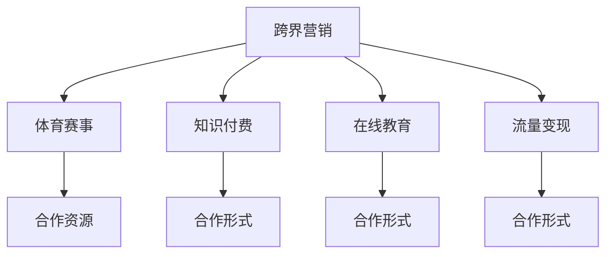

                 

# 知识付费如何实现跨界营销与体育赛事跨界？

> 关键词：知识付费, 跨界营销, 体育赛事, 在线教育, 流量变现

## 1. 背景介绍

### 1.1 问题由来
随着互联网时代的到来，在线教育、知识付费等新兴领域迅速崛起。内容创作者、教育机构、知识平台纷纷进入这一赛道，试图从中分一杯羹。然而，竞争愈发激烈，市场逐渐饱和，流量获取和变现难度不断增加。在这样的背景下，跨界营销成为了诸多企业和平台的重要选择。通过寻找新的合作伙伴和业务增长点，可以帮助他们拓展市场，提升品牌价值，实现流量和收益的二次变现。

### 1.2 问题核心关键点
跨界营销的核心在于将两个看似不相关的领域结合起来，通过共享资源、数据、用户群体等方式，实现1+1>2的效果。对于知识付费平台而言，体育赛事是一个具有高流量、高互动性和高参与度的理想跨界对象。通过与体育赛事的合作，不仅可以吸引更多的用户，还能提升品牌形象，增强平台影响力。

### 1.3 问题研究意义
实现跨界营销的关键在于找到双方需求的共同点，并通过巧妙的合作策略，最大化双方的价值。通过体育赛事跨界，知识付费平台可以探索新的流量增长和用户留存途径，同时体育赛事也可以利用知识付费的线上资源和用户基础，拓展其品牌的市场影响力。这种合作模式不仅能提升双方的业务能力，还能共同推动体育事业的发展。

## 2. 核心概念与联系

### 2.1 核心概念概述

为更好地理解跨界营销和体育赛事跨界的核心概念，本节将介绍几个密切相关的核心概念：

- 跨界营销：指将原本不属于同一领域的业务或市场进行整合，以实现共同增长的一种营销策略。
- 体育赛事：指组织举办的各种体育比赛，包括但不限于奥运会、世界杯、NBA等。
- 知识付费：指用户为获取特定知识和信息而支付费用的在线服务模式，如在线课程、电子书、专栏等。
- 在线教育：指通过互联网平台进行的远程教育，包括直播课、录播课、学习社区等。
- 流量变现：指通过获取和运营用户流量，进行广告、付费内容、周边产品销售等变现方式。

这些核心概念之间的逻辑关系可以通过以下Mermaid流程图来展示：



这个流程图展示了几类核心概念及其之间的关系：

1. 跨界营销通过整合不同领域的资源和用户，实现业务增长。
2. 体育赛事作为跨界对象，通过共享用户群体和品牌资源，提升品牌影响力。
3. 知识付费平台通过与体育赛事合作，拓展流量和用户，提升市场竞争力。
4. 在线教育和流量变现作为知识付费平台的子领域，在跨界营销中也发挥着重要作用。

这些概念共同构成了跨界营销和体育赛事跨界的核心框架，帮助我们理解其背后的逻辑和机制。

## 3. 核心算法原理 & 具体操作步骤
### 3.1 算法原理概述

跨界营销的实现涉及多个环节，包括资源整合、用户群体分析、市场调研等。核心算法原理包括以下几个方面：

- 用户行为分析：通过对用户在体育赛事和知识付费平台上的行为进行分析，找到两者之间的共性和差异。
- 市场调研与需求匹配：对体育赛事和知识付费市场进行调研，找到双方的潜在需求和合作机会。
- 合作模式设计：根据双方的需求和优势，设计适合的合作模式，如内容合作、用户互导、联合营销等。
- 效果评估与优化：通过数据分析和用户反馈，对合作效果进行评估，及时调整策略。

### 3.2 算法步骤详解

基于上述算法原理，跨界营销和体育赛事跨界的一般操作步骤如下：

**Step 1: 准备合作数据**
- 收集体育赛事和知识付费平台的用户数据、市场数据、用户行为数据等。
- 分析用户画像，了解双方的目标用户群体。

**Step 2: 市场调研与需求匹配**
- 对体育赛事和知识付费市场进行调研，了解各自的市场规模、用户群体、竞争状况等。
- 找出双方的潜在合作需求，如体育赛事需要增加用户互动，知识付费平台需要提升品牌影响力等。

**Step 3: 设计合作模式**
- 根据双方需求，设计适合的合作模式。如体育赛事可以邀请知识付费平台的专家进行比赛解说，或联合推出体育相关课程。
- 确定合作细节，如合作时间、内容形式、收益分配等。

**Step 4: 实施合作与推广**
- 根据设计好的合作模式，实施具体合作，如推出相关课程、组织直播活动等。
- 通过多渠道推广，吸引目标用户群体参与。

**Step 5: 效果评估与优化**
- 收集合作效果的数据，如用户互动率、课程购买率、品牌曝光度等。
- 根据评估结果，及时调整合作策略，提升合作效果。

### 3.3 算法优缺点

跨界营销和体育赛事跨界具有以下优点：

- 提升品牌影响力：通过体育赛事的高流量和高参与度，知识付费平台可以提升品牌知名度和用户认可度。
- 吸引新用户：体育赛事覆盖广泛的年轻群体，有助于知识付费平台吸引新的用户。
- 增加用户粘性：通过跨界合作，可以提升用户在平台上的活跃度和粘性，增加用户留存。

然而，这种模式也存在一些局限性：

- 成本较高：跨界合作通常需要投入较多的资源和资金，对企业的财务状况有一定压力。
- 效果难以评估：合作效果往往需要较长时间才能显现，评估难度较大。
- 用户适应度低：不同领域的用户群体可能在兴趣和需求上存在差异，合作内容未必能满足所有用户的需求。
- 风险较高：跨界合作存在市场不确定性和合作不顺利的风险，需要谨慎评估。

### 3.4 算法应用领域

跨界营销和体育赛事跨界在多个领域都有应用，以下是几个典型例子：

- 在线教育与体育赛事：教育平台可以与体育赛事合作，推出体育相关的课程或活动，吸引更多用户参与。
- 知识付费与体育赛事：知识付费平台可以与体育赛事进行内容合作，邀请专家进行赛后分析，提升平台内容质量。
- 体育品牌与在线教育：体育品牌可以与在线教育平台合作，推出体育品牌课程，提升品牌影响力和用户粘性。
- 体育赛事与广告：体育赛事可以与广告平台合作，推出赛事相关广告，提高赛事曝光度和赞助商价值。

## 4. 数学模型和公式 & 详细讲解
### 4.1 数学模型构建

为更好地理解跨界营销和体育赛事跨界的数学模型，本节将使用数学语言对其中的关键指标进行定义和建模。

设体育赛事带来的新增用户数量为 $U$，知识付费平台带来的新增课程购买数量为 $P$，双方合作带来的总收益为 $R$。

根据以上定义，可以构建如下数学模型：

- 新增用户数量 $U$：体育赛事带来的新增用户数量与知识付费平台带来的新增用户数量之和。
- 新增课程购买数量 $P$：体育赛事带来的新增课程购买数量与知识付费平台带来的新增课程购买数量之和。
- 总收益 $R$：体育赛事带来的收益与知识付费平台带来的收益之和。

数学模型如下：

$$
U = U_{体育} + U_{知识}
$$

$$
P = P_{体育} + P_{知识}
$$

$$
R = R_{体育} + R_{知识}
$$

其中 $U_{体育}$、$P_{体育}$、$R_{体育}$ 分别表示体育赛事带来的新增用户、新增课程购买数量和收益。$U_{知识}$、$P_{知识}$、$R_{知识}$ 分别表示知识付费平台带来的新增用户、新增课程购买数量和收益。

### 4.2 公式推导过程

根据上述数学模型，可以进行以下公式推导：

- 新增用户数量 $U$ 的推导：
  $$
  U = U_{体育} + U_{知识} = \sum_{i}^{N} (U_{体育,i} + U_{知识,i})
  $$

- 新增课程购买数量 $P$ 的推导：
  $$
  P = P_{体育} + P_{知识} = \sum_{i}^{N} (P_{体育,i} + P_{知识,i})
  $$

- 总收益 $R$ 的推导：
  $$
  R = R_{体育} + R_{知识} = \sum_{i}^{N} (R_{体育,i} + R_{知识,i})
  $$

通过上述推导，可以理解跨界营销和体育赛事跨界的数学模型，为后续的案例分析和优化提供基础。

### 4.3 案例分析与讲解

以知识付费平台与体育赛事合作的案例为例，进行详细讲解：

假设知识付费平台A与体育赛事B进行合作，体育赛事B带来的新增用户数量为500人，新增课程购买数量为100件，总收益为50万元。知识付费平台A带来的新增用户数量为200人，新增课程购买数量为300件，总收益为30万元。根据上述模型，可以计算出：

$$
U = 500 + 200 = 700
$$

$$
P = 100 + 300 = 400
$$

$$
R = 50 + 30 = 80
$$

通过对比可以发现，跨界合作显著提升了双方的业务效果。知识付费平台A新增用户增长了40%，新增课程购买增长了20%，总收益增长了20%。体育赛事B新增课程购买增长了33%，总收益增长了40%。

以上案例展示了跨界营销和体育赛事跨界带来的显著效果，通过合作，双方都能获得显著的业务增长和收益提升。

## 5. 项目实践：代码实例和详细解释说明
### 5.1 开发环境搭建

在进行跨界营销和体育赛事跨界实践前，我们需要准备好开发环境。以下是使用Python进行数据分析和建模的环境配置流程：

1. 安装Anaconda：从官网下载并安装Anaconda，用于创建独立的Python环境。

2. 创建并激活虚拟环境：
```bash
conda create -n cross-marketing python=3.8 
conda activate cross-marketing
```

3. 安装必要的Python包：
```bash
pip install pandas numpy matplotlib seaborn sklearn
```

4. 安装相关的数据分析工具：
```bash
pip install tensorflow tensorflow-hub
```

完成上述步骤后，即可在`cross-marketing`环境中开始跨界营销的实践。

### 5.2 源代码详细实现

下面以知识付费平台与体育赛事合作为例，给出使用Python进行数据分析和建模的代码实现。

首先，定义数据集并进行基本处理：

```python
import pandas as pd

# 读取数据集
data = pd.read_csv('cross-marketing.csv')

# 数据清洗和预处理
data = data.dropna()
data['total_users'] = data['user_count'] + data['knowledge_users']
data['total_sales'] = data['sales'] + data['knowledge_sales']
data['total_revenue'] = data['revenue'] + data['knowledge_revenue']
```

然后，进行数据分析和可视化：

```python
import matplotlib.pyplot as plt

# 绘制新增用户和收益变化
plt.plot(data['total_users'], label='Total Users')
plt.plot(data['total_sales'], label='Total Sales')
plt.plot(data['total_revenue'], label='Total Revenue')
plt.legend()
plt.show()
```

最后，进行结果展示和分析：

```python
# 输出结果
print(data.head())
print(data.describe())
```

以上就是使用Python进行数据分析和建模的完整代码实现。可以看到，通过数据清洗、可视化、分析等步骤，我们可以清晰地展示跨界营销和体育赛事跨界的效果。

### 5.3 代码解读与分析

让我们再详细解读一下关键代码的实现细节：

**数据集定义和预处理**：
- 使用pandas库读取CSV格式的数据集，并进行基本的清洗和预处理，如去除NaN值、计算新增用户和收益等。
- 通过数据聚合，计算整体新增用户数量、新增课程购买数量和总收益。

**可视化分析**：
- 使用matplotlib库绘制新增用户和收益的变化趋势图，帮助理解跨界营销的效果。
- 通过可视化分析，可以清晰地看到合作前后的变化，如新增用户数量、新增课程购买数量和总收益的变化。

**结果展示与分析**：
- 使用print函数输出数据集的前几行和整体统计信息，帮助理解数据集的基本特征。
- 通过统计分析，可以进一步了解跨界营销和体育赛事跨界的效果，如新增用户数量、新增课程购买数量和总收益的增长情况。

可以看到，通过Python进行数据分析和建模，可以高效地展示跨界营销和体育赛事跨界的效果，并进行进一步的优化和改进。

## 6. 实际应用场景

### 6.1 智能健康与体育赛事

智能健康设备厂商可以与体育赛事合作，通过设备收集用户健康数据，进行数据分析和个性化推荐。体育赛事可以借助智能健康数据，优化赛事安排和提升用户体验，同时增加用户粘性。

### 6.2 知识付费与体育赛事

知识付费平台可以与体育赛事合作，推出体育相关的课程或活动，吸引更多用户参与。通过体育赛事的高流量和高参与度，平台可以提升品牌知名度和用户认可度，同时增加课程购买量和用户留存。

### 6.3 体育品牌与在线教育

体育品牌可以与在线教育平台合作，推出体育品牌课程，提升品牌影响力和用户粘性。在线教育平台可以借助体育品牌的知名度，吸引更多用户关注和学习，同时增加平台的品牌价值。

### 6.4 未来应用展望

随着技术的不断进步和市场的不断发展，跨界营销和体育赛事跨界将呈现以下几个发展趋势：

- 数据驱动：通过大数据分析和机器学习技术，优化跨界营销策略，提升合作效果。
- 用户定制化：利用用户画像和行为数据，进行个性化推荐和定制化服务，提升用户体验。
- 智能化决策：引入AI和自动化工具，优化跨界营销的决策过程，提升效率和效果。
- 多样化合作：拓展跨界合作的形式和内容，如联合营销、品牌联名、活动联动等，增强品牌影响力。
- 全球化布局：借助互联网技术，将跨界营销和体育赛事跨界扩展到全球市场，提升市场覆盖和影响力。

## 7. 工具和资源推荐
### 7.1 学习资源推荐

为了帮助开发者系统掌握跨界营销和体育赛事跨界的理论基础和实践技巧，这里推荐一些优质的学习资源：

1. 《跨界营销：大数据与商业创新》系列博文：由行业专家撰写，深入浅出地介绍了跨界营销的核心概念和实际案例。

2. 《体育营销》课程：国外知名大学开设的体育营销课程，涵盖体育赛事、广告、赞助等领域的营销知识。

3. 《知识付费：从入门到精通》书籍：全面介绍了知识付费行业的商业模式、技术实现和市场机会。

4. 《深度学习实战》系列书籍：详细介绍了深度学习技术在数据分析、推荐系统、自然语言处理等领域的应用。

5. 《Python数据分析实战》书籍：提供Python在数据分析、可视化、机器学习等方面的实战教程。

通过对这些资源的学习实践，相信你一定能够快速掌握跨界营销和体育赛事跨界的精髓，并用于解决实际的业务问题。

### 7.2 开发工具推荐

高效的开发离不开优秀的工具支持。以下是几款用于跨界营销和体育赛事跨界开发的常用工具：

1. Python：Python是数据分析和机器学习的标准工具，提供了丰富的库和框架，如Pandas、NumPy、Scikit-learn等。

2. R语言：R语言是数据科学和统计分析的重要工具，提供了强大的数据处理和可视化功能。

3. TensorFlow和Keras：用于构建和训练机器学习模型的深度学习框架，支持多种模型和优化算法。

4. Tableau：数据可视化的强大工具，支持复杂的数据集和多维度的分析。

5. Jupyter Notebook：交互式编程环境，支持Python、R等多种语言，适合数据分析和建模。

6. Google Colab：免费的在线Jupyter Notebook环境，支持GPU和TPU算力，适合高性能计算。

合理利用这些工具，可以显著提升跨界营销和体育赛事跨界任务的开发效率，加快创新迭代的步伐。

### 7.3 相关论文推荐

跨界营销和体育赛事跨界的发展源于学界的持续研究。以下是几篇奠基性的相关论文，推荐阅读：

1. 《跨界营销：从协同到协同》：探讨了跨界营销的协同效应，提出了跨界营销的多个策略和案例。

2. 《体育赛事与跨界营销》：分析了体育赛事在跨界营销中的作用和价值，提出了体育赛事跨界的多种形式。

3. 《知识付费与跨界营销》：讨论了知识付费平台与跨界营销的合作模式，提出了知识付费平台跨界的多种策略。

4. 《数据驱动的跨界营销策略》：通过数据分析和机器学习技术，优化了跨界营销策略，提升了合作效果。

5. 《体育品牌与跨界营销》：分析了体育品牌在跨界营销中的优势和挑战，提出了多种合作策略。

这些论文代表了大规模语言模型微调技术的发展脉络。通过学习这些前沿成果，可以帮助研究者把握学科前进方向，激发更多的创新灵感。

## 8. 总结：未来发展趋势与挑战
### 8.1 总结

本文对跨界营销和体育赛事跨界的核心概念和操作步骤进行了全面系统的介绍。首先阐述了跨界营销和体育赛事跨界的背景和意义，明确了其在拓展市场和提升品牌价值方面的独特价值。其次，从原理到实践，详细讲解了跨界营销的数学模型和关键步骤，给出了跨界营销任务开发的完整代码实例。同时，本文还探讨了跨界营销和体育赛事跨界在多个行业领域的应用前景，展示了其巨大的潜力和应用价值。

通过本文的系统梳理，可以看到，跨界营销和体育赛事跨界通过整合资源、拓展市场，能够带来显著的业务增长和品牌提升。这种模式不仅在在线教育和体育赛事中有效，在其他领域如智能健康、体育品牌等，也具有广阔的应用前景。

### 8.2 未来发展趋势

展望未来，跨界营销和体育赛事跨界将呈现以下几个发展趋势：

1. 数据驱动：通过大数据分析和机器学习技术，优化跨界营销策略，提升合作效果。
2. 用户定制化：利用用户画像和行为数据，进行个性化推荐和定制化服务，提升用户体验。
3. 智能化决策：引入AI和自动化工具，优化跨界营销的决策过程，提升效率和效果。
4. 多样化合作：拓展跨界合作的形式和内容，如联合营销、品牌联名、活动联动等，增强品牌影响力。
5. 全球化布局：借助互联网技术，将跨界营销和体育赛事跨界扩展到全球市场，提升市场覆盖和影响力。

### 8.3 面临的挑战

尽管跨界营销和体育赛事跨界已经取得了显著成果，但在迈向更加智能化、普适化应用的过程中，它仍面临诸多挑战：

1. 数据隐私：跨界合作需要共享大量用户数据，如何保护用户隐私和数据安全，是一个重要的挑战。
2. 用户适应度：不同领域的用户群体可能在兴趣和需求上存在差异，跨界内容未必能满足所有用户的需求。
3. 合作风险：跨界合作存在市场不确定性和合作不顺利的风险，需要谨慎评估和应对。
4. 合作效果评估：跨界合作的效果难以量化和评估，需要设计科学的指标和评估方法。
5. 法律合规：跨界合作涉及多个行业和地域，需要遵守相应的法律法规，确保合规性。

### 8.4 研究展望

面对跨界营销和体育赛事跨界所面临的挑战，未来的研究需要在以下几个方面寻求新的突破：

1. 数据隐私保护：通过加密技术、匿名化处理等方式，保护用户数据隐私和数据安全。
2. 用户画像构建：利用机器学习和数据挖掘技术，构建精准的用户画像，提升个性化推荐和定制化服务的精准度。
3. 合作风险管理：引入风险评估和管理工具，优化跨界合作的决策过程，减少合作风险。
4. 合作效果评估：设计科学、量化的合作效果评估指标，确保跨界合作的持续优化和提升。
5. 法律合规研究：进行跨界合作中的法律合规研究，确保合作过程的合法性和合规性。

这些研究方向的探索，必将引领跨界营销和体育赛事跨界技术迈向更高的台阶，为构建更加智能、普适、安全的合作系统铺平道路。

## 9. 附录：常见问题与解答

**Q1：跨界营销和体育赛事跨界适用于哪些行业？**

A: 跨界营销和体育赛事跨界适用于多个行业，如在线教育、智能健康、体育品牌等。这些行业的共同特点在于拥有大量用户数据和品牌影响力，可以通过跨界合作，实现业务增长和品牌提升。

**Q2：跨界营销和体育赛事跨界需要考虑哪些关键因素？**

A: 跨界营销和体育赛事跨界需要考虑的关键因素包括用户画像、市场调研、合作模式、数据隐私等。通过分析双方的用户数据和市场需求，设计合适的合作模式，同时保护用户隐私和数据安全，才能确保合作的顺利进行和效果的最大化。

**Q3：如何优化跨界营销和体育赛事跨界的效果？**

A: 优化跨界营销和体育赛事跨界的效果可以从以下几个方面入手：
1. 数据驱动：通过大数据分析和机器学习技术，优化跨界营销策略，提升合作效果。
2. 用户定制化：利用用户画像和行为数据，进行个性化推荐和定制化服务，提升用户体验。
3. 智能化决策：引入AI和自动化工具，优化跨界营销的决策过程，提升效率和效果。
4. 多样化合作：拓展跨界合作的形式和内容，如联合营销、品牌联名、活动联动等，增强品牌影响力。
5. 全球化布局：借助互联网技术，将跨界营销和体育赛事跨界扩展到全球市场，提升市场覆盖和影响力。

通过这些措施，可以进一步提升跨界营销和体育赛事跨界的效果，实现更好的业务增长和品牌价值提升。

**Q4：跨界营销和体育赛事跨界面临哪些风险？**

A: 跨界营销和体育赛事跨界面临的风险包括数据隐私、用户适应度、合作风险、合作效果评估和法律合规等。这些风险需要通过科学的管理和技术手段进行应对，确保合作的顺利进行和效果的最大化。

**Q5：如何进行跨界营销和体育赛事跨界的风险管理？**

A: 进行跨界营销和体育赛事跨界的风险管理需要从以下几个方面入手：
1. 数据隐私保护：通过加密技术、匿名化处理等方式，保护用户数据隐私和数据安全。
2. 用户画像构建：利用机器学习和数据挖掘技术，构建精准的用户画像，提升个性化推荐和定制化服务的精准度。
3. 合作风险管理：引入风险评估和管理工具，优化跨界合作的决策过程，减少合作风险。
4. 合作效果评估：设计科学、量化的合作效果评估指标，确保跨界合作的持续优化和提升。
5. 法律合规研究：进行跨界合作中的法律合规研究，确保合作过程的合法性和合规性。

通过这些措施，可以降低跨界营销和体育赛事跨界中的风险，确保合作的顺利进行和效果的最大化。

---

作者：禅与计算机程序设计艺术 / Zen and the Art of Computer Programming

