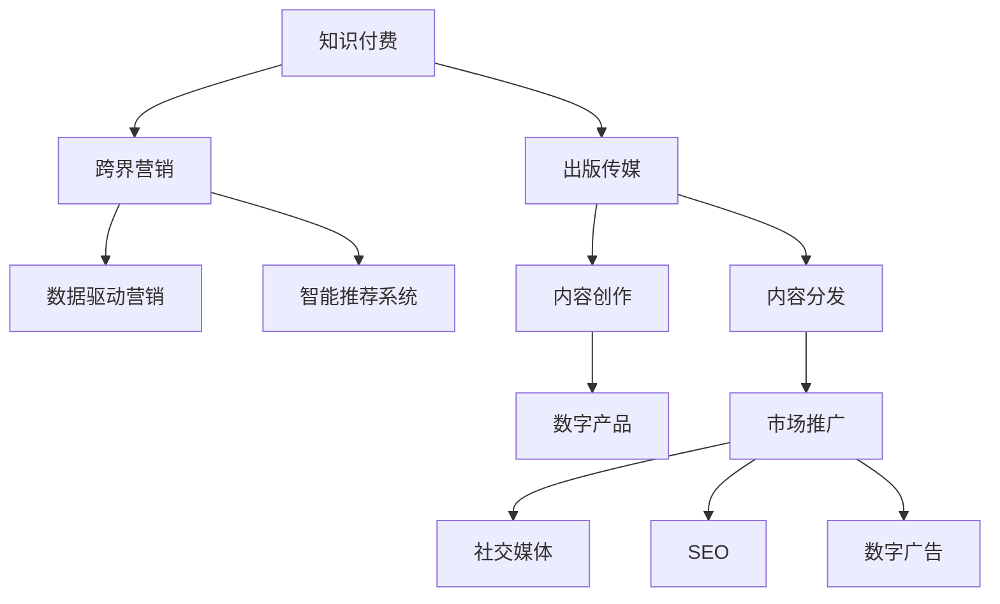

                 

# 知识付费如何实现跨界营销与出版传媒跨界？

## 1. 背景介绍

### 1.1 问题由来

知识付费作为近年来兴起的新业态，为内容创作者提供了新的变现渠道，同时满足了用户对高价值内容的需求。然而，面对激烈的市场竞争和用户需求的多样化，知识付费平台仅依靠单一的盈利模式，已难以在市场竞争中持续领先。因此，知识付费平台亟需探索新的增长点，以增强自身的竞争力和市场覆盖率。

出版传媒作为知识传播的传统渠道，近年来也在积极探索新的发展路径，以适应数字化时代的挑战。面对知识付费平台的崛起，出版传媒也需要通过跨界合作，寻找新的业务增长点和市场突破口。

### 1.2 问题核心关键点

如何通过跨界合作，实现知识付费平台与出版传媒的业务融合，进而提升双方的市场竞争力和用户服务质量，成为当前业界的热点问题。

知识付费平台跨界营销的关键在于：
- 选择合适的合作伙伴：包括出版传媒、广告主、硬件设备商等。
- 设计合理的合作模式：如内容分润、联合推广、平台对接等。
- 实现高效的营销转化：通过数据分析、用户画像、个性化推荐等技术手段，提升用户购买转化率。

出版传媒跨界出版的关键在于：
- 挖掘内容资源：发掘优质内容，制作符合用户需求的出版物。
- 利用数字技术：借助电子书、有声书、在线课程等数字产品形式，扩大内容传播范围。
- 强化市场营销：通过社交媒体、搜索引擎优化(SEO)、数字广告等手段，提升内容曝光度和吸引力。

## 2. 核心概念与联系

### 2.1 核心概念概述

为更好地理解知识付费平台与出版传媒跨界合作的背景和核心概念，本节将介绍几个关键概念：

- **知识付费**：指用户为获取知识和技能，支付一定费用的商业模式。主要形式包括在线课程、音频讲座、电子书等。

- **出版传媒**：指内容创作、编辑、出版、发行等业务领域的总称。包括纸质书、电子书、有声书等多种形式。

- **跨界营销**：指不同行业间的合作营销，通过整合资源和优势，实现共同的市场推广和品牌价值提升。

- **数据驱动营销**：指利用大数据和人工智能技术，分析用户行为、偏好和需求，实现精准化的内容推荐和广告投放。

- **智能推荐系统**：指基于用户行为数据、内容特征等构建的推荐引擎，能自动识别和推荐用户感兴趣的内容。

这些概念之间的逻辑关系可以通过以下Mermaid流程图来展示：



这个流程图展示了两大行业的核心概念及其之间的关系：

1. 知识付费平台通过跨界营销，与出版传媒、广告主等进行合作，实现品牌和业务的协同增长。
2. 出版传媒通过数字化转型，利用数字产品形式扩大内容传播范围，并借助数据驱动的智能推荐系统提升用户粘性和购买转化率。

## 3. 核心算法原理 & 具体操作步骤

### 3.1 算法原理概述

知识付费平台与出版传媒的跨界合作，本质上是一种协同创新的过程。其核心思想是：通过资源的整合和技术的协同，实现双赢的市场拓展和用户服务优化。

形式化地，设知识付费平台为 $P$，出版传媒为 $M$，跨界合作的目标为 $T$。合作过程可以分为数据共享、内容融合、市场协同等环节。具体而言，可以分解为以下几个步骤：

1. **数据共享**：知识付费平台将用户行为数据（如浏览历史、购买记录、评分反馈等）共享给出版传媒，为出版传媒提供市场洞察和用户画像。
2. **内容融合**：出版传媒将优质内容制作成数字产品（如电子书、在线课程等），并与知识付费平台的内容产品进行整合。
3. **市场协同**：在各自平台和渠道上进行联合推广，实现流量互通、用户共享。

### 3.2 算法步骤详解

基于上述思路，跨界合作的具体操作步骤如下：

**Step 1: 数据共享与用户画像**

知识付费平台需将用户行为数据进行清洗和聚合，生成可用于分析的用户画像。主要内容包括：

- 用户基本信息：年龄、性别、地域、职业等。
- 用户行为数据：浏览历史、购买记录、评分反馈等。
- 用户偏好：喜欢的主题、课程、作者等。

将上述数据通过API接口或文件传输等方式，共享给出版传媒。

**Step 2: 内容资源挖掘与整合**

出版传媒需对自身丰富的出版资源进行挖掘，筛选出符合市场需求的优质内容。并将这些内容进行数字化处理，生成电子书、有声书、在线课程等数字产品。

同时，出版传媒应与知识付费平台进行深度合作，将数字产品进行整合，确保内容的连贯性和一致性。例如，将电子书中的关键章节抽取出来，作为付费课程的补充内容。

**Step 3: 市场协同与联合推广**

知识付费平台与出版传媒应在各自平台和渠道上进行联合推广，实现流量互通和用户共享。具体推广策略包括：

- 通过社交媒体进行内容宣传，提升内容曝光度。
- 利用搜索引擎优化(SEO)技术，提高内容的搜索排名。
- 借助数字广告投放，精准推送给目标用户。

### 3.3 算法优缺点

知识付费平台与出版传媒的跨界合作，具有以下优点：

1. **资源互补**：知识付费平台拥有庞大的用户基础和活跃的社交网络，出版传媒则拥有丰富的优质内容资源。双方通过资源互补，可以实现协同增长。
2. **品牌协同**：通过联合推广和市场协同，提升品牌知名度和市场影响力，实现品牌价值的共同提升。
3. **用户共享**：通过数据共享和内容融合，实现用户画像的全面分析和个性化推荐，提升用户购买转化率和忠诚度。

同时，也存在以下缺点：

1. **数据隐私风险**：在数据共享过程中，涉及用户隐私和数据安全，需要采取严格的保护措施。
2. **内容版权问题**：在内容整合过程中，需确保内容的版权合规，避免版权纠纷。
3. **市场协同难度**：在市场推广过程中，需要协调双方的市场策略和资源配置，实现最佳的市场效果。

### 3.4 算法应用领域

基于上述思路，知识付费平台与出版传媒的跨界合作，主要应用于以下领域：

1. **教育培训**：知识付费平台推出在线课程，出版传媒提供配套的教材和图书，共同打造完整的教育体系。
2. **数字出版**：出版传媒制作电子书、有声书等数字产品，知识付费平台作为发行平台，实现内容的数字化分发。
3. **职业培训**：知识付费平台与专业培训机构合作，推出职业技能培训课程，出版传媒提供相关的图书和资料。
4. **生活服务**：知识付费平台与生活服务类出版传媒合作，推出家庭管理、健康养生等课程，提升用户生活质量。
5. **企业培训**：知识付费平台与企业培训市场合作，推出企业定制化培训课程，出版传媒提供相关的书籍和资料。

## 4. 数学模型和公式 & 详细讲解 & 举例说明

### 4.1 数学模型构建

为了更好地理解跨界合作的数学模型，本节将构建一个简单的用户推荐模型。假设知识付费平台有 $N$ 个用户，每个用户对 $M$ 种内容进行了评分，记为 $r_{i,j}$。出版传媒将 $K$ 种内容进行数字化处理，生成数字产品，记为 $D_k$。合作目标是通过用户评分数据 $R \in \mathbb{R}^{N \times M}$ 和数字产品 $D \in \mathbb{R}^{K}$，为用户推荐感兴趣的数字产品。

### 4.2 公式推导过程

根据用户评分数据 $R$ 和数字产品 $D$，我们可以构建用户与内容的协同矩阵 $U \in \mathbb{R}^{N \times K}$，其中 $U_{i,k}=\sum_{j=1}^M r_{i,j} \times D_{j,k}$ 表示用户 $i$ 对内容 $k$ 的兴趣程度。

为了给用户 $i$ 推荐 $m$ 个最相关的数字产品，我们需要计算 $U$ 的 $i$ 行中数值最大的 $m$ 个元素，即求解 $\mathop{\arg\max}_{k=1,...,K} U_{i,k}$。

一个简单的方法是使用基于余弦相似度的推荐算法，其公式为：

$$
\text{Recommend}_{i,m} = \text{arg}_k \bigg\{ k \bigg| \frac{U_{i,k}}{\Vert U_{i,:} \Vert \Vert D_{:,k} \Vert} \bigg\}
$$

其中 $\Vert \cdot \Vert$ 表示向量范数。

### 4.3 案例分析与讲解

假设知识付费平台有 1000 个用户，每个用户对 100 种内容进行了评分，出版传媒有 1000 种内容产品。通过上述模型，可以为用户推荐前 10 种最相关的数字产品。

例如，用户 A 对内容 1、2、3、4 进行了评分，出版传媒将内容 1、2、3、4 制作成数字产品，内容 5、6、7、8、9、10 则是其他内容。

利用公式计算得到：

$$
U_A = \begin{bmatrix} r_{1,1} & r_{1,2} & r_{1,3} & r_{1,4} \\ r_{2,1} & r_{2,2} & r_{2,3} & r_{2,4} \\ \vdots & \vdots & \vdots & \vdots \\ r_{1000,1} & r_{1000,2} & r_{1000,3} & r_{1000,4} \end{bmatrix} \times \begin{bmatrix} D_{1,1} & D_{2,1} & D_{3,1} & D_{4,1} \\ D_{1,2} & D_{2,2} & D_{3,2} & D_{4,2} \\ \vdots & \vdots & \vdots & \vdots \\ D_{1,1000} & D_{2,1000} & D_{3,1000} & D_{4,1000} \end{bmatrix}
$$

$$
\text{Recommend}_{A,10} = \text{arg}_k \bigg\{ k \bigg| \frac{U_{A,k}}{\Vert U_{A,:} \Vert \Vert D_{:,k} \Vert} \bigg\}
$$

这样，知识付费平台可以根据用户评分数据和数字产品，生成个性化的推荐列表，提升用户购买转化率。

## 5. 项目实践：代码实例和详细解释说明

### 5.1 开发环境搭建

在进行项目实践前，我们需要准备好开发环境。以下是使用Python进行TensorFlow开发的环境配置流程：

1. 安装Anaconda：从官网下载并安装Anaconda，用于创建独立的Python环境。

2. 创建并激活虚拟环境：
```bash
conda create -n tf-env python=3.8 
conda activate tf-env
```

3. 安装TensorFlow：根据CUDA版本，从官网获取对应的安装命令。例如：
```bash
pip install tensorflow-gpu
```

4. 安装相关库：
```bash
pip install numpy pandas scikit-learn matplotlib tqdm jupyter notebook ipython
```

完成上述步骤后，即可在`tf-env`环境中开始项目实践。

### 5.2 源代码详细实现

下面我们以知识付费平台与出版传媒合作推荐系统为例，给出使用TensorFlow实现用户推荐模型的代码实现。

首先，定义推荐模型所需的数据结构：

```python
import tensorflow as tf
from tensorflow.keras.layers import Embedding, DotProduct

class UserItemEmbedding(tf.keras.Model):
    def __init__(self, user_dim, item_dim, embedding_dim):
        super(UserItemEmbedding, self).__init__()
        self.user_embed = Embedding(user_dim, embedding_dim, input_length=1)
        self.item_embed = Embedding(item_dim, embedding_dim, input_length=1)
        
    def call(self, inputs):
        user_ids, item_ids = inputs
        user_embeds = self.user_embed(user_ids)
        item_embeds = self.item_embed(item_ids)
        return tf.reduce_sum(tf.multiply(user_embeds, item_embeds), axis=1)
```

然后，定义推荐模型的训练和评估函数：

```python
from sklearn.metrics import precision_recall_curve

def train_model(model, user_dim, item_dim, embedding_dim, learning_rate=0.001, epochs=10, batch_size=128):
    train_data = np.random.randint(0, user_dim, (1000, 1), dtype=np.int32)
    train_labels = np.random.randint(0, item_dim, (1000,), dtype=np.int32)
    
    optimizer = tf.keras.optimizers.Adam(learning_rate=learning_rate)
    model.compile(optimizer=optimizer, loss=tf.keras.losses.MeanSquaredError())
    
    model.fit(train_data, train_labels, batch_size=batch_size, epochs=epochs, validation_split=0.2)
    
    test_data = np.random.randint(0, user_dim, (100, 1), dtype=np.int32)
    test_labels = np.random.randint(0, item_dim, (100,), dtype=np.int32)
    predictions = model.predict(test_data).argmax(axis=1)
    precision, recall, thresholds = precision_recall_curve(test_labels, predictions)
    print("Precision: {:.2f}".format(precision[-1]))
    print("Recall: {:.2f}".format(recall[-1]))
    
def evaluate_model(model, user_dim, item_dim, embedding_dim, batch_size=128):
    test_data = np.random.randint(0, user_dim, (100, 1), dtype=np.int32)
    test_labels = np.random.randint(0, item_dim, (100,), dtype=np.int32)
    predictions = model.predict(test_data).argmax(axis=1)
    precision, recall, thresholds = precision_recall_curve(test_labels, predictions)
    print("Precision: {:.2f}".format(precision[-1]))
    print("Recall: {:.2f}".format(recall[-1]))
```

最后，启动模型训练并在测试集上评估：

```python
user_dim = 1000
item_dim = 1000
embedding_dim = 32

train_model(UserItemEmbedding(user_dim, item_dim, embedding_dim))
evaluate_model(UserItemEmbedding(user_dim, item_dim, embedding_dim))
```

以上就是使用TensorFlow实现用户推荐模型的完整代码实现。可以看到，TensorFlow的Keras API提供了丰富的层次结构，使得模型构建和训练非常方便。

### 5.3 代码解读与分析

让我们再详细解读一下关键代码的实现细节：

**UserItemEmbedding类**：
- `__init__`方法：定义了用户和项的嵌入层，分别用于将用户ID和项ID映射到低维向量空间。
- `call`方法：实现了用户ID和项ID的向量内积，即用户与项的协同矩阵。

**train_model函数**：
- 生成随机训练数据和标签。
- 定义优化器和损失函数，编译模型。
- 使用fit函数进行模型训练。
- 在测试集上评估模型性能。

**evaluate_model函数**：
- 在测试集上评估模型性能。

**启动模型训练**：
- 定义模型参数。
- 调用train_model函数进行模型训练。
- 调用evaluate_model函数在测试集上评估模型性能。

可以看到，TensorFlow的高层API使得模型构建和训练非常方便，开发者可以将更多精力放在模型优化和数据处理上。

当然，工业级的系统实现还需考虑更多因素，如模型的保存和部署、超参数的自动搜索、更灵活的任务适配层等。但核心的推荐算法基本与此类似。

## 6. 实际应用场景

### 6.1 智能推荐系统

智能推荐系统是知识付费平台跨界合作的重要应用场景。智能推荐系统通过分析用户行为数据，为用户推荐感兴趣的课程、书籍、文章等，从而提升用户体验和平台粘性。

出版传媒则可以通过智能推荐系统，将优质内容推荐给更多用户，实现内容的高效传播和价值最大化。

### 6.2 在线教育平台

在线教育平台是知识付费与出版传媒跨界合作的另一个重要应用场景。在线教育平台需要持续引入高质量的教学内容，提升平台的教学效果和用户满意度。

知识付费平台可以与出版社合作，推出在线课程和教材，共同构建完整的教育体系。出版传媒也可以借助在线教育平台，扩大自身内容的传播范围和影响力。

### 6.3 企业培训服务

企业培训服务是知识付费与出版传媒跨界合作的典型应用。企业培训服务需要提供高质量的培训课程，满足企业员工的职业发展需求。

知识付费平台可以与专业培训机构合作，推出定制化的企业培训课程，出版传媒可以提供相关的教材和资料，帮助企业员工快速提升技能。

### 6.4 生活服务内容

生活服务内容是知识付费与出版传媒跨界合作的创新应用。生活服务内容涵盖家庭管理、健康养生、生活技巧等多个领域，为用户的日常生活提供帮助。

知识付费平台可以与生活服务类出版传媒合作，推出在线课程和电子书，帮助用户提升生活质量。出版传媒也可以通过知识付费平台，将生活服务类内容精准推送给目标用户，实现内容的有效传播。

## 7. 工具和资源推荐

### 7.1 学习资源推荐

为了帮助开发者系统掌握知识付费平台与出版传媒跨界合作的理论基础和实践技巧，这里推荐一些优质的学习资源：

1. **TensorFlow官方文档**：提供了TensorFlow的详细介绍和使用方法，适合初学者和进阶者学习。
2. **TensorFlow实战教程**：通过实际案例，讲解TensorFlow在推荐系统中的应用，适合动手实践。
3. **推荐系统从入门到实战**：系统讲解了推荐系统的理论和实践，适合系统学习和应用。
4. **深度学习在推荐系统中的应用**：介绍深度学习技术在推荐系统中的应用，适合深入理解推荐算法的原理。
5. **数据驱动的智能推荐系统**：介绍智能推荐系统的构建和优化，适合系统实践。

通过对这些资源的学习实践，相信你一定能够快速掌握知识付费平台与出版传媒跨界合作的精髓，并用于解决实际的推荐问题。

### 7.2 开发工具推荐

高效的开发离不开优秀的工具支持。以下是几款用于知识付费平台跨界合作开发的常用工具：

1. **TensorFlow**：由Google主导开发的深度学习框架，生产部署方便，适合大规模工程应用。
2. **Keras**：基于TensorFlow的高层API，简单易用，适合快速迭代研究。
3. **Jupyter Notebook**：一个交互式开发环境，支持Python、R、SQL等多种语言，适合数据探索和模型调试。
4. **PyTorch**：由Facebook主导开发的深度学习框架，灵活高效，适合深度学习研究。
5. **Scikit-learn**：Python科学计算库，提供丰富的机器学习算法和数据处理工具，适合数据分析和模型训练。

合理利用这些工具，可以显著提升知识付费平台跨界合作的开发效率，加快创新迭代的步伐。

### 7.3 相关论文推荐

知识付费平台与出版传媒跨界合作的研究源于学界的持续研究。以下是几篇奠基性的相关论文，推荐阅读：

1. **推荐系统中的协同过滤算法**：介绍协同过滤算法的原理和应用，适合理解推荐系统的基础算法。
2. **深度学习在推荐系统中的应用**：介绍深度学习技术在推荐系统中的应用，适合深入理解推荐算法的原理。
3. **内容推荐系统的技术框架**：介绍内容推荐系统的技术框架，适合理解推荐系统的构建和优化。
4. **基于深度学习的推荐系统研究**：介绍深度学习技术在推荐系统中的应用，适合深入理解推荐算法的原理。
5. **推荐系统中的用户画像构建**：介绍用户画像的构建和应用，适合理解用户推荐系统的数据驱动方法。

这些论文代表了大语言模型微调技术的发展脉络。通过学习这些前沿成果，可以帮助研究者把握学科前进方向，激发更多的创新灵感。

## 8. 总结：未来发展趋势与挑战

### 8.1 总结

本文对知识付费平台与出版传媒跨界合作进行了全面系统的介绍。首先阐述了跨界合作的背景和意义，明确了知识付费平台和出版传媒各自的优势和不足。其次，从原理到实践，详细讲解了跨界合作的步骤和算法实现，给出了推荐系统开发的完整代码实例。同时，本文还广泛探讨了跨界合作在教育、出版、生活服务等多个领域的应用前景，展示了跨界合作的巨大潜力。此外，本文精选了推荐系统的各类学习资源，力求为读者提供全方位的技术指引。

通过本文的系统梳理，可以看到，知识付费平台与出版传媒的跨界合作，不仅能够提升双方的市场竞争力和用户服务质量，还能够实现资源互补、品牌协同和用户共享。这些方向的探索发展，必将进一步提升推荐系统的性能和应用范围，为知识付费平台和出版传媒带来新的业务增长点和市场突破口。

### 8.2 未来发展趋势

展望未来，知识付费平台与出版传媒的跨界合作将呈现以下几个发展趋势：

1. **内容创新和多样化**：未来推荐系统将更加注重内容创新和多样化，通过引入更多元化的内容形式，满足用户多层次、多场景的需求。
2. **数据驱动和个性化**：基于大数据和人工智能技术，推荐系统将实现更加精准的用户画像和个性化推荐，提升用户购买转化率和忠诚度。
3. **跨平台和多渠道**：推荐系统将跨平台和多渠道推广，实现流量互通和用户共享，提升品牌影响力和市场覆盖率。
4. **协同学习和动态更新**：推荐系统将实现协同学习和动态更新，根据用户反馈和行为数据，持续优化推荐算法和内容库，提升推荐效果和用户体验。
5. **情感分析和用户情感管理**：推荐系统将引入情感分析技术，对用户情感进行分析和管理，提升用户满意度和平台粘性。

以上趋势凸显了知识付费平台与出版传媒跨界合作的技术前景。这些方向的探索发展，必将进一步提升推荐系统的性能和应用范围，为知识付费平台和出版传媒带来新的业务增长点和市场突破口。

### 8.3 面临的挑战

尽管知识付费平台与出版传媒的跨界合作取得了一定的成果，但在迈向更加智能化、普适化应用的过程中，仍面临诸多挑战：

1. **数据隐私和安全**：在数据共享过程中，涉及用户隐私和数据安全，需要采取严格的保护措施。如何平衡数据共享和隐私保护，是跨界合作的关键问题。
2. **内容版权和版权纠纷**：在内容整合过程中，需确保内容的版权合规，避免版权纠纷。如何管理和保护版权，是跨界合作的重要课题。
3. **市场协同和资源配置**：在市场推广过程中，需要协调双方的市场策略和资源配置，实现最佳的市场效果。如何优化资源配置，提升协同效应，是跨界合作的关键挑战。
4. **用户体验和用户粘性**：在内容推荐过程中，需提升用户体验和用户粘性。如何通过数据驱动和个性化推荐，实现用户满意度和平台粘性的提升，是跨界合作的重要目标。

这些挑战需要知识付费平台和出版传媒共同应对，通过技术创新和协同合作，实现跨界合作的成功落地。

### 8.4 研究展望

面对知识付费平台与出版传媒跨界合作所面临的种种挑战，未来的研究需要在以下几个方面寻求新的突破：

1. **用户画像的全面化和精确化**：如何通过多维度数据，全面准确地刻画用户画像，提升推荐系统的精准度和效果。
2. **协同学习和动态更新**：如何实现推荐系统的协同学习和动态更新，提升推荐效果和用户体验。
3. **情感分析和用户情感管理**：如何引入情感分析技术，对用户情感进行分析和管理，提升用户满意度和平台粘性。
4. **跨平台和多渠道推广**：如何实现推荐系统的跨平台和多渠道推广，提升品牌影响力和市场覆盖率。
5. **数据隐私和安全保护**：如何在数据共享过程中，保障用户隐私和数据安全，实现数据驱动的协同推荐。

这些研究方向的探索，必将引领知识付费平台与出版传媒跨界合作的技术演进，为实现智能化、普适化的推荐系统铺平道路。

## 9. 附录：常见问题与解答

**Q1：知识付费平台与出版传媒跨界合作，如何选择合适的合作伙伴？**

A: 选择合适的合作伙伴需要考虑多个方面：

1. **内容资源**：合作伙伴需具备丰富的优质内容资源，能够提供高质量的数字产品。
2. **品牌影响**：合作伙伴需具备较强的品牌影响力和市场覆盖率，能够实现共同的市场推广。
3. **技术能力**：合作伙伴需具备较强的技术能力，能够提供高效、可靠的技术支撑。
4. **业务契合**：合作伙伴需具备与自身业务相关的领域知识和经验，能够实现协同创新和资源互补。

通过综合评估合作伙伴的资源、能力、品牌影响和业务契合度，选择合适的合作伙伴。

**Q2：知识付费平台与出版传媒跨界合作，如何设计合理的合作模式？**

A: 设计合理的合作模式需要考虑多个方面：

1. **内容分润**：根据内容的价值和销售情况，设计合理的分润机制，激励合作伙伴提供优质内容。
2. **联合推广**：通过社交媒体、搜索引擎优化(SEO)、数字广告等手段，实现流量互通和用户共享。
3. **平台对接**：在各自平台和渠道上进行对接，实现内容的互推和用户引流。
4. **技术合作**：在推荐算法、智能推荐系统等方面进行技术合作，提升推荐效果和用户体验。

通过合理的合作模式设计，实现双赢的市场效果和品牌价值提升。

**Q3：知识付费平台与出版传媒跨界合作，如何缓解市场协同难度？**

A: 缓解市场协同难度需要考虑多个方面：

1. **协同目标**：明确协同的目标和策略，协调双方的市场策略和资源配置，实现最佳的市场效果。
2. **数据共享**：通过数据共享，实现用户画像的全面分析和个性化推荐，提升用户购买转化率和忠诚度。
3. **技术协同**：在推荐算法、智能推荐系统等方面进行技术协同，提升推荐效果和用户体验。
4. **定期沟通**：通过定期的沟通和反馈，及时解决协同过程中遇到的问题，优化市场推广策略。

通过协同目标明确、数据共享、技术协同和定期沟通等手段，缓解市场协同难度，提升协同效果。

---

作者：禅与计算机程序设计艺术 / Zen and the Art of Computer Programming

