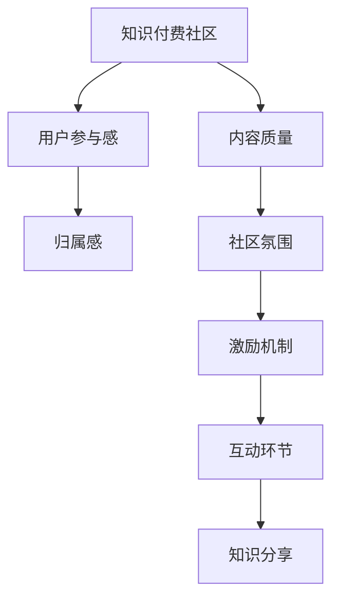

                 

# 知识付费社区要发挥用户的参与感和归属感

在互联网快速发展的今天，知识付费已经成为一股不可忽视的潮流。知识付费社区的兴起，为用户提供了获取高质量知识和服务的平台，也为企业开辟了新的盈利模式。然而，随着知识付费市场的竞争日趋激烈，如何发挥用户的参与感和归属感，成为提升社区粘性和用户留存率的关键。

## 1. 背景介绍

### 1.1 问题由来
近年来，知识付费市场经历了快速增长，吸引了大量用户和投资。但与此同时，知识付费产品的同质化问题也日渐突出。用户在平台间反复切换，难以找到真正适合自己的知识服务。而知识付费社区作为连接用户与内容创作者的桥梁，如何激发用户的参与感和归属感，提升用户体验，是平台运营商必须面对的重要课题。

### 1.2 问题核心关键点
在知识付费社区中，用户的参与感和归属感主要体现在以下两个方面：

1. **内容质量**：高质量、有价值的内容是吸引用户并提升用户体验的基础。知识付费社区需要不断优化内容推荐算法，确保用户能快速获取到对自己有用的信息。

2. **社区氛围**：良好的社区氛围能增强用户粘性，提升用户留存率。社区需要设计合理的激励机制和互动环节，让用户感受到参与感和归属感。

### 1.3 问题研究意义
提升用户参与感和归属感，不仅能提高知识付费社区的用户留存率和粘性，还能促进用户之间的互动和知识分享，构建一个更加活跃、健康的社区生态。这对于知识付费平台来说，无疑是提升商业价值和社会影响力的一大助力。

## 2. 核心概念与联系

### 2.1 核心概念概述

为更好地理解知识付费社区中用户参与感和归属感的发挥机制，本节将介绍几个密切相关的核心概念：

1. **知识付费社区**：基于互联网的付费知识分享平台，用户通过付费获得高质量的课程、文章、讲座等服务。

2. **用户参与感**：用户在使用知识付费产品过程中，能够感受到参与感和归属感，愿意花更多时间和金钱投入到社区中。

3. **归属感**：用户对知识付费社区有强烈的情感认同，愿意分享自己的知识和服务，形成一个互惠互利的社区环境。

4. **内容质量**：知识付费社区提供的课程、文章、讲座等内容的原创性、实用性、专业性。

5. **社区氛围**：社区内用户之间的互动方式、交流氛围、管理规范等。

6. **激励机制**：社区为提升用户参与感和归属感而设计的奖励和激励措施，如积分、徽章、排行榜等。

7. **互动环节**：社区内设计的多样化互动形式，如讨论区、问答、直播、小组等。

8. **知识分享**：用户将学到的知识应用到实际生活中，并分享给他人，促进知识在社区内的流动。

这些核心概念之间的逻辑关系可以通过以下Mermaid流程图来展示：



这个流程图展示的知识付费社区的核心概念及其之间的关系：

1. 知识付费社区通过提供高质量的内容吸引用户。
2. 社区设计的互动环节和激励机制，提升用户的参与感和归属感。
3. 社区氛围的营造和知识分享的机制，增强用户粘性和社区互动。

这些概念共同构成了知识付费社区的设计框架，使得社区能够发挥用户的参与感和归属感。

## 3. 核心算法原理 & 具体操作步骤
### 3.1 算法原理概述

知识付费社区提升用户参与感和归属感的关键在于内容质量和社区氛围的优化。内容质量是吸引用户的基础，而社区氛围是提升用户留存的关键。以下将详细探讨如何通过算法优化来提升这两方面。

### 3.2 算法步骤详解

#### 3.2.1 内容质量优化

**步骤1: 数据收集与分析**

知识付费社区首先需要收集用户的访问记录、购买记录、评分记录等数据，分析用户的偏好和需求。可以使用机器学习算法对用户行为数据进行聚类分析，找出用户的兴趣群体，并根据不同的群体推荐不同的内容。

**步骤2: 内容推荐算法**

根据用户的兴趣和行为数据，设计高效的内容推荐算法。常用的推荐算法包括协同过滤、基于内容的推荐、矩阵分解等。协同过滤算法通过分析用户间的相似性，推荐用户可能感兴趣的内容；基于内容的推荐算法则通过分析内容本身的特征，为用户推荐相关的内容；矩阵分解算法则通过分解用户与内容的交互矩阵，找到用户和内容的潜在关系，从而推荐相似内容。

**步骤3: 内容多样性**

为了提升用户的满意度，推荐算法应保证内容的多样性，避免用户陷入单一兴趣领域。可以通过引入多种推荐算法，如协同过滤和基于内容的结合，或引入时间、空间等多维度的因素，保证推荐的全面性。

**步骤4: 内容更新**

知识付费社区需要不断更新和优化推荐算法，确保推荐结果的实时性和准确性。可以通过定期回测推荐算法的效果，根据用户反馈和行为数据进行调整。

#### 3.2.2 社区氛围优化

**步骤1: 用户互动分析**

社区需要分析用户之间的互动数据，找出活跃用户和社区热门话题。可以使用自然语言处理技术，对用户评论、讨论等文本数据进行情感分析，找出社区的积极和消极情绪。

**步骤2: 激励机制设计**

根据用户的互动数据和情感分析结果，设计合理的激励机制。常用的激励机制包括积分、徽章、排行榜等。积分用于奖励用户参与互动和分享行为，徽章用于表彰用户贡献和成就，排行榜用于显示用户的活跃程度和排名。

**步骤3: 互动环节设计**

社区需要设计多样化的互动环节，如讨论区、问答、直播、小组等，鼓励用户积极参与。讨论区可以用于用户对课程内容的讨论，问答区可以用于用户与讲师互动，直播区可以用于讲师与用户的实时交流，小组则可以用于用户之间的兴趣小组和知识分享。

**步骤4: 用户管理**

社区需要对用户行为进行管理和规范，避免垃圾信息和恶意行为。可以引入AI算法进行内容审核和用户行为监控，及时发现和处理违规行为。

### 3.3 算法优缺点

内容质量优化和社区氛围优化的算法具有以下优缺点：

**优点**

1. 提升用户满意度：通过推荐算法和内容更新，用户能更快地获取到自己感兴趣的内容，提升用户体验。
2. 增强社区互动：通过互动环节和激励机制，用户更愿意参与社区活动，增强社区互动。
3. 降低用户流失率：提升用户满意度和参与感，可以降低用户的流失率，提升用户留存率。

**缺点**

1. 数据依赖：推荐算法和情感分析需要大量的用户行为数据，数据质量不足会影响推荐效果。
2. 技术门槛高：设计和优化算法需要较高的技术门槛，可能存在一定的技术壁垒。
3. 用户隐私问题：社区需要处理和存储用户行为数据，可能涉及用户隐私保护问题。

尽管存在这些局限性，但通过合理设计算法，可以显著提升知识付费社区的内容质量和社区氛围，进而发挥用户的参与感和归属感。

### 3.4 算法应用领域

知识付费社区提升用户参与感和归属感的算法优化方法，在多个领域已经得到了应用，例如：

1. **在线教育**：通过个性化推荐和互动环节，提升学生的学习体验和积极性。
2. **职业培训**：为在职人士提供个性化职业发展课程，提升职业技能和交流互动。
3. **个人发展**：为个人提供多样化内容和学习资源，满足不同兴趣和需求。
4. **兴趣小组**：为用户组建兴趣小组和知识分享平台，促进用户之间的交流和合作。

除了上述这些经典领域外，知识付费社区的算法优化方法还被创新性地应用到更多场景中，如企业内部培训、在线医疗咨询、个人健康管理等，为不同行业提供知识共享和社区互动的解决方案。随着推荐算法和社区设计技术的不断进步，相信知识付费社区的算法优化方法将在更广泛的领域发挥作用。

## 4. 数学模型和公式 & 详细讲解 & 举例说明
### 4.1 数学模型构建

本节将使用数学语言对知识付费社区提升用户参与感和归属感的优化算法进行更加严格的刻画。

假设知识付费社区的用户数为 $N$，内容数为 $M$。社区用户的行为数据表示为 $D=\{(x_i, y_i)\}_{i=1}^N$，其中 $x_i$ 为用户行为，$y_i$ 为用户评分。

内容推荐算法的基本目标是最大化用户对内容的满意度，即最大化用户评分的期望值：

$$
\max_{\theta} \sum_{i=1}^N y_i \log P(y_i | \theta)
$$

其中 $P(y_i | \theta)$ 为内容推荐模型的概率分布，$\theta$ 为模型的参数。

社区氛围优化的目标是通过激励机制和互动环节，最大化用户参与度和互动量，即最大化社区活跃度：

$$
\max_{\alpha} \sum_{i=1}^N (\alpha_i + \beta_i \cdot p_i)
$$

其中 $\alpha_i$ 为用户获得的奖励，$\beta_i$ 为互动强度，$p_i$ 为互动频次。

### 4.2 公式推导过程

以下我们以协同过滤算法为例，推导其推荐公式及其计算方法。

**协同过滤算法**

协同过滤算法基于用户间的相似性，通过分析用户历史行为数据，推荐用户可能感兴趣的内容。协同过滤算法有两种常见形式：基于用户的协同过滤和基于物品的协同过滤。

基于用户的协同过滤算法，通过分析用户之间的相似性，推荐用户可能感兴趣的内容。设 $X$ 为用户行为矩阵，$R$ 为用户评分矩阵，$X \times R$ 为用户-内容评分矩阵，则协同过滤算法的推荐公式为：

$$
\hat{r}_{ui} = \frac{\sum_{v=1}^M (X_u v \times R_{vi})}{\sqrt{\sum_{v=1}^M (X_u v)^2} \times \sqrt{\sum_{v=1}^M (R_{vi})^2}}
$$

其中 $X_u$ 为用户 $u$ 的历史评分向量，$R_{vi}$ 为内容 $v$ 的评分向量，$\hat{r}_{ui}$ 为用户 $u$ 对内容 $v$ 的预测评分。

基于物品的协同过滤算法，通过分析内容之间的相似性，推荐用户可能感兴趣的内容。设 $S$ 为内容之间的相似性矩阵，$R$ 为用户评分矩阵，则协同过滤算法的推荐公式为：

$$
\hat{r}_{ui} = \frac{\sum_{v=1}^M (S_{vi} \times R_{ui})}{\sum_{v=1}^M S_{vi}}
$$

其中 $S_{vi}$ 为内容 $v$ 的相似性向量，$\hat{r}_{ui}$ 为用户 $u$ 对内容 $v$ 的预测评分。

**基于内容的推荐算法**

基于内容的推荐算法通过分析内容本身的特征，为用户推荐相关的内容。假设内容 $v$ 的特征向量为 $F_v$，用户 $u$ 的特征向量为 $F_u$，则基于内容的推荐算法为：

$$
\hat{r}_{ui} = \langle F_u, F_v \rangle
$$

其中 $\langle F_u, F_v \rangle$ 为向量 $F_u$ 和 $F_v$ 的点积。

**矩阵分解算法**

矩阵分解算法通过分解用户与内容的交互矩阵，找到用户和内容的潜在关系，从而推荐相似内容。假设用户 $u$ 和内容 $v$ 的潜在特征矩阵分别为 $U$ 和 $V$，则矩阵分解算法为：

$$
\hat{r}_{ui} = \langle U_u, V_v \rangle
$$

其中 $\langle U_u, V_v \rangle$ 为用户 $u$ 和内容 $v$ 的潜在特征向量的点积。

### 4.3 案例分析与讲解

以某在线教育平台为例，分析其内容推荐算法和社区氛围优化的实施情况：

**内容推荐算法**

该在线教育平台采用协同过滤算法和基于内容的推荐算法相结合的方式，为用户提供个性化推荐。首先，平台收集用户的历史课程浏览、评分和购买数据，分析用户的兴趣和需求。然后，根据用户行为数据，使用协同过滤算法为用户推荐可能感兴趣的内容。同时，平台还分析课程的标签和特征，使用基于内容的推荐算法，为用户推荐相关课程。

**社区氛围优化**

该平台设计了讨论区、问答区、直播区等多种互动环节，鼓励用户积极参与。讨论区用于用户对课程内容的讨论，问答区用于用户与讲师互动，直播区用于讲师与用户的实时交流。此外，平台还设计了积分和徽章机制，激励用户参与互动和分享。积分用于奖励用户参与讨论、回答问题和分享经验，徽章用于表彰用户在平台上的成就。

## 5. 项目实践：代码实例和详细解释说明
### 5.1 开发环境搭建

在进行内容推荐和社区氛围优化的实践前，我们需要准备好开发环境。以下是使用Python进行知识付费社区开发的开发环境配置流程：

1. 安装Anaconda：从官网下载并安装Anaconda，用于创建独立的Python环境。

2. 创建并激活虚拟环境：
```bash
conda create -n knowledge_community_env python=3.8 
conda activate knowledge_community_env
```

3. 安装必要的Python包：
```bash
pip install numpy pandas scikit-learn joblib scipy
```

4. 安装数据处理和推荐算法库：
```bash
pip install scipy scipy-sparse scipy-sparse-stats
```

5. 安装机器学习和深度学习库：
```bash
pip install sklearn scikit-learn scikit-multilearn
```

6. 安装自然语言处理库：
```bash
pip install nltk gensim scikit-learn
```

7. 安装可视化库：
```bash
pip install matplotlib seaborn
```

完成上述步骤后，即可在`knowledge_community_env`环境中开始实践。

### 5.2 源代码详细实现

下面以协同过滤算法为例，给出使用Python实现的内容推荐代码实现。

首先，定义用户行为矩阵和评分矩阵：

```python
from scipy.sparse import csr_matrix
import numpy as np

# 用户行为矩阵
X = np.array([[0, 1, 0, 1, 0, 0],
              [0, 0, 1, 0, 1, 0],
              [1, 0, 0, 0, 0, 1],
              [0, 0, 0, 0, 0, 1],
              [0, 1, 0, 0, 0, 0],
              [0, 0, 0, 0, 0, 1]])

# 用户评分矩阵
R = np.array([[5, 4, 3, 2, 1, 0],
              [0, 4, 3, 2, 1, 0],
              [0, 0, 3, 2, 1, 5],
              [0, 0, 0, 0, 0, 1],
              [5, 0, 0, 0, 0, 0],
              [0, 0, 0, 0, 0, 0]])

# 将用户行为矩阵转换为稀疏矩阵
X = csr_matrix(X)
R = csr_matrix(R)
```

然后，定义协同过滤算法：

```python
from scipy.sparse.linalg import svds

def collaborative_filtering(X, R):
    U, S, Vt = svds(X @ R.T, k=3)
    return np.dot(U, S) @ Vt
```

接着，使用协同过滤算法进行推荐：

```python
# 对用户u进行推荐
u = 3
recommendations = collaborative_filtering(X, R)

# 输出推荐结果
print(recommendations[u])
```

以上就是使用Python对协同过滤算法进行内容推荐的代码实现。可以看到，通过SciPy库，我们可以高效地实现协同过滤算法，快速计算推荐结果。

### 5.3 代码解读与分析

让我们再详细解读一下关键代码的实现细节：

**用户行为矩阵和评分矩阵的定义**：
- `X` 为用户行为矩阵，表示用户对内容的浏览和评分行为。
- `R` 为用户评分矩阵，表示用户对内容的评分数据。
- 使用SciPy库的 `csr_matrix` 函数将用户行为矩阵转换为稀疏矩阵，提高计算效率。

**协同过滤算法的实现**：
- 使用SciPy库的 `svds` 函数进行奇异值分解，找到用户和内容的潜在关系。
- 计算用户 $u$ 的推荐结果，即对用户 $u$ 的内容推荐向量。
- 输出推荐结果，展示用户 $u$ 对内容的预测评分。

**代码解读与分析**：
- `X @ R.T` 表示用户行为矩阵和评分矩阵的矩阵乘法，得到用户-内容评分矩阵。
- `svds` 函数用于对矩阵进行奇异值分解，提取前 $k$ 个奇异值和对应的特征向量。
- 通过计算推荐向量 `U` 和 `Vt` 的点积，得到用户 $u$ 对内容的预测评分。
- `np.dot` 函数用于计算两个矩阵的点积，得到推荐结果。

通过上述代码实现，我们可以看到，协同过滤算法在知识付费社区的内容推荐中具有很好的效果，可以满足用户对高质量内容的需求，提升用户体验。

## 6. 实际应用场景
### 6.1 智能推荐系统

基于协同过滤算法的智能推荐系统，可以广泛应用于知识付费社区的内容推荐。智能推荐系统通过分析用户的历史行为数据，为用户推荐可能感兴趣的内容，提升用户满意度。

在技术实现上，可以通过协同过滤算法和基于内容的推荐算法相结合的方式，对用户进行个性化推荐。智能推荐系统需要不断收集和更新用户行为数据，及时调整推荐算法，确保推荐结果的实时性和准确性。

### 6.2 社交网络

社交网络平台通过分析用户之间的互动数据，提升用户的参与感和归属感。例如，在知识付费社区中，可以设计讨论区、问答区、直播区等多种互动环节，鼓励用户积极参与。同时，平台还设计积分和徽章机制，激励用户参与互动和分享。

在技术实现上，社交网络平台可以采用自然语言处理技术，对用户评论、讨论等文本数据进行情感分析，找出社区的积极和消极情绪。根据情感分析结果，设计合理的激励机制，提升社区活跃度。

### 6.3 在线教育

在线教育平台通过个性化推荐和互动环节，提升学生的学习体验和积极性。平台可以设计讨论区、问答区、直播区等多种互动环节，鼓励学生积极参与。同时，平台还设计积分和徽章机制，激励学生参与互动和分享。

在技术实现上，在线教育平台可以采用协同过滤算法和基于内容的推荐算法相结合的方式，对学生进行个性化推荐。平台需要不断收集和更新学生的学习行为数据，及时调整推荐算法，确保推荐结果的实时性和准确性。

### 6.4 未来应用展望

随着智能推荐算法和社区设计技术的不断进步，基于知识付费社区的算法优化方法将在更广泛的领域发挥作用。

在智慧医疗领域，通过分析用户的健康数据，推荐个性化的健康管理方案，提升用户的健康水平和生活质量。

在智能家居领域，通过分析用户的家庭行为数据，推荐个性化的智能家居方案，提升用户的生活便利性和舒适度。

在智能交通领域，通过分析用户的出行数据，推荐个性化的出行方案，提升用户的出行体验和效率。

此外，在企业内部培训、在线医疗咨询、个人健康管理等众多领域，基于知识付费社区的算法优化方法也将不断涌现，为不同行业提供知识共享和社区互动的解决方案。随着算法的日益成熟，知识付费社区的算法优化方法将助力更多行业实现智能化、个性化升级。

## 7. 工具和资源推荐
### 7.1 学习资源推荐

为了帮助开发者系统掌握知识付费社区的技术基础和实践技巧，这里推荐一些优质的学习资源：

1. **《推荐系统实战》**：该书系统介绍了推荐系统的理论基础和实践技巧，涵盖协同过滤、基于内容的推荐等多种算法。

2. **Coursera《机器学习》课程**：由斯坦福大学教授Andrew Ng讲授，涵盖机器学习的基础知识和算法实现，包括推荐系统的原理和设计。

3. **Kaggle推荐系统竞赛**：Kaggle平台上有多项推荐系统竞赛，通过参与竞赛，可以快速掌握推荐系统的实践技巧。

4. **Arxiv.org**：该网站提供大量推荐系统相关的学术论文，可以了解最新的研究进展和算法创新。

5. **GitHub推荐系统项目**：GitHub上有多项开源推荐系统项目，可以学习其他开发者如何实现推荐算法。

通过对这些资源的学习实践，相信你一定能够快速掌握知识付费社区的技术基础和实践技巧，并将知识应用到实际项目中。

### 7.2 开发工具推荐

高效的开发离不开优秀的工具支持。以下是几款用于知识付费社区开发的常用工具：

1. **Python**：Python作为一门简单易学的编程语言，适合快速开发推荐算法和社区互动模块。

2. **PyTorch**：基于Python的深度学习框架，适合实现复杂的推荐算法和社区互动功能。

3. **TensorFlow**：由Google主导开发的深度学习框架，适合大规模工程应用。

4. **SciPy**：提供高效的数据处理和科学计算功能，适合实现协同过滤算法和社区互动模块。

5. **NumPy**：提供高效的多维数组和科学计算功能，适合处理用户行为数据。

6. **Pandas**：提供高效的数据处理和分析功能，适合处理用户评分和互动数据。

7. **Jupyter Notebook**：提供交互式的编程环境，适合进行算法开发和调试。

合理利用这些工具，可以显著提升知识付费社区的开发效率，加快创新迭代的步伐。

### 7.3 相关论文推荐

知识付费社区的算法优化技术发展源于学界的持续研究。以下是几篇奠基性的相关论文，推荐阅读：

1. **《推荐系统10年回顾》**：由Xu等学者撰写，总结了推荐系统的经典算法和应用场景，是推荐系统研究的必读之作。

2. **《协同过滤推荐算法》**：由Hu等学者撰写，介绍了协同过滤算法的原理和实现方法。

3. **《基于内容的推荐算法》**：由Jarvelin等学者撰写，介绍了基于内容的推荐算法的原理和实现方法。

4. **《矩阵分解推荐算法》**：由He等学者撰写，介绍了矩阵分解算法的原理和实现方法。

这些论文代表了大语言模型微调技术的进展脉络。通过学习这些前沿成果，可以帮助研究者把握学科前进方向，激发更多的创新灵感。

## 8. 总结：未来发展趋势与挑战
### 8.1 总结

本文对知识付费社区提升用户参与感和归属感的优化算法进行了全面系统的介绍。首先阐述了知识付费社区用户参与感和归属感提升的重要性，明确了推荐算法和社区氛围优化对提升用户体验的关键作用。其次，从原理到实践，详细讲解了内容质量优化和社区氛围优化的数学模型和算法步骤，给出了具体的代码实现。同时，本文还广泛探讨了推荐算法和社区设计在多个领域的应用场景，展示了知识付费社区的算法优化方法具有的广阔前景。

通过本文的系统梳理，可以看到，通过合理的算法设计和优化，知识付费社区可以显著提升用户的参与感和归属感，从而提升用户留存率和社区活跃度。这对于知识付费平台来说，无疑是提升商业价值和社会影响力的一大助力。

### 8.2 未来发展趋势

展望未来，知识付费社区的算法优化技术将呈现以下几个发展趋势：

1. **个性化推荐精度提升**：推荐算法将不断优化，通过深度学习和协同过滤算法的结合，实现更高精度的个性化推荐。

2. **多模态信息融合**：未来的推荐系统将融合多种数据模态，如文本、图像、视频等，实现更加全面和准确的推荐。

3. **动态推荐系统**：推荐系统将实现动态更新和优化，根据用户行为实时调整推荐结果，确保推荐内容的实时性和相关性。

4. **社交网络驱动**：未来的推荐系统将更加注重社交网络的影响，通过分析用户之间的关系和互动，优化推荐效果。

5. **跨领域推荐**：未来的推荐系统将跨越多个领域，实现跨领域的知识共享和推荐。

这些趋势将推动知识付费社区的算法优化技术不断进步，提升用户体验，增强社区互动。

### 8.3 面临的挑战

尽管知识付费社区的算法优化技术已经取得了一定的进展，但在迈向更加智能化、普适化应用的过程中，它仍面临着诸多挑战：

1. **数据质量问题**：推荐算法和社区互动分析需要大量的高质量数据，数据质量不足会影响推荐效果。如何获取和处理高质量数据，是推荐系统面临的重要问题。

2. **推荐算法复杂度**：深度学习和协同过滤算法的复杂度较高，需要高性能的计算资源和优化技术，可能存在一定的技术壁垒。

3. **用户隐私保护**：社区互动分析需要处理和存储用户行为数据，可能涉及用户隐私保护问题。如何保护用户隐私，确保数据安全，是推荐系统面临的重要问题。

4. **推荐算法可解释性**：推荐系统需要能够解释推荐结果的依据，让用户理解推荐过程。如何提高算法的可解释性，增强用户信任，是推荐系统面临的重要问题。

5. **跨平台互操作性**：不同平台的推荐系统如何实现互操作和数据共享，是推荐系统面临的重要问题。

这些挑战需要学界和业界共同努力，才能解决。

### 8.4 研究展望

面对知识付费社区的算法优化技术所面临的诸多挑战，未来的研究需要在以下几个方面寻求新的突破：

1. **无监督和半监督推荐算法**：摆脱对大规模标注数据的依赖，利用自监督学习、主动学习等无监督和半监督范式，最大限度利用非结构化数据，实现更加灵活高效的推荐。

2. **多模态信息融合**：将文本、图像、视频等多模态信息与推荐系统结合，提升推荐结果的准确性和多样性。

3. **动态推荐系统**：实现推荐系统的动态更新和优化，根据用户行为实时调整推荐结果，确保推荐内容的实时性和相关性。

4. **社交网络驱动**：通过分析用户之间的关系和互动，优化推荐效果，提升用户参与感和归属感。

5. **跨平台互操作性**：实现不同平台的推荐系统互操作和数据共享，增强推荐系统的普适性和可用性。

这些研究方向将引领知识付费社区的算法优化技术迈向更高的台阶，为构建安全、可靠、可解释、可控的智能系统铺平道路。面向未来，知识付费社区的算法优化技术还需要与其他人工智能技术进行更深入的融合，如知识表示、因果推理、强化学习等，多路径协同发力，共同推动知识付费社区的进步。

## 9. 附录：常见问题与解答

**Q1: 知识付费社区如何衡量用户参与感和归属感？**

A: 知识付费社区可以通过多种方式衡量用户参与感和归属感，包括：

1. **用户活跃度**：通过分析用户的访问频次、课程浏览量、讨论次数等数据，衡量用户对社区的参与度。

2. **用户满意度**：通过用户评分、评论、反馈等方式，衡量用户对课程和社区的满意度。

3. **用户留存率**：通过分析用户注册、订阅、续费等数据，衡量用户对社区的忠诚度。

4. **用户贡献度**：通过分析用户发布的内容、参与的讨论等数据，衡量用户对社区的贡献度。

5. **社区互动量**：通过分析用户之间的互动数据，衡量社区的互动量，如评论、点赞、分享等。

这些指标综合反映了用户对知识付费社区的参与感和归属感，是衡量社区效果的重要依据。

**Q2: 知识付费社区如何设计合理的激励机制？**

A: 知识付费社区需要设计合理的激励机制，以提升用户的参与感和归属感。常用的激励机制包括：

1. **积分系统**：通过积分奖励用户参与互动、分享经验、购买课程等行为，激励用户积极参与。

2. **徽章系统**：通过徽章表彰用户在平台上的成就，如完成课程、获得认证等，增强用户的荣誉感和归属感。

3. **排行榜系统**：通过排行榜展示用户的活跃度和贡献度，激励用户积极参与社区活动。

4. **直播奖励**：通过直播奖励用户参与互动，激励用户积极参与直播课程和讨论。

5. **内容推荐**：通过推荐优质内容和课程，吸引用户积极参与学习。

这些激励机制需要根据社区的特点和用户的行为习惯进行设计，以确保激励效果。

**Q3: 知识付费社区如何处理用户隐私保护问题？**

A: 知识付费社区需要高度重视用户隐私保护问题，通过以下措施保护用户数据安全：

1. **数据匿名化**：对用户行为数据进行匿名化处理，去除敏感信息，保护用户隐私。

2. **数据加密**：采用数据加密技术，对用户数据进行保护，防止数据泄露。

3. **访问控制**：通过权限管理，控制对用户数据的访问权限，确保数据安全。

4. **安全审计**：定期进行安全审计，发现和修复潜在的安全漏洞。

5. **合规性要求**：确保数据处理和存储符合相关法律法规和标准，如GDPR等。

这些措施可以有效地保护用户隐私，确保社区数据的安全。

**Q4: 知识付费社区如何优化内容推荐算法？**

A: 知识付费社区可以通过以下方式优化内容推荐算法：

1. **数据清洗和预处理**：对用户行为数据进行清洗和预处理，去除噪音和异常数据，确保数据质量。

2. **特征工程**：对用户行为数据进行特征提取和选择，提升算法的准确性和效率。

3. **模型选择和调参**：根据社区特点和用户需求，选择适合的推荐算法，并调整算法参数，优化推荐结果。

4. **多模态信息融合**：将文本、图像、视频等多模态信息与推荐算法结合，提升推荐结果的准确性和多样性。

5. **动态更新和优化**：实现推荐算法的动态更新和优化，根据用户行为实时调整推荐结果，确保推荐内容的实时性和相关性。

6. **模型评估和回测**：对推荐算法进行评估和回测，确保算法的稳定性和可靠性。

通过优化内容推荐算法，可以提升用户的满意度，增强社区互动，提升用户留存率和社区活跃度。

**Q5: 知识付费社区如何提升用户留存率？**

A: 知识付费社区可以通过以下方式提升用户留存率：

1. **提供优质内容**：确保社区提供高质量、有价值的课程、文章、讲座等，满足用户的学习需求。

2. **个性化推荐**：通过推荐算法，推荐用户感兴趣的内容，提升用户满意度。

3. **互动环节设计**：设计多样化的互动环节，如讨论区、问答区、直播区等，增强用户粘性。

4. **激励机制设计**：设计合理的激励机制，如积分、徽章、排行榜等，激励用户积极参与。

5. **用户体验优化**：优化社区界面和功能，提升用户体验，增强用户粘性。

6. **用户管理**：通过AI算法进行内容审核和用户行为监控，及时发现和处理违规行为，保障社区健康发展。

通过以上措施，可以显著提升知识付费社区的用户留存率，增强社区粘性，提升商业价值和社会影响力。

---

作者：禅与计算机程序设计艺术 / Zen and the Art of Computer Programming

