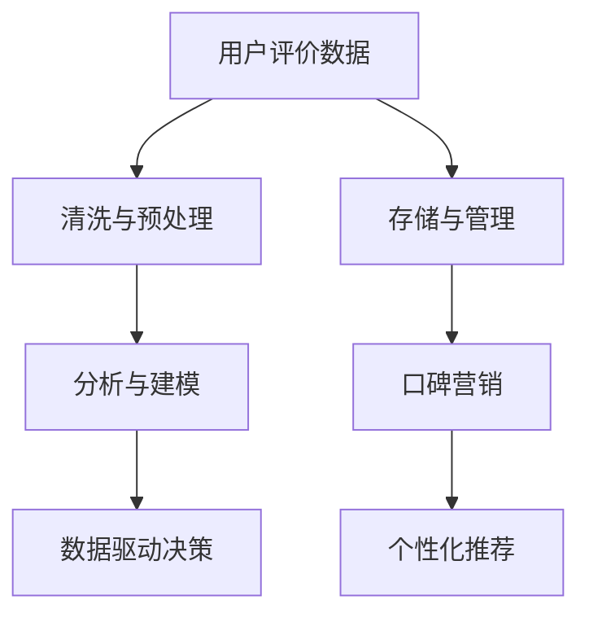

                 

## 1. 背景介绍

在知识付费领域，内容付费模式、精准营销、个性化推荐和数据驱动决策等技术的发展，为内容创作者提供了新的盈利方式和运营策略。用户评价作为内容价值的重要反馈指标，对于维护用户体验、提升内容质量和优化产品策略至关重要。然而，用户评价的管理和分析往往面临数据量大、信息碎片化、质量参差不齐等问题，如何在海量数据中提取有价值的反馈信息，以及如何基于用户评价优化产品营销策略，成为知识付费平台亟需解决的问题。本文旨在探讨用户评价管理与口碑营销的策略，为知识付费平台的运营提供参考。

## 2. 核心概念与联系

### 2.1 核心概念概述

在知识付费领域，用户评价的管理与口碑营销策略涉及多个核心概念：

- **用户评价管理**：通过对用户评价数据的收集、存储、清洗、分析和应用，帮助内容创作者了解用户反馈，持续改进产品和服务质量。
- **口碑营销**：通过传播用户对内容的积极反馈，吸引新用户，提高品牌影响力和用户忠诚度。
- **个性化推荐**：根据用户评价和行为数据，推荐用户感兴趣的内容，提升用户体验和平台粘性。
- **数据驱动决策**：利用用户评价和行为数据，进行精确的市场分析与产品优化，以实现业务目标。

这些概念之间的联系可以概括如下：用户评价数据的有效管理，是口碑营销和个性化推荐的基础；口碑营销和个性化推荐，能够进一步提高用户满意度，增加平台的用户粘性和品牌忠诚度；数据驱动决策，确保产品和服务能够满足用户需求，实现业务的持续增长。

### 2.2 核心概念原理和架构的 Mermaid 流程图



- **用户评价数据**：用户在使用知识付费平台时对内容的评价，包括评分、评论等。
- **清洗与预处理**：对原始数据进行去重、去噪、格式统一等处理，以提高数据的准确性和可用性。
- **存储与管理**：采用数据库或数据湖等技术，存储和管理用户评价数据。
- **分析与建模**：利用机器学习等方法，对用户评价数据进行分析，建立评分预测模型、情感分析模型等。
- **口碑营销**：通过各种渠道（如社交媒体、邮件、App内通知）传播用户对内容的正面评价，吸引新用户。
- **个性化推荐**：根据用户评价和行为数据，推荐用户感兴趣的内容，提升用户体验。
- **数据驱动决策**：基于用户评价和行为数据，优化产品策略、调整价格、推广渠道等，以实现业务目标。

## 3. 核心算法原理 & 具体操作步骤

### 3.1 算法原理概述

用户评价管理与口碑营销策略的核心算法主要涉及以下几个方面：

- **数据清洗与预处理**：对原始数据进行去重、去噪、格式转换等操作，提高数据的准确性和可用性。
- **情感分析**：利用自然语言处理技术，提取用户评价中的情感倾向，用于内容质量和用户满意度的评估。
- **评分预测**：构建机器学习模型，根据用户评价和行为数据，预测用户对内容的评分。
- **个性化推荐**：根据用户评价和行为数据，构建推荐系统，为用户推荐其感兴趣的内容。

### 3.2 算法步骤详解

#### 3.2.1 数据清洗与预处理

1. **数据收集**：通过平台后台、API接口等方式收集用户评价数据。
2. **数据去重与去噪**：去除重复、无效或噪声数据，提高数据的准确性。
3. **数据格式转换**：将评价数据转换为统一格式，便于后续处理和分析。

#### 3.2.2 情感分析

1. **文本预处理**：包括分词、去除停用词、词干提取等操作，将评价文本转化为向量表示。
2. **情感分类**：利用情感分析模型，将评价文本分类为正面、中性或负面。
3. **情感得分计算**：根据情感分类结果，计算文本的情感得分，用于评估内容质量。

#### 3.2.3 评分预测

1. **特征提取**：从用户评价和行为数据中提取特征，如评分、时间戳、用户特征等。
2. **模型训练**：选择合适的机器学习模型（如线性回归、随机森林等），根据特征和标签进行模型训练。
3. **评分预测**：使用训练好的模型，对新数据进行评分预测。

#### 3.2.4 个性化推荐

1. **用户画像构建**：根据用户评价和行为数据，构建用户画像，描述用户兴趣和偏好。
2. **推荐系统构建**：利用协同过滤、内容推荐、混合推荐等方法，构建个性化推荐系统。
3. **推荐效果评估**：根据推荐结果的用户反馈和行为数据，评估推荐系统的效果，不断优化算法和策略。

### 3.3 算法优缺点

**优点**：
- **高效性**：通过机器学习等技术，自动化处理大量数据，提高处理效率。
- **精准性**：利用数据驱动的决策，提高营销和推荐的精准度。
- **动态性**：能够根据用户反馈实时调整产品和营销策略，保持竞争力。

**缺点**：
- **数据质量依赖**：算法效果依赖于数据质量，如果原始数据存在偏差或不完整，会影响结果。
- **模型复杂性**：复杂模型需要较多的计算资源和时间，可能增加开发和部署成本。
- **隐私风险**：处理用户评价数据涉及用户隐私，需要遵守相关法规和隐私保护措施。

### 3.4 算法应用领域

用户评价管理与口碑营销策略在知识付费领域有广泛应用，具体包括：

- **内容优化**：通过用户评价，优化内容质量和呈现方式，提升用户满意度。
- **用户留存**：通过口碑营销和个性化推荐，增加用户粘性和忠诚度，提高留存率。
- **流量获取**：利用用户评价和推荐系统，吸引新用户，扩大流量来源。
- **收益提升**：通过精准营销和个性化定价策略，提高用户付费率和单次消费金额。

## 4. 数学模型和公式 & 详细讲解 & 举例说明

### 4.1 数学模型构建

#### 4.1.1 评分预测模型

假设用户评价数据为 $X$，包括文本特征 $x$、评分 $y$ 和其他特征 $z$，评分预测模型可以表示为：

$$ f(X) = \theta^T X $$

其中 $\theta$ 为模型参数，$f$ 为预测函数。

#### 4.1.2 情感分析模型

假设评价文本为 $x$，情感分析模型可以表示为：

$$ e(x) = \theta^T tanh(Wx + b) $$

其中 $e(x)$ 为情感得分，$W$ 和 $b$ 为情感分析模型的权重和偏置。

#### 4.1.3 个性化推荐模型

假设用户画像为 $u$，内容特征为 $c$，个性化推荐模型可以表示为：

$$ r(u, c) = \theta^T tanh(W(u, c) + b) $$

其中 $r(u, c)$ 为推荐得分，$W$ 和 $b$ 为推荐模型的权重和偏置。

### 4.2 公式推导过程

#### 4.2.1 评分预测模型推导

假设 $X$ 为 $d$ 维特征向量，$\theta$ 为 $d$ 维参数向量，则评分预测模型为：

$$ f(X) = \theta^T X $$

根据均方误差损失函数：

$$ \mathcal{L}(y, f(X)) = \frac{1}{2N} \sum_{i=1}^N (y_i - f(x_i))^2 $$

求导得到梯度：

$$ \frac{\partial \mathcal{L}(y, f(X))}{\partial \theta} = \frac{1}{N} \sum_{i=1}^N (y_i - f(x_i))x_i $$

更新参数：

$$ \theta \leftarrow \theta - \eta \frac{\partial \mathcal{L}(y, f(X))}{\partial \theta} $$

#### 4.2.2 情感分析模型推导

假设 $x$ 为 $n$ 维文本特征向量，$W$ 和 $b$ 为 $m$ 维和 $1$ 维参数向量，则情感分析模型为：

$$ e(x) = \theta^T tanh(Wx + b) $$

根据交叉熵损失函数：

$$ \mathcal{L}(y, e(x)) = -\frac{1}{N} \sum_{i=1}^N [y_i \log e(x_i) + (1-y_i) \log (1-e(x_i))] $$

求导得到梯度：

$$ \frac{\partial \mathcal{L}(y, e(x))}{\partial \theta} = \frac{1}{N} \sum_{i=1}^N [y_i e(x_i) - (1-y_i)(1-e(x_i))] \cdot tanh'(Wx_i + b)W $$

更新参数：

$$ \theta \leftarrow \theta - \eta \frac{\partial \mathcal{L}(y, e(x))}{\partial \theta} $$

#### 4.2.3 个性化推荐模型推导

假设 $u$ 和 $c$ 分别为 $n_u$ 维和 $n_c$ 维特征向量，$W$ 和 $b$ 为 $n_u \times n_c$ 维和 $1$ 维参数向量，则个性化推荐模型为：

$$ r(u, c) = \theta^T tanh(W(u, c) + b) $$

根据均方误差损失函数：

$$ \mathcal{L}(r(u, c), y) = \frac{1}{2N} \sum_{i=1}^N (r(u_i, c_i) - y_i)^2 $$

求导得到梯度：

$$ \frac{\partial \mathcal{L}(r(u, c), y)}{\partial \theta} = \frac{1}{N} \sum_{i=1}^N (r(u_i, c_i) - y_i) tanh'(W(u_i, c_i) + b)W(u_i, c_i) $$

更新参数：

$$ \theta \leftarrow \theta - \eta \frac{\partial \mathcal{L}(r(u, c), y)}{\partial \theta} $$

### 4.3 案例分析与讲解

假设某知识付费平台收集了用户对某一课程的评价数据，包括评分和评论文本。根据评分数据训练评分预测模型，通过评论文本训练情感分析模型。同时，利用评分和情感分析结果构建个性化推荐模型，为用户推荐感兴趣的课程。

## 5. 项目实践：代码实例和详细解释说明

### 5.1 开发环境搭建

#### 5.1.1 环境依赖

- Python 3.8+
- TensorFlow 2.4+
- Keras 2.4+
- NLTK 3.6+
- Scikit-learn 0.24+
- Pandas 1.0.4+
- Scipy 1.6.0+
- Matplotlib 3.4.2+

#### 5.1.2 环境配置

1. 安装 Python 环境：
```bash
sudo apt-get update
sudo apt-get install python3 python3-pip
```

2. 创建虚拟环境：
```bash
python3 -m venv venv
source venv/bin/activate
```

3. 安装依赖包：
```bash
pip install tensorflow keras nltk scikit-learn pandas scipy matplotlib
```

### 5.2 源代码详细实现

#### 5.2.1 数据清洗与预处理

```python
import pandas as pd
from sklearn.model_selection import train_test_split
from nltk.corpus import stopwords
from nltk.tokenize import word_tokenize

# 加载评价数据
data = pd.read_csv('ratings.csv')

# 去除重复数据
data.drop_duplicates(inplace=True)

# 清洗文本数据
data['text'] = data['text'].apply(word_tokenize)
data['text'] = data['text'].apply(lambda x: [word for word in x if word not in stopwords.words('english')])

# 分词、去除停用词等操作
data['text'] = data['text'].apply(lambda x: [word.lower() for word in x])
```

#### 5.2.2 情感分析

```python
from keras.preprocessing.text import Tokenizer
from keras.preprocessing.sequence import pad_sequences
from keras.layers import Embedding, LSTM, Dense, Dropout
from keras.models import Sequential

# 创建 Tokenizer
tokenizer = Tokenizer(num_words=5000, lower=True)
tokenizer.fit_on_texts(data['text'])

# 将文本转换为序列
data['text_seq'] = tokenizer.texts_to_sequences(data['text'])

# 填充序列
max_len = 200
data['text_seq'] = pad_sequences(data['text_seq'], maxlen=max_len, padding='post')

# 创建情感分析模型
model = Sequential()
model.add(Embedding(input_dim=5000, output_dim=128, input_length=max_len))
model.add(LSTM(128, dropout=0.2, recurrent_dropout=0.2))
model.add(Dense(1, activation='sigmoid'))
model.compile(loss='binary_crossentropy', optimizer='adam', metrics=['accuracy'])

# 训练模型
model.fit(data['text_seq'], data['rating'], epochs=10, batch_size=32, validation_split=0.2)
```

#### 5.2.3 评分预测

```python
from sklearn.linear_model import LinearRegression
from sklearn.metrics import mean_squared_error

# 加载评分数据
rating_data = pd.read_csv('rating.csv')

# 划分训练集和测试集
train_data, test_data = train_test_split(rating_data, test_size=0.2)

# 创建评分预测模型
model = LinearRegression()

# 训练模型
model.fit(train_data[['feature1', 'feature2', 'feature3']], train_data['rating'])

# 预测评分
train_pred = model.predict(train_data[['feature1', 'feature2', 'feature3']])
test_pred = model.predict(test_data[['feature1', 'feature2', 'feature3']])

# 计算评分预测误差
train_mse = mean_squared_error(train_data['rating'], train_pred)
test_mse = mean_squared_error(test_data['rating'], test_pred)

print(f'Train MSE: {train_mse}')
print(f'Test MSE: {test_mse}')
```

#### 5.2.4 个性化推荐

```python
from sklearn.neighbors import KNeighborsRegressor
from sklearn.metrics import mean_squared_error

# 加载评分数据
rating_data = pd.read_csv('rating.csv')

# 划分训练集和测试集
train_data, test_data = train_test_split(rating_data, test_size=0.2)

# 创建个性化推荐模型
model = KNeighborsRegressor(n_neighbors=10)

# 训练模型
model.fit(train_data[['user_id', 'item_id', 'feature1', 'feature2', 'feature3']], train_data['rating'])

# 预测评分
train_pred = model.predict(train_data[['user_id', 'item_id', 'feature1', 'feature2', 'feature3']])
test_pred = model.predict(test_data[['user_id', 'item_id', 'feature1', 'feature2', 'feature3']])

# 计算评分预测误差
train_mse = mean_squared_error(train_data['rating'], train_pred)
test_mse = mean_squared_error(test_data['rating'], test_pred)

print(f'Train MSE: {train_mse}')
print(f'Test MSE: {test_mse}')
```

### 5.3 代码解读与分析

#### 5.3.1 数据清洗与预处理

- `pandas` 用于数据加载和处理
- `nltk` 用于文本处理，去除停用词和分词
- `sklearn` 用于数据分割和填充

#### 5.3.2 情感分析

- `keras` 用于创建情感分析模型
- `Tokenizer` 用于文本序列化
- `LSTM` 用于模型设计
- `Dropout` 用于防止过拟合

#### 5.3.3 评分预测

- `sklearn` 用于创建线性回归模型
- `LinearRegression` 用于模型训练
- `mean_squared_error` 用于计算模型误差

#### 5.3.4 个性化推荐

- `sklearn` 用于创建KNN回归模型
- `KNeighborsRegressor` 用于模型训练
- `mean_squared_error` 用于计算模型误差

### 5.4 运行结果展示

通过上述代码，可以实现对用户评价数据的清洗、预处理、情感分析和评分预测等操作。结果展示了模型的训练效果和预测误差，为后续的口碑营销和个性化推荐提供了基础数据支持。

## 6. 实际应用场景

### 6.1 智能客服

智能客服系统可以利用用户评价数据进行情感分析，识别用户的满意度和需求。系统可以根据情感分析结果，优化服务流程，提升用户满意度。同时，系统还可以通过分析用户评价，生成常见问题库和回答模板，提高自动化客服的准确性和效率。

### 6.2 在线教育

在线教育平台可以利用用户评价数据进行个性化推荐，根据学生的学习行为和评价，推荐适合的学习资源和课程。系统还可以根据评价数据，调整课程内容和难度，提升学习效果。此外，系统可以通过情感分析，了解学生的学习情绪，及时调整教学策略，提高学习体验。

### 6.3 电商零售

电商零售平台可以利用用户评价数据进行情感分析，了解用户对商品和服务的满意度和需求。系统可以根据情感分析结果，优化商品推荐和促销策略，提升用户体验和转化率。此外，系统还可以根据用户评价，收集用户反馈，不断改进商品和服务质量，提高平台竞争力。

### 6.4 未来应用展望

未来，用户评价管理与口碑营销策略将有更广泛的应用场景：

- **智能家居**：智能家居系统可以利用用户评价数据，优化设备功能和用户体验，提升家庭生活质量。
- **智能交通**：智能交通系统可以利用用户评价数据，优化交通流量和路线规划，提升出行效率和安全性。
- **医疗健康**：医疗健康平台可以利用用户评价数据，优化诊疗流程和医患互动，提升医疗服务质量。

## 7. 工具和资源推荐

### 7.1 学习资源推荐

#### 7.1.1 书籍推荐

- 《Python自然语言处理》（李航著）
- 《深度学习》（Ian Goodfellow等著）
- 《机器学习实战》（Peter Harrington著）

#### 7.1.2 在线课程

- Coursera上的《自然语言处理》课程
- Udacity上的《深度学习基础》课程
- edX上的《机器学习基础》课程

### 7.2 开发工具推荐

#### 7.2.1 代码编辑器

- Visual Studio Code
- PyCharm
- Atom

#### 7.2.2 数据处理工具

- Jupyter Notebook
- Apache Spark
- Pandas

#### 7.2.3 机器学习框架

- TensorFlow
- PyTorch
- Keras

### 7.3 相关论文推荐

#### 7.3.1 情感分析

- Emotion Classification via Generalized Concurrent Neural Networks
- A Survey on Sentiment Analysis

#### 7.3.2 评分预测

- Neural Network-based Rating Prediction with Support Vector Machines
- Matrix Factorization Techniques for Recommender Systems

#### 7.3.3 个性化推荐

- Collaborative Filtering with Attention-based Latent Factor Model for Recommendation Systems
- A Comparative Study of Recommender Systems in Online Learning Platforms

## 8. 总结：未来发展趋势与挑战

### 8.1 研究成果总结

用户评价管理与口碑营销策略在知识付费领域的应用，已经取得了一定的成效。通过情感分析、评分预测和个性化推荐等技术，平台能够更好地了解用户需求，提升用户体验和平台粘性，实现业务增长。

### 8.2 未来发展趋势

未来，用户评价管理与口碑营销策略将朝着以下几个方向发展：

- **实时性**：随着数据实时采集和处理技术的进步，用户评价管理与口碑营销策略将实现实时化，及时响应用户反馈，优化产品和服务。
- **多模态融合**：结合语音、图像等多模态数据，进行综合情感分析和推荐，提高系统准确性和用户体验。
- **个性化推荐**：利用深度学习等技术，实现更精准的个性化推荐，提升推荐效果和用户满意度。
- **模型自适应**：根据用户反馈数据，自动调整模型参数，提高模型的自适应能力和稳定性。

### 8.3 面临的挑战

尽管用户评价管理与口碑营销策略已经取得了一定的进展，但仍面临以下挑战：

- **数据隐私和安全**：用户评价涉及用户隐私，需要严格遵守相关法规和隐私保护措施。
- **数据质量**：用户评价数据可能存在噪音和不完整，影响分析结果。
- **模型复杂性**：复杂的模型需要较多的计算资源和时间，可能增加开发和部署成本。

### 8.4 研究展望

未来，用户评价管理与口碑营销策略需要在以下几个方面进一步研究：

- **多领域应用**：探索用户评价在更多领域的应用，如智能家居、智能交通等。
- **用户生成内容（UGC）**：利用用户生成的评论和反馈，进行情感分析和推荐，提升用户体验。
- **模型优化**：研究更高效的情感分析和推荐算法，提高系统的准确性和效率。
- **跨平台协同**：将不同平台的用户评价数据进行整合，进行综合分析，提升系统的跨平台协同能力。

总之，用户评价管理与口碑营销策略是大数据时代知识付费平台的重要手段。通过数据驱动决策和个性化推荐，平台能够更好地满足用户需求，提升用户体验和平台价值。未来，随着技术的不断进步和应用的不断深入，这一策略将带来更大的商业价值和社会效益。

---

作者：禅与计算机程序设计艺术 / Zen and the Art of Computer Programming

