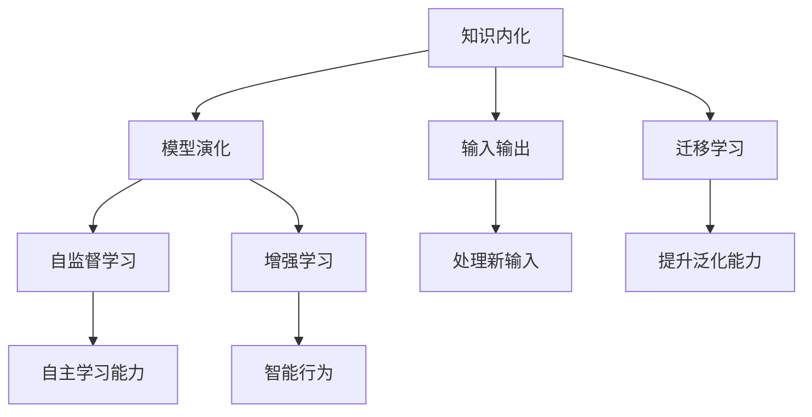

                 

# 知识内化：从输入到输出的转变

## 1. 背景介绍

### 1.1 问题由来
在知识爆炸的时代，面对海量知识，如何高效地进行知识的吸收、理解和应用，成为人类面临的重大挑战。特别是在人工智能(AI)领域，如何将知识内化到模型中，从而实现对新输入的快速处理和响应，是当前研究的重点和难点。

### 1.2 问题核心关键点
1. 知识内化：指将外界输入的知识转化为模型的内部表示，使其能够在处理新任务时发挥作用。
2. 模型演化：通过不断的训练和优化，模型能够逐步学习到知识的规律，提升处理复杂任务的能力。
3. 输入输出：知识内化最终反映在模型的输入和输出上，能够自动对新输入进行处理并给出合理输出。
4. 迁移学习：通过将知识从一个任务迁移到另一个任务，提升模型的泛化能力和适应性。
5. 自监督学习：利用未标注数据进行知识学习，提升模型的自主学习能力和抗干扰能力。
6. 增强学习：通过与环境的交互，不断优化模型，实现更智能的行为。

这些核心概念构成了知识内化过程的基础，通过理解这些概念，我们可以更好地把握知识内化的原理和应用方向。

### 1.3 问题研究意义
研究知识内化过程，对于推动人工智能技术的进步，提升模型的自主学习和处理能力，具有重要意义：

1. 提升模型的智能化水平。通过知识内化，模型能够自动理解和运用新知识，实现更加智能化的推理和决策。
2. 优化模型的泛化能力。知识内化过程使得模型能够从已有知识中学习到规律，对新任务具有更好的适应性。
3. 增强模型的鲁棒性。通过知识内化，模型能够更好地应对未知数据和复杂环境，提高鲁棒性和稳定性。
4. 加速模型的迭代优化。知识内化过程中，模型能够自主学习并调整参数，加速模型的优化和提升。
5. 推动AI技术的广泛应用。知识内化使得AI技术能够更广泛地应用于各种领域，提升生产力和效率。

## 2. 核心概念与联系

### 2.1 核心概念概述

为更好地理解知识内化过程，本节将介绍几个密切相关的核心概念：

- 知识内化(Knowledge Internalization)：指将外界输入的知识转化为模型的内部表示，使其能够在处理新任务时发挥作用。
- 模型演化(Model Evolution)：通过不断的训练和优化，模型能够逐步学习到知识的规律，提升处理复杂任务的能力。
- 输入输出(Input/Output)：知识内化最终反映在模型的输入和输出上，能够自动对新输入进行处理并给出合理输出。
- 迁移学习(Transfer Learning)：通过将知识从一个任务迁移到另一个任务，提升模型的泛化能力和适应性。
- 自监督学习(Self-supervised Learning)：利用未标注数据进行知识学习，提升模型的自主学习能力和抗干扰能力。
- 增强学习(Reinforcement Learning)：通过与环境的交互，不断优化模型，实现更智能的行为。

这些核心概念之间的逻辑关系可以通过以下Mermaid流程图来展示：



这个流程图展示了这个知识内化过程的主要步骤和逻辑关系：

1. 知识内化获取外界输入，转化为模型内部表示。
2. 模型演化通过不断的训练和优化，逐步学习知识规律。
3. 输入输出实现对新输入的处理和输出。
4. 迁移学习提升模型的泛化能力和适应性。
5. 自监督学习提升模型的自主学习能力和抗干扰能力。
6. 增强学习实现更智能的行为。

这些概念共同构成了知识内化的基本框架，使得模型能够从输入中获取知识，并转化为输出，实现智能化的推理和决策。

## 3. 核心算法原理 & 具体操作步骤
### 3.1 算法原理概述

知识内化过程本质上是一个从输入到输出的映射过程。通过将外界输入的知识转化为模型的内部表示，模型能够对新输入进行处理，并输出合理的答案或决策。这一过程通常通过深度学习模型来实现，如神经网络。

形式化地，假设输入为 $x$，输出为 $y$，模型为 $f$，则知识内化的目标是找到函数 $f$，使得 $f(x) = y$。这一目标可以通过最小化损失函数 $\mathcal{L}$ 来实现，即：

$$
\min_{f} \mathcal{L}(f(x), y)
$$

其中，$\mathcal{L}$ 为损失函数，用于衡量模型的预测输出与真实标签之间的差异。常见的损失函数包括均方误差损失、交叉熵损失等。

### 3.2 算法步骤详解

知识内化过程通常包括以下几个关键步骤：

**Step 1: 数据准备**
- 收集和处理输入数据 $x$，通常是文本、图像、音频等形式的数据。
- 将数据转换为模型可以接受的格式，如将文本转换为 token ids。

**Step 2: 模型选择与设计**
- 选择合适的深度学习模型架构，如卷积神经网络(CNN)、循环神经网络(RNN)、Transformer等。
- 定义模型的输入和输出层，以及中间隐藏层的结构。

**Step 3: 模型训练**
- 将准备好的数据输入模型，进行前向传播计算预测输出。
- 计算预测输出与真实标签之间的损失函数。
- 反向传播更新模型参数，最小化损失函数。
- 重复上述步骤直至收敛，得到最优的模型参数。

**Step 4: 模型评估与优化**
- 使用验证集或测试集评估模型的性能指标，如准确率、F1分数等。
- 根据评估结果，对模型进行进一步优化，如调整学习率、正则化参数、批量大小等。
- 持续迭代训练，提升模型效果。

**Step 5: 模型部署与应用**
- 将训练好的模型保存和导出，便于在实际应用中使用。
- 集成到实际应用系统中，对新输入进行推理和预测。
- 持续收集新数据，定期重新训练和优化模型。

以上是知识内化过程的一般流程。在实际应用中，还需要针对具体任务的特点，对各个环节进行优化设计，如改进损失函数、引入正则化技术、搜索最优的超参数组合等，以进一步提升模型性能。

### 3.3 算法优缺点

知识内化过程具有以下优点：
1. 高效性。通过深度学习模型，模型能够自动学习和内化知识，避免手动编写规则和逻辑。
2. 适应性强。模型可以适应不同的数据类型和任务，通过迁移学习和自监督学习提升泛化能力。
3. 自主学习。模型能够自主学习并调整参数，适应不断变化的环境和数据分布。
4. 可扩展性。模型可以通过增加隐藏层和神经元数量来提升处理复杂任务的能力。

同时，该过程也存在一定的局限性：
1. 需要大量数据。知识内化过程依赖大量标注数据进行训练，数据获取和标注成本较高。
2. 模型复杂度高。深度学习模型的复杂度较高，训练和推理资源消耗较大。
3. 难以解释。模型通常被视为"黑盒"，难以解释其内部工作机制和决策逻辑。
4. 过度拟合风险。模型在训练数据上表现优秀，但在新数据上可能表现不佳。

尽管存在这些局限性，但就目前而言，知识内化过程仍是实现知识自动化的主要方式。未来相关研究将聚焦于如何降低数据需求、提高模型可解释性和优化模型复杂度，以更好地应用于实际场景。

### 3.4 算法应用领域

知识内化过程在人工智能领域得到了广泛的应用，覆盖了几乎所有常见的应用场景，例如：

- 自然语言处理(NLP)：将文本转换为模型内部表示，进行文本分类、情感分析、机器翻译等任务。
- 计算机视觉(CV)：将图像转换为模型内部表示，进行图像分类、目标检测、图像生成等任务。
- 语音识别(SR)：将语音转换为模型内部表示，进行语音识别、语音合成等任务。
- 推荐系统：将用户行为转换为模型内部表示，进行物品推荐、广告投放等任务。
- 自动驾驶：将传感器数据转换为模型内部表示，进行目标检测、路径规划等任务。
- 医疗诊断：将医学影像转换为模型内部表示，进行疾病诊断、治疗方案推荐等任务。

除了上述这些经典应用外，知识内化过程还被创新性地应用于更多场景中，如工业物联网、智能制造、智慧城市等，为人工智能技术在各行各业的发展提供了新的方向。

## 4. 数学模型和公式 & 详细讲解  
### 4.1 数学模型构建

本节将使用数学语言对知识内化过程进行更加严格的刻画。

记输入为 $x$，输出为 $y$，模型为 $f$。定义模型 $f$ 在输入 $x$ 上的损失函数为 $\mathcal{L}(f(x), y)$，则在训练集 $D$ 上的经验风险为：

$$
\mathcal{L}(f) = \frac{1}{N}\sum_{i=1}^N \mathcal{L}(f(x_i), y_i)
$$

其中 $N$ 为样本总数。

知识内化的目标是最小化经验风险，即找到最优函数 $f$：

$$
f^* = \mathop{\arg\min}_{f} \mathcal{L}(f)
$$

在实践中，我们通常使用基于梯度的优化算法（如SGD、Adam等）来近似求解上述最优化问题。设 $\eta$ 为学习率，$\lambda$ 为正则化系数，则参数的更新公式为：

$$
f \leftarrow f - \eta \nabla_{f}\mathcal{L}(f) - \eta\lambda f
$$

其中 $\nabla_{f}\mathcal{L}(f)$ 为损失函数对模型 $f$ 的梯度，可通过反向传播算法高效计算。

### 4.2 公式推导过程

以下我们以二分类任务为例，推导交叉熵损失函数及其梯度的计算公式。

假设模型 $f$ 在输入 $x$ 上的输出为 $\hat{y}=f(x) \in [0,1]$，表示样本属于正类的概率。真实标签 $y \in \{0,1\}$。则二分类交叉熵损失函数定义为：

$$
\mathcal{L}(f(x),y) = -[y\log \hat{y} + (1-y)\log (1-\hat{y})]
$$

将其代入经验风险公式，得：

$$
\mathcal{L}(f) = -\frac{1}{N}\sum_{i=1}^N [y_i\log f(x_i)+(1-y_i)\log(1-f(x_i))]
$$

根据链式法则，损失函数对模型 $f$ 的梯度为：

$$
\nabla_{f}\mathcal{L}(f) = -\frac{1}{N}\sum_{i=1}^N \left(\frac{y_i}{f(x_i)} - \frac{1-y_i}{1-f(x_i)}\right) \nabla_{x_i}f(x_i)
$$

其中 $\nabla_{x_i}f(x_i)$ 为模型在输入 $x_i$ 上的梯度，可通过自动微分技术完成计算。

在得到损失函数的梯度后，即可带入参数更新公式，完成模型的迭代优化。重复上述过程直至收敛，最终得到适应输入数据的最优模型 $f^*$。

## 5. 项目实践：代码实例和详细解释说明
### 5.1 开发环境搭建

在进行知识内化实践前，我们需要准备好开发环境。以下是使用Python进行TensorFlow开发的环境配置流程：

1. 安装Anaconda：从官网下载并安装Anaconda，用于创建独立的Python环境。

2. 创建并激活虚拟环境：
```bash
conda create -n tf-env python=3.8 
conda activate tf-env
```

3. 安装TensorFlow：根据CUDA版本，从官网获取对应的安装命令。例如：
```bash
conda install tensorflow tensorflow-cpu -c conda-forge
```

4. 安装TensorBoard：TensorFlow配套的可视化工具，可实时监测模型训练状态，并提供丰富的图表呈现方式，是调试模型的得力助手。

```bash
pip install tensorboard
```

完成上述步骤后，即可在`tf-env`环境中开始知识内化实践。

### 5.2 源代码详细实现

这里我们以图像分类任务为例，给出使用TensorFlow进行卷积神经网络(CNN)模型的知识内化代码实现。

首先，定义图像分类任务的数据处理函数：

```python
import tensorflow as tf
from tensorflow.keras.preprocessing.image import ImageDataGenerator

train_datagen = ImageDataGenerator(rescale=1./255, shear_range=0.2, zoom_range=0.2, horizontal_flip=True)
test_datagen = ImageDataGenerator(rescale=1./255)

train_generator = train_datagen.flow_from_directory(
    'train_dir',
    target_size=(224, 224),
    batch_size=32,
    class_mode='categorical')

test_generator = test_datagen.flow_from_directory(
    'test_dir',
    target_size=(224, 224),
    batch_size=32,
    class_mode='categorical')
```

然后，定义模型和损失函数：

```python
from tensorflow.keras.models import Sequential
from tensorflow.keras.layers import Conv2D, MaxPooling2D, Flatten, Dense

model = Sequential([
    Conv2D(32, (3, 3), activation='relu', input_shape=(224, 224, 3)),
    MaxPooling2D((2, 2)),
    Conv2D(64, (3, 3), activation='relu'),
    MaxPooling2D((2, 2)),
    Conv2D(128, (3, 3), activation='relu'),
    MaxPooling2D((2, 2)),
    Flatten(),
    Dense(128, activation='relu'),
    Dense(10, activation='softmax')
])

loss_fn = tf.keras.losses.CategoricalCrossentropy()
```

接着，定义训练和评估函数：

```python
from tensorflow.keras.optimizers import Adam

optimizer = Adam(lr=0.001)

def train_epoch(model, train_generator, epochs):
    model.compile(optimizer=optimizer, loss=loss_fn, metrics=['accuracy'])
    model.fit(train_generator, epochs=epochs, validation_data=test_generator)
    
def evaluate(model, test_generator):
    test_loss, test_acc = model.evaluate(test_generator)
    print(f'Test Loss: {test_loss:.4f}')
    print(f'Test Accuracy: {test_acc:.4f}')
    
# 启动训练流程并在测试集上评估
epochs = 10
train_epoch(model, train_generator, epochs)
evaluate(model, test_generator)
```

以上就是使用TensorFlow进行CNN模型知识内化的完整代码实现。可以看到，借助TensorFlow的高效计算和丰富的组件库，知识内化的代码实现变得相对简单，开发者可以将更多精力放在模型设计、数据处理等核心逻辑上。

### 5.3 代码解读与分析

让我们再详细解读一下关键代码的实现细节：

**ImageDataGenerator类**：
- `__init__`方法：初始化数据增强和预处理参数，如图像缩放、旋转、翻转等。
- `flow_from_directory`方法：将目录下的图像数据加载到DataGenerator中，并进行预处理，转化为模型可接受的形式。

**Sequential模型**：
- 定义了卷积神经网络的基本结构，包含多个卷积层、池化层、全连接层等。
- `Conv2D`层：定义了卷积核的数量、大小、激活函数等。
- `MaxPooling2D`层：定义了池化核的大小和步长。
- `Flatten`层：将卷积层的输出展平成一维向量。
- `Dense`层：定义了全连接层的神经元数量和激活函数。

**损失函数和优化器**：
- `CategoricalCrossentropy`：定义了多分类任务的损失函数，计算预测输出与真实标签之间的交叉熵。
- `Adam`：定义了优化器的类型和初始学习率。

**训练和评估函数**：
- `train_epoch`函数：通过调用模型的`fit`方法，在训练集上对模型进行训练，并在验证集上评估模型性能。
- `evaluate`函数：使用模型的`evaluate`方法，在测试集上评估模型性能。

可以看到，TensorFlow提供了强大的工具和组件库，使得知识内化的代码实现变得简单高效。开发者可以快速构建和训练模型，完成知识内化任务。

## 6. 实际应用场景
### 6.1 智能推荐系统

基于知识内化过程的推荐系统，可以实时地从用户行为数据中学习，并进行精准推荐。传统的推荐系统主要依赖用户的历史行为数据，而基于知识内化的方法能够更全面地理解用户的兴趣和需求，实现更加个性化和多样化的推荐。

具体而言，可以收集用户浏览、点击、评分等行为数据，提取和用户交互的物品特征。将特征数据作为模型输入，利用知识内化过程，训练模型学习用户兴趣和物品之间的关系。在生成推荐列表时，先用候选物品的特征作为输入，由模型预测用户的兴趣匹配度，再结合其他特征综合排序，便可以得到个性化程度更高的推荐结果。

### 6.2 金融风控系统

金融风控系统需要实时地对客户的风险进行评估和预测。传统的风控系统主要依赖手动编写的规则和专家经验，而基于知识内化的方法能够从历史数据中自动学习风险特征，提升模型的自主学习和预测能力。

具体而言，可以收集客户的历史交易数据、信用评分、行为记录等数据，将其作为模型输入。利用知识内化过程，训练模型学习客户的行为模式和风险特征。在处理新客户数据时，利用训练好的模型进行风险评估和预测，及时发现潜在风险，防范金融诈骗和不良贷款。

### 6.3 医疗诊断系统

医疗诊断系统需要从患者的医学影像、病历记录中自动学习，进行疾病诊断和个性化治疗方案推荐。传统的诊断系统主要依赖医生的经验和直觉，而基于知识内化的方法能够从海量医学数据中自动学习知识，提升诊断的准确性和可靠性。

具体而言，可以收集患者的医学影像、电子病历、基因信息等数据，将其作为模型输入。利用知识内化过程，训练模型学习医学知识和规律。在处理新患者数据时，利用训练好的模型进行疾病诊断和治疗方案推荐，提供个性化的诊疗方案。

### 6.4 未来应用展望

随着知识内化过程的发展，未来的智能系统将更加智能化、普适化和自适应。以下是我们对未来应用场景的展望：

1. 智能医疗：基于知识内化过程，构建智能诊疗系统，实现疾病的自动诊断、治疗方案的个性化推荐。
2. 智慧教育：基于知识内化过程，构建智能学习系统，实现学习内容的个性化推荐、学习过程的智能评估。
3. 智能交通：基于知识内化过程，构建智能交通系统，实现交通流量的智能调度、交通事故的自动预警。
4. 智能制造：基于知识内化过程，构建智能制造系统，实现生产流程的智能优化、设备故障的自动诊断。
5. 智能城市：基于知识内化过程，构建智能城市系统，实现城市运行状态的智能监测、资源配置的智能优化。

总之，基于知识内化过程的智能系统将不断拓展其应用领域，为各行各业带来新的变革和机遇。

## 7. 工具和资源推荐
### 7.1 学习资源推荐

为了帮助开发者系统掌握知识内化过程的理论基础和实践技巧，这里推荐一些优质的学习资源：

1. 《深度学习》（Ian Goodfellow）：深度学习领域的经典教材，系统介绍了深度学习的基础知识和应用场景。
2. 《Python深度学习》（Francois Chollet）：TensorFlow的作者所写，全面介绍了TensorFlow的使用方法和深度学习的应用实践。
3. 《NLP基础与深度学习》（Denny Britz）：自然语言处理领域的入门书籍，介绍了NLP基础知识和深度学习在NLP中的应用。
4. 《TensorFlow实战Google AI》（Bharath Ramsundar）：TensorFlow实战教程，涵盖TensorFlow的基础知识和应用实践。
5. 《Reinforcement Learning: An Introduction》（Richard S. Sutton）：强化学习领域的经典教材，系统介绍了强化学习的基础知识和应用场景。

通过对这些资源的学习实践，相信你一定能够快速掌握知识内化过程的理论基础和实践技巧，并用于解决实际的NLP问题。

### 7.2 开发工具推荐

高效的开发离不开优秀的工具支持。以下是几款用于知识内化过程开发的常用工具：

1. TensorFlow：由Google主导开发的开源深度学习框架，生产部署方便，适合大规模工程应用。
2. PyTorch：基于Python的开源深度学习框架，灵活动态的计算图，适合快速迭代研究。
3. Keras：基于TensorFlow和Theano的高级API，可以快速构建深度学习模型。
4. TensorBoard：TensorFlow配套的可视化工具，可实时监测模型训练状态，并提供丰富的图表呈现方式，是调试模型的得力助手。
5. Jupyter Notebook：开源的交互式计算环境，支持Python、R、Scala等多种语言，适合快速实验和协作开发。

合理利用这些工具，可以显著提升知识内化过程的开发效率，加快创新迭代的步伐。

### 7.3 相关论文推荐

知识内化过程的研究始于学界的持续探索。以下是几篇奠基性的相关论文，推荐阅读：

1. Deep Learning（Ian Goodfellow等）：深度学习领域的经典教材，系统介绍了深度学习的基础知识和应用场景。
2. Convolutional Neural Networks for Healthcare（Krishnan Suresh等）：介绍了卷积神经网络在医疗领域的应用，包括图像分类、疾病诊断等任务。
3. Knowledge Graphs and AI for Personalized Healthcare（Rajeev Srivastava等）：介绍了知识图谱在医疗领域的应用，包括疾病诊断、治疗方案推荐等任务。
4. Collaborative Filtering for Implicit Feedback Datasets（John L. Kallus等）：介绍了协同过滤在推荐系统中的应用，包括基于知识内化的推荐方法。
5. Reinforcement Learning: An Introduction（Richard S. Sutton等）：强化学习领域的经典教材，系统介绍了强化学习的基础知识和应用场景。

这些论文代表了大语言模型知识内化过程的发展脉络。通过学习这些前沿成果，可以帮助研究者把握学科前进方向，激发更多的创新灵感。

## 8. 总结：未来发展趋势与挑战

### 8.1 总结

本文对知识内化过程进行了全面系统的介绍。首先阐述了知识内化过程的研究背景和意义，明确了知识内化过程在推动人工智能技术进步中的独特价值。其次，从原理到实践，详细讲解了知识内化过程的数学原理和关键步骤，给出了知识内化过程的完整代码实例。同时，本文还广泛探讨了知识内化过程在智能推荐、金融风控、医疗诊断等多个领域的应用前景，展示了知识内化过程的广阔潜力。此外，本文精选了知识内化过程的学习资源，力求为读者提供全方位的技术指引。

通过本文的系统梳理，可以看到，知识内化过程在人工智能领域得到了广泛的应用，帮助模型从输入中自动学习知识，并转化为输出，实现智能化的推理和决策。未来，伴随知识内化过程的发展，基于知识内化过程的智能系统将不断拓展其应用领域，为各行各业带来新的变革和机遇。

### 8.2 未来发展趋势

展望未来，知识内化过程将呈现以下几个发展趋势：

1. 自动化和智能化水平提升。未来的知识内化过程将更加智能化，能够自动从输入数据中学习知识，并自动调整模型参数，实现更高效的知识内化。
2. 多模态融合。未来的知识内化过程将更加灵活，能够融合视觉、语音、文本等多模态信息，实现更全面、准确的知识表示。
3. 跨领域知识迁移。未来的知识内化过程将更加通用，能够在不同领域之间进行知识迁移，提升模型的泛化能力和适应性。
4. 自监督学习和生成对抗网络(GAN)技术的应用。未来的知识内化过程将更加依赖自监督学习和大规模生成对抗网络，提升模型的自主学习能力和鲁棒性。
5. 可解释性和公平性。未来的知识内化过程将更加注重模型的可解释性和公平性，确保模型的输出透明、公正。
6. 实时性和可靠性。未来的知识内化过程将更加注重实时性和可靠性，确保模型能够快速响应新数据，并提供稳定、准确的输出。

这些趋势展示了知识内化过程的未来发展方向，将进一步提升模型的自主学习和处理能力，推动人工智能技术的进步。

### 8.3 面临的挑战

尽管知识内化过程已经取得了瞩目成就，但在迈向更加智能化、普适化应用的过程中，它仍面临着诸多挑战：

1. 数据需求高。知识内化过程依赖大量高质量标注数据进行训练，数据获取和标注成本较高。
2. 模型复杂度高。深度学习模型的复杂度较高，训练和推理资源消耗较大。
3. 模型可解释性差。模型通常被视为"黑盒"，难以解释其内部工作机制和决策逻辑。
4. 模型鲁棒性不足。模型在训练数据上表现优秀，但在新数据上可能表现不佳。
5. 模型公平性问题。模型可能会在训练数据中学习到偏见，导致输出不公平。
6. 模型安全性问题。模型可能会学习到有害信息，导致输出误导性、歧视性。

尽管存在这些挑战，但未来的知识内化过程仍具有广阔的发展前景。相信随着学界和产业界的共同努力，这些挑战终将一一被克服，知识内化过程必将在构建人机协同的智能时代中扮演越来越重要的角色。

### 8.4 研究展望

面对知识内化过程所面临的种种挑战，未来的研究需要在以下几个方面寻求新的突破：

1. 低数据需求的知识内化方法。探索无监督和半监督知识内化方法，降低对标注数据的依赖，利用自监督学习、主动学习等技术提升模型的自主学习能力。
2. 参数高效的模型架构。开发更加参数高效的模型架构，在固定大部分预训练参数的同时，只更新极少量的任务相关参数，实现更高效的知识内化。
3. 可解释的模型设计。引入可解释性技术，如注意力机制、可视化工具等，增强模型的可解释性和透明性，确保模型的输出合理、公正。
4. 鲁棒性和公平性的提升。引入鲁棒性技术和公平性约束，提升模型的鲁棒性和公平性，避免过拟合和偏见问题。
5. 实时性系统的构建。优化模型推理过程，引入实时计算和内存优化技术，实现更高效的实时性系统。
6. 跨模态知识融合。融合视觉、语音、文本等多模态信息，实现更全面、准确的知识表示和推理。

这些研究方向的探索，将引领知识内化过程向更高的台阶迈进，为构建安全、可靠、可解释、可控的智能系统铺平道路。面向未来，知识内化过程还需要与其他人工智能技术进行更深入的融合，如知识表示、因果推理、强化学习等，多路径协同发力，共同推动人工智能技术的发展。

## 9. 附录：常见问题与解答

**Q1：知识内化是否适用于所有应用场景？**

A: 知识内化过程适用于大部分应用场景，尤其是需要从输入数据中自动学习知识的任务。但对于一些特定领域的任务，如医疗、法律等，仅仅依靠通用语料预训练的模型可能难以很好地适应。此时需要在特定领域语料上进一步预训练，再进行知识内化，才能获得理想效果。

**Q2：知识内化过程中如何避免过拟合？**

A: 知识内化过程中，过拟合是一个常见问题。常见的缓解策略包括：
1. 数据增强：通过数据增强技术，扩充训练集，提高模型的泛化能力。
2. 正则化：使用L2正则、Dropout等技术，防止模型过度拟合训练数据。
3. 早停机制：使用早停机制，当验证集上的性能不再提升时，及时停止训练，避免过拟合。
4. 参数共享：在模型中引入参数共享机制，减少参数数量，提高模型的泛化能力。
5. 自监督学习：利用自监督学习任务，提升模型的自主学习能力，减少对标注数据的依赖。

这些策略往往需要根据具体任务和数据特点进行灵活组合，以最大化模型的泛化能力和鲁棒性。

**Q3：知识内化过程中如何提升模型的可解释性？**

A: 提升模型的可解释性是知识内化过程中需要重点关注的问题。常见的策略包括：
1. 可视化工具：使用可视化工具，如TensorBoard，展示模型的内部表示和推理过程，增强模型的透明性。
2. 注意力机制：引入注意力机制，展示模型在推理过程中的注意力分配情况，增强模型的可解释性。
3. 可解释性模型：设计可解释性模型，如LIME、SHAP等，用于解释模型的决策过程。
4. 交互式系统：开发交互式系统，让用户能够与模型进行交互，了解模型的推理过程和输出结果。

通过这些策略，可以提升模型的可解释性，确保模型的输出透明、公正，满足实际应用的需求。

**Q4：知识内化过程中如何提升模型的鲁棒性？**

A: 提升模型的鲁棒性是知识内化过程中需要重点关注的问题。常见的策略包括：
1. 对抗样本：使用对抗样本训练模型，增强模型的鲁棒性和泛化能力。
2. 鲁棒性正则化：引入鲁棒性正则化技术，防止模型在训练过程中学习到有害信息。
3. 多模型集成：通过多模型集成，提高模型的鲁棒性和泛化能力，减少单模型过拟合的风险。
4. 鲁棒性损失函数：设计鲁棒性损失函数，如对抗损失函数、鲁棒性交叉熵等，提升模型的鲁棒性。

通过这些策略，可以提升模型的鲁棒性，确保模型在不同数据分布下的稳定性和泛化能力。

**Q5：知识内化过程中如何处理多模态数据？**

A: 处理多模态数据是知识内化过程中需要重点关注的问题。常见的策略包括：
1. 多模态数据融合：使用多模态数据融合技术，如时空池化、注意力机制等，将不同模态的数据融合在一起，提升模型的表示能力。
2. 多模态模型设计：设计多模态模型，如多模态卷积神经网络、多模态Transformer等，提升模型的泛化能力和表示能力。
3. 多模态数据增强：使用多模态数据增强技术，如混合现实增强、数据互增等，提升模型的泛化能力和鲁棒性。

通过这些策略，可以处理多模态数据，提升模型的泛化能力和表示能力，实现更全面、准确的知识表示和推理。

---

作者：禅与计算机程序设计艺术 / Zen and the Art of Computer Programming

