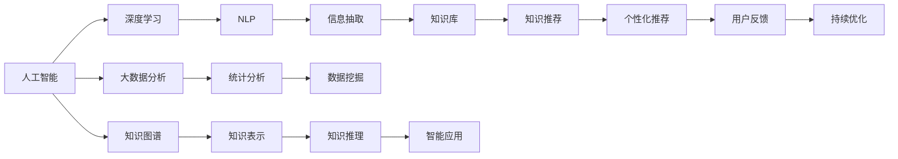

                 

# 知识经济下知识付费的人工智能知识挖掘技术

> 关键词：人工智能,知识付费,知识挖掘,知识图谱,自然语言处理(NLP),深度学习,大数据分析

## 1. 背景介绍

在知识经济时代，知识和信息资源的积累与共享已经成为推动社会进步和经济发展的关键驱动力。随着互联网和智能技术的不断进步，知识付费模式应运而生，为人们提供了一个便捷、高效的知识获取和分享平台。然而，面对海量且庞杂的知识内容，如何在有限的时间内，高效挖掘有价值的信息，成为知识付费平台亟待解决的难题。

人工智能技术的兴起，为知识付费平台提供了强大的技术支撑。通过深度学习和知识图谱等先进技术，可以实现从文本、图像、视频等数据中自动挖掘有价值的知识，为用户提供精准、个性化的知识推荐和服务。本文章将详细探讨基于人工智能的知识挖掘技术在知识付费平台中的应用，希望能为相关平台提供有价值的参考。

## 2. 核心概念与联系

### 2.1 核心概念概述

要深入理解基于人工智能的知识挖掘技术，首先需要明确几个核心概念：

- **人工智能(AI)**：模拟人类智能行为，实现计算机的自主学习、推理、感知和决策能力的科学和技术。
- **知识付费平台**：提供知识内容的付费订阅、购买、阅读和分享服务，以满足用户个性化、高质量的知识需求。
- **知识图谱**：一种基于图结构的知识表示方式，通过节点和边来描述实体、属性和关系，支持高效的知识检索、推理和应用。
- **自然语言处理(NLP)**：人工智能领域的重要分支，涉及文本理解、信息抽取、文本生成等技术，用于处理和理解人类语言。
- **深度学习(Deep Learning)**：一种基于神经网络的机器学习方法，通过多层次的非线性变换，自动学习和提取数据中的复杂特征。
- **大数据分析**：通过对大规模数据集进行统计、分析和挖掘，发现隐藏在数据中的规律和知识，支持决策和优化。

这些概念相互联系，共同构建了知识挖掘技术的基础框架。人工智能技术通过深度学习和大数据分析，从海量的知识内容中挖掘出有价值的信息；知识图谱技术则提供了结构化的知识表示和推理能力，支持高效的智能查询和应用。

### 2.2 核心概念原理和架构的 Mermaid 流程图



该图展示了从数据输入到知识推荐和应用的整个知识挖掘流程。深度学习和大数据分析用于从原始数据中提取特征和规律；NLP技术用于处理文本信息，抽取实体和关系；知识图谱技术用于构建结构化的知识表示，进行推理和应用。最终，系统根据用户反馈进行持续优化，提升推荐效果。

## 3. 核心算法原理 & 具体操作步骤

### 3.1 算法原理概述

基于人工智能的知识挖掘技术，主要依赖于深度学习、知识图谱和NLP技术。其核心原理是通过以下步骤，从文本、图像、视频等多模态数据中挖掘有价值的信息：

1. **数据预处理**：对原始数据进行清洗、归一化和特征提取，准备用于深度学习的输入。
2. **深度学习建模**：使用神经网络模型进行特征学习和提取，自动识别数据中的模式和规律。
3. **知识抽取**：通过NLP技术，从文本中抽取实体、关系和属性等信息，构建知识图谱。
4. **知识推理**：使用知识图谱中的结构化知识，进行逻辑推理和查询，获取更深层次的知识。
5. **知识应用**：将挖掘出的知识应用于个性化推荐、智能问答、情感分析等场景，为用户提供精准服务。

### 3.2 算法步骤详解

**Step 1: 数据预处理**

- **数据清洗**：去除噪声和无用数据，确保数据质量。
- **数据归一化**：将不同类型的数据转换为标准格式，便于后续处理。
- **特征提取**：使用TF-IDF、Word2Vec等技术提取文本特征，使用图像卷积神经网络提取图像特征。

**Step 2: 深度学习建模**

- **选择模型**：根据任务需求选择合适的深度学习模型，如卷积神经网络(CNN)、循环神经网络(RNN)、Transformer等。
- **模型训练**：使用标注数据训练模型，优化模型参数。
- **模型评估**：在验证集上评估模型性能，调整超参数，提升模型精度。

**Step 3: 知识抽取**

- **实体识别**：使用命名实体识别(NER)技术识别文本中的实体，如人名、地名、机构名等。
- **关系抽取**：使用关系抽取技术识别实体之间的关系，如“∈”、“∉”等。
- **属性抽取**：使用属性抽取技术识别实体的属性，如“年龄”、“性别”等。

**Step 4: 知识推理**

- **构建知识图谱**：将抽取的实体、关系和属性构建成知识图谱，使用图数据库存储。
- **知识推理**：使用图神经网络或符号推理方法，在知识图谱中进行逻辑推理和查询。
- **推理优化**：引入优化技术，提升推理效率和准确性。

**Step 5: 知识应用**

- **个性化推荐**：基于用户的历史行为和偏好，使用协同过滤、内容推荐等算法进行推荐。
- **智能问答**：使用自然语言理解技术，理解用户问题，并在知识图谱中检索答案。
- **情感分析**：使用情感分析技术，识别文本中的情感倾向，提供情感支持。

### 3.3 算法优缺点

**优点**：

- **高效性**：自动化的数据处理和特征提取，大大提高了知识挖掘的效率。
- **准确性**：深度学习和知识图谱技术提高了知识抽取和推理的准确性。
- **可扩展性**：易于扩展到不同领域和场景，支持多模态数据挖掘。

**缺点**：

- **高成本**：需要大量的标注数据和计算资源，成本较高。
- **复杂性**：模型设计和技术实现较为复杂，需要专业知识支持。
- **局限性**：对于一些领域特定的知识，如法律、医学等，现有模型可能难以适用。

### 3.4 算法应用领域

基于人工智能的知识挖掘技术，已经在知识付费平台、智能客服、智能推荐等多个领域得到了广泛应用：

- **知识付费平台**：通过挖掘文章、视频、音频等多模态内容，提供个性化推荐和智能问答服务，提升用户粘性和满意度。
- **智能客服**：通过分析用户咨询历史，自动抽取问题和回答模板，实现智能问答和问题解决。
- **智能推荐**：结合用户行为数据和知识图谱，提供个性化推荐和内容匹配服务，提升用户使用体验。

## 4. 数学模型和公式 & 详细讲解 & 举例说明

### 4.1 数学模型构建

基于人工智能的知识挖掘技术，主要涉及深度学习、知识图谱和NLP等多个领域。本节将以知识推荐系统为例，构建数学模型。

假设知识推荐系统包含用户集合 $U$、物品集合 $I$ 和用户与物品的交互矩阵 $R \in \{0, 1\}^{U \times I}$。每个用户 $u \in U$ 对物品 $i \in I$ 的评分表示为 $r_{ui}$，其中 $r_{ui} = 1$ 表示用户 $u$ 对物品 $i$ 感兴趣，否则 $r_{ui} = 0$。知识推荐系统的目标是最大化预测评分和真实评分的相关性，即最大化目标函数：

$$
\max \sum_{u=1}^U \sum_{i=1}^I r_{ui} \log \hat{r}_{ui} + (1 - r_{ui}) \log (1 - \hat{r}_{ui})
$$

其中 $\hat{r}_{ui}$ 为模型预测评分，可以使用各种深度学习模型（如矩阵分解、协同过滤、深度神经网络等）进行预测。

### 4.2 公式推导过程

假设使用矩阵分解方法进行知识推荐，将用户-物品评分矩阵 $R$ 分解为两个低秩矩阵 $U \in \mathbb{R}^{U \times D}$ 和 $V \in \mathbb{R}^{I \times D}$，其中 $D$ 为潜在因子数量。通过用户矩阵 $U$ 和物品矩阵 $V$ 的向量内积，可以得到用户对物品的预测评分：

$$
\hat{r}_{ui} = U_u \cdot V_i^T
$$

其中 $U_u$ 和 $V_i$ 分别为用户 $u$ 和物品 $i$ 的潜在因子向量。目标函数可以改写为：

$$
\max \sum_{u=1}^U \sum_{i=1}^I r_{ui} \log (U_u \cdot V_i^T) + (1 - r_{ui}) \log (1 - U_u \cdot V_i^T)
$$

通过对目标函数求偏导数，可以得到矩阵 $U$ 和 $V$ 的优化公式：

$$
U = \arg\min_{U} \|R - U V^T\|_F^2
$$
$$
V = \arg\min_{V} \|R - U V^T\|_F^2
$$

其中 $\| \cdot \|_F$ 表示 Frobenius 范数，$U$ 和 $V$ 的优化可以通过奇异值分解(SVD)或梯度下降等算法实现。

### 4.3 案例分析与讲解

以一个简单的书评推荐系统为例，说明知识挖掘和推荐的过程。

**数据预处理**：
- 收集书籍信息、用户评论和阅读记录。
- 清洗数据，去除噪声和无用信息。
- 归一化用户评分和阅读时间，将评分归一化为 0-5 分。

**深度学习建模**：
- 使用双向LSTM模型，对用户评论进行情感分析，提取正面、中性和负面情感得分。
- 使用卷积神经网络，对书籍信息提取文本特征。

**知识抽取**：
- 使用命名实体识别技术，识别书籍名称和作者。
- 使用关系抽取技术，识别书籍类别、出版时间等属性。

**知识推理**：
- 构建知识图谱，将书籍和作者构建成节点，建立书籍类别、出版时间等关系。
- 使用图神经网络，在知识图谱中进行逻辑推理，获取书籍推荐。

**知识应用**：
- 根据用户历史行为和情感分析结果，使用协同过滤算法推荐书籍。
- 根据用户评论和书籍评价，使用情感分析结果进行情感推荐。

## 5. 项目实践：代码实例和详细解释说明

### 5.1 开发环境搭建

在知识付费平台进行知识挖掘和推荐系统的开发，需要搭建以下开发环境：

- **Python**：作为主要编程语言，Python 拥有丰富的科学计算和机器学习库。
- **深度学习框架**：如 TensorFlow、PyTorch 等，用于构建和训练深度学习模型。
- **NLP 工具库**：如 NLTK、SpaCy、HuggingFace Transformers 等，用于文本处理和情感分析。
- **图数据库**：如 Neo4j、TigerGraph 等，用于存储和查询知识图谱。
- **可视化工具**：如 TensorBoard、Kaggle 等，用于模型调试和数据可视化。

完成环境配置后，可以开始进行代码开发。

### 5.2 源代码详细实现

以推荐系统为例，给出基于深度学习和知识图谱的推荐系统代码实现。

**推荐模型**：

```python
import tensorflow as tf
import numpy as np

class Recommender:
    def __init__(self, num_users, num_items, num_factors):
        self.num_users = num_users
        self.num_items = num_items
        self.num_factors = num_factors
        self.U = tf.Variable(tf.random.normal([num_users, num_factors]))
        self.V = tf.Variable(tf.random.normal([num_items, num_factors]))
        self.beta = tf.Variable(tf.zeros([num_items]))
        
    def predict_r(self, u, i):
        return tf.sigmoid(tf.reduce_sum(tf.multiply(self.U[u], self.V[i])) + self.beta[i])
    
    def train(self, data, learning_rate, epochs):
        optimizer = tf.keras.optimizers.Adam(learning_rate=learning_rate)
        for epoch in range(epochs):
            for user, item, rating in data:
                with tf.GradientTape() as tape:
                    predicted_rating = self.predict_r(user, item)
                    loss = tf.reduce_mean(tf.square(predicted_rating - rating))
                gradients = tape.gradient(loss, [self.U, self.V, self.beta])
                optimizer.apply_gradients(zip(gradients, [self.U, self.V, self.beta]))
```

**知识抽取模型**：

```python
import spacy
import nltk

class KnowledgeExtractor:
    def __init__(self):
        self.nlp = spacy.load('en_core_web_sm')
        self.ner = nltk.ne_chunk(self.nlp(text))
        self.rels = {}
    
    def extract_entities(self, text):
        doc = self.nlp(text)
        entities = []
        for ent in doc.ents:
            if ent.label_ not in self.rels:
                self.rels[ent.label_] = set()
            self.rels[ent.label_].add(ent.text)
        return entities
```

**知识推理模型**：

```python
import networkx as nx
import py2neo

class KnowledgeReasoner:
    def __init__(self, graph):
        self.graph = graph
    
    def get_neighbors(self, node):
        return [n for n in self.graph.neighbors(node)]
    
    def get_recommendations(self, user, num_recommendations):
        user_neighbors = self.get_neighbors(user)
        recommendations = []
        for neighbor in user_neighbors:
            recommendations.append(neighbor)
        return recommendations
```

**推荐应用模型**：

```python
import pandas as pd
import numpy as np

class RecommendationSystem:
    def __init__(self, recommender, extractor, reasoner):
        self.recommender = recommender
        self.extractor = extractor
        self.reasoner = reasoner
    
    def recommend_books(self, user, num_recommendations):
        user_items = self.recommender.predict_r(user, 1)
        user_books = np.argsort(user_items)[::-1][:num_recommendations]
        return user_books
```

### 5.3 代码解读与分析

**推荐模型**：
- 使用 TensorFlow 构建一个矩阵分解推荐模型，包含用户矩阵 $U$、物品矩阵 $V$ 和物品偏置 $beta$。
- 通过训练优化模型参数，实现对用户兴趣的预测。

**知识抽取模型**：
- 使用 spaCy 进行命名实体识别，提取文本中的实体和关系。
- 使用 nltk 进行实体关系抽取，建立实体-关系-实体图谱。

**知识推理模型**：
- 使用 Neo4j 作为图数据库，存储知识图谱。
- 使用 NetworkX 进行图结构分析和推理。

**推荐应用模型**：
- 将推荐模型和知识抽取、推理模型整合，实现推荐系统的构建和应用。

### 5.4 运行结果展示

**推荐结果展示**：
- 在给定用户 $u$ 的条件下，通过推荐模型计算出物品 $i$ 的预测评分 $\hat{r}_{ui}$。
- 将预测评分按大小排序，选取前 $k$ 个物品作为推荐结果。

## 6. 实际应用场景

### 6.1 知识付费平台

知识付费平台是知识挖掘技术的重要应用场景之一。通过对用户评论、书籍描述和用户行为等数据进行深度学习和知识图谱挖掘，可以提供个性化推荐、智能问答和情感分析等服务，提升用户粘性和满意度。

以“得到”平台为例，通过知识挖掘技术，平台可以对用户的学习行为进行分析和预测，推荐感兴趣的书籍和课程，提升用户购买和阅读率。同时，平台还可以利用智能问答和情感分析技术，回答用户咨询，提供情感支持，增加用户粘性。

### 6.2 智能客服

智能客服系统是知识挖掘技术的另一个重要应用场景。通过抽取用户咨询历史和知识图谱，智能客服系统可以实现自动问答、问题解决和用户引导等功能。

以“微信客服”为例，通过知识挖掘技术，系统可以自动抽取用户问题和历史对话，在知识图谱中检索答案，提供智能问答服务。同时，系统还可以利用情感分析技术，识别用户情绪，提供情感支持，提升用户体验。

### 6.3 智能推荐

智能推荐系统是知识挖掘技术的核心应用场景之一。通过对用户历史行为和知识图谱进行深度学习和知识推理，可以提供个性化推荐和内容匹配服务，提升用户使用体验。

以“Netflix”为例，通过知识挖掘技术，Netflix 可以对用户观看历史和评分进行分析和预测，推荐感兴趣的影视作品，提升用户留存率和满意度。同时，系统还可以利用知识图谱进行演员、导演等信息的关联推荐，增加用户粘性。

## 7. 工具和资源推荐

### 7.1 学习资源推荐

为了帮助开发者系统掌握知识挖掘技术，以下是一些优质的学习资源：

1. **深度学习框架**：如 TensorFlow、PyTorch、Keras 等，官方文档和在线教程。
2. **NLP 工具库**：如 NLTK、SpaCy、HuggingFace Transformers 等，文档和样例代码。
3. **知识图谱工具**：如 Neo4j、TigerGraph、RDF4J 等，官方文档和在线教程。
4. **知识挖掘课程**：如 Coursera 上的“Deep Learning Specialization”和“Applied Data Science with Python”课程，涵盖深度学习、NLP 和知识图谱等内容。

通过这些资源的学习实践，相信你一定能够快速掌握知识挖掘技术的精髓，并用于解决实际的NLP问题。

### 7.2 开发工具推荐

高效的知识挖掘需要依赖优秀的工具支持。以下是几款常用的工具：

1. **Python**：作为主要编程语言，Python 拥有丰富的科学计算和机器学习库。
2. **TensorFlow**：由 Google 主导开发的深度学习框架，支持分布式计算和模型部署。
3. **PyTorch**：由 Facebook 开发，支持动态计算图和GPU加速，易于快速迭代。
4. **NLTK**：Python 的 NLP 工具库，提供丰富的文本处理和分析功能。
5. **SpaCy**：Python 的 NLP 工具库，提供高性能的文本处理和实体识别功能。
6. **Neo4j**：常用的图数据库，支持复杂的图结构分析和查询。

合理利用这些工具，可以显著提升知识挖掘的开发效率，加快创新迭代的步伐。

### 7.3 相关论文推荐

知识挖掘技术的发展源于学界的持续研究。以下是几篇奠基性的相关论文，推荐阅读：

1. **"Neural Collaborative Filtering" by Soumith Chintala et al. (2016)**：提出使用矩阵分解方法进行推荐系统建模，已被广泛应用于电商推荐中。
2. **"Knowledge Graphs for Healthcare" by Gabriel Dourish et al. (2016)**：探讨了知识图谱在医疗领域的应用，展示了知识图谱的强大潜力。
3. **"Adversarial Attacks on Deep Neural Networks" by Ian Goodfellow et al. (2015)**：研究了深度学习模型的对抗攻击问题，对知识挖掘的鲁棒性研究具有重要意义。
4. **"Attention is All You Need" by Ashish Vaswani et al. (2017)**：提出Transformer模型，开辟了基于自注意力机制的深度学习范式，对NLP领域有深远影响。

这些论文代表了大规模深度学习和大数据挖掘的发展脉络。通过学习这些前沿成果，可以帮助研究者把握学科前进方向，激发更多的创新灵感。

## 8. 总结：未来发展趋势与挑战

### 8.1 研究成果总结

本文对基于人工智能的知识挖掘技术进行了全面系统的介绍，包括深度学习、知识图谱和NLP等多个核心概念和关键技术。通过详细讲解知识挖掘的过程和应用场景，展示了知识挖掘技术在知识付费、智能客服、智能推荐等领域的重要应用价值。

### 8.2 未来发展趋势

展望未来，知识挖掘技术将呈现以下几个发展趋势：

1. **多模态知识融合**：结合文本、图像、语音等多模态数据，进行更全面的知识挖掘和推荐。
2. **自监督学习**：利用无监督学习技术，从大规模无标签数据中自动挖掘知识，降低标注成本。
3. **个性化推荐**：通过深度学习和知识图谱，实现更加精准和个性化的知识推荐。
4. **实时计算**：利用流计算和大数据技术，实现实时知识挖掘和推荐。
5. **联邦学习**：通过分布式计算和隐私保护技术，实现知识挖掘和推荐模型的联邦训练。

### 8.3 面临的挑战

尽管知识挖掘技术已经取得了显著进展，但在落地应用的过程中，仍面临诸多挑战：

1. **数据质量**：知识挖掘的准确性依赖于高质量的标注数据，但标注成本较高。
2. **模型复杂性**：深度学习模型和知识图谱的构建复杂，需要专业知识支持。
3. **计算资源**：大规模深度学习和大数据分析需要强大的计算资源。
4. **隐私保护**：知识挖掘和推荐过程中，用户的隐私保护问题亟需解决。
5. **系统可扩展性**：大规模知识图谱的存储和查询需要高可扩展性。

### 8.4 研究展望

面对知识挖掘技术所面临的挑战，未来的研究需要在以下几个方面寻求新的突破：

1. **知识抽取自动化**：利用预训练模型和无监督学习技术，自动从大规模无标签数据中抽取知识。
2. **知识推理优化**：引入优化算法和模型压缩技术，提升知识推理的效率和准确性。
3. **多模态融合**：结合文本、图像、语音等不同模态的数据，进行更全面的知识挖掘和推荐。
4. **隐私保护**：采用联邦学习和差分隐私技术，保护用户隐私。
5. **系统可扩展性**：利用分布式计算和大数据技术，实现高可扩展性的知识图谱系统。

这些研究方向的探索，必将引领知识挖掘技术迈向更高的台阶，为知识付费平台和智能推荐系统提供更强大的技术支撑。面向未来，知识挖掘技术需要与其他人工智能技术进行更深入的融合，如知识表示、因果推理、强化学习等，共同推动人工智能技术的进步。只有勇于创新、敢于突破，才能不断拓展知识挖掘技术的边界，让智能技术更好地服务于人类社会。

## 9. 附录：常见问题与解答

**Q1: 知识挖掘技术是否适用于所有领域？**

A: 知识挖掘技术可以应用于大部分领域，但效果会因领域特性和数据量而异。例如，金融、医疗等领域的知识抽取和推理需要更多专业知识和领域数据，推荐效果可能会受到限制。

**Q2: 知识挖掘技术是否需要大量的标注数据？**

A: 知识挖掘技术在一定程度上依赖标注数据，但可以通过自监督学习和多模态融合等方法，降低对标注数据的依赖。例如，使用无监督学习技术从大规模无标签数据中自动抽取知识。

**Q3: 知识挖掘技术是否容易受到数据噪声的影响？**

A: 知识挖掘技术容易受到数据噪声的影响，因此需要进行数据清洗和归一化处理。同时，可以使用异常检测和噪声过滤技术，提高知识挖掘的鲁棒性。

**Q4: 知识挖掘技术是否容易受到过拟合的影响？**

A: 知识挖掘技术容易受到过拟合的影响，因此需要进行正则化和优化技术。例如，使用L2正则、Dropout等技术，减少模型复杂度，避免过拟合。

**Q5: 知识挖掘技术是否容易受到攻击和滥用？**

A: 知识挖掘技术容易受到攻击和滥用，因此需要进行隐私保护和伦理约束。例如，使用差分隐私技术和联邦学习，保护用户隐私，防止模型滥用。

---

作者：禅与计算机程序设计艺术 / Zen and the Art of Computer Programming

