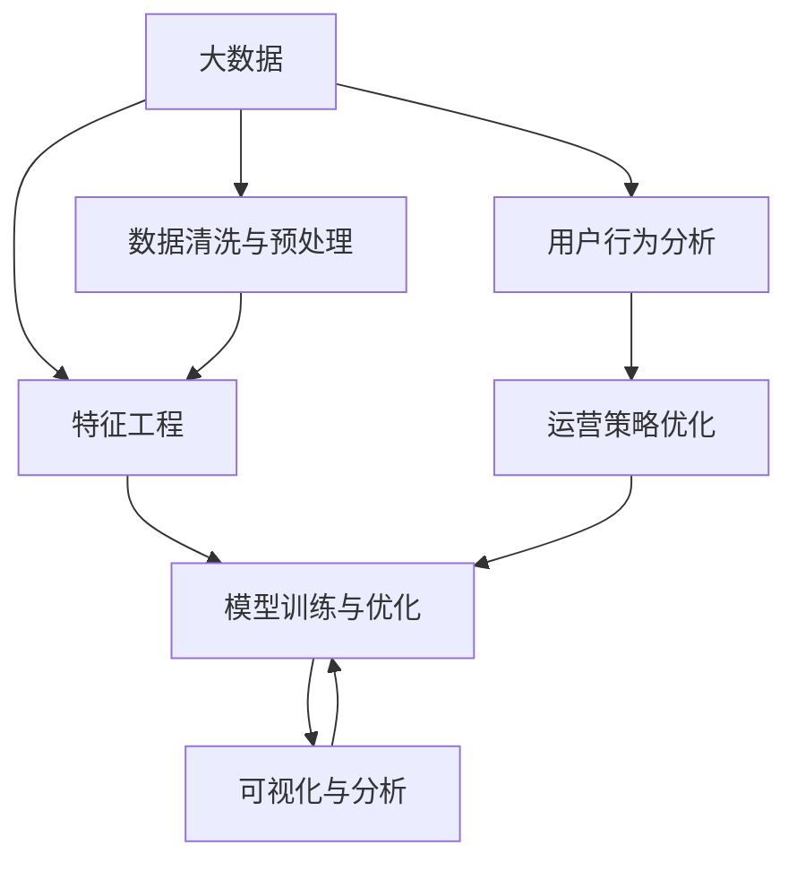

                 

# 知识经济下知识付费的大数据用户行为分析与洞察

## 1. 背景介绍

### 1.1 问题由来
随着知识经济时代的到来，知识付费已逐渐成为一种流行的信息消费模式。知识付费通过为专业知识、技能培训、信息资讯等内容提供付费订阅服务，满足了人们快速获取有价值信息的需求。大数据和人工智能技术为知识付费的深入分析和洞察提供了有力支撑，帮助内容创作者优化内容，提升用户黏性，实现商业价值。

### 1.2 问题核心关键点
大数据和人工智能技术在大数据用户行为分析与洞察中的应用，主要体现在以下几个方面：
1. 用户行为数据采集：通过各类APP、网站、社交媒体等平台采集用户行为数据，包括搜索、浏览、购买、评论、评分等行为。
2. 数据清洗和预处理：对采集的数据进行去重、补全、归一化等处理，去除噪声，提高数据质量。
3. 特征工程：对清洗后的数据进行特征提取，挖掘用户行为特征，如兴趣、偏好、消费能力等。
4. 模型训练与优化：通过机器学习模型，如分类、聚类、回归等，对用户行为进行分析，识别用户兴趣群体、预测用户行为等。
5. 结果可视化与分析：将分析结果通过可视化工具呈现，便于内容创作者和运营人员理解，实现精准运营和内容定制。

### 1.3 问题研究意义
研究知识付费平台中的大数据用户行为分析与洞察，对于提升平台内容质量、优化用户体验、提高运营效率具有重要意义：

1. 内容精准投放：通过分析用户行为，识别出高价值用户群体，精准推送优质内容，提高用户点击率和购买转化率。
2. 个性化推荐：利用用户行为数据，进行个性化推荐，提升用户满意度和平台黏性。
3. 用户细分与画像：对用户进行细分，建立用户画像，帮助内容创作者制定针对性的内容策略。
4. 运营策略优化：通过行为数据分析，优化运营策略，如活动策划、营销推广、会员服务等。
5. 商业价值挖掘：发现高潜力的商业机会，如推出定制化课程、开发付费内容、引入品牌合作等，实现商业价值最大化。

## 2. 核心概念与联系

### 2.1 核心概念概述

大数据与人工智能技术在知识付费中的用户行为分析与洞察，涉及以下核心概念：

- 大数据（Big Data）：指数据量庞大、结构复杂、类型多样的数据集，涵盖用户行为数据、运营数据、市场数据等。
- 人工智能（AI）：包括机器学习、深度学习、自然语言处理等技术，用于处理和分析大数据，挖掘用户行为规律和趋势。
- 知识付费（Knowledge-based Subscription）：用户为获取专业知识、技能培训等信息而支付费用的模式。
- 用户行为分析（User Behavior Analysis）：通过分析用户的行为数据，揭示用户需求、兴趣、消费习惯等。
- 数据清洗与预处理（Data Cleaning and Preprocessing）：对原始数据进行处理，去除噪声、填补缺失值、归一化等。
- 特征工程（Feature Engineering）：对处理后的数据进行特征提取，构建用于模型训练的数据集。
- 模型训练与优化（Model Training and Optimization）：使用机器学习算法，对数据进行训练和优化，获得模型预测结果。
- 可视化与分析（Visualization and Analysis）：将分析结果可视化，便于直观理解，帮助运营人员和内容创作者决策。

这些概念之间的逻辑关系可以通过以下Mermaid流程图来展示：



这个流程图展示了大数据与人工智能在知识付费中用户行为分析与洞察的应用框架，以及不同模块间的逻辑关系。

## 3. 核心算法原理 & 具体操作步骤
### 3.1 算法原理概述

知识付费平台中，用户行为分析与洞察的核心算法原理主要包括以下几个方面：

- 数据驱动决策：通过收集和分析用户行为数据，洞察用户需求和行为规律，指导平台运营决策。
- 个性化推荐：利用用户行为数据，进行个性化推荐，提升用户体验和平台黏性。
- 用户画像：通过对用户行为数据的分析，建立详细的用户画像，帮助内容创作者制定个性化内容策略。
- 运营效果评估：通过行为数据分析，评估平台运营效果，优化运营策略。

### 3.2 算法步骤详解

基于大数据与人工智能的知舍付费平台用户行为分析与洞察的主要算法步骤如下：

**Step 1: 数据采集与预处理**
- 从知识付费平台的数据库、API接口、日志文件等渠道采集用户行为数据，包括点击、浏览、购买、评分、评论等行为。
- 对采集的数据进行清洗和预处理，包括去重、填补缺失值、归一化等。

**Step 2: 特征工程**
- 对清洗后的数据进行特征提取，构建用于模型训练的数据集。特征包括用户的浏览时长、购买频率、评分、评论内容等。
- 使用降维技术，如主成分分析（PCA）、线性判别分析（LDA）等，减少特征维度，提高模型训练效率。

**Step 3: 模型训练与优化**
- 选择合适的机器学习算法，如分类算法（如Logistic回归、随机森林、XGBoost等）、聚类算法（如K-means、层次聚类等）、回归算法（如线性回归、决策树回归等）。
- 使用交叉验证、网格搜索等技术，优化模型参数，提高模型预测精度。
- 评估模型性能，选择最优模型用于用户行为预测和分类。

**Step 4: 用户画像与行为分析**
- 根据模型预测结果，生成用户画像，包括用户兴趣、偏好、消费能力等。
- 分析用户行为，识别出高价值用户群体，如重度用户、付费用户、活跃用户等。

**Step 5: 可视化与分析**
- 将用户画像和行为分析结果通过可视化工具（如Tableau、Power BI等）呈现，便于内容创作者和运营人员理解。
- 通过可视化分析，制定针对性的内容策略和运营策略。

### 3.3 算法优缺点

基于大数据与人工智能的知舍付费平台用户行为分析与洞察的主要算法具有以下优缺点：

**优点：**
- 数据驱动决策：提高决策的科学性和准确性，减少主观判断。
- 个性化推荐：提升用户体验和平台黏性，增加用户留存率。
- 用户画像：帮助内容创作者制定个性化内容策略，提高内容价值。

**缺点：**
- 数据隐私问题：收集用户行为数据时，需注意隐私保护，避免用户信息泄露。
- 数据质量问题：数据采集和清洗质量直接影响模型预测结果，需花费大量时间和精力。
- 模型解释性问题：部分算法如深度学习模型的黑箱特性，难以解释其内部决策逻辑。

### 3.4 算法应用领域

基于大数据与人工智能的用户行为分析与洞察算法，在知识付费平台中的应用主要体现在以下几个领域：

- 用户行为分析：通过分析用户行为数据，洞察用户需求和行为规律。
- 个性化推荐：根据用户行为数据，进行个性化内容推荐，提高用户满意度和平台黏性。
- 运营策略优化：通过行为数据分析，优化运营策略，如活动策划、营销推广、会员服务等。
- 用户细分与画像：对用户进行细分，建立用户画像，帮助内容创作者制定个性化内容策略。
- 商业价值挖掘：发现高潜力的商业机会，如推出定制化课程、开发付费内容、引入品牌合作等。

## 4. 数学模型和公式 & 详细讲解 & 举例说明
### 4.1 数学模型构建

知识付费平台用户行为分析与洞察的数学模型构建主要包括以下几个方面：

- 用户行为数据表示：将用户行为数据表示为特征向量，如点击次数、浏览时长、购买金额等。
- 特征工程：对特征向量进行处理，如归一化、降维、缺失值填补等。
- 模型训练：选择机器学习算法，如决策树、随机森林、XGBoost等，进行模型训练。
- 模型评估：使用交叉验证、ROC曲线、混淆矩阵等技术，评估模型性能。

### 4.2 公式推导过程

以决策树算法为例，推导用户行为分类的数学模型。

设用户行为数据集为 $D=\{(x_i, y_i)\}_{i=1}^N$，其中 $x_i$ 表示用户行为特征向量，$y_i$ 表示用户行为分类标签。假设我们选择决策树算法进行模型训练，则决策树的构建过程如下：

1. 初始化决策树根节点，将所有样本划入该节点。
2. 选择最优特征 $X_j$，计算其信息增益或信息增益比。
3. 根据特征 $X_j$ 的不同取值，将样本划分为若干子节点。
4. 递归地对每个子节点重复步骤2-3，直至满足停止条件（如叶子节点纯度高于阈值）。

其中，信息增益（Information Gain）计算公式为：

$$
IG(D, X_j) = \sum_{i=1}^N \sum_{k=1}^{K_j} \frac{|D_k|}{|D|} \times H(p_k)
$$

其中，$K_j$ 表示特征 $X_j$ 的不同取值数量，$D_k$ 表示特征 $X_j$ 取值为 $k$ 的样本子集，$H(p_k)$ 表示样本子集 $D_k$ 的熵。

信息增益比（Information Gain Ratio）计算公式为：

$$
IGR(D, X_j) = \frac{IG(D, X_j)}{IV(X_j)}
$$

其中，$IV(X_j)$ 表示特征 $X_j$ 的信息熵。

通过决策树算法，我们可以对用户行为进行分类，识别出高价值用户群体，如重度用户、付费用户、活跃用户等，从而制定针对性的内容策略和运营策略。

### 4.3 案例分析与讲解

以下以一个简单的案例来说明如何通过用户行为分析与洞察算法，优化知识付费平台的运营策略。

假设某知识付费平台运营一个在线课程，通过分析用户行为数据，发现以下规律：
- 新用户倾向于选择免费试听课程，付费意愿较低。
- 重度用户（平均每周浏览超过10小时）的购买转化率显著高于活跃用户和普通用户。
- 付费用户的复购率远高于免费用户。

基于以上分析，可以制定以下运营策略：
- 针对新用户，推出更多免费试听课程，提高其付费意愿。
- 针对重度用户，推出会员制服务，提高其购买转化率和复购率。
- 针对普通用户，提供多样化的课程选择，增加其浏览时间和购买转化率。

通过数据分析，运营人员能够更精准地把握用户需求，制定针对性的运营策略，提高平台的用户留存率和商业价值。

## 5. 项目实践：代码实例和详细解释说明
### 5.1 开发环境搭建

在进行用户行为分析与洞察的实践前，我们需要准备好开发环境。以下是使用Python进行Scikit-learn开发的开发环境配置流程：

1. 安装Anaconda：从官网下载并安装Anaconda，用于创建独立的Python环境。

2. 创建并激活虚拟环境：
```bash
conda create -n user-behavior-analysis python=3.8 
conda activate user-behavior-analysis
```

3. 安装Scikit-learn、Pandas、NumPy、Matplotlib等常用工具包：
```bash
pip install scikit-learn pandas numpy matplotlib tqdm jupyter notebook ipython
```

完成上述步骤后，即可在`user-behavior-analysis`环境中开始实践。

### 5.2 源代码详细实现

下面以用户行为分类为例，给出使用Scikit-learn进行用户行为分类的Python代码实现。

首先，定义用户行为数据处理函数：

```python
from sklearn.model_selection import train_test_split
from sklearn.ensemble import RandomForestClassifier
from sklearn.metrics import accuracy_score
import pandas as pd

def load_data(file_path):
    data = pd.read_csv(file_path)
    return data

def preprocess_data(data):
    # 特征选择
    selected_features = data[['click_times', 'browsing_hours', 'purchase_amount', 'score', 'review_content']]
    data = selected_features.dropna()
    # 特征编码
    data['purchase_amount'] = data['purchase_amount'].astype('category').cat.codes
    data['score'] = data['score'].astype('category').cat.codes
    return data

def split_data(data):
    X = data.drop(['purchase_amount'], axis=1)
    y = data['purchase_amount']
    X_train, X_test, y_train, y_test = train_test_split(X, y, test_size=0.2, random_state=42)
    return X_train, X_test, y_train, y_test

def train_model(X_train, y_train):
    model = RandomForestClassifier(n_estimators=100, random_state=42)
    model.fit(X_train, y_train)
    return model

def evaluate_model(model, X_test, y_test):
    y_pred = model.predict(X_test)
    accuracy = accuracy_score(y_test, y_pred)
    return accuracy
```

然后，定义训练和评估函数：

```python
def train_and_evaluate(X_train, y_train, X_test, y_test):
    model = train_model(X_train, y_train)
    accuracy = evaluate_model(model, X_test, y_test)
    print(f"Model Accuracy: {accuracy:.2f}")

# 加载数据
data_path = 'user_behavior_data.csv'
data = load_data(data_path)

# 数据预处理
preprocessed_data = preprocess_data(data)

# 数据分割
X_train, X_test, y_train, y_test = split_data(preprocessed_data)

# 训练模型并评估
train_and_evaluate(X_train, y_train, X_test, y_test)
```

### 5.3 代码解读与分析

让我们再详细解读一下关键代码的实现细节：

**load_data函数**：
- 加载用户行为数据，返回DataFrame格式的数据集。

**preprocess_data函数**：
- 对数据进行特征选择和特征编码，去除缺失值，构建用于模型训练的数据集。

**split_data函数**：
- 对数据进行划分，将数据集分为训练集和测试集。

**train_model函数**：
- 使用随机森林算法对训练集进行模型训练，返回训练好的模型。

**evaluate_model函数**：
- 对模型在测试集上进行评估，计算模型的准确率。

**train_and_evaluate函数**：
- 将训练和评估过程封装为函数，方便调用。

在实践中，可以针对具体任务和数据集，对代码进行进一步优化和调整。

## 6. 实际应用场景

### 6.1 智能客服系统

智能客服系统通过分析用户行为数据，能够更准确地识别用户需求，提供个性化的服务。例如，智能客服系统可以根据用户的历史咨询记录，识别出用户感兴趣的话题，并主动推送相关内容，提高用户满意度。

在技术实现上，可以构建知识图谱，将常见问题与解决方案关联起来，利用知识图谱进行推理，生成自然流畅的回答。同时，通过用户行为数据，智能客服系统可以实时监测用户满意度，根据用户反馈优化系统。

### 6.2 金融舆情监测

金融舆情监测平台通过分析用户在金融新闻、评论、论坛等平台的行为数据，能够及时捕捉市场动态和舆情变化。例如，平台可以识别出用户对某股票或市场的关注度变化，及时预警市场风险。

在技术实现上，可以使用NLP技术对用户评论进行情感分析，识别出用户的正面、中性和负面情感，结合大数据分析，预测市场走势和舆情变化。同时，平台可以通过用户行为数据，对用户进行细分，针对不同用户群体推出个性化服务，提高平台的用户黏性。

### 6.3 个性化推荐系统

个性化推荐系统通过分析用户行为数据，能够精准地为用户推荐感兴趣的内容，提升用户体验和平台留存率。例如，推荐系统可以根据用户的浏览记录、购买记录、评分记录等数据，推荐用户可能感兴趣的新课程或文章。

在技术实现上，可以使用协同过滤、内容推荐、混合推荐等算法，结合用户行为数据，进行个性化推荐。同时，可以通过用户行为数据，实时监测推荐效果，优化推荐算法和内容库，提高推荐精度和用户满意度。

## 7. 工具和资源推荐
### 7.1 学习资源推荐

为了帮助开发者系统掌握知识付费平台用户行为分析与洞察的理论基础和实践技巧，这里推荐一些优质的学习资源：

1. 《Python数据分析与可视化》系列博文：由知名数据分析师撰写，深入浅出地介绍了Python在数据处理和可视化中的应用。

2. 《机器学习实战》课程：从零基础到实战的机器学习入门课程，涵盖分类、聚类、回归等多种算法。

3. 《深度学习入门》书籍：清华大学出版社出版的深度学习入门书籍，系统介绍了深度学习的基本概念和经典模型。

4. Coursera《Data Science》课程：斯坦福大学开设的数据科学课程，涵盖数据采集、清洗、分析和可视化等多个环节。

5. Kaggle在线竞赛平台：提供丰富的数据集和挑战任务，帮助开发者练习和提升数据处理和分析能力。

通过对这些资源的学习实践，相信你一定能够快速掌握知识付费平台用户行为分析与洞察的精髓，并用于解决实际的商业问题。

### 7.2 开发工具推荐

高效的开发离不开优秀的工具支持。以下是几款用于知识付费平台用户行为分析与洞察开发的常用工具：

1. Scikit-learn：基于Python的开源机器学习库，提供了多种机器学习算法，包括分类、聚类、回归等。

2. TensorFlow：由Google主导开发的开源深度学习框架，生产部署方便，适合大规模工程应用。

3. PyTorch：基于Python的开源深度学习框架，灵活动态的计算图，适合快速迭代研究。

4. Tableau：可视化工具，支持拖拽式数据分析和可视化，方便快速生成报表和图表。

5. Power BI：微软推出的商业智能工具，支持多种数据源，提供丰富的可视化功能。

6. Jupyter Notebook：交互式笔记本环境，支持Python代码的编写、运行和共享。

合理利用这些工具，可以显著提升知识付费平台用户行为分析与洞察的开发效率，加快创新迭代的步伐。

### 7.3 相关论文推荐

知识付费平台用户行为分析与洞察技术的发展源于学界的持续研究。以下是几篇奠基性的相关论文，推荐阅读：

1. "A Survey on Recommendation Systems for Online Learning"：总结了推荐系统在在线学习中的应用，介绍了多种推荐算法和技术。

2. "User Behavior Analysis in Online Learning Platforms"：介绍了用户在在线学习平台上的行为分析方法，包括用户画像、个性化推荐等。

3. "Adaptive Learning Pathways: A Case Study of Educational Data Mining in Online Learning"：介绍了教育数据挖掘在在线学习中的应用，探讨了如何通过数据挖掘优化学习路径。

4. "Semantic Web Technologies for Learning Analytics"：介绍了语义网技术在教育数据分析中的应用，探讨了如何利用语义网技术提升学习分析的效果。

这些论文代表了大数据与人工智能在知识付费平台用户行为分析与洞察领域的发展脉络。通过学习这些前沿成果，可以帮助研究者把握学科前进方向，激发更多的创新灵感。

## 8. 总结：未来发展趋势与挑战
### 8.1 总结

本文对知识付费平台用户行为分析与洞察方法进行了全面系统的介绍。首先阐述了知识付费平台用户行为分析与洞察的研究背景和意义，明确了大数据与人工智能技术在其中的重要价值。其次，从原理到实践，详细讲解了用户行为分析与洞察的数学原理和关键步骤，给出了知识付费平台用户行为分析与洞察的完整代码实例。同时，本文还广泛探讨了用户行为分析与洞察技术在智能客服、金融舆情、个性化推荐等多个行业领域的应用前景，展示了其广阔的发展潜力。此外，本文精选了用户行为分析与洞察技术的各类学习资源，力求为读者提供全方位的技术指引。

通过本文的系统梳理，可以看到，基于大数据与人工智能的用户行为分析与洞察技术正在成为知识付费平台的重要范式，极大地拓展了知识付费平台的运营能力，提升了用户体验和商业价值。未来，伴随大数据与人工智能技术的持续演进，知识付费平台用户行为分析与洞察技术必将迎来更广阔的应用前景。

### 8.2 未来发展趋势

展望未来，知识付费平台用户行为分析与洞察技术将呈现以下几个发展趋势：

1. 数据采集与分析自动化：利用自动化数据采集和分析工具，提高数据处理效率，降低人工成本。

2. 多模态数据融合：将用户行为数据与文本、语音、图像等多模态数据融合，提升分析效果和应用场景。

3. 实时数据分析：通过实时数据分析，及时捕捉用户行为变化，优化运营策略和内容推荐。

4. 深度学习应用：利用深度学习算法，提升分类、聚类、回归等模型的预测精度和泛化能力。

5. 联邦学习与隐私保护：通过联邦学习等技术，在保护用户隐私的前提下，进行多平台数据联合分析，提升分析效果。

6. 跨领域应用推广：将用户行为分析与洞察技术推广到其他领域，如智能客服、金融舆情、个性化推荐等，形成普适性解决方案。

以上趋势凸显了大数据与人工智能技术在知识付费平台用户行为分析与洞察领域的广阔前景。这些方向的探索发展，必将进一步提升知识付费平台的运营能力，为用户带来更好的体验和服务。

### 8.3 面临的挑战

尽管大数据与人工智能技术在知识付费平台用户行为分析与洞察中已经取得了显著成效，但在迈向更加智能化、普适化应用的过程中，仍面临诸多挑战：

1. 数据质量问题：用户行为数据质量参差不齐，数据采集和清洗难度较大，影响分析效果。

2. 数据隐私问题：用户行为数据涉及隐私保护，数据采集和分析过程中需注意隐私保护，避免用户信息泄露。

3. 模型解释性问题：深度学习等黑箱算法的模型难以解释，难以理解其内部决策逻辑，影响运营决策。

4. 多模态数据融合问题：不同模态数据融合难度较大，需考虑不同数据类型和格式的统一处理。

5. 实时分析问题：实时数据分析对系统性能和计算资源要求较高，需优化算法和计算资源。

6. 跨平台数据共享问题：不同平台用户行为数据格式和格式不同，跨平台数据共享难度较大。

正视这些挑战，积极应对并寻求突破，将是大数据与人工智能技术在知识付费平台用户行为分析与洞察技术走向成熟的必由之路。相信随着技术的发展和研究的深入，这些挑战终将一一被克服，知识付费平台用户行为分析与洞察技术必将在知识付费平台中发挥更大的作用。

### 8.4 研究展望

面对大数据与人工智能技术在知识付费平台用户行为分析与洞察面临的挑战，未来的研究需要在以下几个方面寻求新的突破：

1. 数据采集与处理自动化：开发自动化数据采集和处理工具，提高数据处理效率，降低人工成本。

2. 多模态数据融合技术：开发多模态数据融合技术，实现不同类型数据的高效整合和分析。

3. 深度学习算法优化：开发更加高效的深度学习算法，提高模型预测精度和泛化能力。

4. 联邦学习与隐私保护：研究联邦学习等技术，在保护用户隐私的前提下，进行多平台数据联合分析。

5. 实时数据分析优化：优化实时数据分析算法和计算资源，提高数据分析效率和系统性能。

6. 跨平台数据共享机制：研究跨平台数据共享机制，实现不同平台用户行为数据的高效共享和分析。

这些研究方向的探索，必将引领大数据与人工智能技术在知识付费平台用户行为分析与洞察领域的进一步发展，为知识付费平台带来更高效、更精准的运营策略和用户体验。面向未来，知识付费平台用户行为分析与洞察技术还需要与其他人工智能技术进行更深入的融合，如知识表示、因果推理、强化学习等，多路径协同发力，共同推动知识付费平台的进步。只有勇于创新、敢于突破，才能不断拓展知识付费平台用户行为分析与洞察技术的边界，让知识付费平台更好地服务于用户，提升平台价值。

## 9. 附录：常见问题与解答
**Q1: 大数据与人工智能技术在知识付费平台用户行为分析与洞察中扮演什么角色？**

A: 大数据与人工智能技术在知识付费平台用户行为分析与洞察中扮演了至关重要的角色。通过采集、清洗和分析用户行为数据，能够洞察用户需求、行为规律和偏好，帮助内容创作者制定针对性的内容策略和运营策略，提升用户体验和平台留存率，实现商业价值最大化。

**Q2: 如何进行用户行为分类？**

A: 用户行为分类是知识付费平台用户行为分析与洞察的重要环节，通常使用分类算法，如Logistic回归、随机森林、XGBoost等，对用户行为数据进行训练和预测。具体步骤包括数据预处理、特征选择、模型训练和评估等。

**Q3: 如何优化用户行为分析与洞察的模型性能？**

A: 优化用户行为分析与洞察的模型性能，通常需要从以下几个方面入手：
1. 数据采集与清洗：提高数据质量，减少噪声，提高模型训练的准确性。
2. 特征工程：优化特征选择和特征提取，提高模型的泛化能力。
3. 模型选择与调参：选择合适的算法和优化参数，提高模型预测精度。
4. 模型评估与优化：使用交叉验证、ROC曲线、混淆矩阵等技术，评估模型性能，并进行优化。

**Q4: 知识付费平台如何利用用户行为分析与洞察技术提升用户体验？**

A: 知识付费平台利用用户行为分析与洞察技术，可以采取以下措施提升用户体验：
1. 个性化推荐：根据用户行为数据，进行个性化推荐，提高用户满意度和平台黏性。
2. 用户画像：通过分析用户行为数据，建立详细的用户画像，帮助内容创作者制定个性化内容策略。
3. 活动策划：利用用户行为数据分析，优化活动策划和营销推广，提高用户参与度和平台留存率。
4. 会员服务：针对不同用户群体推出个性化会员服务，提升用户价值和平台收益。

**Q5: 知识付费平台如何保护用户隐私？**

A: 知识付费平台在用户行为数据分析与洞察中，需注意以下隐私保护措施：
1. 数据匿名化：对用户数据进行匿名化处理，保护用户隐私。
2. 数据加密：对用户数据进行加密处理，防止数据泄露。
3. 数据访问控制：限制数据访问权限，确保只有授权人员才能访问用户数据。
4. 隐私政策：制定明确的隐私政策，告知用户数据采集和使用的目的和范围。
5. 用户同意：获取用户同意，确保用户数据的使用符合法律法规要求。

这些措施将有助于保护用户隐私，增强用户信任，促进知识付费平台的健康发展。

---

作者：禅与计算机程序设计艺术 / Zen and the Art of Computer Programming

