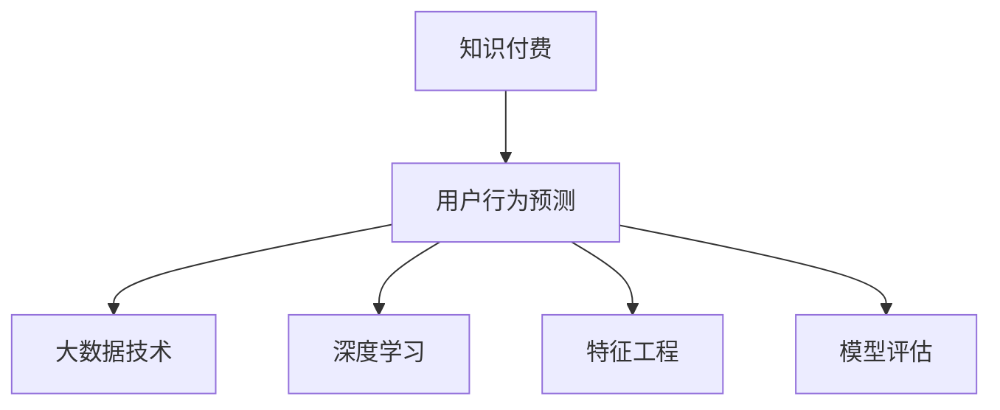

                 

# 知识经济下知识付费的大数据用户行为预测模型

> 关键词：知识付费,大数据,用户行为预测,机器学习,深度学习

## 1. 背景介绍

### 1.1 问题由来
在知识经济的时代，知识付费作为一种新型的学习和知识获取方式，正迅速崛起并成为主流。用户从传统的免费内容消费转向为内容付费，这既体现了用户对于优质内容的高需求，也反映了个性化和智能化服务的趋势。然而，由于知识付费市场的复杂性和多样性，如何精准预测用户行为，推荐合适的课程和内容，成为了知识付费平台面临的重要挑战。

### 1.2 问题核心关键点
预测用户行为，主要涉及以下几个关键点：
1. **数据来源**：获取海量用户行为数据，包括注册信息、浏览记录、购买记录、评价反馈等。
2. **特征工程**：从原始数据中提取有意义的特征，如用户兴趣、行为偏好、消费能力等。
3. **模型选择**：选择合适的预测模型，如随机森林、支持向量机、神经网络等。
4. **模型优化**：针对不同用户行为，优化模型参数，提升预测精度。
5. **预测应用**：将模型应用于用户行为预测，推荐个性化课程和内容。

### 1.3 问题研究意义
通过精准预测用户行为，知识付费平台可以：
- 提高用户满意度和粘性，增加用户续费率。
- 提升内容推荐准确性，减少用户流失。
- 优化营销策略，提高推广效果。
- 分析用户需求，优化产品设计。

## 2. 核心概念与联系

### 2.1 核心概念概述

为更好地理解知识付费用户行为预测模型，本节将介绍几个密切相关的核心概念：

- **知识付费**：用户为获取知识而支付费用的模式。知识付费内容形式多样，包括在线课程、电子书、音频视频等。
- **用户行为预测**：通过分析用户历史行为数据，预测用户未来行为，如购买、学习、评价等。
- **大数据技术**：从海量数据中提取有用信息，支持精准预测用户行为。
- **深度学习**：使用神经网络等深度学习模型，提升用户行为预测的精度。
- **特征工程**：从原始数据中提取特征，构建特征向量，供模型进行预测。
- **模型评估**：使用各种评估指标，如准确率、召回率、F1值等，衡量预测模型的性能。

这些概念之间的逻辑关系可以通过以下Mermaid流程图来展示：



这个流程图展示了大数据技术、深度学习和特征工程在用户行为预测中的作用：

1. 大数据技术支持获取和处理海量用户行为数据。
2. 深度学习提供强大的模型预测能力。
3. 特征工程从原始数据中提取有用信息，构建特征向量。
4. 模型评估衡量预测模型的性能，指导模型优化。

这些概念共同构成了用户行为预测的框架，通过多维度的数据和模型技术，提升预测的准确性和可解释性。

## 3. 核心算法原理 & 具体操作步骤
### 3.1 算法原理概述

用户行为预测模型，通过构建用户画像和行为序列，利用深度学习模型对用户未来行为进行预测。其核心思想是：
- 将用户的历史行为数据作为输入特征，利用深度神经网络进行建模。
- 通过多层非线性变换，学习用户行为与目标行为之间的关系。
- 使用损失函数衡量模型预测结果与真实标签之间的差异，通过反向传播算法更新模型参数。

形式化地，假设用户行为预测任务为二分类问题，即预测用户是否会购买某个课程，其中 $X$ 为输入特征，$Y$ 为标签。定义模型 $M_{\theta}$，其中 $\theta$ 为模型参数。用户行为预测的目标是最小化损失函数 $\mathcal{L}(M_{\theta})$，即：

$$
\hat{Y} = \sigma(\theta^T \phi(X))
$$

$$
\mathcal{L}(\theta) = -\frac{1}{N}\sum_{i=1}^N [y_i \log \hat{y_i} + (1-y_i) \log (1-\hat{y_i})]
$$

其中 $\sigma$ 为激活函数，$\phi$ 为特征映射函数，$y_i$ 为真实标签，$\hat{y_i}$ 为模型预测结果。

### 3.2 算法步骤详解

用户行为预测模型的构建和训练包括以下几个关键步骤：

**Step 1: 数据准备**
- 收集用户的历史行为数据，包括但不限于注册信息、浏览记录、购买记录、评价反馈等。
- 对数据进行清洗和预处理，如去除异常值、填补缺失值、标准化等。

**Step 2: 特征工程**
- 设计特征提取器，将原始数据转换为特征向量。常见的特征包括用户ID、时间戳、浏览时长、评价分数等。
- 使用维度约简技术，如PCA、LDA等，减少特征维度，避免过拟合。

**Step 3: 模型选择与构建**
- 选择适合预测问题的深度学习模型，如多层感知器（MLP）、卷积神经网络（CNN）、循环神经网络（RNN）、Transformer等。
- 设计模型架构，包括输入层、隐藏层、输出层和激活函数。
- 使用交叉验证等方法，优化模型超参数，如隐藏层大小、学习率、正则化系数等。

**Step 4: 模型训练**
- 将数据集划分为训练集、验证集和测试集。
- 使用梯度下降等优化算法，如Adam、SGD等，最小化损失函数。
- 在训练过程中，周期性在验证集上评估模型性能，避免过拟合。

**Step 5: 模型评估**
- 在测试集上评估模型性能，如准确率、召回率、F1值等。
- 根据评估结果，调整模型超参数，重新训练模型。

**Step 6: 预测应用**
- 将训练好的模型应用于新数据，预测用户行为。
- 根据预测结果，推荐合适的课程和内容。

### 3.3 算法优缺点

用户行为预测模型的优点包括：
1. 通过大量历史数据，可以准确预测用户未来行为。
2. 多层次非线性变换，可以捕捉复杂的用户行为模式。
3. 适用于多种预测问题，如购买预测、学习预测、评价预测等。
4. 可以结合多模态数据，如文本、图片、音频等，提升预测精度。

缺点则包括：
1. 需要大量标注数据，标注成本较高。
2. 模型复杂，训练和推理速度较慢。
3. 预测结果存在不确定性，可能受到用户行为变化的影响。
4. 预测结果缺乏可解释性，难以理解和调试。

### 3.4 算法应用领域

用户行为预测模型已经广泛应用于知识付费平台的多个环节，包括但不限于：

- **课程推荐**：根据用户历史行为，预测用户是否会购买某门课程，推荐合适的课程。
- **学习进度预测**：预测用户学习进度，及时推送相关课程和资料。
- **评价反馈分析**：分析用户评价反馈，优化课程内容和教学质量。
- **用户流失预警**：预测用户流失风险，提前采取措施。
- **广告投放优化**：根据用户行为预测，优化广告投放策略。

除了知识付费平台，用户行为预测模型在电商、社交网络、金融等行业也有广泛应用，为这些领域带来了显著的效益提升。

## 4. 数学模型和公式 & 详细讲解 & 举例说明

### 4.1 数学模型构建

以二分类预测为例，用户行为预测模型可以使用多层感知器（MLP）进行构建。定义输入层、隐藏层和输出层的神经元数为 $n_i$、$m_h$、$m_o$。则模型参数 $\theta$ 包括权重矩阵 $W_{h, o}$ 和偏置向量 $b_{o}$。

输入数据 $X$ 经过特征映射 $\phi$ 后，进入隐藏层 $h$ 进行非线性变换，输出为 $\hat{y}$。模型预测结果为 $Y$，损失函数为 $\mathcal{L}$。

$$
h = \sigma(XW_{h, i} + b_{i})
$$

$$
\hat{y} = \sigma(hW_{h, o} + b_{o})
$$

$$
\mathcal{L} = -\frac{1}{N}\sum_{i=1}^N [y_i \log \hat{y_i} + (1-y_i) \log (1-\hat{y_i})]
$$

### 4.2 公式推导过程

以二分类为例，详细推导预测模型公式。

假设模型为 $M_{\theta}$，其中 $\theta$ 为模型参数。输入特征 $X$ 经过特征映射 $\phi$ 后，进入隐藏层 $h$ 进行非线性变换，输出为 $\hat{y}$。

$$
h = \sigma(XW_{h, i} + b_{i})
$$

其中 $\sigma$ 为激活函数，$W_{h, i}$ 为隐藏层权重矩阵，$b_{i}$ 为隐藏层偏置向量。

将隐藏层输出 $h$ 通过另一层线性变换 $W_{h, o} + b_{o}$，得到模型预测结果 $\hat{y}$。

$$
\hat{y} = \sigma(hW_{h, o} + b_{o})
$$

其中 $W_{h, o}$ 为输出层权重矩阵，$b_{o}$ 为输出层偏置向量。

定义损失函数 $\mathcal{L}$，衡量模型预测结果与真实标签 $y$ 之间的差异。

$$
\mathcal{L} = -\frac{1}{N}\sum_{i=1}^N [y_i \log \hat{y_i} + (1-y_i) \log (1-\hat{y_i})]
$$

使用梯度下降等优化算法，最小化损失函数 $\mathcal{L}$，更新模型参数 $\theta$。

$$
\theta \leftarrow \theta - \eta \nabla_{\theta}\mathcal{L}
$$

其中 $\eta$ 为学习率，$\nabla_{\theta}\mathcal{L}$ 为损失函数对参数 $\theta$ 的梯度。

### 4.3 案例分析与讲解

以某知识付费平台为例，使用用户行为预测模型进行课程推荐分析。

假设该平台有 $N=10000$ 名用户，每个用户有 $D=500$ 天的历史行为数据。定义特征 $X$ 为每个用户最近一周的浏览记录、购买记录、评价分数等。预测用户是否会购买某门课程 $y$。

1. **数据准备**
   - 收集用户注册信息、浏览记录、购买记录、评价反馈等数据。
   - 对数据进行清洗和预处理，如去除异常值、填补缺失值、标准化等。

2. **特征工程**
   - 设计特征提取器，将原始数据转换为特征向量。如将浏览记录转换为点击率、停留时间等特征。
   - 使用PCA等维度约简技术，减少特征维度，避免过拟合。

3. **模型选择与构建**
   - 选择多层感知器（MLP）模型，设计3层神经网络架构，其中输入层神经元数为 $n_i=20$，隐藏层神经元数为 $m_h=50$，输出层神经元数为 $m_o=1$。
   - 使用交叉验证等方法，优化模型超参数，如隐藏层大小、学习率、正则化系数等。

4. **模型训练**
   - 将数据集划分为训练集、验证集和测试集。
   - 使用Adam优化算法，最小化损失函数，训练模型。
   - 在训练过程中，周期性在验证集上评估模型性能，避免过拟合。

5. **模型评估**
   - 在测试集上评估模型性能，如准确率、召回率、F1值等。
   - 根据评估结果，调整模型超参数，重新训练模型。

6. **预测应用**
   - 将训练好的模型应用于新数据，预测用户是否会购买某门课程。
   - 根据预测结果，推荐合适的课程和内容。

## 5. 项目实践：代码实例和详细解释说明
### 5.1 开发环境搭建

在进行用户行为预测模型开发前，我们需要准备好开发环境。以下是使用Python进行TensorFlow开发的环境配置流程：

1. 安装Anaconda：从官网下载并安装Anaconda，用于创建独立的Python环境。

2. 创建并激活虚拟环境：
```bash
conda create -n tf-env python=3.8 
conda activate tf-env
```

3. 安装TensorFlow：根据CUDA版本，从官网获取对应的安装命令。例如：
```bash
conda install tensorflow -c conda-forge -c pytorch -c anaconda
```

4. 安装各类工具包：
```bash
pip install numpy pandas scikit-learn matplotlib tqdm jupyter notebook ipython
```

完成上述步骤后，即可在`tf-env`环境中开始模型开发。

### 5.2 源代码详细实现

下面我们以用户行为预测模型为例，给出使用TensorFlow进行多层感知器模型的PyTorch代码实现。

首先，定义模型结构：

```python
import tensorflow as tf
from tensorflow.keras.layers import Dense, Dropout
from tensorflow.keras.models import Sequential

model = Sequential()
model.add(Dense(50, input_dim=20, activation='relu'))
model.add(Dropout(0.5))
model.add(Dense(1, activation='sigmoid'))

model.compile(loss='binary_crossentropy', optimizer='adam', metrics=['accuracy'])
```

然后，定义训练和评估函数：

```python
def train_epoch(model, X_train, y_train):
    model.fit(X_train, y_train, epochs=50, batch_size=32, validation_split=0.2)
    
def evaluate(model, X_test, y_test):
    loss, accuracy = model.evaluate(X_test, y_test)
    print('Test loss:', loss)
    print('Test accuracy:', accuracy)
```

最后，启动训练流程并在测试集上评估：

```python
# 准备数据
X_train = ...
y_train = ...
X_test = ...
y_test = ...

# 训练模型
train_epoch(model, X_train, y_train)

# 评估模型
evaluate(model, X_test, y_test)
```

以上就是使用TensorFlow进行多层感知器模型用户行为预测的完整代码实现。可以看到，TensorFlow提供了便捷的模型构建、训练和评估功能，使得模型开发过程更加高效和灵活。

### 5.3 代码解读与分析

让我们再详细解读一下关键代码的实现细节：

**Sequential类**：
- 定义了一个顺序模型，可以按顺序添加多层神经网络。
- 添加 `Dense` 层，定义神经元数、激活函数等。
- 添加 `Dropout` 层，控制神经元随机失活，防止过拟合。
- 使用 `compile` 方法，设置损失函数、优化器等。

**train_epoch函数**：
- 使用 `fit` 方法，对模型进行训练，指定训练次数、批次大小等。
- 在每个epoch结束后，输出训练集和验证集的损失和准确率。

**evaluate函数**：
- 使用 `evaluate` 方法，对模型进行评估，返回测试集的损失和准确率。
- 输出测试集的损失和准确率。

**训练流程**：
- 准备数据集 `X_train`、`y_train`、`X_test`、`y_test`。
- 调用 `train_epoch` 函数，训练模型。
- 调用 `evaluate` 函数，评估模型。

可以看到，TensorFlow提供了强大的API，使得模型开发过程更加简洁高效。

## 6. 实际应用场景
### 6.1 智能课程推荐

基于用户行为预测模型，知识付费平台可以构建智能课程推荐系统，提升用户购买转化率和满意度。

1. **数据收集**：收集用户注册信息、浏览记录、购买记录、评价反馈等数据。
2. **特征工程**：设计特征提取器，将原始数据转换为特征向量，如点击率、停留时间、评价分数等。
3. **模型训练**：选择合适模型，如多层感知器（MLP）、卷积神经网络（CNN）、循环神经网络（RNN）等，进行训练和优化。
4. **预测应用**：将训练好的模型应用于新数据，预测用户是否会购买某门课程，推荐合适的课程和内容。

### 6.2 学习进度跟踪

平台可以根据用户行为预测模型，跟踪用户的学习进度，推送相关课程和资料。

1. **数据收集**：收集用户的学习记录，如学习时间、课程进度等。
2. **特征工程**：设计特征提取器，将学习记录转换为特征向量，如学习时长、课程完成度等。
3. **模型训练**：选择合适模型，如多层感知器（MLP）、循环神经网络（RNN）等，进行训练和优化。
4. **预测应用**：将训练好的模型应用于新数据，预测用户的学习进度，及时推送相关课程和资料。

### 6.3 用户流失预警

平台可以根据用户行为预测模型，预测用户流失风险，提前采取措施。

1. **数据收集**：收集用户的行为记录，如购买记录、评价反馈等。
2. **特征工程**：设计特征提取器，将行为记录转换为特征向量，如购买频次、评价评分等。
3. **模型训练**：选择合适模型，如多层感知器（MLP）、决策树等，进行训练和优化。
4. **预测应用**：将训练好的模型应用于新数据，预测用户流失风险，提前采取措施。

### 6.4 广告投放优化

平台可以根据用户行为预测模型，优化广告投放策略，提升广告效果。

1. **数据收集**：收集用户的行为记录，如浏览记录、购买记录等。
2. **特征工程**：设计特征提取器，将行为记录转换为特征向量，如浏览时长、购买记录等。
3. **模型训练**：选择合适模型，如多层感知器（MLP）、卷积神经网络（CNN）等，进行训练和优化。
4. **预测应用**：将训练好的模型应用于新数据，预测用户的行为，优化广告投放策略。

## 7. 工具和资源推荐
### 7.1 学习资源推荐

为了帮助开发者系统掌握用户行为预测模型的理论基础和实践技巧，这里推荐一些优质的学习资源：

1. **《Python深度学习》**：深度学习领域的经典书籍，详细介绍了深度学习模型的构建和优化。
2. **Coursera《深度学习专项课程》**：斯坦福大学开设的深度学习课程，涵盖深度学习的基础理论和实践应用。
3. **Kaggle数据科学竞赛平台**：提供丰富的数据集和竞赛任务，帮助开发者实践和提升预测模型能力。
4. **TensorFlow官方文档**：提供详细的API文档和案例，帮助开发者快速上手TensorFlow开发。
5. **Keras官方文档**：提供易用的API和案例，帮助开发者快速构建深度学习模型。

通过对这些资源的学习实践，相信你一定能够快速掌握用户行为预测模型的精髓，并用于解决实际的业务问题。

### 7.2 开发工具推荐

高效的开发离不开优秀的工具支持。以下是几款用于用户行为预测模型开发的常用工具：

1. **TensorFlow**：由Google主导开发的深度学习框架，生产部署方便，适合大规模工程应用。
2. **PyTorch**：基于Python的开源深度学习框架，灵活动态的计算图，适合快速迭代研究。
3. **Keras**：提供易用的API，方便开发者快速构建深度学习模型。
4. **Jupyter Notebook**：提供交互式代码环境，便于调试和实验。
5. **Anaconda**：提供完整的Python环境和依赖管理，方便开发和部署。

合理利用这些工具，可以显著提升用户行为预测模型的开发效率，加快创新迭代的步伐。

### 7.3 相关论文推荐

用户行为预测模型的研究源于学界的持续研究。以下是几篇奠基性的相关论文，推荐阅读：

1. **《TensorFlow》**：由Google主导开发的深度学习框架，详细介绍TensorFlow的构建和应用。
2. **《深度学习》**：深度学习领域的经典教材，涵盖深度学习的基础理论和实践应用。
3. **《用户行为预测：方法与实践》**：详细介绍用户行为预测的方法和实践应用，涵盖数据收集、特征工程、模型构建等环节。
4. **《知识付费平台：构建与运营》**：详细介绍知识付费平台的构建与运营，涵盖课程推荐、学习进度跟踪等环节。
5. **《大规模在线课程推荐系统》**：详细介绍大规模在线课程推荐系统的构建，涵盖推荐算法、系统优化等环节。

这些论文代表了大规模用户行为预测模型的发展脉络。通过学习这些前沿成果，可以帮助研究者把握学科前进方向，激发更多的创新灵感。

## 8. 总结：未来发展趋势与挑战
### 8.1 总结

本文对知识经济下用户行为预测模型进行了全面系统的介绍。首先阐述了用户行为预测模型的背景和意义，明确了模型在知识付费平台中的应用价值。其次，从原理到实践，详细讲解了用户行为预测模型的数学原理和关键步骤，给出了模型开发的完整代码实例。同时，本文还广泛探讨了模型在智能推荐、学习进度跟踪、用户流失预警、广告投放优化等多个行业领域的应用前景，展示了模型范式的巨大潜力。此外，本文精选了模型学习的各类学习资源，力求为读者提供全方位的技术指引。

通过本文的系统梳理，可以看到，用户行为预测模型正在成为知识付费平台的重要范式，极大地拓展了预训练模型应用边界，催生了更多的落地场景。受益于大数据技术、深度学习模型的支持，模型在精度和实时性上不断提升，为知识付费平台的智能化发展提供了坚实的基础。未来，伴随模型的不断优化和创新，相信能够更好地服务用户，推动知识付费平台的持续增长。

### 8.2 未来发展趋势

展望未来，用户行为预测模型将呈现以下几个发展趋势：

1. **多模态融合**：结合文本、图片、音频等多模态数据，提升预测精度。
2. **自适应学习**：引入在线学习和增量学习，提升模型适应新数据的能力。
3. **联邦学习**：分布式训练用户行为预测模型，保护用户隐私。
4. **自动化优化**：利用自动化算法优化模型超参数，提升模型性能。
5. **模型压缩**：通过模型压缩技术，提升模型的推理速度和资源利用率。
6. **强化学习**：引入强化学习思想，优化推荐策略，提升用户体验。

以上趋势凸显了用户行为预测模型的广阔前景。这些方向的探索发展，必将进一步提升模型的预测精度和实时性，为知识付费平台提供更精准、高效的服务。

### 8.3 面临的挑战

尽管用户行为预测模型已经取得了瞩目成就，但在迈向更加智能化、普适化应用的过程中，它仍面临着诸多挑战：

1. **数据隐私保护**：如何保护用户隐私，避免数据泄露和滥用。
2. **模型公平性**：如何消除模型偏见，保证预测结果的公平性和公正性。
3. **模型可解释性**：如何提高模型的可解释性，增强用户信任。
4. **资源效率**：如何提高模型的资源利用率，降低训练和推理成本。
5. **实时性**：如何提升模型的实时性，满足用户实时性要求。
6. **环境适应性**：如何保证模型在多种环境下的稳定性和鲁棒性。

正视模型面临的这些挑战，积极应对并寻求突破，将是大规模用户行为预测模型走向成熟的必由之路。相信随着学界和产业界的共同努力，这些挑战终将一一被克服，用户行为预测模型必将在构建人机协同的智能服务中扮演越来越重要的角色。

### 8.4 研究展望

面对用户行为预测模型所面临的种种挑战，未来的研究需要在以下几个方面寻求新的突破：

1. **隐私保护技术**：引入差分隐私、联邦学习等技术，保护用户隐私，避免数据泄露和滥用。
2. **模型公平性**：引入公平性约束和评估指标，消除模型偏见，保证预测结果的公平性和公正性。
3. **可解释性提升**：引入可解释性方法，如LIME、SHAP等，增强模型的可解释性，增强用户信任。
4. **资源优化**：引入模型压缩、分布式训练等技术，提高模型的资源利用率，降低训练和推理成本。
5. **实时性优化**：引入在线学习、增量学习等技术，提升模型的实时性，满足用户实时性要求。
6. **环境适应性提升**：引入迁移学习和自适应学习技术，提升模型在多种环境下的稳定性和鲁棒性。

这些研究方向的探索，必将引领用户行为预测模型迈向更高的台阶，为构建安全、可靠、可解释、可控的智能服务提供坚实的基础。面向未来，用户行为预测模型还需要与其他人工智能技术进行更深入的融合，如知识表示、因果推理、强化学习等，多路径协同发力，共同推动智能服务的发展。

## 9. 附录：常见问题与解答

**Q1：用户行为预测模型是否适用于所有用户行为预测问题？**

A: 用户行为预测模型在大多数用户行为预测问题上都能取得不错的效果，特别是对于数据量较大的问题。但对于一些特定领域的用户行为预测问题，如医疗、法律等，仅仅依靠通用数据预训练的模型可能难以很好地适应。此时需要在特定领域数据上进一步预训练，再进行微调，才能获得理想效果。此外，对于一些需要时效性、个性化很强的用户行为预测问题，如对话、推荐等，预测模型也需要针对性的改进优化。

**Q2：预测模型中的特征工程如何设计？**

A: 特征工程是用户行为预测模型中非常重要的一环，其设计需要根据具体问题进行。常见的特征包括用户ID、时间戳、浏览时长、评价分数等。设计特征工程时，可以采用以下方法：

1. **特征选择**：选择与目标行为相关性高的特征，剔除无关或冗余特征。
2. **特征转换**：对原始特征进行标准化、归一化、离散化等处理，提升特征表达能力。
3. **特征组合**：将原始特征进行组合，生成新的特征，如点击率、停留时间等。
4. **特征选择**：选择与目标行为相关性高的特征，剔除无关或冗余特征。

特征工程的好坏直接影响模型的性能，因此在模型开发过程中，需要花费大量的时间和精力进行特征设计。

**Q3：预测模型中的模型选择和训练如何优化？**

A: 模型选择和训练是用户行为预测模型中非常关键的一环，其优化需要根据具体问题进行。常见的模型包括多层感知器（MLP）、卷积神经网络（CNN）、循环神经网络（RNN）、Transformer等。模型训练时，可以采用以下方法：

1. **超参数调优**：通过网格搜索、随机搜索、贝叶斯优化等方法，优化模型超参数。
2. **正则化技术**：使用L2正则、Dropout、Early Stopping等技术，避免过拟合。
3. **模型融合**：将多个模型进行融合，提升模型性能。
4. **模型压缩**：通过模型压缩技术，提升模型的推理速度和资源利用率。

模型选择和训练的好坏直接影响模型的性能，因此在模型开发过程中，需要花费大量的时间和精力进行调优。

**Q4：预测模型中的数据处理和预处理需要注意哪些问题？**

A: 数据处理和预处理是用户行为预测模型中非常关键的一环，其设计需要根据具体问题进行。常见的数据处理和预处理方法包括：

1. **数据清洗**：去除异常值、填补缺失值、标准化等。
2. **数据归一化**：对数据进行归一化处理，避免不同特征之间量纲不一致的问题。
3. **特征工程**：从原始数据中提取特征，构建特征向量，供模型进行预测。

数据处理和预处理的好坏直接影响模型的性能，因此在模型开发过程中，需要花费大量的时间和精力进行数据处理和预处理。

**Q5：预测模型的评估指标有哪些？**

A: 预测模型的评估指标包括准确率、召回率、F1值等。具体评估指标的选择需要根据具体问题进行。常见的评估指标包括：

1. **准确率**：模型预测正确的样本数占总样本数的比例。
2. **召回率**：模型预测正样本中，实际正样本占总正样本数的比例。
3. **F1值**：综合准确率和召回率的指标，用于衡量模型的性能。

评估指标的好坏直接影响模型的性能，因此在模型开发过程中，需要花费大量的时间和精力进行评估指标的选择和优化。

---

作者：禅与计算机程序设计艺术 / Zen and the Art of Computer Programming

