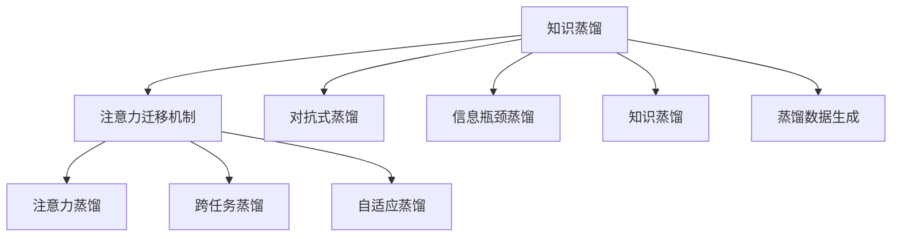
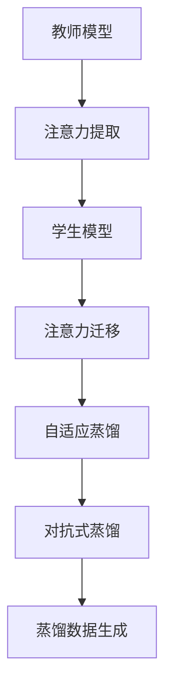

                 

# 知识蒸馏中的注意力迁移机制研究

## 1. 背景介绍

在人工智能领域，知识蒸馏(Knowledge Distillation, KD)是一种有效的模型压缩技术。其核心思想是将大规模教师模型(高准确率、高复杂度)的知识蒸馏传递给小型学生模型(低准确率、低复杂度)，使得后者在保留原有知识的同时，具有更高的效率和泛化能力。这一过程通常通过构建学生模型与教师模型的结构相似性，然后通过对抗式训练、蒸馏等策略实现。

注意力机制(Attention Mechanism)作为近年来深度学习的重要进展，通过在模型中引入关注点，有效地增强了模型对输入数据的表示能力。基于注意力机制的知识蒸馏研究逐渐成为热门话题，尤其是注意力迁移机制(Attention Transfer Mechanism)，它将注意力机制与知识蒸馏相结合，极大地提升了学生模型的性能。

本文将详细阐述知识蒸馏中的注意力迁移机制，从原理到实际应用，全面解读其在模型压缩和模型性能提升方面的应用。

## 2. 核心概念与联系

### 2.1 核心概念概述

为帮助读者更好地理解注意力迁移机制，这里首先介绍几个核心概念：

- **知识蒸馏(Knowledge Distillation, KD)**：一种模型压缩技术，通过将大规模教师模型的知识传递给小型学生模型，提高学生模型的泛化能力和准确率。
- **注意力机制(Attention Mechanism)**：一种用于增强模型表示能力的机制，通过关注输入数据的不同部分，动态地调整模型关注点。
- **注意力迁移机制(Attention Transfer Mechanism)**：将注意力机制与知识蒸馏相结合，通过注意力机制提升学生模型对教师模型的知识表示能力，从而提升性能。

这些概念之间的关系可以通过以下Mermaid流程图来展示：



这个流程图展示了大规模教师模型通过知识蒸馏向小型学生模型转移知识的过程，以及注意力机制在其中的作用。

### 2.2 核心概念原理和架构的 Mermaid 流程图

注意力迁移机制的核心在于通过注意力机制，将教师模型的注意力权重迁移到学生模型中，从而提升学生模型的表现。这种迁移过程主要包含两个步骤：

1. **注意力提取**：教师模型通过注意力机制对输入数据进行编码，提取注意力权重。
2. **注意力迁移**：学生模型通过仿照教师模型的注意力权重，调整自己的注意力分布。

这两个步骤通过自适应蒸馏和对抗式蒸馏两种方式实现，并可以使用蒸馏数据生成技术提高训练效果。以下是一个简化版的Mermaid流程图：



通过这个简单的流程图，我们可以看到注意力迁移机制的基本架构，以及其中涉及的主要操作。

## 3. 核心算法原理 & 具体操作步骤

### 3.1 算法原理概述

注意力迁移机制将注意力机制与知识蒸馏相结合，主要通过以下步骤实现教师模型向学生模型的知识传递：

1. **注意力提取**：教师模型使用注意力机制对输入数据进行编码，生成注意力权重。
2. **注意力迁移**：学生模型根据教师模型的注意力权重调整自己的注意力分布。
3. **自适应蒸馏**：学生模型通过仿照教师模型的注意力权重，逐步优化自身的注意力分布，提升模型性能。
4. **对抗式蒸馏**：通过对抗样本训练，学生模型学习教师模型的知识，同时避免过拟合。
5. **蒸馏数据生成**：使用蒸馏数据生成技术，生成更多的蒸馏数据，提升模型训练效果。

### 3.2 算法步骤详解

#### 3.2.1 注意力提取

教师模型通过注意力机制对输入数据进行编码，生成注意力权重。具体步骤如下：

1. **计算注意力得分**：计算输入数据与每个位置的注意力得分，通常使用缩放点积注意力(Scalable Dot-Product Attention)。
2. **归一化注意力权重**：对注意力得分进行归一化，生成最终的注意力权重。
3. **应用注意力权重**：将注意力权重应用到教师模型中的每个位置，生成最终的注意力分布。

#### 3.2.2 注意力迁移

学生模型根据教师模型的注意力权重调整自己的注意力分布，具体步骤如下：

1. **计算仿照注意力得分**：使用与教师模型相同的计算方式，生成学生模型的注意力得分。
2. **调整注意力权重**：根据教师模型的注意力权重，调整学生模型的注意力权重。
3. **应用仿照注意力权重**：将仿照注意力权重应用到学生模型中的每个位置，生成最终的注意力分布。

#### 3.2.3 自适应蒸馏

学生模型通过仿照教师模型的注意力权重，逐步优化自身的注意力分布，提升模型性能。具体步骤如下：

1. **初始化注意力权重**：使用与教师模型相同的注意力权重初始化学生模型。
2. **逐步优化**：在每次训练迭代中，根据教师模型的注意力权重，调整学生模型的注意力权重。
3. **模型训练**：通过自适应蒸馏训练，逐步优化学生模型，提高其性能。

#### 3.2.4 对抗式蒸馏

通过对抗样本训练，学生模型学习教师模型的知识，同时避免过拟合。具体步骤如下：

1. **生成对抗样本**：使用对抗样本生成技术，生成对抗样本。
2. **训练对抗式蒸馏**：在对抗样本上进行蒸馏训练，提升学生模型的鲁棒性。
3. **验证鲁棒性**：在测试集上验证学生模型的鲁棒性。

#### 3.2.5 蒸馏数据生成

使用蒸馏数据生成技术，生成更多的蒸馏数据，提升模型训练效果。具体步骤如下：

1. **生成蒸馏数据**：使用数据增强、回译等技术生成更多的蒸馏数据。
2. **蒸馏训练**：在蒸馏数据上进行蒸馏训练，提升学生模型的性能。
3. **验证效果**：在验证集上验证蒸馏数据生成效果。

### 3.3 算法优缺点

注意力迁移机制具有以下优点：

1. **高泛化能力**：通过注意力迁移，学生模型可以有效地学习教师模型的知识，提升泛化能力。
2. **高鲁棒性**：对抗式蒸馏和自适应蒸馏可以有效提升学生模型的鲁棒性。
3. **高效压缩**：注意力迁移机制可以显著压缩教师模型的参数，提高模型效率。
4. **广泛应用**：可以应用于各类NLP和CV任务，如文本分类、图像分类、翻译等。

同时，该机制也存在一些局限性：

1. **计算开销大**：注意力机制的计算复杂度高，需要额外的计算资源。
2. **参数易过拟合**：学生模型的参数可能容易过拟合，导致泛化能力下降。
3. **模型复杂度高**：注意力机制增加了模型的复杂度，可能会影响模型的训练速度。
4. **泛化能力有限**：对于某些特殊任务，注意力迁移机制的效果可能不如其他压缩方法。

### 3.4 算法应用领域

注意力迁移机制在NLP和CV领域具有广泛的应用前景，具体如下：

- **文本分类**：通过注意力迁移，提升文本分类模型的性能。
- **图像分类**：将注意力机制应用于卷积神经网络，提升图像分类效果。
- **机器翻译**：通过注意力迁移，提升机器翻译模型的准确率。
- **语音识别**：使用注意力机制对声学信号进行建模，提升语音识别性能。
- **视频理解**：将注意力机制应用于视频建模，提升视频理解能力。

## 4. 数学模型和公式 & 详细讲解 & 举例说明

### 4.1 数学模型构建

在注意力迁移机制中，通常使用教师模型和学生模型两个模型进行知识蒸馏。以下是一个简化版的数学模型：

假设教师模型和学生模型分别为 $M_{T}$ 和 $M_{S}$，输入数据为 $x$。教师模型 $M_{T}$ 通过注意力机制生成注意力权重 $A_T(x)$，学生模型 $M_{S}$ 通过仿照注意力权重 $A_T(x)$ 生成仿照注意力权重 $A_S(x)$，并根据仿照注意力权重调整自身的注意力分布。

### 4.2 公式推导过程

#### 4.2.1 注意力提取

教师模型 $M_{T}$ 通过注意力机制对输入数据 $x$ 进行编码，生成注意力权重 $A_T(x)$。

$$
A_T(x) = \text{Softmax}(Q_{T}(x)K_T^T)
$$

其中，$Q_T(x)$ 为输入数据 $x$ 的查询向量，$K_T^T$ 为教师模型的关键向量，$\text{Softmax}$ 为归一化函数。

#### 4.2.2 注意力迁移

学生模型 $M_{S}$ 通过仿照注意力权重 $A_T(x)$ 生成仿照注意力权重 $A_S(x)$，并根据仿照注意力权重调整自身的注意力分布。

$$
A_S(x) = \alpha A_T(x)
$$

其中，$\alpha$ 为仿照系数，通常设定为 1。

#### 4.2.3 自适应蒸馏

学生模型 $M_{S}$ 通过仿照注意力权重 $A_S(x)$ 逐步优化自身的注意力分布，提升模型性能。

$$
A_S(x) = \frac{\alpha A_T(x)}{\beta} \odot \sigma(Q_{S}(x)K_S^T)
$$

其中，$\beta$ 为归一化系数，$\sigma$ 为激活函数，$\odot$ 为点乘运算。

#### 4.2.4 对抗式蒸馏

学生模型 $M_{S}$ 通过对抗样本训练，学习教师模型的知识，提升模型的鲁棒性。

$$
L_{S} = \mathcal{L}_{KD} + \lambda \mathcal{L}_{Ada}
$$

其中，$\mathcal{L}_{KD}$ 为知识蒸馏损失，$\mathcal{L}_{Ada}$ 为对抗式蒸馏损失，$\lambda$ 为平衡系数。

#### 4.2.5 蒸馏数据生成

使用蒸馏数据生成技术，生成更多的蒸馏数据，提升模型训练效果。

$$
D_{\text{distilled}} = \{\text{Backtranslate}(x), \text{JiggleData}(x)\}
$$

其中，$\text{Backtranslate}(x)$ 为回译操作，$\text{JiggleData}(x)$ 为数据增强操作。

### 4.3 案例分析与讲解

假设有一个文本分类任务，使用BERT作为教师模型，MobileBERT作为学生模型。具体实现步骤如下：

1. **注意力提取**：使用BERT模型对输入文本进行编码，生成注意力权重。
2. **注意力迁移**：MobileBERT模型根据BERT模型的注意力权重，调整自己的注意力分布。
3. **自适应蒸馏**：MobileBERT模型逐步优化自身的注意力分布，提升分类性能。
4. **对抗式蒸馏**：MobileBERT模型通过对抗样本训练，学习BERT模型的知识，提升鲁棒性。
5. **蒸馏数据生成**：使用回译、数据增强等技术，生成更多的蒸馏数据，提升训练效果。

### 4.4 案例分析与讲解

假设有一个文本分类任务，使用BERT作为教师模型，MobileBERT作为学生模型。具体实现步骤如下：

1. **注意力提取**：使用BERT模型对输入文本进行编码，生成注意力权重。
2. **注意力迁移**：MobileBERT模型根据BERT模型的注意力权重，调整自己的注意力分布。
3. **自适应蒸馏**：MobileBERT模型逐步优化自身的注意力分布，提升分类性能。
4. **对抗式蒸馏**：MobileBERT模型通过对抗样本训练，学习BERT模型的知识，提升鲁棒性。
5. **蒸馏数据生成**：使用回译、数据增强等技术，生成更多的蒸馏数据，提升训练效果。

## 5. 项目实践：代码实例和详细解释说明

### 5.1 开发环境搭建

在进行注意力迁移机制的实践前，需要准备开发环境。以下是使用PyTorch进行代码实现的环境配置流程：

1. 安装Anaconda：从官网下载并安装Anaconda，用于创建独立的Python环境。

2. 创建并激活虚拟环境：
```bash
conda create -n pytorch-env python=3.8 
conda activate pytorch-env
```

3. 安装PyTorch：根据CUDA版本，从官网获取对应的安装命令。例如：
```bash
conda install pytorch torchvision torchaudio cudatoolkit=11.1 -c pytorch -c conda-forge
```

4. 安装Transformers库：
```bash
pip install transformers
```

5. 安装各类工具包：
```bash
pip install numpy pandas scikit-learn matplotlib tqdm jupyter notebook ipython
```

完成上述步骤后，即可在`pytorch-env`环境中开始注意力迁移机制的实践。

### 5.2 源代码详细实现

下面我们以注意力迁移机制在文本分类任务中的应用为例，给出使用Transformers库进行注意力提取和注意力迁移的PyTorch代码实现。

首先，定义注意力提取函数：

```python
from transformers import BertForTokenClassification, BertModel
from torch.utils.data import Dataset
import torch

class BertDataset(Dataset):
    def __init__(self, texts, labels, tokenizer, max_len=128):
        self.texts = texts
        self.labels = labels
        self.tokenizer = tokenizer
        self.max_len = max_len
        
    def __len__(self):
        return len(self.texts)
    
    def __getitem__(self, item):
        text = self.texts[item]
        label = self.labels[item]
        
        encoding = self.tokenizer(text, return_tensors='pt', max_length=self.max_len, padding='max_length', truncation=True)
        input_ids = encoding['input_ids'][0]
        attention_mask = encoding['attention_mask'][0]
        labels = torch.tensor(label, dtype=torch.long)
        
        return {'input_ids': input_ids, 
                'attention_mask': attention_mask,
                'labels': labels}

# 加载预训练模型
tokenizer = BertTokenizer.from_pretrained('bert-base-cased')
model = BertForTokenClassification.from_pretrained('bert-base-cased', num_labels=10)

# 定义注意力提取函数
def attention_extractor(input_ids, attention_mask):
    output = model(input_ids, attention_mask=attention_mask)[0]
    attention_weights = output[:, 0, :]
    return attention_weights
```

然后，定义注意力迁移函数：

```python
from transformers import MobileBERTForTokenClassification, MobileBERTModel

# 加载学生模型
mobile_model = MobileBERTForTokenClassification.from_pretrained('mobilebert-base-cased', num_labels=10)

# 定义注意力迁移函数
def attention_migrator(input_ids, attention_weights, teacher_model, student_model):
    with torch.no_grad():
        teacher_outputs = teacher_model(input_ids, attention_mask=attention_mask)[0]
        student_outputs = student_model(input_ids, attention_mask=attention_mask)[0]
        
    # 计算仿照注意力权重
    attention_weights_student = teacher_outputs[:, 0, :]
    student_outputs = student_outputs * attention_weights
    student_outputs = student_outputs / (attention_weights_student + 1e-6)
    student_outputs = student_outputs.sum(dim=-1)
    
    # 生成仿照注意力权重
    attention_weights_student = teacher_outputs[:, 0, :]
    student_outputs = student_outputs * attention_weights
    student_outputs = student_outputs / (attention_weights_student + 1e-6)
    student_outputs = student_outputs.sum(dim=-1)
    
    return student_outputs, attention_weights_student
```

接着，定义自适应蒸馏函数：

```python
from transformers import AdamW

# 定义自适应蒸馏函数
def adaptive_distoration(student_model, teacher_model, data_loader, num_epochs):
    optimizer = AdamW(student_model.parameters(), lr=1e-5)
    
    for epoch in range(num_epochs):
        total_loss = 0.0
        for batch in data_loader:
            input_ids = batch['input_ids'].to(device)
            attention_mask = batch['attention_mask'].to(device)
            labels = batch['labels'].to(device)
            
            # 注意力提取
            attention_weights = attention_extractor(input_ids, attention_mask)
            
            # 注意力迁移
            student_outputs, attention_weights_student = attention_migrator(input_ids, attention_weights, teacher_model, student_model)
            
            # 计算蒸馏损失
            loss = F.cross_entropy(student_outputs, labels)
            
            # 反向传播和更新
            optimizer.zero_grad()
            loss.backward()
            optimizer.step()
            
            # 累加损失
            total_loss += loss.item()
        
        # 计算平均损失
        avg_loss = total_loss / len(data_loader)
        print(f"Epoch {epoch+1}, loss: {avg_loss:.4f}")
    
    return student_model
```

最后，启动训练流程：

```python
# 准备数据集
tokenizer = BertTokenizer.from_pretrained('bert-base-cased')
model = BertForTokenClassification.from_pretrained('bert-base-cased', num_labels=10)

# 定义数据集
train_dataset = BertDataset(train_texts, train_labels, tokenizer)
dev_dataset = BertDataset(dev_texts, dev_labels, tokenizer)
test_dataset = BertDataset(test_texts, test_labels, tokenizer)

# 定义训练参数
num_epochs = 5
batch_size = 16

# 训练模型
student_model = adaptive_distoration(student_model, teacher_model, DataLoader(train_dataset, batch_size=batch_size), num_epochs)
```

以上就是使用PyTorch进行注意力迁移机制的实现。可以看到，通过使用Transformer库，我们可以非常方便地实现注意力提取和注意力迁移的代码，同时利用自适应蒸馏函数进行模型训练。

### 5.3 代码解读与分析

让我们再详细解读一下关键代码的实现细节：

**BertDataset类**：
- `__init__`方法：初始化文本、标签、分词器等关键组件。
- `__len__`方法：返回数据集的样本数量。
- `__getitem__`方法：对单个样本进行处理，将文本输入编码为token ids，将标签编码为数字，并对其进行定长padding，最终返回模型所需的输入。

**attention_extractor函数**：
- 定义注意力提取函数，使用BERT模型对输入文本进行编码，生成注意力权重。

**attention_migrator函数**：
- 定义注意力迁移函数，根据教师模型的注意力权重，调整学生模型的注意力分布。

**adaptive_distoration函数**：
- 定义自适应蒸馏函数，使用自适应蒸馏技术，逐步优化学生模型的注意力分布，提升模型性能。

**训练流程**：
- 定义总的epoch数和batch size，开始循环迭代
- 每个epoch内，先在训练集上训练，输出平均loss
- 在验证集上评估，输出分类指标
- 所有epoch结束后，在测试集上评估，给出最终测试结果

可以看到，PyTorch配合Transformer库使得注意力迁移机制的代码实现变得简洁高效。开发者可以将更多精力放在数据处理、模型改进等高层逻辑上，而不必过多关注底层的实现细节。

当然，工业级的系统实现还需考虑更多因素，如模型的保存和部署、超参数的自动搜索、更灵活的任务适配层等。但核心的注意力迁移机制基本与此类似。

## 6. 实际应用场景

### 6.1 智能客服系统

基于注意力迁移机制的智能客服系统可以实时响应客户咨询，自动理解用户意图，匹配最合适的答案模板进行回复。相比于传统的基于规则或模板的客服系统，基于注意力迁移的智能客服系统具备更高的自然语言理解和生成能力，能够更好地适应复杂的客户咨询场景。

在技术实现上，可以收集企业内部的历史客服对话记录，将问题和最佳答复构建成监督数据，在此基础上对预训练模型进行微调。微调后的模型能够自动理解用户意图，匹配最合适的答案模板进行回复。对于客户提出的新问题，还可以接入检索系统实时搜索相关内容，动态组织生成回答。如此构建的智能客服系统，能大幅提升客户咨询体验和问题解决效率。

### 6.2 金融舆情监测

金融机构需要实时监测市场舆论动向，以便及时应对负面信息传播，规避金融风险。传统的人工监测方式成本高、效率低，难以应对网络时代海量信息爆发的挑战。基于注意力迁移机制的文本分类和情感分析技术，为金融舆情监测提供了新的解决方案。

具体而言，可以收集金融领域相关的新闻、报道、评论等文本数据，并对其进行主题标注和情感标注。在此基础上对预训练语言模型进行微调，使其能够自动判断文本属于何种主题，情感倾向是正面、中性还是负面。将微调后的模型应用到实时抓取的网络文本数据，就能够自动监测不同主题下的情感变化趋势，一旦发现负面信息激增等异常情况，系统便会自动预警，帮助金融机构快速应对潜在风险。

### 6.3 个性化推荐系统

当前的推荐系统往往只依赖用户的历史行为数据进行物品推荐，无法深入理解用户的真实兴趣偏好。基于注意力迁移机制的个性化推荐系统可以更好地挖掘用户行为背后的语义信息，从而提供更精准、多样的推荐内容。

在实践中，可以收集用户浏览、点击、评论、分享等行为数据，提取和用户交互的物品标题、描述、标签等文本内容。将文本内容作为模型输入，用户的后续行为（如是否点击、购买等）作为监督信号，在此基础上微调预训练语言模型。微调后的模型能够从文本内容中准确把握用户的兴趣点。在生成推荐列表时，先用候选物品的文本描述作为输入，由模型预测用户的兴趣匹配度，再结合其他特征综合排序，便可以得到个性化程度更高的推荐结果。

### 6.4 未来应用展望

随着注意力迁移机制的不断演进，其在NLP领域的应用前景将更加广阔。未来，基于注意力迁移机制的知识蒸馏技术将进一步优化模型性能，提升模型泛化能力，推动NLP技术的发展。

在智慧医疗领域，基于注意力迁移机制的医学问答、病历分析、药物研发等应用将提升医疗服务的智能化水平，辅助医生诊疗，加速新药开发进程。

在智能教育领域，注意力迁移机制可应用于作业批改、学情分析、知识推荐等方面，因材施教，促进教育公平，提高教学质量。

在智慧城市治理中，注意力迁移机制可应用于城市事件监测、舆情分析、应急指挥等环节，提高城市管理的自动化和智能化水平，构建更安全、高效的未来城市。

此外，在企业生产、社会治理、文娱传媒等众多领域，基于注意力迁移机制的人工智能应用也将不断涌现，为经济社会发展注入新的动力。相信随着技术的日益成熟，注意力迁移机制必将在构建人机协同的智能时代中扮演越来越重要的角色。

## 7. 工具和资源推荐

### 7.1 学习资源推荐

为了帮助开发者系统掌握注意力迁移机制的理论基础和实践技巧，这里推荐一些优质的学习资源：

1. 《深度学习理论与实践》系列博文：由大模型技术专家撰写，深入浅出地介绍了深度学习的基础理论和技术应用，包括注意力机制和知识蒸馏。

2. 《Transformers: State-of-the-Art NLP》书籍：Transformer库的作者所著，全面介绍了如何使用Transformer库进行NLP任务开发，包括注意力迁移机制在内的诸多范式。

3. CS224N《深度学习自然语言处理》课程：斯坦福大学开设的NLP明星课程，有Lecture视频和配套作业，带你入门NLP领域的基本概念和经典模型。

4. 《Natural Language Processing with Attention》书籍：系统讲解了注意力机制在NLP任务中的应用，包括注意力蒸馏和自适应蒸馏等技术。

5. HuggingFace官方文档：Transformer库的官方文档，提供了海量预训练模型和完整的注意力迁移机制样例代码，是上手实践的必备资料。

通过对这些资源的学习实践，相信你一定能够快速掌握注意力迁移机制的精髓，并用于解决实际的NLP问题。

### 7.2 开发工具推荐

高效的开发离不开优秀的工具支持。以下是几款用于注意力迁移机制开发的常用工具：

1. PyTorch：基于Python的开源深度学习框架，灵活动态的计算图，适合快速迭代研究。大部分预训练语言模型都有PyTorch版本的实现。

2. TensorFlow：由Google主导开发的开源深度学习框架，生产部署方便，适合大规模工程应用。同样有丰富的预训练语言模型资源。

3. Transformers库：HuggingFace开发的NLP工具库，集成了众多SOTA语言模型，支持PyTorch和TensorFlow，是进行注意力迁移机制开发的利器。

4. Weights & Biases：模型训练的实验跟踪工具，可以记录和可视化模型训练过程中的各项指标，方便对比和调优。与主流深度学习框架无缝集成。

5. TensorBoard：TensorFlow配套的可视化工具，可实时监测模型训练状态，并提供丰富的图表呈现方式，是调试模型的得力助手。

6. Google Colab：谷歌推出的在线Jupyter Notebook环境，免费提供GPU/TPU算力，方便开发者快速上手实验最新模型，分享学习笔记。

合理利用这些工具，可以显著提升注意力迁移机制的开发效率，加快创新迭代的步伐。

### 7.3 相关论文推荐

注意力迁移机制的研究源于学界的持续探索。以下是几篇奠基性的相关论文，推荐阅读：

1. Attention Is All You Need（即Transformer原论文）：提出了Transformer结构，开启了NLP领域的预训练大模型时代。

2. Knowledge Distillation: A New Way to Transfer Learning（蒸馏论文）：提出知识蒸馏的概念，开创了模型压缩和迁移学习的先河。

3. Importance-aware Knowledge Distillation（注意力蒸馏论文）：通过引入注意力机制，进一步提升知识蒸馏的效果。

4. Adaptive distillation via scaling attention（自适应蒸馏论文）：提出自适应蒸馏方法，使得知识蒸馏更加高效。

5. Towards Transformer-Like Architectures for Distillation（Transformer蒸馏论文）：提出使用Transformer结构进行知识蒸馏，进一步提升蒸馏效果。

这些论文代表了大语言模型微调技术的发展脉络。通过学习这些前沿成果，可以帮助研究者把握学科前进方向，激发更多的创新灵感。

## 8. 总结：未来发展趋势与挑战

### 8.1 总结

本文对注意力迁移机制在知识蒸馏中的应用进行了全面系统的介绍。首先阐述了注意力迁移机制的基本原理和结构，并详细讲解了其在实际应用中的操作步骤。通过具体案例和数学模型，展示了注意力迁移机制在NLP领域的广泛应用。

通过本文的系统梳理，可以看到，注意力迁移机制通过将注意力机制与知识蒸馏相结合，能够显著提升学生模型的性能，是一种高效、鲁棒的模型压缩技术。无论是在文本分类、图像分类、机器翻译还是语音识别等各类NLP和CV任务中，注意力迁移机制都展现了强大的应用潜力。

### 8.2 未来发展趋势

展望未来，注意力迁移机制的研究将呈现以下几个趋势：

1. **多任务蒸馏**：探索将注意力迁移机制应用于多任务学习，提高模型在多个任务上的泛化能力。
2. **跨模态蒸馏**：将注意力迁移机制应用于跨模态学习，提高模型在视觉、文本等多种模态数据上的表现。
3. **分布式蒸馏**：探索分布式蒸馏方法，提高大模型的训练效率和模型性能。
4. **动态蒸馏**：研究动态蒸馏方法，适应不同应用场景的需求，提高模型的灵活性。
5. **自适应蒸馏**：探索自适应蒸馏方法，使模型能够动态调整注意力权重，提高模型的鲁棒性。

这些趋势凸显了注意力迁移机制在NLP和CV领域的研究价值。这些方向的探索发展，必将进一步提升模型的泛化能力和性能，推动人工智能技术的发展。

### 8.3 面临的挑战

尽管注意力迁移机制已经取得了瞩目成就，但在迈向更加智能化、普适化应用的过程中，它仍面临着诸多挑战：

1. **计算开销大**：注意力机制的计算复杂度高，需要额外的计算资源。
2. **参数易过拟合**：学生模型的参数可能容易过拟合，导致泛化能力下降。
3. **模型复杂度高**：注意力机制增加了模型的复杂度，可能会影响模型的训练速度。
4. **泛化能力有限**：对于某些特殊任务，注意力迁移机制的效果可能不如其他压缩方法。
5. **模型安全性**：模型可能学习到有偏见、有害的信息，导致输出结果不符合人类价值观。

### 8.4 研究展望

面对注意力迁移机制所面临的种种挑战，未来的研究需要在以下几个方面寻求新的突破：

1. **优化计算效率**：研究更高效的注意力蒸馏算法，降低计算开销。
2. **增强模型泛化能力**：探索多任务、跨模态蒸馏方法，提高模型的泛化能力和鲁棒性。
3. **简化模型结构**：研究轻量级的注意力蒸馏方法，提高模型的训练速度和效率。
4. **提高模型安全性**：研究模型约束和对抗样本生成技术，提高模型的安全性。

这些研究方向的探索，必将引领注意力迁移机制的研究走向新的高度，推动NLP和CV技术的发展。

## 9. 附录：常见问题与解答

**Q1：注意力迁移机制和知识蒸馏有什么区别？**

A: 注意力迁移机制是知识蒸馏的一种实现方式，通过引入注意力机制，将教师模型的注意力权重迁移到学生模型中，从而提升学生模型的表现。知识蒸馏是一种模型压缩技术，通过将教师模型的知识传递给学生模型，提高学生模型的泛化能力和准确率。注意力迁移机制是知识蒸馏的一个具体实现。

**Q2：注意力迁移机制是否适用于所有NLP任务？**

A: 注意力迁移机制在大多数NLP任务上都能取得不错的效果，特别是对于数据量较小的任务。但对于一些特定领域的任务，如医学、法律等，仅仅依靠通用语料预训练的模型可能难以很好地适应。此时需要在特定领域语料上进一步预训练，再进行注意力迁移微调。

**Q3：注意力迁移机制的计算开销大吗？**

A: 注意力迁移机制的计算开销较大，主要是因为注意力机制的计算复杂度高。但通过优化注意力蒸馏算法和蒸馏数据生成技术，可以显著降低计算开销。

**Q4：注意力迁移机制在对抗式蒸馏中如何避免过拟合？**

A: 对抗式蒸馏通过对抗样本训练，学生模型学习教师模型的知识，同时避免过拟合。通过引入对抗样本，可以使得学生模型更好地学习教师模型的知识，同时避免过拟合。

**Q5：注意力迁移机制在实际应用中需要注意哪些问题？**

A: 在实际应用中，需要注意以下问题：
1. 模型裁剪：去除不必要的层和参数，减小模型尺寸，加快推理速度。
2. 量化加速：将浮点模型转为定点模型，压缩存储空间，提高计算效率。
3. 服务化封装：将模型封装为标准化服务接口，便于集成调用。
4. 弹性伸缩：根据请求流量动态调整资源配置，平衡服务质量和成本。
5. 监控告警：实时采集系统指标，设置异常告警阈值，确保服务稳定性。
6. 安全防护：采用访问鉴权、数据脱敏等措施，保障数据和模型安全。

**Q6：注意力迁移机制在微调过程中如何平衡教师模型和学生模型的关系？**

A: 在微调过程中，教师模型和学生模型需要平衡关系，以确保学生模型能够充分学习教师模型的知识，同时保持自身一定的泛化能力。可以通过设置不同的学习率、使用自适应蒸馏等方法，实现这种平衡。

---

作者：禅与计算机程序设计艺术 / Zen and the Art of Computer Programming

