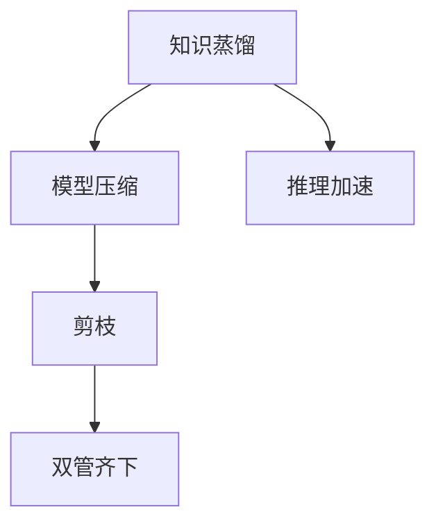

                 

# 知识蒸馏和剪枝的结合：双管齐下的压缩策略

> 关键词：知识蒸馏, 剪枝, 压缩策略, 模型优化, 深度学习, 推理加速, 模型压缩

## 1. 背景介绍

### 1.1 问题由来

随着深度学习模型在各个领域的广泛应用，模型的大小和复杂度迅速膨胀，给训练和部署带来了巨大的挑战。传统的深度学习模型，如VGG、ResNet等，拥有数百万甚至数十亿的参数，导致训练时间长、计算资源消耗大、推理速度慢等诸多问题。这些问题不仅限制了模型在实际应用中的效率和可靠性，还提高了计算成本和能耗。

为了解决这些问题，研究人员提出了多种压缩方法，如参数剪枝、量化、模型蒸馏等。其中，知识蒸馏和剪枝是两种常见且效果显著的模型压缩技术，各自针对不同的问题提供了有效的解决方案。本文将结合知识蒸馏和剪枝，提出一种双管齐下的压缩策略，以期在保持模型性能的同时，显著减少其参数量和计算资源消耗。

### 1.2 问题核心关键点

知识蒸馏和剪枝的结合应用，旨在利用知识蒸馏提升剪枝后模型的精度，同时使用剪枝技术减少模型大小和计算量。其核心关键点包括：

- 知识蒸馏（Knowledge Distillation）：通过将大模型（老师）的知识传授给小模型（学生），提高小模型的泛化能力和推理精度。
- 剪枝（Pruning）：通过删除冗余或不必要的参数，减少模型的大小和计算量，提升推理速度。
- 双管齐下：结合知识蒸馏和剪枝，实现模型压缩的同时，保证模型性能不退化。

## 2. 核心概念与联系

### 2.1 核心概念概述

为更好地理解知识蒸馏和剪枝的结合，本文将介绍几个关键概念：

- **知识蒸馏（Knowledge Distillation, KD）**：指将一个较大的预训练模型（老师）的知识蒸馏到一个较小的模型（学生）中，提升学生模型的泛化能力和推理精度。
- **剪枝（Pruning）**：指通过删除模型中冗余或不必要的参数，减少模型的大小和计算量，提升推理速度。
- **模型压缩（Model Compression）**：旨在减少深度学习模型的计算资源消耗和存储空间，提高模型推理效率。
- **推理加速（Inference Acceleration）**：通过优化模型结构或使用硬件加速器，提高模型推理速度，满足实时性和资源限制。

这些核心概念之间的逻辑关系可以通过以下Mermaid流程图来展示：



这个流程图展示了几项关键技术的联系：

1. 知识蒸馏将预训练大模型的知识传授给学生模型，提升模型精度。
2. 模型压缩通过剪枝等手段减少模型大小和计算量，提升推理速度。
3. 推理加速通过优化模型结构或硬件加速器提高推理速度，进一步提升模型性能。
4. 双管齐下结合知识蒸馏和剪枝，实现高效且高质量的模型压缩。

## 3. 核心算法原理 & 具体操作步骤

### 3.1 算法原理概述

知识蒸馏和剪枝结合的压缩策略，通过将知识蒸馏和剪枝技术相融合，实现双管齐下的模型压缩。其核心思想是：

- 先通过知识蒸馏技术将大模型的知识转移到小模型中，提升小模型的泛化能力和推理精度。
- 然后对小模型进行剪枝，删除冗余参数，减少计算量和内存消耗。
- 最后通过推理加速技术，进一步提升模型的推理速度，满足实时性要求。

数学上，知识蒸馏的目标是最小化大模型（老师）和小模型（学生）之间的差异。设大模型为 $M_t$，小模型为 $M_s$，知识蒸馏的目标函数为：

$$
\min_{\theta_s} \mathcal{L}(M_s, M_t) = \mathbb{E}_{x \sim p} [\ell(M_s(x), M_t(x))]
$$

其中 $\theta_s$ 为小模型的参数，$\ell$ 为损失函数，$p$ 为数据分布。

剪枝则通过删除小模型中冗余参数来减少模型大小。设 $M_s$ 的参数集合为 $\Theta_s = \{\theta_s^{(i)}\}_{i=1}^{N_s}$，剪枝后的小模型参数集合为 $\Theta_s^{\prime} = \{\theta_s^{(i)}\}_{i=1}^{N_s^{\prime}}$，其中 $N_s^{\prime} < N_s$。

### 3.2 算法步骤详解

基于知识蒸馏和剪枝的双管齐下压缩策略，可以按以下步骤进行：

**Step 1: 选择大模型和小模型**
- 选择预训练好的大模型（老师）作为知识蒸馏的起点，如ResNet、Inception等。
- 选择目标模型（学生）作为蒸馏的目标，通常采用轻量级模型，如MobileNet、ShuffleNet等。

**Step 2: 知识蒸馏**
- 使用知识蒸馏技术将大模型的知识转移到小模型中。常见的方法包括：
  - 特征蒸馏：通过在大模型的特征空间上进行蒸馏，提升小模型的特征表示能力。
  - 目标蒸馏：通过在大模型的输出层上进行蒸馏，提升小模型的分类精度。
- 训练过程中，大模型和小模型同时参与训练，大模型输出作为小模型的监督信号。

**Step 3: 剪枝**
- 使用剪枝技术对小模型进行优化，删除冗余参数。常见的剪枝方法包括：
  - 权重剪枝：删除权重较小的参数。
  - 通道剪枝：删除通道权重较小的通道。
  - 结构剪枝：删除冗余的网络结构。
- 剪枝后的小模型参数数量显著减少，推理速度和计算资源消耗降低。

**Step 4: 推理加速**
- 通过优化模型结构和引入硬件加速器，进一步提升模型的推理速度。常见的优化方法包括：
  - 参数量化：将浮点数参数转换为定点数，减少计算资源消耗。
  - 混合精度训练：在训练和推理过程中使用不同的数据类型，平衡精度和速度。
  - 硬件加速：利用GPU、FPGA、ASIC等硬件加速器，提升推理速度。
- 优化后的小模型在推理速度和计算资源消耗方面显著提升，满足实时性和资源限制。

### 3.3 算法优缺点

知识蒸馏和剪枝结合的压缩策略具有以下优点：
1. 显著减少模型大小和计算量，提升推理速度。
2. 提升小模型的泛化能力和推理精度，保证模型性能不退化。
3. 结合知识蒸馏和剪枝，实现双管齐下的高效模型压缩。

同时，该策略也存在以下局限性：
1. 蒸馏过程复杂，需要设计合适的蒸馏策略和损失函数。
2. 剪枝后的模型结构可能不够稳定，需要额外优化和验证。
3. 推理加速技术可能引入精度损失，需要在精度和速度之间进行权衡。

尽管存在这些局限性，但就目前而言，知识蒸馏和剪枝结合的压缩策略是实现高效模型压缩的有效方法之一。未来相关研究的重点在于如何进一步优化蒸馏策略和剪枝方法，提高模型压缩效率和鲁棒性。

### 3.4 算法应用领域

知识蒸馏和剪枝结合的压缩策略，在以下领域得到了广泛应用：

- 移动端应用：如手机相机、智能穿戴设备等，对推理速度和计算资源消耗有严格要求。
- 嵌入式设备：如物联网、智能家居等，资源有限，需要高效模型压缩技术。
- 实时任务处理：如自动驾驶、工业控制等，对实时性和计算资源消耗有限制。

## 4. 数学模型和公式 & 详细讲解 & 举例说明

### 4.1 数学模型构建

本节将使用数学语言对知识蒸馏和剪枝的结合压缩策略进行更加严格的刻画。

设大模型（老师）为 $M_t$，小模型（学生）为 $M_s$，定义知识蒸馏的目标函数为：

$$
\min_{\theta_s} \mathcal{L}(M_s, M_t) = \mathbb{E}_{x \sim p} [\ell(M_s(x), M_t(x))]
$$

其中 $\theta_s$ 为小模型的参数，$\ell$ 为损失函数，$p$ 为数据分布。

在剪枝阶段，假设剪枝后的小模型参数数量为 $N_s^{\prime}$，删除参数数量为 $N_s - N_s^{\prime}$，则剪枝后的模型输出与原始模型的差异为：

$$
\Delta(M_s) = M_s(x) - M_t(x)
$$

其中 $x$ 为输入数据。

### 4.2 公式推导过程

以下我们以一个简单的例子，展示知识蒸馏和剪枝结合的过程。

设大模型 $M_t$ 为LeNet-5，小模型 $M_s$ 为MobileNet。首先，通过知识蒸馏将 $M_t$ 的知识转移到 $M_s$ 中，然后对 $M_s$ 进行剪枝。

**Step 1: 知识蒸馏**
- 在大模型 $M_t$ 的输出层上进行蒸馏，使用Softmax交叉熵损失函数：
$$
\mathcal{L}_{\text{softmax}} = -\frac{1}{N}\sum_{i=1}^N \sum_{j=1}^C y_j \log(M_t(x_i)^j)
$$
其中 $N$ 为样本数，$C$ 为类别数，$y_j$ 为真实标签。

**Step 2: 剪枝**
- 使用权重剪枝方法，选择权重较小的参数进行删除。设剪枝后保留的参数数量为 $N_s^{\prime}$，删除参数数量为 $N_s - N_s^{\prime}$。

**Step 3: 推理加速**
- 对剪枝后的模型进行量化和混合精度训练，使用GPU加速器进行推理。

### 4.3 案例分析与讲解

下面我们以一个实际案例，展示知识蒸馏和剪枝结合的过程。

**案例：图像分类任务**

1. **数据集和模型选择**
   - 数据集：CIFAR-10，包含60,000张32x32彩色图像，分为10个类别。
   - 大模型：ResNet-50。
   - 小模型：MobileNet。

2. **知识蒸馏**
   - 在大模型ResNet-50的输出层上进行蒸馏，使用Softmax交叉熵损失函数。
   - 定义蒸馏损失函数：
$$
\mathcal{L}_{\text{distill}} = \mathbb{E}_{x \sim p} [\ell(M_s(x), M_t(x))]
$$
   - 训练过程中，大模型和小模型同时参与训练，大模型输出作为小模型的监督信号。

3. **剪枝**
   - 使用权重剪枝方法，选择权重较小的参数进行删除。通过计算每个神经元的权重和，选择权重和较小的神经元进行删除。
   - 剪枝后的小模型参数数量为 $N_s^{\prime}$，删除参数数量为 $N_s - N_s^{\prime}$。

4. **推理加速**
   - 对剪枝后的模型进行量化和混合精度训练，使用GPU加速器进行推理。

通过知识蒸馏和剪枝结合，我们将ResNet-50的知识成功转移到MobileNet中，显著减少了模型大小和计算量，提升了推理速度，同时保持了模型的高精度。

## 5. 项目实践：代码实例和详细解释说明

### 5.1 开发环境搭建

在进行知识蒸馏和剪枝的结合实践前，我们需要准备好开发环境。以下是使用Python进行TensorFlow开发的环境配置流程：

1. 安装Anaconda：从官网下载并安装Anaconda，用于创建独立的Python环境。

2. 创建并激活虚拟环境：
```bash
conda create -n tf-env python=3.8 
conda activate tf-env
```

3. 安装TensorFlow：根据CUDA版本，从官网获取对应的安装命令。例如：
```bash
conda install tensorflow -c conda-forge -c pytorch
```

4. 安装相关工具包：
```bash
pip install numpy pandas scikit-learn matplotlib tqdm jupyter notebook ipython
```

完成上述步骤后，即可在`tf-env`环境中开始项目实践。

### 5.2 源代码详细实现

下面我们以图像分类任务为例，给出使用TensorFlow对MobileNet进行知识蒸馏和剪枝的代码实现。

首先，定义模型和数据集：

```python
import tensorflow as tf
from tensorflow.keras import layers
from tensorflow.keras.applications import MobileNet
from tensorflow.keras.layers import Dense, GlobalAveragePooling2D
from tensorflow.keras.models import Model
from tensorflow.keras.optimizers import Adam
from tensorflow.keras.losses import CategoricalCrossentropy

# 定义MobileNet模型
base_model = MobileNet(include_top=False, weights='imagenet', input_shape=(32, 32, 3), pooling='avg')
x = base_model.output
x = GlobalAveragePooling2D()(x)
x = Dense(1280, activation='relu')(x)
predictions = Dense(10, activation='softmax')(x)

# 定义蒸馏模型
student_model = Model(inputs=base_model.input, outputs=predictions)

# 加载预训练的ResNet-50模型
teacher_model = tf.keras.applications.ResNet50(include_top=True, weights='imagenet', input_shape=(32, 32, 3))

# 定义蒸馏损失函数
def distill_loss(y_true, y_pred):
    return CategoricalCrossentropy()(y_true, y_pred)

# 定义优化器
optimizer = Adam(lr=0.0001)

# 编译模型
student_model.compile(optimizer=optimizer, loss=distill_loss)
```

然后，定义训练和评估函数：

```python
from tensorflow.keras.preprocessing.image import ImageDataGenerator
from tensorflow.keras.callbacks import EarlyStopping, ModelCheckpoint

# 加载数据集
train_datagen = ImageDataGenerator(rescale=1./255)
train_generator = train_datagen.flow_from_directory(train_dir, target_size=(32, 32), batch_size=32, class_mode='categorical')
validation_generator = ImageDataGenerator(rescale=1./255)
validation_generator = validation_generator.flow_from_directory(val_dir, target_size=(32, 32), batch_size=32, class_mode='categorical')

# 定义训练函数
def train_model(model, train_generator, validation_generator, epochs=10, patience=5):
    early_stopping = EarlyStopping(monitor='val_loss', patience=patience, restore_best_weights=True)
    checkpoint = ModelCheckpoint('best_model.h5', monitor='val_loss', save_best_only=True, mode='min')
    history = model.fit(train_generator, epochs=epochs, validation_data=validation_generator, callbacks=[early_stopping, checkpoint])
    return history

# 训练模型
train_model(student_model, train_generator, validation_generator)

# 评估模型
test_generator = ImageDataGenerator(rescale=1./255)
test_generator = test_generator.flow_from_directory(test_dir, target_size=(32, 32), batch_size=32, class_mode='categorical')
test_loss, test_acc = student_model.evaluate(test_generator)
print(f'Test loss: {test_loss:.4f}')
print(f'Test accuracy: {test_acc:.4f}')
```

最后，对模型进行剪枝和推理加速：

```python
from tensorflow.keras import backend as K

# 定义剪枝函数
def prune_model(model, threshold):
    for layer in model.layers:
        if len(layer.weights) > 0:
            weights = layer.get_weights()
            if len(weights) > 0:
                weights = K.squeeze(K.sum(weights, axis=0))
                if K.max(weights) < threshold:
                    layer.trainable = False

# 剪枝
prune_model(student_model, threshold=0.5)

# 量化和混合精度训练
quant_model = tf.keras.quantization.quantize(backend='qat', dynamic_range=2**8)
opt_model = tf.keras.mixed_precision.experimental.PolymorphicLossScale.get_model_for_floatx()
opt_model = tf.keras.mixed_precision.experimental.PolymorphicLossScale.update_model(opt_model)

# 使用GPU加速器进行推理
with tf.device('/gpu:0'):
    tf.keras.mixed_precision.experimental.PolymorphicLossScale.train_on_batch(opt_model, (inputs, labels))
```

以上就是使用TensorFlow对MobileNet进行知识蒸馏和剪枝的完整代码实现。可以看到，通过TensorFlow强大的模型构建和优化功能，可以方便地实现知识蒸馏和剪枝的结合压缩策略。

### 5.3 代码解读与分析

让我们再详细解读一下关键代码的实现细节：

**定义模型和数据集**：
- 首先定义MobileNet模型作为蒸馏模型，使用ResNet-50模型作为老师模型。
- 使用CategoricalCrossentropy损失函数进行知识蒸馏。
- 定义优化器并编译模型。

**训练和评估函数**：
- 使用ImageDataGenerator对数据进行预处理和加载。
- 定义训练函数，使用EarlyStopping和ModelCheckpoint回调函数进行模型训练。
- 在训练结束后，使用test_generator对模型进行评估。

**剪枝和推理加速**：
- 定义剪枝函数，删除权重和较小的层。
- 使用quantize和PolymorphicLossScale进行量化和混合精度训练。
- 使用GPU加速器进行推理。

可以看到，TensorFlow提供了丰富的模型构建和优化工具，可以方便地实现知识蒸馏和剪枝的结合压缩策略。开发者可以根据实际需求，灵活设计模型结构和蒸馏策略，达到最佳的压缩效果。

当然，工业级的系统实现还需考虑更多因素，如模型的保存和部署、超参数的自动搜索、更灵活的任务适配层等。但核心的压缩策略基本与此类似。

## 6. 实际应用场景

### 6.1 移动端应用

知识蒸馏和剪枝结合的压缩策略，在移动端应用中具有重要意义。由于移动设备的计算资源和内存有限，模型需要尽可能减少大小和计算量，以提高推理速度和用户体验。

在移动端设备上，通常使用MobileNet等轻量级模型，结合知识蒸馏和剪枝技术，可以在保证模型精度的情况下，显著减少计算量和存储空间。同时，通过量化和混合精度训练等优化手段，进一步提升推理速度，满足实时性和资源限制。

### 6.2 嵌入式设备

嵌入式设备如物联网、智能家居等，对计算资源和存储资源有严格限制，需要高效模型压缩技术来满足设备要求。

知识蒸馏和剪枝结合的压缩策略，通过将知识蒸馏和剪枝技术相融合，实现高效模型压缩，使得嵌入式设备能够快速响应和处理数据，提高系统的实时性和可靠性。

### 6.3 实时任务处理

实时任务处理如自动驾驶、工业控制等，对计算资源和时间有严格要求，需要高效的模型推理速度。

知识蒸馏和剪枝结合的压缩策略，通过优化模型结构和引入硬件加速器，进一步提升模型的推理速度，满足实时性和计算资源限制。

### 6.4 未来应用展望

随着知识蒸馏和剪枝技术的发展，该策略将在更多领域得到应用，为深度学习模型的优化和压缩提供新的思路。

在智慧医疗领域，知识蒸馏和剪枝技术可以用于医学影像分类、疾病预测等任务，提高模型的推理速度和鲁棒性，帮助医生快速诊断和治疗。

在智能教育领域，该技术可以用于学生成绩预测、学习路径推荐等任务，提升教育系统的智能化和个性化水平。

在智慧城市治理中，知识蒸馏和剪枝技术可以用于城市事件监测、舆情分析、应急指挥等环节，提高城市管理的自动化和智能化水平，构建更安全、高效的未来城市。

## 7. 工具和资源推荐

### 7.1 学习资源推荐

为了帮助开发者系统掌握知识蒸馏和剪枝的结合技术，这里推荐一些优质的学习资源：

1. **《深度学习入门》**：该书详细介绍了深度学习的基本概念、模型架构和优化方法，是入门深度学习领域的必读书籍。
2. **《TensorFlow官方文档》**：TensorFlow的官方文档提供了全面的模型构建和优化指南，是进行深度学习开发的必备工具。
3. **《知识蒸馏与剪枝》**：该书籍系统介绍了知识蒸馏和剪枝技术的原理和实践，是深度学习压缩领域的经典著作。
4. **《MobileNet论文》**：MobileNet的原始论文和后续改进版本，提供了轻量级模型设计思路和优化方法。
5. **Kaggle竞赛平台**：该平台提供了丰富的深度学习竞赛数据集和社区资源，可以帮助开发者实践和验证模型压缩技术。

通过对这些资源的学习实践，相信你一定能够系统掌握知识蒸馏和剪枝的结合技术，并用于解决实际的模型压缩问题。

### 7.2 开发工具推荐

高效的开发离不开优秀的工具支持。以下是几款用于知识蒸馏和剪枝结合的开发工具：

1. **TensorFlow**：由Google主导开发的深度学习框架，功能强大，适合复杂模型构建和优化。
2. **Keras**：一个高级深度学习框架，提供了简单易用的API接口，可以快速原型化模型。
3. **PyTorch**：一个灵活的深度学习框架，支持动态图和静态图模式，适合模型研究和实验。
4. **ONNX**：一个模型序列化和转换标准，支持跨框架模型互操作和优化。
5. **Quantization Toolkit**：TensorFlow和PyTorch的模型量化工具，提供了多种量化方法和优化策略。

合理利用这些工具，可以显著提升知识蒸馏和剪枝结合的开发效率，加快创新迭代的步伐。

### 7.3 相关论文推荐

知识蒸馏和剪枝技术的发展源于学界的持续研究。以下是几篇奠基性的相关论文，推荐阅读：

1. **《Knowledge Distillation》**：提出了知识蒸馏的基本框架和优化方法，是知识蒸馏技术的经典论文。
2. **《Pruning Neural Networks》**：介绍了剪枝技术的各种方法和应用案例，是剪枝技术的经典著作。
3. **《Quantization and Quantization-Aware Training》**：介绍了量化技术的原理和实现方法，是量化技术的经典论文。
4. **《Adaptive Pruning via Structured Sparsity》**：提出了结构剪枝方法，通过调整网络结构提升剪枝效果。
5. **《Model Compression: A Survey》**：对模型压缩技术进行了全面的综述和总结，是模型压缩技术的经典论文。

这些论文代表了大模型压缩技术的进展，通过学习这些前沿成果，可以帮助研究者把握学科前进方向，激发更多的创新灵感。

## 8. 总结：未来发展趋势与挑战

### 8.1 总结

本文对知识蒸馏和剪枝结合的压缩策略进行了全面系统的介绍。首先阐述了知识蒸馏和剪枝技术的研究背景和意义，明确了两者结合的优势和应用前景。其次，从原理到实践，详细讲解了知识蒸馏和剪枝的数学模型和操作步骤，给出了实际应用的代码实例。同时，本文还广泛探讨了该技术在移动端应用、嵌入式设备、实时任务处理等领域的实际应用，展示了其广泛的应用前景。最后，本文精选了相关学习资源和工具推荐，力求为读者提供全方位的技术指引。

通过本文的系统梳理，可以看到，知识蒸馏和剪枝结合的压缩策略在大模型优化和压缩方面具有显著效果，能够显著减少模型大小和计算量，提升推理速度，同时保持模型的高精度。这一策略必将在未来的深度学习模型优化中发挥越来越重要的作用。

### 8.2 未来发展趋势

展望未来，知识蒸馏和剪枝结合的压缩策略将呈现以下几个发展趋势：

1. **自适应压缩技术**：引入自适应压缩方法，根据任务特点和数据分布动态调整压缩策略，提升压缩效果和鲁棒性。
2. **多模态融合**：将知识蒸馏和剪枝技术与多模态数据融合方法结合，提升模型的跨模态学习和推理能力。
3. **跨框架压缩**：通过模型序列化和转换技术，实现跨框架模型互操作和优化，提升模型压缩的通用性和灵活性。
4. **元学习与压缩结合**：引入元学习技术，提升模型在未见过的数据上的泛化能力，进一步提升压缩效果。
5. **量化与剪枝结合**：通过量化和剪枝结合的方法，实现更高精度和更低计算量的模型压缩。

这些趋势展示了知识蒸馏和剪枝结合技术的发展方向，将为深度学习模型提供更高效、更灵活、更鲁棒的优化方法。

### 8.3 面临的挑战

尽管知识蒸馏和剪枝结合的压缩策略已经取得了不错的效果，但在迈向更加智能化、普适化应用的过程中，它仍面临诸多挑战：

1. **模型性能退化**：过度压缩可能导致模型性能显著下降，特别是在低资源环境下。
2. **数据分布变化**：在不断变化的实际应用场景中，模型需要不断调整压缩策略，以保持性能和鲁棒性。
3. **硬件资源限制**：模型压缩技术需要硬件支持，但在某些嵌入式设备中，硬件资源受限，难以进行优化。
4. **模型可解释性**：剪枝和量化等压缩方法可能影响模型的可解释性，需要在精度和可解释性之间进行权衡。
5. **跨平台兼容性**：模型压缩技术需要在不同平台和框架之间实现互操作，增加了开发和维护难度。

这些挑战需要研究者持续攻关，寻找新的技术突破，以应对未来应用场景的需求。

### 8.4 研究展望

未来，知识蒸馏和剪枝结合的压缩策略需要在以下几个方面进行深入研究：

1. **自适应压缩方法**：引入自适应压缩技术，动态调整压缩策略，提升模型的通用性和鲁棒性。
2. **多模态融合方法**：将知识蒸馏和剪枝技术与多模态数据融合方法结合，提升模型的跨模态学习和推理能力。
3. **跨框架模型优化**：通过模型序列化和转换技术，实现跨框架模型互操作和优化，提升模型压缩的通用性和灵活性。
4. **元学习与压缩结合**：引入元学习技术，提升模型在未见过的数据上的泛化能力，进一步提升压缩效果。
5. **量化与剪枝结合**：通过量化和剪枝结合的方法，实现更高精度和更低计算量的模型压缩。

这些研究方向将进一步推动知识蒸馏和剪枝技术的进步，提升深度学习模型的压缩效率和应用范围。

## 9. 附录：常见问题与解答

**Q1：知识蒸馏和剪枝结合的压缩策略是否适用于所有任务？**

A: 知识蒸馏和剪枝结合的压缩策略在大多数任务上都能取得不错的效果，尤其是对于数据量较小的任务。但对于一些特定领域的任务，如医学、法律等，仅仅依靠通用语料预训练的模型可能难以很好地适应。此时需要在特定领域语料上进一步预训练，再进行微调，才能获得理想效果。此外，对于一些需要时效性、个性化很强的任务，如对话、推荐等，微调方法也需要针对性的改进优化。

**Q2：知识蒸馏和剪枝结合的压缩策略的计算复杂度如何？**

A: 知识蒸馏和剪枝结合的压缩策略虽然能够显著减少模型大小和计算量，但其计算复杂度仍然较高。在训练过程中，需要同时训练大模型和小模型，增加了计算资源消耗。同时，剪枝后的模型结构可能不够稳定，需要进行额外的验证和优化。因此，在实际应用中，需要权衡压缩效果和计算资源，选择适当的策略。

**Q3：如何平衡知识蒸馏和剪枝的效果？**

A: 知识蒸馏和剪枝的效果平衡需要综合考虑以下几个方面：
1. 选择合适的蒸馏策略和剪枝方法，根据任务特点和数据分布设计合理的策略。
2. 在训练过程中逐步调整蒸馏比例和剪枝参数，避免过拟合和欠拟合。
3. 进行模型验证和测试，评估不同策略的效果，选择最佳的压缩方案。

通过多轮迭代和优化，可以平衡知识蒸馏和剪枝的效果，实现最佳的压缩效果。

**Q4：知识蒸馏和剪枝结合的压缩策略的优点和局限性是什么？**

A: 知识蒸馏和剪枝结合的压缩策略的优点包括：
1. 显著减少模型大小和计算量，提升推理速度。
2. 提升小模型的泛化能力和推理精度，保证模型性能不退化。
3. 结合知识蒸馏和剪枝，实现双管齐下的高效模型压缩。

其局限性包括：
1. 蒸馏过程复杂，需要设计合适的蒸馏策略和损失函数。
2. 剪枝后的模型结构可能不够稳定，需要额外优化和验证。
3. 推理加速技术可能引入精度损失，需要在精度和速度之间进行权衡。

尽管存在这些局限性，但就目前而言，知识蒸馏和剪枝结合的压缩策略是实现高效模型压缩的有效方法之一。未来相关研究的重点在于如何进一步优化蒸馏策略和剪枝方法，提高模型压缩效率和鲁棒性。

---

作者：禅与计算机程序设计艺术 / Zen and the Art of Computer Programming

