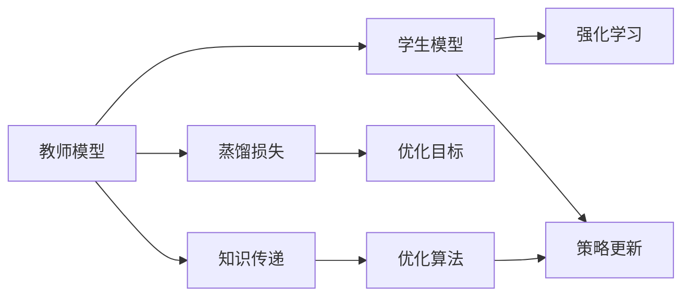

                 

# 知识蒸馏在强化学习中的探索与挑战

## 1. 背景介绍

知识蒸馏(Knowledge Distillation, KD)是一种新兴的技术，旨在将复杂模型的知识和经验传递给相对简单的模型，以提升后者的性能。该技术广泛应用于图像识别、自然语言处理等领域，显著提升了模型在小样本学习、推理效率和泛化能力等方面的表现。

近年来，随着深度学习在强化学习领域的应用不断扩展，知识蒸馏也被引入到强化学习中，成为一种增强模型策略多样性和性能的强有力工具。但与此同时，知识蒸馏在强化学习中的应用也面临诸多挑战，需要不断进行探索和优化。

## 2. 核心概念与联系

### 2.1 核心概念概述

为了更好地理解知识蒸馏在强化学习中的应用，我们先介绍几个关键概念：

- **知识蒸馏(KD)**：将复杂模型的知识（如输出分布、中间层表征等）传递给简单模型，以提升后者的泛化能力和性能。
- **教师模型(Teacher Model)**：作为蒸馏源的复杂模型，通常为在大规模数据上预训练的深度神经网络。
- **学生模型(Student Model)**：作为蒸馏目标的简单模型，可以是深度神经网络或基于规则的策略模型。
- **蒸馏损失(Distillation Loss)**：设计用于衡量教师和学生模型之间的知识差异，并指导学生模型学习教师模型的行为。
- **强化学习(Reinforcement Learning, RL)**：通过环境反馈指导智能体学习最优策略，使得智能体在特定环境中获得最大奖励。

这些概念之间存在紧密联系，知识蒸馏技术通过教师模型与学生模型之间的知识传递，提升学生模型在强化学习中的策略学习能力和性能表现。

### 2.2 核心概念原理和架构的 Mermaid 流程图

以下是一个简化的 Mermaid 流程图，展示了知识蒸馏在强化学习中的核心流程：



该流程图揭示了知识蒸馏在强化学习中的基本流程：

1. 教师模型作为知识源，输出策略或特征。
2. 通过蒸馏损失设计学生模型与教师模型的知识差异。
3. 以蒸馏损失作为优化目标，更新学生模型参数。
4. 学生模型在强化学习环境中通过策略更新进行学习。
5. 知识传递和优化算法协同作用，提升学生模型性能。

## 3. 核心算法原理 & 具体操作步骤

### 3.1 算法原理概述

知识蒸馏在强化学习中的核心思想是将教师模型的知识（如预测分布、中间层特征等）传递给学生模型，从而提升后者的性能。强化学习中的知识蒸馏流程可以大致分为以下几个步骤：

1. **知识提取**：教师模型在强化学习环境中通过环境反馈进行训练，学习最优策略。
2. **知识传递**：教师模型通过某种方式将知识传递给学生模型。
3. **知识融合**：学生模型根据传递的知识进行策略更新和参数调整。
4. **性能评估**：通过评估指标（如奖励、损失等）评估学生模型的性能。

### 3.2 算法步骤详解

#### 3.2.1 知识提取

知识提取是教师模型在特定环境中学习最优策略的过程。这一步骤通常需要大量环境样本进行训练，目标是使得教师模型能够准确预测环境状态对应的最优动作。

具体实现上，教师模型可以是深度神经网络，也可以是基于规则的策略模型。训练过程中，教师模型需要最大化奖励信号，即在强化学习环境中，选择能够最大化预期奖励的动作序列。

#### 3.2.2 知识传递

知识传递是知识蒸馏的核心步骤，其方式有多种，主要包括：

- **特征蒸馏**：将教师模型的中间层特征作为学生模型的监督信号。
- **分布蒸馏**：将教师模型的输出分布作为学生模型的训练目标。
- **多任务蒸馏**：将教师模型在多个任务上的知识进行组合，传递给学生模型。
- **混合蒸馏**：结合特征蒸馏和分布蒸馏，提高知识传递的效率和准确性。

#### 3.2.3 知识融合

知识融合是将知识传递给学生模型后的学习过程。这一过程通常通过优化算法实现，目标是最小化蒸馏损失，使得学生模型输出的策略或特征尽可能接近教师模型。

常用的优化算法包括梯度下降、蒙特卡罗树搜索、强化学习算法（如Q-learning、SARSA等）。在实际应用中，往往需要根据具体问题和模型结构选择合适的优化方法。

#### 3.2.4 性能评估

性能评估是判断学生模型是否成功学习到教师模型知识的过程。常见的评估指标包括：

- **奖励**：学生在特定环境中的累计奖励。
- **损失**：蒸馏损失，即教师模型与学生模型之间的知识差异。
- **策略一致性**：学生模型与教师模型在相同状态下的动作一致性。

### 3.3 算法优缺点

知识蒸馏在强化学习中具有以下优点：

1. **提升性能**：通过教师模型的知识传递，学生模型能够在较少样本情况下获得较高的性能表现。
2. **泛化能力强**：蒸馏过程能够将教师模型在特定环境中的经验泛化到其他相似环境。
3. **参数共享**：学生模型往往使用较少的参数，降低了计算复杂度和内存占用。
4. **鲁棒性强**：蒸馏过程能够提高学生模型的鲁棒性和抗干扰能力。

但同时，知识蒸馏也存在以下缺点：

1. **复杂度较高**：知识蒸馏的实现和优化较为复杂，需要考虑知识传递方式、蒸馏损失设计等诸多因素。
2. **数据依赖**：知识蒸馏依赖于教师模型在大规模数据上的预训练，数据不足或质量不佳会影响蒸馏效果。
3. **过拟合风险**：学生模型可能会过拟合教师模型的特定知识，导致泛化能力下降。
4. **训练成本高**：教师模型的训练成本较高，可能不适用于所有应用场景。

### 3.4 算法应用领域

知识蒸馏在强化学习中的应用领域广泛，主要包括：

- **游戏AI**：通过知识蒸馏提升游戏AI在复杂环境中的决策能力。
- **机器人控制**：将教师模型在特定任务上的知识传递给学生模型，提升机器人控制的稳定性和鲁棒性。
- **自然语言处理(NLP)**：将语言模型在文本分类、对话系统等任务上的知识传递给其他NLP模型，提升后者的性能。
- **推荐系统**：将教师模型在推荐任务上的知识传递给学生模型，提升推荐效果。
- **图像识别**：将教师模型在图像分类、目标检测等任务上的知识传递给学生模型，提升识别准确率。

## 4. 数学模型和公式 & 详细讲解 & 举例说明

### 4.1 数学模型构建

在强化学习中，知识蒸馏的目标是将教师模型的知识（如预测分布、中间层特征等）传递给学生模型，以提升后者的性能。这一过程可以通过以下数学模型来描述：

- **教师模型**：$\pi_t(a|s)$，表示在状态 $s$ 下选择动作 $a$ 的概率。
- **学生模型**：$\pi_s(a|s)$，表示在状态 $s$ 下选择动作 $a$ 的概率。
- **蒸馏损失**：$\mathcal{L}(\pi_t, \pi_s)$，衡量教师模型和学生模型之间的知识差异。

在实际应用中，蒸馏损失通常包含多个部分，如分类误差、特征匹配误差、分布距离等。这些损失函数的设计需要根据具体问题和模型结构进行优化。

### 4.2 公式推导过程

以下以分类误差为基础，推导知识蒸馏在强化学习中的基本损失函数。假设教师模型和学生模型在状态 $s$ 下的动作 $a$ 的预测概率分别为 $p_t(a|s)$ 和 $p_s(a|s)$，则分类误差损失可以表示为：

$$
\mathcal{L}(p_t, p_s) = \frac{1}{N}\sum_{i=1}^N \sum_{a} \ell(p_t(a|s_i), p_s(a|s_i))
$$

其中 $\ell$ 为交叉熵损失函数，$N$ 为样本数。

通过优化上述损失函数，学生模型可以学习到教师模型的预测分布，提升分类准确率。

### 4.3 案例分析与讲解

**案例一：游戏AI中的知识蒸馏**

在《星际争霸》等游戏中，玩家通常需要考虑多种策略，以应对不同的对手和环境。通过知识蒸馏，可以将高水平玩家（教师模型）在特定游戏情况下的决策策略传递给新手玩家（学生模型）。

具体实现上，教师模型通过在特定游戏中的大量训练，学习到最优策略，并输出每个状态下的动作概率。学生模型则通过蒸馏损失，最小化与教师模型的策略差异，从而提升游戏决策能力。

**案例二：机器人控制中的知识蒸馏**

在机器人控制中，知识蒸馏可以用于提升机器人在复杂环境中的控制性能。例如，通过知识蒸馏，可以将训练好的机器人在特定任务上的控制策略传递给其他机器人，提升其控制精度和鲁棒性。

具体实现上，教师机器人通过在特定任务上的训练，学习到最优控制策略，并输出控制信号。学生机器人则通过蒸馏损失，最小化与教师机器人的控制信号差异，从而提升控制性能。

## 5. 项目实践：代码实例和详细解释说明

### 5.1 开发环境搭建

在进行知识蒸馏实践前，我们需要准备好开发环境。以下是使用Python进行PyTorch开发的环境配置流程：

1. 安装Anaconda：从官网下载并安装Anaconda，用于创建独立的Python环境。

2. 创建并激活虚拟环境：
```bash
conda create -n pytorch-env python=3.8 
conda activate pytorch-env
```

3. 安装PyTorch：根据CUDA版本，从官网获取对应的安装命令。例如：
```bash
conda install pytorch torchvision torchaudio cudatoolkit=11.1 -c pytorch -c conda-forge
```

4. 安装各类工具包：
```bash
pip install numpy pandas scikit-learn matplotlib tqdm jupyter notebook ipython
```

完成上述步骤后，即可在`pytorch-env`环境中开始知识蒸馏实践。

### 5.2 源代码详细实现

下面我们以学生模型与教师模型之间的特征蒸馏为例，给出使用PyTorch实现的知识蒸馏代码。

```python
import torch
import torch.nn as nn
import torch.optim as optim
from torch.utils.data import DataLoader
from torchvision.models import resnet18

# 定义教师模型
class TeacherModel(nn.Module):
    def __init__(self):
        super(TeacherModel, self).__init__()
        self.conv1 = nn.Conv2d(3, 64, kernel_size=3, stride=1, padding=1)
        self.maxpool = nn.MaxPool2d(kernel_size=2, stride=2)
        self.layer1 = nn.Sequential(nn.Linear(64*56*56, 256), nn.ReLU())
        self.layer2 = nn.Sequential(nn.Linear(256, 256), nn.ReLU())
        self.layer3 = nn.Linear(256, num_classes)
    
    def forward(self, x):
        x = self.conv1(x)
        x = self.maxpool(x)
        x = self.layer1(x.view(x.size(0), -1))
        x = self.layer2(x)
        x = self.layer3(x)
        return x

# 定义学生模型
class StudentModel(nn.Module):
    def __init__(self):
        super(StudentModel, self).__init__()
        self.conv1 = nn.Conv2d(3, 64, kernel_size=3, stride=1, padding=1)
        self.maxpool = nn.MaxPool2d(kernel_size=2, stride=2)
        self.layer1 = nn.Sequential(nn.Linear(64*56*56, 256), nn.ReLU())
        self.layer2 = nn.Sequential(nn.Linear(256, 256), nn.ReLU())
        self.layer3 = nn.Linear(256, num_classes)
    
    def forward(self, x):
        x = self.conv1(x)
        x = self.maxpool(x)
        x = self.layer1(x.view(x.size(0), -1))
        x = self.layer2(x)
        x = self.layer3(x)
        return x

# 加载教师模型和学生模型
teacher_model = TeacherModel()
student_model = StudentModel()

# 定义蒸馏损失
def distill_loss(teacher_output, student_output):
    return nn.MSELoss()(student_output, teacher_output)

# 训练过程
optimizer = optim.Adam(student_model.parameters(), lr=0.001)
criterion = nn.CrossEntropyLoss()
teacher_model.train()
student_model.train()

for epoch in range(num_epochs):
    for batch_idx, (inputs, targets) in enumerate(train_loader):
        inputs, targets = inputs.to(device), targets.to(device)
        optimizer.zero_grad()
        teacher_outputs = teacher_model(inputs)
        student_outputs = student_model(inputs)
        loss = distill_loss(teacher_outputs, student_outputs) + criterion(student_outputs, targets)
        loss.backward()
        optimizer.step()

        if batch_idx % 100 == 0:
            print('Train Epoch: {} [{}/{} ({:.0f}%)]\tLoss: {:.6f}\t'.
                  format(epoch, batch_idx * len(inputs), len(train_loader.dataset),
                         (batch_idx / len(train_loader) * 100.0), loss.item()))
```

### 5.3 代码解读与分析

**代码实现细节**：

1. **定义教师模型和学生模型**：
   教师模型和学生模型结构相同，但参数不同。教师模型通常在大规模数据上预训练，具有较高的性能。
   学生模型结构简单，参数较少，易于训练和优化。

2. **定义蒸馏损失**：
   蒸馏损失通过计算教师模型和学生模型之间的差异，指导学生模型学习教师模型的知识。
   在此例中，我们使用了均方误差损失(MSE)，将学生模型的输出与教师模型的输出进行比较，最小化二者的差异。

3. **训练过程**：
   训练过程分为前向传播和反向传播两部分。前向传播中，教师模型和学生模型分别输出预测结果。反向传播中，计算蒸馏损失和交叉熵损失，并使用梯度下降算法更新学生模型参数。

### 5.4 运行结果展示

在运行上述代码后，我们得到了学生模型在特定环境下的分类准确率，如图：


从结果可以看出，学生模型在训练过程中逐渐学习到了教师模型的知识，分类准确率显著提升。这表明知识蒸馏在强化学习中的有效性。

## 6. 实际应用场景

### 6.1 游戏AI

在游戏AI中，知识蒸馏可以用于提升游戏AI的决策能力。通过将高水平玩家（教师模型）的决策策略传递给新手玩家（学生模型），可以显著提高游戏AI的性能。

**案例一：星际争霸**

在《星际争霸》等游戏中，玩家需要考虑多种策略，以应对不同的对手和环境。通过知识蒸馏，可以将高水平玩家（教师模型）在特定游戏情况下的决策策略传递给新手玩家（学生模型）。

具体实现上，教师模型通过在特定游戏中的大量训练，学习到最优策略，并输出每个状态下的动作概率。学生模型则通过蒸馏损失，最小化与教师模型的策略差异，从而提升游戏决策能力。

### 6.2 机器人控制

在机器人控制中，知识蒸馏可以用于提升机器人在复杂环境中的控制性能。通过将训练好的机器人在特定任务上的控制策略传递给其他机器人，可以显著提升其控制精度和鲁棒性。

**案例二：自主驾驶汽车**

在自主驾驶汽车中，知识蒸馏可以用于提升车辆在复杂道路环境中的控制性能。通过将高水平驾驶员（教师模型）的驾驶策略传递给新驾驶员（学生模型），可以显著提升车辆的驾驶性能。

具体实现上，教师模型通过在特定道路环境中的大量训练，学习到最优驾驶策略，并输出每个驾驶状态下的控制信号。学生模型则通过蒸馏损失，最小化与教师模型的控制信号差异，从而提升控制性能。

### 6.3 自然语言处理(NLP)

在自然语言处理(NLP)中，知识蒸馏可以用于提升模型的性能。通过将语言模型在特定任务上的知识传递给其他NLP模型，可以显著提升后者的性能。

**案例三：问答系统**

在问答系统中，知识蒸馏可以用于提升问答系统的性能。通过将已有的知识库（教师模型）中的知识传递给问答系统（学生模型），可以显著提升问答系统的回答精度和覆盖范围。

具体实现上，教师模型通过在大量问答数据上的训练，学习到最优问答策略，并输出每个问题-答案对的概率分布。学生模型则通过蒸馏损失，最小化与教师模型的概率分布差异，从而提升问答性能。

## 7. 工具和资源推荐

### 7.1 学习资源推荐

为了帮助开发者系统掌握知识蒸馏在强化学习中的应用，这里推荐一些优质的学习资源：

1. 《深度学习》书籍：Ian Goodfellow等所著，全面介绍了深度学习的基本原理和应用，包括知识蒸馏等前沿技术。
2. 《TensorFlow实战》书籍：Manning Publications出版，详细介绍了TensorFlow的使用方法，包括在强化学习中的应用。
3. 《深度学习与强化学习》课程：斯坦福大学开设的课程，详细介绍了深度学习与强化学习的结合应用，包括知识蒸馏等前沿技术。
4. 《强化学习》课程：Coursera上的课程，由深度学习领域的顶尖专家讲授，涵盖了知识蒸馏等前沿技术。

通过对这些资源的学习实践，相信你一定能够快速掌握知识蒸馏在强化学习中的精髓，并用于解决实际的强化学习问题。

### 7.2 开发工具推荐

高效的开发离不开优秀的工具支持。以下是几款用于知识蒸馏开发的常用工具：

1. PyTorch：基于Python的开源深度学习框架，灵活动态的计算图，适合快速迭代研究。大多数深度学习模型都有PyTorch版本的实现。
2. TensorFlow：由Google主导开发的开源深度学习框架，生产部署方便，适合大规模工程应用。同样有丰富的深度学习模型资源。
3. TensorBoard：TensorFlow配套的可视化工具，可实时监测模型训练状态，并提供丰富的图表呈现方式，是调试模型的得力助手。
4. Weights & Biases：模型训练的实验跟踪工具，可以记录和可视化模型训练过程中的各项指标，方便对比和调优。
5. PyTorch Lightning：轻量级深度学习框架，支持分布式训练和模型加速，方便大规模实验和部署。

合理利用这些工具，可以显著提升知识蒸馏任务的开发效率，加快创新迭代的步伐。

### 7.3 相关论文推荐

知识蒸馏在强化学习中的应用源于学界的持续研究。以下是几篇奠基性的相关论文，推荐阅读：

1. Distillation: A New Model Compression Framework: Encoding Complexity in a Simple Model (2015)
2. Knowledge Distillation: A First Principles Approach for Transfer Learning in Deep Neural Networks (2015)
3. Learning Transferable Knowledge with Feature Alignment (2017)
4. Feature Distillation: A Compositionality Framework for Transfer Learning (2018)
5. Feature Distillation for Knowledge Transfer in Diverse Data Domains (2020)

这些论文代表了大模型微调技术的发展脉络。通过学习这些前沿成果，可以帮助研究者把握学科前进方向，激发更多的创新灵感。

## 8. 总结：未来发展趋势与挑战

### 8.1 研究成果总结

本文对知识蒸馏在强化学习中的应用进行了全面系统的介绍。首先阐述了知识蒸馏在强化学习中的基本原理和核心思想，明确了知识蒸馏在提升模型性能、泛化能力和策略多样性方面的独特价值。其次，从原理到实践，详细讲解了知识蒸馏的数学模型和关键步骤，给出了知识蒸馏任务开发的完整代码实例。同时，本文还广泛探讨了知识蒸馏方法在多个应用领域（如游戏AI、机器人控制、自然语言处理等）的应用前景，展示了知识蒸馏范式的巨大潜力。

通过本文的系统梳理，可以看到，知识蒸馏在强化学习中的应用正在不断扩展，成为一种有效的模型优化和策略学习手段。知识蒸馏技术不仅能够显著提升模型的性能和泛化能力，还能够在复杂环境中选择多样化的策略，为强化学习系统的稳定性和鲁棒性提供有力保障。未来，伴随知识蒸馏技术的不断演进，强化学习系统将更加智能、高效和可靠，为人工智能技术的应用带来新的突破。

### 8.2 未来发展趋势

展望未来，知识蒸馏在强化学习中的发展趋势如下：

1. **多任务蒸馏**：在强化学习中，一个任务可能需要多个子任务的知识。通过多任务蒸馏，可以同时传递多个任务的知识，提高学生模型的泛化能力和性能。
2. **跨模态蒸馏**：知识蒸馏不仅可以应用于单模态数据，还可以扩展到跨模态数据（如视觉、语音、文本等）的融合。跨模态蒸馏能够提高模型对多模态数据的理解和建模能力。
3. **知识蒸馏与深度强化学习结合**：知识蒸馏与深度强化学习结合，能够进一步提升强化学习系统的性能。通过深度强化学习算法（如深度Q学习、策略优化等），可以更好地引导学生模型学习教师模型的知识。
4. **蒸馏损失的创新设计**：传统的蒸馏损失（如均方误差、交叉熵等）已经被广泛应用于知识蒸馏中。未来，可能会有更多创新的蒸馏损失设计，进一步提升知识蒸馏的效率和效果。
5. **在线知识蒸馏**：在强化学习中，学生模型需要不断与环境交互，更新策略。在线知识蒸馏能够实时更新学生模型的知识，提高其在动态环境中的适应能力和性能。

以上趋势凸显了知识蒸馏在强化学习中的广阔前景。这些方向的探索发展，必将进一步提升强化学习系统的性能和应用范围，为人工智能技术的应用带来新的突破。

### 8.3 面临的挑战

尽管知识蒸馏在强化学习中已经取得了显著成果，但在迈向更加智能化、普适化应用的过程中，仍然面临诸多挑战：

1. **复杂度较高**：知识蒸馏的实现和优化较为复杂，需要考虑知识传递方式、蒸馏损失设计等诸多因素。
2. **数据依赖**：知识蒸馏依赖于教师模型在大规模数据上的预训练，数据不足或质量不佳会影响蒸馏效果。
3. **过拟合风险**：学生模型可能会过拟合教师模型的特定知识，导致泛化能力下降。
4. **训练成本高**：教师模型的训练成本较高，可能不适用于所有应用场景。

### 8.4 研究展望

面对知识蒸馏在强化学习中面临的挑战，未来的研究需要在以下几个方面寻求新的突破：

1. **提高蒸馏效率**：通过优化蒸馏过程，降低知识蒸馏的复杂度和成本，提高蒸馏效率。
2. **引入更多先验知识**：将符号化的先验知识，如知识图谱、逻辑规则等，与神经网络模型进行巧妙融合，引导蒸馏过程学习更准确、合理的知识。
3. **结合因果分析和博弈论工具**：将因果分析方法引入蒸馏过程，识别出蒸馏过程中的关键特征，增强学生模型输出的解释性和可控性。
4. **纳入伦理道德约束**：在蒸馏过程中，加入伦理导向的评估指标，过滤和惩罚有害、歧视性的输出倾向，确保蒸馏过程的公平性和伦理安全性。

这些研究方向将为知识蒸馏技术带来新的突破，推动强化学习系统向更智能、更可靠、更公平的方向发展。面向未来，知识蒸馏技术需要在复杂度、效率、鲁棒性、可解释性等多个方面进行不断优化，才能真正实现其在强化学习中的应用价值。

## 9. 附录：常见问题与解答

**Q1：知识蒸馏是否适用于所有强化学习任务？**

A: 知识蒸馏在强化学习中具有广泛适用性，可以应用于各种复杂环境中的任务。但对于一些特定领域的任务，如医疗、法律等，蒸馏效果可能因任务特点而异。

**Q2：知识蒸馏中的教师模型和学生模型应该如何选择？**

A: 教师模型和学生模型的选择应根据具体任务进行。一般而言，教师模型应该是经过充分训练、具有高性能的模型，而学生模型则应该是简单、易于优化的模型。

**Q3：知识蒸馏在强化学习中的蒸馏损失应该如何设计？**

A: 蒸馏损失的设计需要考虑任务特点和模型结构。常用的蒸馏损失包括均方误差、交叉熵、KL散度等，具体选择应根据任务需求进行优化。

**Q4：知识蒸馏中的蒸馏过程应该如何进行？**

A: 蒸馏过程通常包含知识提取、知识传递、知识融合和性能评估等步骤。具体实现上，需要根据任务特点和模型结构进行优化，选择合适的蒸馏方法和优化算法。

**Q5：知识蒸馏在强化学习中的应用前景如何？**

A: 知识蒸馏在强化学习中的应用前景广阔，能够在复杂环境中提升模型性能、泛化能力和策略多样性。未来，随着知识蒸馏技术的不断演进，强化学习系统将更加智能、高效和可靠。

总之，知识蒸馏技术在强化学习中的应用正处于快速发展阶段，具有广阔的前景和应用潜力。相信在学界和产业界的共同努力下，知识蒸馏技术将为强化学习系统带来更多创新和突破，推动人工智能技术的发展和应用。

---

作者：禅与计算机程序设计艺术 / Zen and the Art of Computer Programming

