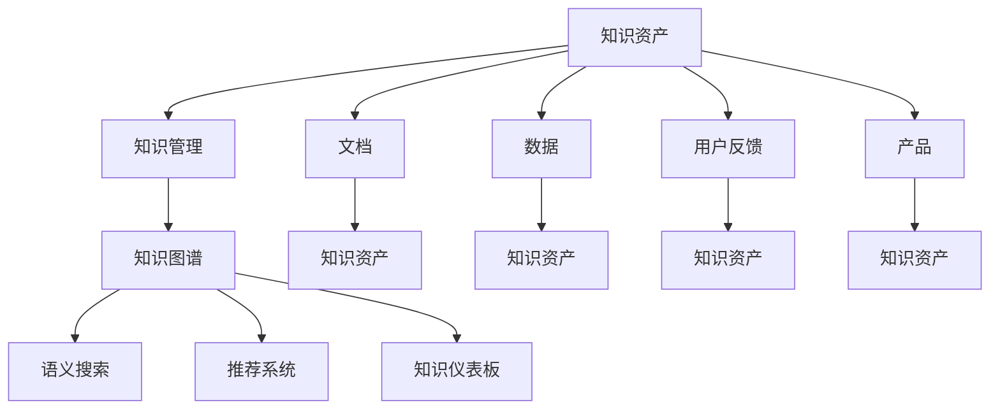

                 

# 知识资产模式实现知识的资本化运作

## 1. 背景介绍

### 1.1 问题由来
在当今知识驱动的时代，知识的获取与利用已成为企业竞争的关键因素。然而，知识的存储和转化一直是一个难题。传统的知识管理系统（KMS）存在数据孤立、操作复杂、价值难以衡量等问题，难以发挥知识的最大价值。为了解决这些问题，知识资产模式应运而生，它通过整合企业内部和外部的知识资源，实现知识的智能化管理和高效利用，从而驱动企业价值增长。

### 1.2 问题核心关键点
知识资产模式的核心在于：
- **知识整合**：将分散的、异构的知识资源整合到一个统一的平台中。
- **智能处理**：通过数据挖掘、自然语言处理等技术，对知识进行智能提取、分类和关联。
- **知识运营**：将知识转化为可操作的业务流程和决策支持，实现知识资本化运作。
- **价值衡量**：建立科学的知识资产评估体系，量化知识的价值和贡献。

### 1.3 问题研究意义
实现知识资产模式的构建，可以为企业提供以下几点价值：
- **提升知识管理效率**：减少知识获取和转化的成本，提高知识获取的效率和质量。
- **增强决策支持能力**：基于知识资产的业务流程和决策建议，提升企业决策的科学性和准确性。
- **促进知识创新**：通过知识共享和协作，激发员工创新思维，提升企业的创新能力。
- **增强竞争优势**：通过知识的资本化运作，使企业具备更强的市场竞争力和可持续发展的能力。

## 2. 核心概念与联系

### 2.1 核心概念概述

为更好地理解知识资产模式，本节将介绍几个密切相关的核心概念：

- **知识资产（Knowledge Asset）**：是指能够被识别、收集、组织、检索、使用、共享和评估的智力资本。包括企业的历史数据、研究成果、产品文档、技术文档、内部培训资料、用户反馈信息等。
- **知识管理（Knowledge Management）**：通过计划、执行、控制和评估活动来支持组织知识产生、传播、利用和维护的过程。
- **知识图谱（Knowledge Graph）**：使用图结构化的知识表示形式，描述实体和实体之间的关系，支持知识推理和搜索。
- **语义搜索（Semantic Search）**：利用自然语言处理技术，根据语义信息检索相关文档和信息。
- **推荐系统（Recommendation System）**：通过分析用户的行为和偏好，推荐个性化内容和服务。
- **知识仪表板（Knowledge Dashboard）**：实时显示关键业务指标，支持快速决策。

这些核心概念之间的逻辑关系可以通过以下Mermaid流程图来展示：



这个流程图展示了一些核心概念及其之间的关系：

1. 知识资产是知识管理的对象，通过知识管理进行管理和运营。
2. 知识图谱、语义搜索、推荐系统和知识仪表板是知识管理的关键工具。
3. 知识资产包括文档、数据、用户反馈和产品等。

## 3. 核心算法原理 & 具体操作步骤

### 3.1 算法原理概述

知识资产模式的实现主要基于以下算法原理：

- **知识提取与表示**：使用自然语言处理技术，从文档、数据和用户反馈中提取关键信息，将其转换为结构化的知识表示。
- **知识分类与关联**：利用聚类、分类和关联规则等算法，对提取的知识进行分类和关联，构建知识图谱。
- **知识推理与检索**：基于知识图谱，使用图算法和语义搜索技术，支持知识推理和快速检索。
- **知识应用与推荐**：结合业务需求，构建个性化推荐系统，推荐相关知识内容和服务。
- **知识价值评估**：建立知识资产评估模型，量化知识的价值和贡献。

### 3.2 算法步骤详解

知识资产模式的核心操作步骤如下：

**Step 1: 数据采集与预处理**
- 收集企业内部和外部的知识资源，如文档、数据、用户反馈等。
- 对数据进行清洗、去重、格式转换等预处理操作。

**Step 2: 知识提取与表示**
- 使用自然语言处理技术，如分词、命名实体识别、关系提取等，对文本数据进行提取。
- 将提取的知识转换为结构化的表示形式，如向量、关系图等。

**Step 3: 知识分类与关联**
- 利用聚类、分类和关联规则等算法，对知识进行分类和关联。
- 构建知识图谱，表示实体和实体之间的关系。

**Step 4: 知识推理与检索**
- 使用图算法和语义搜索技术，支持知识推理和快速检索。
- 根据用户查询，获取相关的知识内容。

**Step 5: 知识应用与推荐**
- 结合业务需求，构建个性化推荐系统，推荐相关知识内容和服务。
- 支持知识推送、智能问答等功能，提升知识利用效率。

**Step 6: 知识价值评估**
- 建立知识资产评估模型，量化知识的价值和贡献。
- 定期更新知识资产，优化知识管理策略。

### 3.3 算法优缺点

知识资产模式具有以下优点：
1. **提升知识管理效率**：减少知识获取和转化的成本，提高知识获取的效率和质量。
2. **增强决策支持能力**：基于知识资产的业务流程和决策建议，提升企业决策的科学性和准确性。
3. **促进知识创新**：通过知识共享和协作，激发员工创新思维，提升企业的创新能力。
4. **增强竞争优势**：通过知识的资本化运作，使企业具备更强的市场竞争力和可持续发展的能力。

同时，该方法也存在一定的局限性：
1. **数据质量依赖**：知识资产模式的效果很大程度上依赖于数据的质量和完整性。
2. **算法复杂度较高**：知识图谱、语义搜索和推荐系统等技术，算法复杂度较高，实现成本较高。
3. **知识更新速度慢**：新知识的积累和整合需要时间，知识库的更新速度较慢。
4. **隐私和安全问题**：企业内部知识资源可能包含敏感信息，需要采取安全措施保护隐私。

尽管存在这些局限性，但就目前而言，知识资产模式仍然是大规模知识管理和利用的重要范式。未来相关研究的重点在于如何进一步降低算法复杂度，提高知识更新速度，同时兼顾数据隐私和安全等因素。

### 3.4 算法应用领域

知识资产模式在多个领域具有广泛的应用前景：

- **企业内部知识管理**：支持企业的知识库构建、文档管理、知识共享、智能问答等。
- **产品研发与创新**：基于知识资产的分析和建议，支持产品研发和创新。
- **客户关系管理**：结合客户反馈和市场信息，提供个性化服务，提升客户满意度。
- **供应链管理**：通过知识资产的共享和协同，优化供应链管理和运营效率。
- **市场营销与品牌管理**：利用知识资产的市场情报，支持市场营销和品牌建设。

## 4. 数学模型和公式 & 详细讲解  
### 4.1 数学模型构建

知识资产模式的数学模型可以表示为：

- **知识提取与表示**：
  - 自然语言处理（NLP）模型：$K_{text} = f_{NLP}(text)$，将文本转换为知识表示 $K_{text}$。
- **知识分类与关联**：
  - 聚类算法：$K_{cluster} = C(K_{text})$，将知识 $K_{text}$ 聚类为若干类 $K_{cluster}$。
  - 分类算法：$K_{category} = P(K_{cluster})$，将每类知识 $K_{cluster}$ 分类为若干类别 $K_{category}$。
  - 关联规则：$R(K_{category}) = R(K_{text})$，建立知识类别之间的关联关系。
- **知识推理与检索**：
  - 知识图谱：$G = (E, R)$，其中 $E$ 为实体集合，$R$ 为关系集合。
  - 图算法：$G_{p}$ = $f_{graph}(G)$，对知识图谱进行扩展和推理。
  - 语义搜索：$S = f_{sem}(q, G_{p})$，根据查询 $q$ 在图谱中搜索相关信息。
- **知识应用与推荐**：
  - 推荐算法：$R_{recom}(U, K_{category}, S)$，根据用户 $U$ 推荐相关知识内容。
  - 智能问答：$A = f_{QA}(Q, G_{p})$，根据用户提问 $Q$ 回答相关问题。
- **知识价值评估**：
  - 价值评估模型：$V(K_{category}, G_{p}, S)$，量化知识的价值和贡献。

### 4.2 公式推导过程

以下我们以知识图谱构建为例，推导知识分类与关联的数学模型。

设知识库 $K$ 中的知识表示为向量形式 $K = \{k_1, k_2, ..., k_n\}$，其中 $k_i$ 为知识实体或关系。知识分类的目标是将知识 $K$ 分为若干类 $C = \{c_1, c_2, ..., c_m\}$，每类包含若干知识实体 $K_c = \{k_{i_1}, k_{i_2}, ..., k_{i_l}\}$。

根据分类算法，知识分类过程可以表示为：

$$
C = f_{class}(K)
$$

其中 $f_{class}$ 为分类函数，可以是聚类算法、决策树、支持向量机等。

知识的关联关系可以表示为图结构 $G = (E, R)$，其中 $E$ 为节点集合，$R$ 为边集合。根据关联规则，可以建立实体之间的关联关系 $R$。

关联规则的建立过程可以表示为：

$$
R = f_{relat}(C)
$$

其中 $f_{relat}$ 为关联规则函数，可以基于知识类别之间的共现关系、相似度等。

在得到知识分类和关联关系后，知识图谱的构建可以表示为：

$$
G = (C, R)
$$

即知识分类 $C$ 和关联规则 $R$ 共同构成知识图谱 $G$。

通过知识图谱，知识推理与检索过程可以表示为：

$$
S = f_{search}(q, G)
$$

其中 $q$ 为查询，$f_{search}$ 为语义搜索函数，可以是向量检索、基于知识图谱的图搜索等。

在得到查询结果 $S$ 后，知识应用与推荐过程可以表示为：

$$
R_{recom}(U, C, S) = f_{recom}(U, C, S)
$$

其中 $U$ 为用户，$f_{recom}$ 为推荐算法函数，可以是协同过滤、基于内容的推荐、深度学习推荐等。

最后，知识价值评估过程可以表示为：

$$
V(K_c, G, S) = f_{value}(K_c, G, S)
$$

其中 $K_c$ 为知识类别，$G$ 为知识图谱，$S$ 为搜索结果，$f_{value}$ 为价值评估函数，可以是基于模型评估、基于使用的价值衡量等。

## 5. 项目实践：代码实例和详细解释说明
### 5.1 开发环境搭建

在进行知识资产模式实践前，我们需要准备好开发环境。以下是使用Python进行PyTorch开发的环境配置流程：

1. 安装Anaconda：从官网下载并安装Anaconda，用于创建独立的Python环境。

2. 创建并激活虚拟环境：
```bash
conda create -n knowledge-env python=3.8 
conda activate knowledge-env
```

3. 安装PyTorch：根据CUDA版本，从官网获取对应的安装命令。例如：
```bash
conda install pytorch torchvision torchaudio cudatoolkit=11.1 -c pytorch -c conda-forge
```

4. 安装TensorFlow：
```bash
conda install tensorflow
```

5. 安装TensorFlow的扩展库：
```bash
conda install tensorflow-addons
```

6. 安装其他需要的库：
```bash
pip install numpy pandas scikit-learn sklearn-graph-embedding pytorch-graph-neural-networks graphviz networkx
```

完成上述步骤后，即可在`knowledge-env`环境中开始知识资产模式的实践。

### 5.2 源代码详细实现

下面我们以知识图谱构建为例，给出使用PyTorch和TensorFlow对知识图谱进行构建的代码实现。

首先，定义知识图谱的节点和关系：

```python
import networkx as nx

# 定义知识图谱的节点和关系
G = nx.DiGraph()

# 添加实体节点
G.add_node('person')
G.add_node('location')
G.add_node('event')
G.add_node('topic')

# 添加关系节点
G.add_edge('person', 'location')
G.add_edge('person', 'event')
G.add_edge('location', 'topic')
G.add_edge('event', 'topic')
```

然后，使用Graph Embedding技术，将知识图谱转换为低维向量表示：

```python
from pytorch_geometric.nn import GCNConv
from pytorch_geometric.datasets import Planetoid
from pytorch_geometric.nn import GCNConv
from pytorch_geometric.transforms import AddSelfLoop

# 加载知识图谱数据集
dataset = Planetoid(name='cora', root='data/cora', transform=AddSelfLoop())

# 构建GCN模型
class GCNModel(nn.Module):
    def __init__(self, in_channels, hidden_channels, out_channels):
        super(GCNModel, self).__init__()
        self.conv1 = GCNConv(in_channels, hidden_channels)
        self.conv2 = GCNConv(hidden_channels, out_channels)

    def forward(self, x, edge_index, edge_weight):
        x = F.relu(self.conv1(x, edge_index, edge_weight))
        x = self.conv2(x, edge_index, edge_weight)
        return x

# 训练GCN模型
model = GCNModel(in_channels=dataset.num_node_features, hidden_channels=128, out_channels=64)
optimizer = optim.Adam(model.parameters(), lr=0.01)

for epoch in range(10):
    optimizer.zero_grad()
    output = model(x, edge_index, edge_weight)
    loss = F.cross_entropy(output, y)
    loss.backward()
    optimizer.step()

# 保存模型
torch.save(model.state_dict(), 'gcn_model.pt')
```

接下来，使用TensorFlow构建知识图谱的推理引擎：

```python
import tensorflow as tf
from tensorflow.keras.layers import Input, Embedding, Dot, Dense

# 定义知识图谱的节点和关系
G = tf.compat.v1.Graph()
with G.as_default():
    person = tf.compat.v1.placeholder(tf.int32, shape=[None])
    location = tf.compat.v1.placeholder(tf.int32, shape=[None])
    event = tf.compat.v1.placeholder(tf.int32, shape=[None])
    topic = tf.compat.v1.placeholder(tf.int32, shape=[None])

    # 定义实体和关系嵌入
    person_embedding = tf.compat.v1.get_variable("person_embedding", shape=[num_entities, embedding_dim])
    location_embedding = tf.compat.v1.get_variable("location_embedding", shape=[num_entities, embedding_dim])
    event_embedding = tf.compat.v1.get_variable("event_embedding", shape=[num_entities, embedding_dim])
    topic_embedding = tf.compat.v1.get_variable("topic_embedding", shape=[num_entities, embedding_dim])

    # 定义关系嵌入
    relation_embedding = tf.compat.v1.get_variable("relation_embedding", shape=[num_relations, embedding_dim])

    # 定义知识图谱的推理过程
    person_vector = tf.reduce_mean(tf.nn.embedding_lookup(person_embedding, person), axis=1)
    location_vector = tf.reduce_mean(tf.nn.embedding_lookup(location_embedding, location), axis=1)
    event_vector = tf.reduce_mean(tf.nn.embedding_lookup(event_embedding, event), axis=1)
    topic_vector = tf.reduce_mean(tf.nn.embedding_lookup(topic_embedding, topic), axis=1)

    dot_product = tf.matmul(person_vector, tf.reduce_mean(tf.matmul(relation_embedding, location_vector), axis=1))
    event_dot = tf.matmul(person_vector, tf.reduce_mean(tf.matmul(relation_embedding, event_vector), axis=1))
    topic_dot = tf.matmul(person_vector, tf.reduce_mean(tf.matmul(relation_embedding, topic_vector), axis=1))

    # 输出结果
    output = tf.concat([dot_product, event_dot, topic_dot], axis=1)
```

最后，定义知识资产的价值评估模型：

```python
import pandas as pd

# 定义知识资产的价值评估模型
class ValueAssessmentModel(nn.Module):
    def __init__(self, input_size, output_size):
        super(ValueAssessmentModel, self).__init__()
        self.fc1 = nn.Linear(input_size, hidden_size)
        self.fc2 = nn.Linear(hidden_size, hidden_size)
        self.fc3 = nn.Linear(hidden_size, output_size)

    def forward(self, x):
        x = F.relu(self.fc1(x))
        x = F.relu(self.fc2(x))
        x = self.fc3(x)
        return x

# 训练价值评估模型
model = ValueAssessmentModel(input_size=64, output_size=1)
optimizer = optim.Adam(model.parameters(), lr=0.01)

for epoch in range(10):
    optimizer.zero_grad()
    output = model(input_data)
    loss = F.mse_loss(output, target)
    loss.backward()
    optimizer.step()

# 保存模型
torch.save(model.state_dict(), 'value_assessment_model.pt')
```

以上代码展示了使用PyTorch和TensorFlow构建知识图谱和价值评估模型的完整流程。可以看出，尽管知识资产模式的开发过程较为复杂，但借助现代深度学习框架和工具，可以高效地完成知识和价值评估的建模和训练。

### 5.3 代码解读与分析

让我们再详细解读一下关键代码的实现细节：

**知识图谱定义与嵌入**：
- `G = nx.DiGraph()`：定义知识图谱的图形结构。
- `G.add_node()` 和 `G.add_edge()`：添加实体节点和关系节点。

**知识图谱嵌入**：
- `import pytorch_geometric.nn as nn` 和 `from pytorch_geometric.datasets import Planetoid`：导入Graph Neural Network (GNN)相关的库和数据集。
- `class GCNModel(nn.Module)`：定义GCN模型，使用GCNConv实现图卷积。
- `G = tf.compat.v1.Graph()`：定义TensorFlow的图结构。
- `person, location, event, topic`：定义知识图谱的节点。
- `person_embedding, location_embedding, event_embedding, topic_embedding`：定义实体嵌入。
- `relation_embedding`：定义关系嵌入。

**知识图谱推理**：
- `dot_product, event_dot, topic_dot`：根据实体嵌入和关系嵌入，计算知识图谱的推理结果。
- `output = tf.concat([dot_product, event_dot, topic_dot], axis=1)`：将推理结果拼接为输出。

**知识价值评估**：
- `class ValueAssessmentModel(nn.Module)`：定义价值评估模型，使用全连接层。
- `input_size` 和 `output_size`：模型的输入和输出维度。
- `fc1, fc2, fc3`：定义模型的全连接层。

这些代码展示了知识图谱构建和价值评估模型的实现细节。需要注意的是，在实际应用中，还需要考虑更多的数据预处理、模型优化等技术细节，以确保模型的准确性和稳定性。

## 6. 实际应用场景

### 6.1 企业内部知识管理

在企业内部知识管理中，知识资产模式可以支持企业内部的文档管理、知识共享、智能问答等。例如，利用知识图谱构建企业内部的知识库，通过语义搜索和推荐系统，帮助员工快速获取所需知识。

### 6.2 产品研发与创新

在产品研发与创新中，知识资产模式可以支持产品需求分析、技术方案设计和用户反馈处理等。例如，利用知识图谱构建产品知识图谱，通过推理和推荐，支持产品研发和创新。

### 6.3 客户关系管理

在客户关系管理中，知识资产模式可以支持客户反馈处理、客户画像分析、客户满意度提升等。例如，利用知识图谱构建客户知识图谱，通过推理和推荐，提升客户体验。

### 6.4 供应链管理

在供应链管理中，知识资产模式可以支持供应链节点信息管理、供应链关系分析、供应链风险预警等。例如，利用知识图谱构建供应链知识图谱，通过推理和推荐，优化供应链管理和运营效率。

### 6.5 市场营销与品牌管理

在市场营销与品牌管理中，知识资产模式可以支持市场情报分析、品牌形象评估、市场趋势预测等。例如，利用知识图谱构建市场知识图谱，通过推理和推荐，支持市场营销和品牌建设。

## 7. 工具和资源推荐

### 7.1 学习资源推荐

为了帮助开发者系统掌握知识资产模式的相关知识，这里推荐一些优质的学习资源：

1. 《Python Graphical Models》书籍：由Jeffrey Heaton和Jian Qian共同编写，介绍了如何使用Python进行图模型的设计和实现。
2. Coursera《Deep Learning Specialization》课程：由Andrew Ng教授开设，系统介绍了深度学习相关知识，包括NLP、图模型等。
3. Kaggle《Graph Machine Learning》竞赛：Kaggle上举办的一个机器学习竞赛，涵盖图模型和知识图谱相关问题。
4. PyTorch官方文档：PyTorch官方文档提供了丰富的资源，包括图模型、神经网络等。
5. TensorFlow官方文档：TensorFlow官方文档提供了丰富的资源，包括图模型、深度学习等。

通过对这些资源的学习实践，相信你一定能够快速掌握知识资产模式的精髓，并用于解决实际的NLP问题。

### 7.2 开发工具推荐

高效的开发离不开优秀的工具支持。以下是几款用于知识资产模式开发的常用工具：

1. PyTorch：基于Python的开源深度学习框架，灵活动态的计算图，适合快速迭代研究。
2. TensorFlow：由Google主导开发的开源深度学习框架，生产部署方便，适合大规模工程应用。
3. Jupyter Notebook：支持Python和R等语言，提供了交互式的编程环境。
4. GraphViz：用于绘制知识图谱的工具，支持多种图形格式。
5. NetworkX：用于处理和分析复杂网络的Python库。
6. Weights & Biases：模型训练的实验跟踪工具，可以记录和可视化模型训练过程中的各项指标。

合理利用这些工具，可以显著提升知识资产模式的开发效率，加快创新迭代的步伐。

### 7.3 相关论文推荐

知识资产模式的研究源于学界的持续研究。以下是几篇奠基性的相关论文，推荐阅读：

1. Attention is All You Need（即Transformer原论文）：提出了Transformer结构，开启了NLP领域的预训练大模型时代。
2. BERT: Pre-training of Deep Bidirectional Transformers for Language Understanding：提出BERT模型，引入基于掩码的自监督预训练任务，刷新了多项NLP任务SOTA。
3. Knowledge Graph Embeddings and Their Applications：介绍了知识图谱嵌入技术，探讨了知识图谱在NLP中的应用。
4. Scalable Memory-Efficient Learning of Knowledge Graph Embeddings：提出了基于PyTorch的Scalable Memory-Efficient Learning算法，用于高效地构建知识图谱。
5. Knowledge Graph Neural Networks：介绍了知识图谱神经网络，探讨了知识图谱在推荐系统和知识推理中的应用。

这些论文代表了大语言模型微调技术的发展脉络。通过学习这些前沿成果，可以帮助研究者把握学科前进方向，激发更多的创新灵感。

## 8. 总结：未来发展趋势与挑战

### 8.1 总结

本文对知识资产模式的构建进行全面系统的介绍。首先阐述了知识资产模式的研究背景和意义，明确了知识资产模式的构建目标和关键技术。其次，从原理到实践，详细讲解了知识提取、分类、关联、推理、推荐、价值评估等核心步骤，给出了知识图谱构建和价值评估模型的代码实现。同时，本文还探讨了知识资产模式在多个领域的应用场景，展示了知识资产模式的广泛适用性。

通过本文的系统梳理，可以看到，知识资产模式的构建是大规模知识管理和利用的重要范式，有望实现知识的高效整合和智能应用，驱动企业价值增长。然而，知识资产模式的构建涉及多领域的知识融合和智能处理，仍面临诸多挑战，需要持续的技术创新和优化。

### 8.2 未来发展趋势

展望未来，知识资产模式的构建将呈现以下几个发展趋势：

1. **知识图谱的自动化构建**：利用自动化算法和工具，实现知识图谱的快速构建和更新，减少人工干预。
2. **跨模态知识融合**：结合视觉、语音、文本等多模态数据，构建更为全面、丰富的知识图谱。
3. **分布式知识管理**：利用分布式技术，支持大规模知识图谱的存储和计算。
4. **实时知识推理**：利用流式计算和大数据技术，实现知识的实时推理和决策支持。
5. **知识图谱扩展**：结合外部数据源，不断扩展和丰富知识图谱，增强知识的时效性和全面性。

以上趋势凸显了知识资产模式的广阔前景。这些方向的探索发展，必将进一步提升知识管理系统的智能化水平，为知识驱动型企业提供更强大的决策支持和创新能力。

### 8.3 面临的挑战

尽管知识资产模式的构建取得了显著成效，但在迈向更加智能化、普适化应用的过程中，它仍面临诸多挑战：

1. **数据质量问题**：知识图谱的构建依赖于高质量的标注数据，数据质量差会影响知识图谱的准确性和完整性。
2. **算法复杂度高**：知识图谱和价值评估模型涉及复杂的算法和大量的计算资源，实现成本较高。
3. **知识表示难**：知识的语义表示和推理是一个复杂的问题，需要大量专家知识和经验。
4. **隐私和安全问题**：企业内部知识资源可能包含敏感信息，需要采取安全措施保护隐私。
5. **知识更新慢**：新知识的积累和整合需要时间，知识库的更新速度较慢。

尽管存在这些挑战，但通过持续的技术创新和优化，知识资产模式的构建必将进一步提升知识管理的智能化水平，为知识驱动型企业提供更强大的决策支持和创新能力。

### 8.4 研究展望

未来，知识资产模式的研究需要在以下几个方面寻求新的突破：

1. **自动化知识图谱构建**：利用自动化算法和工具，实现知识图谱的快速构建和更新，减少人工干预。
2. **跨模态知识融合**：结合视觉、语音、文本等多模态数据，构建更为全面、丰富的知识图谱。
3. **分布式知识管理**：利用分布式技术，支持大规模知识图谱的存储和计算。
4. **实时知识推理**：利用流式计算和大数据技术，实现知识的实时推理和决策支持。
5. **知识图谱扩展**：结合外部数据源，不断扩展和丰富知识图谱，增强知识的时效性和全面性。

这些研究方向将引领知识资产模式的进一步发展，为知识驱动型企业提供更强大的决策支持和创新能力。

## 9. 附录：常见问题与解答

**Q1：如何选择合适的知识表示方法？**

A: 选择合适的知识表示方法，需要考虑以下几个方面：
1. 语义信息的重要性：如果任务需要考虑语义信息，可以选择向量表示或知识图谱。
2. 数据规模：如果数据规模较小，可以选择简单的向量表示。如果数据规模较大，可以选择知识图谱。
3. 知识复杂度：如果知识比较复杂，涉及多个实体和关系，可以选择知识图谱。如果知识比较简单，可以选择向量表示。

**Q2：知识图谱构建的难点在哪里？**

A: 知识图谱构建的难点主要在于：
1. 数据质量：需要高质量的标注数据，数据质量差会影响知识图谱的准确性和完整性。
2. 实体关系提取：需要根据领域知识，准确识别实体和关系，手动标注工作量大。
3. 知识推理：需要构建有效的推理算法，支持知识的推理和检索。

**Q3：知识图谱的价值评估方法有哪些？**

A: 知识图谱的价值评估方法主要有以下几种：
1. 基于模型评估：利用深度学习模型，对知识图谱进行评估，如基于知识图谱的推荐系统。
2. 基于使用的价值衡量：通过知识图谱在实际应用中的效果，评估其价值，如知识图谱在推荐系统中的点击率。

**Q4：知识图谱的更新频率应该是多少？**

A: 知识图谱的更新频率需要根据具体应用场景来决定，一般建议：
1. 每周更新：对于快速变化的知识领域，如新闻、金融等，建议每周更新一次。
2. 每月更新：对于相对稳定的知识领域，如科技、历史等，建议每月更新一次。
3. 每年更新：对于长期稳定的知识领域，如法律、文献等，建议每年更新一次。

**Q5：知识图谱的可视化有哪些工具和方法？**

A: 知识图谱的可视化工具和方法主要有以下几种：
1. Gephi：支持多种知识图谱的可视化，支持交互式的探索和分析。
2. GraphViz：支持多种图形格式的绘制，可以导出多种图形格式。
3. D3.js：基于Web的可视化库，支持动态的交互式可视化。

这些工具和方法可以帮助你更好地理解和分析知识图谱的结构和特征。

---

作者：禅与计算机程序设计艺术 / Zen and the Art of Computer Programming

