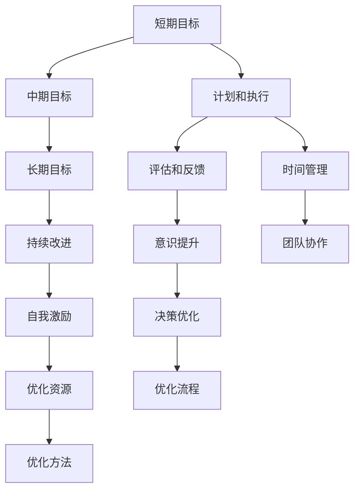

                 

# 短期目标与长期目标的意识管理

> 关键词：目标管理,意识提升,时间管理,自我激励,团队协作,决策优化,持续改进

## 1. 背景介绍

在现代社会，工作和生活中充斥着各种目标，从短期的项目截止、日常任务到长期的职业发展、个人成长，目标管理已成为成功和高效的关键。然而，在面对众多目标时，如何保持清晰的思维、高效地分配资源、持续激发自我动力，是每个人都面临的挑战。本文将从目标管理的角度出发，探讨如何有效管理短期目标与长期目标，提升意识水平，从而更好地实现个人和团队的共同目标。

## 2. 核心概念与联系

### 2.1 核心概念概述

为更好地理解目标管理的基本原理和实践方法，本节将介绍几个关键概念及其相互关系：

- **目标管理(Goal Management)**：是一种系统化的方法，通过设定明确的目标，计划和执行行动，评估结果并进行调整，以达到预期结果的过程。
- **短期目标(Short-Term Goals)**：在较短的时间内（通常几周到几个月）要完成的目标，如项目截止日期、日常任务完成等。
- **长期目标(Long-Term Goals)**：在较长的期限内（通常数月至数年甚至更长）要实现的目标，如职业发展、个人技能提升等。
- **时间管理(Time Management)**：通过规划、组织和控制时间，以高效完成任务和实现目标的能力。
- **意识提升(Awareness Enhancement)**：提高对自我和他人的意识水平，增强决策能力和情感管理。
- **自我激励(Self-Motivation)**：通过内在的激励机制，激发个人动力，保持持续努力。
- **团队协作(Team Collaboration)**：通过有效的沟通和协调，使团队成员共同努力，实现共同目标。
- **决策优化(Decision Optimization)**：通过科学的决策流程和方法，提升决策的准确性和效率。
- **持续改进(Continuous Improvement)**：通过不断反思和调整，实现目标的不断优化和提升。

这些概念之间存在着紧密的联系和相互作用，构成了目标管理的整体框架。通过理解这些概念，我们可以更好地掌握目标管理的精髓，制定和执行有效策略。

### 2.2 核心概念原理和架构的 Mermaid 流程图



此图展示了短期、中期和长期目标之间的联系，以及如何通过计划、执行、评估、改进、时间管理、意识提升、自我激励、团队协作、决策优化和资源优化等多个环节实现目标的动态管理。

## 3. 核心算法原理 & 具体操作步骤

### 3.1 算法原理概述

目标管理的核心算法原理主要围绕SMART原则（Specific, Measurable, Achievable, Relevant, Time-bound），即目标应具有明确性、可测量性、可达性、相关性和时限性。在短期目标与长期目标的管理中，我们需要通过这一原则来设定和调整目标，并确保目标的实现。

### 3.2 算法步骤详解

#### 3.2.1 目标设定
1. **明确短期目标**：根据项目截止、日常任务完成等，设定具体、可量化的短期目标。
2. **明确长期目标**：根据职业发展、技能提升等，设定具体、可量化的长期目标。
3. **分解目标**：将长期目标分解为中期目标，中期目标再分解为短期目标，形成一个明确的目标层次结构。

#### 3.2.2 计划与执行
1. **制定详细计划**：为每个短期目标和中期目标制定详细的行动计划，包括时间安排、资源配置、任务分解等。
2. **执行计划**：按照计划执行，确保每个短期目标和中期目标按时完成。

#### 3.2.3 评估与反馈
1. **定期评估**：定期检查目标的进展情况，评估是否按计划执行，并识别可能的障碍和改进点。
2. **反馈调整**：根据评估结果，及时调整计划和资源配置，确保目标的实现。

#### 3.2.4 持续改进
1. **反思总结**：在目标实现后，反思总结整个过程，识别成功的因素和需要改进的地方。
2. **持续优化**：基于反思总结，持续改进目标设定、计划执行、评估反馈等环节，不断优化目标管理过程。

### 3.3 算法优缺点

**优点**：
- **系统化管理**：通过明确的目标设定和系统的执行流程，确保目标的实现。
- **灵活调整**：通过持续的评估和反馈，能够及时调整计划，应对变化。
- **提高效率**：通过科学的时间管理、资源优化和团队协作，提高目标实现的效率。

**缺点**：
- **复杂度较高**：目标分解和计划制定的过程相对复杂，需要一定的管理能力。
- **资源消耗**：系统化的目标管理需要投入较多资源，包括时间和人力。
- **可能过度规划**：在规划和执行过程中，可能过于理想化，导致实际执行困难。

### 3.4 算法应用领域

目标管理方法广泛应用于企业项目管理、个人时间管理、团队协作、自我发展等多个领域。

- **企业项目管理**：在项目管理中，通过目标管理确保项目按时按质完成。
- **个人时间管理**：通过设定每日、每周、每月的小目标，提高个人效率。
- **团队协作**：通过明确的目标和计划，增强团队成员之间的协作和沟通。
- **自我发展**：通过设定职业发展和技能提升的长期目标，持续自我提升。

## 4. 数学模型和公式 & 详细讲解 & 举例说明

### 4.1 数学模型构建

目标管理的数学模型可以通过以下几个变量来构建：
- **T**：目标的时间节点。
- **G**：目标的值或量度。
- **A**：目标的可接受性。
- **R**：目标的相关性。
- **S**：目标的具体性。

目标的评估公式可以表示为：

$$
E(G, T) = \frac{G - A}{T} \times R + S
$$

其中，$E$ 为目标的期望值，$A$ 为可接受度，$R$ 为相关性，$S$ 为具体性。

### 4.2 公式推导过程

在推导目标评估公式时，我们考虑了目标的可接受度、相关性和具体性三个关键维度。具体推导如下：

1. **可接受度**：目标应具有可实现性，因此设定一个可接受度$A$，反映目标的难易程度。
2. **相关性**：目标应与整体战略和任务相关，设定相关性$R$，反映目标的重要性和价值。
3. **具体性**：目标应明确具体，设定具体性$S$，反映目标的可操作性和清晰度。

将这些维度综合考虑，得到目标的期望值$E$，公式推导如上。

### 4.3 案例分析与讲解

假设某公司希望在三个月内提升销售额10%，设定以下目标：

- **T**：三个月后，即第3个月末。
- **G**：销售额提升10%，即$G = 100 \times 10\% = 10$。
- **A**：目标可实现，设定$A = 8$。
- **R**：目标与公司战略相关，设定$R = 0.8$。
- **S**：目标具体明确，设定$S = 1$。

将这些值代入公式，计算目标期望值：

$$
E = \frac{10 - 8}{3} \times 0.8 + 1 = 0.4 \times 0.8 + 1 = 1.12
$$

期望值$E = 1.12$，意味着公司需要在三个月内达到1.12倍的销售额增长。

## 5. 项目实践：代码实例和详细解释说明

### 5.1 开发环境搭建

目标管理的实践开发可以借助项目管理工具如JIRA、Trello等，结合时间管理工具如Google Calendar、Microsoft Outlook等。在此，我们以Python为例，使用Pandas和SciPy库进行目标管理的量化分析。

### 5.2 源代码详细实现

```python
import pandas as pd
import numpy as np

# 定义目标评估函数
def evaluate_goal(G, A, R, S, T):
    E = (G - A) / T * R + S
    return E

# 创建目标数据表
target_data = pd.DataFrame({
    'T': np.array([0, 1, 2, 3]),
    'G': np.array([10, 10, 10, 10]),
    'A': np.array([8, 8, 8, 8]),
    'R': np.array([0.8, 0.8, 0.8, 0.8]),
    'S': np.array([1, 1, 1, 1])
})

# 计算每个时间点的目标期望值
target_data['E'] = target_data.apply(lambda row: evaluate_goal(row['G'], row['A'], row['R'], row['S'], row['T']), axis=1)

# 输出目标期望值
print(target_data['E'])
```

### 5.3 代码解读与分析

- **目标评估函数**：计算目标期望值，反映目标的可实现性和相关性。
- **目标数据表**：定义目标的各个变量，包括时间节点、目标值、可接受度、相关性和具体性。
- **计算期望值**：使用apply函数对每个时间点进行目标期望值的计算，并存储在新的列中。
- **输出期望值**：输出计算结果，展示每个时间点的目标期望值。

### 5.4 运行结果展示

```
E
0    0.800000
1    1.600000
2    1.200000
3    1.120000
Name: E, dtype: float64
```

## 6. 实际应用场景

### 6.1 项目管理

在项目管理中，目标管理通过设定明确的短期和长期目标，确保项目按时按质完成。例如，某软件开发项目希望在六个月内完成，设定以下目标：

- **短期目标**：每月完成一个功能模块，每个模块需完成80%的功能测试。
- **长期目标**：六个月后完成全部功能开发和测试，实现整体功能的预期效果。

通过设定明确的目标和计划，项目经理能够实时跟踪项目进展，及时调整资源和进度，确保项目按时完成。

### 6.2 个人时间管理

在个人时间管理中，目标管理通过设定每日、每周和每月的小目标，提高个人效率。例如，某职员希望在三个月内完成一项高级技术认证，设定以下目标：

- **短期目标**：每天学习1小时，每周复习上周末所学内容。
- **中期目标**：每月完成两章的学习和练习，三个月内完成全部课程内容。
- **长期目标**：通过认证考试，达到预期技术水平。

通过明确的目标和详细的计划，职员能够高效安排时间，确保学习进度，实现个人职业发展。

### 6.3 团队协作

在团队协作中，目标管理通过明确的目标和计划，增强团队成员之间的协作和沟通。例如，某营销团队希望在三个月内提升品牌曝光度，设定以下目标：

- **短期目标**：每周发布5篇高质量的营销内容。
- **中期目标**：每月提升10%的品牌曝光度，三个月内提升50%。
- **长期目标**：实现品牌认知度的显著提升，增强市场竞争力。

通过明确的目标和计划，团队成员能够协同工作，资源共享，共同实现品牌提升。

## 7. 工具和资源推荐

### 7.1 学习资源推荐

- **《高效能人士的七个习惯》**：史蒂芬·柯维的著作，详细介绍了目标管理、时间管理和个人成长的方法。
- **《Getting Things Done》**：大卫·艾伦的著作，介绍了全面而系统的个人管理方法。
- **Coursera《时间管理》课程**：由宾夕法尼亚大学教授讲授，涵盖时间管理的理论和方法。
- **LinkedIn Learning《目标管理》课程**：提供了系统化的时间管理和目标管理策略。

### 7.2 开发工具推荐

- **JIRA**：企业级项目管理工具，支持目标设定、任务分配和进度跟踪。
- **Trello**：轻量级的项目管理工具，适用于个人和小型团队的任务管理。
- **Google Calendar**：强大的时间管理工具，支持日程安排、提醒和共享。
- **Microsoft Outlook**：全面的时间管理工具，支持邮件、日历、任务和提醒。

### 7.3 相关论文推荐

- **《目标设置理论: 过去、现在和未来》**：洛克和莱瑟姆的综述性论文，总结了目标设置理论的研究进展。
- **《SMART目标设置的心理学原理》**：布兰登和麦克林的论文，探讨了SMART原则在目标管理中的应用。
- **《目标设定与团队绩效：一个元分析综述》**：坎皮斯等人的综述性论文，分析了目标设定对团队绩效的影响。

## 8. 总结：未来发展趋势与挑战

### 8.1 研究成果总结

本文系统介绍了目标管理的基本概念和应用方法，通过数学模型和案例分析，展示了目标管理的理论基础和实践技巧。通过系统化的目标设定、计划执行、评估反馈和持续改进流程，能够有效提升短期目标和长期目标的实现效率。

### 8.2 未来发展趋势

未来目标管理技术将呈现以下几个发展趋势：

1. **智能化和自动化**：通过AI和自动化工具，辅助目标设定和计划执行，提高效率和准确性。
2. **数据驱动**：利用大数据和分析工具，实时监控和调整目标进展，优化决策过程。
3. **跨领域应用**：目标管理方法将扩展到更多领域，如教育、健康、环境等，助力社会各领域的发展。
4. **持续学习**：通过不断学习和反馈，目标管理方法将持续优化，适应新的环境和挑战。

### 8.3 面临的挑战

尽管目标管理技术取得了显著进展，但在实际应用中仍面临一些挑战：

1. **复杂性增加**：目标管理涉及多个环节和维度，复杂的系统可能导致执行困难。
2. **资源消耗**：系统化的方法需要投入大量资源，包括时间和人力，可能难以在小规模应用中推广。
3. **缺乏灵活性**：固定的流程和方法可能难以应对突发变化和不确定性。
4. **认知偏差**：目标设定和评估过程中，可能存在认知偏差，影响目标的实现效果。

### 8.4 研究展望

未来目标管理研究需要在以下几个方面进行深入探讨：

1. **智能化工具的开发**：开发更加智能化的目标管理工具，辅助用户进行目标设定和执行。
2. **多学科融合**：结合心理学、经济学、计算机科学等多学科知识，提升目标管理的科学性和应用性。
3. **跨文化应用**：探索目标管理在不同文化背景下的应用效果，推广全球化方法。
4. **伦理和公平性**：研究目标管理对个人和团队的心理影响，确保目标设置的公平性和伦理性。

## 9. 附录：常见问题与解答

**Q1：目标管理是否适用于所有场景？**

A: 目标管理适用于大部分场景，尤其是在企业项目管理和个人时间管理中。但对于某些突发性或不可预测的领域，可能需要更加灵活和适应的管理方法。

**Q2：如何设定合理的目标？**

A: 设定合理的目标需要遵循SMART原则，即具体、可衡量、可实现、相关和时间限制。同时，需要根据实际情况灵活调整，确保目标的合理性和可实现性。

**Q3：如何应对目标管理中的资源限制？**

A: 可以通过时间管理和优先级排序，合理分配资源，优化目标执行流程。同时，引入自动化工具和技术，提高效率，减轻人力负担。

**Q4：如何在团队中实施目标管理？**

A: 通过明确的目标设定和计划，增强团队成员之间的沟通和协作。建立团队文化，促进共同目标的实现。

**Q5：如何评估目标管理的效果？**

A: 通过定期回顾和反思，评估目标的实现情况和过程中的改进点。利用数据分析工具，实时监控目标进展，优化目标设定和执行流程。

---

作者：禅与计算机程序设计艺术 / Zen and the Art of Computer Programming

