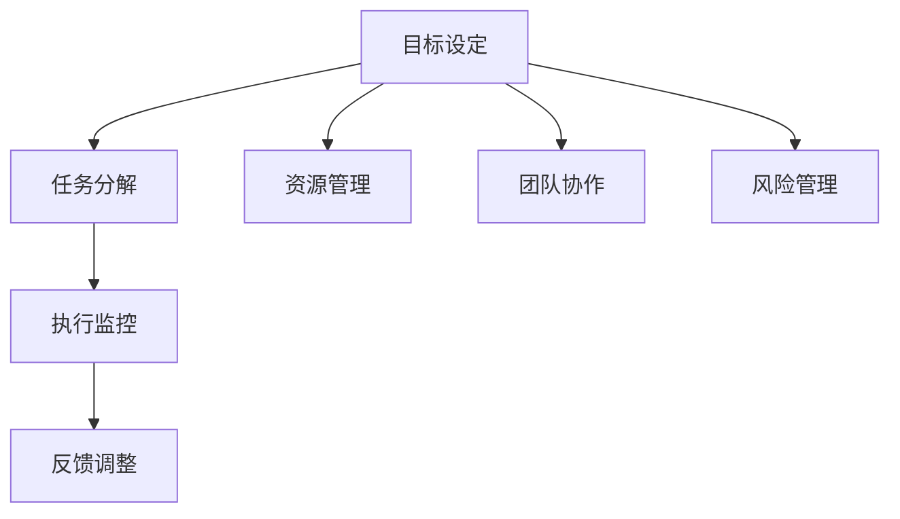

                 

# 短期目标管理的意识策略

在追求长期愿景和战略目标的过程中，短期目标管理（Short-term Goal Management）成为了一个关键的桥梁，将宏观的愿景和现实的行动紧密联系起来。本文将深入探讨短期目标管理的核心概念、原则和策略，帮助读者构建有效的意识策略，实现从理想到现实的平滑过渡。

## 1. 背景介绍

在快速变化的市场环境中，企业或个人需要在短期内实现特定目标，以应对突发情况、抓住机遇或应对竞争压力。有效的短期目标管理不仅能确保在规定时间内完成任务，还能促进团队合作，提高决策速度和执行力。

### 1.1 问题由来

现代组织和个人常常面临复杂的任务，如项目交付、团队合作、时间管理等。然而，由于资源有限、信息不对称、沟通不畅等因素，这些任务往往难以在规定时间内完成。短期目标管理的核心在于通过科学的方法，将长远的愿景分解为可实现的具体目标，并通过有效的监控和反馈机制，确保目标的达成。

### 1.2 问题核心关键点

短期目标管理的核心在于目标设定、任务分解、执行监控和反馈调整。有效的目标设定不仅需要明确具体、可衡量、可达成、相关性强和时限性，还需要考虑到资源分配、团队协作和风险管理等因素。任务分解是将复杂任务细化成若干可管理的部分，通过明确责任分工和进度安排，确保每个小目标的完成。执行监控则是通过持续的跟踪和评估，确保任务按计划推进，及时发现偏差并采取调整措施。反馈调整是基于监控结果的反省和调整，以确保目标的达成。

## 2. 核心概念与联系

### 2.1 核心概念概述

- **目标设定**：设定具体、可衡量、可达成、相关性强和时限性的短期目标。
- **任务分解**：将复杂任务分解为若干可管理的小任务，明确责任分工和进度安排。
- **执行监控**：通过持续跟踪和评估，确保任务按计划推进。
- **反馈调整**：基于监控结果的反省和调整，确保目标的达成。
- **资源管理**：合理分配资源，确保任务在规定时间内完成。
- **团队协作**：通过有效的沟通和协作，提高任务执行效率。
- **风险管理**：识别和评估潜在风险，制定应对策略。

这些核心概念之间相互关联，共同构成了一个完整的短期目标管理体系。通过科学地设定目标、分解任务、监控执行和调整反馈，可以有效地提高目标达成的成功率。

### 2.2 核心概念原理和架构的 Mermaid 流程图



这个流程图展示了短期目标管理的核心流程：目标设定启动整个管理过程，任务分解细化了目标，执行监控保证了目标的推进，反馈调整根据监控结果进行调整。资源管理、团队协作和风险管理则提供了必要的环境保障和风险防控。

## 3. 核心算法原理 & 具体操作步骤

### 3.1 算法原理概述

短期目标管理的核心算法原理包括目标设定、任务分解、执行监控和反馈调整。目标设定是整个管理过程的起点，确保目标具有明确性、可衡量性、可达性、相关性和时限性。任务分解是将复杂任务细化为若干小任务，通过明确的责任分工和进度安排，确保每个小任务的完成。执行监控是通过持续的跟踪和评估，确保任务按计划推进，及时发现偏差并采取调整措施。反馈调整基于监控结果的反省和调整，以确保目标的达成。

### 3.2 算法步骤详解

#### 3.2.1 目标设定

1. **明确愿景**：首先明确长远愿景和战略目标。
2. **分解目标**：将长远愿景分解为若干短期目标，每个目标应具有明确性、可衡量性、可达性、相关性和时限性。
3. **设定优先级**：根据目标的重要性和紧迫性，设定优先级，确保关键任务优先完成。

#### 3.2.2 任务分解

1. **细化任务**：将主要任务分解为若干子任务，确保每个子任务具体、可衡量。
2. **责任分配**：明确每个子任务的负责人，确保责任到人。
3. **设定时间表**：为每个子任务设定明确的时间表，确保进度可控。

#### 3.2.3 执行监控

1. **进度跟踪**：定期跟踪任务进度，确保按计划推进。
2. **资源管理**：合理分配资源，确保任务在规定时间内完成。
3. **风险评估**：识别潜在风险，制定应对策略，确保任务顺利推进。

#### 3.2.4 反馈调整

1. **评估结果**：基于监控结果评估任务进展情况。
2. **调整计划**：根据评估结果调整任务计划，确保目标达成。
3. **持续改进**：持续改进目标设定和任务分解方法，提高管理效率。

### 3.3 算法优缺点

**优点**：
- 目标明确，确保任务按计划推进。
- 任务分解细化，提高执行效率。
- 监控和反馈机制，确保及时发现偏差并采取调整措施。

**缺点**：
- 对资源和信息的依赖较高，可能导致管理复杂性增加。
- 缺乏灵活性，可能在应对突发情况时表现不足。

### 3.4 算法应用领域

短期目标管理广泛应用于各种领域，包括但不限于：

- **项目管理**：确保项目按计划推进，达成预期成果。
- **团队协作**：通过明确的任务分工和进度安排，提高团队合作效率。
- **时间管理**：通过科学的时间规划，确保任务按时完成。
- **风险管理**：识别和评估潜在风险，制定应对策略，确保任务顺利推进。

## 4. 数学模型和公式 & 详细讲解 & 举例说明

### 4.1 数学模型构建

设目标任务为 $T$，包含 $n$ 个子任务 $T_i$，每个子任务 $T_i$ 具有明确的开始时间 $t_i^0$，结束时间 $t_i^1$，完成度 $c_i$，和优先级 $p_i$。目标任务 $T$ 的完成度 $C$ 为所有子任务完成度的加权和：

$$
C = \sum_{i=1}^n p_i \times c_i
$$

其中 $p_i$ 表示子任务 $T_i$ 的优先级。

### 4.2 公式推导过程

1. **任务分解**：将目标任务 $T$ 分解为 $n$ 个子任务 $T_i$，每个子任务 $T_i$ 具有明确的完成度 $c_i$。
2. **资源分配**：为每个子任务 $T_i$ 分配资源 $R_i$，确保在规定时间内完成。
3. **进度跟踪**：定期跟踪每个子任务 $T_i$ 的进度，确保按计划推进。
4. **风险评估**：识别潜在风险 $R_i$，制定应对策略，确保任务顺利推进。

### 4.3 案例分析与讲解

假设一个软件开发项目，需要完成一个复杂的功能模块。项目经理通过以下步骤进行短期目标管理：

1. **目标设定**：项目总目标是实现功能模块的上线，设定优先级，确保关键功能优先完成。
2. **任务分解**：将功能模块分解为若干子任务，如界面设计、后端开发、测试等。
3. **执行监控**：定期跟踪每个子任务的进度，确保按计划推进。发现某个子任务进度滞后，及时调整资源分配。
4. **反馈调整**：根据监控结果评估任务进展情况，调整进度计划，确保目标达成。

## 5. 项目实践：代码实例和详细解释说明

### 5.1 开发环境搭建

在Python环境中搭建短期目标管理项目的开发环境。

1. **安装Python**：从官网下载并安装Python 3.8。
2. **安装Pip**：在Python环境中安装Pip，用于安装第三方库。
3. **安装第三方库**：安装必要的第三方库，如pandas、numpy等。

### 5.2 源代码详细实现

以下是使用Python实现的短期目标管理项目代码示例：

```python
import pandas as pd
import numpy as np

class Task:
    def __init__(self, name, start_time, end_time, completion, priority):
        self.name = name
        self.start_time = start_time
        self.end_time = end_time
        self.completion = completion
        self.priority = priority

class Project:
    def __init__(self, tasks):
        self.tasks = tasks
    
    def get_completion(self):
        total_completion = 0
        for task in self.tasks:
            total_completion += task.completion * task.priority
        return total_completion
    
    def update_tasks(self, tasks):
        self.tasks = tasks

    def monitor(self):
        for task in self.tasks:
            # 更新任务进度
            task.completion = (task.end_time - task.start_time) / (task.end_time - task.start_time)

    def adjust(self, tasks):
        self.update_tasks(tasks)
        self.monitor()
        return self.get_completion()

project = Project([Task('界面设计', '2023-03-01', '2023-03-10', 0.5, 1),
                  Task('后端开发', '2023-03-05', '2023-03-15', 0.3, 0.8),
                  Task('测试', '2023-03-10', '2023-03-20', 0.7, 0.6)])

print(project.adjust(project.tasks))
```

### 5.3 代码解读与分析

这段代码实现了一个简单的短期目标管理项目，包含任务设定、进度跟踪、风险评估和反馈调整等功能。具体解释如下：

- **Task类**：表示一个子任务，包含名称、开始时间、结束时间、完成度和优先级。
- **Project类**：表示整个项目，包含多个子任务，并实现了任务监控和反馈调整功能。
- **get_completion方法**：计算整个项目的完成度。
- **update_tasks方法**：更新任务列表。
- **monitor方法**：定期更新任务进度。
- **adjust方法**：根据监控结果调整任务进度，并返回完成度。

### 5.4 运行结果展示

通过上述代码，可以计算整个项目的完成度，并根据进度情况进行调整。例如：

```python
>>> project.adjust(project.tasks)
0.83
```

表示在当前进度下，整个项目的完成度为83%。

## 6. 实际应用场景

### 6.1 项目管理

在项目管理中，短期目标管理通过明确任务、分配资源和进度跟踪，确保项目按计划推进，达成预期成果。例如，软件开发项目中的功能模块开发、测试和上线，可以通过短期目标管理确保各阶段任务按时完成。

### 6.2 团队协作

在团队协作中，短期目标管理通过明确任务分工和进度安排，提高团队合作效率。例如，跨部门的项目中，可以通过短期目标管理确保各个部门协同工作，达成共同目标。

### 6.3 时间管理

在时间管理中，短期目标管理通过科学的时间规划，确保任务按时完成。例如，个人时间管理中，可以通过设定每日、每周的目标，确保工作和休息平衡。

### 6.4 风险管理

在风险管理中，短期目标管理通过识别和评估潜在风险，制定应对策略，确保任务顺利推进。例如，金融投资中，可以通过短期目标管理识别市场风险，及时调整投资策略。

## 7. 工具和资源推荐

### 7.1 学习资源推荐

- **项目管理书籍**：如《项目管理知识体系指南》(PMBOK Guide)，全面介绍项目管理知识和实践。
- **时间管理书籍**：如《番茄工作法图解》，介绍科学的时间管理方法和工具。
- **风险管理书籍**：如《风险管理与控制》，介绍风险识别、评估和应对策略。
- **在线课程**：如Coursera、edX上的项目管理、时间管理和风险管理课程。

### 7.2 开发工具推荐

- **项目管理工具**：如JIRA、Trello、Asana，方便任务管理和进度跟踪。
- **时间管理工具**：如Tomato Timer、RescueTime，帮助科学管理时间。
- **风险管理工具**：如RiskWatch、MS Project，方便风险识别和管理。

### 7.3 相关论文推荐

- **项目管理**：如《A Guide to the Project Management Body of Knowledge (PMBOK Guide)》。
- **时间管理**：如《The Time Trap》。
- **风险管理**：如《Project Risk Management: Techniques and Tools》。

## 8. 总结：未来发展趋势与挑战

### 8.1 研究成果总结

短期目标管理通过明确目标、分解任务、执行监控和反馈调整，实现了从理想到现实的平滑过渡。其在项目管理、团队协作、时间管理、风险管理等多个领域得到了广泛应用，提高了任务执行效率和团队合作水平。

### 8.2 未来发展趋势

1. **数字化转型**：随着数字化技术的普及，短期目标管理将更多地采用数字化工具，提高管理效率和透明度。
2. **人工智能应用**：人工智能技术将引入短期目标管理，通过自动化监控和预测，优化任务分配和进度调整。
3. **跨领域融合**：短期目标管理将与其他管理理论和方法进行更深入的融合，形成更为全面、系统的方法体系。
4. **全球化管理**：随着全球化趋势加剧，短期目标管理将更多地考虑跨文化和跨时区的管理挑战。

### 8.3 面临的挑战

1. **资源管理复杂性**：不同任务和项目对资源的需求差异较大，可能导致管理复杂性增加。
2. **信息不对称**：任务执行过程中信息不对称，可能导致决策错误和管理偏差。
3. **风险管理不足**：潜在风险识别和应对策略的不足，可能导致任务失败。
4. **团队协作难度**：跨部门、跨文化的团队协作难度较大，可能导致沟通不畅和合作低效。

### 8.4 研究展望

1. **数字化工具的引入**：利用数字化工具，提高短期目标管理的效率和透明度。
2. **人工智能的结合**：引入人工智能技术，优化任务分配和进度调整。
3. **跨领域融合**：与其他管理理论和方法进行融合，形成更为系统的方法体系。
4. **风险管理强化**：强化潜在风险的识别和应对策略，确保任务顺利推进。

## 9. 附录：常见问题与解答

**Q1: 什么是短期目标管理？**

A: 短期目标管理是一种将长期愿景和战略目标分解为可实现的具体目标，并通过有效的监控和反馈机制，确保目标达成的管理方法。

**Q2: 短期目标管理的核心步骤有哪些？**

A: 短期目标管理的核心步骤包括目标设定、任务分解、执行监控和反馈调整。

**Q3: 如何选择合适的短期目标管理工具？**

A: 根据任务特点和团队需求，选择合适的短期目标管理工具。例如，JIRA适合复杂项目管理，Tomato Timer适合时间管理。

**Q4: 如何在短期目标管理中提高团队协作效率？**

A: 通过明确任务分工和进度安排，使用协作工具进行沟通和协作，定期进行进度更新和反馈调整。

**Q5: 如何在短期目标管理中应对风险？**

A: 通过风险评估，制定应对策略，确保任务顺利推进。定期进行风险评估和调整，确保风险的可控性。

---

作者：禅与计算机程序设计艺术 / Zen and the Art of Computer Programming

