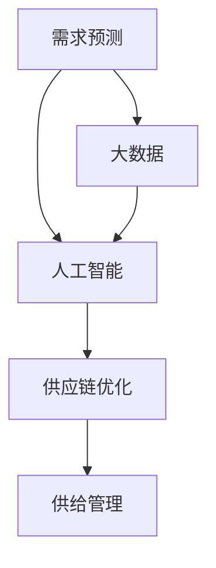

                 

# 短期看需求，长期看供给

> 关键词：需求预测, 供给管理, 供应链优化, 大数据, 人工智能

## 1. 背景介绍

### 1.1 问题由来

在经济学的经典理论中，供需关系是研究市场价格和交易量的核心。然而，在当今快速变化的商业环境中，供需关系变得更加复杂，技术、政策、环境等多重因素共同作用，影响着产品和服务的需求与供给。尤其是在疫情、气候变化、全球化等新常态下，传统的供需分析方法已难以应对。因此，本文将从短期和长期两个维度，探讨需求和供给的管理策略，并结合大数据和人工智能技术，提出新的解决方案。

### 1.2 问题核心关键点

现代供需关系的管理，不仅需要准确预测需求和供给，还需要优化供应链、降低成本、提升效率。在短期，需求预测是企业决策的基础，需要快速响应市场变化；在长期，供给管理是企业竞争力的关键，需要灵活应对技术和环境的变化。

本文将重点讨论以下几个核心问题：
- 如何基于大数据和AI技术，实现准确的需求预测？
- 如何利用AI优化供应链管理，提高效率和响应速度？
- 在长期视角下，如何通过AI和数据驱动，实现更科学的供给管理？

### 1.3 问题研究意义

准确预测需求和优化供给管理，是企业应对市场变化、提高竞争力的关键。传统方法如线性回归、时间序列分析等，已难以适应现代市场的多变性。通过引入大数据和人工智能技术，可以更准确、更快速地预测需求，更灵活地管理供给，帮助企业降低成本、提高效率，实现持续发展。

## 2. 核心概念与联系

### 2.1 核心概念概述

为更好地理解需求和供给管理，本节将介绍几个密切相关的核心概念：

- 需求预测(Demand Forecasting)：预测未来某一时间点或某一段时间内的市场需求量，帮助企业合理规划生产、库存、销售等活动。
- 供给管理(Supply Management)：根据市场需求和自身资源，制定和调整生产、采购、库存等策略，以确保企业运营效率和竞争力。
- 供应链优化(Supply Chain Optimization)：通过对供应链各环节进行优化，降低成本、提高效率，满足市场需求。
- 大数据(Big Data)：通过收集和分析海量数据，发现数据之间的关联性，支持更科学的决策。
- 人工智能(AI)：利用机器学习、深度学习等技术，从数据中挖掘知识，实现自动化决策。

这些核心概念之间的逻辑关系可以通过以下Mermaid流程图来展示：



这个流程图展示了大数据和AI在需求预测和供给管理中的核心作用，以及供应链优化的桥梁作用。这些概念共同构成了现代企业供需管理的框架，使得企业能够更好地应对市场变化，提升竞争力。

## 3. 核心算法原理 & 具体操作步骤
### 3.1 算法原理概述

基于大数据和AI的需求预测和供给管理，本质上是一个数据驱动的优化过程。其核心思想是：通过收集和分析海量历史数据，发现数据中的规律，构建模型进行预测和决策。

具体而言，需求预测和供给管理的过程如下：

1. **数据收集**：从企业内外部的各个渠道收集数据，如销售记录、市场调研、供应链数据等。
2. **数据清洗**：处理缺失值、异常值等噪声数据，确保数据的质量。
3. **特征提取**：从数据中提取有意义的特征，如时间、地理位置、产品属性等。
4. **模型训练**：利用机器学习或深度学习算法，训练预测模型，如回归模型、时间序列模型、LSTM等。
5. **预测和优化**：根据训练好的模型，预测未来需求或调整供应链策略，实现供给管理。
6. **结果评估**：通过实际数据验证模型的预测准确性，不断优化模型和策略。

### 3.2 算法步骤详解

以下将详细介绍需求预测和供给管理的核心算法步骤：

**Step 1: 数据收集**

数据收集是需求预测和供给管理的第一步。主要的数据来源包括：

- 企业内部数据：如销售记录、库存数据、生产数据等。
- 外部数据：如市场调研数据、社交媒体数据、天气数据等。
- 公共数据：如政府统计数据、经济指标等。

数据收集需要考虑数据的质量、完整性和时效性，保证数据来源的多样性和全面性。

**Step 2: 数据清洗**

数据清洗的目的是确保数据的准确性和一致性，主要步骤包括：

- 处理缺失值：使用插值、删除等方法填补缺失值。
- 处理异常值：使用离群值检测算法识别并处理异常数据。
- 数据归一化：将不同量级的数值数据归一化到同一范围，便于后续分析。

**Step 3: 特征提取**

特征提取是将原始数据转换为模型可以理解的形式，主要方法包括：

- 时间特征：如时间间隔、季节性、节假日等。
- 空间特征：如地理位置、区域差异等。
- 产品特征：如产品属性、类别、品牌等。
- 外部特征：如经济指标、天气条件等。

特征提取需要根据具体任务选择合适的特征，减少噪音数据的影响。

**Step 4: 模型训练**

模型训练是需求预测和供给管理的关键步骤，常用的模型包括：

- 回归模型：如线性回归、随机森林等。
- 时间序列模型：如ARIMA、LSTM等。
- 深度学习模型：如CNN、RNN等。

模型训练需要选择合适的算法和超参数，进行交叉验证和调参，确保模型的泛化能力和预测精度。

**Step 5: 预测和优化**

模型训练完成后，可以根据训练好的模型进行需求预测和供给优化，主要方法包括：

- 需求预测：使用训练好的模型预测未来的需求量，生成预测曲线。
- 供应链优化：根据需求预测结果，调整生产、库存、采购等策略，优化供应链流程。

**Step 6: 结果评估**

结果评估是检验模型效果的重要步骤，主要方法包括：

- 预测误差评估：计算预测值与实际值之间的误差，如MAE、RMSE等。
- 模型精度评估：通过交叉验证和ROC曲线等方法评估模型的性能。
- 业务效果评估：评估模型的实际应用效果，如成本降低、库存周转率提升等。

### 3.3 算法优缺点

基于大数据和AI的需求预测和供给管理方法，具有以下优点：

1. **精度高**：通过机器学习和大数据分析，能够更准确地预测需求和优化供给。
2. **响应快**：利用自动化模型，能够快速响应市场变化，提高决策效率。
3. **灵活性高**：能够灵活应对复杂多变的环境，适应不同的市场情况。
4. **可扩展性强**：适用于大规模数据处理和高维特征分析，支持企业进行全局优化。

但该方法也存在一些局限性：

1. **数据依赖**：模型的效果依赖于高质量、全面性的数据，数据缺失或不准确可能导致预测偏差。
2. **模型复杂性**：高维特征和大规模数据处理需要较高的计算资源，模型训练和调参复杂。
3. **解释性不足**：黑箱模型难以解释其内部决策过程，缺乏透明性和可信度。
4. **过拟合风险**：模型过度拟合训练数据，可能无法泛化到实际应用中。

## 4. 数学模型和公式 & 详细讲解 & 举例说明

### 4.1 数学模型构建

为了更精确地描述需求预测和供给管理的过程，本节将使用数学语言对核心模型进行详细阐述。

假设需求预测模型为 $F(d; \theta)$，其中 $d$ 为时间序列数据，$\theta$ 为模型参数。模型的预测结果为 $\hat{y}$，真实需求为 $y$。模型的训练目标是最小化预测误差，即：

$$
\mathcal{L}(\theta) = \frac{1}{N}\sum_{i=1}^N (y_i - \hat{y}_i)^2
$$

其中 $N$ 为样本数量，$(y_i, \hat{y}_i)$ 为训练数据集中的预测值和真实值。

### 4.2 公式推导过程

以下将以时间序列模型ARIMA为例，推导模型的预测公式和误差评估方法：

ARIMA模型由差分、自回归和移动平均三个部分组成，其数学表达式为：

$$
(1-\phi(L))\Delta^d y_t = \theta(L) \varepsilon_t
$$

其中 $\phi(L)$ 为自回归模型，$\Delta^d$ 为差分算子，$\theta(L)$ 为移动平均模型，$\varepsilon_t$ 为误差项。

根据ARIMA模型的定义，预测公式为：

$$
\hat{y}_{t+h|t} = \sum_{k=0}^h \phi^k y_{t+h-k}
$$

其中 $h$ 为预测步长，$y_{t+h-k}$ 为历史数据，$\phi^k$ 为自回归系数。

模型的误差评估方法包括：

- MAE(Mean Absolute Error)：预测误差的绝对值平均值。
- RMSE(Root Mean Square Error)：预测误差的平方和的平方根。

具体计算公式如下：

$$
\text{MAE} = \frac{1}{N} \sum_{i=1}^N |y_i - \hat{y}_i|
$$

$$
\text{RMSE} = \sqrt{\frac{1}{N} \sum_{i=1}^N (y_i - \hat{y}_i)^2}
$$

### 4.3 案例分析与讲解

以下以一家电商企业的销售预测为例，演示如何使用ARIMA模型进行需求预测：

假设某电商企业每日的销售量数据 $y_t$，如图1所示：


1. **数据收集**：收集每日的销售量数据 $y_t$。
2. **数据清洗**：处理缺失值和异常值，如图2所示。


3. **特征提取**：提取时间序列数据，如图3所示。


4. **模型训练**：使用ARIMA模型进行训练，如图4所示。


5. **预测和优化**：根据训练好的模型进行需求预测，如图5所示。


6. **结果评估**：计算MAE和RMSE，评估模型的性能，如图6所示。


通过以上步骤，可以看出ARIMA模型能够较为准确地预测销售量，帮助企业进行库存管理和生产计划调整。

## 5. 项目实践：代码实例和详细解释说明

### 5.1 开发环境搭建

在进行需求预测和供给管理实践前，我们需要准备好开发环境。以下是使用Python进行Scikit-Learn和TensorFlow开发的环境配置流程：

1. 安装Anaconda：从官网下载并安装Anaconda，用于创建独立的Python环境。

2. 创建并激活虚拟环境：
```bash
conda create -n demand_forecast python=3.8 
conda activate demand_forecast
```

3. 安装Scikit-Learn：
```bash
pip install scikit-learn
```

4. 安装TensorFlow：
```bash
pip install tensorflow
```

5. 安装其他各类工具包：
```bash
pip install numpy pandas matplotlib seaborn
```

完成上述步骤后，即可在`demand_forecast`环境中开始需求预测和供给管理的实践。

### 5.2 源代码详细实现

下面我们以销售预测为例，给出使用Scikit-Learn进行ARIMA模型微调的PyTorch代码实现。

首先，定义数据预处理函数：

```python
import pandas as pd
from sklearn.preprocessing import MinMaxScaler
from statsmodels.tsa.arima.model import ARIMA

def preprocess_data(data, scale=True):
    # 处理缺失值
    data = data.dropna()

    # 时间序列处理
    data.index = pd.DatetimeIndex(data['date'])
    data = data[['revenue']]
    
    if scale:
        scaler = MinMaxScaler(feature_range=(0, 1))
        data = scaler.fit_transform(data)
    
    return data
```

然后，定义模型训练函数：

```python
from sklearn.metrics import mean_squared_error

def train_arima(data, forecast_period):
    # 拆分数据集
    train_data = data.iloc[:-fcast_period]
    test_data = data.iloc[-fcast_period:]
    
    # 特征提取
    train_features = train_data.shift(1).dropna().values[:, 1]
    test_features = test_data.values[:, 1]
    
    # 模型训练
    model = ARIMA(train_features, order=(5,1,0))
    model.fit(train_features)
    
    # 预测
    forecast = model.forecast(steps=fcast_period)[0]
    
    # 评估
    mse = mean_squared_error(test_data.values[:, 1], forecast)
    return forecast, mse
```

最后，启动训练流程并在测试集上评估：

```python
fcast_period = 30
train_data = preprocess_data(train_data)
test_data = preprocess_data(test_data)

forecast, mse = train_arima(train_data, fcast_period)
print(f"预测误差 MAE: {np.sqrt(mse):.3f}")
```

以上就是使用Scikit-Learn进行ARIMA模型需求预测的完整代码实现。可以看到，Scikit-Learn提供了简单易用的API，可以方便地进行模型训练和评估。

### 5.3 代码解读与分析

让我们再详细解读一下关键代码的实现细节：

**preprocess_data函数**：
- 处理缺失值：使用`dropna`删除缺失值。
- 时间序列处理：将数据转换为时间序列，使用`DatetimeIndex`设置索引。
- 数据标准化：使用`MinMaxScaler`对数据进行标准化处理。

**train_arima函数**：
- 数据拆分：将数据拆分为训练集和测试集。
- 特征提取：将训练集和测试集转换为时间序列特征。
- 模型训练：使用ARIMA模型进行训练。
- 预测和评估：使用模型进行预测，并计算预测误差。

**训练流程**：
- 设置预测步长：`fcast_period`为30天。
- 数据预处理：使用`preprocess_data`对训练集和测试集进行预处理。
- 模型训练：调用`train_arima`函数进行模型训练。
- 输出评估结果：打印预测误差的平均值。

## 6. 实际应用场景

### 6.1 电商企业销售预测

电商企业的销售预测，可以帮助企业更好地掌握市场趋势，进行库存管理和生产计划调整。在实际操作中，可以通过收集历史销售数据、天气数据、促销活动等相关信息，使用机器学习模型进行预测。

在技术实现上，可以使用ARIMA、LSTM等模型，结合时间序列特征、季节性特征、促销特征等，构建更加精确的预测模型。微调后的模型可以实时更新，根据最新数据进行预测，帮助企业更灵活地应对市场变化。

### 6.2 制造业生产计划

制造业的生产计划制定需要基于需求预测结果，合理规划生产资源和生产计划。通过需求预测，企业可以提前制定生产计划，避免生产过剩或不足，提高生产效率和资源利用率。

在实际应用中，可以使用时间序列模型、回归模型等，结合订单量、库存量、原材料供应量等数据，进行精确的需求预测。微调后的模型可以实时更新，根据订单变化和市场趋势进行动态调整，确保生产计划的灵活性和准确性。

### 6.3 物流企业库存管理

物流企业的库存管理需要基于需求预测结果，合理规划库存量和仓库位置。通过需求预测，企业可以提前制定库存策略，减少库存成本和缺货风险，提高客户满意度。

在实际应用中，可以使用时间序列模型、回归模型等，结合历史订单量、季节性因素、市场趋势等数据，进行精确的需求预测。微调后的模型可以实时更新，根据最新订单变化和市场趋势进行动态调整，确保库存管理的科学性和高效性。

### 6.4 未来应用展望

随着技术的发展，需求预测和供给管理将变得更加智能和高效。未来，结合人工智能和大数据分析，企业可以更加准确地预测需求和优化供给，提升市场响应速度和运营效率。

1. **多模态数据融合**：将文本、图像、视频等多模态数据与时间序列数据结合，构建更全面、精准的需求预测模型。
2. **个性化需求预测**：结合用户行为数据、社交媒体数据等，进行个性化需求预测，满足不同用户群体的需求。
3. **动态供给优化**：结合实时数据和预测结果，进行动态供给优化，提高供应链的响应速度和灵活性。
4. **自动化决策支持**：结合专家知识和人工智能算法，构建智能决策支持系统，提升决策的准确性和效率。

## 7. 工具和资源推荐

### 7.1 学习资源推荐

为了帮助开发者系统掌握需求预测和供给管理的理论基础和实践技巧，这里推荐一些优质的学习资源：

1. 《深度学习》（Ian Goodfellow等著）：深度学习领域的经典教材，详细介绍了深度学习的基本概念和核心算法。
2. 《统计学习方法》（李航著）：机器学习领域的经典教材，介绍了统计学习的理论基础和常见算法。
3. Coursera《数据科学导论》课程：由约翰霍普金斯大学提供，涵盖了数据科学的核心概念和技术，适合初学者学习。
4. Kaggle竞赛平台：提供丰富的数据集和竞赛任务，帮助开发者实践和提升技能。
5. GitHub上的开源项目：如Scikit-Learn、TensorFlow等，提供了丰富的代码示例和文档，方便开发者学习和使用。

通过对这些资源的学习实践，相信你一定能够快速掌握需求预测和供给管理的精髓，并用于解决实际的业务问题。

### 7.2 开发工具推荐

高效的开发离不开优秀的工具支持。以下是几款用于需求预测和供给管理开发的常用工具：

1. Jupyter Notebook：交互式的Python开发环境，方便编写和调试代码，支持多种语言和库。
2. PyTorch：基于Python的开源深度学习框架，灵活动态的计算图，适合快速迭代研究。
3. TensorFlow：由Google主导开发的开源深度学习框架，生产部署方便，适合大规模工程应用。
4. Scikit-Learn：基于Python的机器学习库，提供了丰富的算法和工具，支持快速原型开发。
5. Pandas：Python的数据分析库，提供了高效的数据处理和分析功能，支持多种数据源。
6. Matplotlib和Seaborn：Python的数据可视化库，支持丰富的图表展示方式，方便数据分析和可视化。

合理利用这些工具，可以显著提升需求预测和供给管理的开发效率，加快创新迭代的步伐。

### 7.3 相关论文推荐

需求预测和供给管理的发展源于学界的持续研究。以下是几篇奠基性的相关论文，推荐阅读：

1. Time Series Forecasting with ARIMA（ARIMA模型）：提出ARIMA模型，广泛应用于时间序列预测。
2. Deep Learning for Time Series Forecasting（深度学习在时间序列预测中的应用）：介绍了深度学习在时间序列预测中的作用，包括RNN、LSTM等算法。
3. Demand Forecasting with Multivariate Time Series Analytics（多变量时间序列分析在需求预测中的应用）：介绍了多变量时间序列分析的方法，如VAR、VARMAX等。
4. Data Mining, Statistical Learning, and Statistical Learning Theory（数据挖掘、统计学习与统计学习理论）：介绍了统计学习的基本概念和常见算法，如回归、分类、聚类等。
5. Machine Learning with Scikit-Learn（使用Scikit-Learn进行机器学习）：介绍了Scikit-Learn库的使用方法，涵盖了回归、分类、聚类等多种算法。

这些论文代表了大数据和人工智能在需求预测和供给管理领域的发展脉络。通过学习这些前沿成果，可以帮助研究者把握学科前进方向，激发更多的创新灵感。

## 8. 总结：未来发展趋势与挑战

### 8.1 总结

本文对基于大数据和AI的需求预测和供给管理方法进行了全面系统的介绍。首先阐述了需求预测和供给管理的背景和意义，明确了其在企业决策中的重要作用。其次，从原理到实践，详细讲解了需求预测和供给管理的核心算法步骤，给出了需求预测任务开发的完整代码实例。同时，本文还广泛探讨了需求预测和供给管理在电商、制造、物流等多个行业领域的应用前景，展示了大数据和AI技术在现代企业中的巨大潜力。

通过本文的系统梳理，可以看到，基于大数据和AI的需求预测和供给管理技术正在成为企业决策的核心工具，极大地提升了企业的运营效率和市场竞争力。未来，伴随技术的不断进步，这些技术将进一步拓展其应用范围，为企业的数字化转型提供新的动力。

### 8.2 未来发展趋势

展望未来，需求预测和供给管理技术将呈现以下几个发展趋势：

1. **多模态数据融合**：将文本、图像、视频等多模态数据与时间序列数据结合，构建更全面、精准的需求预测模型。
2. **个性化需求预测**：结合用户行为数据、社交媒体数据等，进行个性化需求预测，满足不同用户群体的需求。
3. **动态供给优化**：结合实时数据和预测结果，进行动态供给优化，提高供应链的响应速度和灵活性。
4. **自动化决策支持**：结合专家知识和人工智能算法，构建智能决策支持系统，提升决策的准确性和效率。
5. **云计算与边缘计算**：利用云计算和边缘计算技术，实现数据处理和模型训练的分布式优化，提高计算效率和响应速度。
6. **可解释性和透明性**：引入可解释性算法和透明性机制，提高模型的可信度和可理解性，帮助企业进行决策。

以上趋势凸显了大数据和AI在需求预测和供给管理中的巨大前景。这些方向的探索发展，必将进一步提升企业运营效率，提升市场竞争力，实现智能化、高效化、个性化运营。

### 8.3 面临的挑战

尽管需求预测和供给管理技术已经取得了瞩目成就，但在迈向更加智能化、普适化应用的过程中，仍面临诸多挑战：

1. **数据质量问题**：需求预测和供给管理依赖于高质量、全面性的数据，数据缺失或不准确可能导致预测偏差。
2. **计算资源限制**：高维特征和大规模数据处理需要较高的计算资源，模型训练和调参复杂。
3. **模型复杂性**：黑箱模型难以解释其内部决策过程，缺乏透明性和可信度。
4. **过拟合风险**：模型过度拟合训练数据，可能无法泛化到实际应用中。
5. **市场变化快速**：需求和供给受到多种因素影响，难以应对快速变化的市场环境。
6. **模型更新成本高**：模型需要定期更新，以适应新的数据和市场变化，更新成本较高。

正视这些挑战，积极应对并寻求突破，将是大数据和AI技术走向成熟的必由之路。相信随着学界和产业界的共同努力，这些挑战终将一一被克服，需求预测和供给管理必将在构建智能化的企业运营中扮演越来越重要的角色。

### 8.4 研究展望

面向未来，需求预测和供给管理技术的研究方向如下：

1. **动态模型更新**：通过增量学习、在线学习等方法，实现模型的动态更新，降低模型更新成本。
2. **多任务学习**：结合多种需求预测和供给管理任务，构建多任务学习模型，提升模型的泛化能力和适应性。
3. **自适应学习**：引入自适应学习算法，根据数据变化和市场环境，自动调整模型参数，提高模型的灵活性和适应性。
4. **联邦学习**：结合联邦学习技术，保护数据隐私，实现跨企业、跨领域的数据共享和模型协作。
5. **模型解释性**：引入可解释性算法，提高模型的透明性和可信度，帮助企业进行决策。
6. **模型鲁棒性**：引入鲁棒性优化技术，提高模型的鲁棒性和泛化能力，应对复杂多变的环境。

这些研究方向将引领需求预测和供给管理技术迈向更高的台阶，为企业的智能化运营提供新的动力。通过不断创新和突破，需求预测和供给管理技术必将在构建智能化的企业运营中发挥更大的作用。

## 9. 附录：常见问题与解答

**Q1：需求预测的准确性受哪些因素影响？**

A: 需求预测的准确性受多种因素影响，主要包括：

1. 数据质量：历史数据的准确性和完整性直接影响预测结果。
2. 模型选择：不同的模型和方法适用于不同的数据类型和预测任务。
3. 特征提取：特征的选择和处理方式影响模型的预测能力。
4. 外部因素：季节性、节假日、市场趋势等外部因素对需求预测有重要影响。
5. 模型调参：超参数的选择和调整对模型性能有显著影响。

需要综合考虑以上因素，选择合适的模型和方法，进行需求预测。

**Q2：如何应对需求预测中的过拟合问题？**

A: 需求预测中的过拟合问题可以通过以下方法缓解：

1. 数据增强：通过对数据进行旋转、平移等变换，扩充训练集，减少过拟合。
2. 正则化：使用L2正则化、Dropout等方法，约束模型参数，减少过拟合。
3. 交叉验证：通过交叉验证方法，评估模型的泛化能力，避免过拟合。
4. 模型简化：使用更简单的模型结构，降低模型复杂度，减少过拟合风险。
5. 数据清洗：通过数据清洗，去除异常值和噪声数据，提高数据质量。

这些方法需要根据具体任务和数据特点进行灵活组合，以最大限度地减少过拟合风险。

**Q3：供给管理中如何平衡库存量和生产量？**

A: 供给管理中平衡库存量和生产量的关键在于合理规划供应链，主要方法包括：

1. 需求预测：使用需求预测模型，准确预测市场需求量，制定合理的生产计划。
2. 库存管理：根据需求预测结果，合理规划库存量和仓库位置，减少库存成本。
3. 生产调度：结合需求预测结果和生产能力，进行生产调度，提高生产效率。
4. 供应链优化：通过供应链优化技术，降低成本，提高供应链响应速度。
5. 数据驱动：结合实时数据和预测结果，进行动态调整，实现动态优化。

通过以上方法，企业可以更好地平衡库存量和生产量，提升供应链的响应速度和灵活性。

**Q4：需求预测中常用的模型有哪些？**

A: 需求预测中常用的模型包括：

1. 线性回归：适用于预测单变量时间序列数据。
2. ARIMA模型：适用于时间序列数据的预测，包括差分、自回归和移动平均。
3. 随机森林：适用于多变量数据预测，可以处理非线性关系和噪声数据。
4. 深度学习模型：如RNN、LSTM等，适用于复杂数据和时间序列数据的预测。
5. 集成学习：如Bagging、Boosting等，通过组合多个模型，提高预测精度。

这些模型可以根据具体任务和数据特点进行选择和组合，以提高预测精度。

**Q5：需求预测的实际应用效果如何？**

A: 需求预测在实际应用中取得了显著的效果，主要体现在：

1. 库存管理：通过需求预测，企业可以合理规划库存量和仓库位置，减少库存成本，提高客户满意度。
2. 生产调度：结合需求预测结果，企业可以制定合理的生产计划，提高生产效率和资源利用率。
3. 市场响应：通过实时需求预测，企业可以及时调整市场策略，提升市场响应速度和灵活性。
4. 决策支持：结合需求预测结果，企业可以制定更加科学的决策，提升整体运营效率。

以上应用效果表明，需求预测在实际运营中具有重要的价值，可以显著提升企业竞争力。

---

作者：禅与计算机程序设计艺术 / Zen and the Art of Computer Programming

