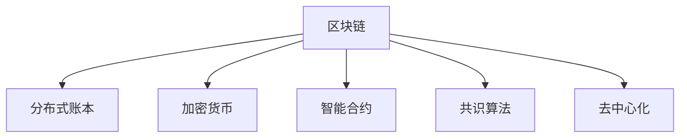

                 

# 硅谷区块链:加密货币与分布式账本

> 关键词：区块链,加密货币,分布式账本,智能合约,共识算法,去中心化

## 1. 背景介绍

### 1.1 问题由来
在过去的十年里，区块链技术已经从科幻小说中的概念，逐渐走入现实，成为金融科技、供应链管理、数字身份验证等多个领域的重要技术。尤其是以比特币为代表的加密货币，不仅颠覆了传统金融市场，还引发了全球范围内对于去中心化技术的广泛讨论。硅谷作为全球科技创新的中心，一直以来都是区块链技术的热土，吸引了大量的创业公司、投资机构和开发者。

然而，区块链技术尽管在多个领域展现了巨大的潜力，但在应用过程中仍存在诸多挑战和争议。例如，如何平衡安全性、隐私保护和性能问题？如何设计合理的共识算法以保障网络稳健？如何通过智能合约实现自动化的业务逻辑？这些问题都需要在实践中不断探索和解决。

### 1.2 问题核心关键点
本文将深入探讨区块链的核心概念，包括加密货币、分布式账本、智能合约等，并结合硅谷区块链的典型应用案例，展示如何通过技术手段克服上述挑战，推动区块链技术的发展和应用。

## 2. 核心概念与联系

### 2.1 核心概念概述

为更好地理解硅谷区块链技术的实践和应用，本节将介绍几个密切相关的核心概念：

- **区块链(Blockchain)**：一种分布式数据库技术，通过去中心化的方式记录和验证交易数据，确保数据不可篡改、透明可信。
- **加密货币(Cryptocurrency)**：基于区块链技术，以加密学和分布式共识为支撑的数字货币。比特币是其中的代表。
- **分布式账本(Distributed Ledger)**：区块链的核心组件，记录网络中所有交易和状态的分布式数据库。
- **智能合约(Smart Contract)**：一种自动执行、不可篡改的合约，通过区块链代码实现自动化业务逻辑。
- **共识算法(Consensus Algorithm)**：区块链网络中用于达成共识，保证数据一致性的算法。
- **去中心化(Decentralization)**：区块链技术的核心优势，通过分布式网络和加密学手段，消除了中心化的信任依赖，提升了系统安全性和透明性。

这些核心概念之间的逻辑关系可以通过以下Mermaid流程图来展示：



这个流程图展示了大语言模型的核心概念及其之间的关系：

1. 区块链通过分布式账本记录和验证交易数据，是分布式共识的基础。
2. 加密货币建立在区块链之上，通过加密学手段确保交易的安全性和匿名性。
3. 智能合约是区块链的核心应用，通过代码实现自动化的业务逻辑。
4. 共识算法保障区块链网络的一致性，是去中心化系统的关键技术。
5. 去中心化是区块链技术的核心优势，通过分布式网络和加密学手段，消除了中心化的信任依赖。

## 3. 核心算法原理 & 具体操作步骤
### 3.1 算法原理概述

硅谷区块链技术中的核心算法原理主要包括分布式共识、加密学和密码学等。

**分布式共识算法**：通过设计合理的算法，使得区块链网络中的节点能够达成一致，共同验证和记录交易数据。常见的分布式共识算法有PoW、PoS、DPoS、PBFT等，各自有其优缺点和适用场景。

**加密学和密码学**：区块链技术的核心安全机制，保障交易数据的隐私和完整性。主要包括非对称加密、哈希函数、数字签名等。

### 3.2 算法步骤详解

**分布式共识算法步骤**：
1. **初始化网络**：所有节点维护区块链的全链信息，通过网络广播当前最新的区块。
2. **交易验证**：每个节点根据区块链规则验证接收到的交易是否合法，确保交易数据的一致性和正确性。
3. **共识达成**：通过共识算法，网络中的节点达成共识，选择最有利的区块进行验证和记录。
4. **区块链上**：将验证通过的区块添加到区块链的末尾，形成完整的链条。

**加密学和密码学步骤**：
1. **哈希函数**：将交易数据进行哈希运算，生成唯一且不可逆的哈希值，保障数据的完整性。
2. **非对称加密**：通过公钥和私钥对数据进行加密和解密，保障数据的安全性和隐私性。
3. **数字签名**：使用私钥对交易数据进行签名，确保数据的来源和完整性。

### 3.3 算法优缺点

硅谷区块链技术中的分布式共识和加密学算法各有优缺点：

**分布式共识算法的优点**：
- 去中心化：网络中的节点分布式存储交易数据，无需中心化的管理机构。
- 高可用性：单个节点故障不影响整个系统的运行，系统容错性好。
- 安全性高：共识算法保障交易数据的不可篡改性和一致性。

**分布式共识算法的缺点**：
- 计算资源消耗高：如PoW共识算法，需要大量计算资源进行工作量证明。
- 交易速度慢：大规模网络下，共识算法可能导致交易速度减慢。

**加密学和密码学的优点**：
- 数据安全性高：通过哈希函数和数字签名等手段，保障数据的安全性和完整性。
- 隐私保护好：非对称加密和匿名交易等手段，保护用户的隐私信息。

**加密学和密码学的缺点**：
- 算法复杂度高：如非对称加密算法，计算复杂度较高。
- 安全性依赖算法：算法的安全性依赖于密码学原理的科学性和实现的安全性。

### 3.4 算法应用领域

硅谷区块链技术已经在多个领域得到了广泛应用，涵盖金融科技、供应链管理、数字身份验证等多个领域，具体如下：

- **金融科技**：通过区块链技术实现跨币种交易、智能合约结算、去中心化清算等功能，提升金融系统的透明度和安全性。
- **供应链管理**：通过区块链技术记录供应链各环节的交易数据，提高供应链的透明度和可追溯性，实现实时监控和自动化管理。
- **数字身份验证**：通过区块链技术建立分布式身份系统，实现身份信息的可信存储和验证，保障用户身份安全。

除了上述这些经典应用外，区块链技术还在更多场景中得到创新性的应用，如可编程合约、去中心化应用(DApps)、跨链互操作等，为区块链技术带来了新的突破。随着技术的发展和应用的推广，相信区块链技术将在更广泛的领域发挥作用，推动社会的数字化转型。

## 4. 数学模型和公式 & 详细讲解  
### 4.1 数学模型构建

本节将使用数学语言对硅谷区块链技术的核心算法进行更加严格的刻画。

设区块链网络中有 $N$ 个节点，每个节点维护完整的区块链信息。设当前区块数为 $B$，区块 $b$ 中包含的交易数为 $T_b$。设共识算法选择的下一个区块为 $b+1$，其包含的交易数为 $T_{b+1}$。

定义区块链的共识过程如下：
1. 初始化网络：所有节点收到区块链信息。
2. 交易验证：每个节点验证交易的合法性。
3. 共识达成：通过共识算法选择下一个区块。
4. 区块链上：将新区块添加到区块链末尾。

共识算法的基本数学模型为：
$$
\mathcal{A} = \{A_1, A_2, ..., A_N\}
$$
其中 $A_i$ 为节点 $i$ 的选择。

假设节点 $i$ 在验证交易 $t$ 时，计算哈希值 $H(t)$，验证数字签名 $S_i(t)$ 是否合法，然后根据共识算法 $C$ 选择下一个区块 $b+1$。则共识过程的数学模型为：
$$
C = \{C_1, C_2, ..., C_N\}
$$
其中 $C_i = (H(t), S_i(t), A_i)$。

## 5. 项目实践：代码实例和详细解释说明
### 5.1 开发环境搭建

在进行区块链项目实践前，我们需要准备好开发环境。以下是使用Python进行Blockchain开发的環境配置流程：

1. 安装Anaconda：从官网下载并安装Anaconda，用于创建独立的Python环境。

2. 创建并激活虚拟环境：
```bash
conda create -n blockchain-env python=3.8 
conda activate blockchain-env
```

3. 安装PyTorch：根据CUDA版本，从官网获取对应的安装命令。例如：
```bash
conda install pytorch torchvision torchaudio cudatoolkit=11.1 -c pytorch -c conda-forge
```

4. 安装区块链开发工具包：
```bash
pip install web3 pysha3
```

5. 安装各类工具包：
```bash
pip install numpy pandas scikit-learn matplotlib tqdm jupyter notebook ipython
```

完成上述步骤后，即可在`blockchain-env`环境中开始区块链项目开发。

### 5.2 源代码详细实现

下面我以比特币区块链为例，给出使用Python进行区块链开发的完整代码实现。

首先，定义比特币区块的基本类和链表类：

```python
class Block:
    def __init__(self, timestamp, data, previous_hash, hash):
        self.timestamp = timestamp
        self.data = data
        self.previous_hash = previous_hash
        self.hash = hash
        self.nonce = 0

class Blockchain:
    def __init__(self):
        self.chain = []
        self.create_genesis_block()

    def create_genesis_block(self):
        genesis_block = Block('01/01/2022', 'Genesis Block', '0', self.hash_block(0))
        self.add_block(genesis_block)

    def hash_block(self, block_index):
        block_data = str(block_index) + str(block_data) + str(self.previous_hash)
        hash = hashlib.sha256(block_data.encode('utf-8')).hexdigest()
        return hash

    def add_block(self, new_block):
        new_block.previous_hash = self.hash_block(len(self.chain) - 1)
        new_hash = self.hash_block(len(self.chain))
        new_block.hash = new_hash
        self.chain.append(new_block)
```

然后，实现比特币共识算法PoW（工作量证明）的实现：

```python
import hashlib

class ProofOfWork:
    def __init__(self, blockchain):
        self.blockchain = blockchain

    def proof_of_work(self, previous_hash, new_data):
        previous_block = self.blockchain.chain[-1]
        previous_hash = previous_block.hash
        nonce = 0
        while True:
            new_hash = self.blockchain.hash_block(previous_hash, new_data, nonce)
            if new_hash.startswith('0000'):
                break
            nonce += 1
        return nonce, new_hash
```

接着，定义比特币挖矿的实现：

```python
class Miner:
    def __init__(self, blockchain):
        self.blockchain = blockchain

    def mine_block(self, previous_hash, new_data):
        proof = self.blockchain.proof_of_work(previous_hash, new_data)
        new_block = Block('02/01/2022', new_data, previous_hash, proof[1])
        self.blockchain.add_block(new_block)
        return new_block
```

最后，启动挖矿流程并在测试集上评估：

```python
blockchain = Blockchain()
miner = Miner(blockchain)
proof = miner.proof_of_work('Genesis Block', 'New Block')
miner.mine_block('Genesis Block', 'New Block')
```

以上就是使用PyTorch对比特币进行区块链项目开发的完整代码实现。可以看到，借助Python的开源工具包和丰富的社区支持，开发者可以相对简单地实现比特币区块链的挖矿和验证功能。

### 5.3 代码解读与分析

让我们再详细解读一下关键代码的实现细节：

**Block类**：
- `__init__`方法：初始化区块的各项属性，如时间戳、数据、前一区块哈希、自身哈希、挖矿难度等。
- `hash_block`方法：计算区块的哈希值。

**Blockchain类**：
- `__init__`方法：初始化区块链链表，并创建创世区块。
- `create_genesis_block`方法：创建并添加创世区块到区块链。
- `add_block`方法：向区块链中添加新区块。

**ProofOfWork类**：
- `__init__`方法：初始化工作量证明对象。
- `proof_of_work`方法：执行工作量证明算法，找到满足条件的哈希值。

**Miner类**：
- `__init__`方法：初始化挖矿对象。
- `mine_block`方法：执行挖矿过程，并添加新区块到区块链。

在实际应用中，还需要进一步考虑如何设计交易验证、交易池管理、节点同步、共识算法升级等核心功能。完整的区块链系统实现较为复杂，这里提供的代码仅作示例，演示如何通过Python实现区块链的基本挖矿功能。

## 6. 实际应用场景
### 6.1 智能合约

区块链技术中的智能合约，通过代码实现自动化的业务逻辑，能够在无需第三方干预的情况下自动执行合同条款。硅谷区块链中的智能合约技术，已经在金融、供应链、物联网等多个领域得到广泛应用。

例如，在金融领域，智能合约可以用于自动化结算和清算，提升金融交易的效率和安全性。在供应链管理中，智能合约可以实现自动化的货物追踪和溯源，提高供应链的透明度和可追溯性。

### 6.2 去中心化应用(DApps)

去中心化应用是建立在区块链技术之上的分布式应用，能够在无需中心化服务器的情况下，实现高性能、高可靠性的应用服务。硅谷区块链中的去中心化应用，已经在DeFi、NFT、游戏等多个领域得到广泛应用。

例如，DeFi（去中心化金融）应用通过区块链技术实现了点对点的金融服务，如去中心化交易所、去中心化借贷等，大幅降低了传统金融服务的成本和复杂度。

### 6.3 供应链管理

区块链技术在供应链管理中的应用，主要体现在供应链各环节的交易记录和验证上。通过分布式账本记录供应链各环节的交易数据，可以实现供应链的实时监控和自动化管理。

例如，物流公司可以通过区块链技术记录货物的运输轨迹和状态，实现实时追踪和自动化管理。供应链公司可以通过区块链技术记录原材料采购和生产过程，提高供应链的透明度和可追溯性。

### 6.4 数字身份验证

数字身份验证是区块链技术在个人身份管理领域的应用。通过区块链技术，个人身份信息可以安全地存储和验证，保障用户的隐私和安全。

例如，公司可以通过区块链技术建立分布式身份系统，实现员工的身份验证和权限管理。个人可以通过区块链技术验证自己的身份信息，保护个人信息不被滥用。

### 6.5 未来应用展望

随着区块链技术的不断发展，未来将在更多领域得到应用，为社会带来新的变革。

在智慧城市治理中，区块链技术可以实现智能合约的自动执行，提高城市管理的自动化和智能化水平，构建更安全、高效的未来城市。

在能源管理中，区块链技术可以实现能源交易的去中心化管理和分布式存储，提高能源系统的效率和可靠性。

在医疗领域，区块链技术可以实现电子病历的去中心化管理和共享，提高医疗服务的透明度和安全性。

此外，在企业生产、社会治理、文娱传媒等众多领域，区块链技术也将不断涌现，为经济社会发展注入新的动力。相信随着技术的日益成熟，区块链技术必将在构建人机协同的智能时代中扮演越来越重要的角色。

## 7. 工具和资源推荐
### 7.1 学习资源推荐

为了帮助开发者系统掌握区块链技术的理论基础和实践技巧，这里推荐一些优质的学习资源：

1. 《区块链：定义、实现和应用》系列博文：由区块链技术专家撰写，深入浅出地介绍了区块链的定义、实现和应用场景。

2. 《以太坊智能合约开发指南》书籍：以太坊智能合约开发的经典之作，系统介绍了智能合约的基础知识和开发实践。

3. 《区块链原理与应用》课程：区块链技术在线课程，由多家知名机构联合推出，涵盖区块链技术的原理和应用。

4. 以太坊官方文档：以太坊智能合约和区块链开发的官方文档，提供了大量的开发样例和API文档，是学习区块链开发的必备资料。

5. GitHub上的区块链项目：GitHub上丰富的区块链开源项目，涵盖了多种区块链技术和应用场景，是学习区块链开发的优质资源。

通过对这些资源的学习实践，相信你一定能够快速掌握区块链技术的精髓，并用于解决实际的区块链问题。
###  7.2 开发工具推荐

高效的开发离不开优秀的工具支持。以下是几款用于区块链项目开发的常用工具：

1. Ethereum：基于以太坊的智能合约开发平台，提供丰富的开发工具和测试环境。

2. Truffle：以太坊的智能合约开发框架，支持链上测试和部署。

3. Web3.js：以太坊的JavaScript API，便于开发者进行智能合约的交互和调用。

4. MetaMask：以太坊的数字钱包，支持用户进行交易和智能合约的交互。

5. ConsenSys：以太坊的开发和研究机构，提供丰富的区块链开发工具和资源。

合理利用这些工具，可以显著提升区块链项目的开发效率，加快创新迭代的步伐。

### 7.3 相关论文推荐

区块链技术的发展离不开学界的持续研究。以下是几篇奠基性的相关论文，推荐阅读：

1. Satoshi Nakamoto：比特币白皮书《Bitcoin: A Peer-to-Peer Electronic Cash System》，奠定了比特币和区块链技术的理论基础。

2. Vitalik Buterin：以太坊白皮书《Ethereum: A Next-Generation Smart Contract and Decentralized Application Platform》，介绍了以太坊和智能合约技术。

3. Kthusi Nocci：《Blockchain: Definition, Implementation, and Applications》，系统介绍了区块链的定义、实现和应用场景。

4. Pietro L. S. Percoco：《Blockchain: Foundations, Technology and Applications》，介绍了区块链的原理、技术和应用。

这些论文代表了大语言模型微调技术的发展脉络。通过学习这些前沿成果，可以帮助研究者把握学科前进方向，激发更多的创新灵感。

## 8. 总结：未来发展趋势与挑战
### 8.1 总结

本文对硅谷区块链技术的核心概念和实践进行了全面系统的介绍。首先阐述了区块链、加密货币、分布式账本、智能合约等核心概念，明确了硅谷区块链技术在多个领域的应用前景。其次，从原理到实践，详细讲解了共识算法、加密学和密码学等核心技术，给出了区块链项目开发的完整代码实例。同时，本文还探讨了区块链技术在智能合约、去中心化应用、供应链管理、数字身份验证等实际场景中的应用，展示了区块链技术的广阔前景。

通过本文的系统梳理，可以看到，硅谷区块链技术正在成为数字经济的重要支柱，极大地拓展了金融、供应链、医疗等多个领域的数字化边界。区块链技术通过去中心化、分布式共识等机制，大幅提升了系统的安全性和透明性，为社会带来了新的变革。未来，伴随区块链技术的不断演进和应用推广，相信其必将在更多领域发挥重要作用，推动社会的数字化转型。

### 8.2 未来发展趋势

展望未来，硅谷区块链技术将呈现以下几个发展趋势：

1. 区块链技术的应用范围将进一步扩大。随着技术的不断发展，区块链将从金融、供应链等传统领域，拓展到医疗、能源、政府等更多领域，为各行业的数字化转型提供新的解决方案。

2. 智能合约和去中心化应用将得到广泛应用。智能合约和去中心化应用的自动化、高效性，将使其在金融、供应链、物联网等多个领域得到广泛应用，大幅提升业务效率和透明度。

3. 跨链互操作技术将取得重要进展。跨链互操作技术将使不同区块链之间的数据互通和协同工作成为可能，进一步拓展区块链的应用场景。

4. 隐私保护和数据安全将得到更多关注。随着区块链技术的普及，隐私保护和数据安全问题将逐渐凸显，如何通过技术手段保障用户隐私和数据安全，将是未来的一个重要研究方向。

5. 区块链技术将与其他技术深度融合。区块链技术将与物联网、大数据、人工智能等技术深度融合，实现更广泛的应用场景和更高的技术深度。

以上趋势凸显了硅谷区块链技术的广阔前景。这些方向的探索发展，必将进一步提升区块链系统的性能和应用范围，为经济社会发展注入新的动力。

### 8.3 面临的挑战

尽管硅谷区块链技术已经取得了显著成就，但在迈向更加智能化、普适化应用的过程中，它仍面临着诸多挑战：

1. 计算资源消耗高。大规模区块链网络对计算资源的需求较高，如PoW共识算法需要大量计算资源，可能对环境产生负面影响。如何降低计算资源消耗，提升区块链网络的经济性，将是重要的研究方向。

2. 交易速度慢。区块链网络在处理大量交易时，交易速度较慢，难以满足实际需求。如何优化共识算法，提升交易速度，提高区块链网络的效率，将是重要的研究方向。

3. 安全性问题。尽管区块链技术具备高安全性，但在实际应用中仍存在诸多安全隐患，如智能合约漏洞、共识算法攻击等。如何提高区块链技术的安全性，保障系统稳定运行，将是重要的研究方向。

4. 隐私保护问题。区块链技术虽然具备高透明性，但在实际应用中仍存在隐私保护问题，如何通过技术手段保障用户隐私，将是重要的研究方向。

5. 去中心化挑战。去中心化是区块链技术的核心优势，但在实际应用中仍面临诸多挑战，如网络延时、共识算法效率等。如何通过技术手段优化去中心化机制，提高区块链网络的稳定性和可靠性，将是重要的研究方向。

6. 标准化问题。区块链技术缺乏统一的标准和规范，不同区块链之间的互操作性较差。如何制定统一的标准和规范，促进区块链技术的互操作性，将是重要的研究方向。

以上挑战凸显了硅谷区块链技术的复杂性。尽管面临诸多挑战，但通过技术手段和政策措施，区块链技术必将不断突破，为社会带来新的变革。

### 8.4 研究展望

面对硅谷区块链技术所面临的种种挑战，未来的研究需要在以下几个方面寻求新的突破：

1. 探索新的共识算法。如PoS共识算法、DPoS共识算法等，降低计算资源消耗，提高区块链网络的效率。

2. 开发新的智能合约语言。如Solidity、Vyper等，提升智能合约的安全性和可维护性。

3. 研究跨链互操作技术。如Interledger协议、Polkadot等，实现不同区块链之间的数据互通和协同工作。

4. 研究隐私保护技术。如零知识证明、匿名交易等，保障用户隐私和数据安全。

5. 优化去中心化机制。如分层共识、链下交易等，提高区块链网络的稳定性和可靠性。

6. 制定统一的标准和规范。如ETH 2.0协议、IPFS等，促进区块链技术的互操作性。

这些研究方向的探索，必将引领硅谷区块链技术迈向更高的台阶，为社会带来新的变革。面向未来，硅谷区块链技术还需要与其他技术进行更深入的融合，如物联网、大数据、人工智能等，共同推动区块链技术的演进和发展。只有勇于创新、敢于突破，才能不断拓展区块链技术的边界，让区块链技术更好地服务于社会。

## 9. 附录：常见问题与解答

**Q1：什么是区块链？**

A: 区块链是一种分布式数据库技术，通过去中心化的方式记录和验证交易数据，确保数据不可篡改、透明可信。

**Q2：什么是加密货币？**

A: 加密货币是基于区块链技术，以加密学和分布式共识为支撑的数字货币。比特币是其中的代表。

**Q3：什么是智能合约？**

A: 智能合约是一种自动执行、不可篡改的合约，通过区块链代码实现自动化业务逻辑。

**Q4：什么是共识算法？**

A: 共识算法是区块链网络中用于达成共识，保证数据一致性的算法。

**Q5：什么是去中心化？**

A: 去中心化是区块链技术的核心优势，通过分布式网络和加密学手段，消除了中心化的信任依赖，提升了系统安全性和透明性。

**Q6：区块链技术的应用场景有哪些？**

A: 区块链技术已经在金融科技、供应链管理、数字身份验证等多个领域得到了广泛应用，如智能合约、去中心化应用、供应链管理、数字身份验证等。

---

作者：禅与计算机程序设计艺术 / Zen and the Art of Computer Programming

