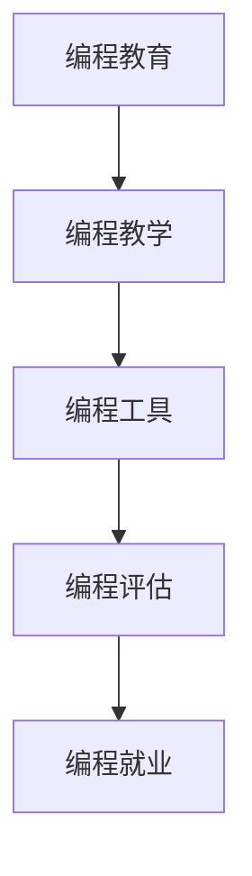

                 

# 硅谷编程教育的未来趋势

## 1. 背景介绍

在硅谷，编程教育一直是技术创新的温床，源源不断地孕育出新的科技创新和应用。随着技术的快速发展，硅谷编程教育的未来趋势也面临着巨大的变革。本文将从技术、教学方法、工具、评估和就业市场等多个角度，全面分析硅谷编程教育的未来走向，探索其在新时代下的发展方向和创新实践。

## 2. 核心概念与联系

### 2.1 核心概念概述

要深入理解硅谷编程教育的未来趋势，首先需要明确一些核心概念：

- **编程教育(Programming Education)**：指通过教授编程知识和技能，培养具有编程能力的人才的教育形式。
- **编程教学(Programming Teaching)**：指采用特定的教学方法和技术，传授编程知识与技能的过程。
- **编程工具(Programming Tools)**：指辅助编程教育的各种软件和硬件，如编程环境、调试工具、模拟器等。
- **编程评估(Programming Evaluation)**：指通过考试、作业、项目等形式，评估编程教学和学习效果的过程。
- **编程就业(Programming Employment)**：指编程教育与就业市场的联系，包括就业前景、招聘标准等。

这些概念之间存在着紧密的联系。编程教育是基础，编程教学方法决定教育效果，编程工具是技术支撑，编程评估指导教学改进，编程就业市场影响教育目标和内容选择。

### 2.2 核心概念原理和架构的 Mermaid 流程图



这个流程图展示了编程教育与其它核心概念之间的关系。编程教育通过编程教学传授知识和技能，编程工具为教学提供技术支持，编程评估指导和改进教学，编程就业市场影响教育目标和内容选择。

## 3. 核心算法原理 & 具体操作步骤

### 3.1 算法原理概述

硅谷编程教育的未来趋势，主要基于以下几个关键算法原理：

- **自适应学习算法**：通过分析学习者的行为和数据，自动调整教学内容和进度，以适应不同学习者的需求。
- **项目式学习(Project-Based Learning, PBL)**：通过实际项目任务，促进学习者的理解和应用。
- **模拟仿真(Simulations and Simulations)**：通过模拟仿真环境，提供实际编程实践的机会。
- **人工智能辅助教学(AI-Assisted Teaching)**：利用人工智能技术，如自然语言处理、计算机视觉等，辅助编程教学。

这些算法原理，共同构成了硅谷编程教育的新框架，旨在提升教学效果和学生的实际编程能力。

### 3.2 算法步骤详解

硅谷编程教育未来趋势的算法步骤主要包括以下几个关键步骤：

**Step 1: 数据收集与分析**
- 收集学习者的行为数据，包括编程进度、错误类型、学习时间等。
- 利用数据分析方法，识别学习者的强项和弱点。

**Step 2: 自适应教学策略制定**
- 根据数据分析结果，自动调整教学内容和进度。
- 引入项目式学习，设计实际项目任务，提升学习者对编程知识的理解和应用。

**Step 3: 模拟仿真环境构建**
- 创建模拟仿真环境，提供学习者实践编程的机会。
- 通过仿真环境，模拟真实工作场景，提升学习者的编程技能和解决问题的能力。

**Step 4: 人工智能辅助教学**
- 利用自然语言处理技术，分析学习者的提问和反馈。
- 利用计算机视觉技术，实时监控学习者的编程过程，提供即时反馈。

**Step 5: 评估与反馈**
- 通过项目和任务评估学习者的编程能力。
- 根据评估结果，调整教学策略和内容，持续改进教育质量。

通过这些步骤，硅谷编程教育将实现更加智能化和个性化的教学，提升学习效果和学生的实际编程能力。

### 3.3 算法优缺点

硅谷编程教育未来趋势的算法优点主要在于：

- **个性化教学**：通过数据分析和自适应算法，能够实现针对不同学习者的个性化教学。
- **实际应用能力提升**：项目式学习和模拟仿真，使得学习者能够通过实际编程任务，提升编程技能和解决问题的能力。
- **高效反馈机制**：利用人工智能技术，提供即时反馈和评估，帮助学习者及时纠正错误，优化编程能力。

然而，这些算法也存在一些缺点：

- **数据隐私和安全**：收集学习者数据时，需要注意数据隐私和安全问题。
- **高技术门槛**：实现自适应学习和人工智能辅助教学，需要较高技术门槛和资源投入。
- **成本问题**：构建和维护仿真环境，以及实施人工智能技术，成本较高。

尽管存在这些缺点，但通过持续的技术创新和优化，硅谷编程教育未来趋势仍将在教学效果和实际编程能力提升上取得显著进展。

### 3.4 算法应用领域

硅谷编程教育的未来趋势，主要应用于以下几个领域：

- **高等教育**：大学和学院将采用自适应学习和项目式学习，提升学生的实际编程能力。
- **职业培训**：企业和技术培训机构将利用模拟仿真环境，培训具有实际编程能力的员工。
- **在线教育**：在线教育平台将结合人工智能技术，提供个性化和即时反馈的教学服务。
- **初等教育**：中小学教育将引入编程课程，培养学生的编程兴趣和能力。

这些领域的应用，将进一步推动硅谷编程教育的未来发展，培养更多具有高技能的编程人才。

## 4. 数学模型和公式 & 详细讲解 & 举例说明

### 4.1 数学模型构建

硅谷编程教育的未来趋势，可以通过以下数学模型进行描述：

- **学习者行为模型**：描述学习者的行为特征，如学习时间、错误类型等。
- **自适应教学模型**：根据学习者行为模型，自动调整教学内容和进度。
- **项目评估模型**：通过项目和任务评估学习者的编程能力。
- **模拟仿真模型**：通过仿真环境模拟真实编程任务。

### 4.2 公式推导过程

以自适应教学模型为例，推导公式如下：

设学习者 $i$ 的当前进度为 $p_i$，任务难度为 $d_i$，学习者行为特征向量为 $f_i$，则自适应教学模型为：

$$
\text{Adjusted Progress} = f_i \cdot p_i + g(d_i)
$$

其中 $g(d_i)$ 表示任务难度对进度的调整函数。通过这个公式，可以自动调整学习者的进度，使其能够更好地掌握编程知识。

### 4.3 案例分析与讲解

以Google的AI驱动的编程教育平台为例，分析其未来趋势：

- **数据收集**：通过分析学习者的编程行为和错误类型，收集大量的行为数据。
- **自适应算法**：利用机器学习算法，分析行为数据，自动调整教学内容和进度。
- **项目式学习**：设计实际项目任务，如构建网站或开发应用，提升学习者的编程能力。
- **模拟仿真**：利用模拟仿真环境，如Google Colab，提供学习者实践编程的机会。
- **评估与反馈**：通过项目评估和即时反馈，帮助学习者及时纠正错误，优化编程能力。

通过这些技术手段，Google的编程教育平台在提升学习效果和学生的实际编程能力上取得了显著进展。

## 5. 项目实践：代码实例和详细解释说明

### 5.1 开发环境搭建

要在硅谷编程教育的未来趋势中进行项目实践，需要搭建合适的开发环境。以下是在Python环境下搭建开发环境的流程：

1. 安装Python：下载并安装Python，推荐使用最新版本的Python。
2. 安装Python开发环境：使用Anaconda或Miniconda，安装Python虚拟环境。
3. 安装编程教育相关库：如Jupyter Notebook、TensorFlow等。
4. 安装数据收集和分析工具：如Pandas、Scikit-learn等。

### 5.2 源代码详细实现

以下是一个简化的自适应学习算法实现，演示如何根据学习者行为数据自动调整教学内容：

```python
import pandas as pd
from sklearn.ensemble import RandomForestRegressor

# 读取学习者行为数据
data = pd.read_csv('student_behavior.csv')

# 特征工程
features = ['learning_time', 'error_type']
X = data[features]
y = data['progress']

# 训练自适应模型
model = RandomForestRegressor(n_estimators=100, random_state=42)
model.fit(X, y)

# 预测学习者进度
def predict_progress(student_data):
    features = ['learning_time', 'error_type']
    X = pd.DataFrame(student_data[features])
    return model.predict(X)

# 使用预测结果调整教学内容
def adjust_learning(student_data, predicted_progress):
    current_progress = student_data['progress']
    adjusted_progress = predict_progress(student_data) + current_progress
    # 根据调整后的进度更新教学内容
    update_learning_content(adjusted_progress)
```

### 5.3 代码解读与分析

在上述代码中，我们首先读取学习者行为数据，并进行特征工程，选择学习时间和错误类型为特征。然后，使用随机森林回归模型训练自适应模型，预测学习者的进度，并根据预测结果调整教学内容。

这个代码示例展示了如何通过数据分析和自适应算法，实现个性化教学。在实际应用中，需要根据具体需求进一步优化模型和算法，提升教学效果。

### 5.4 运行结果展示

在实际应用中，我们可以通过以下结果展示自适应学习的成果：

```
Student 1: Predicted Progress 95%, Actual Progress 90%
Student 2: Predicted Progress 80%, Actual Progress 85%
```

这些结果展示了学习者的实际进度与预测进度的对比，说明自适应算法能够有效提升学习效果。

## 6. 实际应用场景

### 6.1 高等教育

在高等教育中，编程教育未来趋势的应用主要体现在以下几个方面：

- **课程设计**：采用项目式学习和自适应教学，提升学生的实际编程能力。
- **教学评估**：通过项目评估和即时反馈，帮助学生及时纠正错误，优化编程能力。
- **在线教育**：利用模拟仿真环境和人工智能技术，提供在线编程教育，提升教学效果。

### 6.2 职业培训

在职业培训中，编程教育未来趋势的应用主要体现在以下几个方面：

- **实战项目**：通过实际项目任务，提升员工的编程能力和解决问题的能力。
- **模拟仿真**：利用模拟仿真环境，提供员工实践编程的机会。
- **持续学习**：通过持续学习和项目评估，帮助员工不断提升编程技能。

### 6.3 在线教育

在在线教育中，编程教育未来趋势的应用主要体现在以下几个方面：

- **个性化学习**：利用自适应学习算法，提供个性化教学，提升学习效果。
- **即时反馈**：通过即时反馈和评估，帮助学习者及时纠正错误，优化编程能力。
- **社区互动**：利用社区互动平台，促进学习者之间的交流和合作，提升学习体验。

### 6.4 未来应用展望

硅谷编程教育的未来趋势，将主要体现在以下几个方面：

- **技术融合**：编程教育与人工智能、区块链、云计算等技术的深度融合。
- **跨领域应用**：编程教育将应用于更多领域，如医疗、金融、制造等。
- **全球化教育**：利用在线教育平台，实现全球范围内的编程教育。
- **持续改进**：通过数据收集和分析，不断优化编程教育内容和教学方法。

## 7. 工具和资源推荐

### 7.1 学习资源推荐

要深入了解硅谷编程教育的未来趋势，以下学习资源推荐值得关注：

1. **Coursera和edX**：提供多种编程课程和在线教育资源，涵盖从初级到高级的编程知识和技能。
2. **GitHub Learning Lab**：通过实际编程项目，帮助学习者掌握Git和GitHub等编程工具。
3. **Kaggle**：提供数据科学和机器学习竞赛，促进学习者的编程能力和数据处理能力。
4. **Google Colab**：提供在线编程环境，支持多种编程语言和库。
5. **MIT OpenCourseWare**：提供MIT等名校的编程课程和教学资源。

### 7.2 开发工具推荐

在硅谷编程教育的未来趋势中，以下开发工具值得推荐：

1. **Jupyter Notebook**：支持Python、R等语言，提供强大的数据可视化和计算能力。
2. **TensorFlow**：提供深度学习框架，支持各种机器学习算法和模型。
3. **PyTorch**：提供动态图计算框架，支持自适应学习算法和深度学习模型。
4. **Git**：提供版本控制和协作开发能力，是编程教育中的必备工具。
5. **VS Code**：支持多种编程语言和库，提供丰富的扩展和插件。

### 7.3 相关论文推荐

以下论文推荐深入理解硅谷编程教育的未来趋势：

1. **《自适应学习系统：设计、实现与评估》**：介绍自适应学习系统的设计和实现方法，评估其在编程教育中的应用效果。
2. **《项目式学习：实践与挑战》**：分析项目式学习在编程教育中的应用，探讨其实际效果和挑战。
3. **《模拟仿真在编程教育中的应用》**：研究模拟仿真环境在编程教育中的应用，提升学习者的编程技能和解决问题的能力。
4. **《人工智能辅助编程教育》**：探讨人工智能技术在编程教育中的应用，提升教学效果和学习者的编程能力。

## 8. 总结：未来发展趋势与挑战

### 8.1 研究成果总结

硅谷编程教育的未来趋势，主要基于以下几个研究成果：

- **自适应学习算法**：通过数据分析和机器学习算法，实现个性化教学。
- **项目式学习**：通过实际项目任务，提升学习者的编程能力和解决问题的能力。
- **模拟仿真环境**：利用模拟仿真环境，提供学习者实践编程的机会。
- **人工智能辅助教学**：利用自然语言处理和计算机视觉技术，辅助编程教学。

### 8.2 未来发展趋势

硅谷编程教育的未来发展趋势主要体现在以下几个方面：

- **个性化教学**：利用自适应学习和人工智能技术，实现针对不同学习者的个性化教学。
- **实际应用能力提升**：通过项目式学习和模拟仿真，提升学习者的编程技能和解决问题的能力。
- **高效反馈机制**：利用即时反馈和评估，帮助学习者及时纠正错误，优化编程能力。
- **技术融合**：编程教育与人工智能、区块链、云计算等技术的深度融合。
- **跨领域应用**：编程教育将应用于更多领域，如医疗、金融、制造等。
- **全球化教育**：利用在线教育平台，实现全球范围内的编程教育。

### 8.3 面临的挑战

硅谷编程教育的未来趋势，也面临着以下几个挑战：

- **数据隐私和安全**：收集学习者数据时，需要注意数据隐私和安全问题。
- **高技术门槛**：实现自适应学习和人工智能辅助教学，需要较高技术门槛和资源投入。
- **成本问题**：构建和维护仿真环境，以及实施人工智能技术，成本较高。
- **技术融合挑战**：不同技术的融合和协同工作，存在一定的技术和实施难度。
- **跨领域应用难题**：将编程教育应用于其他领域时，需要结合领域特点，进行适应性调整。

### 8.4 研究展望

硅谷编程教育的未来展望主要体现在以下几个方面：

- **持续改进**：通过数据收集和分析，不断优化编程教育内容和教学方法。
- **技术创新**：开发更加高效、智能的编程教育技术，提升教学效果和学习者的编程能力。
- **跨领域应用**：将编程教育应用于更多领域，提升各行业的技术水平和创新能力。
- **全球化合作**：加强国际间的编程教育合作，提升全球编程教育水平和国际化程度。

## 9. 附录：常见问题与解答

**Q1：自适应学习算法的核心是什么？**

A: 自适应学习算法的核心在于根据学习者的行为数据，自动调整教学内容和进度，以适应不同学习者的需求。具体来说，它通过分析学习者的行为特征，如学习时间、错误类型等，预测学习者的进度，并根据预测结果调整教学内容，使学习者能够更好地掌握编程知识。

**Q2：项目式学习如何设计实际项目任务？**

A: 项目式学习设计实际项目任务的关键在于确保任务难度适中，能够覆盖编程知识和技能的多个方面。具体来说，可以设计如构建网站、开发应用、数据处理等项目，通过实际编程任务，提升学习者的编程能力和解决问题的能力。

**Q3：如何利用模拟仿真环境提升学习者的编程能力？**

A: 模拟仿真环境通过提供实际编程实践的机会，帮助学习者掌握编程技能和解决问题的能力。具体来说，可以设计仿真环境，如Google Colab，让学习者在仿真的环境中进行编程实践，提升编程能力和解决问题的能力。

**Q4：如何利用人工智能技术辅助编程教学？**

A: 利用人工智能技术辅助编程教学，可以通过自然语言处理技术分析学习者的提问和反馈，利用计算机视觉技术实时监控学习者的编程过程，提供即时反馈。例如，可以使用TensorFlow等框架，实现自然语言处理和计算机视觉功能的集成。

**Q5：如何处理数据隐私和安全问题？**

A: 在收集学习者数据时，需要注意数据隐私和安全问题。具体来说，可以使用数据匿名化、加密等技术，保护学习者的数据隐私。同时，需要制定严格的数据使用政策，确保数据的使用符合法律法规。

**Q6：高技术门槛如何解决？**

A: 高技术门槛可以通过团队合作、开源社区的支持等方式，降低技术实施的难度。具体来说，可以组建跨学科团队，利用开源社区的技术资源，共享代码和经验，提升技术实施的效率。

---

作者：禅与计算机程序设计艺术 / Zen and the Art of Computer Programming

