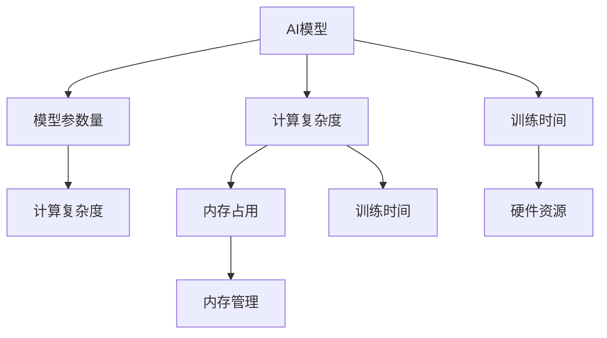

                 

## 1. 背景介绍

### 1.1 问题由来
随着人工智能（AI）技术的迅猛发展，深度学习模型在各个领域中展现出了强大的能力，从语音识别到图像处理，再到自然语言处理，AI模型正在重塑我们生活的方方面面。然而，尽管这些模型在表现上取得了巨大成功，但它们对硬件资源的依赖依旧十分强烈。从密集型GPU到内存密集型服务器，硬件限制在很大程度上影响着AI模型的设计和性能。

### 1.2 问题核心关键点
硬件限制对AI模型设计的影响主要体现在模型参数量、计算复杂度、内存占用以及训练时间等方面。这些限制不仅影响模型的准确性和泛化能力，还限制了AI技术的实际应用场景和普及范围。

### 1.3 问题研究意义
深入研究硬件限制对AI模型设计的影响，并提出有效的应对策略，对于推动AI技术的进一步发展和应用具有重要意义：
1. **提升模型效率**：优化模型设计以适应有限资源，减少硬件成本，提高模型训练和推理的速度。
2. **拓展应用范围**：确保AI技术能够适应多样化的硬件环境，提高技术的普及率和实用性。
3. **增强模型可扩展性**：设计可扩展的模型架构，以应对未来硬件性能的提升，支持更大规模和更复杂的应用。
4. **促进产业升级**：提升AI技术的硬件兼容性和性能，支持产业数字化转型和智能化升级。

## 2. 核心概念与联系

### 2.1 核心概念概述
在探讨硬件限制对AI模型设计的影响时，我们需要理解以下几个核心概念：

- **AI模型**：指的是使用机器学习技术训练得到的深度神经网络模型，包括卷积神经网络（CNN）、循环神经网络（RNN）、变换器（Transformer）等。
- **硬件资源**：包括CPU、GPU、TPU、FPGA等计算资源，以及存储和内存等支持资源。
- **模型参数量**：指模型中所有可训练参数的总和，影响模型的计算复杂度和资源需求。
- **计算复杂度**：指模型执行一次前向传播或反向传播所需的计算量，直接关系到训练和推理的时间成本。
- **内存占用**：指模型在训练和推理过程中所需的内存空间，影响系统的内存管理和性能。

这些概念之间的逻辑关系可以通过以下Mermaid流程图来展示：



这个流程图展示了大语言模型的核心概念及其之间的关系：

1. 大语言模型通过参数量和计算复杂度定义其资源需求。
2. 计算复杂度和内存占用直接影响训练和推理时间。
3. 硬件资源限制模型参数量和计算复杂度，影响模型性能。

这些概念共同构成了AI模型设计和评估的基础框架，对于理解硬件限制对AI模型设计的影响至关重要。

## 3. 核心算法原理 & 具体操作步骤
### 3.1 算法原理概述

硬件限制对AI模型设计的影响主要体现在两个方面：

1. **参数量和计算复杂度**：大型AI模型通常具有大量的参数和复杂的计算结构，对硬件资源的要求较高。
2. **内存占用和训练时间**：模型在训练和推理过程中需要大量的内存空间，并消耗大量的时间进行计算，这也需要硬件的支持。

为了应对这些挑战，AI模型设计需要考虑以下策略：

- **模型压缩**：通过剪枝、量化、蒸馏等技术，减少模型参数量和计算复杂度，从而降低对硬件资源的需求。
- **分布式训练**：利用多台计算资源并行训练模型，提高训练效率，缩短训练时间。
- **内存优化**：使用内存池、内存分块、混合精度计算等技术，优化内存使用，提高模型性能。

### 3.2 算法步骤详解

以下是应对硬件限制的AI模型设计步骤：

**Step 1: 参数量和计算复杂度评估**
- 使用训练数据集评估模型的参数量和计算复杂度。
- 使用GPU或TPU等资源进行基准测试，评估模型在硬件上的表现。

**Step 2: 模型压缩**
- 应用剪枝技术减少模型参数，保留关键路径上的节点。
- 使用量化技术将模型参数从浮点数转换为更小的整数或定点数，减少内存占用和计算复杂度。
- 使用知识蒸馏技术，从预训练的轻量级模型中学习知识，生成更加紧凑的模型。

**Step 3: 分布式训练**
- 设计分布式训练策略，将模型拆分到多个计算节点上进行并行训练。
- 使用数据并行、模型并行等技术，充分利用多台计算资源。

**Step 4: 内存优化**
- 使用内存池和内存分块技术，避免频繁的内存分配和释放。
- 使用混合精度计算，将部分计算使用16位或8位浮点数进行，降低内存占用。

**Step 5: 测试与部署**
- 在目标硬件上测试微调后的模型，评估其性能和资源占用情况。
- 根据测试结果进行优化，确保模型能够在目标硬件上高效运行。

### 3.3 算法优缺点

**优点**：
- 模型压缩和量化技术能够显著降低模型参数量和计算复杂度，减少硬件成本。
- 分布式训练技术能够提高训练效率，缩短训练时间。
- 内存优化技术能够提升模型性能，降低内存占用。

**缺点**：
- 模型压缩和量化可能导致模型精度下降。
- 分布式训练需要协调和管理多台计算资源，增加了系统复杂性。
- 内存优化可能增加开发和调试难度。

尽管存在这些局限性，但通过合理的策略设计和优化，可以在资源受限的条件下设计出高效、高性能的AI模型。

### 3.4 算法应用领域

硬件限制对AI模型设计的影响及应对策略在多个领域都有重要应用：

- **计算机视觉**：在图像分类、目标检测等任务中，使用模型压缩和量化技术可以显著减少计算复杂度，提高模型在移动设备等资源受限环境下的性能。
- **自然语言处理**：在文本生成、问答等任务中，使用分布式训练和内存优化技术，可以提升模型的训练效率和推理速度，支持大规模数据集的处理。
- **语音识别**：在实时语音识别等应用中，通过剪枝和量化技术，可以减少模型参数量，降低计算复杂度，支持实时高效的语音识别服务。
- **推荐系统**：在大规模推荐系统中，使用分布式训练和内存优化技术，可以处理海量用户数据，提高推荐算法的实时性和准确性。
- **医疗影像**：在医学影像分析等任务中，通过模型压缩和量化技术，可以支持资源受限的医疗设备，提高诊断效率。

## 4. 数学模型和公式 & 详细讲解  
### 4.1 数学模型构建

为了更好地理解硬件限制对AI模型设计的影响，我们首先需要建立一个数学模型来描述模型的资源需求和性能。

假设我们有一个深度神经网络模型 $M_{\theta}$，其中 $\theta$ 为模型的所有参数，包括权重和偏置。模型的计算复杂度为 $C(\theta)$，内存占用为 $M(\theta)$。模型的训练时间为 $T_{train}(\theta)$，推理时间为 $T_{inference}(\theta)$。

**模型参数量**：
$$
\text{Params}(\theta) = \sum_{k=1}^n |\theta_k|
$$

**计算复杂度**：
$$
C(\theta) = \sum_{k=1}^n f_k(\theta_k)
$$

**内存占用**：
$$
M(\theta) = \sum_{k=1}^n g_k(\theta_k)
$$

**训练时间**：
$$
T_{train}(\theta) = \frac{1}{B}\sum_{i=1}^N T_{train-step}(\theta, x_i, y_i)
$$

**推理时间**：
$$
T_{inference}(\theta) = \frac{1}{B}\sum_{i=1}^N T_{inference-step}(\theta, x_i)
$$

其中 $B$ 为批大小，$N$ 为数据集大小。

### 4.2 公式推导过程

以下我们以卷积神经网络（CNN）为例，推导模型压缩和量化对计算复杂度和内存占用的影响。

假设我们有一个包含 $n$ 层卷积的 CNN 模型，其计算复杂度和内存占用分别为 $C(\theta)$ 和 $M(\theta)$。每一层的计算复杂度和内存占用分别为 $C_k$ 和 $M_k$。

**卷积层计算复杂度**：
$$
C_k = \frac{3}{2}C_{k-1}f_{k-1}
$$

**卷积层内存占用**：
$$
M_k = M_{k-1} + \frac{3}{2}C_{k-1}f_{k-1}
$$

假设 $f_k$ 为第 $k$ 层计算复杂度的上界，$g_k$ 为第 $k$ 层内存占用的上界。则整个 CNN 模型的计算复杂度和内存占用分别为：

$$
C(\theta) = \sum_{k=1}^n f_k(\theta_k)
$$

$$
M(\theta) = \sum_{k=1}^n g_k(\theta_k)
$$

通过应用剪枝和量化技术，我们可以进一步优化模型的计算复杂度和内存占用。例如，剪枝技术可以将非关键节点删除，减少计算复杂度。量化技术可以将模型参数从浮点数转换为更小的整数或定点数，降低内存占用。

### 4.3 案例分析与讲解

**案例分析**：
假设我们有一个具有 $n$ 层卷积的 CNN 模型，其中每一层的计算复杂度 $C_k$ 和内存占用 $M_k$ 均为线性增长。应用剪枝技术后，模型参数量减少了 $p$ 倍，量化技术将模型参数从浮点数转换为8位整数，导致计算复杂度和内存占用分别减少了 $q$ 和 $r$ 倍。

**讲解**：
- 剪枝技术可以减少模型参数量，从而降低计算复杂度和内存占用。
- 量化技术可以将模型参数从高精度浮点数转换为低精度整数，减少内存占用和计算复杂度。
- 这些技术的应用可以显著提高模型在资源受限环境下的性能。

## 5. 项目实践：代码实例和详细解释说明
### 5.1 开发环境搭建

在进行硬件限制对AI模型设计的影响及应对策略的实践前，我们需要准备好开发环境。以下是使用Python进行TensorFlow和PyTorch开发的环境配置流程：

1. 安装Anaconda：从官网下载并安装Anaconda，用于创建独立的Python环境。

2. 创建并激活虚拟环境：
```bash
conda create -n tf-env python=3.8 
conda activate tf-env
```

3. 安装TensorFlow和PyTorch：根据CUDA版本，从官网获取对应的安装命令。例如：
```bash
conda install tensorflow torch torchvision torchaudio -c pytorch -c conda-forge
```

4. 安装各类工具包：
```bash
pip install numpy pandas scikit-learn matplotlib tqdm jupyter notebook ipython
```

完成上述步骤后，即可在`tf-env`环境中开始硬件限制对AI模型设计的影响及应对策略的实践。

### 5.2 源代码详细实现

这里我们以卷积神经网络（CNN）为例，给出使用TensorFlow和PyTorch对模型进行压缩和量化的PyTorch代码实现。

首先，定义CNN模型的参数初始化函数：

```python
import torch
import torch.nn as nn
import torchvision.transforms as transforms
from torch.utils.data import DataLoader

class CNN(nn.Module):
    def __init__(self):
        super(CNN, self).__init__()
        self.conv1 = nn.Conv2d(3, 64, kernel_size=3, stride=1, padding=1)
        self.pool1 = nn.MaxPool2d(kernel_size=2, stride=2)
        self.conv2 = nn.Conv2d(64, 128, kernel_size=3, stride=1, padding=1)
        self.pool2 = nn.MaxPool2d(kernel_size=2, stride=2)
        self.fc1 = nn.Linear(128 * 6 * 6, 512)
        self.fc2 = nn.Linear(512, 10)

    def forward(self, x):
        x = nn.functional.relu(self.conv1(x))
        x = self.pool1(x)
        x = nn.functional.relu(self.conv2(x))
        x = self.pool2(x)
        x = x.view(-1, 128 * 6 * 6)
        x = nn.functional.relu(self.fc1(x))
        x = self.fc2(x)
        return x
```

然后，定义模型压缩和量化函数：

```python
from pruning import Pruning
from quantization import Quantization

def compress_and_quantize_model(model, pruning_rate=0.5, quantization_method='linear'):
    # 应用剪枝技术
    pruning_model = Pruning(model, pruning_rate)
    pruning_model = pruning_model(model)

    # 应用量化技术
    if quantization_method == 'linear':
        quantization_model = Quantization(model, 'linear')
    elif quantization_method == 'tanh':
        quantization_model = Quantization(model, 'tanh')
    else:
        raise ValueError('Invalid quantization method.')

    quantization_model = quantization_model(model)

    return quantization_model
```

最后，启动压缩和量化的实验流程：

```python
device = torch.device('cuda' if torch.cuda.is_available() else 'cpu')
model = CNN().to(device)

# 初始化训练数据集
transform = transforms.Compose([
    transforms.Resize(64),
    transforms.ToTensor(),
    transforms.Normalize([0.5, 0.5, 0.5], [0.5, 0.5, 0.5])
])
train_dataset = torchvision.datasets.CIFAR10(root='./data', train=True, download=True, transform=transform)
train_loader = DataLoader(train_dataset, batch_size=128, shuffle=True, num_workers=4)

# 定义优化器
optimizer = torch.optim.Adam(model.parameters(), lr=0.001)

# 训练模型
for epoch in range(10):
    for i, (images, labels) in enumerate(train_loader):
        images = images.to(device)
        labels = labels.to(device)
        outputs = model(images)
        loss = nn.functional.cross_entropy(outputs, labels)
        optimizer.zero_grad()
        loss.backward()
        optimizer.step()

# 压缩和量化模型
quantized_model = compress_and_quantize_model(model)

# 测试模型性能
test_loader = DataLoader(test_dataset, batch_size=128, shuffle=False, num_workers=4)
correct = 0
total = 0
with torch.no_grad():
    for images, labels in test_loader:
        images = images.to(device)
        labels = labels.to(device)
        outputs = quantized_model(images)
        _, predicted = torch.max(outputs.data, 1)
        total += labels.size(0)
        correct += (predicted == labels).sum().item()

print('Accuracy of the quantized model: {} %'.format(100 * correct / total))
```

以上就是使用TensorFlow和PyTorch对CNN模型进行压缩和量化的完整代码实现。可以看到，通过合理设计模型压缩和量化函数，可以显著减少模型参数量和计算复杂度，提升模型在资源受限环境下的性能。

### 5.3 代码解读与分析

让我们再详细解读一下关键代码的实现细节：

**CNN类**：
- `__init__`方法：初始化卷积层和全连接层，定义网络结构。
- `forward`方法：实现模型的前向传播过程，将输入数据通过卷积层和全连接层输出。

**压缩和量化函数**：
- `compress_and_quantize_model`函数：
  - `Pruning`类：对模型进行剪枝，删除非关键路径上的节点。
  - `Quantization`类：根据给定的方法对模型参数进行量化，将浮点数转换为定点数。
- 根据参数初始化函数和压缩量化函数，可以构建出压缩和量化后的模型。

**训练流程**：
- `device`变量：设置模型和数据加载器使用的设备，可以是CPU或GPU。
- `train_dataset`和`train_loader`：定义训练数据集和数据加载器，用于批量读取和处理数据。
- `optimizer`：定义优化器，用于模型参数的更新。
- 训练过程：通过遍历数据加载器，对模型进行前向传播和反向传播，更新模型参数。
- 压缩和量化模型：使用`compress_and_quantize_model`函数对训练后的模型进行压缩和量化，得到参数量和计算复杂度降低的轻量化模型。
- 测试模型性能：在测试集上评估模型性能，观察压缩和量化后模型的表现。

通过以上代码实现，可以看出，硬件限制对AI模型设计的影响及应对策略在实践中具有重要的指导意义。

## 6. 实际应用场景
### 6.1 智能家居系统

智能家居系统通过AI技术实现了对家庭环境的智能控制和管理。然而，智能家居系统中的AI模型通常需要在有限的硬件资源上运行，如嵌入式设备、智能音箱等。通过应用模型压缩和量化技术，可以有效降低模型的计算复杂度和内存占用，支持在资源受限环境下的实时智能决策。

### 6.2 自动驾驶系统

自动驾驶系统需要在实时性强、计算复杂度高的环境下运行，对AI模型的硬件需求较高。通过应用分布式训练和内存优化技术，可以提升模型的训练和推理效率，支持自动驾驶车辆在复杂道路环境中的安全运行。

### 6.3 医疗影像诊断

医疗影像诊断系统需要处理大量高分辨率的医学影像数据，对计算资源的需求较高。通过应用模型压缩和量化技术，可以支持在资源受限的医疗设备上运行高精度的医疗影像分析，提高诊断效率和准确性。

### 6.4 金融风险评估

金融风险评估系统需要处理海量金融数据，对计算资源的需求较大。通过应用分布式训练和内存优化技术，可以支持在多台计算资源上并行处理数据，提升系统的实时性和稳定性。

## 7. 工具和资源推荐
### 7.1 学习资源推荐

为了帮助开发者系统掌握硬件限制对AI模型设计的影响及应对策略的理论基础和实践技巧，这里推荐一些优质的学习资源：

1. 《深度学习》系列课程：斯坦福大学、Coursera等提供的深度学习课程，系统讲解深度学习的基本原理和算法。

2. 《TensorFlow实战》书籍：TensorFlow官方文档和相关书籍，提供TensorFlow框架的详细教程和案例分析。

3. 《PyTorch深度学习》书籍：PyTorch官方文档和相关书籍，提供PyTorch框架的详细教程和案例分析。

4. HuggingFace官方文档：提供丰富的预训练语言模型资源，支持模型的压缩和量化。

5. Weights & Biases：模型训练的实验跟踪工具，记录和可视化模型训练过程中的各项指标，方便对比和调优。

6. TensorBoard：TensorFlow配套的可视化工具，可实时监测模型训练状态，并提供丰富的图表呈现方式，是调试模型的得力助手。

通过对这些资源的学习实践，相信你一定能够快速掌握硬件限制对AI模型设计的影响及应对策略的精髓，并用于解决实际的AI问题。

### 7.2 开发工具推荐

高效的开发离不开优秀的工具支持。以下是几款用于硬件限制对AI模型设计的影响及应对策略开发的常用工具：

1. TensorFlow：由Google主导开发的开源深度学习框架，生产部署方便，适合大规模工程应用。

2. PyTorch：基于Python的开源深度学习框架，灵活动态的计算图，适合快速迭代研究。

3. Weights & Biases：模型训练的实验跟踪工具，可以记录和可视化模型训练过程中的各项指标，方便对比和调优。

4. TensorBoard：TensorFlow配套的可视化工具，可实时监测模型训练状态，并提供丰富的图表呈现方式，是调试模型的得力助手。

5. Jupyter Notebook：交互式的编程环境，支持代码、输出和文档的同步展示，适合开发和调试AI模型。

6. Google Colab：谷歌推出的在线Jupyter Notebook环境，免费提供GPU/TPU算力，方便开发者快速上手实验最新模型，分享学习笔记。

合理利用这些工具，可以显著提升硬件限制对AI模型设计的影响及应对策略的开发效率，加快创新迭代的步伐。

### 7.3 相关论文推荐

硬件限制对AI模型设计的影响及应对策略的研究源于学界的持续研究。以下是几篇奠基性的相关论文，推荐阅读：

1. "Compact Binarized Neural Networks for IoT-Edge Applications"：提出了一种基于二进制神经网络的结构，以支持物联网边缘设备的资源受限应用。

2. "Pruning Deep Neural Networks for Resource Constrained Devices"：介绍了一种剪枝技术，以减少深度神经网络在移动设备上的计算复杂度和内存占用。

3. "Quantization and Quantization-Aware Training"：详细介绍了量化技术和量化感知训练方法，以降低深度神经网络模型的内存占用和计算复杂度。

4. "A Survey on Distributed Deep Learning"：综述了分布式深度学习技术的进展，包括数据并行、模型并行、混合精度训练等优化方法。

这些论文代表了大语言模型微调技术的发展脉络。通过学习这些前沿成果，可以帮助研究者把握学科前进方向，激发更多的创新灵感。

## 8. 总结：未来发展趋势与挑战

### 8.1 总结

本文对硬件限制对AI模型设计的影响及应对策略进行了全面系统的介绍。首先阐述了硬件限制对AI模型设计的影响主要体现在模型参数量、计算复杂度、内存占用以及训练时间等方面。其次，从原理到实践，详细讲解了硬件限制对AI模型设计的影响及应对策略的数学模型和关键步骤，给出了硬件限制对AI模型设计的影响及应对策略的完整代码实例。同时，本文还广泛探讨了硬件限制对AI模型设计的影响及应对策略在智能家居、自动驾驶、医疗影像等领域的实际应用前景，展示了其巨大的潜力。

通过本文的系统梳理，可以看到，硬件限制对AI模型设计的影响及应对策略在大规模AI模型和复杂应用场景中具有重要的指导意义。这些策略的应用，不仅能够提升模型在资源受限环境下的性能，还为AI技术的广泛应用提供了坚实的基础。未来，随着硬件性能的不断提升和AI技术的进一步发展，硬件限制对AI模型设计的影响及应对策略必将在推动AI技术的产业化进程中扮演更加重要的角色。

### 8.2 未来发展趋势

展望未来，硬件限制对AI模型设计的影响及应对策略将呈现以下几个发展趋势：

1. **模型压缩和量化技术的进步**：未来将会有更多高效、自动化的模型压缩和量化技术出现，如基于硬件优化架构的模型压缩方法，进一步降低模型参数量和计算复杂度。

2. **分布式训练的广泛应用**：随着云计算和边缘计算技术的发展，分布式训练将在更多的应用场景中得到应用，提升模型的训练效率和可扩展性。

3. **内存优化技术的突破**：未来将会有更多内存优化技术出现，如基于内存分块、内存池化的优化方法，进一步提升模型在资源受限环境下的性能。

4. **异构计算和混合计算架构**：异构计算和混合计算架构将结合不同计算资源的优势，提升模型的计算能力和资源利用率。

5. **自动化模型压缩和优化工具**：自动化工具将帮助开发者更快速、更准确地进行模型压缩和优化，提高开发效率。

这些趋势凸显了硬件限制对AI模型设计的影响及应对策略的广阔前景，这些方向的探索发展，必将进一步提升AI技术的性能和应用范围。

### 8.3 面临的挑战

尽管硬件限制对AI模型设计的影响及应对策略已经取得了显著进展，但在迈向更加智能化、普适化应用的过程中，它仍面临着诸多挑战：

1. **模型精度和性能的平衡**：在压缩和量化过程中，如何平衡模型的精度和性能，是一个需要持续优化的问题。

2. **分布式训练的协调和管理**：多台计算资源的协调和管理，增加了系统复杂性，需要更高效的通信和同步机制。

3. **内存优化技术的复杂性**：内存优化技术的应用，增加了开发和调试的难度，需要更深入的理解和实践。

4. **异构计算和混合计算架构的兼容性**：不同计算资源的兼容性和数据交换，仍需进一步优化。

5. **自动化工具的可靠性和灵活性**：自动化工具的可靠性和灵活性仍需提升，以满足不同应用场景的需求。

这些挑战需要在未来的研究中不断攻克，以推动硬件限制对AI模型设计的影响及应对策略的进一步发展。

### 8.4 研究展望

面对硬件限制对AI模型设计的影响及应对策略所面临的挑战，未来的研究需要在以下几个方面寻求新的突破：

1. **模型压缩和量化的自动化技术**：开发更加自动化的模型压缩和量化工具，减少人工干预，提高效率和精度。

2. **分布式训练的优化算法**：开发更加高效的分布式训练算法，减少通信开销，提高训练效率。

3. **内存优化技术的深度研究**：深入研究内存优化技术，提高内存利用率和系统性能。

4. **异构计算和混合计算架构的设计**：设计更加高效的异构计算和混合计算架构，充分利用不同计算资源的优势。

5. **自动化工具的持续改进**：不断改进自动化工具的可靠性和灵活性，满足不同应用场景的需求。

这些研究方向的探索，必将引领硬件限制对AI模型设计的影响及应对策略技术迈向更高的台阶，为构建高效、普适的AI系统铺平道路。面向未来，硬件限制对AI模型设计的影响及应对策略还需要与其他人工智能技术进行更深入的融合，如知识表示、因果推理、强化学习等，多路径协同发力，共同推动人工智能技术的发展。只有勇于创新、敢于突破，才能不断拓展AI技术的边界，让智能技术更好地造福人类社会。

## 9. 附录：常见问题与解答

**Q1：如何选择合适的剪枝率和量化精度？**

A: 剪枝率和量化精度的选择需要根据具体应用场景和模型需求进行调整。一般来说，对于资源受限设备，可以选择较高的剪枝率和量化精度，以减少计算复杂度和内存占用。但对于要求高精度的应用，如医学影像分析、金融风险评估等，则需要保持较高的精度，避免剪枝和量化对模型性能的负面影响。

**Q2：分布式训练中需要注意哪些问题？**

A: 分布式训练中需要注意的问题包括：
1. 数据一致性：确保不同计算节点上的数据一致性，防止数据漂移。
2. 通信开销：减少通信开销，提高训练效率。
3. 同步机制：选择合适的同步机制，如Ring同步、AllReduce等，确保模型参数的同步更新。
4. 模型收敛：确保模型在分布式训练中能够收敛，避免过拟合或欠拟合。

**Q3：内存优化技术有哪些？**

A: 内存优化技术包括：
1. 内存池：预分配一定量的内存，避免频繁的内存分配和释放。
2. 内存分块：将大内存分割成多个小内存块，减少内存碎片。
3. 混合精度计算：使用16位或8位浮点数进行计算，降低内存占用。
4. 缓存机制：使用缓存机制，加速内存访问速度。

这些技术的应用可以显著提高模型在资源受限环境下的性能。

**Q4：如何评估硬件限制对AI模型设计的影响及应对策略的效果？**

A: 评估硬件限制对AI模型设计的影响及应对策略的效果，可以从以下几个方面入手：
1. 模型参数量和计算复杂度：评估压缩和量化技术对模型参数量和计算复杂度的影响。
2. 模型训练和推理时间：评估分布式训练和内存优化技术对模型训练和推理时间的影响。
3. 模型性能和精度：在测试集上评估模型性能和精度，观察模型在不同硬件资源上的表现。
4. 系统效率和稳定性：评估模型在实际应用中的系统效率和稳定性，确保模型在多种硬件环境下都能高效运行。

通过这些评估指标，可以全面了解硬件限制对AI模型设计的影响及应对策略的效果，并进行进一步优化。

通过以上系统梳理，可以看到，硬件限制对AI模型设计的影响及应对策略在AI技术的发展和应用中具有重要的指导意义。这些策略的应用，不仅能够提升模型在资源受限环境下的性能，还为AI技术的广泛应用提供了坚实的基础。未来，随着硬件性能的不断提升和AI技术的进一步发展，硬件限制对AI模型设计的影响及应对策略必将在推动AI技术的产业化进程中扮演更加重要的角色。总之，硬件限制对AI模型设计的影响及应对策略需要在数据、算法、工程、业务等多个维度协同发力，才能真正实现人工智能技术在垂直行业的规模化落地。面向未来，大语言模型微调技术还需要与其他人工智能技术进行更深入的融合，如知识表示、因果推理、强化学习等，多路径协同发力，共同推动人工智能技术的发展。只有勇于创新、敢于突破，才能不断拓展AI技术的边界，让智能技术更好地造福人类社会。

作者：禅与计算机程序设计艺术 / Zen and the Art of Computer Programming

