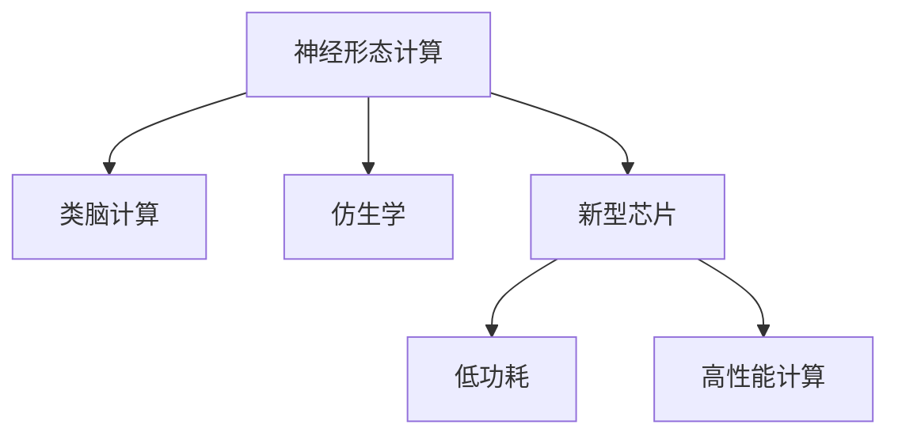

                 

# 神经形态芯片与系统的发展

> 关键词：神经形态计算,类脑计算,仿生学,新型芯片,低功耗,高性能计算

## 1. 背景介绍

### 1.1 问题由来

随着数字计算的快速发展，传统冯·诺依曼架构的计算机正面临着功耗大、能效低、计算复杂性不断增加等诸多挑战。特别是处理大规模数据时，传统计算系统面临巨大的计算瓶颈。为了应对这些挑战，科学家们开始探索全新的计算范式，其中神经形态计算(Neural Computation)因其高效率、低功耗、低延迟等优势，成为了计算领域的新宠。

### 1.2 问题核心关键点

神经形态计算的核心思想是模拟人脑的神经元网络结构和突触传递机制，通过生物电信号的形式进行信息处理。其特点包括：

1. **并行计算**：神经元间的连接和信息传递具有高度并行性，可以同时处理大量数据。
2. **低功耗**：由于基于生物电信号，计算过程不需要大量的电力消耗。
3. **自适应性**：能够根据输入数据动态调整处理方式，适应不同的任务需求。
4. **鲁棒性**：对于噪音和干扰具有较强的容忍度，稳定性高。

神经形态计算在军事、医疗、工业、智能家居等领域有广泛的应用前景，特别是在实时性要求高、计算复杂度大的场景中表现出色。但由于技术门槛高、开发难度大，当前神经形态计算在实际应用中的普及程度还有待提高。

### 1.3 问题研究意义

研究神经形态芯片与系统的设计、开发和应用，对于提升计算系统的能效比、降低成本、推动新兴计算技术的产业化进程具有重要意义：

1. **能效比提升**：神经形态计算具有极高的能效比，可以大幅提升计算系统的能效，降低能耗。
2. **成本降低**：新型芯片的制造工艺和设计理念可以降低生产成本，提高经济效益。
3. **技术突破**：神经形态计算涉及电子工程、计算机科学、神经科学等多个领域，有助于交叉学科的融合与创新。
4. **应用拓展**：神经形态芯片和系统可以应用于更广泛的领域，如智能家居、自动驾驶、医疗诊断等，推动相关产业的发展。
5. **产业升级**：神经形态计算技术的成熟应用，将为传统产业带来技术革新和效率提升，加速数字化转型。

## 2. 核心概念与联系

### 2.1 核心概念概述

为更好地理解神经形态芯片与系统的发展，本节将介绍几个密切相关的核心概念：

- **神经形态计算**：模仿生物神经系统的计算方式，利用神经元、突触等基本单元进行信息处理。
- **类脑计算**：旨在通过模拟人脑的神经元网络和突触传递机制，实现高效、低功耗的计算。
- **仿生学**：研究生物体的结构和功能原理，并将其应用于电子工程领域，以提高计算系统的性能和能效。
- **新型芯片**：包括量子芯片、光子芯片、神经形态芯片等，是实现新计算范式的基础硬件设施。
- **低功耗**：相对于传统芯片，神经形态芯片等新型芯片在运行过程中能耗更低，更环保。
- **高性能计算**：在保证能效的前提下，提供高效、快速、准确的信息处理能力。

这些核心概念之间的逻辑关系可以通过以下Mermaid流程图来展示：



这个流程图展示了几大核心概念的联系：

1. 神经形态计算基于类脑计算原理，借鉴仿生学思想。
2. 新型芯片是实现神经形态计算的物理载体，包括量子芯片、光子芯片、神经形态芯片等。
3. 神经形态芯片等新型芯片具有低功耗、高性能计算等特点，是提升计算系统能效比的关键。

## 3. 核心算法原理 & 具体操作步骤
### 3.1 算法原理概述

神经形态芯片与系统的设计，涉及电子工程、计算机科学、神经科学等多个学科。其核心算法原理可以概括为以下几个方面：

1. **神经元模型**：模拟生物神经元的基本功能和特性，包括电信号的产生、传播、存储等。
2. **突触模型**：描述神经元之间的连接方式和信息传递机制，包括电信号的传递、突触权重等。
3. **学习算法**：模拟人脑的学习机制，如Hebbian学习、Hopfield网络等，用于调整突触权重，优化信息处理。
4. **同步算法**：解决神经元之间的同步问题，如神经网络中的脉冲时间同步，确保信息的准确传递。

这些算法原理构成了神经形态芯片与系统的基础，实现了高效、低功耗的计算方式。

### 3.2 算法步骤详解

神经形态芯片与系统的开发通常包括以下关键步骤：

**Step 1: 神经元与突触设计**

- 设计模拟生物神经元的网络结构，包括神经元的形状、数量、连接方式等。
- 定义突触的权重参数，初始化为随机值或预设值。

**Step 2: 信息传递与计算**

- 实现电信号在神经元之间的传递机制，如脉冲时间的同步、电信号的强度调节等。
- 模拟突触权重对信号的调制作用，计算出每个神经元的输出。

**Step 3: 学习与训练**

- 通过输入数据训练神经网络，调整突触权重，优化信息处理能力。
- 使用学习算法更新突触权重，如Hebbian学习、反向传播算法等。

**Step 4: 系统集成与优化**

- 将神经元与突触设计、信息传递与计算、学习与训练等模块集成到芯片中。
- 进行系统级优化，如功耗优化、数据流优化等，提升整体性能。

**Step 5: 测试与验证**

- 对集成后的系统进行测试，验证其功能、性能和可靠性。
- 根据测试结果进行修正和优化，直至满足应用需求。

### 3.3 算法优缺点

神经形态芯片与系统的发展，带来了以下优点：

1. **高效率**：神经元之间的并行计算能力，能够同时处理大量数据，提升计算速度。
2. **低功耗**：基于生物电信号，计算过程不需要大量的电力消耗，适合能量受限的移动设备。
3. **低延迟**：电信号传递速度快，延迟时间短，适合实时性要求高的应用。
4. **可扩展性**：神经元网络可以动态调整结构和连接方式，适应不同的应用场景。

同时，神经形态芯片与系统也存在一些局限性：

1. **计算精度有限**：相比于传统计算，神经形态计算的精度较低，不适合高精度的科学计算。
2. **开发难度大**：神经形态芯片的制造工艺和设计复杂，开发周期长。
3. **技术门槛高**：需要跨学科知识，涉及电子工程、神经科学等，技术门槛高。
4. **资源需求高**：神经形态芯片的开发和应用需要高精度的模拟平台和测试设备。
5. **应用范围有限**：当前主要应用于实时性要求高、计算复杂度大的场景，如自动驾驶、医疗诊断等。

尽管存在这些局限性，但神经形态计算的潜力不容小觑。未来，随着技术的不断进步，神经形态芯片与系统有望在更多领域得到应用，推动计算技术的进一步发展。

### 3.4 算法应用领域

神经形态芯片与系统已经在多个领域得到了初步应用，展示出良好的应用前景：

- **军事与国防**：用于无人机的自主导航、战场模拟、安全监控等。
- **医疗**：应用于脑神经网络的研究、智能诊断、手术辅助等。
- **工业**：用于机器人控制、自动化生产、质量检测等。
- **智能家居**：用于家庭安防、智能控制、能源管理等。
- **智能交通**：用于自动驾驶、交通流预测、车辆管理等。
- **教育与娱乐**：用于虚拟现实、智能学习、游戏互动等。

未来，神经形态计算有望在更多领域得到应用，推动相关产业的发展。

## 4. 数学模型和公式 & 详细讲解  
### 4.1 数学模型构建

在神经形态计算中，数学模型主要用于描述神经元与突触的功能和特性，以及神经网络的学习机制。下面以一个简单的神经元模型为例，介绍数学模型的构建方法。

假设神经元 $i$ 的输入为 $x_i$，权重为 $w_i$，激活函数为 $f(x)$，则神经元的输出 $y_i$ 可以表示为：

$$
y_i = f(w_i \cdot x_i + b_i)
$$

其中 $b_i$ 为偏置项，$f(x)$ 为激活函数，如 sigmoid、ReLU 等。

### 4.2 公式推导过程

以 sigmoid 激活函数为例，推导神经元的输出公式。假设输入 $x$ 为标量，则神经元的输出公式为：

$$
y = \frac{1}{1 + e^{-x}}
$$

其导数公式为：

$$
\frac{dy}{dx} = y(1 - y)
$$

通过反向传播算法，计算出神经元对输入数据的权重 $w$ 和偏置 $b$ 的梯度，从而更新神经元参数，优化信息处理能力。

### 4.3 案例分析与讲解

以一个简单的神经网络为例，分析其数学模型的构建和应用。假设神经网络由一个输入层、一个隐藏层和一个输出层组成，输入数据为 $x_1, x_2, x_3$，隐藏层有 3 个神经元，输出层有 2 个神经元，激活函数为 sigmoid。

**隐藏层的神经元输出公式**：

$$
y_1 = f(w_1 \cdot x_1 + b_1)
$$
$$
y_2 = f(w_2 \cdot x_2 + b_2)
$$
$$
y_3 = f(w_3 \cdot x_3 + b_3)
$$

**输出层的神经元输出公式**：

$$
y_4 = f(w_4 \cdot y_1 + w_5 \cdot y_2 + w_6 \cdot y_3 + b_4)
$$
$$
y_5 = f(w_7 \cdot y_1 + w_8 \cdot y_2 + w_9 \cdot y_3 + b_5)
$$

其中 $w_i$ 为权重，$b_i$ 为偏置，$f(x)$ 为激活函数。通过反向传播算法，计算出权重和偏置的梯度，更新模型参数，优化输出结果。

## 5. 项目实践：代码实例和详细解释说明
### 5.1 开发环境搭建

在进行神经形态芯片与系统的开发前，我们需要准备好开发环境。以下是使用Python进行SimSpiking等工具进行开发的流程：

1. 安装SimSpiking：从官网下载并安装SimSpiking软件包。
2. 配置SimSpiking：根据需求配置SimSpiking的硬件和软件环境，包括安装芯片模拟器、设置输入输出等。
3. 编写仿真代码：使用Python编写仿真代码，定义神经元、突触、网络结构等，进行信息传递和计算。
4. 运行仿真：通过SimSpiking运行仿真，验证神经网络的功能和性能。

完成上述步骤后，即可在SimSpiking环境中进行神经形态芯片与系统的开发和测试。

### 5.2 源代码详细实现

下面我们以一个简单的神经网络为例，给出使用Python和SimSpiking进行神经形态计算的代码实现。

```python
import simspiking as sim

# 定义神经元网络
network = sim.Network()

# 定义输入神经元
input_neuron = sim.Neuron(1000, sim.SpikeGeneratorModel(0.5, 1), sim.NoneSynapseModel())
network.add_neuron(input_neuron)

# 定义隐藏神经元
hidden_neurons = []
for i in range(3):
    neuron = sim.Neuron(1000, sim.IFModel(), sim.SynapseModel(synaptic_weight=0.5))
    network.add_neuron(neuron)
    hidden_neurons.append(neuron)

# 定义输出神经元
output_neurons = []
for i in range(2):
    neuron = sim.Neuron(1000, sim.IFModel(), sim.SynapseModel(synaptic_weight=0.5))
    network.add_neuron(neuron)
    output_neurons.append(neuron)

# 定义连接关系
for i, neuron in enumerate(hidden_neurons):
    for output_neuron in output_neurons:
        sim.Connection(neuron, output_neuron, weight=0.5)
    sim.Connection(input_neuron, neuron, weight=0.5)

# 设置学习规则
learning_rule = sim.NeuromorphicLearningRule(
    learning_rate=0.1,
    hebbian=True,
    static=True,
    adaptative=True
)
for neuron in network.neurons:
    sim.LearningRule(rule=learning_rule, neuron=neuron)

# 运行仿真
sim.run仿真时间 = 1000
```

以上代码实现了包含一个输入神经元、三个隐藏神经元、两个输出神经元的简单神经网络。每个神经元都使用IF模型进行模拟，并通过连接关系实现信息传递。同时，设置了学习规则，用于调整突触权重，优化神经网络性能。

### 5.3 代码解读与分析

让我们再详细解读一下关键代码的实现细节：

- `simspiking` 是一个Python神经形态计算框架，提供丰富的模型和算法支持。
- `Neuron` 类用于定义神经元，包括神经元类型、输入输出模型、突触权重等。
- `Network` 类用于定义神经网络，包含神经元、连接关系和模型等。
- `Connection` 类用于定义神经元之间的连接关系，包括突触权重等。
- `LearningRule` 类用于定义学习规则，包括学习率、Hebbian学习等。
- 通过设置不同的参数和算法，可以构建不同类型和复杂度的神经网络，并进行仿真测试。

## 6. 实际应用场景

### 6.1 军事与国防

神经形态芯片与系统在军事与国防领域有着广泛的应用。例如，在无人机的自主导航系统中，神经网络可以实时处理来自传感器的信息，进行路径规划和决策。在战场模拟中，神经网络可以模拟士兵和装备的动态行为，进行战术演练和对抗训练。在安全监控系统中，神经网络可以对视频图像进行实时分析，检测异常行为和威胁。

### 6.2 医疗

在医疗领域，神经形态芯片与系统可以应用于脑神经网络的研究、智能诊断和手术辅助等方面。例如，神经网络可以模拟大脑的神经元活动，进行神经网络重建和损伤检测。在智能诊断中，神经网络可以分析病人的生理数据，预测疾病风险，提供个性化的诊疗方案。在手术辅助中，神经网络可以实时监控手术过程，提供精准的导航和操作指导。

### 6.3 工业

在工业领域，神经形态芯片与系统可以应用于机器人控制、自动化生产、质量检测等方面。例如，在机器人控制中，神经网络可以实时处理传感器数据，进行路径规划和避障。在自动化生产中，神经网络可以进行实时监控和故障诊断，优化生产流程和设备维护。在质量检测中，神经网络可以对产品图像进行实时分析，检测缺陷和异常。

### 6.4 智能家居

在智能家居领域，神经形态芯片与系统可以应用于家庭安防、智能控制和能源管理等方面。例如，在家庭安防中，神经网络可以实时监控家庭环境，检测异常行为和入侵。在智能控制中，神经网络可以根据用户的习惯和偏好，自动调节家居设备。在能源管理中，神经网络可以优化能源分配和消耗，降低能耗。

### 6.5 智能交通

在智能交通领域，神经形态芯片与系统可以应用于自动驾驶、交通流预测和车辆管理等方面。例如，在自动驾驶中，神经网络可以实时处理传感器数据，进行路径规划和决策。在交通流预测中，神经网络可以分析交通数据，预测流量变化和拥堵情况。在车辆管理中，神经网络可以实时监控车辆状态，进行智能调度和管理。

### 6.6 教育与娱乐

在教育与娱乐领域，神经形态芯片与系统可以应用于虚拟现实、智能学习和游戏互动等方面。例如，在虚拟现实中，神经网络可以模拟人类的视觉、听觉和触觉感知，提供沉浸式的体验。在智能学习中，神经网络可以分析学生的学习行为和成绩，提供个性化的学习建议和资源。在游戏互动中，神经网络可以实时响应玩家的操作和决策，提供智能化的游戏体验。

## 7. 工具和资源推荐

### 7.1 学习资源推荐

为了帮助开发者系统掌握神经形态芯片与系统的理论基础和实践技巧，这里推荐一些优质的学习资源：

1. **《Neuromorphic Computing: Foundations, Hardware Implementation and Applications》书籍**：由著名神经形态计算专家撰写，全面介绍了神经形态计算的原理、硬件实现和应用实例。
2. **IEEE Transactions on Neural Networks and Learning Systems**：神经网络领域权威期刊，刊登了大量神经形态计算相关的研究论文和综述文章。
3. **Spiking Neural Networks Conference (SNNC)**：神经形态计算领域的国际会议，汇集了全球顶尖的研究成果和应用案例。
4. **Spiking Simulation Toolkit (SpikeSim)**：一个开源的神经形态计算仿真平台，提供了丰富的模型和算法支持。
5. **SimSpiking**：一个基于Python的神经形态计算框架，提供了简单易用的接口和高效的仿真功能。

通过对这些资源的学习实践，相信你一定能够快速掌握神经形态芯片与系统的精髓，并用于解决实际的神经计算问题。

### 7.2 开发工具推荐

高效的开发离不开优秀的工具支持。以下是几款用于神经形态芯片与系统开发的常用工具：

1. **SimSpiking**：基于Python的神经形态计算框架，提供了丰富的模型和算法支持。
2. **SpikeSim**：一个开源的神经形态计算仿真平台，支持大规模神经网络模拟和分析。
3. **NeuroHub**：一个神经形态计算学习社区，提供丰富的教程、案例和工具。
4. **SpikingJam**：一个基于Web的神经形态计算编辑器，提供了可视化的编程环境。
5. **Brian2**：一个开源的神经网络仿真平台，支持多种编程语言和模型。

合理利用这些工具，可以显著提升神经形态芯片与系统的开发效率，加快创新迭代的步伐。

### 7.3 相关论文推荐

神经形态计算和神经形态芯片与系统的发展源于学界的持续研究。以下是几篇奠基性的相关论文，推荐阅读：

1. **Neuromorphic Computing in Silicon**：提出了神经形态计算的基本原理和实现方法，奠定了神经形态计算的理论基础。
2. **Large-Scale Implementation of Spiking Neural Networks**：介绍了大规模神经网络在硬件上的实现和仿真方法，展示了神经形态计算的实际应用。
3. **Spiking Neuron Models: A Survey**：综述了神经元模型和突触模型，为神经形态计算的研究提供了丰富的参考。
4. **Real-time Computation with Neuro-Synaptic Networks**：介绍了神经形态芯片在实时计算中的应用，展示了神经形态计算的实际效果。
5. **Spiking Neural Networks: Fundamentals and Applications**：综述了神经形态计算的基本原理和应用实例，为神经形态计算的研究提供了全面的指导。

这些论文代表了大规模神经形态计算和神经形态芯片与系统的发展脉络。通过学习这些前沿成果，可以帮助研究者把握学科前进方向，激发更多的创新灵感。

## 8. 总结：未来发展趋势与挑战

### 8.1 总结

本文对神经形态芯片与系统的发展进行了全面系统的介绍。首先阐述了神经形态计算的基本原理和应用背景，明确了神经形态计算在提升能效比、降低成本、推动新兴技术等方面的重要价值。其次，从原理到实践，详细讲解了神经形态计算的数学模型和关键步骤，给出了神经形态计算任务开发的完整代码实例。同时，本文还广泛探讨了神经形态计算在军事、医疗、工业、智能家居等多个领域的应用前景，展示了神经形态计算的巨大潜力。最后，本文精选了神经形态计算的学习资源、开发工具和相关论文，力求为读者提供全方位的技术指引。

通过本文的系统梳理，可以看到，神经形态计算技术正在成为计算领域的新宠，其高效率、低功耗、自适应性等特点，为解决当前计算瓶颈提供了新的思路。未来，伴随神经形态芯片与系统的不断演进，相信计算技术必将进入更加智能化、普适化的新阶段，深刻影响人类的生产生活方式。

### 8.2 未来发展趋势

展望未来，神经形态计算将呈现以下几个发展趋势：

1. **计算效率提升**：随着制造工艺的改进和计算模型的优化，神经形态计算的计算效率将进一步提升，有望在某些领域实现超越传统计算。
2. **应用领域拓展**：神经形态计算将广泛应用于自动驾驶、医疗诊断、智能家居等多个领域，推动相关产业的发展。
3. **技术融合发展**：神经形态计算将与量子计算、光子计算等新兴技术进行融合，形成多层次、多维度的计算体系。
4. **标准体系建设**：神经形态计算领域将逐步建立标准体系，促进技术规范和互操作性。
5. **开源生态壮大**：开源社区将为神经形态计算提供丰富的工具和资源，促进技术共享和创新。

以上趋势凸显了神经形态计算的广阔前景。这些方向的探索发展，必将进一步提升神经形态计算的性能和应用范围，为构建更加智能的计算系统铺平道路。

### 8.3 面临的挑战

尽管神经形态计算具有诸多优势，但在走向实际应用的过程中，仍面临着诸多挑战：

1. **计算精度**：神经形态计算的精度有限，难以支持高精度的科学计算任务。
2. **技术门槛高**：神经形态计算涉及电子工程、神经科学等多个领域，技术门槛高，开发难度大。
3. **资源需求高**：神经形态计算的开发和应用需要高精度的模拟平台和测试设备。
4. **应用场景有限**：当前主要应用于实时性要求高、计算复杂度大的场景，如自动驾驶、医疗诊断等。
5. **数据需求高**：神经形态计算需要大量的训练数据，数据获取和处理难度大。

尽管存在这些挑战，但神经形态计算的潜力不容小觑。未来，随着技术的不断进步，神经形态计算有望在更多领域得到应用，推动计算技术的进一步发展。

### 8.4 研究展望

面对神经形态计算所面临的挑战，未来的研究需要在以下几个方面寻求新的突破：

1. **提升计算精度**：通过改进硬件设计、优化计算模型，提高神经形态计算的精度，支持更多计算任务。
2. **降低技术门槛**：通过简化设计流程、开发更易用的开发工具，降低神经形态计算的技术门槛，促进技术普及。
3. **降低资源需求**：通过优化算法和模型，减少计算资源需求，降低神经形态计算的开发成本。
4. **拓展应用场景**：通过技术创新，拓展神经形态计算的应用场景，推动其在其他领域的应用。
5. **优化数据获取**：通过数据增强、迁移学习等技术，优化神经形态计算的数据获取和处理流程。

这些研究方向将引领神经形态计算技术的进一步发展，为构建高效、智能的计算系统提供有力支持。

## 9. 附录：常见问题与解答

**Q1：神经形态计算的计算精度有限，如何解决这一问题？**

A: 解决计算精度有限的问题，可以从以下几个方面入手：

1. **优化算法**：通过优化神经网络模型和算法，提高计算精度。例如，引入更多的神经元、增加层次深度等。
2. **改进硬件**：通过改进制造工艺和硬件设计，提高神经形态计算的精度。例如，使用更高精度的模拟芯片、更高效的神经元模型等。
3. **数据增强**：通过数据增强技术，扩充训练数据集，提高模型泛化能力。例如，利用迁移学习、半监督学习等技术，增加数据量和多样性。
4. **融合传统计算**：通过与传统计算的融合，解决计算精度不足的问题。例如，将神经形态计算与传统计算结合，进行多模态计算。

通过这些方法，可以在保证能效的同时，提升神经形态计算的精度，拓展其应用范围。

**Q2：神经形态计算的开发难度大，如何解决这一问题？**

A: 解决开发难度大的问题，可以从以下几个方面入手：

1. **简化设计流程**：通过简化设计流程，降低神经形态计算的开发难度。例如，开发更易用的开发工具和框架，提供丰富的模型和算法库。
2. **优化模型设计**：通过优化模型设计，降低神经形态计算的开发难度。例如，引入更高效的神经元模型、更简单的网络结构等。
3. **提供标准库**：通过提供标准库和工具，降低神经形态计算的开发难度。例如，开发标准化的模型库、工具包和接口。
4. **开发开源项目**：通过开发开源项目，促进技术共享和创新。例如，参与开源社区，贡献代码和资源，共同推动技术发展。

通过这些方法，可以降低神经形态计算的开发难度，提高开发效率和创新能力。

**Q3：神经形态计算的资源需求高，如何解决这一问题？**

A: 解决资源需求高的问题，可以从以下几个方面入手：

1. **优化算法**：通过优化算法和模型，减少计算资源需求。例如，引入更高效的神经元模型、更简单的网络结构等。
2. **改进硬件**：通过改进硬件设计，降低神经形态计算的资源需求。例如，使用更高效的芯片设计、更小的工艺节点等。
3. **数据压缩**：通过数据压缩技术，减少数据存储和传输的资源需求。例如，使用数据压缩算法、稀疏存储等技术。
4. **分布式计算**：通过分布式计算，降低神经形态计算的资源需求。例如，使用多节点并行计算、分布式存储等技术。

通过这些方法，可以降低神经形态计算的资源需求，提高系统的可扩展性和实用性。

**Q4：神经形态计算的应用场景有限，如何解决这一问题？**

A: 解决应用场景有限的问题，可以从以下几个方面入手：

1. **拓展应用领域**：通过技术创新，拓展神经形态计算的应用领域。例如，将神经形态计算应用于更多实际场景，如智能家居、工业制造等。
2. **优化算法和模型**：通过优化算法和模型，提升神经形态计算的性能和精度。例如，引入更高效的神经元模型、更复杂的网络结构等。
3. **开发定制化解决方案**：通过开发定制化解决方案，满足特定应用需求。例如，针对特定场景，开发专用的神经形态计算模型和算法。
4. **引入多模态计算**：通过引入多模态计算，拓展神经形态计算的应用场景。例如，将神经形态计算与视觉、语音、传感器等技术结合，实现更丰富的应用功能。

通过这些方法，可以拓展神经形态计算的应用场景，推动其在其他领域的应用和发展。

**Q5：神经形态计算的数据需求高，如何解决这一问题？**

A: 解决数据需求高的问题，可以从以下几个方面入手：

1. **数据增强**：通过数据增强技术，扩充训练数据集。例如，利用迁移学习、半监督学习等技术，增加数据量和多样性。
2. **数据合成**：通过数据合成技术，生成更多的训练数据。例如，利用对抗生成网络、数据合成技术等生成新的训练数据。
3. **数据共享**：通过数据共享，降低神经形态计算的数据需求。例如，参与数据共享项目，获取更多的训练数据。
4. **数据融合**：通过数据融合技术，提高数据利用率。例如，将不同来源的数据进行融合，生成更丰富的训练数据。

通过这些方法，可以在保证数据质量的同时，降低神经形态计算的数据需求，提高模型的性能和泛化能力。

---

作者：禅与计算机程序设计艺术 / Zen and the Art of Computer Programming

