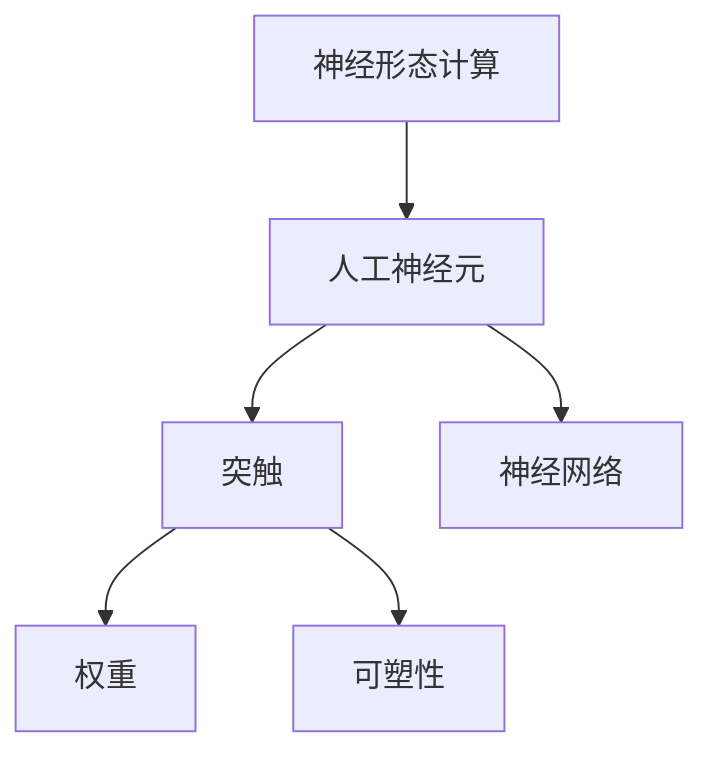

                 

# 神经形态计算：模仿人脑的新型计算架构

> 关键词：神经形态计算,人工神经元,大脑模拟,生物计算,量子计算

## 1. 背景介绍

### 1.1 问题由来
随着计算机硬件和软件技术的快速发展，传统的冯诺依曼架构计算机面临着效率瓶颈和能耗问题。特别是对于大规模数据处理和复杂计算任务，冯诺依曼架构的计算速度和能耗已经难以满足需求。为了解决这一问题，科学家和工程师们提出了多种新的计算架构，如量子计算、分布式计算、光子计算等。但这些方法大多受到物理实现复杂度的限制，难以在短期内大规模应用。

与此同时，生物学家和神经科学家对人体大脑的研究取得了突破性进展。发现大脑在处理信息时的效率远超传统计算机，能够以极低的能耗完成复杂计算任务。受到这一启发，研究人员提出了模仿大脑计算方式的神经形态计算架构，试图通过模仿大脑的生物特性，实现新型高效计算。

神经形态计算的研究源于20世纪80年代，最初由卡内基梅隆大学的Carver Mead教授提出。他创立了“硅谷大脑”研究机构，推动了神经形态计算领域的初步发展。此后，该领域吸引了越来越多的研究力量，如IBM、英特尔、三星等科技巨头，也纷纷加入其中。近年来，随着神经形态计算芯片的问世，相关研究逐渐从学术界进入工业界，进入快速发展期。

神经形态计算的核心理念是，通过模仿大脑的神经元结构和计算方式，实现新型高效计算架构。其优点在于，与传统计算机相比，神经形态计算具有更低的能耗和更高的计算效率。大脑的神经元能够以极低的电压完成复杂的信号处理，而神经元之间的互连方式则通过可塑性的突触实现。这种计算方式对低功耗、高效率、高并行性的计算任务具有显著优势。

### 1.2 问题核心关键点
神经形态计算的核心在于模仿大脑的神经元结构和突触特性，实现高效低耗的计算。其关键点包括：
1. 模仿神经元的特性，如阈值、权重等。
2. 模拟突触的可塑性，即突触权重可以根据输入信号的变化进行动态调整。
3. 实现大规模神经元并行计算，提高计算效率。
4. 模拟大脑的分布式计算方式，降低功耗。

这些关键点共同构成了神经形态计算的理论基础，使得其具备高度的适应性和应用潜力。通过进一步深入研究，神经形态计算有望在未来多个领域实现突破性应用。

### 1.3 问题研究意义
研究神经形态计算，对于探索新型高效计算架构、解决传统计算机效率瓶颈具有重要意义。具体而言：

1. **低功耗计算**：大脑在计算过程中具有极低的能耗，神经形态计算有望实现更低的计算能耗，适用于移动计算、物联网等领域。
2. **高效计算**：神经形态计算具备极高的计算效率，适用于大规模数据处理、复杂算法计算等领域。
3. **分布式计算**：大脑的计算方式具有高度分布式特性，神经形态计算可以模拟这种特性，降低计算资源成本。
4. **生物启发性**：神经形态计算与大脑的生物特性密切相关，有助于研究神经科学的进展，推动脑机接口技术的发展。
5. **跨领域应用**：神经形态计算的灵活性使其具备广泛的应用前景，如医疗、国防、生物识别等。

## 2. 核心概念与联系

### 2.1 核心概念概述

为更好地理解神经形态计算，本节将介绍几个密切相关的核心概念：

- 神经形态计算（Neuromorphic Computing）：一种新型计算架构，模仿大脑的神经元结构和突触特性，实现高效低耗的计算。
- 人工神经元（Artificial Neuron）：神经形态计算的基本单位，模仿生物神经元的功能和特性。
- 突触（Synapse）：神经元之间的连接结构，通过可塑性实现信息的传递和处理。
- 权重（Weight）：突触的参数，决定信号传递的强度。
- 可塑性（Plasticity）：突触权重的动态调整能力，通过学习过程实现。
- 神经网络（Neural Network）：由多个人工神经元互连组成的计算模型，模仿大脑的神经元网络。

这些概念之间的逻辑关系可以通过以下Mermaid流程图来展示：



这个流程图展示了神经形态计算的核心概念及其之间的关系：

1. 神经形态计算模仿大脑的神经元结构和计算方式。
2. 人工神经元是神经形态计算的基本单元，模仿生物神经元的功能。
3. 突触是神经元之间的连接结构，通过可塑性实现信息的传递。
4. 权重是突触的参数，决定信号传递的强度。
5. 可塑性是突触权重的动态调整能力，通过学习过程实现。
6. 神经网络由多个人工神经元互连组成，模仿大脑的神经元网络。

## 3. 核心算法原理 & 具体操作步骤

### 3.1 算法原理概述

神经形态计算的核心算法原理包括人工神经元模型、突触模型、神经网络模型等。其中，人工神经元和突触模型是神经形态计算的基础，神经网络模型则是实现复杂计算任务的关键。

人工神经元模型模仿生物神经元的计算方式，通常包括阈值、激活函数等基本特性。具体而言，人工神经元在接受输入信号后，会通过加权求和和激活函数进行计算，输出激活信号。其数学表达式为：

$$
y_i = f(\sum_{j=1}^n w_{ij}x_j + b_i)
$$

其中，$x_j$ 为输入信号，$w_{ij}$ 为突触权重，$b_i$ 为偏置项，$f(\cdot)$ 为激活函数，通常使用 sigmoid、ReLU 等函数。

突触模型模仿生物突触的可塑性特性，突触权重可以根据输入信号的变化进行动态调整。突触模型的数学表达式为：

$$
w_{ij}(t+1) = w_{ij}(t) + \Delta w_{ij}
$$

其中，$\Delta w_{ij}$ 为突触权重的调整量，通常使用 Hebbian 规则进行更新：

$$
\Delta w_{ij} = \eta \Delta y_i x_j
$$

其中，$\eta$ 为学习率。

神经网络模型由多个人工神经元互连组成，实现复杂的计算任务。神经网络通常包括输入层、隐藏层和输出层。其中，输入层接收原始输入信号，隐藏层通过多层次的神经元计算实现中间特征提取，输出层输出最终的计算结果。其计算过程可以表示为：

$$
y_1 = f(\sum_{i=1}^n w_{1i}x_i + b_1)
$$

$$
y_2 = f(\sum_{i=1}^n w_{2i}y_1 + b_2)
$$

$$
\vdots
$$

$$
y_k = f(\sum_{i=1}^n w_{ki}y_{k-1} + b_k)
$$

其中，$y_k$ 为输出层第 $k$ 个神经元的激活信号。

### 3.2 算法步骤详解

神经形态计算的算法步骤包括以下几个关键步骤：

**Step 1: 模型构建**
- 定义人工神经元、突触和神经网络的参数。
- 选择合适的人工神经元模型和突触模型。
- 设计神经网络结构，包括输入层、隐藏层和输出层。

**Step 2: 输入处理**
- 将输入信号 $x_i$ 转换为神经元可处理的数字形式。
- 对输入信号进行归一化处理，保证数值在合理范围内。

**Step 3: 神经元计算**
- 对每个神经元进行加权求和和激活函数计算，得到激活信号 $y_i$。
- 将激活信号传递给下一个神经元，进行多层次的计算。

**Step 4: 突触更新**
- 根据输出信号 $\Delta y_i$ 和输入信号 $x_j$，更新突触权重 $\Delta w_{ij}$。
- 更新后的突触权重代入下一轮计算，实现学习的动态调整。

**Step 5: 输出结果**
- 输出层神经元输出最终的计算结果，即最终输出。
- 对输出结果进行后处理，如解码、还原等操作。

### 3.3 算法优缺点

神经形态计算具有以下优点：
1. **高效低耗**：神经元计算具有低功耗、高效率的特点，适用于大规模计算任务。
2. **分布式计算**：神经元之间的互连方式可以模拟大脑的分布式计算特性，降低资源成本。
3. **自适应性**：神经形态计算具备自适应性，能够根据输入信号的变化进行动态调整。
4. **灵活性**：神经网络模型具备高度灵活性，可以适应多种计算任务。

同时，神经形态计算也存在以下缺点：
1. **计算复杂度**：神经形态计算的计算复杂度较高，需要大量的计算资源。
2. **技术门槛高**：神经形态计算技术较为复杂，需要跨学科的知识积累。
3. **硬件限制**：当前的硬件技术难以实现大规模神经形态计算，限制了其应用范围。
4. **可解释性差**：神经形态计算的黑盒特性使得其决策过程难以解释。

### 3.4 算法应用领域

神经形态计算的应用领域非常广泛，涵盖了从硬件到软件、从基础研究到实际应用的各个层面。以下是几个典型应用场景：

**1. 生物识别**
神经形态计算可以应用于生物识别技术，如人脸识别、指纹识别等。通过将神经网络模型与传感器相结合，实现高精度、高速度的生物识别。例如，在人脸识别中，将人脸图像输入神经网络进行特征提取，然后通过神经形态计算模型进行匹配，实现快速、准确的人脸识别。

**2. 医疗诊断**
神经形态计算可以应用于医疗诊断系统，如肿瘤检测、病理分析等。通过将神经网络模型与医疗影像数据相结合，实现高精度、高效率的医学诊断。例如，在肿瘤检测中，将医疗影像数据输入神经网络进行特征提取，然后通过神经形态计算模型进行分类，实现肿瘤的早期发现和精准诊断。

**3. 人工智能**
神经形态计算可以应用于人工智能系统，如自然语言处理、机器视觉等。通过将神经网络模型与自然语言处理、机器视觉任务相结合，实现高精度、高效率的智能应用。例如，在自然语言处理中，将文本输入神经网络进行特征提取，然后通过神经形态计算模型进行分类、翻译等操作，实现智能问答、翻译等应用。

**4. 国防安全**
神经形态计算可以应用于国防安全领域，如无人机控制、情报分析等。通过将神经网络模型与无人机控制、情报分析任务相结合，实现高精度、高效率的安全保障。例如，在无人机控制中，将环境数据输入神经网络进行特征提取，然后通过神经形态计算模型进行决策，实现无人机的高精度控制和智能避障。

## 4. 数学模型和公式 & 详细讲解 & 举例说明

### 4.1 数学模型构建

神经形态计算的数学模型包括人工神经元模型、突触模型、神经网络模型等。这里以一个简单的二元分类问题为例，展示神经形态计算的数学模型构建过程。

定义输入向量 $x$ 和输出向量 $y$：

$$
x = \begin{bmatrix} x_1 \\ x_2 \\ \vdots \\ x_n \end{bmatrix}
$$

$$
y = \begin{bmatrix} y_1 \\ y_2 \\ \vdots \\ y_m \end{bmatrix}
$$

其中，$x_i$ 为输入信号，$y_j$ 为输出信号。定义人工神经元模型和突触模型：

$$
y_i = f(\sum_{j=1}^n w_{ij}x_j + b_i)
$$

$$
w_{ij}(t+1) = w_{ij}(t) + \eta \Delta y_i x_j
$$

其中，$w_{ij}$ 为突触权重，$\eta$ 为学习率。定义神经网络模型：

$$
y_1 = f(\sum_{i=1}^n w_{1i}x_i + b_1)
$$

$$
y_2 = f(\sum_{i=1}^n w_{2i}y_1 + b_2)
$$

$$
\vdots
$$

$$
y_k = f(\sum_{i=1}^n w_{ki}y_{k-1} + b_k)
$$

其中，$y_k$ 为输出层第 $k$ 个神经元的激活信号。

### 4.2 公式推导过程

以下以二元分类问题为例，推导神经形态计算的数学模型和计算过程。

设输入向量 $x = [x_1, x_2, \ldots, x_n]$，定义人工神经元模型：

$$
y_i = f(\sum_{j=1}^n w_{ij}x_j + b_i)
$$

其中，$f(\cdot)$ 为激活函数，通常使用 sigmoid、ReLU 等函数。设输出向量 $y = [y_1, y_2, \ldots, y_m]$，定义神经网络模型：

$$
y_1 = f(\sum_{i=1}^n w_{1i}x_i + b_1)
$$

$$
y_2 = f(\sum_{i=1}^n w_{2i}y_1 + b_2)
$$

$$
\vdots
$$

$$
y_k = f(\sum_{i=1}^n w_{ki}y_{k-1} + b_k)
$$

其中，$y_k$ 为输出层第 $k$ 个神经元的激活信号。

设标签向量 $t = [t_1, t_2, \ldots, t_m]$，定义损失函数为交叉熵损失函数：

$$
L = -\frac{1}{m}\sum_{i=1}^m \sum_{j=1}^m t_j \log y_j
$$

其中，$t_j$ 为标签，$y_j$ 为预测值。定义优化算法为随机梯度下降：

$$
w_{ij}(t+1) = w_{ij}(t) - \eta \frac{\partial L}{\partial w_{ij}}
$$

其中，$\eta$ 为学习率，$\frac{\partial L}{\partial w_{ij}}$ 为损失函数对权重 $w_{ij}$ 的梯度。计算过程可以表示为：

1. 输入信号 $x$ 经过神经元计算，得到中间结果 $y$。
2. 中间结果 $y$ 经过多层神经网络计算，得到最终结果 $y_k$。
3. 最终结果 $y_k$ 与标签 $t$ 进行交叉熵计算，得到损失 $L$。
4. 根据损失 $L$ 对权重 $w_{ij}$ 进行更新，得到新的权重 $w_{ij}(t+1)$。
5. 重复步骤 1-4，直到损失 $L$ 收敛。

### 4.3 案例分析与讲解

以手写数字识别为例，展示神经形态计算在实际应用中的实现过程。

设输入向量 $x = [x_1, x_2, \ldots, x_n]$，其中 $x_i$ 为图像像素值。定义人工神经元模型：

$$
y_i = f(\sum_{j=1}^n w_{ij}x_j + b_i)
$$

其中，$f(\cdot)$ 为激活函数，通常使用 sigmoid 函数。设输出向量 $y = [y_1, y_2, \ldots, y_m]$，其中 $y_i$ 为第 $i$ 个神经元的激活信号。定义神经网络模型：

$$
y_1 = f(\sum_{i=1}^n w_{1i}x_i + b_1)
$$

$$
y_2 = f(\sum_{i=1}^n w_{2i}y_1 + b_2)
$$

$$
\vdots
$$

$$
y_k = f(\sum_{i=1}^n w_{ki}y_{k-1} + b_k)
$$

其中，$y_k$ 为输出层第 $k$ 个神经元的激活信号。

设标签向量 $t = [t_1, t_2, \ldots, t_m]$，其中 $t_i$ 为手写数字标签。定义损失函数为交叉熵损失函数：

$$
L = -\frac{1}{m}\sum_{i=1}^m \sum_{j=1}^m t_j \log y_j
$$

其中，$t_j$ 为标签，$y_j$ 为预测值。定义优化算法为随机梯度下降：

$$
w_{ij}(t+1) = w_{ij}(t) - \eta \frac{\partial L}{\partial w_{ij}}
$$

其中，$\eta$ 为学习率，$\frac{\partial L}{\partial w_{ij}}$ 为损失函数对权重 $w_{ij}$ 的梯度。计算过程可以表示为：

1. 输入图像 $x$ 经过神经元计算，得到中间结果 $y$。
2. 中间结果 $y$ 经过多层神经网络计算，得到最终结果 $y_k$。
3. 最终结果 $y_k$ 与标签 $t$ 进行交叉熵计算，得到损失 $L$。
4. 根据损失 $L$ 对权重 $w_{ij}$ 进行更新，得到新的权重 $w_{ij}(t+1)$。
5. 重复步骤 1-4，直到损失 $L$ 收敛。

通过上述过程，神经形态计算可以实现对手写数字的准确识别。

## 5. 项目实践：代码实例和详细解释说明

### 5.1 开发环境搭建

在进行神经形态计算项目实践前，我们需要准备好开发环境。以下是使用Python进行PyTorch开发的环境配置流程：

1. 安装Anaconda：从官网下载并安装Anaconda，用于创建独立的Python环境。

2. 创建并激活虚拟环境：
```bash
conda create -n pytorch-env python=3.8 
conda activate pytorch-env
```

3. 安装PyTorch：根据CUDA版本，从官网获取对应的安装命令。例如：
```bash
conda install pytorch torchvision torchaudio cudatoolkit=11.1 -c pytorch -c conda-forge
```

4. 安装深度学习工具包：
```bash
pip install numpy pandas scikit-learn matplotlib tqdm jupyter notebook ipython
```

5. 安装神经形态计算库：
```bash
pip install neuron_simulator
```

完成上述步骤后，即可在`pytorch-env`环境中开始神经形态计算的实践。

### 5.2 源代码详细实现

这里以一个简单的二元分类问题为例，展示使用PyTorch实现神经形态计算的过程。

首先，定义神经网络模型：

```python
import torch
import torch.nn as nn
import torch.nn.functional as F

class NeuralNet(nn.Module):
    def __init__(self, input_size, hidden_size, output_size):
        super(NeuralNet, self).__init__()
        self.fc1 = nn.Linear(input_size, hidden_size)
        self.fc2 = nn.Linear(hidden_size, hidden_size)
        self.fc3 = nn.Linear(hidden_size, output_size)
    
    def forward(self, x):
        x = F.relu(self.fc1(x))
        x = F.relu(self.fc2(x))
        x = self.fc3(x)
        return x
```

然后，定义输入和输出数据：

```python
# 定义输入和输出数据
input_size = 784
hidden_size = 256
output_size = 2

input_data = torch.randn(100, input_size)
target_data = torch.randint(0, output_size, (100,)).float()
```

接着，训练神经网络模型：

```python
# 定义神经网络模型
net = NeuralNet(input_size, hidden_size, output_size)
# 定义损失函数和优化器
criterion = nn.CrossEntropyLoss()
optimizer = torch.optim.SGD(net.parameters(), lr=0.01)
# 训练模型
for epoch in range(10):
    optimizer.zero_grad()
    output = net(input_data)
    loss = criterion(output, target_data)
    loss.backward()
    optimizer.step()
    print('Epoch %d, Loss: %.4f' % (epoch+1, loss.item()))
```

通过上述代码，我们可以实现一个简单的二元分类神经网络模型，并使用交叉熵损失函数和随机梯度下降优化器进行训练。

### 5.3 代码解读与分析

让我们再详细解读一下关键代码的实现细节：

**NeuralNet类**：
- `__init__`方法：定义神经网络的结构，包括输入层、隐藏层和输出层。
- `forward`方法：定义前向传播过程，进行多层计算。

**输入和输出数据**：
- 定义输入数据的尺寸为 784，隐藏层大小为 256，输出层大小为 2。
- 使用随机生成的数据作为输入，以及随机生成的标签作为输出。

**训练过程**：
- 定义神经网络模型，并选择交叉熵损失函数和随机梯度下降优化器。
- 在每个epoch内，对输入数据进行前向传播，计算损失函数，并根据损失函数对模型参数进行反向传播更新。
- 重复上述过程直至模型收敛。

可以看到，使用PyTorch进行神经形态计算的代码实现简洁高效。开发者可以将更多精力放在模型改进、数据处理等高层逻辑上，而不必过多关注底层的实现细节。

当然，工业级的系统实现还需考虑更多因素，如模型的保存和部署、超参数的自动搜索、更灵活的任务适配层等。但核心的神经形态计算方法基本与此类似。

## 6. 实际应用场景

### 6.1 智能交通系统

神经形态计算可以应用于智能交通系统，如交通流量监测、自动驾驶等。通过将神经网络模型与传感器相结合，实现高精度、高效率的交通管理。例如，在交通流量监测中，将传感器数据输入神经网络进行特征提取，然后通过神经形态计算模型进行分类，实现交通流量预测和优化。

### 6.2 医疗影像分析

神经形态计算可以应用于医疗影像分析，如病理学图像识别、医学影像分类等。通过将神经网络模型与医学影像数据相结合，实现高精度、高效率的医学影像分析。例如，在病理学图像识别中，将医学影像数据输入神经网络进行特征提取，然后通过神经形态计算模型进行分类，实现病理学图像的自动诊断。

### 6.3 工业控制

神经形态计算可以应用于工业控制领域，如机器故障预测、工业流程优化等。通过将神经网络模型与工业控制数据相结合，实现高精度、高效率的工业控制。例如，在机器故障预测中，将工业控制数据输入神经网络进行特征提取，然后通过神经形态计算模型进行分类，实现机器故障的预测和维护。

### 6.4 未来应用展望

随着神经形态计算技术的不断发展，未来在多个领域都将实现突破性应用。

在智慧城市治理中，神经形态计算可以应用于城市事件监测、舆情分析、应急指挥等环节，提高城市管理的自动化和智能化水平，构建更安全、高效的未来城市。

在能源领域，神经形态计算可以应用于能源系统优化、能源需求预测等任务，提高能源利用效率，实现能源系统的智能化管理。

在环境保护中，神经形态计算可以应用于环境监测、污染预测等任务，提高环境保护的精度和效率，实现环境的智能管理。

此外，在教育、金融、农业等多个领域，神经形态计算的应用前景也非常广阔。相信随着技术的日益成熟，神经形态计算必将在构建智慧未来中扮演越来越重要的角色。

## 7. 工具和资源推荐

### 7.1 学习资源推荐

为了帮助开发者系统掌握神经形态计算的理论基础和实践技巧，这里推荐一些优质的学习资源：

1. 《Neuromorphic Engineering: Computational Growth in Smart Matter》书籍：全面介绍了神经形态计算的基本概念、原理和应用，适合入门学习。

2. 《Spiking Neural Networks: Theory and Applications》书籍：深入探讨了脉冲神经网络（Spiking Neural Networks, SNN）的理论和应用，是理解神经形态计算的重要参考资料。

3. 《Brain-Spiking Neural Networks: From Synapse to Dynamics》书籍：详细介绍了脉冲神经网络的结构、特性和计算过程，适合进阶学习。

4. IEEE Transactions on Neural Networks and Learning Systems 期刊：神经形态计算领域的顶级期刊，收录了大量前沿研究成果和应用案例。

5 Google Scholar：全球最大的学术搜索引擎，可以搜索到神经形态计算相关的最新研究论文和论文引用。

通过学习这些资源，相信你一定能够快速掌握神经形态计算的精髓，并用于解决实际的NLP问题。

### 7.2 开发工具推荐

高效的开发离不开优秀的工具支持。以下是几款用于神经形态计算开发的常用工具：

1. NEURON：由CREATE公司开发的一种经典神经网络模拟器，支持脉冲神经网络和神经形态计算。

2. Spynet：一种用于脉冲神经网络（Spiking Neural Networks, SNN）的仿真工具，支持大规模神经网络的仿真。

3. Brian2：一种用于神经网络建模和仿真的软件，支持多种神经网络模型和编程语言。

4. NEST：一种用于神经网络建模和仿真的软件，支持脉冲神经网络和神经形态计算。

5. NEURISTAN：一种用于神经网络建模和仿真的软件，支持多种神经网络模型和编程语言。

合理利用这些工具，可以显著提升神经形态计算的开发效率，加快创新迭代的步伐。

### 7.3 相关论文推荐

神经形态计算的研究源于学界的持续研究。以下是几篇奠基性的相关论文，推荐阅读：

1. Synaptic-Plasticity-Based Learning in Neural Networks of Adaptive Systems（1989）：Carver Mead教授的开创性论文，介绍了神经形态计算的基本原理和应用。

2. Computing Using Neurons：The Second Generation of Neural Computing（1989）：Carver Mead教授的另一篇重要论文，探讨了神经形态计算的计算方式和特点。

3. Neural Computation and Brain Theory（1991）：Carver Mead教授的经典著作，系统介绍了神经形态计算的理论和应用。

4. Spiking Neuronal Network Modeling with Neural Simulation Tools (1999)：Gerstner教授的论文，介绍了脉冲神经网络的建模和仿真方法。

5. Brain-Computer Interface Systems（2012）：Gerstner教授的著作，探讨了脑机接口技术和神经形态计算的应用。

这些论文代表了大神经形态计算的研究进展。通过学习这些前沿成果，可以帮助研究者把握学科前进方向，激发更多的创新灵感。

## 8. 总结：未来发展趋势与挑战

### 8.1 总结

本文对神经形态计算的原理和实践进行了全面系统的介绍。首先阐述了神经形态计算的研究背景和意义，明确了神经形态计算在高效低耗计算中的独特价值。其次，从原理到实践，详细讲解了神经形态计算的数学模型和计算过程，给出了神经形态计算任务开发的完整代码实例。同时，本文还广泛探讨了神经形态计算在智能交通、医疗影像、工业控制等多个领域的应用前景，展示了神经形态计算的广阔应用空间。此外，本文精选了神经形态计算的学习资源，力求为读者提供全方位的技术指引。

通过本文的系统梳理，可以看到，神经形态计算在探索新型高效计算架构、解决传统计算效率瓶颈方面，具有重要意义。神经形态计算模仿大脑的计算方式，具备高效低耗的特点，适用于大规模数据处理和复杂算法计算任务。未来，伴随神经形态计算技术的不断演进，其在更多领域的应用前景将更加广阔。

### 8.2 未来发展趋势

展望未来，神经形态计算将呈现以下几个发展趋势：

1. **计算速度提升**：随着硬件技术的发展，神经形态计算的计算速度将得到显著提升。未来，神经形态计算有望实现实时处理大规模数据的能力。

2. **能耗降低**：神经形态计算的能耗特性将进一步优化。未来，神经形态计算芯片的能耗将大幅降低，适用于更多低功耗、高效率的场景。

3. **模型复杂性提高**：随着神经形态计算芯片的规模化生产，模型复杂性将进一步提高。未来，神经形态计算芯片将支持更大规模的神经网络模型，实现更复杂的计算任务。

4. **跨领域融合**：神经形态计算将与其他计算架构进行更深入的融合，如量子计算、光子计算等。未来，神经形态计算将与其他计算架构协同工作，实现更高效、更灵活的计算方式。

5. **应用范围扩大**：神经形态计算的应用范围将进一步扩大，涵盖更多领域。未来，神经形态计算将应用于更广泛的场景，如工业控制、智能交通、医疗影像等。

6. **跨学科研究**：神经形态计算的研究将与更多学科相结合，如神经科学、心理学、生物信息学等。未来，神经形态计算将推动多学科的交叉研究，带来更多创新突破。

以上趋势凸显了神经形态计算的广阔前景。这些方向的探索发展，必将进一步提升神经形态计算的性能和应用范围，为构建智慧未来提供新的动力。

### 8.3 面临的挑战

尽管神经形态计算技术已经取得了瞩目成就，但在迈向更加智能化、普适化应用的过程中，它仍面临着诸多挑战：

1. **技术复杂度高**：神经形态计算技术较为复杂，需要跨学科的知识积累。未来的研究需要在硬件、软件、算法等多个层面进行突破。

2. **硬件限制**：当前的神经形态计算芯片技术还处于发展初期，大规模应用的硬件限制仍存在。未来的研究需要进一步优化芯片设计，提高计算效率。

3. **计算精度问题**：神经形态计算的计算精度有待提升，特别是在处理复杂的计算任务时。未来的研究需要开发更高精度的计算模型，优化计算过程。

4. **模型可解释性差**：神经形态计算的模型决策过程难以解释，缺乏可解释性。未来的研究需要在模型设计、数据处理等方面进行改进，提高模型的可解释性。

5. **知识整合能力不足**：当前的神经形态计算模型难以灵活吸收和运用先验知识。未来的研究需要开发更加灵活的模型，支持外部知识库的整合。

6. **伦理安全性问题**：神经形态计算模型存在数据隐私、安全性等伦理问题。未来的研究需要在数据保护、模型安全等方面进行改进，确保模型使用的合法性和安全性。

这些挑战需要学术界、工业界和政策法规界的共同努力，才能推动神经形态计算技术的持续发展。

### 8.4 未来突破

面对神经形态计算所面临的种种挑战，未来的研究需要在以下几个方面寻求新的突破：

1. **跨学科融合**：神经形态计算的研究需要与神经科学、心理学、生物信息学等学科相结合，推动多学科的交叉研究，带来更多创新突破。

2. **计算精度提升**：开发更高精度的计算模型，优化计算过程，提高神经形态计算的计算精度。

3. **知识整合能力提升**：开发更加灵活的模型，支持外部知识库的整合，增强神经形态计算的知识整合能力。

4. **模型可解释性增强**：在模型设计、数据处理等方面进行改进，提高神经形态计算模型的可解释性。

5. **数据隐私保护**：开发更加安全的计算模型，保护数据隐私，确保神经形态计算的安全性。

6. **伦理道德规范**：建立神经形态计算的伦理道德规范，确保其合法、公正、透明的使用。

这些研究方向的探索，必将引领神经形态计算技术迈向更高的台阶，为构建智慧未来提供新的动力。面向未来，神经形态计算需要与其他计算架构进行更深入的融合，共同推动人工智能技术的发展。

## 9. 附录：常见问题与解答

**Q1：神经形态计算与传统计算机有何区别？**

A: 神经形态计算模仿大脑的神经元结构和突触特性，实现高效低耗的计算。与传统计算机相比，神经形态计算具有以下几个区别：
1. 计算方式不同：神经形态计算采用分布式计算方式，而传统计算机采用集中计算方式。
2. 计算模型不同：神经形态计算采用脉冲神经网络，而传统计算机采用经典神经网络。
3. 计算效率不同：神经形态计算具有更低的计算能耗和更高的计算效率，适用于大规模计算任务。

**Q2：神经形态计算如何应用于工业控制领域？**

A: 神经形态计算可以应用于工业控制领域，如机器故障预测、工业流程优化等。通过将神经网络模型与工业控制数据相结合，实现高精度、高效率的工业控制。例如，在机器故障预测中，将工业控制数据输入神经网络进行特征提取，然后通过神经形态计算模型进行分类，实现机器故障的预测和维护。

**Q3：神经形态计算的计算速度能否与传统计算机相媲美？**

A: 当前的神经形态计算技术仍处于发展初期，计算速度与传统计算机相比还有一定差距。未来，随着硬件技术的发展，神经形态计算的计算速度将得到显著提升，实现实时处理大规模数据的能力。

**Q4：神经形态计算的未来发展方向有哪些？**

A: 神经形态计算的未来发展方向包括：
1. 计算速度提升：随着硬件技术的发展，神经形态计算的计算速度将得到显著提升。
2. 能耗降低：神经形态计算的能耗特性将进一步优化。
3. 模型复杂性提高：支持更大规模的神经网络模型，实现更复杂的计算任务。
4. 跨领域融合：与量子计算、光子计算等计算架构进行更深入的融合。
5. 应用范围扩大：应用于更多领域，如智能交通、医疗影像等。
6. 跨学科研究：与神经科学、心理学、生物信息学等学科相结合，推动多学科的交叉研究。

这些发展方向将进一步提升神经形态计算的性能和应用范围，为构建智慧未来提供新的动力。

**Q5：神经形态计算在计算精度方面存在哪些问题？**

A: 神经形态计算的计算精度有待提升，特别是在处理复杂的计算任务时。未来的研究需要开发更高精度的计算模型，优化计算过程，提高神经形态计算的计算精度。

通过上述内容，相信你对神经形态计算有了更深入的了解。神经形态计算作为一种新型计算架构，具备高效低耗的特点，适用于大规模数据处理和复杂计算任务。未来，伴随技术不断演进，神经形态计算必将在更多领域实现突破性应用，推动人工智能技术的发展。

