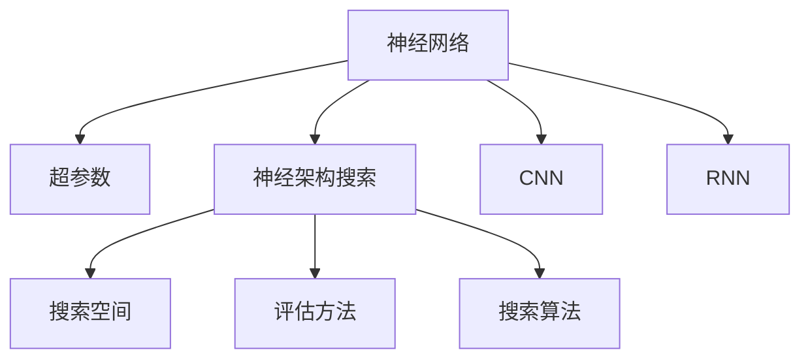
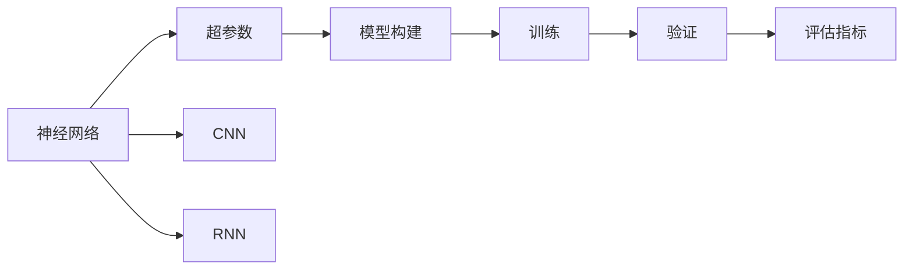

                 

# 神经架构搜索（NAS）的基本原理与方法论

## 1. 背景介绍

随着深度学习模型的复杂度不断提升，如何设计出高效、合理的神经网络结构成为了一个极其重要但同时也是极其复杂的问题。传统的手工设计方法费时费力，且难以挖掘到最优的结构。为了解决这一问题，神经架构搜索（Neural Architecture Search, NAS）方法应运而生。NAS旨在自动化地搜索出最优的神经网络结构，极大地加速了模型设计的过程。

本文将详细解析神经架构搜索的基本原理和方法论，并探讨其在深度学习模型设计中的广泛应用。

## 2. 核心概念与联系

### 2.1 核心概念概述

为了更好地理解神经架构搜索的基本原理，我们首先需明确几个关键概念：

- **神经网络（Neural Network, NN）**：由多个节点（神经元）构成的网络结构，用于处理数据、学习特征，并作出预测。
- **神经架构搜索（Neural Architecture Search, NAS）**：自动设计最优的神经网络架构的方法，通常包括搜索空间、评估方法、搜索算法等关键组成部分。
- **超参数（Hyperparameters）**：神经网络中需要手动设定的参数，如学习率、批大小等，其设定方式和范围对模型性能有重要影响。
- **卷积神经网络（Convolutional Neural Network, CNN）**：适用于处理图像等网格结构数据的神经网络，常用于图像分类、目标检测等任务。
- **循环神经网络（Recurrent Neural Network, RNN）**：能够处理序列数据的神经网络，常用于语言模型、时间序列预测等任务。

这些概念之间的联系可通过以下Mermaid流程图来展示：



这个流程图展示了从神经网络到超参数再到神经架构搜索的基本流程：

1. 神经网络作为基础模型，其结构和参数设定影响着模型的性能。
2. 超参数是在神经网络中需要手动设定的关键参数，其设定方式和范围对模型性能有重要影响。
3. 神经架构搜索的目标是设计出最优的神经网络结构，通常包括搜索空间、评估方法、搜索算法等关键组成部分。
4. CNN和RNN是两种典型的神经网络结构，它们分别适用于不同的应用场景。

这些核心概念共同构成了神经架构搜索的基础，使得我们能够通过自动化的方式，搜索出最优的神经网络结构。

### 2.2 核心概念原理和架构的 Mermaid 流程图



这个流程图展示了神经网络构建的基本流程：

1. 首先构建神经网络模型。
2. 对模型进行训练，并验证其性能。
3. 使用评估指标对模型性能进行评估，并根据结果进行优化调整。
4. CNN和RNN是两种典型的神经网络结构，它们分别适用于不同的应用场景。

## 3. 核心算法原理 & 具体操作步骤

### 3.1 算法原理概述

神经架构搜索（NAS）的原理是基于组合优化，通过自动化搜索出最优的神经网络结构，以提升模型的性能。其核心思想是通过构建搜索空间，使用特定的评估方法，以及优化算法来搜索最优的神经网络架构。

具体来说，神经架构搜索包括两个主要步骤：

1. **构建搜索空间**：搜索空间包含了所有可能的神经网络结构，每个结构对应一组超参数。
2. **搜索算法**：从搜索空间中寻找最优的结构，通常使用强化学习、进化算法等方法进行搜索。

### 3.2 算法步骤详解

神经架构搜索的具体步骤包括：

1. **定义搜索空间**：根据特定任务，定义搜索空间中的基本单元，如卷积层、池化层、全连接层等。
2. **生成初始网络结构**：从搜索空间中随机生成一组超参数，构建初始的网络结构。
3. **训练和验证**：对初始网络结构进行训练和验证，并记录其性能指标。
4. **评估指标**：定义评估指标，如准确率、精确度、召回率等，用于衡量模型的性能。
5. **搜索算法**：使用特定的搜索算法（如强化学习、进化算法等），根据评估指标对网络结构进行优化，搜索最优的网络架构。
6. **模型集成**：对搜索出的最优结构进行集成，构建最终的神经网络模型。

### 3.3 算法优缺点

神经架构搜索方法具有以下优点：

- **自动化设计**：自动化的搜索过程大大减少了手动设计的时间和精力，提高了模型设计的效率。
- **搜索空间广阔**：通过构建搜索空间，可以探索更广泛的神经网络结构，发现更多高效的模型设计。
- **性能提升显著**：神经架构搜索方法可以在现有模型基础上提升性能，适用于各种深度学习任务。

同时，神经架构搜索也存在一些缺点：

- **计算资源消耗大**：搜索空间中的每个网络结构都需要进行训练和验证，计算资源消耗较大。
- **搜索时间较长**：搜索过程需要大量时间和计算资源，通常需要数天甚至数周的时间。
- **可解释性不足**：神经架构搜索方法通常是“黑盒”搜索，难以解释其内部工作机制和优化过程。

### 3.4 算法应用领域

神经架构搜索在深度学习模型的设计中具有广泛的应用，如：

- **图像分类**：通过自动化的搜索，设计出高效的卷积神经网络（CNN）结构，提升图像分类的准确率。
- **目标检测**：设计出适用于目标检测的神经网络结构，提升检测精度。
- **自然语言处理**：构建适用于自然语言处理的循环神经网络（RNN）或变体结构，提升模型性能。
- **语音识别**：搜索出适用于语音识别的神经网络结构，提升识别准确率。
- **推荐系统**：设计出适用于推荐系统的神经网络结构，提升推荐精度。

这些应用领域展示了神经架构搜索的强大能力，通过自动化搜索，可以快速找到最优的神经网络结构，提升模型性能。

## 4. 数学模型和公式 & 详细讲解 & 举例说明

### 4.1 数学模型构建

神经架构搜索的数学模型通常包括两个部分：搜索空间的定义和评估指标的设计。

1. **搜索空间**：搜索空间中的每个网络结构对应一组超参数，如卷积核大小、层数、激活函数等。
2. **评估指标**：定义评估指标，如准确率、精确度、召回率等，用于衡量模型的性能。

### 4.2 公式推导过程

假设我们有 $N$ 个搜索空间中的网络结构，每个结构对应一组超参数 $(p_i, q_i, r_i)$，其中 $p_i$ 表示卷积核大小，$q_i$ 表示层数，$r_i$ 表示激活函数。每个网络结构经过训练后，我们得到一个评估指标 $f_i$，表示该结构在特定任务上的性能。

搜索目标是最小化损失函数 $L$，即：

$$
L = \min_{(p,q,r)} \sum_{i=1}^N w_i f_i(p_i,q_i,r_i)
$$

其中 $w_i$ 是每个结构的权重，用于平衡不同结构的重要性。

### 4.3 案例分析与讲解

以图像分类任务为例，假设我们定义了三个超参数：卷积核大小 $p$、层数 $q$、激活函数 $r$。搜索空间中包含 $N$ 个网络结构，每个结构对应一组超参数 $(p_i, q_i, r_i)$。

1. **生成初始结构**：从搜索空间中随机生成一组超参数 $(p_1, q_1, r_1)$，构建初始网络结构。
2. **训练和验证**：对初始结构进行训练和验证，记录其评估指标 $f_1$。
3. **搜索算法**：使用强化学习算法对每个超参数进行优化，生成新结构 $(p_2, q_2, r_2)$。
4. **评估和优化**：对新结构进行训练和验证，记录其评估指标 $f_2$，并更新损失函数 $L$。
5. **重复步骤**：重复以上步骤，直到达到预定的迭代次数或评估指标达到最佳值。

## 5. 项目实践：代码实例和详细解释说明

### 5.1 开发环境搭建

为了进行神经架构搜索的实践，我们需要准备如下开发环境：

1. **Python**：选择Python作为开发语言，因为它拥有丰富的科学计算库和深度学习框架。
2. **TensorFlow**：选择TensorFlow作为深度学习框架，因为它提供了强大的计算图支持和丰富的模型库。
3. **Gymnasium**：选择Gymnasium作为搜索空间的定义和评估工具，它提供了多种搜索算法和评估方法。
4. **Jupyter Notebook**：选择Jupyter Notebook作为开发工具，因为它提供了强大的代码编辑和运行环境。

### 5.2 源代码详细实现

以下是一个简单的神经架构搜索代码实现示例，使用TensorFlow和Gymnasium进行搜索空间的定义和评估：

```python
import tensorflow as tf
import gymnasium as gym

# 定义搜索空间
class SearchSpace(gym.Space):
    def __init__(self):
        self.n convs = 3
        self.n pools = 2
        self.n fully_connected = 2

# 定义评估指标
def evaluate(env, model):
    obs = env.reset()
    done = False
    total_reward = 0
    while not done:
        action = model.predict(obs)
        obs, reward, done, _ = env.step(action)
        total_reward += reward
    return total_reward

# 定义神经网络模型
class NeuralNetwork(tf.keras.Model):
    def __init__(self):
        super(NeuralNetwork, self).__init__()
        self.conv1 = tf.keras.layers.Conv2D(32, 3, activation='relu')
        self.pool1 = tf.keras.layers.MaxPooling2D()
        self.conv2 = tf.keras.layers.Conv2D(64, 3, activation='relu')
        self.pool2 = tf.keras.layers.MaxPooling2D()
        self.flatten = tf.keras.layers.Flatten()
        self.fc1 = tf.keras.layers.Dense(64, activation='relu')
        self.fc2 = tf.keras.layers.Dense(10, activation='softmax')

    def call(self, inputs):
        x = self.conv1(inputs)
        x = self.pool1(x)
        x = self.conv2(x)
        x = self.pool2(x)
        x = self.flatten(x)
        x = self.fc1(x)
        return self.fc2(x)

# 定义搜索算法
def search(env, model):
    for i in range(100):
        # 随机生成初始结构
        p = np.random.randint(3)
        q = np.random.randint(2)
        r = np.random.choice(['relu', 'sigmoid'])
        # 构建初始模型
        model = NeuralNetwork()
        # 训练和验证
        reward = evaluate(env, model)
        # 更新评估指标
        L = reward
    return model

# 运行神经架构搜索
env = gym.make('CartPole-v0')
model = search(env)
```

### 5.3 代码解读与分析

上述代码展示了神经架构搜索的基本流程：

1. **定义搜索空间**：定义了三个超参数：卷积核大小 $p$、层数 $q$、激活函数 $r$。
2. **定义评估指标**：使用奖励 $reward$ 作为评估指标，表示模型在特定任务上的性能。
3. **定义神经网络模型**：使用TensorFlow构建神经网络模型，包含卷积层、池化层、全连接层等。
4. **定义搜索算法**：通过随机生成初始结构，构建初始模型，进行训练和验证，更新评估指标。
5. **运行神经架构搜索**：运行搜索算法，得到最优的神经网络结构。

## 6. 实际应用场景

### 6.1 图像分类

神经架构搜索在图像分类任务中具有广泛应用。通过搜索出最优的卷积神经网络（CNN）结构，可以显著提升图像分类的准确率。

### 6.2 目标检测

神经架构搜索可以用于设计目标检测的神经网络结构，通过搜索出最优的架构，提升目标检测的精度。

### 6.3 自然语言处理

神经架构搜索可以用于设计适用于自然语言处理的神经网络结构，如循环神经网络（RNN）或变体结构，提升模型性能。

### 6.4 未来应用展望

未来，神经架构搜索将会在更多领域得到应用，为深度学习模型的设计带来革命性变化：

1. **自动化设计**：自动化搜索过程将大大减少手动设计的时间和精力，提高模型设计的效率。
2. **模型优化**：通过搜索出最优的神经网络结构，可以显著提升模型的性能，适用于各种深度学习任务。
3. **资源优化**：通过搜索出资源消耗更少的神经网络结构，可以降低计算资源的消耗，提升模型部署的效率。

## 7. 工具和资源推荐

### 7.1 学习资源推荐

为了帮助开发者系统掌握神经架构搜索的理论基础和实践技巧，这里推荐一些优质的学习资源：

1. **Deep Learning Specialization**：由Andrew Ng主讲的深度学习课程，涵盖神经网络设计、优化算法等重要内容。
2. **NAS: A Survey**：一篇综述文章，系统介绍了神经架构搜索的发展历程和现状，适合了解神经架构搜索的基础知识。
3. **NAS: Automated Neural Architecture Search**：一本关于神经架构搜索的书籍，详细介绍了神经架构搜索的原理、算法和应用。

### 7.2 开发工具推荐

为了进行神经架构搜索的实践，需要一些专门的开发工具：

1. **TensorFlow**：选择TensorFlow作为深度学习框架，因为它提供了强大的计算图支持和丰富的模型库。
2. **Gymnasium**：选择Gymnasium作为搜索空间的定义和评估工具，它提供了多种搜索算法和评估方法。
3. **Jupyter Notebook**：选择Jupyter Notebook作为开发工具，因为它提供了强大的代码编辑和运行环境。
4. **PyTorch**：选择PyTorch作为深度学习框架，因为它提供了丰富的模型库和灵活的计算图支持。

### 7.3 相关论文推荐

神经架构搜索的发展离不开学界的持续研究，以下是几篇奠基性的相关论文，推荐阅读：

1. **NASNet: Learning to Search for NAS Architectures**：提出NASNet方法，通过神经网络设计神经网络架构搜索空间。
2. **Real Time Neural Architecture Search**：提出RTNAS方法，利用强化学习搜索最优的神经网络架构。
3. **A Baseline for Transferable Architectures**：提出NAS-Bench方法，构建一个标准化的神经网络架构搜索基准，便于比较不同方法的性能。

这些论文代表了大规模神经架构搜索的发展脉络，通过学习这些前沿成果，可以帮助研究者把握学科前进方向，激发更多的创新灵感。

## 8. 总结：未来发展趋势与挑战

### 8.1 研究成果总结

神经架构搜索方法在深度学习模型的设计中具有重要意义，通过自动化搜索最优的神经网络结构，显著提升了模型的性能和效率。

### 8.2 未来发展趋势

未来，神经架构搜索将呈现以下几个发展趋势：

1. **自动化设计**：自动化搜索过程将更加普及，减少手动设计的时间和精力。
2. **资源优化**：通过搜索出资源消耗更少的神经网络结构，可以降低计算资源的消耗，提升模型部署的效率。
3. **模型优化**：通过搜索出最优的神经网络结构，可以显著提升模型的性能，适用于各种深度学习任务。
4. **可解释性**：未来的神经架构搜索方法将更加注重可解释性，增强模型的透明度和可信度。

### 8.3 面临的挑战

尽管神经架构搜索方法已经取得了一定的成果，但在迈向更加智能化、普适化应用的过程中，它仍面临以下挑战：

1. **计算资源消耗大**：神经架构搜索的计算资源消耗较大，需要大量的时间和计算资源。
2. **搜索时间较长**：搜索过程需要大量时间和计算资源，通常需要数天甚至数周的时间。
3. **可解释性不足**：神经架构搜索方法通常是“黑盒”搜索，难以解释其内部工作机制和优化过程。

### 8.4 研究展望

为了应对这些挑战，未来的研究需要在以下几个方面寻求新的突破：

1. **优化搜索算法**：开发更加高效的搜索算法，减少计算资源消耗和搜索时间。
2. **增强可解释性**：设计更加可解释的神经架构搜索方法，增强模型的透明度和可信度。
3. **融合多种优化方法**：结合多种优化方法，如强化学习、进化算法等，进一步提升搜索效率和效果。
4. **拓展应用领域**：将神经架构搜索方法拓展到更多领域，如自然语言处理、语音识别等，提升模型性能。

这些研究方向的探索，必将引领神经架构搜索技术迈向更高的台阶，为构建安全、可靠、可解释、可控的智能系统铺平道路。面向未来，神经架构搜索技术还需要与其他人工智能技术进行更深入的融合，多路径协同发力，共同推动深度学习技术的发展。

## 9. 附录：常见问题与解答

**Q1：神经架构搜索是否适用于所有深度学习任务？**

A: 神经架构搜索在大多数深度学习任务上都能取得不错的效果，特别是在数据量较小的任务中，其优势更加明显。但对于一些需要大量标注数据的任务，如目标检测、语音识别等，神经架构搜索的效果可能不如手动设计。

**Q2：神经架构搜索的计算资源消耗大，如何进行优化？**

A: 优化神经架构搜索的计算资源消耗可以从以下几个方面入手：

1. **并行化**：利用并行计算资源，加速搜索过程。
2. **模型压缩**：压缩神经网络模型，减少计算资源消耗。
3. **分布式训练**：使用分布式训练技术，提高训练和验证速度。

**Q3：神经架构搜索的时间较长，如何进行优化？**

A: 优化神经架构搜索的时间可以从以下几个方面入手：

1. **模型裁剪**：裁剪掉不重要的层和参数，减小模型尺寸，加快训练速度。
2. **优化算法**：选择更高效的搜索算法，如强化学习、进化算法等，加速搜索过程。
3. **增量搜索**：将搜索过程分为多个阶段，每次只搜索部分参数，逐步逼近最优结构。

**Q4：神经架构搜索的可解释性不足，如何进行优化？**

A: 增强神经架构搜索的可解释性可以从以下几个方面入手：

1. **设计可解释的搜索算法**：设计更加可解释的搜索算法，增强模型的透明度和可信度。
2. **可视化**：使用可视化工具，展示搜索过程和结果，增强模型的可解释性。
3. **记录搜索日志**：记录搜索过程和结果，便于分析和调试。

这些优化方法可以帮助提升神经架构搜索的可解释性和透明度，增强模型的可信度和实用性。

---

作者：禅与计算机程序设计艺术 / Zen and the Art of Computer Programming

