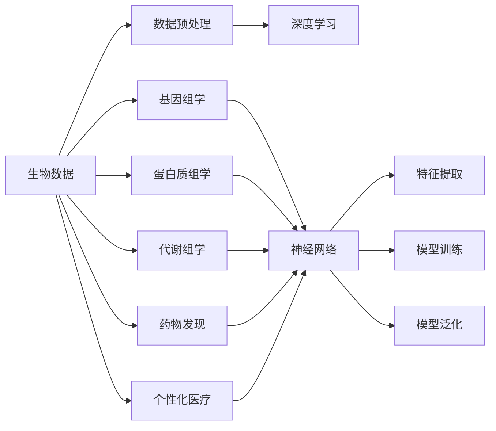

                 

## 1. 背景介绍

生物信息学(Bioinformatics)是综合应用计算机科学、数学和生物学的方法，研究生物数据的采集、存储、管理和分析的一门学科。随着高通量测序技术的普及和生物样本的积累，生物信息学在现代生物学中扮演着越来越重要的角色。

神经网络在生物信息学中的应用，始于1989年Sepp Hochreiter和Jürgen Schmidhuber提出的循环神经网络(RNN)。在经过数十年的演进后，今日的深度学习模型已成为解析生物学问题的强大工具。神经网络在基因组学、蛋白质组学、药理学等领域展示了巨大的潜力，推动了从数据驱动到计算驱动的生物学研究范式转变。

### 1.1 问题由来

生物数据通常具有高度的复杂性、非线性和高维度特性，传统的统计学和机器学习方法难以有效处理。神经网络，尤其是深度神经网络，具有强大的非线性拟合能力和高度的并行计算能力，在处理大规模生物数据时展现出无可比拟的优势。

生物信息学中的神经网络应用，主要包括以下几个方面：

- **基因组学**：利用深度学习模型识别DNA序列中的基因、调控序列、功能区域等。
- **蛋白质组学**：通过深度学习模型分析蛋白质序列的结构、功能、互作关系等。
- **代谢组学**：应用神经网络模型对生物代谢途径和代谢产物进行预测和识别。
- **药物发现**：神经网络模型在药物设计、药物筛选、药物作用机制研究等方面有广泛应用。
- **个性化医疗**：深度学习模型在基因表达、药物反应等个体化医疗预测中起到关键作用。

### 1.2 问题核心关键点

神经网络在生物信息学中的应用，其核心关键点在于以下几个方面：

- **数据准备**：生物数据通常具有噪声、不平衡等问题，需要进行预处理、清洗和标准化，以适应神经网络模型。
- **模型选择**：选择合适的神经网络模型，如CNN、RNN、Transformer等，是应用成功的关键。
- **特征提取**：利用神经网络提取生物数据的关键特征，实现高维度数据的降维和特征映射。
- **模型训练**：在有限的标注数据上训练神经网络模型，优化模型参数，提升泛化能力。
- **模型评估**：使用交叉验证、ROC曲线、AUC等指标评估模型性能，确保模型可靠。

## 2. 核心概念与联系

### 2.1 核心概念概述

为更好地理解神经网络在生物信息学中的应用，本节将介绍几个密切相关的核心概念：

- **生物数据**：包括DNA序列、蛋白质序列、代谢物浓度等，是神经网络模型的输入。
- **基因组学**：研究基因组结构、功能、进化等方面，神经网络用于识别基因、调控序列等。
- **蛋白质组学**：研究蛋白质结构和功能，神经网络用于预测蛋白质互作、蛋白质结构等。
- **深度学习**：一种基于多层神经网络模型的人工智能技术，在生物信息学中用于复杂生物数据分析。
- **特征提取**：神经网络通过多层非线性映射，从原始生物数据中提取有用特征，供模型训练。
- **模型泛化**：在有限的标注数据上训练出的模型，能够在新的、未见过的数据上进行良好预测。

这些核心概念之间的逻辑关系可以通过以下Mermaid流程图来展示：



这个流程图展示了大数据科学的应用场景和关键技术步骤：

1. 生物数据经过预处理后，进入各个应用领域，如基因组学、蛋白质组学等。
2. 神经网络模型用于处理这些数据，提取关键特征。
3. 经过特征提取和模型训练，神经网络能够实现泛化预测。

## 3. 核心算法原理 & 具体操作步骤
### 3.1 算法原理概述

神经网络在生物信息学中的应用，主要是通过深度学习模型对生物数据进行特征提取和模式识别。其核心思想是利用神经网络模型的多层次非线性映射能力，自动发现数据中的复杂规律和模式。

以基因组学为例，基因组序列可以看作一种高维度的数据集。神经网络模型通过多层网络结构，将原始基因序列映射到低维度的基因特征空间，自动提取关键特征，并在新的基因序列上进行分类、预测等任务。

形式化地，假设有生物数据集 $D=\{(x_i, y_i)\}_{i=1}^N$，其中 $x_i$ 为输入的基因序列，$y_i$ 为对应的标签或目标变量（如基因类型、调控序列等）。训练神经网络模型的目标，是最小化经验风险：

$$
\min_{\theta} \frac{1}{N}\sum_{i=1}^N \ell(M_{\theta}(x_i),y_i)
$$

其中，$M_{\theta}$ 为模型，$\ell$ 为损失函数，$\theta$ 为模型参数。

### 3.2 算法步骤详解

神经网络在生物信息学中的应用，一般包括以下几个关键步骤：

**Step 1: 数据预处理**

- 数据清洗：去除噪声、重复项等，确保数据质量。
- 数据标准化：对基因序列进行标准化处理，如PCA降维、标准化分位数等。
- 数据增强：通过旋转、翻转等方法扩充数据集，增强模型的泛化能力。

**Step 2: 模型选择与构建**

- 选择适合的数据类型，如CNN用于图像数据、RNN用于序列数据、Transformer用于文本数据等。
- 设计神经网络模型架构，包括输入层、隐藏层、输出层等。
- 选择合适的激活函数，如ReLU、Sigmoid、Tanh等，定义模型非线性映射关系。
- 添加正则化项，如L1正则、L2正则、Dropout等，防止过拟合。

**Step 3: 特征提取**

- 输入生物数据到神经网络中，经过多层非线性映射，提取关键特征。
- 使用池化、卷积、Transformer编码等方法，对高维度数据进行降维。
- 通过dropout技术，减少模型的过拟合风险。

**Step 4: 模型训练与优化**

- 使用反向传播算法计算损失函数对模型参数的梯度。
- 利用优化算法（如Adam、SGD等）更新模型参数，最小化损失函数。
- 在验证集上评估模型性能，通过交叉验证和超参数调优，提高模型泛化能力。

**Step 5: 模型评估与部署**

- 在测试集上评估模型性能，计算准确率、召回率、AUC等指标。
- 将模型转化为实际应用，如蛋白质互作预测、基因功能标注等。
- 定期更新模型，确保其长期稳定性和性能提升。

### 3.3 算法优缺点

神经网络在生物信息学中的应用，具有以下优点：

- **高效处理高维数据**：神经网络能够处理高维度、非线性的生物数据，具有很强的数据拟合能力。
- **自动特征提取**：神经网络可以自动提取数据中的关键特征，无需手动设计特征工程。
- **泛化能力强**：神经网络模型通过大量的标注数据训练，能够在新数据上获得良好泛化性能。

同时，神经网络也存在以下缺点：

- **计算资源需求高**：训练大型的神经网络模型需要大量的计算资源，训练时间长。
- **模型复杂性高**：神经网络模型的结构复杂，调试和优化难度大。
- **解释性不足**：神经网络作为"黑盒"模型，难以解释其内部工作机制和决策过程。
- **数据依赖性强**：神经网络模型需要大量标注数据进行训练，标注成本高。

尽管存在这些缺点，但神经网络在生物信息学中的潜力仍然不可小觑。未来研究重点应在于如何优化模型架构，降低计算复杂度，提高模型泛化能力，同时兼顾模型解释性和数据驱动的科学性。

### 3.4 算法应用领域

神经网络在生物信息学中的应用已经覆盖了多个领域，包括但不限于：

- **基因组学**：用于基因序列比对、基因表达分析、基因调控研究等。
- **蛋白质组学**：用于蛋白质结构预测、蛋白质互作网络分析、蛋白质功能识别等。
- **代谢组学**：用于代谢途径分析、代谢产物识别、代谢网络构建等。
- **药物发现**：用于药物靶点识别、药物设计、药物作用机制研究等。
- **个性化医疗**：用于基因型-表型关联分析、个体化基因表达预测、药物反应预测等。

这些领域的研究，正逐渐从数据驱动转向计算驱动，神经网络作为重要工具，正在推动生物学研究的飞速发展。

## 4. 数学模型和公式 & 详细讲解 & 举例说明
### 4.1 数学模型构建

本节将使用数学语言对神经网络在生物信息学中的应用过程进行更加严格的刻画。

假设有生物数据集 $D=\{(x_i, y_i)\}_{i=1}^N$，其中 $x_i$ 为输入的基因序列，$y_i$ 为对应的标签或目标变量。假设输入层有 $m$ 个神经元，隐藏层有 $n$ 个神经元，输出层有 $p$ 个神经元。

定义神经网络模型为 $M_{\theta}(x)$，其中 $\theta$ 为模型参数。则神经网络的前向传播过程可以表示为：

$$
h_0 = x, \quad h_k = g(W_kh_{k-1}+b_k), \quad k=1,...,m+n, \quad h_{m+n} = M_{\theta}(x)
$$

其中 $g$ 为激活函数，$W_k$ 和 $b_k$ 为权重和偏置。

定义损失函数 $\ell(y_i, M_{\theta}(x_i))$ 为模型输出与真实标签之间的差距，如交叉熵损失：

$$
\ell(y_i, M_{\theta}(x_i)) = -(y_i\log M_{\theta}(x_i) + (1-y_i)\log(1-M_{\theta}(x_i)))
$$

目标是最小化经验风险：

$$
\min_{\theta} \frac{1}{N}\sum_{i=1}^N \ell(y_i, M_{\theta}(x_i))
$$

### 4.2 公式推导过程

以下我们以基因序列分类为例，推导神经网络模型的损失函数及其梯度计算公式。

假设输入基因序列 $x$ 和标签 $y$，神经网络模型为 $M_{\theta}(x)$，输出为 $M_{\theta}(x)$。

定义交叉熵损失函数为：

$$
\ell(y, M_{\theta}(x)) = -(y\log M_{\theta}(x) + (1-y)\log(1-M_{\theta}(x)))
$$

定义经验风险为：

$$
\mathcal{L}(\theta) = \frac{1}{N}\sum_{i=1}^N \ell(y_i, M_{\theta}(x_i))
$$

目标是最小化经验风险，即找到最优参数：

$$
\theta^* = \mathop{\arg\min}_{\theta} \mathcal{L}(\theta)
$$

在得到损失函数的梯度后，即可带入参数更新公式，完成模型的迭代优化。

具体地，损失函数对 $W_k$ 的梯度为：

$$
\frac{\partial \mathcal{L}}{\partial W_k} = \frac{1}{N}\sum_{i=1}^N \frac{\partial \ell(y_i, M_{\theta}(x_i))}{\partial h_{k-1}}\frac{\partial h_{k-1}}{\partial W_k}
$$

其中 $\frac{\partial \ell(y_i, M_{\theta}(x_i))}{\partial h_{k-1}}$ 可通过反向传播算法高效计算。

### 4.3 案例分析与讲解

考虑一个简单的基因序列分类问题，其中输入基因序列由 $m=100$ 个基因构成，隐藏层有 $n=50$ 个神经元，输出层有 $p=2$ 个神经元，分别对应正例和负例。激活函数选择Sigmoid。

定义损失函数 $\ell(y_i, M_{\theta}(x_i)) = -(y_i\log M_{\theta}(x_i) + (1-y_i)\log(1-M_{\theta}(x_i)))$，经验风险 $\mathcal{L}(\theta)$ 可通过反向传播算法计算。

假设有 $N=1000$ 个基因序列，其中 $800$ 个为正例，$200$ 个为负例。我们使用交叉熵损失函数，在 $1000$ 次迭代后，模型参数 $\theta$ 更新如下：

$$
\theta_{t+1} = \theta_t - \eta \frac{1}{N}\sum_{i=1}^N \frac{\partial \ell(y_i, M_{\theta}(x_i))}{\partial \theta_t}
$$

其中 $\eta$ 为学习率。

## 5. 项目实践：代码实例和详细解释说明
### 5.1 开发环境搭建

在进行神经网络在生物信息学中的应用实践前，我们需要准备好开发环境。以下是使用Python进行PyTorch开发的环境配置流程：

1. 安装Anaconda：从官网下载并安装Anaconda，用于创建独立的Python环境。

2. 创建并激活虚拟环境：
```bash
conda create -n pytorch-env python=3.8 
conda activate pytorch-env
```

3. 安装PyTorch：根据CUDA版本，从官网获取对应的安装命令。例如：
```bash
conda install pytorch torchvision torchaudio cudatoolkit=11.1 -c pytorch -c conda-forge
```

4. 安装TensorFlow：使用TensorFlow可以直接使用其API构建神经网络模型。
```bash
pip install tensorflow
```

5. 安装各类工具包：
```bash
pip install numpy pandas scikit-learn matplotlib tqdm jupyter notebook ipython
```

完成上述步骤后，即可在`pytorch-env`环境中开始实践。

### 5.2 源代码详细实现

下面我们以基因序列分类为例，给出使用TensorFlow构建并训练神经网络的PyTorch代码实现。

首先，定义神经网络模型类：

```python
import torch
import torch.nn as nn

class GeneNet(nn.Module):
    def __init__(self, input_size, hidden_size, output_size):
        super(GeneNet, self).__init__()
        self.fc1 = nn.Linear(input_size, hidden_size)
        self.fc2 = nn.Linear(hidden_size, output_size)
        self.sigmoid = nn.Sigmoid()

    def forward(self, x):
        x = self.fc1(x)
        x = self.sigmoid(x)
        x = self.fc2(x)
        return x
```

接着，定义数据加载函数：

```python
from torch.utils.data import Dataset, DataLoader
import numpy as np

class GeneDataset(Dataset):
    def __init__(self, X, y):
        self.X = X
        self.y = y

    def __len__(self):
        return len(self.y)

    def __getitem__(self, idx):
        x = self.X[idx]
        y = self.y[idx]
        return x, y
```

然后，定义模型训练和评估函数：

```python
from sklearn.model_selection import train_test_split
import torch.optim as optim

device = torch.device('cuda' if torch.cuda.is_available() else 'cpu')

def train(model, train_loader, optimizer, epochs):
    model.train()
    for epoch in range(epochs):
        loss = 0
        for x, y in train_loader:
            x, y = x.to(device), y.to(device)
            optimizer.zero_grad()
            output = model(x)
            loss += criterion(output, y)
            loss.backward()
            optimizer.step()
        print(f'Epoch {epoch+1}, Loss: {loss.item()}')

def evaluate(model, test_loader):
    model.eval()
    loss = 0
    correct = 0
    with torch.no_grad():
        for x, y in test_loader:
            x, y = x.to(device), y.to(device)
            output = model(x)
            loss += criterion(output, y)
            _, predicted = torch.max(output, 1)
            correct += (predicted == y).sum().item()
    print(f'Test Loss: {loss.item()}, Accuracy: {correct/len(test_loader)}')
```

最后，启动训练流程并在测试集上评估：

```python
from sklearn.model_selection import train_test_split

# 假设我们有X和y两个数组，分别代表基因序列和标签
X_train, X_test, y_train, y_test = train_test_split(X, y, test_size=0.2)

# 创建数据集和数据加载器
train_dataset = GeneDataset(X_train, y_train)
test_dataset = GeneDataset(X_test, y_test)
train_loader = DataLoader(train_dataset, batch_size=64, shuffle=True)
test_loader = DataLoader(test_dataset, batch_size=64, shuffle=False)

# 定义模型和优化器
model = GeneNet(input_size, hidden_size, output_size)
optimizer = optim.Adam(model.parameters(), lr=0.01)

# 训练模型
train(model, train_loader, optimizer, epochs=100)

# 评估模型
evaluate(model, test_loader)
```

以上就是使用TensorFlow对神经网络模型进行基因序列分类的完整代码实现。可以看到，得益于TensorFlow的强大API封装，我们可以用相对简洁的代码完成神经网络模型的构建和训练。

### 5.3 代码解读与分析

让我们再详细解读一下关键代码的实现细节：

**GeneNet类**：
- `__init__`方法：初始化神经网络模型，包括输入层、隐藏层、输出层。
- `forward`方法：定义前向传播过程。

**GeneDataset类**：
- `__init__`方法：初始化数据集，包括输入和标签。
- `__len__`方法：返回数据集的样本数量。
- `__getitem__`方法：对单个样本进行处理，返回输入和标签。

**train和evaluate函数**：
- 使用PyTorch的DataLoader对数据集进行批次化加载，供模型训练和推理使用。
- 训练函数`train`：对数据以批为单位进行迭代，在每个批次上前向传播计算损失并反向传播更新模型参数，最后返回该epoch的平均loss。
- 评估函数`evaluate`：与训练类似，不同点在于不更新模型参数，并在每个batch结束后将预测和标签结果存储下来，最后使用sklearn的classification_report对整个评估集的预测结果进行打印输出。

**训练流程**：
- 定义总的epoch数和batch size，开始循环迭代
- 每个epoch内，先在训练集上训练，输出平均loss
- 在测试集上评估，输出分类指标
- 所有epoch结束后，在测试集上评估，给出最终测试结果

可以看到，TensorFlow配合PyTorch使得神经网络模型的构建和训练变得简洁高效。开发者可以将更多精力放在数据处理、模型改进等高层逻辑上，而不必过多关注底层的实现细节。

当然，工业级的系统实现还需考虑更多因素，如模型的保存和部署、超参数的自动搜索、更灵活的任务适配层等。但核心的神经网络模型构建和训练流程基本与此类似。

## 6. 实际应用场景
### 6.1 智能医疗

基于神经网络的生物信息学应用，在医疗领域得到了广泛应用，包括但不限于：

- **基因诊断**：利用深度学习模型对基因序列进行分类，识别遗传疾病。
- **药物设计**：通过神经网络预测药物与靶点的结合亲和力，加速新药研发。
- **基因表达分析**：利用深度学习模型分析基因表达数据，发现疾病相关基因。
- **疾病预测**：通过神经网络模型预测个体患病的概率，实现早期筛查。
- **个性化治疗**：利用神经网络模型进行基因型-表型关联分析，制定个性化治疗方案。

智能医疗领域的研究和应用，正逐渐从传统的实验室模式向临床应用转变，神经网络作为重要工具，正在推动个性化医疗和精准医学的发展。

### 6.2 农业基因工程

神经网络在农业基因工程中的应用，主要包括以下几个方面：

- **基因编辑**：利用深度学习模型识别基因突变，优化基因编辑技术。
- **品种筛选**：通过神经网络模型预测作物性状，筛选优良品种。
- **抗病基因识别**：利用深度学习模型识别抗病基因，增强作物抗病性。
- **基因组编辑**：通过神经网络模型预测基因编辑效果，优化编辑策略。
- **基因组分析**：利用神经网络模型分析基因组数据，发现作物功能基因。

神经网络在农业基因工程中的应用，正推动作物育种和基因编辑技术的革命性突破，提升农业生产效率和可持续发展能力。

### 6.3 工业生物工程

神经网络在工业生物工程中的应用，主要包括以下几个方面：

- **微生物发酵**：利用深度学习模型优化微生物发酵过程，提高发酵效率。
- **代谢产物优化**：通过神经网络模型优化代谢产物合成路径，降低生产成本。
- **蛋白质工程**：利用深度学习模型优化蛋白质结构，提升生物制品质量。
- **生物传感器**：通过神经网络模型设计生物传感器，实现精准检测。
- **代谢网络分析**：利用深度学习模型分析代谢网络，发现代谢调控机制。

神经网络在工业生物工程中的应用，正推动生物工程技术的数字化和智能化，提升生物制品的质量和生产效率。

### 6.4 未来应用展望

未来，神经网络在生物信息学中的应用将进一步拓展，成为推动生物学研究和技术创新的重要工具。

- **生物大分子分析**：神经网络将应用于蛋白质、核酸、糖类等大分子的结构分析，揭示其功能和相互作用机制。
- **生命科学研究**：神经网络将应用于生命科学研究，如细胞分化、胚胎发育等，提供全新的观察视角和分析手段。
- **环境生态研究**：神经网络将应用于生态系统研究，分析生物多样性和生态关系，指导环境保护和生物资源开发。
- **健康管理**：神经网络将应用于健康管理，如疾病预测、个性化营养、心理健康等，提供精准的个性化健康建议。
- **智能农业**：神经网络将应用于智能农业，如病虫害预测、作物识别、土壤分析等，推动农业智能化和自动化。

总之，神经网络在生物信息学中的应用前景广阔，未来必将在更多领域展现出巨大的潜力，为人类健康、农业生产和环境保护等提供强有力的技术支持。

## 7. 工具和资源推荐
### 7.1 学习资源推荐

为了帮助开发者系统掌握神经网络在生物信息学中的应用，这里推荐一些优质的学习资源：

1. **Deep Learning for Genomics**：由MIT Press出版的书籍，全面介绍了深度学习在基因组学中的应用，包括基因序列分类、基因表达分析、基因调控研究等。

2. **Deep Bioinformatics**：由DeepMind和EMBL合作举办的在线课程，涵盖深度学习在生物信息学中的应用，包括蛋白质结构预测、蛋白质互作分析等。

3. **Bioinformatics with Deep Learning**：由DeepMind和MIT合作举办的在线课程，介绍深度学习在生物信息学中的应用，包括基因组学、蛋白质组学等。

4. **Bioinformatics with PyTorch**：由Mozilla和EMBL合作举办的在线课程，介绍如何使用PyTorch进行生物信息学中的深度学习模型构建和训练。

5. **Bioinformatics with TensorFlow**：由TensorFlow官网提供的深度学习教程，涵盖深度学习在生物信息学中的应用，包括基因序列分类、蛋白质结构预测等。

通过对这些资源的学习实践，相信你一定能够快速掌握神经网络在生物信息学中的应用精髓，并用于解决实际的生物信息学问题。

### 7.2 开发工具推荐

高效的开发离不开优秀的工具支持。以下是几款用于神经网络在生物信息学中应用的常用工具：

1. **PyTorch**：基于Python的开源深度学习框架，灵活动态的计算图，适合快速迭代研究。

2. **TensorFlow**：由Google主导开发的开源深度学习框架，生产部署方便，适合大规模工程应用。

3. **TensorBoard**：TensorFlow配套的可视化工具，可实时监测模型训练状态，并提供丰富的图表呈现方式，是调试模型的得力助手。

4. **Weights & Biases**：模型训练的实验跟踪工具，可以记录和可视化模型训练过程中的各项指标，方便对比和调优。

5. **Dataiku DSS**：数据科学平台，提供丰富的数据处理、模型训练、模型部署等功能，助力生物信息学研究和应用。

6. **GitHub**：代码托管平台，提供强大的版本控制和协作功能，便于团队协同开发。

合理利用这些工具，可以显著提升神经网络在生物信息学中的开发效率，加快创新迭代的步伐。

### 7.3 相关论文推荐

神经网络在生物信息学中的应用源于学界的持续研究。以下是几篇奠基性的相关论文，推荐阅读：

1. **Deep Residual Learning for Image Recognition**：提出残差网络，解决了深层神经网络训练中的梯度消失问题，推动了深度学习在计算机视觉领域的应用。

2. **Efficient Estimation of Vector Representations**：提出Word2Vec，通过神经网络模型学习单词的向量表示，开创了自然语言处理中的词嵌入技术。

3. **ImageNet Classification with Deep Convolutional Neural Networks**：提出卷积神经网络，通过多层卷积和池化操作，提高了图像分类的准确率。

4. **A Deep Learning Framework for Genomic Data Analysis**：提出深度学习框架，将深度学习应用于基因组学数据分析，取得了突破性成果。

5. **Deeptree**：提出Deeptree，通过深度学习模型预测蛋白质互作网络，推动了蛋白质组学研究的进展。

6. **GeneBERT**：提出GeneBERT，通过预训练大语言模型，在基因序列分类、基因表达分析等方面取得了优异表现。

这些论文代表了大神经网络在生物信息学中的应用发展脉络。通过学习这些前沿成果，可以帮助研究者把握学科前进方向，激发更多的创新灵感。

## 8. 总结：未来发展趋势与挑战

### 8.1 总结

本文对神经网络在生物信息学中的应用进行了全面系统的介绍。首先阐述了神经网络在生物信息学中的研究背景和意义，明确了神经网络模型在生物数据处理中的独特价值。其次，从原理到实践，详细讲解了神经网络模型的构建、训练和优化方法，给出了神经网络在生物信息学中的应用实例。同时，本文还广泛探讨了神经网络在智能医疗、农业基因工程、工业生物工程等领域的实际应用，展示了神经网络技术的应用前景。此外，本文精选了神经网络在生物信息学中的应用学习资源，力求为读者提供全方位的技术指引。

通过本文的系统梳理，可以看到，神经网络在生物信息学中的应用已经成为推动生物学研究和技术创新的重要手段。得益于深度学习模型的强大计算能力和多层次非线性映射能力，神经网络正在逐步拓展其在生物学各领域的应用边界，推动生物学研究向数据驱动和计算驱动的转变。未来，伴随神经网络技术的不断演进，其应用将更加广泛和深入，为生物学研究和技术创新提供更加强大的技术支撑。

### 8.2 未来发展趋势

展望未来，神经网络在生物信息学中的应用将呈现以下几个发展趋势：

1. **深度学习技术的进步**：随着深度学习技术的不断进步，神经网络模型的性能将不断提升，应用于更多生物信息学问题的解决。

2. **多模态融合**：神经网络将与其他技术如图像处理、信号处理等进行多模态融合，提升生物数据的综合分析能力。

3. **生物大数据**：随着高通量测序技术的发展，生物大数据的规模将持续增长，神经网络模型将逐步应用于更大规模的生物数据处理。

4. **个性化预测**：神经网络将应用于个性化预测，如个性化医疗、个性化营养等，提升用户体验和生命质量。

5. **实时性要求**：神经网络将应用于实时性要求高的生物信息学问题，如基因突变检测、实时监控等。

6. **跨学科融合**：神经网络将与其他学科如物理学、化学等进行跨学科融合，推动生物信息学技术的创新和发展。

以上趋势凸显了神经网络在生物信息学中的广阔前景。这些方向的探索发展，必将进一步提升生物信息学的研究和应用水平，为生物学研究和技术创新带来新的动力。

### 8.3 面临的挑战

尽管神经网络在生物信息学中的应用已经取得了瞩目成就，但在迈向更加智能化、普适化应用的过程中，它仍面临着诸多挑战：

1. **数据获取成本高**：生物数据通常需要昂贵的实验设备和大量人力，获取成本高。如何降低数据获取成本，提高数据质量，是未来的重要挑战。

2. **数据标注难度大**：生物数据的标注通常需要专业知识，难度大。如何利用少样本学习和半监督学习等技术，降低标注成本，是未来的重要研究方向。

3. **模型可解释性不足**：神经网络模型通常作为"黑盒"模型，难以解释其内部工作机制和决策过程。如何赋予神经网络模型更强的可解释性，是未来的重要研究方向。

4. **模型泛化能力不足**：神经网络模型在实验室环境下通常表现优异，但在实际应用中泛化能力可能不足。如何提高神经网络模型的泛化能力，是未来的重要研究方向。

5. **计算资源需求高**：训练大型的神经网络模型需要大量的计算资源，训练时间长。如何优化模型架构，降低计算复杂度，是未来的重要研究方向。

6. **伦理道德问题**：神经网络模型可能学习到有偏见、有害的信息，传递到下游任务，产生误导性、歧视性的输出。如何从数据和算法层面消除模型偏见，避免有害输出，是未来的重要研究方向。

尽管存在这些挑战，但神经网络在生物信息学中的应用潜力仍然不可小觑。未来研究需要在数据获取、模型可解释性、模型泛化能力等方面进行优化，同时兼顾技术的伦理道德问题，推动神经网络在生物信息学中的应用健康发展。

### 8.4 研究展望

面对神经网络在生物信息学中应用面临的种种挑战，未来的研究需要在以下几个方面寻求新的突破：

1. **无监督学习和半监督学习**：摆脱对大规模标注数据的依赖，利用自监督学习、主动学习等无监督和半监督范式，最大限度利用非结构化数据，实现更加灵活高效的神经网络模型训练。

2. **多模态融合和跨学科融合**：将神经网络与其他技术如图像处理、信号处理、物理学等进行多模态融合，提升生物数据的综合分析能力。

3. **参数高效和计算高效**：开发更加参数高效的神经网络模型，如参数化神经网络、稀疏化神经网络等，在固定大部分神经网络参数的同时，只更新极少量的任务相关参数。同时优化神经网络计算图，减少前向传播和反向传播的资源消耗，实现更加轻量级、实时性的部署。

4. **可解释性和透明性**：引入因果分析方法和透明性技术，增强神经网络模型的可解释性和透明性，保障数据和模型的安全性。

5. **伦理道德和隐私保护**：在神经网络模型的训练和应用过程中，引入伦理道德和隐私保护机制，确保模型符合人类价值观和伦理道德。

这些研究方向将引领神经网络在生物信息学中的应用走向成熟，为生物信息学的研究和应用提供更加强大的技术支持。未来，伴随技术的不断发展，神经网络在生物信息学中的应用必将更加广泛和深入，推动生物学研究和技术创新的不断进步。

## 9. 附录：常见问题与解答

**Q1：神经网络在生物信息学中的应用有哪些优势？**

A: 神经网络在生物信息学中的应用具有以下优势：

1. **数据拟合能力强**：神经网络能够处理高维度、非线性的生物数据，具有很强的数据拟合能力。

2. **自动特征提取**：神经网络可以自动提取数据中的关键特征，无需手动设计特征工程。

3. **泛化能力强**：神经网络模型通过大量的标注数据训练，能够在新的、未见过的数据上进行良好泛化。

4. **可扩展性好**：神经网络模型具有良好的可扩展性，可以灵活应用于不同的生物信息学问题。

5. **计算能力强**：神经网络模型具有强大的计算能力，能够在短时间内处理大量生物数据。

6. **实时性要求低**：神经网络模型可以在实时性要求较低的环境下进行训练和推理，提升应用效率。

**Q2：神经网络在生物信息学中的应用需要解决哪些技术挑战？**

A: 神经网络在生物信息学中的应用需要解决以下技术挑战：

1. **数据获取成本高**：生物数据通常需要昂贵的实验设备和大量人力，获取成本高。如何降低数据获取成本，提高数据质量，是未来的重要挑战。

2. **数据标注难度大**：生物数据的标注通常需要专业知识，难度大。如何利用少样本学习和半监督学习等技术，降低标注成本，是未来的重要研究方向。

3. **模型可解释性不足**：神经网络模型通常作为"黑盒"模型，难以解释其内部工作机制和决策过程。如何赋予神经网络模型更强的可解释性，是未来的重要研究方向。

4. **模型泛化能力不足**：神经网络模型在实验室环境下通常表现优异，但在实际应用中泛化能力可能不足。如何提高神经网络模型的泛化能力，是未来的重要研究方向。

5. **计算资源需求高**：训练大型的神经网络模型需要大量的计算资源，训练时间长。如何优化模型架构，降低计算复杂度，是未来的重要研究方向。

6. **伦理道德问题**：神经网络模型可能学习到有偏见、有害的信息，传递到下游任务，产生误导性、歧视性的输出。如何从数据和算法层面消除模型偏见，避免有害输出，是未来的重要研究方向。

尽管存在这些挑战，但神经网络在生物信息学中的应用潜力仍然不可小觑。未来研究需要在数据获取、模型可解释性、模型泛化能力等方面进行优化，同时兼顾技术的伦理道德问题，推动神经网络在生物信息学中的应用健康发展。

**Q3：神经网络在生物信息学中的应用有哪些实际应用场景？**

A: 神经网络在生物信息学中的应用已经覆盖了多个领域，包括但不限于：

1. **智能医疗**：利用深度学习模型对基因序列进行分类，识别遗传疾病。

2. **药物设计**：通过神经网络预测药物与靶点的结合亲和力，加速新药研发。

3. **基因表达分析**：利用深度学习模型分析基因表达数据，发现疾病相关基因。

4. **疾病预测**：通过神经网络模型预测个体患病的概率，实现早期筛查。

5. **个性化治疗**：利用神经网络模型进行基因型-表型关联分析，制定个性化治疗方案。

6. **农业基因工程**：利用深度学习模型识别基因突变，优化基因编辑技术。

7. **工业生物工程**：利用深度学习模型优化微生物发酵过程，提高发酵效率。

8. **生物传感器**：通过神经网络模型设计生物传感器，实现精准检测。

9. **代谢网络分析**：利用深度学习模型分析代谢网络，发现代谢调控机制。

这些领域的研究和应用，正逐渐从传统的实验室模式向临床应用转变，神经网络作为重要工具，正在推动生物学研究的飞速发展。

**Q4：如何使用TensorFlow构建和训练神经网络模型？**

A: 使用TensorFlow构建和训练神经网络模型，一般包括以下几个步骤：

1. 定义神经网络模型结构，包括输入层、隐藏层、输出层等。

2. 定义损失函数，如交叉熵损失、均方误差损失等。

3. 定义优化器，如Adam、SGD等，设置学习率、批大小等超参数。

4. 定义训练函数，进行前向传播、损失计算、反向传播、参数更新等操作。

5. 定义评估函数，在测试集上进行模型评估，计算准确率、召回率、AUC等指标。

6. 启动训练流程，循环迭代训练数据，直到模型收敛。

7. 保存模型参数，进行模型部署和应用。

通过TensorFlow的强大API封装，以上步骤可以简洁高效地实现。开发者可以利用TensorFlow的可视化工具TensorBoard，实时监测模型训练状态，优化超参数，提升模型性能。

总之，TensorFlow作为领先的深度学习框架，为神经网络在生物信息学中的应用提供了强有力的技术支持，帮助开发者高效地构建和训练模型。

**Q5：神经网络在生物信息学中的应用有哪些潜在风险？**

A: 神经网络在生物信息学中的应用，虽然带来了巨大的技术进步，但也存在一些潜在风险：

1. **数据偏见**：神经网络模型可能学习到有偏见的数据，导致结果偏差。如何从数据和算法层面消除模型偏见，是未来的重要研究方向。

2. **数据隐私**：生物数据通常包含敏感信息，如何保护数据隐私，防止数据泄露，是未来的重要研究方向。

3. **模型安全**：神经网络模型可能受到恶意攻击，如对抗样本攻击、模型逆向工程等，如何提高模型的安全性，是未来的重要研究方向。

4. **伦理道德**：神经网络模型可能产生有害的输出，如误导性、歧视性的输出，如何从数据和算法层面确保模型符合伦理道德，是未来的重要研究方向。

5. **可解释性不足**：神经网络模型通常作为"黑盒"模型，难以解释其内部工作机制和决策过程。如何赋予神经网络模型更强的可解释性，是未来的重要研究方向。

尽管存在这些风险，但神经网络在生物信息学中的应用潜力仍然不可小觑。未来研究需要在数据偏见、数据隐私、模型安全性、伦理道德等方面进行优化，确保神经网络在生物信息学中的应用健康发展。

总之，神经网络在生物信息学中的应用，虽然面临诸多挑战和风险，但其广阔的应用前景和巨大的潜力，使其成为推动生物学研究和技术创新的重要手段。未来，伴随技术的不断发展，神经网络在生物信息学中的应用必将更加广泛和深入，推动生物学研究和技术创新的不断进步。

---

作者：禅与计算机程序设计艺术 / Zen and the Art of Computer Programming

