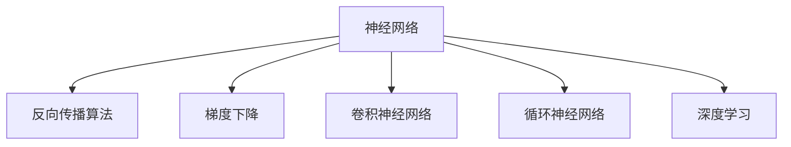

                 

# 神经网络：人工智能的基石

> 关键词：神经网络,人工智能,机器学习,深度学习,反向传播算法,梯度下降,卷积神经网络,循环神经网络

## 1. 背景介绍

### 1.1 问题由来
人工智能（Artificial Intelligence, AI）作为现代科学技术的瑰宝，已经渗透到我们生活的方方面面，从自动驾驶、机器人到个性化推荐、医疗诊断，无处不在。在这些技术背后，神经网络作为AI的重要组成部分，扮演着至关重要的角色。

神经网络（Neural Networks）的灵感来源于人脑的神经元网络。它们通过模拟人类大脑的学习机制，实现了对大量复杂数据的有效处理和分析。本文将从神经网络的基本概念出发，深入探讨其核心算法原理与应用实践，旨在帮助读者全面理解这一前沿技术，并掌握其实现方法。

### 1.2 问题核心关键点
神经网络的核心在于其能够通过学习和训练，将原始数据映射到高维空间，从中提取出有用的特征和规律，从而实现分类、回归、生成等任务。其中，反向传播算法和梯度下降是其最核心的两个算法，用于训练模型并优化参数。此外，卷积神经网络（CNN）和循环神经网络（RNN）等特定结构的网络类型，在处理不同类型数据时表现出色，推动了神经网络在图像识别、语音识别、自然语言处理等领域的应用。

本文将重点探讨神经网络的基本原理、核心算法、实现方法和实际应用场景，以期为读者提供深入的技术洞察和实践指导。

## 2. 核心概念与联系

### 2.1 核心概念概述

为更好地理解神经网络的基本原理和应用，本节将介绍几个关键概念：

- 神经网络（Neural Network）：由大量人工神经元组成的计算模型，通过模拟人脑神经元的工作机制，实现对数据的自动学习和处理。

- 反向传播算法（Backpropagation）：一种基于链式法则的优化算法，用于训练神经网络模型，通过反向传播误差信号，更新模型参数以最小化损失函数。

- 梯度下降（Gradient Descent）：一种经典的优化算法，通过迭代更新参数，使得损失函数最小化。

- 卷积神经网络（Convolutional Neural Networks, CNNs）：一种针对图像等二维数据的神经网络结构，通过卷积操作提取局部特征，提升模型性能。

- 循环神经网络（Recurrent Neural Networks, RNNs）：一种能够处理序列数据的神经网络结构，通过循环机制保存历史信息，适用于文本、语音等时序数据。

- 深度学习（Deep Learning）：基于多层神经网络的机器学习技术，通过深度结构对数据进行复杂抽象和分析，广泛应用于各种AI任务。

这些核心概念之间的逻辑关系可以通过以下Mermaid流程图来展示：



这个流程图展示了几大核心概念之间的关联：

1. 神经网络通过反向传播算法和梯度下降进行训练。
2. CNN和RNN是神经网络中的两大重要结构，分别用于处理二维图像和序列数据。
3. 深度学习是神经网络技术在多层次结构上的应用，提升了模型的复杂度和性能。

## 3. 核心算法原理 & 具体操作步骤
### 3.1 算法原理概述

神经网络的基本工作流程包括前向传播和反向传播两个步骤。在每次训练中，先通过前向传播计算出网络的输出，再利用反向传播算法根据输出误差调整网络参数，以提高模型的准确性和泛化能力。

假设有一个简单的前馈神经网络，包含输入层 $x \in \mathbb{R}^n$、若干隐藏层 $h_1, h_2, ..., h_l$ 和输出层 $y \in \mathbb{R}^m$，其中 $l$ 为隐藏层数。每个隐藏层包含若干个神经元，每个神经元的输出为：

$$
h_i = f(W_i x + b_i)
$$

其中 $f$ 为激活函数，$W_i$ 和 $b_i$ 为第 $i$ 层的权重矩阵和偏置向量。输出层的神经元同样遵循上述公式，但激活函数可能与隐藏层不同。

神经网络的损失函数通常为均方误差、交叉熵等，目标是使输出 $y$ 尽可能接近真实值 $y^*$。通过反向传播算法，网络能够自动更新权重矩阵和偏置向量，最小化损失函数。

### 3.2 算法步骤详解

神经网络的训练过程分为以下几个关键步骤：

**Step 1: 准备训练数据和标签**
- 收集训练数据集 $D = \{(x_i, y_i)\}_{i=1}^N$，其中 $x_i$ 为输入，$y_i$ 为标签。

**Step 2: 初始化模型参数**
- 随机初始化所有权重矩阵 $W$ 和偏置向量 $b$。

**Step 3: 前向传播**
- 输入 $x$ 通过网络逐层传播，计算各层的输出 $h$。

**Step 4: 计算损失函数**
- 计算网络输出 $y$ 与真实标签 $y^*$ 的误差，通常使用均方误差、交叉熵等作为损失函数。

**Step 5: 反向传播**
- 从输出层开始，反向计算误差对各层权重和偏置的梯度，更新模型参数。

**Step 6: 重复训练**
- 重复执行 Step 3 到 Step 5，直到模型收敛或达到预设迭代次数。

### 3.3 算法优缺点

神经网络的核心算法—反向传播和梯度下降—具有以下优点：
1. 简单易用：易于实现，不需要过多的数学背景。
2. 泛化能力强：适用于多种类型的输入数据和任务。
3. 自动特征提取：能够自动学习数据的特征表示。

同时，这些算法也存在一些局限性：
1. 过拟合风险：需要大量数据和正则化技术来避免过拟合。
2. 训练时间长：模型复杂度大时，训练时间较长。
3. 超参数调参：需要手动调整学习率、迭代次数等超参数。

尽管存在这些局限性，反向传播和梯度下降依然是当前神经网络训练的主流算法。未来研究将致力于进一步提高算法的稳定性和效率，降低训练成本。

### 3.4 算法应用领域

神经网络技术在各个领域都有广泛应用：

- 计算机视觉：如图像分类、物体检测、图像分割等。通过卷积神经网络（CNN）实现图像特征的自动提取和识别。
- 自然语言处理：如文本分类、机器翻译、情感分析等。通过循环神经网络（RNN）和Transformer等结构处理文本序列数据。
- 语音识别：如语音转文字、语音合成等。通过卷积神经网络或循环神经网络对音频信号进行特征提取和处理。
- 推荐系统：如协同过滤、基于内容的推荐等。通过深度学习模型分析用户行为和物品属性，预测用户偏好。
- 自动驾驶：如车辆识别、路径规划等。通过卷积神经网络和循环神经网络实现环境感知和决策。

## 4. 数学模型和公式 & 详细讲解 & 举例说明
### 4.1 数学模型构建

神经网络的核心数学模型包括输入数据、权重矩阵、偏置向量、激活函数和损失函数等。

假设输入数据为 $x \in \mathbb{R}^n$，输出数据为 $y \in \mathbb{R}^m$，隐藏层 $h_l \in \mathbb{R}^{n_l}$，激活函数为 $f$。神经网络的数学模型可以表示为：

$$
y = f_1(f_2(...(f_l(W_l h_{l-1} + b_l)...))
$$

其中 $W_l$ 和 $b_l$ 分别为第 $l$ 层的权重矩阵和偏置向量，$f_l$ 为第 $l$ 层的激活函数。

### 4.2 公式推导过程

以一个简单的全连接神经网络为例，进行损失函数和梯度推导。

假设输出层神经元的激活函数为线性函数，输出层和真实标签的误差为均方误差，定义如下：

$$
L = \frac{1}{2N} \sum_{i=1}^N \sum_{j=1}^m (y_j - y^*_j)^2
$$

其中 $N$ 为训练样本数，$y_j$ 为第 $j$ 个输出神经元的预测值，$y^*_j$ 为真实标签。

根据链式法则，梯度 $\nabla_L$ 可以表示为：

$$
\nabla_L = \frac{1}{N} \sum_{i=1}^N \sum_{j=1}^m (y_j - y^*_j) \nabla_y f_j
$$

其中 $\nabla_y f_j = f'_j(x)$ 为激活函数的导数。

梯度反向传播过程如下：

$$
\nabla_L \rightarrow \nabla_{W_l} \rightarrow \nabla_{W_{l-1}} \rightarrow ... \rightarrow \nabla_{W_1} \rightarrow \nabla_{b_1}
$$

每次迭代，根据梯度更新权重矩阵和偏置向量，直到误差收敛或达到预设迭代次数。

### 4.3 案例分析与讲解

以一个手写数字识别的神经网络为例，展示从模型构建到训练的全过程。

**Step 1: 准备数据和标签**
- 收集MNIST数据集，包含60000张28x28的灰度图像和对应的标签。

**Step 2: 初始化模型参数**
- 随机初始化输入层、隐藏层和输出层的权重矩阵和偏置向量。

**Step 3: 前向传播**
- 将输入图像通过网络逐层传播，计算各层的输出。

**Step 4: 计算损失函数**
- 计算网络输出与真实标签的均方误差，作为损失函数。

**Step 5: 反向传播**
- 反向计算误差对各层权重和偏置的梯度，更新模型参数。

**Step 6: 重复训练**
- 重复执行 Step 3 到 Step 5，直到模型收敛或达到预设迭代次数。

最终，训练好的模型能够准确识别手写数字，实现图像分类任务。

## 5. 项目实践：代码实例和详细解释说明
### 5.1 开发环境搭建

在进行神经网络实践前，我们需要准备好开发环境。以下是使用Python进行TensorFlow和Keras开发的环境配置流程：

1. 安装Anaconda：从官网下载并安装Anaconda，用于创建独立的Python环境。

2. 创建并激活虚拟环境：
```bash
conda create -n tf-env python=3.8 
conda activate tf-env
```

3. 安装TensorFlow：根据CUDA版本，从官网获取对应的安装命令。例如：
```bash
conda install tensorflow -c tensorflow -c conda-forge
```

4. 安装Keras：
```bash
pip install keras
```

5. 安装各类工具包：
```bash
pip install numpy pandas scikit-learn matplotlib tqdm jupyter notebook ipython
```

完成上述步骤后，即可在`tf-env`环境中开始神经网络实践。

### 5.2 源代码详细实现

下面我们以手写数字识别（MNIST）为例，给出使用Keras实现卷积神经网络（CNN）的完整代码实现。

```python
import tensorflow as tf
from tensorflow.keras import layers, models

# 准备数据集
(x_train, y_train), (x_test, y_test) = tf.keras.datasets.mnist.load_data()

# 数据预处理
x_train = x_train.reshape(-1, 28, 28, 1).astype('float32') / 255.0
x_test = x_test.reshape(-1, 28, 28, 1).astype('float32') / 255.0
y_train = tf.keras.utils.to_categorical(y_train, 10)
y_test = tf.keras.utils.to_categorical(y_test, 10)

# 构建CNN模型
model = models.Sequential([
    layers.Conv2D(32, (3, 3), activation='relu', input_shape=(28, 28, 1)),
    layers.MaxPooling2D((2, 2)),
    layers.Conv2D(64, (3, 3), activation='relu'),
    layers.MaxPooling2D((2, 2)),
    layers.Conv2D(64, (3, 3), activation='relu'),
    layers.Flatten(),
    layers.Dense(64, activation='relu'),
    layers.Dense(10, activation='softmax')
])

# 编译模型
model.compile(optimizer='adam',
              loss='categorical_crossentropy',
              metrics=['accuracy'])

# 训练模型
model.fit(x_train, y_train, epochs=10, batch_size=128, validation_data=(x_test, y_test))

# 评估模型
model.evaluate(x_test, y_test)
```

以上代码展示了使用Keras构建卷积神经网络的过程，包括数据准备、模型构建、编译、训练和评估等关键步骤。

### 5.3 代码解读与分析

让我们再详细解读一下关键代码的实现细节：

**数据准备**：
- 使用TensorFlow自带的MNIST数据集，将图像数据标准化，并转换为模型所需格式。

**模型构建**：
- 使用Sequential模型定义神经网络结构，包含3个卷积层和2个全连接层。
- 卷积层通过指定过滤器数量和大小，以及激活函数实现特征提取。
- 池化层通过降采样操作减少特征图尺寸，提取更强的特征表示。
- 全连接层通过线性变换将特征映射到输出空间，实现分类任务。

**模型编译**：
- 使用Adam优化器，交叉熵损失函数，以及准确率作为评估指标。

**模型训练**：
- 使用训练数据集进行模型训练，设置训练轮数和批次大小。
- 在每个epoch结束时，使用验证数据集评估模型性能。

**模型评估**：
- 使用测试数据集评估模型性能，输出准确率和损失。

可以看到，TensorFlow和Keras的组合使得神经网络的构建和训练变得简洁高效。开发者可以将更多精力放在数据处理、模型改进等高层逻辑上，而不必过多关注底层的实现细节。

当然，工业级的系统实现还需考虑更多因素，如模型的保存和部署、超参数的自动搜索、更灵活的任务适配层等。但核心的神经网络构建和训练范式基本与此类似。

## 6. 实际应用场景
### 6.1 图像识别

卷积神经网络（CNN）在图像识别领域取得了巨大成功，广泛应用于物体检测、人脸识别、医学影像分析等任务。例如，Google的Inception网络通过多尺度卷积操作，提升了图像分类和目标检测的精度。在实践中，通过收集大量标注图像数据，并使用微调技术对模型进行优化，能够实现对特定图像类别的精准识别。

### 6.2 自然语言处理

循环神经网络（RNN）和Transformer等结构在自然语言处理领域表现出色，被广泛应用于机器翻译、文本生成、情感分析等任务。例如，Facebook的Sequence to Sequence框架，通过编码器-解码器结构，实现了高效的机器翻译。在实践中，通过收集大量标注文本数据，并使用微调技术对模型进行优化，能够实现对特定语言任务的精准处理。

### 6.3 语音识别

卷积神经网络（CNN）和循环神经网络（RNN）等结构在语音识别领域也有广泛应用，被用于语音转文字、语音合成等任务。例如，IBM的WaveNet模型通过卷积神经网络生成自然流畅的语音，提升了语音识别的自然度。在实践中，通过收集大量标注语音数据，并使用微调技术对模型进行优化，能够实现对特定语音任务的精准处理。

### 6.4 未来应用展望

随着神经网络技术的不断演进，其应用领域将进一步扩展，为各行各业带来深远影响：

- 医疗诊断：通过神经网络对医学影像和电子病历进行分析，辅助医生进行疾病诊断和治疗决策。
- 金融风控：通过神经网络对交易数据进行分析和预测，防范金融风险和欺诈行为。
- 自动驾驶：通过神经网络对传感器数据进行分析和决策，实现自动驾驶和智能交通管理。
- 智能家居：通过神经网络对家庭环境数据进行分析，实现智能家居控制和生活建议。
- 个性化推荐：通过神经网络对用户行为数据进行分析，实现精准推荐，提升用户体验。

神经网络技术将广泛应用于各个领域，推动人工智能技术的普及和应用，带来更加智能、高效、便利的解决方案。

## 7. 工具和资源推荐
### 7.1 学习资源推荐

为了帮助开发者系统掌握神经网络的理论基础和实践技巧，这里推荐一些优质的学习资源：

1. 《深度学习》（Ian Goodfellow等著）：全面介绍了深度学习的理论基础和实现方法，是深度学习领域的经典教材。

2. CS231n《卷积神经网络》课程：斯坦福大学开设的计算机视觉课程，涵盖了卷积神经网络的基本原理和实践技巧。

3. CS224n《自然语言处理》课程：斯坦福大学开设的自然语言处理课程，深入讲解了循环神经网络、Transformer等模型。

4. 《Python深度学习》（Francois Chollet著）：Keras框架的作者所撰写的书籍，详细介绍了使用Keras进行深度学习开发的方法和技巧。

5. arXiv上的相关论文：深度学习领域的顶级会议和期刊，如NeurIPS、ICML、JMLR等，定期发布最新的研究进展和成果。

通过对这些资源的学习实践，相信你一定能够快速掌握神经网络的核心算法和应用方法，并用于解决实际的AI问题。

### 7.2 开发工具推荐

高效的开发离不开优秀的工具支持。以下是几款用于神经网络开发常用的工具：

1. TensorFlow：由Google主导开发的开源深度学习框架，支持分布式训练和多种硬件加速。

2. Keras：基于TensorFlow的高级神经网络API，提供了简单易用的接口，适合快速原型开发和实验。

3. PyTorch：Facebook开源的深度学习框架，支持动态计算图和GPU加速，适合研究和原型开发。

4. Weights & Biases：模型训练的实验跟踪工具，可以记录和可视化模型训练过程中的各项指标，方便对比和调优。

5. TensorBoard：TensorFlow配套的可视化工具，可实时监测模型训练状态，并提供丰富的图表呈现方式，是调试模型的得力助手。

6. Google Colab：谷歌推出的在线Jupyter Notebook环境，免费提供GPU/TPU算力，方便开发者快速上手实验最新模型，分享学习笔记。

合理利用这些工具，可以显著提升神经网络模型的开发效率，加快创新迭代的步伐。

### 7.3 相关论文推荐

神经网络技术的发展源于学界的持续研究。以下是几篇奠基性的相关论文，推荐阅读：

1. AlexNet: ImageNet Classification with Deep Convolutional Neural Networks：提出卷积神经网络，展示了其在图像分类任务上的强大性能。

2. Recurrent Neural Network Tutorial, Part 1: Architecture and Introduction to rnn：详细介绍了循环神经网络的基本原理和实现方法。

3. Attention is All You Need：提出Transformer模型，利用自注意力机制提升了序列数据处理的性能。

4. On the Importance of Initialization and Momentum in Deep Learning：讨论了神经网络初始化和动量优化器的选择，对深度学习模型的训练效果有重要影响。

5. ResNet: Deep Residual Learning for Image Recognition：提出残差网络（ResNet），解决了深层网络退化的问题，提升了神经网络的训练效果。

这些论文代表了大神经网络技术的发展脉络。通过学习这些前沿成果，可以帮助研究者把握学科前进方向，激发更多的创新灵感。

## 8. 总结：未来发展趋势与挑战

### 8.1 总结

本文对神经网络的基本原理、核心算法、实现方法和实际应用进行了全面系统的介绍。首先阐述了神经网络作为AI的基石，详细讲解了其核心算法—反向传播和梯度下降—的实现过程，并展示了一个完整的神经网络实践案例。通过实例分析，展示了神经网络在图像识别、自然语言处理、语音识别等领域的广泛应用，以及其未来发展前景。

通过本文的系统梳理，可以看到，神经网络技术作为人工智能的核心组成部分，正在不断推动物理和数学的边界，为解决复杂任务提供了强大的工具。未来，随着神经网络模型的不断发展，其在各个领域的应用将更加广泛，为人类社会的进步带来深远影响。

### 8.2 未来发展趋势

展望未来，神经网络技术将呈现以下几个发展趋势：

1. 模型结构更加复杂：随着神经网络理论的不断演进，未来的模型将变得更加深层次和复杂化，从而实现更高阶的抽象和推理。

2. 模型压缩和加速：在硬件资源受限的情况下，如何设计更高效、更轻量级的神经网络模型，成为重要的研究方向。

3. 模型融合与协同：神经网络与其他AI技术（如强化学习、知识图谱等）的融合，将实现更全面、更深入的信息处理能力。

4. 分布式计算与多模态学习：在大规模数据和复杂任务的背景下，如何利用分布式计算和多模态数据，提升神经网络模型的训练和推理性能。

5. 模型解释性与可信度：在应用场景中，如何赋予神经网络更强的解释性，提升模型的可信度和安全性。

6. 跨领域知识迁移：如何通过迁移学习技术，将神经网络在不同领域和任务之间的知识进行迁移和融合，实现更广泛的应用。

这些趋势展示了神经网络技术的未来发展方向，为实现更加智能、高效、安全的人工智能系统提供了新的思路。

### 8.3 面临的挑战

尽管神经网络技术取得了巨大的成功，但在迈向更加智能化、普适化应用的过程中，仍面临诸多挑战：

1. 数据需求量大：深度学习模型需要大量的标注数据，数据的获取和标注成本较高，限制了模型的泛化能力。

2. 模型复杂度高：深层网络模型的训练和推理效率低，计算资源消耗大，限制了模型的应用场景。

3. 过拟合风险高：深层网络模型容易过拟合，需要大量的正则化技术和数据增强方法来避免过拟合。

4. 模型可解释性不足：神经网络模型通常被视为"黑盒"，难以解释其内部工作机制和决策逻辑，限制了模型的应用范围。

5. 模型安全性问题：深度学习模型可能学习到有害的偏见和信息，带来伦理和法律风险。

6. 硬件资源限制：当前深度学习模型的训练和推理需要高性能的硬件设备，如GPU、TPU等，硬件资源的限制限制了模型的规模和应用。

这些挑战需要未来研究者进一步探索和解决，以实现更加智能、安全、可解释的神经网络模型。

### 8.4 研究展望

面对神经网络技术所面临的挑战，未来的研究需要在以下几个方面寻求新的突破：

1. 无监督和半监督学习：探索无监督和半监督学习方法，减少对标注数据的依赖，提升模型的泛化能力。

2. 模型压缩与加速：设计更高效、更轻量级的神经网络模型，提升模型的训练和推理效率。

3. 跨领域知识迁移：研究跨领域知识迁移方法，提升模型的通用性和适应性。

4. 模型解释性与可信度：设计可解释性更强的神经网络模型，提升模型的可信度和安全性。

5. 分布式计算与多模态学习：探索分布式计算和多模态数据融合方法，提升模型的训练和推理能力。

6. 模型伦理与安全：引入伦理和安全约束，设计能够保证公平性、透明性和安全性的神经网络模型。

这些研究方向将引领神经网络技术向更加智能、安全、可解释的方向发展，为实现通用人工智能（AGI）奠定坚实基础。

## 9. 附录：常见问题与解答

**Q1：神经网络训练过程中如何避免过拟合？**

A: 避免过拟合的常见方法包括：
1. 数据增强：通过旋转、缩放、裁剪等方式增加训练集的多样性。
2. 正则化技术：使用L2正则、Dropout等技术约束模型参数。
3. 早停法：在验证集性能不再提升时，提前停止训练。
4. 模型复杂度控制：减少网络层数和参数量，降低模型的复杂度。
5. 集成学习：使用多个模型进行集成，减少单个模型的过拟合风险。

**Q2：神经网络在训练过程中如何选择学习率？**

A: 学习率的选择对神经网络的训练效果有重要影响，通常采用以下方法：
1. 固定学习率：根据经验选择固定学习率，常见的如0.001、0.01、0.1等。
2. 学习率衰减：随着训练进程逐渐减小学习率，如指数衰减、余弦衰减等。
3. 学习率调优：使用学习率调优算法（如学习率调整策略、自适应学习率算法等）自动选择最优学习率。

**Q3：神经网络在实际应用中如何解决计算效率问题？**

A: 提高神经网络计算效率的方法包括：
1. 模型压缩：使用知识蒸馏、剪枝等技术压缩模型，减少参数量和计算量。
2. 硬件加速：使用GPU、TPU等高性能硬件设备加速计算。
3. 量化优化：将浮点模型转换为定点模型，减少内存消耗和计算速度。
4. 模型并行：使用分布式计算和多机多核技术并行计算，提高训练和推理效率。
5. 算法优化：优化神经网络中的算法，如使用快速梯度下降、自适应学习率等。

这些方法能够有效提高神经网络模型的计算效率，使其在实际应用中更加高效、可靠。

**Q4：神经网络在实际应用中如何处理多模态数据？**

A: 处理多模态数据的方法包括：
1. 特征融合：将不同模态的数据进行特征融合，如使用跨模态嵌入技术将图像、文本、音频等数据转换为统一的特征表示。
2. 多任务学习：设计多任务学习框架，同时训练多个相关任务，提升模型的多模态理解和处理能力。
3. 联合训练：将多个模态数据联合训练，提升模型对不同模态数据的适应性和泛化能力。
4. 元学习：使用元学习方法，提升模型对新模态数据的适应性，实现跨模态迁移学习。

这些方法能够有效处理多模态数据，提升神经网络模型的性能和应用范围。

---

作者：禅与计算机程序设计艺术 / Zen and the Art of Computer Programming

