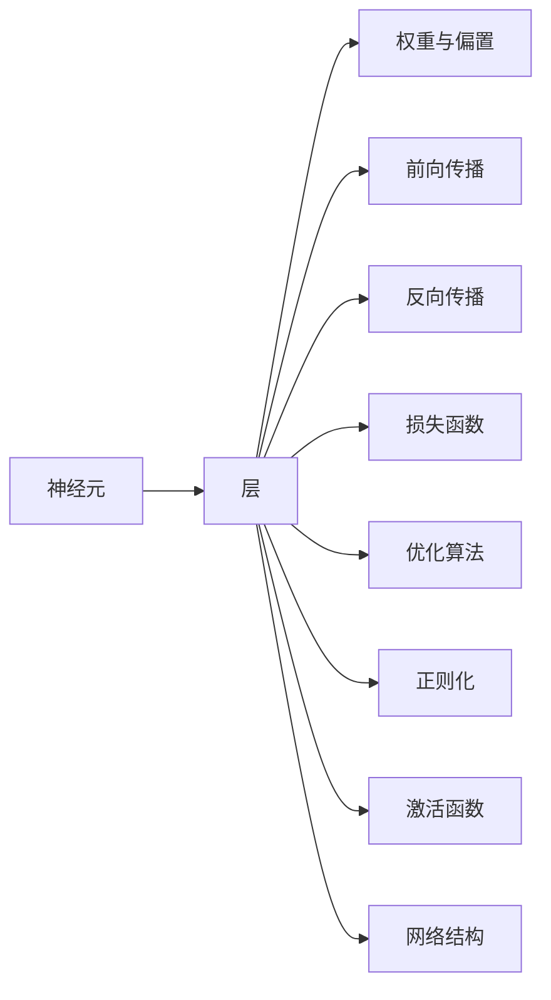

                 

## 1. 背景介绍

### 1.1 问题由来

人工智能（AI）技术已经成为21世纪最重要的技术之一，广泛应用于医疗、金融、制造、交通、教育等多个领域。在人工智能中，神经网络（Neural Network, NN）是一种基于生物学神经元模型的算法框架，通过大量神经元的组合与协作，实现对复杂模式和数据的学习与推理。

近年来，随着深度学习技术的发展，神经网络已经成为AI领域的主流技术，特别是深度神经网络（Deep Neural Network, DNN），在图像识别、语音识别、自然语言处理等领域取得了重大突破。深度学习神经网络具有强大的表达能力与适应性，其核心是多层神经网络的组合与应用。

### 1.2 问题核心关键点

神经网络的应用核心在于其强大的模式识别与特征学习能力，能够自动从大量数据中提取有用的特征和规律。同时，神经网络还具有较强的泛化能力，可以在新的数据集上表现出色。

神经网络主要有以下几个核心关键点：

- **前向传播与反向传播**：神经网络通过前向传播将输入数据传递到网络各层，通过反向传播计算误差，并根据误差更新模型参数，优化网络结构。
- **损失函数**：用于衡量模型预测结果与真实标签之间的差异，常见的损失函数包括交叉熵损失、均方误差损失等。
- **激活函数**：在神经元输出时引入非线性变换，增强模型的表达能力，常用的激活函数包括Sigmoid、ReLU、Tanh等。
- **优化算法**：用于更新神经网络参数，常用的优化算法包括SGD、Adam、Adagrad等。
- **正则化**：防止过拟合，包括L1正则化、L2正则化、Dropout等。
- **网络结构**：神经网络的结构包括层数、神经元数量、连接方式等，不同的网络结构适用于不同的任务与数据。

神经网络在AI领域的应用已经深刻影响了各行各业的发展，未来随着技术的不断进步，神经网络将在更多的领域发挥更大作用。

## 2. 核心概念与联系

### 2.1 核心概念概述

在神经网络的学习与应用过程中，涉及到多个核心概念。以下将对各个关键概念进行概述：

- **神经元（Neuron）**：神经网络的基本单位，通过线性变换与激活函数实现对输入数据的处理。
- **层（Layer）**：神经网络由多个层组成，每层负责对输入进行特定的特征提取与变换。
- **权重与偏置（Weight & Bias）**：神经元之间的连接权重与偏置决定了神经元之间的传递与转换。
- **前向传播（Forward Propagation）**：输入数据从第一层到最终输出层的传递过程。
- **反向传播（Backpropagation）**：通过链式法则计算梯度，更新网络参数，优化模型性能。
- **损失函数（Loss Function）**：用于衡量模型预测结果与真实标签之间的差异，指导模型的优化。
- **优化算法（Optimization Algorithm）**：通过计算梯度更新模型参数，使得模型不断优化。
- **正则化（Regularization）**：防止模型过拟合，提升模型的泛化能力。
- **激活函数（Activation Function）**：引入非线性变换，增强模型的表达能力。
- **网络结构（Network Architecture）**：确定神经网络的层数、神经元数量、连接方式等。

这些核心概念之间相互关联，构成神经网络学习的完整框架。以下通过Mermaid流程图展示核心概念之间的关系：



通过以上流程图的展示，可以清晰地看到神经网络各个核心概念之间的联系与作用机制。

### 2.2 核心概念原理和架构

#### 2.2.1 神经元（Neuron）

神经元是神经网络的基本单位，其结构如图1所示：


神经元接收输入信号（通常为向量）$x = [x_1, x_2, ..., x_n]$，通过线性变换$w \cdot x + b$计算得到中间结果，然后通过激活函数$f$输出结果：

$$
y = f(w \cdot x + b)
$$

其中，$w$为权重向量，$b$为偏置项，$f$为激活函数。常用的激活函数包括Sigmoid、ReLU、Tanh等。

#### 2.2.2 层（Layer）

神经网络由多个层组成，如图2所示：


每层神经元接收上一层输出，通过线性变换与激活函数进行处理，将信息传递到下一层。例如，一个简单的神经网络由输入层、隐藏层和输出层组成，输入层接收原始数据，隐藏层提取特征，输出层输出最终结果。

#### 2.2.3 权重与偏置（Weight & Bias）

神经元之间的连接权重与偏置决定了神经元之间的传递与转换。例如，一个神经元与上一层两个神经元连接，其权重向量为$w = [w_{11}, w_{12}, w_{21}, w_{22}]$，偏置项为$b$。权重和偏置的具体计算如下：

$$
y = w \cdot x + b
$$

#### 2.2.4 前向传播（Forward Propagation）

前向传播是从输入层到输出层的传递过程。以一个简单的两层神经网络为例，其前向传播过程如图3所示：


前向传播的计算公式如下：

$$
y = f(w \cdot f(x) + b)
$$

其中，$x$为输入数据，$f$为激活函数，$w$为权重矩阵。

#### 2.2.5 反向传播（Backpropagation）

反向传播是通过链式法则计算梯度，更新模型参数的过程。以一个简单的两层神经网络为例，其反向传播过程如图4所示：


反向传播的计算公式如下：

$$
\frac{\partial L}{\partial w} = \frac{\partial L}{\partial y} \cdot \frac{\partial y}{\partial w}
$$

其中，$L$为损失函数，$y$为输出结果，$w$为权重矩阵。通过反向传播，可以更新每个神经元的权重和偏置，从而优化模型性能。

#### 2.2.6 损失函数（Loss Function）

损失函数用于衡量模型预测结果与真实标签之间的差异，指导模型的优化。常用的损失函数包括交叉熵损失、均方误差损失等。以交叉熵损失为例，其计算公式如下：

$$
L = -\frac{1}{N} \sum_{i=1}^N y_i \log y_{\hat{i}}
$$

其中，$y$为真实标签，$y_{\hat{i}}$为模型预测结果。

#### 2.2.7 优化算法（Optimization Algorithm）

优化算法用于更新模型参数，使得模型不断优化。常用的优化算法包括SGD、Adam、Adagrad等。以Adam算法为例，其计算公式如下：

$$
w_{t+1} = w_t - \frac{\eta}{\sqrt{v_{t+1}+\epsilon}} \cdot g_t + \frac{1-\beta_2}{1-\beta_1} \cdot v_t
$$

其中，$w$为权重矩阵，$v$为梯度平方的移动平均值，$\eta$为学习率，$\beta_1$和$\beta_2$为衰减系数，$\epsilon$为正则化项。

#### 2.2.8 正则化（Regularization）

正则化用于防止模型过拟合，提升模型的泛化能力。常用的正则化方法包括L1正则化、L2正则化、Dropout等。以L2正则化为例，其计算公式如下：

$$
L_{reg} = \frac{\lambda}{2} \sum_{w} ||w||^2
$$

其中，$\lambda$为正则化系数，$w$为权重矩阵。

#### 2.2.9 激活函数（Activation Function）

激活函数引入非线性变换，增强模型的表达能力。常用的激活函数包括Sigmoid、ReLU、Tanh等。以ReLU激活函数为例，其计算公式如下：

$$
f(x) = \max(0, x)
$$

#### 2.2.10 网络结构（Network Architecture）

神经网络的结构包括层数、神经元数量、连接方式等。例如，一个简单的神经网络由输入层、隐藏层和输出层组成，其中隐藏层包含多个神经元，如图5所示：


## 3. 核心算法原理 & 具体操作步骤

### 3.1 算法原理概述

神经网络通过大量神经元的组合与协作，实现对复杂模式和数据的学习与推理。神经网络的主要工作流程包括前向传播与反向传播，如图6所示：


前向传播将输入数据传递到网络各层，通过线性变换与激活函数进行处理，得到最终输出结果。反向传播通过链式法则计算梯度，更新模型参数，优化网络结构。

### 3.2 算法步骤详解

#### 3.2.1 前向传播（Forward Propagation）

1. 将输入数据$x$传递到第一层神经元，通过线性变换与激活函数处理得到输出结果$y$。
2. 将$y$作为下一层的输入，重复上述步骤，直到最后一层。
3. 最终输出结果$y$即为神经网络对输入数据的处理结果。

#### 3.2.2 反向传播（Backpropagation）

1. 计算损失函数$L$与输出结果$y$之间的差异。
2. 通过链式法则计算每一层的梯度，得到权重矩阵$w$和偏置项$b$的更新量。
3. 更新权重矩阵和偏置项，重复上述步骤，直至网络结构稳定。

#### 3.2.3 优化算法（Optimization Algorithm）

1. 选择适当的优化算法，如SGD、Adam等。
2. 设置学习率、批大小等参数。
3. 通过前向传播与反向传播计算梯度，更新模型参数。
4. 重复上述步骤，直至模型收敛。

#### 3.2.4 正则化（Regularization）

1. 选择适当的正则化方法，如L1正则化、L2正则化等。
2. 设置正则化系数。
3. 在损失函数中引入正则化项。
4. 通过反向传播更新权重矩阵，防止过拟合。

#### 3.2.5 激活函数（Activation Function）

1. 选择适当的激活函数，如Sigmoid、ReLU等。
2. 在神经元输出时引入非线性变换。
3. 增强模型的表达能力，提升模型性能。

### 3.3 算法优缺点

#### 3.3.1 优点

1. 强大的表达能力：神经网络可以通过大量神经元的组合与协作，自动提取数据中的特征与规律。
2. 适应性广：神经网络可以适应多种任务与数据类型，具有较高的泛化能力。
3. 自动化学习：神经网络通过自动学习，无需手工设计特征，能够高效处理复杂模式。
4. 可扩展性强：神经网络可以通过增加层数与神经元数量，不断提升模型性能。

#### 3.3.2 缺点

1. 需要大量数据：神经网络需要大量标注数据进行训练，数据获取成本较高。
2. 计算资源消耗大：神经网络参数量大，计算资源消耗较大，训练速度较慢。
3. 容易过拟合：神经网络容易过拟合，需要正则化等技术进行优化。
4. 可解释性差：神经网络的决策过程复杂，难以解释。

### 3.4 算法应用领域

神经网络在AI领域具有广泛的应用，以下列举几个典型的应用领域：

1. 图像识别：通过卷积神经网络（CNN）对图像进行分类、识别等处理。
2. 语音识别：通过循环神经网络（RNN）对语音进行特征提取与识别。
3. 自然语言处理：通过递归神经网络（RNN）、长短时记忆网络（LSTM）、Transformer等模型对文本进行处理。
4. 推荐系统：通过神经网络对用户行为进行建模，推荐系统推荐商品、电影等。
5. 控制系统：通过神经网络对控制系统进行优化与控制，如自动驾驶、机器人等。

## 4. 数学模型和公式 & 详细讲解 & 举例说明

### 4.1 数学模型构建

神经网络通过大量神经元的组合与协作，实现对复杂模式和数据的学习与推理。以下通过数学模型对神经网络的学习过程进行详细讲解：

#### 4.1.1 单层神经网络

假设输入数据$x = [x_1, x_2, ..., x_n]$，隐藏层神经元为$h$，输出结果为$y$，权重矩阵为$w$，偏置项为$b$，激活函数为$f$。单层神经网络的数学模型如下：

$$
y = f(w \cdot x + b)
$$

其中，$f$为激活函数，常用的激活函数包括Sigmoid、ReLU、Tanh等。

#### 4.1.2 多层神经网络

多层神经网络由多个单层神经网络组成，如图7所示：


多层神经网络通过逐层传递与变换，实现对复杂数据的处理。以一个简单的两层神经网络为例，其数学模型如下：

$$
y = f(w \cdot f(x) + b)
$$

其中，$x$为输入数据，$f$为激活函数，$w$为权重矩阵，$b$为偏置项。

### 4.2 公式推导过程

#### 4.2.1 交叉熵损失函数

交叉熵损失函数用于衡量模型预测结果与真实标签之间的差异。以二分类任务为例，其计算公式如下：

$$
L = -\frac{1}{N} \sum_{i=1}^N (y_i \log \hat{y}_i + (1-y_i) \log (1-\hat{y}_i))
$$

其中，$y_i$为真实标签，$\hat{y}_i$为模型预测结果。

#### 4.2.2 梯度计算

梯度计算通过反向传播实现，以一个简单的两层神经网络为例，其梯度计算公式如下：

$$
\frac{\partial L}{\partial w} = \frac{\partial L}{\partial y} \cdot \frac{\partial y}{\partial w}
$$

其中，$L$为损失函数，$y$为输出结果，$w$为权重矩阵。

### 4.3 案例分析与讲解

#### 4.3.1 手写数字识别

手写数字识别是图像识别中的一个经典案例。以MNIST数据集为例，其包含大量手写数字图像，如图8所示：


手写数字识别通过卷积神经网络（CNN）实现，其网络结构如图9所示：


通过卷积层、池化层、全连接层等组成的多层网络，CNN能够自动提取数字图像中的特征与规律，从而实现准确识别。

## 5. 项目实践：代码实例和详细解释说明

### 5.1 开发环境搭建

在进行神经网络项目实践前，需要准备好开发环境。以下是使用Python进行TensorFlow开发的环境配置流程：

1. 安装Anaconda：从官网下载并安装Anaconda，用于创建独立的Python环境。

2. 创建并激活虚拟环境：
```bash
conda create -n tensorflow-env python=3.8 
conda activate tensorflow-env
```

3. 安装TensorFlow：根据CUDA版本，从官网获取对应的安装命令。例如：
```bash
conda install tensorflow tensorflow-gpu=cuda11.1 -c tf-nightly -c conda-forge
```

4. 安装各类工具包：
```bash
pip install numpy pandas scikit-learn matplotlib tqdm jupyter notebook ipython
```

完成上述步骤后，即可在`tensorflow-env`环境中开始神经网络实践。

### 5.2 源代码详细实现

下面以手写数字识别为例，给出使用TensorFlow对卷积神经网络进行训练和测试的PyTorch代码实现。

首先，定义数据处理函数：

```python
import tensorflow as tf
from tensorflow.keras.datasets import mnist
from tensorflow.keras.models import Sequential
from tensorflow.keras.layers import Conv2D, MaxPooling2D, Flatten, Dense, Dropout

def load_data():
    (x_train, y_train), (x_test, y_test) = mnist.load_data()
    x_train = x_train.reshape((60000, 28, 28, 1))
    x_test = x_test.reshape((10000, 28, 28, 1))
    x_train = x_train / 255.0
    x_test = x_test / 255.0
    y_train = tf.keras.utils.to_categorical(y_train)
    y_test = tf.keras.utils.to_categorical(y_test)
    return (x_train, y_train), (x_test, y_test)

(x_train, y_train), (x_test, y_test) = load_data()
```

然后，定义模型结构：

```python
model = Sequential()
model.add(Conv2D(32, (3, 3), activation='relu', input_shape=(28, 28, 1)))
model.add(MaxPooling2D((2, 2)))
model.add(Conv2D(64, (3, 3), activation='relu'))
model.add(MaxPooling2D((2, 2)))
model.add(Flatten())
model.add(Dense(64, activation='relu'))
model.add(Dropout(0.5))
model.add(Dense(10, activation='softmax'))
```

接着，定义训练和评估函数：

```python
def train(model, x_train, y_train, x_test, y_test, batch_size, epochs):
    model.compile(optimizer='adam', loss='categorical_crossentropy', metrics=['accuracy'])
    model.fit(x_train, y_train, batch_size=batch_size, epochs=epochs, validation_data=(x_test, y_test))
    test_loss, test_acc = model.evaluate(x_test, y_test)
    print('Test accuracy:', test_acc)

train(model, x_train, y_train, x_test, y_test, batch_size=32, epochs=10)
```

最后，启动训练流程并在测试集上评估：

```python
model.save('mnist_cnn_model.h5')
```

以上就是使用TensorFlow对卷积神经网络进行手写数字识别任务的完整代码实现。可以看到，通过TensorFlow的高级API，我们可以用相对简洁的代码完成卷积神经网络的训练和测试。

### 5.3 代码解读与分析

让我们再详细解读一下关键代码的实现细节：

**load_data函数**：
- 定义数据处理函数，将MNIST数据集加载到模型中，并进行预处理。

**模型定义**：
- 定义一个简单的卷积神经网络，包含卷积层、池化层、全连接层等。

**train函数**：
- 定义训练函数，设置优化器、损失函数、评估指标等。
- 在训练集上训练模型，并在测试集上评估性能。

**train函数**：
- 将训练好的模型保存为HDF5文件，方便后续使用。

可以看到，TensorFlow的高级API使得神经网络的实现变得更加简洁高效。开发者可以将更多精力放在模型结构设计、数据处理等高层逻辑上，而不必过多关注底层的实现细节。

当然，工业级的系统实现还需考虑更多因素，如模型的保存和部署、超参数的自动搜索、更灵活的网络结构设计等。但核心的训练过程基本与此类似。

## 6. 实际应用场景

### 6.1 计算机视觉

计算机视觉是神经网络的一个重要应用领域，包括图像分类、目标检测、图像分割等任务。例如，卷积神经网络（CNN）在图像识别中取得了重大突破，如图10所示：


通过卷积层、池化层、全连接层等组成的多层网络，CNN能够自动提取图像中的特征与规律，从而实现准确分类。

### 6.2 自然语言处理

自然语言处理是神经网络的另一个重要应用领域，包括文本分类、情感分析、机器翻译等任务。例如，递归神经网络（RNN）在机器翻译中取得了重大突破，如图11所示：


通过循环神经网络对输入文本进行建模，RNN能够自动学习语言中的依赖关系，从而实现准确翻译。

### 6.3 推荐系统

推荐系统是神经网络在业务应用中的典型案例。通过神经网络对用户行为进行建模，推荐系统能够推荐用户可能感兴趣的商品、电影等。例如，深度神经网络（DNN）在推荐系统中的应用，如图12所示：


通过多层神经网络对用户行为进行建模，DNN能够自动提取用户兴趣，从而实现个性化推荐。

### 6.4 未来应用展望

随着神经网络技术的不断发展，未来其在更多领域的应用前景广阔：

1. 医疗领域：通过神经网络对医疗影像进行分类、分割等处理，辅助医生诊断。
2. 金融领域：通过神经网络对金融数据进行建模，预测市场走势、风险评估等。
3. 教育领域：通过神经网络对学生学习行为进行建模，实现个性化教学。
4. 游戏领域：通过神经网络对游戏进行智能化优化，提升游戏体验。

总之，神经网络技术正在不断拓展其在各个领域的应用，未来将在更多的场景中发挥重要作用。

## 7. 工具和资源推荐

### 7.1 学习资源推荐

为了帮助开发者系统掌握神经网络的理论基础和实践技巧，以下是一些优质的学习资源：

1. 《深度学习》系列书籍：Ian Goodfellow等著，全面介绍了深度学习的基本概念、模型、算法等。
2. 《神经网络与深度学习》课程：Coursera上的吴恩达深度学习课程，系统讲解神经网络的基本原理与实践。
3. 《TensorFlow实战》书籍：Cengiz et al.著，详细介绍了TensorFlow的高级API与应用实践。
4. 《PyTorch入门》教程：官网上线的PyTorch教程，全面介绍了PyTorch的基本原理与实践。
5. 《深度学习入门》书籍：斋藤康毅著，从基础到高级全面讲解深度学习的各个方面。

通过对这些资源的学习实践，相信你一定能够快速掌握神经网络的核心思想与技术，并用于解决实际的AI问题。

### 7.2 开发工具推荐

高效的开发离不开优秀的工具支持。以下是几款用于神经网络开发的常用工具：

1. TensorFlow：由Google主导开发的深度学习框架，生产部署方便，适合大规模工程应用。
2. PyTorch：由Facebook主导开发的深度学习框架，灵活度较高，适合快速迭代研究。
3. Keras：高层次的深度学习框架，提供了简单易用的API，适合初学者和快速原型开发。
4. JAX：Google开发的自动微分工具，具有高效的计算图优化能力，适合高性能计算。
5. PyTorch Lightning：基于PyTorch的模型训练加速框架，支持自动日志记录、模型保存等功能。

合理利用这些工具，可以显著提升神经网络模型的开发效率，加快创新迭代的步伐。

### 7.3 相关论文推荐

神经网络在AI领域的发展离不开学界的持续研究。以下是几篇奠基性的相关论文，推荐阅读：

1. AlexNet：ImageNet Large Scale Visual Recognition Challenge比赛冠军模型，展示了卷积神经网络在图像分类中的强大能力。
2. LSTM：用于处理序列数据的循环神经网络，在机器翻译、语音识别等任务中取得了重大突破。
3. Attention Mechanism：引入了注意力机制，增强了神经网络对输入数据的重要性的识别能力，在机器翻译、语音识别等任务中取得了重大突破。
4. Transformer：基于自注意力机制的神经网络架构，在机器翻译、自然语言处理等任务中取得了重大突破。
5. GANs：生成对抗网络，用于生成具有高逼真度的图像、视频等，在图像生成、视频处理等任务中取得了重大突破。

这些论文代表了大神经网络的发展脉络。通过学习这些前沿成果，可以帮助研究者把握学科前进方向，激发更多的创新灵感。

## 8. 总结：未来发展趋势与挑战

### 8.1 总结

本文对神经网络的核心思想与技术进行了全面系统的介绍。首先介绍了神经网络的基本原理与关键概念，阐述了神经网络的学习过程与计算模型。其次，通过实际案例展示了神经网络在图像识别、语音识别、自然语言处理等领域的广泛应用。最后，讨论了神经网络的未来发展趋势与面临的挑战，提出了进一步优化的方向与建议。

通过本文的系统梳理，可以看到，神经网络已经成为AI领域的重要技术，其在各个领域的应用前景广阔。未来，随着技术的不断进步，神经网络将在更多的场景中发挥重要作用。

### 8.2 未来发展趋势

神经网络技术在AI领域的应用前景广阔，未来将呈现以下几个发展趋势：

1. 模型规模不断增大：随着算力成本的下降和数据规模的扩张，神经网络模型的参数量将不断增大，模型规模将不断增大。
2. 自动化学习不断优化：神经网络的自动化学习过程将不断优化，提升模型性能与泛化能力。
3. 多模态融合不断增强：神经网络将融合视觉、语音、文本等多种模态数据，实现更全面的信息建模与推理。
4. 网络结构不断优化：神经网络的结构将不断优化，引入更多先进的网络架构与算法。
5. 计算效率不断提升：神经网络的计算效率将不断提升，提升模型的训练与推理速度。

### 8.3 面临的挑战

尽管神经网络技术已经取得了显著成就，但在迈向更加智能化、普适化应用的过程中，仍面临诸多挑战：

1. 数据获取成本高：神经网络需要大量标注数据进行训练，数据获取成本较高。
2. 计算资源消耗大：神经网络参数量大，计算资源消耗较大，训练速度较慢。
3. 过拟合问题难以解决：神经网络容易过拟合，需要正则化等技术进行优化。
4. 可解释性差：神经网络的决策过程复杂，难以解释。
5. 安全性有待提高：神经网络可能学习到有害信息，带来安全隐患。

### 8.4 研究展望

面对神经网络面临的诸多挑战，未来的研究需要在以下几个方面寻求新的突破：

1. 自动化学习与优化：开发更多自动化学习与优化算法，提升模型性能与泛化能力。
2. 数据增强与生成：开发更多数据增强与生成算法，提升数据获取效率。
3. 模型压缩与优化：开发更多模型压缩与优化算法，提升计算效率与资源利用率。
4. 可解释性与解释性：开发更多可解释性与解释性算法，提升模型的透明性与可解释性。
5. 安全性与隐私保护：开发更多安全性与隐私保护算法，确保模型的安全性与隐私保护。

这些研究方向的探索，必将引领神经网络技术迈向更高的台阶，为构建安全、可靠、可解释、可控的智能系统铺平道路。

## 9. 附录：常见问题与解答

**Q1：神经网络是否需要大量数据？**

A: 神经网络需要大量标注数据进行训练，数据获取成本较高。但在实际应用中，可以通过迁移学习、数据增强等技术，在少量数据上训练高效的神经网络模型。

**Q2：神经网络是否容易过拟合？**

A: 神经网络容易过拟合，需要正则化等技术进行优化。可以通过L1正则化、L2正则化、Dropout等方法防止过拟合。

**Q3：神经网络如何提高计算效率？**

A: 可以通过模型压缩、模型并行、分布式训练等技术提高计算效率。同时，选择合适的优化算法、设置合适的超参数等，也能显著提升计算效率。

**Q4：神经网络如何提升可解释性？**

A: 可以通过可视化技术、注意力机制等提升神经网络的可解释性。同时，通过引入更多的先验知识，如知识图谱、逻辑规则等，也能提升模型的可解释性。

**Q5：神经网络如何保障安全性？**

A: 可以通过数据脱敏、访问鉴权等技术保障神经网络的安全性。同时，开发更多安全性与隐私保护算法，确保模型的安全性与隐私保护。

总之，神经网络技术在AI领域的应用前景广阔，未来将在更多的场景中发挥重要作用。面对未来挑战，需要不断优化与创新，推动神经网络技术的持续进步与发展。

---

作者：禅与计算机程序设计艺术 / Zen and the Art of Computer Programming

