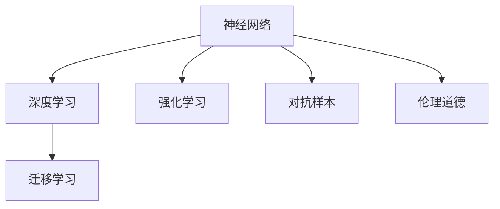

                 

## 1. 背景介绍

### 1.1 问题由来
近年来，神经网络技术在人工智能领域取得了飞速发展，广泛应用于图像识别、语音识别、自然语言处理等各个领域，并逐渐成为了推动人工智能进步的重要动力。然而，神经网络技术的广泛应用也引发了关于人类与机器共存的一些深度思考。人类与机器在智能、伦理、道德、社会责任等方面的相互作用和融合，成为当下及未来一个重要的研究方向。

### 1.2 问题核心关键点
本文聚焦于神经网络技术在人工智能中的作用、对人类社会的影响，以及人类与机器的共存关系。围绕以下几个核心问题展开探讨：
- 神经网络技术如何帮助人类实现更高的智能？
- 神经网络技术在社会治理、伦理道德、隐私保护等方面面临的挑战是什么？
- 人类与机器的共存如何实现？如何构建更加和谐的人机关系？

## 2. 核心概念与联系

### 2.1 核心概念概述

本文将介绍几个密切相关的核心概念：

- 神经网络(Neural Networks, NNs)：一种基于生物神经元工作机制的计算模型，通过大量的人工神经元组成网络结构，进行数据处理和决策。神经网络通过反向传播算法训练，可以自动学习特征表示，实现高精度预测和分类。

- 深度学习(Deep Learning)：一种基于多层神经网络结构进行训练和推断的机器学习范式。深度学习在图像、语音、文本等大规模数据集上的表现优异，是实现人工智能的重要手段。

- 强化学习(Reinforcement Learning, RL)：通过智能体在环境中与环境交互，学习最优决策策略的机器学习方法。强化学习在自动控制、游戏AI、机器人等领域有广泛应用。

- 迁移学习(Transfer Learning)：指将一个任务学到的知识迁移到另一个不同但相关的任务上，以减少新任务所需的训练时间和数据量。深度神经网络的迁移学习能力使其在大规模数据集上实现通用智能。

- 对抗样本(Adversarial Examples)：指经过精心构造，使机器学习模型输出错误结果的输入样本。对抗样本的存在威胁到机器学习系统的安全性，也引发了对机器伦理道德的思考。

- 伦理道德(Ethics and Morality)：指机器学习系统在设计和应用过程中应遵循的伦理原则，如透明性、公正性、隐私保护等。神经网络技术的广泛应用也带来了对人类与机器伦理道德关系的思考。

这些核心概念之间的逻辑关系可以通过以下Mermaid流程图来展示：



### 2.2 核心概念原理和架构

神经网络由大量的人工神经元组成，这些神经元通过学习输入数据的特征，进行逐步抽象和分类。深度学习则通过多层次的神经网络结构，实现更深的特征提取和更强的泛化能力。强化学习通过智能体在环境中与环境交互，学习最优的决策策略，从而实现复杂任务的目标。迁移学习利用已有任务的模型，在新任务上进行微调，提高模型在新任务上的表现。对抗样本通过优化目标函数，生成对模型产生误导的输入，考验模型的鲁棒性。伦理道德是神经网络技术应用中必须遵守的伦理原则，确保技术的正当性、公正性和安全性。

这些概念通过神经网络框架得以实现，具体包括：

- 输入层：接受输入数据，并将其转化为数值向量。
- 隐藏层：通过非线性变换，提取输入数据的高级特征。
- 输出层：根据隐藏层输出，进行最终的分类或预测。

这些层之间通过权重连接，并通过反向传播算法进行参数优化。权重矩阵和偏置向量通过训练学习得到，使得神经网络能够适应新的输入数据。

## 3. 核心算法原理 & 具体操作步骤

### 3.1 算法原理概述

神经网络、深度学习和强化学习算法通过数学建模和优化，实现对输入数据的自动学习与处理。这些算法的核心原理可以归纳为以下几个步骤：

- 构建模型：定义神经网络的层次结构和参数。
- 训练模型：通过反向传播算法，最小化损失函数，优化网络参数。
- 预测输出：将新的输入数据输入模型，获取预测结果。

以深度学习中的反向传播算法为例，其基本原理为：

1. 前向传播：将输入数据依次通过隐藏层和输出层，计算每个神经元的输出值。
2. 损失计算：将输出结果与真实标签进行比较，计算损失函数。
3. 反向传播：根据损失函数对每个神经元进行梯度下降更新，更新权重和偏置。

### 3.2 算法步骤详解

以下以深度学习中的反向传播算法为例，介绍其详细步骤：

**Step 1: 定义模型结构**
- 确定输入数据的维度、隐藏层的数量和每层的神经元个数。
- 定义激活函数，如Sigmoid、ReLU、Tanh等。

**Step 2: 定义损失函数**
- 根据具体任务选择合适的损失函数，如均方误差、交叉熵等。
- 定义优化器的参数，如学习率、动量等。

**Step 3: 前向传播**
- 将输入数据输入模型，计算每一层的输出值。
- 根据激活函数计算每个神经元的输出。
- 将输出结果与真实标签进行比较，计算损失函数。

**Step 4: 反向传播**
- 根据损失函数对每个神经元进行梯度计算。
- 更新权重和偏置，最小化损失函数。
- 重复执行Step 3和Step 4，直到收敛。

### 3.3 算法优缺点

神经网络、深度学习和强化学习算法具有以下优点：
1. 自动化程度高：通过训练可以自动学习特征表示，无需手动设计特征提取器。
2. 泛化能力强：在大规模数据集上表现优异，能够应对复杂的非线性关系。
3. 可扩展性强：模型结构可以灵活调整，适用于多种任务和领域。
4. 应用广泛：在计算机视觉、自然语言处理、语音识别等领域有广泛应用。

同时，这些算法也存在以下局限：
1. 训练成本高：需要大量的标注数据和计算资源进行训练。
2. 可解释性差：模型内部的决策过程难以解释，缺乏透明性。
3. 过拟合风险高：在训练数据过少的情况下容易产生过拟合。
4. 鲁棒性不足：对输入数据的微小扰动容易产生误判。
5. 伦理道德问题：模型决策可能缺乏伦理性和公正性。

### 3.4 算法应用领域

神经网络、深度学习和强化学习算法广泛应用于各个领域，包括：

- 计算机视觉：如图像分类、目标检测、人脸识别等。通过卷积神经网络(CNN)结构，实现图像特征提取和分类。
- 自然语言处理：如文本分类、机器翻译、对话系统等。通过循环神经网络(RNN)、长短时记忆网络(LSTM)等结构，实现文本分析和生成。
- 语音识别：如语音识别、说话人识别、情感分析等。通过卷积神经网络、递归神经网络等结构，实现语音特征提取和分类。
- 机器人控制：如自主导航、路径规划、动作生成等。通过强化学习算法，实现机器人与环境的交互和学习。
- 金融风控：如信用评分、风险预测、欺诈检测等。通过深度学习算法，实现大数据分析和预测。
- 医疗健康：如疾病诊断、治疗方案、患者管理等。通过深度学习算法，实现医疗数据的分析和处理。
- 游戏AI：如策略决策、动作控制、环境感知等。通过强化学习算法，实现游戏AI的自主决策和控制。

## 4. 数学模型和公式 & 详细讲解

### 4.1 数学模型构建

在深度学习中，神经网络通常通过多层神经元的组合，实现对输入数据的自动学习。其数学模型可以表示为：

$$y=f(Wx+b)$$

其中，$x$为输入向量，$y$为输出向量，$f$为激活函数，$W$为权重矩阵，$b$为偏置向量。

在训练过程中，通过最小化损失函数$L(y,\hat{y})$，更新权重和偏置，使得模型的预测结果$\hat{y}$逼近真实标签$y$。

### 4.2 公式推导过程

以均方误差损失函数为例，其公式推导过程如下：

$$L(y,\hat{y})=\frac{1}{2}(y-\hat{y})^2$$

其中，$y$为真实标签向量，$\hat{y}$为预测输出向量。在反向传播算法中，根据损失函数对每个神经元进行梯度计算，更新权重和偏置：

$$\frac{\partial L(y,\hat{y})}{\partial W}=\frac{\partial L(y,\hat{y})}{\partial y} \frac{\partial y}{\partial x} \frac{\partial x}{\partial W}$$

其中，$\frac{\partial L(y,\hat{y})}{\partial y}$为损失函数对输出层的梯度，$\frac{\partial y}{\partial x}$为激活函数的梯度，$\frac{\partial x}{\partial W}$为输入层的梯度。

### 4.3 案例分析与讲解

以图像分类为例，通过卷积神经网络(CNN)结构，对图像数据进行自动学习，实现图像分类的任务。

CNN网络由卷积层、池化层和全连接层组成，其基本结构如下：


卷积层通过卷积核对输入数据进行卷积操作，提取局部特征。池化层通过池化操作，减小数据维度。全连接层通过多层神经元的组合，实现特征的抽象和分类。

在训练过程中，通过反向传播算法，最小化损失函数，更新权重和偏置，使得模型能够学习到图像的高级特征，从而实现对图像的自动分类。

## 5. 项目实践：代码实例和详细解释说明

### 5.1 开发环境搭建

在进行深度学习项目实践前，需要准备好开发环境。以下是使用Python进行TensorFlow开发的环境配置流程：

1. 安装Anaconda：从官网下载并安装Anaconda，用于创建独立的Python环境。

2. 创建并激活虚拟环境：
```bash
conda create -n tf-env python=3.8 
conda activate tf-env
```

3. 安装TensorFlow：根据CUDA版本，从官网获取对应的安装命令。例如：
```bash
conda install tensorflow -c pytorch -c conda-forge
```

4. 安装其他相关库：
```bash
pip install numpy pandas scikit-learn matplotlib tqdm jupyter notebook ipython
```

完成上述步骤后，即可在`tf-env`环境中开始深度学习项目实践。

### 5.2 源代码详细实现

下面我们以手写数字识别为例，给出使用TensorFlow进行卷积神经网络(CNN)的代码实现。

```python
import tensorflow as tf
from tensorflow.keras import layers

# 定义模型
model = tf.keras.Sequential([
    layers.Conv2D(32, (3, 3), activation='relu', input_shape=(28, 28, 1)),
    layers.MaxPooling2D((2, 2)),
    layers.Flatten(),
    layers.Dense(10, activation='softmax')
])

# 定义损失函数和优化器
loss_fn = tf.keras.losses.SparseCategoricalCrossentropy(from_logits=True)
optimizer = tf.keras.optimizers.Adam()

# 训练模型
train_dataset = tf.data.Dataset.from_tensor_slices((x_train, y_train))
train_dataset = train_dataset.shuffle(buffer_size=1024).batch(batch_size)
model.compile(optimizer=optimizer, loss=loss_fn, metrics=['accuracy'])

model.fit(train_dataset, epochs=num_epochs)

# 评估模型
test_dataset = tf.data.Dataset.from_tensor_slices((x_test, y_test))
test_dataset = test_dataset.batch(batch_size)
model.evaluate(test_dataset)
```

### 5.3 代码解读与分析

让我们再详细解读一下关键代码的实现细节：

**定义模型**：
- 使用Sequential模型定义多层神经网络结构。
- 添加卷积层、池化层、全连接层，并设置激活函数。
- 输出层使用softmax函数，实现多分类预测。

**定义损失函数和优化器**：
- 使用SparseCategoricalCrossentropy作为损失函数，处理多分类预测问题。
- 使用Adam优化器，设置学习率。

**训练模型**：
- 将训练数据集转换为TensorFlow Dataset对象。
- 使用shuffle和batch函数进行数据增强和批量处理。
- 通过compile函数设置模型的损失函数、优化器和评估指标。
- 使用fit函数进行模型训练，设置迭代轮数。

**评估模型**：
- 将测试数据集转换为TensorFlow Dataset对象。
- 使用batch函数进行批量处理。
- 使用evaluate函数在测试集上评估模型性能，输出准确率和损失值。

可以看到，TensorFlow提供了高度抽象的API，使得深度学习模型的构建和训练变得简洁高效。开发者可以专注于模型的设计和优化，而不必过多关注底层实现细节。

## 6. 实际应用场景

### 6.1 智能交通系统

深度学习技术可以广泛应用于智能交通系统，实现交通流量预测、路径规划、自动驾驶等。通过智能体与环境交互，学习最优的决策策略，实现交通系统的智能化管理。

在实际应用中，可以通过智能交通摄像头获取实时交通数据，利用深度学习模型进行交通流量分析和预测。例如，利用卷积神经网络(CNN)对交通视频进行特征提取，使用循环神经网络(RNN)对交通流量进行预测，从而优化交通信号灯控制，减少交通拥堵。

### 6.2 医疗影像分析

深度学习在医疗影像分析领域有广泛应用，如疾病诊断、病灶识别、影像分割等。通过深度学习模型，实现对医疗影像的自动分析和诊断。

在实际应用中，可以收集大量的医疗影像数据，利用深度学习模型进行图像分类、目标检测和语义分割。例如，利用卷积神经网络(CNN)对医学影像进行特征提取，使用全卷积神经网络(FCN)对病灶进行分割，从而辅助医生进行疾病诊断和治疗。

### 6.3 金融风险管理

深度学习在金融风险管理领域也有重要应用，如信用评分、风险预测、欺诈检测等。通过深度学习模型，实现对金融数据的自动分析和处理。

在实际应用中，可以收集金融交易数据、用户行为数据等，利用深度学习模型进行数据分析和预测。例如，利用循环神经网络(RNN)对用户行为进行建模，使用卷积神经网络(CNN)对交易数据进行特征提取，从而预测用户的信用风险和欺诈行为。

### 6.4 未来应用展望

随着深度学习技术的不断发展，未来的应用场景将更加广泛。深度学习将在更多领域实现智能化管理，提高生产效率，优化资源配置，提升用户体验。以下是一些可能的发展趋势：

- 自动驾驶：通过深度学习技术，实现智能车辆的自主决策和控制，提高道路安全性和交通效率。
- 智能制造：通过深度学习技术，实现生产过程的自动化和智能化，提升生产效率和产品质量。
- 智能家居：通过深度学习技术，实现家居设备的智能化控制，提升生活便利性和舒适性。
- 智能医疗：通过深度学习技术，实现医疗影像的自动分析和诊断，提高医疗效率和服务质量。
- 智能客服：通过深度学习技术，实现智能客服的自动化和智能化，提升客户体验和服务质量。

## 7. 工具和资源推荐

### 7.1 学习资源推荐

为了帮助开发者系统掌握深度学习技术，这里推荐一些优质的学习资源：

1. 《深度学习》课程：由吴恩达教授开设的Coursera课程，深入浅出地介绍了深度学习的基本概念和前沿技术。

2. 《TensorFlow实战》书籍：TensorFlow官方出版物，全面介绍了TensorFlow框架的使用方法和最佳实践。

3. 《深度学习框架》书籍：介绍目前主流的深度学习框架，如PyTorch、TensorFlow、Keras等，并提供了丰富的代码示例。

4. Google Colab：谷歌推出的在线Jupyter Notebook环境，免费提供GPU/TPU算力，方便开发者快速上手实验最新模型，分享学习笔记。

5. arXiv：开放获取的学术平台，汇集了深度学习领域的最新研究论文，是学习和研究的重要资源。

通过对这些资源的学习实践，相信你一定能够快速掌握深度学习技术的精髓，并用于解决实际的NLP问题。

### 7.2 开发工具推荐

高效的开发离不开优秀的工具支持。以下是几款用于深度学习开发的常用工具：

1. PyTorch：由Facebook开发的开源深度学习框架，灵活高效，适合快速迭代研究。

2. TensorFlow：由Google主导开发的开源深度学习框架，生产部署方便，适合大规模工程应用。

3. Keras：基于TensorFlow的高级深度学习API，易于使用，适合初学者入门。

4. Jupyter Notebook：开源的交互式计算平台，支持多种编程语言和库，方便开发者进行研究和开发。

5. PyCharm：商业级Python开发工具，提供强大的代码编辑、调试和测试功能，适合大规模项目开发。

合理利用这些工具，可以显著提升深度学习任务的开发效率，加快创新迭代的步伐。

### 7.3 相关论文推荐

深度学习技术的发展源于学界的持续研究。以下是几篇奠基性的相关论文，推荐阅读：

1. AlexNet：卷积神经网络的鼻祖，开创了深度学习在图像识别领域的先河。

2. ResNet：深度残差网络，解决了深度神经网络训练过程中的梯度消失问题，提升了深度学习的模型深度。

3. InceptionNet：提出Inception模块，实现多尺度特征提取，提高了深度学习的模型效率。

4. AlphaGo：通过深度强化学习技术，实现围棋智能体的自我学习，取得了人类级水平。

5. GANs：生成对抗网络，实现无监督学习下的图像生成，推动了生成模型的发展。

6. YOLO：实时目标检测算法，提升了目标检测的准确率和速度，成为深度学习领域的热点技术。

这些论文代表了大规模数据集上的深度学习技术的发展脉络。通过学习这些前沿成果，可以帮助研究者把握学科前进方向，激发更多的创新灵感。

## 8. 总结：未来发展趋势与挑战

### 8.1 总结

本文对深度学习技术在人工智能中的作用、对人类社会的影响，以及人类与机器的共存关系进行了全面系统的介绍。首先阐述了深度学习技术在图像识别、语音识别、自然语言处理等领域的应用，展示了其自动化、泛化能力、可扩展性等优点。其次，从模型训练、数据标注、伦理道德等方面，探讨了深度学习技术面临的挑战和局限。最后，展望了未来深度学习技术的发展趋势，提出了一些重要的研究方向。

通过本文的系统梳理，可以看到，深度学习技术正在成为人工智能领域的重要驱动力，极大地拓展了机器学习的应用范围。然而，在实际应用过程中，深度学习技术也带来了诸多挑战，需要在数据、算法、伦理、隐私等方面进行全面优化和平衡。只有在技术、伦理、社会责任等多方面协同发力，才能真正实现人类与机器的共存和进步。

### 8.2 未来发展趋势

展望未来，深度学习技术将呈现以下几个发展趋势：

1. 模型规模持续增大。随着算力成本的下降和数据规模的扩张，深度学习模型的参数量还将持续增长。超大规模模型蕴含的丰富特征表示，有望支撑更加复杂多变的任务。

2. 自监督学习成为主流。自监督学习通过数据自相关性进行学习，减少了对标注数据的依赖，能够在大规模无监督数据上取得良好效果。

3. 模型压缩和优化成为热门。模型压缩、量化加速等技术，可以显著提升深度学习模型的推理速度和资源利用效率，适应各种计算资源限制。

4. 多模态融合成为新的研究方向。将视觉、语音、文本等多模态数据进行联合建模，实现更为全面、准确的信息表示和处理。

5. 迁移学习成为关键技术。迁移学习通过知识迁移，减少新任务所需的训练时间和数据量，推动深度学习模型的通用化和普适化。

6. 强化学习与深度学习结合。通过强化学习优化深度学习模型，实现更加智能、自适应的决策系统。

7. 伦理道德成为核心问题。深度学习模型的伦理道德问题，如偏见、隐私保护、安全性等，成为未来研究的重要方向。

这些趋势凸显了深度学习技术的广阔前景，将为人工智能的发展带来新的突破和机遇。

### 8.3 面临的挑战

尽管深度学习技术已经取得了瞩目成就，但在迈向更加智能化、普适化应用的过程中，它仍面临着诸多挑战：

1. 训练成本高。深度学习模型的训练需要大量的标注数据和计算资源，成本较高，限制了其应用范围。

2. 可解释性差。深度学习模型的决策过程难以解释，缺乏透明性和可信性，难以在关键应用领域获得广泛接受。

3. 鲁棒性不足。深度学习模型对输入数据的微小扰动容易产生误判，缺乏鲁棒性和安全性。

4. 伦理道德问题。深度学习模型的伦理道德问题，如偏见、隐私保护、安全性等，需要更多的研究和规范。

5. 数据隐私问题。深度学习模型的训练和推理过程中，如何保护用户隐私，防止数据泄露，是一个亟待解决的问题。

6. 知识整合能力不足。深度学习模型往往局限于单一领域，难以灵活吸收和运用更广泛的先验知识。

正视深度学习技术面临的这些挑战，积极应对并寻求突破，将是大规模数据集上的深度学习技术迈向成熟的必由之路。相信随着学界和产业界的共同努力，这些挑战终将一一被克服，深度学习技术必将在构建人机协同的智能时代中扮演越来越重要的角色。

### 8.4 研究展望

面对深度学习技术面临的挑战，未来的研究需要在以下几个方面寻求新的突破：

1. 探索无监督和半监督学习技术。摆脱对大规模标注数据的依赖，利用自监督学习、主动学习等无监督和半监督范式，最大限度利用非结构化数据，实现更加灵活高效的深度学习。

2. 研究模型压缩和优化技术。开发更加轻量级、高效的深度学习模型，如剪枝、量化加速、模型蒸馏等，适应各种计算资源限制。

3. 融合因果推理和强化学习。通过引入因果推断和强化学习思想，增强深度学习模型的决策能力和智能性。

4. 引入更多先验知识。将符号化的先验知识，如知识图谱、逻辑规则等，与深度学习模型进行融合，实现更加全面、准确的信息表示和处理。

5. 纳入伦理道德约束。在深度学习模型的设计、训练和应用过程中，引入伦理道德导向的评估指标，过滤和惩罚有害的输出倾向。

6. 提升数据隐私保护。通过差分隐私、联邦学习等技术，保护用户隐私，防止数据泄露和滥用。

这些研究方向将推动深度学习技术的进一步发展，为人类与机器的共存和进步提供新的动力。

## 9. 附录：常见问题与解答

**Q1: 深度学习算法是否适用于所有NLP任务？**

A: 深度学习算法在大多数NLP任务上都能取得不错的效果，特别是对于数据量较大的任务。但对于一些特定领域的任务，如法律、医学等，仅仅依靠通用语料预训练的模型可能难以很好地适应。此时需要在特定领域语料上进一步预训练，再进行微调，才能获得理想效果。此外，对于一些需要时效性、个性化很强的任务，如对话、推荐等，深度学习方法也需要针对性的改进优化。

**Q2: 深度学习算法在社会治理、伦理道德等方面面临哪些挑战？**

A: 深度学习算法在社会治理、伦理道德等方面面临诸多挑战，主要包括以下几个方面：

1. 数据隐私问题：深度学习算法在处理个人数据时，需要保证数据隐私和安全，防止数据泄露和滥用。

2. 伦理道德问题：深度学习算法在决策过程中，可能存在偏见、歧视等问题，需要引入伦理道德导向的评估指标，确保模型的公正性和透明性。

3. 可解释性问题：深度学习算法通常被视为"黑盒"系统，难以解释其内部工作机制和决策逻辑，需要进一步研究模型的可解释性和透明性。

4. 鲁棒性问题：深度学习算法对输入数据的微小扰动容易产生误判，需要增强模型的鲁棒性和安全性。

5. 公平性问题：深度学习算法在处理不同群体数据时，可能存在不公平现象，需要引入公平性约束，确保模型的公平性和普适性。

这些挑战需要结合实际应用场景，综合考虑技术、伦理、社会责任等多方面因素，进行全面优化和规范。

**Q3: 如何实现深度学习模型与伦理道德的结合？**

A: 实现深度学习模型与伦理道德的结合，可以从以下几个方面进行：

1. 引入伦理导向的评估指标：在模型的训练和评估过程中，引入伦理导向的评估指标，如公平性、透明性、安全性等，过滤和惩罚有害的输出倾向。

2. 数据集的多样性：使用多样化的数据集进行模型训练，避免数据集中的偏见和歧视现象。

3. 模型的可解释性：通过引入可解释性模型，如线性模型、规则模型等，增强模型的透明性和可信性。

4. 伦理道德培训：在模型的设计、开发和应用过程中，引入伦理道德培训，提高开发者的伦理意识和道德规范。

5. 法规约束：在深度学习算法的应用过程中，遵守相关法规和规范，确保算法的合规性和合法性。

这些措施将有助于深度学习模型在实际应用中更好地体现伦理道德，确保其应用的正当性和公正性。

**Q4: 如何应对深度学习技术在医疗健康领域面临的挑战？**

A: 应对深度学习技术在医疗健康领域面临的挑战，可以从以下几个方面进行：

1. 数据隐私保护：在处理医疗数据时，需要遵守相关法规，保护患者隐私，防止数据泄露和滥用。

2. 模型透明性：在医疗决策过程中，需要确保模型的透明性和可信性，避免误判和错误决策。

3. 公平性约束：在处理不同群体的医疗数据时，需要引入公平性约束，确保模型的公平性和普适性。

4. 伦理道德导向：在医疗算法的开发和应用过程中，引入伦理道德导向的评估指标，确保算法的公正性和透明性。

5. 法规约束：在医疗算法的应用过程中，遵守相关法规和规范，确保算法的合规性和合法性。

这些措施将有助于深度学习算法在医疗健康领域更好地应用，提高医疗效率和服务质量，提升患者满意度和信任度。

---

作者：禅与计算机程序设计艺术 / Zen and the Art of Computer Programming

