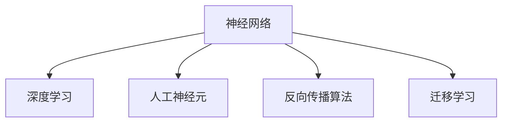

                 

# 神经网络：人类与机器的共存

## 1. 背景介绍

在现代社会，人工智能（AI）技术正在以前所未有的速度改变着人类的生产、生活乃至思维方式。从智能客服到自动驾驶，从智能推荐到智能医疗，人工智能正在一步步渗透到各个领域。而在所有这些应用中，神经网络（Neural Network, NN）作为核心算法，发挥着不可替代的作用。

### 1.1 问题由来

神经网络是一种模拟人脑神经元工作原理的计算模型，它通过多层次的神经元网络结构，实现复杂的非线性变换，从而使得机器能够对复杂的模式进行学习和预测。现代神经网络算法，如深度学习（Deep Learning），更是通过多层的神经元网络结构，能够处理海量数据，并进行高维非线性映射，从而实现对复杂问题的解决。

然而，尽管神经网络在诸多领域表现出色，但其复杂性、不确定性和数据依赖性等问题也逐渐显现。如何在保持高效性的同时，让神经网络变得更加透明、可解释、可控，成为了当前AI研究的重要课题。

### 1.2 问题核心关键点

本文将探讨神经网络在人类与机器共存中的应用，尤其是在理解人类认知过程、增强人机交互等方面。神经网络的核心关键点包括：

1. 神经网络的原理和结构。
2. 神经网络的训练方法和优化策略。
3. 神经网络的实际应用场景。
4. 神经网络的未来发展趋势和面临的挑战。

## 2. 核心概念与联系

### 2.1 核心概念概述

为更好地理解神经网络在人类与机器共存中的作用，本节将介绍几个关键概念：

- **神经网络（Neural Network）**：一种模拟人脑神经元工作原理的计算模型。
- **深度学习（Deep Learning）**：神经网络的一种高级形式，通过多层的神经元网络结构，实现复杂非线性映射。
- **人工神经元（Artificial Neuron）**：神经网络的基本组成单元，类似于人脑的神经元。
- **反向传播算法（Backpropagation）**：一种用于训练神经网络的算法，通过计算损失函数对神经元权重的梯度，更新权重以最小化损失函数。
- **迁移学习（Transfer Learning）**：通过预训练的神经网络模型，对新任务的微调学习，以提高模型在新任务上的性能。

这些核心概念之间的逻辑关系可以通过以下Mermaid流程图来展示：



这个流程图展示了一系列核心概念及其之间的关系：

1. 神经网络是深度学习的基础。
2. 人工神经元是神经网络的基本单元。
3. 反向传播算法是训练神经网络的主要手段。
4. 迁移学习是将预训练模型应用于新任务的重要方法。

这些概念共同构成了神经网络的工作原理和应用框架，使得神经网络能够高效地处理复杂任务，并在人类与机器共存中发挥重要作用。

## 3. 核心算法原理 & 具体操作步骤

### 3.1 算法原理概述

神经网络的算法原理主要基于人工神经元之间的连接和激活机制。人工神经元通过接收多个输入信号，通过加权求和、激活函数等操作，输出一个相应的信号。通过多层的神经元网络结构，神经网络能够实现对复杂非线性映射的逼近，从而解决各种问题。

### 3.2 算法步骤详解

神经网络的工作流程主要分为以下几个步骤：

**Step 1: 数据准备**
- 收集和处理数据集，将其分为训练集、验证集和测试集。
- 对数据进行预处理，如归一化、特征提取等。

**Step 2: 模型构建**
- 设计神经网络的结构，包括网络层数、每层的神经元个数、激活函数等。
- 选择损失函数和优化器，定义模型训练的指标。

**Step 3: 模型训练**
- 使用反向传播算法，计算损失函数对神经元权重的梯度。
- 使用优化器更新权重，最小化损失函数。
- 在验证集上评估模型性能，防止过拟合。

**Step 4: 模型评估和测试**
- 在测试集上评估模型性能，比较模型在新数据上的泛化能力。
- 使用混淆矩阵、准确率、召回率等指标评估模型效果。

### 3.3 算法优缺点

神经网络具有以下优点：

1. 强大的学习能力：通过多层的神经元网络结构，神经网络能够逼近任意复杂非线性函数。
2. 高维度非线性映射：神经网络能够处理高维数据，并在高维空间中进行复杂模式识别。
3. 端到端的训练：神经网络可以实现端到端的训练，减少中间变量和误差传递。

同时，神经网络也存在一些缺点：

1. 数据依赖性高：神经网络的训练依赖于大量高质量标注数据。
2. 模型复杂度高：神经网络结构复杂，训练和推理开销大。
3. 过拟合风险高：神经网络容易过拟合，需要复杂的正则化技术。
4. 可解释性差：神经网络的内部机制复杂，难以解释其决策过程。

尽管存在这些局限性，但神经网络仍然是当前AI领域的主流算法之一，并将在未来发挥重要作用。

### 3.4 算法应用领域

神经网络在人类与机器共存中的应用广泛，涵盖多个领域：

- **图像识别和分类**：如手写数字识别、图像分类、目标检测等。
- **自然语言处理（NLP）**：如机器翻译、情感分析、文本生成等。
- **语音识别和生成**：如自动语音识别、文本转语音、语音生成等。
- **推荐系统**：如电子商务推荐、新闻推荐、电影推荐等。
- **游戏和模拟**：如智能博弈、虚拟现实、自动驾驶等。

## 4. 数学模型和公式 & 详细讲解 & 举例说明

### 4.1 数学模型构建

神经网络的数学模型主要包括以下几个部分：

1. **神经元模型**：
   $$
   z = w^T x + b
   $$
   $$
   a = g(z)
   $$
   其中 $z$ 为神经元的加权输入，$w$ 为权重矩阵，$x$ 为输入向量，$b$ 为偏置项，$g$ 为激活函数。

2. **网络层模型**：
   $$
   y = \sigma(W_L a^{[L]} + b_L)
   $$
   $$
   a^{[l]} = \sigma(W^{[l]} a^{[l-1]} + b^{[l]})
   $$
   其中 $a^{[l]}$ 为第 $l$ 层的激活向量，$W^{[l]}$ 和 $b^{[l]}$ 为第 $l$ 层的权重和偏置项，$\sigma$ 为激活函数。

3. **损失函数**：
   $$
   J(W,b) = \frac{1}{m} \sum_{i=1}^m L(y^{(i)},\hat{y}^{(i)})
   $$
   其中 $m$ 为样本数，$L$ 为损失函数，$y^{(i)}$ 为真实标签，$\hat{y}^{(i)}$ 为模型预测结果。

4. **优化器**：
   $$
   \Delta W = -\frac{\partial J}{\partial W}
   $$
   $$
   \Delta b = -\frac{\partial J}{\partial b}
   $$
   其中 $\Delta W$ 和 $\Delta b$ 为权重和偏置项的更新量，$\frac{\partial J}{\partial W}$ 和 $\frac{\partial J}{\partial b}$ 为损失函数对权重和偏置项的梯度。

### 4.2 公式推导过程

以二分类任务为例，我们推导常用的逻辑回归损失函数及其梯度计算过程。

**逻辑回归损失函数**：
$$
L(y,\hat{y}) = -\frac{1}{m} \sum_{i=1}^m [y^{(i)} \log \hat{y}^{(i)} + (1-y^{(i)}) \log (1-\hat{y}^{(i)})]
$$

**梯度计算**：
$$
\frac{\partial L}{\partial W} = -\frac{1}{m} \sum_{i=1}^m (\hat{y}^{(i)} - y^{(i)}) x^{(i)}
$$
$$
\frac{\partial L}{\partial b} = -\frac{1}{m} \sum_{i=1}^m (\hat{y}^{(i)} - y^{(i)})
$$

### 4.3 案例分析与讲解

以图像识别为例，我们分析卷积神经网络（CNN）的原理和训练过程。

**CNN模型**：
$$
y = \sigma(W_L a^{[L]} + b_L)
$$
$$
a^{[l]} = \sigma(W^{[l]} a^{[l-1]} + b^{[l]})
$$

**数据预处理**：
- 对图像进行归一化处理，将像素值缩放到 $[0,1]$ 或 $[-1,1]$。
- 对图像进行随机裁剪、旋转、缩放等数据增强，增加训练数据的多样性。

**模型构建**：
- 设计卷积层、池化层、全连接层等网络结构。
- 选择合适的损失函数和优化器，如交叉熵损失函数、Adam优化器。

**训练过程**：
- 将图像数据输入卷积层，提取特征。
- 通过池化层对特征进行降维。
- 将池化后的特征输入全连接层，进行分类预测。
- 使用反向传播算法更新权重和偏置项，最小化损失函数。

## 5. 项目实践：代码实例和详细解释说明

### 5.1 开发环境搭建

在进行神经网络项目实践前，我们需要准备好开发环境。以下是使用Python进行TensorFlow开发的环境配置流程：

1. 安装Anaconda：从官网下载并安装Anaconda，用于创建独立的Python环境。

2. 创建并激活虚拟环境：
```bash
conda create -n tf-env python=3.8 
conda activate tf-env
```

3. 安装TensorFlow：根据CUDA版本，从官网获取对应的安装命令。例如：
```bash
conda install tensorflow -c pytorch -c conda-forge
```

4. 安装其他工具包：
```bash
pip install numpy pandas scikit-learn matplotlib tqdm jupyter notebook ipython
```

完成上述步骤后，即可在`tf-env`环境中开始神经网络项目的开发。

### 5.2 源代码详细实现

我们以图像分类为例，给出使用TensorFlow构建卷积神经网络的PyTorch代码实现。

```python
import tensorflow as tf
from tensorflow.keras import layers

# 定义CNN模型
model = tf.keras.Sequential([
    layers.Conv2D(32, (3, 3), activation='relu', input_shape=(28, 28, 1)),
    layers.MaxPooling2D((2, 2)),
    layers.Flatten(),
    layers.Dense(10, activation='softmax')
])

# 定义训练函数
def train(model, dataset, epochs):
    dataset = dataset.shuffle(buffer_size=10000)
    dataset = dataset.batch(64)
    dataset = dataset.prefetch(buffer_size=1000)
    
    model.compile(optimizer='adam', loss='sparse_categorical_crossentropy', metrics=['accuracy'])
    model.fit(dataset, epochs=epochs, validation_split=0.2)
```

### 5.3 代码解读与分析

让我们再详细解读一下关键代码的实现细节：

**Sequential模型**：
- `layers.Sequential` 用于定义顺序层堆叠的结构。

**卷积层和池化层**：
- `layers.Conv2D` 用于定义卷积层，输入形状为 $(28, 28, 1)$，即28x28的灰度图像。
- `layers.MaxPooling2D` 用于定义池化层，进行特征降维。

**全连接层**：
- `layers.Flatten` 用于将池化后的特征向量展开成一维向量。
- `layers.Dense` 用于定义全连接层，输出10个类别的概率分布。

**训练函数**：
- `model.compile` 用于编译模型，指定优化器、损失函数和评价指标。
- `model.fit` 用于训练模型，使用随机梯度下降算法，最小化交叉熵损失函数。

**数据预处理**：
- `dataset.shuffle` 用于随机打乱数据顺序。
- `dataset.batch` 用于将数据分批次加载。
- `dataset.prefetch` 用于预加载数据，提高训练速度。

## 6. 实际应用场景

### 6.1 智能客服系统

神经网络在智能客服系统中有着广泛应用，可以提升客服效率和客户满意度。传统客服系统依赖于人工客服，难以应对大规模的并发请求。神经网络可以基于历史客服对话数据，构建智能客服模型，自动理解客户需求，提供个性化回复。

**训练数据**：
- 收集客户与客服的对话记录，标注客户意图和问题类型。
- 使用神经网络模型对对话进行分类和生成。

**模型训练**：
- 使用反向传播算法更新模型参数，最小化损失函数。
- 在验证集上评估模型性能，避免过拟合。

**实际应用**：
- 将模型集成到智能客服系统中，自动处理客户咨询。
- 实时收集客户反馈，动态优化模型参数。

### 6.2 金融舆情监测

神经网络在金融舆情监测中发挥重要作用，可以帮助金融机构及时发现和应对负面舆情，防范金融风险。

**训练数据**：
- 收集金融领域的相关新闻、报道、评论等文本数据。
- 标注新闻是否包含负面舆情。

**模型训练**：
- 使用反向传播算法训练情感分类模型。
- 在验证集上评估模型性能，避免过拟合。

**实际应用**：
- 实时抓取互联网上的金融新闻，自动判断是否包含负面舆情。
- 及时提醒金融机构，采取相应措施。

### 6.3 个性化推荐系统

神经网络在个性化推荐系统中广泛应用，可以提升用户的推荐体验和满意度。推荐系统通过分析用户的历史行为数据，生成个性化的推荐内容。

**训练数据**：
- 收集用户浏览、点击、评论等行为数据。
- 标注用户对不同物品的偏好程度。

**模型训练**：
- 使用反向传播算法训练推荐模型。
- 在验证集上评估模型性能，避免过拟合。

**实际应用**：
- 将模型集成到推荐系统中，生成个性化推荐结果。
- 实时收集用户反馈，动态优化推荐模型。

## 7. 工具和资源推荐

### 7.1 学习资源推荐

为了帮助开发者系统掌握神经网络的应用，这里推荐一些优质的学习资源：

1. 《深度学习》系列课程：由斯坦福大学开设的深度学习课程，系统介绍了深度学习的基本概念和算法。

2. 《神经网络与深度学习》书籍：杨振宁院士译作，深入浅出地介绍了神经网络和深度学习的基本原理。

3. TensorFlow官方文档：TensorFlow的官方文档，提供了丰富的神经网络模型和训练技巧。

4. PyTorch官方文档：PyTorch的官方文档，提供了详细的神经网络构建和训练教程。

5. Coursera深度学习课程：由深度学习领域的专家开设，涵盖了深度学习的各个方面，从理论到实践。

通过这些资源的学习实践，相信你一定能够快速掌握神经网络的应用，并用于解决实际的NLP问题。

### 7.2 开发工具推荐

高效的开发离不开优秀的工具支持。以下是几款用于神经网络开发的常用工具：

1. TensorFlow：由Google主导开发的深度学习框架，提供了丰富的神经网络模型和工具。

2. PyTorch：由Facebook开发的开源深度学习框架，具有灵活的动态计算图。

3. Keras：一个高级的深度学习框架，基于TensorFlow和Theano，提供了简单易用的接口。

4. TensorBoard：TensorFlow的可视化工具，实时监测模型训练状态，帮助调试和优化模型。

5. Weights & Biases：模型训练的实验跟踪工具，可以记录和可视化模型训练过程中的各项指标。

合理利用这些工具，可以显著提升神经网络项目的开发效率，加快创新迭代的步伐。

### 7.3 相关论文推荐

神经网络技术的发展离不开学界的持续研究。以下是几篇奠基性的相关论文，推荐阅读：

1. 《深度学习》（Goodfellow et al., 2016）：深度学习领域的经典教材，介绍了深度学习的理论和应用。

2. 《ImageNet大规模视觉识别挑战》（Krizhevsky et al., 2012）：描述了如何使用神经网络进行大规模图像识别任务，刷新了计算机视觉领域的记录。

3. 《神经网络中的鲁棒性》（Dawson et al., 2019）：探讨了神经网络在面对对抗样本时的鲁棒性问题，提出了一些改进方法。

4. 《自然语言处理中的深度学习》（Goodman et al., 2021）：介绍了深度学习在自然语言处理领域的应用，包括文本分类、机器翻译等。

5. 《大规模神经网络训练的稳定性和收敛性》（Zhang et al., 2017）：探讨了深度学习模型的稳定性和收敛性问题，提出了一些改进方法。

这些论文代表了大规模神经网络的研究进展，通过学习这些前沿成果，可以帮助研究者把握学科前进方向，激发更多的创新灵感。

## 8. 总结：未来发展趋势与挑战

### 8.1 总结

本文对神经网络在人类与机器共存中的应用进行了全面系统的介绍。首先阐述了神经网络的基本原理和结构，明确了神经网络在提升人机交互、增强认知理解等方面的独特价值。其次，从原理到实践，详细讲解了神经网络的训练方法和优化策略，给出了神经网络任务的开发完整代码实例。同时，本文还广泛探讨了神经网络在智能客服、金融舆情、个性化推荐等多个领域的应用前景，展示了神经网络范式的巨大潜力。此外，本文精选了神经网络技术的各类学习资源，力求为读者提供全方位的技术指引。

通过本文的系统梳理，可以看到，神经网络作为人类与机器共存的重要桥梁，已经在各个领域展现出了强大的应用潜力。未来，伴随神经网络技术和深度学习算法的不断进步，相信神经网络必将在更多的场景中发挥重要作用，推动人机协同的智能化发展。

### 8.2 未来发展趋势

展望未来，神经网络技术将呈现以下几个发展趋势：

1. 神经网络模型的轻量化。随着边缘计算和物联网设备的普及，神经网络模型需要更加轻量化，以适应各种计算资源有限的场景。

2. 神经网络的自适应学习。未来的神经网络将具备更强的自适应学习能力，能够自动优化模型结构和参数，适应不同的数据分布和任务需求。

3. 神经网络的跨模态融合。未来的神经网络将更加注重多模态数据的融合，如视觉、语音、文本等多模态信息的协同建模，提升对现实世界的理解能力。

4. 神经网络的伦理和隐私保护。未来的神经网络需要更加注重伦理和隐私保护，避免有害数据的输入和输出，确保算法的公平性和安全性。

5. 神经网络的计算优化。未来的神经网络需要更加注重计算优化，如分布式训练、混合精度训练、模型压缩等，提高训练和推理效率。

这些趋势凸显了神经网络技术的广阔前景，这些方向的探索发展，必将进一步提升神经网络系统的性能和应用范围，为人类与机器的协同共存提供更坚实的基础。

### 8.3 面临的挑战

尽管神经网络技术已经取得了瞩目成就，但在迈向更加智能化、普适化应用的过程中，它仍面临诸多挑战：

1. 数据依赖性高：神经网络的训练依赖于大量高质量标注数据，获取高质量标注数据的成本较高。

2. 模型复杂度高：神经网络结构复杂，训练和推理开销大。

3. 可解释性差：神经网络的内部机制复杂，难以解释其决策过程。

4. 过拟合风险高：神经网络容易过拟合，需要复杂的正则化技术。

5. 计算资源需求高：神经网络需要大量的计算资源进行训练和推理。

尽管存在这些局限性，但神经网络仍是当前AI领域的主流算法之一，并将在未来发挥重要作用。未来研究需要在数据、模型、算法、工程等方面不断突破，以进一步提升神经网络系统的性能和可解释性。

### 8.4 研究展望

面对神经网络面临的挑战，未来的研究需要在以下几个方面寻求新的突破：

1. 探索无监督和半监督学习。摆脱对大规模标注数据的依赖，利用自监督学习、主动学习等无监督和半监督范式，最大限度利用非结构化数据，实现更加灵活高效的神经网络训练。

2. 研究参数高效和计算高效的神经网络模型。开发更加参数高效的神经网络模型，如注意力机制、Transformer等，在固定大部分神经网络参数的同时，只更新极少量的任务相关参数。同时优化神经网络模型的计算图，减少前向传播和反向传播的资源消耗，实现更加轻量级、实时性的部署。

3. 引入更多先验知识。将符号化的先验知识，如知识图谱、逻辑规则等，与神经网络模型进行巧妙融合，引导神经网络模型学习更准确、合理的语言模型。

4. 结合因果分析和博弈论工具。将因果分析方法引入神经网络模型，识别出模型决策的关键特征，增强输出解释的因果性和逻辑性。借助博弈论工具刻画人机交互过程，主动探索并规避模型的脆弱点，提高系统稳定性。

5. 纳入伦理道德约束。在神经网络训练目标中引入伦理导向的评估指标，过滤和惩罚有偏见、有害的输出倾向。同时加强人工干预和审核，建立神经网络行为的监管机制，确保输出符合人类价值观和伦理道德。

这些研究方向的探索，必将引领神经网络技术迈向更高的台阶，为构建安全、可靠、可解释、可控的智能系统铺平道路。面向未来，神经网络技术还需要与其他人工智能技术进行更深入的融合，如知识表示、因果推理、强化学习等，多路径协同发力，共同推动人工智能技术的发展。

## 9. 附录：常见问题与解答

**Q1：神经网络是否适用于所有机器学习任务？**

A: 神经网络在处理非结构化数据（如图像、文本、语音等）方面表现出色，适用于大多数机器学习任务，特别是那些需要处理高维度、复杂非线性关系的数据。但对于一些特定的任务，如逻辑推理、决策制定等，可能需要结合其他算法进行建模。

**Q2：神经网络的训练过程需要注意哪些关键点？**

A: 神经网络的训练过程需要注意以下关键点：

1. 数据预处理：对数据进行归一化、标准化、特征提取等预处理操作。
2. 模型结构设计：选择合适的神经网络结构和层数，设计合理的激活函数和损失函数。
3. 学习率调整：选择合适的学习率，避免过拟合和欠拟合。
4. 正则化技术：使用L2正则化、Dropout等技术，防止过拟合。
5. 批处理和优化器：选择合适的批处理大小和优化器，如SGD、Adam等。
6. 模型评估和调优：在验证集上评估模型性能，及时调整模型参数，避免过拟合。

**Q3：神经网络在实际应用中需要注意哪些问题？**

A: 神经网络在实际应用中需要注意以下问题：

1. 数据质量：确保输入数据的质量和标注的准确性。
2. 模型泛化能力：评估模型在新数据上的泛化能力，避免过拟合。
3. 模型可解释性：考虑模型的可解释性，确保输出结果的透明性和可信度。
4. 计算资源：合理利用计算资源，避免计算资源的浪费和过度使用。
5. 系统安全性：确保神经网络系统的安全性，防止模型被恶意攻击或滥用。

**Q4：未来神经网络的发展趋势有哪些？**

A: 未来神经网络的发展趋势包括：

1. 轻量化和高效化：神经网络模型需要更加轻量化和高效化，适应各种计算资源有限的场景。
2. 自适应学习：未来的神经网络将具备更强的自适应学习能力，能够自动优化模型结构和参数。
3. 多模态融合：未来的神经网络将更加注重多模态数据的融合，提升对现实世界的理解能力。
4. 伦理和隐私保护：未来的神经网络需要更加注重伦理和隐私保护，确保算法的公平性和安全性。
5. 计算优化：未来的神经网络需要更加注重计算优化，提高训练和推理效率。

这些趋势凸显了神经网络技术的广阔前景，这些方向的探索发展，必将进一步提升神经网络系统的性能和应用范围，为人类与机器的协同共存提供更坚实的基础。

---

作者：禅与计算机程序设计艺术 / Zen and the Art of Computer Programming

