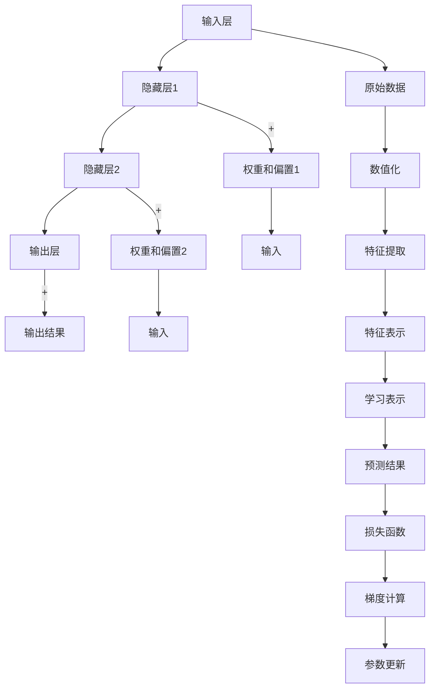
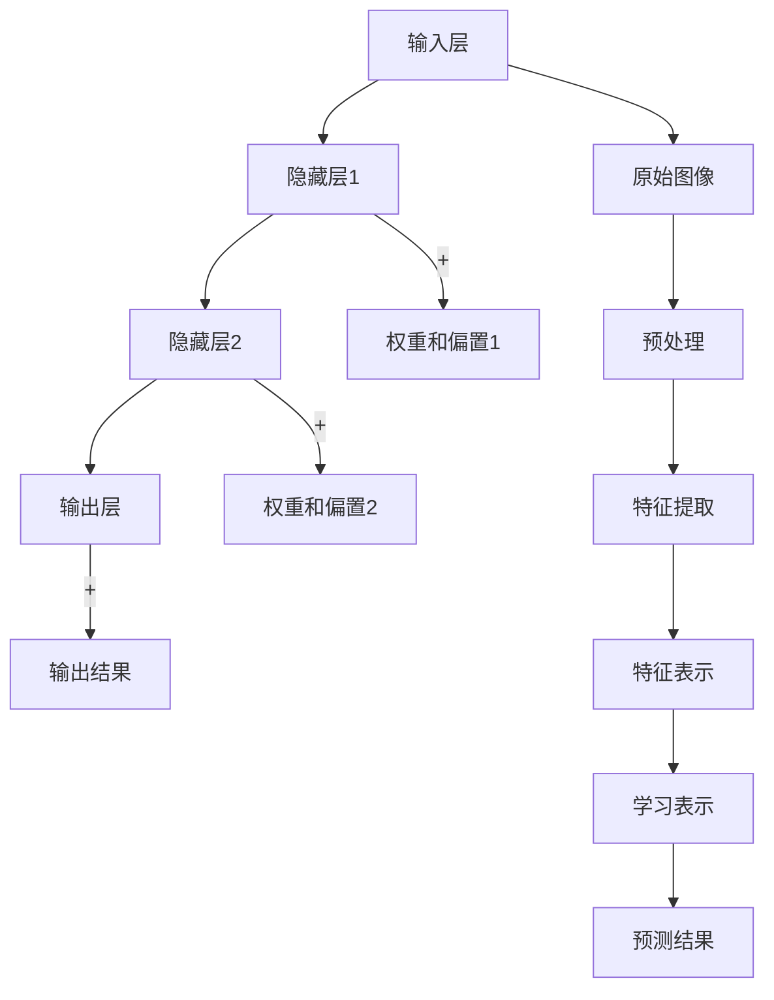

                 

# 神经网络：人类与机器的共存

> 关键词：神经网络,人工智能,机器学习,深度学习,自动化,自动化系统,计算机科学

## 1. 背景介绍

### 1.1 问题由来

在过去的几十年中，人工智能（AI）和深度学习技术取得了令人瞩目的进展。随着神经网络（Neural Networks, NNs）的广泛应用，人们开始思考人类与机器如何共存，以及未来可能面临的挑战。

神经网络通过模拟人类神经系统的工作原理，能够在视觉识别、自然语言处理、语音识别等领域取得优异表现。然而，这种强大的技术也引发了公众对就业、隐私、伦理和安全的担忧。

为了应对这些问题，人工智能社区和伦理学者开始深入探讨神经网络在各个领域的应用，并尝试建立一套规范，确保技术的健康发展。

### 1.2 问题核心关键点

神经网络的核心思想是通过多层结构学习输入数据的高维特征表示，从而实现复杂的模式识别和决策。其核心组件包括输入层、隐藏层和输出层，每层包含多个神经元（Neurons）。

神经网络的工作原理基于反向传播算法，通过梯度下降法优化模型参数，从而最小化预测输出与真实标签之间的误差。通过不断的训练和优化，神经网络能够从大量数据中学习到高效的特征表示。

神经网络目前广泛应用于图像识别、语音识别、自然语言处理、推荐系统等诸多领域，成为人工智能技术的重要支柱。然而，其广泛应用也带来了诸如就业替代、隐私泄露、伦理道德等挑战。

### 1.3 问题研究意义

探讨神经网络与人类共存的问题，不仅有助于理解技术对社会的影响，还能推动人工智能技术的健康发展，维护公众利益。以下是几个研究神经网络的重要意义：

1. **技术进步**：研究神经网络的应用和技术挑战，有助于推动技术的进一步发展。
2. **伦理道德**：确保技术在应用过程中遵循伦理道德标准，避免造成社会伦理问题。
3. **就业影响**：评估技术对就业市场的影响，制定相应的就业保护措施。
4. **隐私保护**：提出保护用户隐私的技术手段和法律法规，确保用户数据安全。
5. **社会融合**：研究如何通过神经网络提升人类社会的工作效率和生活质量，实现人与机器的和谐共生。

## 2. 核心概念与联系

### 2.1 核心概念概述

神经网络由多个层级组成，每一层级的神经元通过权重和偏置参数进行连接。通过训练，神经网络可以学习到输入数据的高维表示，并在此基础上进行分类、回归、聚类等任务。

核心概念包括：

- **输入层**：接收原始数据，并将其转换为神经网络可以处理的数值形式。
- **隐藏层**：通过多层非线性变换学习数据的高维表示。
- **输出层**：对隐藏层的特征进行映射，最终输出预测结果。
- **权重和偏置**：用于调整神经元之间的连接强度和神经元的激活阈值。
- **反向传播算法**：通过梯度下降法优化模型参数，最小化预测误差。

### 2.2 核心概念原理和架构的 Mermaid 流程图



这个流程图展示了神经网络的基本架构和工作原理：

1. 输入层接收原始数据。
2. 隐藏层通过多层非线性变换学习数据的高维表示。
3. 输出层对隐藏层的特征进行映射，最终输出预测结果。
4. 权重和偏置调整神经元之间的连接强度和神经元的激活阈值。
5. 通过反向传播算法优化模型参数，最小化预测误差。

## 3. 核心算法原理 & 具体操作步骤

### 3.1 算法原理概述

神经网络的核心算法包括前向传播和反向传播。前向传播将输入数据传递到输出层，生成预测结果；反向传播则通过梯度下降法优化模型参数，最小化预测误差。

### 3.2 算法步骤详解

**Step 1: 数据准备**

1. 收集并预处理训练数据，将其转换为神经网络可以处理的数值形式。
2. 将数据划分为训练集、验证集和测试集。

**Step 2: 模型定义**

1. 定义神经网络的结构，包括输入层、隐藏层和输出层的神经元数量。
2. 初始化权重和偏置参数。

**Step 3: 前向传播**

1. 将输入数据传递到输入层。
2. 通过隐藏层进行多层非线性变换，生成特征表示。
3. 将特征表示传递到输出层，生成预测结果。

**Step 4: 计算损失函数**

1. 计算预测结果与真实标签之间的误差。
2. 选择适合的损失函数（如交叉熵、均方误差等）。

**Step 5: 反向传播**

1. 计算损失函数对每个参数的梯度。
2. 使用梯度下降法更新参数。
3. 重复前向传播和反向传播，直到模型收敛。

**Step 6: 评估模型**

1. 在验证集上评估模型性能，防止过拟合。
2. 在测试集上最终评估模型性能，给出性能指标。

### 3.3 算法优缺点

神经网络的优点包括：

1. **高维特征学习**：能够学习到高维特征表示，适用于复杂的模式识别任务。
2. **鲁棒性强**：对噪声和异常值具有较强的鲁棒性。
3. **广泛应用**：广泛应用于图像识别、语音识别、自然语言处理等多个领域。

神经网络的缺点包括：

1. **计算复杂度高**：模型参数较多，计算复杂度高，训练和推理耗时较长。
2. **过拟合风险**：容易出现过拟合，需要大量数据和正则化技术。
3. **可解释性差**：模型内部工作机制复杂，难以解释输出结果。

### 3.4 算法应用领域

神经网络在以下领域得到了广泛应用：

- **图像识别**：如图像分类、目标检测、图像生成等。
- **自然语言处理**：如文本分类、情感分析、机器翻译等。
- **语音识别**：如语音识别、语音合成、语音情感分析等。
- **推荐系统**：如商品推荐、内容推荐、个性化推荐等。
- **医疗诊断**：如医学影像分析、疾病预测、基因分析等。

## 4. 数学模型和公式 & 详细讲解 & 举例说明

### 4.1 数学模型构建

神经网络数学模型包括前向传播和反向传播两个部分。假设输入数据为 $X$，隐藏层参数为 $W$ 和 $b$，输出层参数为 $W'$ 和 $b'$。

前向传播公式为：

$$
h = \sigma(XW+b)
$$

其中，$\sigma$ 为激活函数（如ReLU、Sigmoid等）。

反向传播公式为：

$$
\frac{\partial E}{\partial W} = \frac{\partial L}{\partial h} \frac{\partial h}{\partial W} + \frac{\partial L}{\partial b}
$$

其中，$E$ 为损失函数，$L$ 为预测输出与真实标签之间的误差。

### 4.2 公式推导过程

以线性回归为例，推导最小二乘法的公式。

假设训练数据集为 $(x_i, y_i)$，模型为 $y=wx+b$，最小二乘法的目标为最小化误差平方和：

$$
E = \frac{1}{2} \sum_{i=1}^n (y_i - wx_i - b)^2
$$

对 $w$ 和 $b$ 求导，得：

$$
\frac{\partial E}{\partial w} = -\frac{1}{2} \sum_{i=1}^n 2(x_i - wx_i - b) x_i
$$

$$
\frac{\partial E}{\partial b} = -\frac{1}{2} \sum_{i=1}^n 2(x_i - wx_i - b)
$$

通过梯度下降法，更新 $w$ 和 $b$：

$$
w \leftarrow w - \eta \frac{\partial E}{\partial w}
$$

$$
b \leftarrow b - \eta \frac{\partial E}{\partial b}
$$

其中，$\eta$ 为学习率。

### 4.3 案例分析与讲解

以图像识别为例，说明神经网络在图像分类任务中的应用。

假设输入图像为 $x$，隐藏层参数为 $W$ 和 $b$，输出层参数为 $W'$ 和 $b'$。模型结构如下：



在训练过程中，将原始图像 $x$ 传递到输入层，经过多层次的非线性变换，生成特征表示 $h$。然后将特征表示 $h$ 传递到输出层，生成预测结果 $y$。通过最小化交叉熵损失函数，计算误差，并使用梯度下降法更新模型参数，最终输出分类结果。

## 5. 项目实践：代码实例和详细解释说明

### 5.1 开发环境搭建

在进行神经网络开发前，需要先搭建好开发环境。以下是使用Python和PyTorch进行神经网络开发的常见环境配置步骤：

1. 安装Anaconda：从官网下载并安装Anaconda，用于创建独立的Python环境。

2. 创建并激活虚拟环境：
```bash
conda create -n pytorch-env python=3.8 
conda activate pytorch-env
```

3. 安装PyTorch：根据CUDA版本，从官网获取对应的安装命令。例如：
```bash
conda install pytorch torchvision torchaudio cudatoolkit=11.1 -c pytorch -c conda-forge
```

4. 安装TensorBoard：
```bash
pip install tensorboard
```

5. 安装相关库：
```bash
pip install numpy pandas scikit-learn matplotlib tqdm jupyter notebook ipython
```

完成上述步骤后，即可在`pytorch-env`环境中开始神经网络开发。

### 5.2 源代码详细实现

以下是使用PyTorch进行线性回归的Python代码实现：

```python
import torch
import torch.nn as nn
import torch.optim as optim
import torch.nn.functional as F
import matplotlib.pyplot as plt

# 定义模型
class LinearModel(nn.Module):
    def __init__(self, input_dim, output_dim):
        super(LinearModel, self).__init__()
        self.linear = nn.Linear(input_dim, output_dim)

    def forward(self, x):
        return self.linear(x)

# 定义训练函数
def train(model, train_loader, optimizer, epochs):
    loss_func = nn.MSELoss()
    for epoch in range(epochs):
        model.train()
        total_loss = 0
        for batch_idx, (features, targets) in enumerate(train_loader):
            features = features.to(device)
            targets = targets.to(device)
            optimizer.zero_grad()
            outputs = model(features)
            loss = loss_func(outputs, targets)
            loss.backward()
            optimizer.step()
            total_loss += loss.item()
        print(f'Epoch {epoch+1}, loss: {total_loss/len(train_loader)}')

# 加载数据集
train_x = torch.tensor([[0.1, 0.2, 0.3], [0.4, 0.5, 0.6], [0.7, 0.8, 0.9], [1.0, 1.1, 1.2]])
train_y = torch.tensor([0.5, 1.0, 1.5, 2.0])
train_loader = torch.utils.data.DataLoader(train_x, batch_size=4, shuffle=True)

# 设置设备
device = torch.device('cuda' if torch.cuda.is_available() else 'cpu')

# 初始化模型
model = LinearModel(input_dim=3, output_dim=1).to(device)

# 定义优化器和学习率
optimizer = optim.SGD(model.parameters(), lr=0.01)

# 训练模型
train(model, train_loader, optimizer, epochs=100)

# 测试模型
test_x = torch.tensor([[0.1, 0.2, 0.3], [0.4, 0.5, 0.6], [0.7, 0.8, 0.9], [1.0, 1.1, 1.2]])
test_y = torch.tensor([0.5, 1.0, 1.5, 2.0])
test_loader = torch.utils.data.DataLoader(test_x, batch_size=4, shuffle=True)
model.eval()
total_loss = 0
with torch.no_grad():
    for batch_idx, (features, targets) in enumerate(test_loader):
        features = features.to(device)
        targets = targets.to(device)
        outputs = model(features)
        loss = loss_func(outputs, targets)
        total_loss += loss.item()
print(f'Test loss: {total_loss/len(test_loader)}')
```

以上代码实现了线性回归模型，包括模型定义、训练和测试过程。通过调整学习率、批大小等超参数，可以进一步优化模型的性能。

### 5.3 代码解读与分析

**模型定义**：
```python
class LinearModel(nn.Module):
    def __init__(self, input_dim, output_dim):
        super(LinearModel, self).__init__()
        self.linear = nn.Linear(input_dim, output_dim)

    def forward(self, x):
        return self.linear(x)
```

**训练函数**：
```python
def train(model, train_loader, optimizer, epochs):
    loss_func = nn.MSELoss()
    for epoch in range(epochs):
        model.train()
        total_loss = 0
        for batch_idx, (features, targets) in enumerate(train_loader):
            features = features.to(device)
            targets = targets.to(device)
            optimizer.zero_grad()
            outputs = model(features)
            loss = loss_func(outputs, targets)
            loss.backward()
            optimizer.step()
            total_loss += loss.item()
        print(f'Epoch {epoch+1}, loss: {total_loss/len(train_loader)}')
```

**数据加载器**：
```python
train_x = torch.tensor([[0.1, 0.2, 0.3], [0.4, 0.5, 0.6], [0.7, 0.8, 0.9], [1.0, 1.1, 1.2]])
train_y = torch.tensor([0.5, 1.0, 1.5, 2.0])
train_loader = torch.utils.data.DataLoader(train_x, batch_size=4, shuffle=True)
```

**设备设置**：
```python
device = torch.device('cuda' if torch.cuda.is_available() else 'cpu')
```

**模型初始化**：
```python
model = LinearModel(input_dim=3, output_dim=1).to(device)
```

**优化器和学习率**：
```python
optimizer = optim.SGD(model.parameters(), lr=0.01)
```

**训练过程**：
```python
train(model, train_loader, optimizer, epochs=100)
```

**测试过程**：
```python
test_x = torch.tensor([[0.1, 0.2, 0.3], [0.4, 0.5, 0.6], [0.7, 0.8, 0.9], [1.0, 1.1, 1.2]])
test_y = torch.tensor([0.5, 1.0, 1.5, 2.0])
test_loader = torch.utils.data.DataLoader(test_x, batch_size=4, shuffle=True)
model.eval()
total_loss = 0
with torch.no_grad():
    for batch_idx, (features, targets) in enumerate(test_loader):
        features = features.to(device)
        targets = targets.to(device)
        outputs = model(features)
        loss = loss_func(outputs, targets)
        total_loss += loss.item()
print(f'Test loss: {total_loss/len(test_loader)}')
```

**模型训练和测试**：
```python
model.train()
total_loss = 0
for batch_idx, (features, targets) in enumerate(train_loader):
    features = features.to(device)
    targets = targets.to(device)
    optimizer.zero_grad()
    outputs = model(features)
    loss = loss_func(outputs, targets)
    loss.backward()
    optimizer.step()
    total_loss += loss.item()
print(f'Epoch {epoch+1}, loss: {total_loss/len(train_loader)}')

model.eval()
total_loss = 0
with torch.no_grad():
    for batch_idx, (features, targets) in enumerate(test_loader):
        features = features.to(device)
        targets = targets.to(device)
        outputs = model(features)
        loss = loss_func(outputs, targets)
        total_loss += loss.item()
print(f'Test loss: {total_loss/len(test_loader)}')
```

## 6. 实际应用场景

### 6.1 智能推荐系统

神经网络在智能推荐系统中得到了广泛应用。推荐系统通过分析用户的历史行为数据，推荐其可能感兴趣的商品、内容或服务。

常见的推荐系统包括基于协同过滤、基于内容的推荐和混合推荐系统。神经网络通过学习用户和物品之间的复杂关系，实现更准确、个性化的推荐。

例如，在电商平台上，推荐系统可以通过用户浏览、购买记录等行为数据，预测用户对新商品的兴趣，并将其推荐给用户。

### 6.2 医学影像分析

神经网络在医学影像分析中的应用也日益增多。医学影像包含大量高维数据，传统的图像处理算法难以胜任。

神经网络可以通过学习医学影像的特征表示，进行疾病诊断、影像分割等任务。例如，通过卷积神经网络（CNN）可以自动识别医学影像中的病灶区域，辅助医生进行诊断和治疗。

### 6.3 自然语言处理

神经网络在自然语言处理领域也有着广泛的应用。常见的NLP任务包括文本分类、情感分析、机器翻译等。

例如，在文本分类任务中，神经网络可以通过学习文本的特征表示，将文本自动分类到不同的类别中。在机器翻译任务中，神经网络可以自动将一种语言的文本翻译成另一种语言。

## 7. 工具和资源推荐

### 7.1 学习资源推荐

为了帮助开发者系统掌握神经网络的理论基础和实践技巧，这里推荐一些优质的学习资源：

1. 《深度学习》书籍：由Ian Goodfellow等人撰写，详细介绍了深度学习的基本原理和算法，是神经网络学习的经典教材。

2. CS231n《深度学习在计算机视觉中的应用》课程：斯坦福大学开设的深度学习课程，涵盖了卷积神经网络、图像识别等重要内容。

3. CS224n《深度学习在自然语言处理中的应用》课程：斯坦福大学开设的深度学习课程，介绍了自然语言处理中的深度学习模型。

4. DeepLearning.AI深度学习课程：由Andrew Ng等人开设的深度学习课程，涵盖了深度学习的各种算法和技术。

5. PyTorch官方文档：PyTorch官方文档提供了丰富的学习资源和示例代码，是学习神经网络开发的重要工具。

通过对这些资源的学习实践，相信你一定能够快速掌握神经网络的理论基础和实践技巧，并用于解决实际的NLP问题。

### 7.2 开发工具推荐

高效的开发离不开优秀的工具支持。以下是几款用于神经网络开发的常用工具：

1. PyTorch：基于Python的开源深度学习框架，灵活动态的计算图，适合快速迭代研究。

2. TensorFlow：由Google主导开发的开源深度学习框架，生产部署方便，适合大规模工程应用。

3. Keras：基于TensorFlow和Theano的高级神经网络API，易于使用，适合快速原型开发。

4. Weights & Biases：模型训练的实验跟踪工具，可以记录和可视化模型训练过程中的各项指标，方便对比和调优。

5. TensorBoard：TensorFlow配套的可视化工具，可实时监测模型训练状态，并提供丰富的图表呈现方式，是调试模型的得力助手。

合理利用这些工具，可以显著提升神经网络开发的效率，加快创新迭代的步伐。

### 7.3 相关论文推荐

神经网络的研究领域广泛，以下是几篇奠基性的相关论文，推荐阅读：

1. Deep Blue: A deep convolutional neural network for image processing（2012）：提出卷积神经网络（CNN），开启了深度学习在计算机视觉领域的应用。

2. ImageNet Classification with Deep Convolutional Neural Networks（2012）：提出使用深度卷积神经网络（CNN）在ImageNet数据集上取得优异性能。

3. Natural Language Processing with Transformers（2017）：提出Transformer模型，在自然语言处理领域取得突破性进展。

4. Attention Is All You Need（2017）：提出自注意力机制（Attention），推动了Transformer等模型的广泛应用。

5. Deep Residual Learning for Image Recognition（2015）：提出残差网络（ResNet），解决深度神经网络训练中的梯度消失问题。

这些论文代表了神经网络技术的发展脉络，阅读这些论文有助于理解神经网络的工作原理和最新进展。

## 8. 总结：未来发展趋势与挑战

### 8.1 总结

本文对神经网络与人类共存的问题进行了系统梳理。首先阐述了神经网络的发展历程和核心概念，明确了其在图像识别、自然语言处理、智能推荐等多个领域的应用前景。其次，从理论到实践，详细讲解了神经网络的工作原理和操作步骤，给出了神经网络开发的完整代码示例。同时，本文还探讨了神经网络面临的伦理、隐私、安全等挑战，提出了相应的解决策略。

通过本文的系统梳理，可以看到，神经网络在各个领域的应用前景广阔，但同时也面临着诸多挑战。只有从技术、伦理、法律等多方面综合考虑，才能确保神经网络技术健康发展，造福人类社会。

### 8.2 未来发展趋势

展望未来，神经网络技术将呈现以下几个发展趋势：

1. **计算效率提升**：随着硬件技术的不断进步，神经网络将进一步提升计算效率，降低计算成本。

2. **模型复杂度降低**：未来的神经网络模型将追求更小、更快、更轻量化的设计，适应各种终端设备。

3. **跨领域应用拓展**：神经网络将进一步扩展到医疗、教育、金融等更多领域，实现更广泛的应用。

4. **数据与算法的融合**：未来的神经网络将更加注重数据的预处理和特征工程，提高模型的泛化能力和鲁棒性。

5. **人机协同增强**：未来的神经网络将与人类协作，提升人机交互体验，实现更高效的工作和生活。

以上趋势凸显了神经网络技术的广阔前景，相信随着技术的不断发展，神经网络将实现更广泛、更深层次的应用，为人类带来更多便利和价值。

### 8.3 面临的挑战

尽管神经网络技术取得了长足进步，但仍面临诸多挑战：

1. **计算资源消耗**：大规模神经网络的计算需求极高，需要强大的硬件支持。

2. **数据隐私保护**：神经网络在应用过程中需要大量数据进行训练，数据隐私问题需要引起重视。

3. **模型透明性**：神经网络的决策过程难以解释，缺乏可解释性和可审计性。

4. **模型公平性**：神经网络在应用过程中可能存在偏见和歧视，需要解决公平性问题。

5. **技术滥用风险**：神经网络技术可能被滥用，引发伦理和安全问题。

正视这些挑战，积极应对并寻求突破，将有助于神经网络技术更好地服务于社会，推动人类社会的进步。

### 8.4 研究展望

未来的研究需要在以下几个方面寻求新的突破：

1. **更高效计算架构**：探索更高效、更节能的计算架构，提升神经网络的应用场景。

2. **可解释性增强**：提出更强的模型可解释性方法，增强模型的透明性和可信度。

3. **跨模态融合**：研究跨模态融合技术，实现视觉、语音等多模态数据的协同建模。

4. **伦理道德保障**：制定更严格的伦理道德标准，确保神经网络技术的应用符合社会价值观。

这些研究方向将推动神经网络技术的进一步发展，促进其健康应用，为人类社会的进步做出更多贡献。

## 9. 附录：常见问题与解答

**Q1：神经网络是否适用于所有领域？**

A: 神经网络适用于需要处理高维数据、复杂模式识别的领域。但对于一些特殊领域，如金融、医疗等，神经网络的应用需要谨慎。例如，在金融领域，神经网络需要确保模型的公平性和透明度，避免对弱势群体造成不公平待遇。

**Q2：神经网络是否会取代人类工作？**

A: 神经网络可以提高工作效率，但不会完全取代人类工作。例如，在医疗诊断领域，神经网络可以辅助医生进行诊断，但最终的诊断决策仍需由医生完成。在教育领域，神经网络可以自动批改作业，但教师仍需关注学生的学习过程和效果。

**Q3：神经网络训练需要多少数据？**

A: 神经网络需要大量数据进行训练，数据越多，模型效果越好。但数据量的多少并不是决定性因素，关键在于数据的质量和多样性。例如，在医疗影像分析任务中，高质量的医学影像数据是训练神经网络的关键。

**Q4：如何确保神经网络模型的公平性？**

A: 确保神经网络模型的公平性需要从数据、算法、模型等多个方面入手。例如，在数据预处理阶段，可以采用数据增强、数据清洗等方法，避免数据偏见。在算法设计阶段，可以引入公平性约束，确保模型对所有群体的公平性。

**Q5：神经网络面临的最大挑战是什么？**

A: 神经网络面临的最大挑战是计算资源消耗高、数据隐私保护、模型透明性和公平性问题。例如，在医疗影像分析任务中，需要大量高分辨率的医学影像数据进行训练，这对计算资源和存储空间提出了很高的要求。同时，数据隐私保护和模型公平性问题也需要引起重视。

通过这些问题的回答，可以看到神经网络在应用过程中需要综合考虑技术、伦理、法律等多个因素，才能实现健康发展，造福人类社会。

