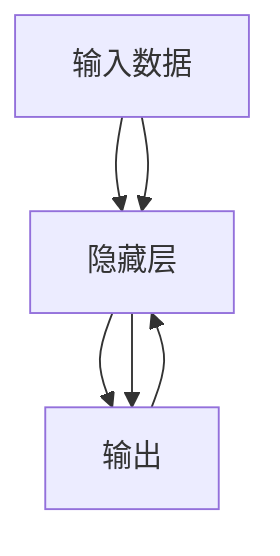
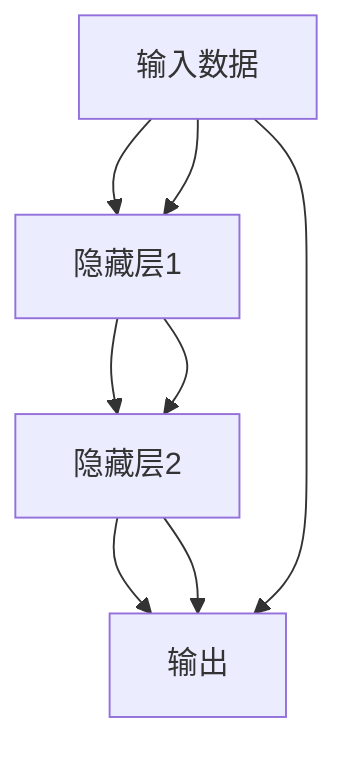

                 

## 1. 背景介绍

### 1.1 问题由来

随着人工智能技术的飞速发展，神经网络（Neural Networks, NNs）已广泛应用到图像识别、自然语言处理、语音识别等多个领域，并在诸多应用中取得了突破性进展。例如，深度卷积神经网络（Convolutional Neural Networks, CNNs）在图像分类、目标检测、图像生成等方面展现了强大的性能；递归神经网络（Recurrent Neural Networks, RNNs）及变体长短时记忆网络（LSTM, GRU）在自然语言处理和语音识别领域显示出了卓越的序列建模能力。

但与此同时，神经网络技术的发展也引发了诸多伦理、道德和社会问题。神经网络是否会取代人类，机器是否会拥有自我意识和决策能力，甚至成为人类的敌人？这些问题在科技界和社会各界引发了广泛讨论。因此，我们有必要深入研究神经网络的基本原理和应用，理解其与人类共存的可能性，以及如何通过技术手段确保其安全性和伦理合法性。

### 1.2 问题核心关键点

神经网络的核心在于其强大的数据建模和预测能力，其结构和学习机制具有高度的抽象性和复杂性。神经网络由神经元（Neurons）组成，通过前向传播和反向传播，利用大量数据进行训练，以生成复杂的非线性映射关系。

神经网络的核心概念包括：

- 前向传播：输入数据通过网络层逐层传递，每层输出作为下一层的输入，最终生成网络输出。
- 反向传播：根据输出误差调整网络参数，使得误差最小化，训练网络。
- 损失函数：衡量模型输出与真实标签之间差异的函数。
- 激活函数：决定神经元是否被激活的函数。
- 超参数：网络结构、学习率、正则化系数等，需要人工设置。

此外，神经网络在实际应用中，可能面临过拟合、泛化能力不足、计算资源消耗大等挑战，需要设计合适的优化策略和工程方法，确保模型的稳定性和可靠性。

## 2. 核心概念与联系

### 2.1 核心概念概述

神经网络是一种模拟人类大脑神经元处理信息的算法模型。其核心思想是通过多层神经元（即节点）的组合，构建一个复杂的非线性映射函数，以处理输入数据，生成期望的输出。神经网络的学习过程，是通过反向传播算法调整网络参数，最小化预测误差的过程。

神经网络的学习过程可以分为两个主要阶段：前向传播和反向传播。前向传播将输入数据逐层传递，生成网络输出。反向传播则根据输出误差，调整网络参数，使得误差最小化。

神经网络的核心概念和架构如下图所示：



其中，隐藏层是神经网络的计算核心，包含多个神经元。激活函数决定每个神经元是否被激活，以及激活的程度。损失函数衡量模型输出与真实标签之间的差异，是反向传播调整参数的依据。

### 2.2 核心概念原理和架构的 Mermaid 流程图

以下是一个简单的三层的神经网络结构图，其中包含一个输入层、两个隐藏层和一个输出层。



## 3. 核心算法原理 & 具体操作步骤

### 3.1 算法原理概述

神经网络的学习过程主要包括以下步骤：

1. **前向传播**：将输入数据通过神经网络逐层传递，最终生成网络输出。
2. **计算损失函数**：将网络输出与真实标签进行比较，计算损失函数。
3. **反向传播**：根据损失函数，计算梯度，更新网络参数。

前向传播和反向传播交替进行，通过多次迭代，最小化损失函数，最终获得训练好的神经网络模型。

### 3.2 算法步骤详解

神经网络的训练过程主要包括以下步骤：

1. **选择模型和超参数**：选择合适的神经网络结构（如卷积神经网络、循环神经网络）和超参数（如学习率、正则化系数）。
2. **准备数据集**：将训练数据和测试数据划分为训练集、验证集和测试集，进行数据预处理（如归一化、数据增强）。
3. **初始化模型参数**：初始化神经网络的权重和偏置。
4. **训练模型**：重复执行前向传播和反向传播，更新模型参数，直到达到预设的迭代次数或损失函数收敛。
5. **评估模型**：在测试集上评估模型性能，如准确率、召回率、F1分数等。

### 3.3 算法优缺点

神经网络具有以下优点：

- 强大的数据建模能力：能够处理非线性关系，生成复杂的映射函数。
- 泛化能力较强：通过足够的数据和合适的训练策略，能够适应不同的应用场景。
- 并行计算性能优异：适合在GPU等硬件上进行大规模并行计算。

但同时也存在以下缺点：

- 需要大量数据进行训练：小样本情况下容易过拟合。
- 训练过程复杂：需要大量的计算资源和时间。
- 可解释性不足：黑盒模型，难以解释内部决策过程。
- 计算资源消耗大：大规模神经网络需要高性能硬件支持。

### 3.4 算法应用领域

神经网络的应用领域非常广泛，涵盖了图像识别、自然语言处理、语音识别、推荐系统等多个领域。例如：

- 图像分类：通过卷积神经网络，对图像进行分类和目标检测。
- 语音识别：通过循环神经网络，对语音进行识别和转录。
- 机器翻译：通过序列到序列模型，将一种语言翻译成另一种语言。
- 推荐系统：通过协同过滤和深度学习模型，为用户推荐个性化内容。
- 自然语言生成：通过生成对抗网络（GAN），生成高质量的自然语言文本。

## 4. 数学模型和公式 & 详细讲解 & 举例说明

### 4.1 数学模型构建

神经网络可以表示为：

$$
y = f(\boldsymbol{W}x + b)
$$

其中，$y$ 为输出，$\boldsymbol{W}$ 为权重矩阵，$x$ 为输入，$b$ 为偏置向量，$f$ 为激活函数。

激活函数通常采用Sigmoid函数、ReLU函数或Tanh函数，决定神经元的输出。

### 4.2 公式推导过程

以简单的前向传播为例，公式推导如下：

- 输入层到隐藏层：

$$
\boldsymbol{h} = \boldsymbol{W}_1 \boldsymbol{x} + b_1
$$

- 隐藏层到输出层：

$$
\boldsymbol{y} = \boldsymbol{W}_2 \boldsymbol{h} + b_2
$$

其中，$\boldsymbol{x}$ 为输入向量，$\boldsymbol{h}$ 为隐藏层输出向量，$\boldsymbol{y}$ 为输出向量。

### 4.3 案例分析与讲解

以手写数字识别为例，使用简单的多层感知器（Multi-Layer Perceptron, MLP）进行训练。数据集采用MNIST手写数字数据集，包含60000个训练样本和10000个测试样本。

- **数据准备**：将训练数据和测试数据分别划分为训练集和验证集，进行归一化处理。
- **模型选择**：使用3层全连接神经网络，其中隐藏层包含256个神经元，输出层包含10个神经元（对应10个数字类别）。
- **模型初始化**：初始化权重矩阵和偏置向量，使用随机值。
- **模型训练**：使用交叉熵损失函数，通过反向传播算法更新权重矩阵和偏置向量。
- **模型评估**：在测试集上评估模型性能，使用准确率、召回率、F1分数等指标进行评估。

## 5. 项目实践：代码实例和详细解释说明

### 5.1 开发环境搭建

为了进行神经网络的项目实践，需要安装以下工具：

- PyTorch：一个开源的深度学习框架，支持Python语言。
- TensorFlow：另一个广泛使用的深度学习框架，支持C++和Python语言。
- Jupyter Notebook：一个交互式的编程环境，支持Python语言。

### 5.2 源代码详细实现

以下是使用PyTorch进行手写数字识别的完整代码实现：

```python
import torch
import torch.nn as nn
import torch.optim as optim
import torchvision
import torchvision.transforms as transforms
from torch.utils.data import DataLoader
from torchvision.datasets import MNIST

# 定义模型
class Net(nn.Module):
    def __init__(self):
        super(Net, self).__init__()
        self.fc1 = nn.Linear(28 * 28, 256)
        self.fc2 = nn.Linear(256, 10)

    def forward(self, x):
        x = x.view(-1, 28 * 28)
        x = torch.relu(self.fc1(x))
        x = self.fc2(x)
        return x

# 加载数据集
train_dataset = MNIST(root='./data', train=True, transform=transforms.ToTensor(), download=True)
test_dataset = MNIST(root='./data', train=False, transform=transforms.ToTensor(), download=True)

# 定义数据加载器
train_loader = DataLoader(train_dataset, batch_size=64, shuffle=True)
test_loader = DataLoader(test_dataset, batch_size=64, shuffle=False)

# 定义模型、损失函数和优化器
model = Net()
criterion = nn.CrossEntropyLoss()
optimizer = optim.Adam(model.parameters(), lr=0.001)

# 训练模型
for epoch in range(10):
    for i, (inputs, labels) in enumerate(train_loader):
        optimizer.zero_grad()
        outputs = model(inputs)
        loss = criterion(outputs, labels)
        loss.backward()
        optimizer.step()
        if (i + 1) % 100 == 0:
            print(f'Epoch [{epoch+1}/{10}], Step [{i+1}/{len(train_loader)}], Loss: {loss:.4f}')

# 评估模型
correct = 0
total = 0
with torch.no_grad():
    for inputs, labels in test_loader:
        outputs = model(inputs)
        _, predicted = torch.max(outputs.data, 1)
        total += labels.size(0)
        correct += (predicted == labels).sum().item()
print(f'Accuracy of the network on the 10000 test images: {100 * correct / total}%')
```

### 5.3 代码解读与分析

- **数据加载器**：使用PyTorch的DataLoader对数据集进行批处理和随机打乱。
- **模型定义**：定义多层感知器模型，包括两个全连接层和一个激活函数。
- **损失函数和优化器**：使用交叉熵损失函数和Adam优化器进行模型训练。
- **模型训练**：在每个epoch内，使用训练集进行前向传播和反向传播，更新模型参数。
- **模型评估**：在测试集上评估模型性能，输出准确率。

## 6. 实际应用场景

### 6.1 智能医疗

在智能医疗领域，神经网络被广泛应用在疾病诊断、影像分析、医疗推荐等方面。例如，使用卷积神经网络对医学影像进行分类和分割，使用循环神经网络对医疗记录进行分析和推荐，使用生成对抗网络（GAN）生成医疗图像等。

### 6.2 自动驾驶

在自动驾驶领域，神经网络被用于图像识别、目标检测、路径规划等任务。例如，使用卷积神经网络对道路图像进行分类和检测，使用循环神经网络进行路径规划和决策，使用生成对抗网络生成虚拟驾驶场景等。

### 6.3 金融科技

在金融科技领域，神经网络被用于风险评估、信用评分、欺诈检测等方面。例如，使用深度学习模型对客户信用记录进行评分，使用卷积神经网络对金融图像进行分类和检测，使用生成对抗网络生成虚拟交易场景等。

## 7. 工具和资源推荐

### 7.1 学习资源推荐

为了深入学习神经网络的基本原理和应用，以下是一些优秀的学习资源：

- 《深度学习》课程（Deep Learning Specialization）：由Coursera与Andrew Ng联合推出的深度学习课程，涵盖深度学习的基础和进阶内容。
- 《神经网络与深度学习》书籍：Ian Goodfellow、Yoshua Bengio和Aaron Courville合著的经典教材，全面介绍了神经网络和深度学习的理论基础和实践应用。
- Kaggle：一个数据科学竞赛平台，提供丰富的数据集和竞赛题目，帮助用户练习神经网络的开发和应用。

### 7.2 开发工具推荐

神经网络的开发和应用，离不开高效的工具和框架支持。以下是一些常用的开发工具和框架：

- PyTorch：一个开源的深度学习框架，支持Python语言。
- TensorFlow：另一个广泛使用的深度学习框架，支持C++和Python语言。
- Jupyter Notebook：一个交互式的编程环境，支持Python语言。
- Keras：一个高级神经网络框架，基于TensorFlow和Theano构建，提供简单易用的API。

### 7.3 相关论文推荐

神经网络技术的发展得益于众多研究者的贡献，以下是一些具有代表性的论文：

- AlexNet：ImageNet比赛的冠军，引入了卷积神经网络和ReLU激活函数。
- LeNet-5：手写数字识别的经典模型，引入了多层感知器和卷积神经网络。
- LSTM：循环神经网络的经典模型，广泛应用于自然语言处理和语音识别。
- GAN：生成对抗网络的经典模型，能够生成高质量的自然语言文本和图像。

## 8. 总结：未来发展趋势与挑战

### 8.1 研究成果总结

神经网络技术经过多年的发展，已经广泛应用于图像识别、自然语言处理、语音识别等多个领域。其强大的数据建模和预测能力，使得神经网络成为了人工智能技术的重要组成部分。

### 8.2 未来发展趋势

未来，神经网络技术将在以下领域继续发展：

- 更加复杂的模型结构：引入更多的卷积层、循环层和注意力机制，提升模型的性能和泛化能力。
- 更加高效的训练方法：引入更加高效的优化器、数据增强、模型压缩等技术，减少计算资源消耗。
- 更加广泛的应用场景：神经网络将在更多领域发挥作用，如自动驾驶、智能医疗、金融科技等。

### 8.3 面临的挑战

尽管神经网络技术取得了诸多成就，但仍面临以下挑战：

- 计算资源消耗大：大规模神经网络需要高性能硬件支持，如GPU和TPU。
- 过拟合问题：小样本情况下容易过拟合，需要设计更好的优化策略和数据增强方法。
- 可解释性不足：神经网络模型通常被视为黑盒，难以解释其内部决策过程。
- 伦理和道德问题：神经网络可能存在偏见和歧视，需要考虑伦理和道德问题。

### 8.4 研究展望

未来的研究将在以下几个方向继续探索：

- 神经网络的可解释性：通过引入可解释性技术，如模型压缩、可视化等，增强神经网络的透明性。
- 神经网络的伦理和道德问题：通过引入伦理导向的评估指标，过滤和惩罚有偏见和有害的输出倾向，确保神经网络的安全性和合法性。
- 神经网络的鲁棒性：通过引入更加鲁棒的训练方法和对抗训练技术，增强神经网络的鲁棒性和抗干扰能力。

## 9. 附录：常见问题与解答

**Q1：神经网络与传统机器学习模型的区别是什么？**

A：神经网络与传统机器学习模型的主要区别在于其结构和训练方式。神经网络由多个层次的神经元组成，通过前向传播和反向传播进行训练。而传统机器学习模型通常采用特征工程和手工设计的规则进行训练。神经网络能够处理更复杂的数据关系，适合处理非线性关系和序列数据。

**Q2：神经网络中的激活函数有哪些种类？**

A：神经网络中的激活函数有以下几种：

- Sigmoid函数：将输出限制在0到1之间，适用于二分类问题。
- Tanh函数：将输出限制在-1到1之间，适用于二分类和回归问题。
- ReLU函数：在输入大于0时输出，小于0时输出0，适用于隐藏层。
- Softmax函数：将输出映射到概率分布上，适用于多分类问题。

**Q3：神经网络中的损失函数有哪些种类？**

A：神经网络中的损失函数有以下几种：

- 均方误差（Mean Squared Error, MSE）：适用于回归问题。
- 交叉熵（Cross Entropy）：适用于分类问题。
- 对数损失（Log Loss）：适用于二分类问题。
- KL散度（Kullback-Leibler Divergence）：适用于度量模型输出的概率分布与真实概率分布之间的距离。

**Q4：如何避免神经网络的过拟合问题？**

A：避免神经网络的过拟合问题，通常有以下几种方法：

- 数据增强：通过旋转、缩放、裁剪等方式扩充训练集，增加数据多样性。
- 正则化：通过L1正则、L2正则、Dropout等方式约束模型参数，避免过拟合。
- 早停法：通过在验证集上监控模型性能，当性能不再提升时停止训练，避免过拟合。
- 模型简化：通过减少隐藏层数或神经元个数，简化模型结构，避免过拟合。

**Q5：神经网络的可解释性有哪些方法？**

A：神经网络的可解释性可以通过以下几种方法：

- 可视化技术：通过绘制梯度图、特征图等方式，理解神经网络内部决策过程。
- 模型压缩：通过剪枝、量化等方式，减小模型规模，增强可解释性。
- 可解释性算法：引入可解释性算法，如LIME、SHAP等，解释模型的决策过程。

---

作者：禅与计算机程序设计艺术 / Zen and the Art of Computer Programming

